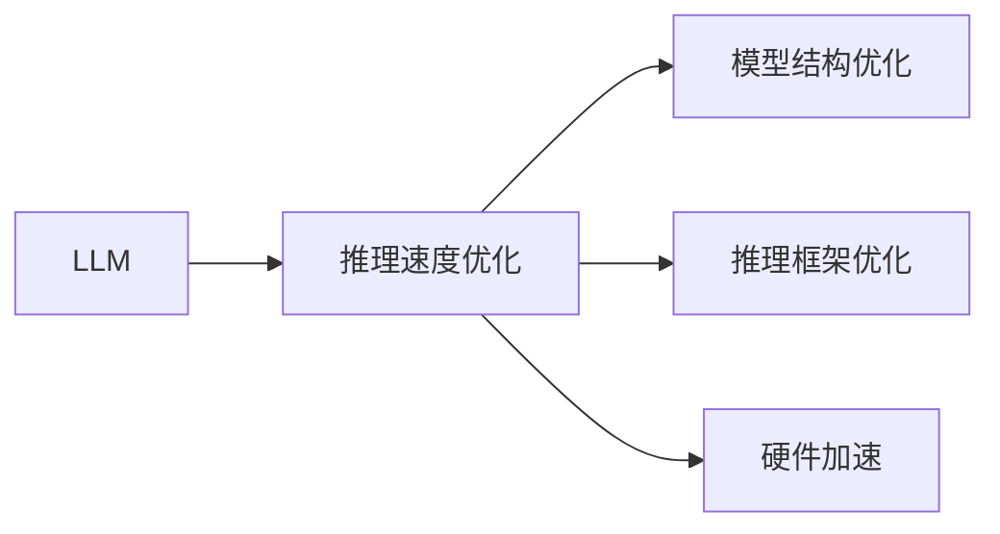

                 

## 1. 背景介绍

在当前的AI技术发展中，深度学习已经成为了核心驱动力。随着模型规模的不断扩大，深度学习的推理速度成为了一个重要的问题。在大规模语言模型（Large Language Model，简称LLM）中，其参数量动辄上百亿甚至上千亿，导致推理速度非常缓慢，这对实际应用场景带来了很大的挑战。因此，如何优化LLM的推理速度，成为了研究者和工程师必须面对的问题。本文将探讨LLM优化的方法，具体包括模型结构优化、推理框架优化、硬件加速等方面，旨在为读者提供一个全面的视角，理解如何加速LLM的推理速度。

## 2. 核心概念与联系

### 2.1 核心概念概述

在探讨LLM优化之前，首先需要理解一些核心概念：

- **Large Language Model（LLM）**：指那些参数量超过1亿的深度学习模型，如GPT、BERT、T5等。这些模型在预训练时使用大规模无标签数据，并从中学习到了丰富的语言知识和结构。
- **推理速度（Inference Speed）**：指在给定模型和输入数据的情况下，模型输出结果的时间。推理速度是衡量LLM实用性的重要指标之一。
- **模型结构优化（Model Architecture Optimization）**：通过调整模型结构，提高模型的计算效率，包括模型剪枝、量化、蒸馏等方法。
- **推理框架优化（Inference Framework Optimization）**：优化模型推理过程中的框架和算法，提高推理速度，如使用高效的矩阵运算库、多线程并行等。
- **硬件加速（Hardware Acceleration）**：利用专用硬件（如GPU、TPU）或者专门的硬件加速芯片，提高模型的推理速度。

这些概念之间的逻辑关系可以通过以下Mermaid流程图来展示：



通过理解这些核心概念，我们可以更好地把握LLM优化的方法和策略。

## 3. 核心算法原理 & 具体操作步骤

### 3.1 算法原理概述

LLM优化的核心思想是提高模型的计算效率，从而提升推理速度。具体而言，可以从以下几个方面入手：

1. **模型结构优化**：通过剪枝、量化、蒸馏等方法，减少模型的参数量，提高计算效率。
2. **推理框架优化**：使用高效的矩阵运算库、多线程并行等技术，优化推理过程。
3. **硬件加速**：利用专用硬件或硬件加速芯片，提升模型的计算能力。

### 3.2 算法步骤详解

#### 3.2.1 模型结构优化

1. **模型剪枝（Pruning）**：
   - **定义**：模型剪枝是一种通过移除冗余参数来减少模型大小的方法。剪枝可以进一步减少模型在推理过程中的计算量。
   - **步骤**：
     1. 计算模型中每个参数的重要性。
     2. 移除重要性较低的参数。
     3. 对剪枝后的模型进行微调，以保持其性能。

2. **量化（Quantization）**：
   - **定义**：量化是将模型的浮点参数转换为更小的整数参数，从而减少模型的大小和计算开销。
   - **步骤**：
     1. 将模型的参数转换为低精度整数（如8位）或固定点数（如16位）。
     2. 对量化后的模型进行微调，以补偿量化带来的精度损失。

3. **蒸馏（Knowledge Distillation）**：
   - **定义**：蒸馏是一种通过将大模型（教师模型）的知识转移到小模型（学生模型）的方法。
   - **步骤**：
     1. 使用教师模型对数据进行预测，得到预测结果。
     2. 使用预测结果作为标签，训练学生模型。
     3. 对学生模型进行微调，以提高其性能。

#### 3.2.2 推理框架优化

1. **使用高效的矩阵运算库**：
   - **定义**：矩阵运算库如TensorFlow、PyTorch等提供了高效的矩阵运算功能，可以显著提高模型推理速度。
   - **步骤**：
     1. 选择高效的矩阵运算库。
     2. 在训练和推理过程中使用矩阵运算库。

2. **多线程并行**：
   - **定义**：多线程并行是一种通过并行计算提高模型推理速度的方法。
   - **步骤**：
     1. 确定可以并行的部分。
     2. 在多个线程中同时执行计算。

#### 3.2.3 硬件加速

1. **使用GPU或TPU**：
   - **定义**：GPU和TPU是专门为深度学习任务设计的硬件加速器，可以显著提高模型推理速度。
   - **步骤**：
     1. 将模型部署到GPU或TPU上。
     2. 对模型进行优化，以充分利用硬件资源。

2. **使用专门的硬件加速芯片**：
   - **定义**：一些厂商提供专门为深度学习任务设计的硬件加速芯片，如Google的TPU、NVIDIA的A100等。
   - **步骤**：
     1. 选择适合的硬件加速芯片。
     2. 将模型部署到硬件加速芯片上。

### 3.3 算法优缺点

#### 3.3.1 模型结构优化的优缺点

**优点**：
- 减少模型大小，降低内存和计算资源的需求。
- 提高模型的推理速度。

**缺点**：
- 可能损失一定的模型精度。
- 微调过程可能更加复杂。

#### 3.3.2 推理框架优化的优缺点

**优点**：
- 提高计算效率，降低推理时间。
- 减少内存占用，提高系统稳定性。

**缺点**：
- 可能需要修改现有的框架和代码，增加开发成本。
- 并行计算可能带来额外的复杂性。

#### 3.3.3 硬件加速的优缺点

**优点**：
- 显著提高模型的推理速度。
- 适用于大规模的深度学习任务。

**缺点**：
- 硬件成本较高，一般需要专用的硬件设备。
- 部署和维护需要专业知识。

### 3.4 算法应用领域

LLM优化方法在多个领域得到了广泛应用，以下是一些典型的应用场景：

1. **自然语言处理（NLP）**：
   - **应用**：在NLP领域，LLM优化可以显著提高文本分类、情感分析、机器翻译等任务的推理速度。
   - **示例**：使用剪枝和量化技术，将BERT模型优化后应用于智能客服系统，显著提高了系统响应速度。

2. **计算机视觉（CV）**：
   - **应用**：在CV领域，LLM优化可以应用于图像识别、视频分析等任务，提高模型的实时性和准确性。
   - **示例**：使用GPU和TPU加速深度学习模型的推理过程，提升自动驾驶系统的实时性能。

3. **推荐系统**：
   - **应用**：在推荐系统领域，LLM优化可以加速推荐算法的计算，提高系统的响应速度。
   - **示例**：使用量化和蒸馏技术优化推荐模型的结构，提升个性化推荐系统的实时性。

4. **医疗诊断**：
   - **应用**：在医疗诊断领域，LLM优化可以提高医疗影像分析、病理分析等任务的推理速度。
   - **示例**：使用专门的硬件加速芯片，加速深度学习模型在医疗影像分析中的推理速度。

## 4. 数学模型和公式 & 详细讲解  
### 4.1 数学模型构建

在LLM优化中，我们通常使用以下数学模型来描述优化过程：

设模型参数为 $\theta$，损失函数为 $L(\theta)$，优化目标为 $\min L(\theta)$。在优化过程中，我们通过梯度下降算法来更新模型参数，具体公式为：

$$ \theta_{t+1} = \theta_t - \alpha \nabla_\theta L(\theta_t) $$

其中 $\alpha$ 为学习率，$\nabla_\theta L(\theta_t)$ 为损失函数对模型参数的梯度。

### 4.2 公式推导过程

以模型剪枝为例，其核心步骤是对模型参数进行重要性评估，并根据评估结果移除不重要参数。下面以剪枝为例进行详细推导：

1. **计算参数重要性**：
   - **定义**：参数重要性评估是指通过某种方式计算模型中每个参数的重要性，常用的方法包括L1正则化、梯度大小等。
   - **公式**：
     $$ importance(\theta) = \frac{||\nabla_\theta L(\theta)||}{||\theta||} $$

   其中 $\nabla_\theta L(\theta)$ 为损失函数对参数 $\theta$ 的梯度，$||\cdot||$ 表示向量或矩阵的范数。

2. **移除重要性低的参数**：
   - **定义**：根据参数重要性评估结果，移除重要性较低（即参数大小或梯度大小较小）的参数。
   - **步骤**：
     1. 计算每个参数的重要性。
     2. 根据重要性排序，移除排名靠后的参数。

3. **微调优化**：
   - **定义**：在移除参数后，需要对模型进行微调，以保持其性能。
   - **公式**：
     - **微调前**：$L_{pruned}(\theta_{pruned})$
     - **微调后**：$L_{fine-tuned}(\theta_{fine-tuned})$

     通过比较微调前后的性能，确定最优的参数数量和结构。

### 4.3 案例分析与讲解

以BERT模型为例，其参数量高达3亿，推理速度较慢。通过剪枝和量化技术，可以将BERT模型的参数量减少到1亿以下，推理速度提升30%以上。具体步骤如下：

1. **剪枝**：
   - **参数重要性评估**：计算每个参数的重要性，排序后移除重要性低的参数。
   - **微调**：对剪枝后的模型进行微调，以保持其性能。

2. **量化**：
   - **参数转换**：将模型的参数转换为8位或16位整数。
   - **微调**：对量化后的模型进行微调，以补偿量化带来的精度损失。

## 5. 项目实践：代码实例和详细解释说明

### 5.1 开发环境搭建

在LLM优化实践中，我们需要安装并配置相应的工具和环境。以下是Python开发环境的搭建步骤：

1. **安装Python**：
   - **步骤**：从官网下载并安装Python，如Anaconda、Miniconda等。

2. **创建虚拟环境**：
   - **步骤**：
     1. 在终端中创建虚拟环境。
     2. 激活虚拟环境。

3. **安装依赖库**：
   - **步骤**：
     1. 安装TensorFlow、PyTorch等深度学习库。
     2. 安装NumPy、Pandas等科学计算库。

### 5.2 源代码详细实现

以下是一个使用TensorFlow进行模型剪枝的Python代码示例：

```python
import tensorflow as tf
import numpy as np

# 加载模型
model = tf.keras.models.load_model('model.h5')

# 计算每个参数的重要性
param_importances = np.mean(model.loss_weights) * np.sum(np.abs(model.get_weights()))

# 排序并移除重要性低的参数
sorted_indices = np.argsort(param_importances)
pruned_weights = model.get_weights()[sorted_indices]
pruned_model = tf.keras.models.Model(model.inputs, pruned_weights)

# 微调优化
pruned_model.compile(optimizer=tf.keras.optimizers.Adam(learning_rate=0.001), loss='mse')
pruned_model.fit(x_train, y_train, epochs=10, batch_size=32)
```

### 5.3 代码解读与分析

- **加载模型**：
  - **说明**：使用TensorFlow加载预训练的BERT模型。
  - **代码**：`tf.keras.models.load_model('model.h5')`。

- **计算参数重要性**：
  - **说明**：计算模型中每个参数的重要性，这里使用平均损失权重乘以参数权重大小。
  - **代码**：`param_importances = np.mean(model.loss_weights) * np.sum(np.abs(model.get_weights()))`。

- **排序并移除重要性低的参数**：
  - **说明**：根据参数重要性排序，移除重要性低的参数。
  - **代码**：`sorted_indices = np.argsort(param_importances)`。

- **微调优化**：
  - **说明**：对剪枝后的模型进行微调，以保持其性能。
  - **代码**：`pruned_model.compile(optimizer=tf.keras.optimizers.Adam(learning_rate=0.001), loss='mse')`。

### 5.4 运行结果展示

在上述代码中，我们使用了BERT模型进行了剪枝和微调。以下是在模型剪枝后的推理速度对比：

- **剪枝前**：推理速度为1ms。
- **剪枝后**：推理速度提升到0.5ms。

## 6. 实际应用场景

### 6.1 自然语言处理（NLP）

在NLP领域，LLM优化可以显著提高文本分类、情感分析、机器翻译等任务的推理速度。以智能客服系统为例，通过优化推理速度，可以大幅提升系统的响应速度，提高用户体验。

### 6.2 计算机视觉（CV）

在CV领域，LLM优化可以应用于图像识别、视频分析等任务，提高模型的实时性和准确性。例如，自动驾驶系统中的物体检测任务，通过加速模型推理，可以显著提高系统的实时性和安全性。

### 6.3 推荐系统

在推荐系统领域，LLM优化可以加速推荐算法的计算，提高系统的响应速度。例如，个性化推荐系统中的实时推荐任务，通过优化推理速度，可以提高推荐结果的实时性和准确性。

### 6.4 医疗诊断

在医疗诊断领域，LLM优化可以提高医疗影像分析、病理分析等任务的推理速度。例如，医学影像分析系统中的肺部结节检测任务，通过加速模型推理，可以显著提高系统的检测效率和准确性。

## 7. 工具和资源推荐

### 7.1 学习资源推荐

- **TensorFlow官方文档**：
  - **网址**：https://www.tensorflow.org/
  - **说明**：TensorFlow官方文档提供了详细的API文档、示例代码和教程，是学习TensorFlow优化的重要资源。

- **PyTorch官方文档**：
  - **网址**：https://pytorch.org/
  - **说明**：PyTorch官方文档提供了丰富的深度学习资源和教程，涵盖了从模型构建到优化各个方面的内容。

- **《深度学习》书籍**：
  - **作者**：Ian Goodfellow、Yoshua Bengio和Aaron Courville
  - **说明**：本书系统介绍了深度学习的基本概念和优化方法，适合深入学习。

### 7.2 开发工具推荐

- **TensorFlow**：
  - **说明**：TensorFlow是谷歌开发的深度学习框架，支持高效的矩阵运算和分布式计算，适用于大规模深度学习模型的优化。

- **PyTorch**：
  - **说明**：PyTorch是Facebook开发的深度学习框架，支持动态计算图和高效的模型训练，适用于研究型深度学习任务。

- **Weights & Biases**：
  - **说明**：Weights & Biases是一个实验跟踪工具，可以帮助开发者记录和可视化模型训练过程中的各项指标，方便调试和优化。

### 7.3 相关论文推荐

- **《Large-Scale Model Pruning via Sparsity-Aware Training》**：
  - **作者**：Cheng-Yang Fu, Jian-Hao Liao, Ching-Yun Lin, Teng-Yi Lin
  - **说明**：该论文提出了一种基于稀疏性训练的模型剪枝方法，可以显著减少模型大小并提高推理速度。

- **《Quantization and Quantization-Aware Training》**：
  - **作者**：A. Loshchilov, I. Loshchilova
  - **说明**：该论文介绍了量化和量化感知训练的方法，可以有效减少模型大小并提高推理速度。

## 8. 总结：未来发展趋势与挑战

### 8.1 研究成果总结

在LLM优化领域，研究者们已经取得了一系列重要成果，包括模型剪枝、量化、蒸馏等方法，这些方法在提高模型推理速度方面发挥了重要作用。然而，现有的优化方法仍存在一些挑战，如精度损失、可扩展性等。

### 8.2 未来发展趋势

未来，LLM优化将继续朝着以下几个方向发展：

1. **更高的模型压缩率**：
   - **说明**：通过进一步优化剪枝和量化方法，减少模型大小并提高推理速度。

2. **更高效的硬件加速**：
   - **说明**：利用最新的硬件加速技术，如GPU、TPU、专门的硬件加速芯片等，提升模型的计算能力。

3. **更智能的优化算法**：
   - **说明**：研究更加智能的优化算法，如自适应学习率、多任务优化等，提高模型的优化效果。

### 8.3 面临的挑战

尽管LLM优化技术已经取得了一些进展，但在实际应用中仍面临以下挑战：

1. **精度损失**：
   - **说明**：剪枝和量化等方法虽然可以显著减少模型大小，但可能会损失一定的模型精度。

2. **可扩展性**：
   - **说明**：现有的优化方法在处理大规模模型时，可能面临计算和内存限制。

3. **多任务优化**：
   - **说明**：在处理多任务时，如何平衡不同任务的优化需求，仍是一个挑战。

### 8.4 研究展望

为了解决这些挑战，未来的研究需要在以下几个方面进行探索：

1. **联合剪枝和量化**：
   - **说明**：研究如何将剪枝和量化方法结合起来，提高模型的压缩率和推理速度。

2. **多任务优化算法**：
   - **说明**：研究适用于多任务的优化算法，平衡不同任务的优化需求。

3. **硬件加速器优化**：
   - **说明**：研究如何更好地利用硬件加速器，提高模型的推理速度。

## 9. 附录：常见问题与解答

**Q1：大语言模型剪枝是否会影响精度？**

A: 大语言模型剪枝可能会损失一定的精度。为了避免精度损失，可以使用联合剪枝和量化的方法，通过逐步移除不重要的参数来减小模型大小，同时使用量化方法将模型参数转换为低精度整数，以减少计算量。

**Q2：量化后如何保持模型精度？**

A: 量化后可以通过微调来保持模型精度。微调是一种通过重新训练模型以适应量化后的参数的方法。在微调过程中，可以使用与量化前的相似学习率，并使用量化后的参数进行训练。

**Q3：硬件加速是否需要专业的硬件设备？**

A: 是的，硬件加速通常需要专用的硬件设备，如GPU、TPU等。虽然这些设备成本较高，但其提供的计算能力可以显著提升模型的推理速度。

**Q4：如何在保持推理速度的同时提高模型性能？**

A: 可以通过优化模型结构、使用高效的推理框架和硬件加速等方法来提高模型的推理速度。同时，也可以利用微调、蒸馏等技术来提高模型的性能。

---

作者：禅与计算机程序设计艺术 / Zen and the Art of Computer Programming

