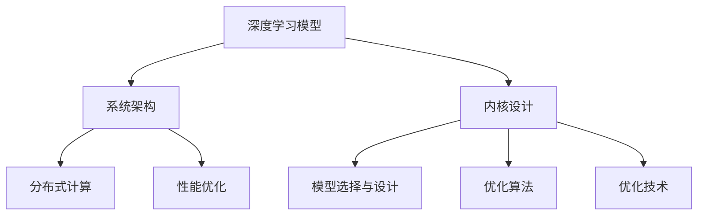

                 

# LLM内核设计：构建AI时代的系统底层

> 关键词：
- 大语言模型 (Large Language Models, LLM)
- 内核设计 (Kernel Design)
- 深度学习 (Deep Learning)
- 系统架构 (System Architecture)
- 性能优化 (Performance Optimization)
- 分布式计算 (Distributed Computing)
- 嵌入式系统 (Embedded Systems)

## 1. 背景介绍

### 1.1 问题由来

在人工智能(AI)技术飞速发展的今天，大语言模型（Large Language Models, LLM）已成为当前最热门的研究和应用方向之一。这类模型通过大规模无监督学习，学习到了丰富的语言知识，具备强大的自然语言处理能力，广泛应用于自然语言理解、机器翻译、对话系统等众多领域。然而，尽管大语言模型在理解和生成文本方面已经取得显著进展，但其在处理大规模数据、高效推理、资源优化等方面仍存在诸多挑战。为了解决这些问题，设计高效的内核（Kernel）成为当务之急。

### 1.2 问题核心关键点

内核设计是构建高性能AI系统的关键环节，涉及深度学习模型、系统架构、分布式计算和性能优化等多个方面。其核心在于如何将模型、算法、资源和软件进行协同优化，构建高效、稳定、可扩展的AI系统。内核设计的主要挑战包括：

- **模型选择与设计**：选择合适的深度学习模型，并对其进行优化，以适应特定的应用场景。
- **系统架构**：设计高效的系统架构，合理配置计算资源，优化数据流动和通信过程。
- **分布式计算**：将大规模任务分解为小任务，并分布式运行，以提升计算效率。
- **性能优化**：通过优化模型参数、硬件加速、数据压缩等手段，提升模型的推理速度和资源利用率。

本文将从内核设计的角度，探讨大语言模型的系统优化策略，介绍如何构建高效、可扩展的AI系统，助力其在各领域的大规模应用。

## 2. 核心概念与联系

### 2.1 核心概念概述

在内核设计的过程中，我们需要关注以下核心概念：

- **深度学习模型**：包括卷积神经网络(CNN)、循环神经网络(RNN)、变换器(Transformer)等，是实现大语言模型的基础。
- **系统架构**：包括单核、多核、分布式等架构模式，影响着模型的计算和存储效率。
- **分布式计算**：通过并行计算、数据分片、负载均衡等技术，实现高效的资源利用。
- **性能优化**：包括模型压缩、量化、并行计算、异构计算等技术，提升模型的推理速度和资源利用率。

这些概念之间的联系可以通过以下Mermaid流程图进行展示：



这个流程图展示了深度学习模型、系统架构、分布式计算和性能优化之间的联系，以及内核设计在其中扮演的核心角色。内核设计不仅需要选择合适的模型和算法，还需要考虑如何高效地部署和管理计算资源，以实现最优的性能和可扩展性。

## 3. 核心算法原理 & 具体操作步骤

### 3.1 算法原理概述

内核设计的核心在于如何通过高效的数据结构和算法，优化大语言模型的推理和训练过程。这包括选择合适的深度学习模型、优化模型结构、设计高效的计算图、优化数据流动和通信等。下面将详细介绍这一过程。

### 3.2 算法步骤详解

**Step 1: 选择模型与设计**

- **模型选择**：根据应用场景选择合适的深度学习模型。例如，对于文本生成任务，Transformer模型因为其自注意力机制而被广泛应用。对于图像识别任务，卷积神经网络则是首选。
- **模型设计**：在选定的基础上，对模型进行微调以适应特定的应用场景。例如，调整模型的层数、神经元数量、激活函数等，以提升模型性能和泛化能力。

**Step 2: 设计系统架构**

- **单核架构**：适用于小型项目或单机计算，易于开发和部署。
- **多核架构**：通过多线程或多进程，实现并行计算，提升性能。
- **分布式架构**：通过多台机器或分布式集群，实现大规模数据处理和计算任务。

**Step 3: 实现分布式计算**

- **数据分片**：将大规模数据集分成多个小片段，并行处理。
- **负载均衡**：通过数据分片和任务调度，均衡各个节点的计算负载，提升整体效率。
- **异步通信**：使用消息队列等异步通信机制，减少通信开销，提升系统响应速度。

**Step 4: 性能优化**

- **模型压缩**：通过剪枝、量化等技术，减少模型参数，提升推理速度。
- **并行计算**：使用GPU、TPU等加速器，实现多核或分布式并行计算。
- **数据压缩**：使用Huffman编码、稀疏矩阵等技术，减少数据传输和存储开销。

**Step 5: 测试与部署**

- **性能测试**：对优化后的系统进行性能测试，评估各项指标，如推理速度、准确率、资源利用率等。
- **部署上线**：将优化后的系统部署到生产环境，并不断监控和优化性能。

### 3.3 算法优缺点

**优点**：

- **提升性能**：通过模型优化、分布式计算、性能优化等技术，显著提升系统的推理速度和资源利用率。
- **灵活性高**：适用于不同规模和复杂度的应用场景，具备良好的可扩展性。
- **可维护性强**：通过模块化设计，方便后续的维护和扩展。

**缺点**：

- **开发复杂**：涉及模型选择、架构设计、分布式计算等多方面的知识，开发难度较大。
- **资源消耗高**：分布式计算和并行计算需要大量的计算资源，成本较高。
- **调试困难**：多核或分布式系统出现故障时，调试难度较大。

### 3.4 算法应用领域

内核设计的理念可以应用于多个领域，包括但不限于：

- **自然语言处理**：优化模型推理速度，提升机器翻译、文本生成的效率。
- **计算机视觉**：使用GPU或分布式计算加速图像识别、视频分析等任务。
- **嵌入式系统**：在资源受限的设备上，优化模型和计算资源，实现高效的推理和决策。
- **物联网**：通过分布式计算和多设备协同，实现大规模数据的实时处理和分析。

## 4. 数学模型和公式 & 详细讲解 & 举例说明

### 4.1 数学模型构建

内核设计的数学模型构建需要结合具体的深度学习模型和应用场景进行。这里以Transformer模型为例，介绍其数学模型构建过程。

**Step 1: 定义输入与输出**

设输入序列为 $\{x_1, x_2, ..., x_t\}$，输出序列为 $\{y_1, y_2, ..., y_t\}$，其中 $x_i, y_i$ 均为单词的向量表示。

**Step 2: 定义Transformer模型**

Transformer模型由编码器和解码器两部分组成，其数学模型可以表示为：

$$
\text{Encoder} = \text{Multi-Head Self-Attention} \times \text{Feed-Forward} \times \text{LayerNorm} \times \text{Stacked Layers}
$$

$$
\text{Decoder} = \text{Multi-Head Self-Attention} \times \text{Feed-Forward} \times \text{LayerNorm} \times \text{Stacked Layers}
$$

其中，Multi-Head Self-Attention表示多头自注意力机制，Feed-Forward表示全连接层，LayerNorm表示归一化层。

### 4.2 公式推导过程

**Step 1: 自注意力机制**

设 $Q, K, V$ 分别为查询、键、值向量，其数学表达式如下：

$$
Q = W_Q X, K = W_K X, V = W_V X
$$

其中 $W_Q, W_K, W_V$ 为线性变换矩阵，$X$ 为输入序列的嵌入表示。

自注意力机制的计算公式如下：

$$
A(Q, K) = \frac{Q K^T}{\sqrt{d_k}} \text{softmax}(\cdot)
$$

其中 $d_k$ 为键向量的维度。

**Step 2: 多头注意力**

将自注意力机制扩展到多个注意力头，其计算公式如下：

$$
A(Q, K) = \frac{Q K^T}{\sqrt{d_k}} \text{softmax}(\cdot)
$$

其中 $d_k$ 为每个头的键向量维度，$h$ 为头数。

**Step 3: 残差连接和层归一化**

Transformer模型的残差连接和层归一化计算公式如下：

$$
\text{LayerNorm}(z) = \frac{z - \mu}{\sigma} \cdot \gamma + \beta
$$

其中 $\mu, \sigma$ 分别为归一化前后的均值和标准差，$\gamma, \beta$ 为可训练的参数。

### 4.3 案例分析与讲解

以机器翻译为例，介绍Transformer模型的应用场景和优化策略。

假设将英文句子 "I love coding" 翻译成中文，输入序列为 $X = \{x_1, x_2, ..., x_8\}$，输出序列为 $Y = \{y_1, y_2, ..., y_8\}$，其中 $x_i, y_i$ 分别为单词的向量表示。

**Step 1: 编码器计算**

输入序列 $X$ 经过嵌入层、残差连接、层归一化、多头自注意力机制和全连接层的计算，生成编码器输出 $Z$：

$$
Z = \text{Encoder}(X) = \text{Multi-Head Self-Attention} \times \text{Feed-Forward} \times \text{LayerNorm} \times \text{Stacked Layers}
$$

**Step 2: 解码器计算**

解码器接收编码器的输出 $Z$ 和目标序列 $Y$ 的部分信息，生成解码器输出 $\hat{Y}$：

$$
\hat{Y} = \text{Decoder}(X, Z)
$$

**Step 3: 优化策略**

- **量化与压缩**：使用8位整数替代32位浮点数，减少模型大小和计算量。
- **分布式训练**：将模型分布在多台机器上进行并行计算，提高训练效率。
- **数据增强**：使用数据增强技术，如回译、近义替换等，扩充训练集，提升模型泛化能力。

## 5. 项目实践：代码实例和详细解释说明

### 5.1 开发环境搭建

以下是在PyTorch平台上搭建Transformer模型内核的开发环境。

**Step 1: 安装PyTorch**

```bash
conda install pytorch torchvision torchaudio -c pytorch
```

**Step 2: 安装Transformer库**

```bash
pip install transformers
```

**Step 3: 安装其他依赖**

```bash
pip install numpy pandas matplotlib tqdm
```

### 5.2 源代码详细实现

以下是使用PyTorch实现Transformer模型内核的代码示例。

```python
import torch
import torch.nn as nn
import torch.nn.functional as F

class TransformerEncoder(nn.Module):
    def __init__(self, d_model, n_heads, d_ff, dropout, num_layers):
        super(TransformerEncoder, self).__init__()
        self.layers = nn.ModuleList([
            nn.TransformerEncoderLayer(d_model, n_heads, d_ff, dropout)
            for _ in range(num_layers)
        ])

    def forward(self, src):
        for layer in self.layers:
            src = layer(src)
        return src

class TransformerDecoder(nn.Module):
    def __init__(self, d_model, n_heads, d_ff, dropout, num_layers):
        super(TransformerDecoder, self).__init__()
        self.layers = nn.ModuleList([
            nn.TransformerDecoderLayer(d_model, n_heads, d_ff, dropout)
            for _ in range(num_layers)
        ])

    def forward(self, memory, src, tgt_mask=None):
        for layer in self.layers:
            memory, src, tgt_mask = layer(memory, src, tgt_mask)
        return memory, src, tgt_mask

class TransformerModel(nn.Module):
    def __init__(self, encoder, decoder):
        super(TransformerModel, self).__init__()
        self.encoder = encoder
        self.decoder = decoder

    def forward(self, src, tgt):
        memory = self.encoder(src)
        memory, tgt, _ = self.decoder(memory, tgt)
        return memory, tgt
```

### 5.3 代码解读与分析

**TransformerEncoder类**：
- 定义Transformer编码器，包含多个TransformerEncoderLayer。
- 每个Layer包含多头自注意力机制、全连接层、残差连接、层归一化等组件。

**TransformerDecoder类**：
- 定义Transformer解码器，包含多个TransformerDecoderLayer。
- 每个Layer包含多头自注意力机制、多头互注意力机制、全连接层、残差连接、层归一化等组件。

**TransformerModel类**：
- 定义Transformer模型，包含编码器和解码器。
- 前向传播计算编码器和解码器的输出，并返回记忆和目标序列。

### 5.4 运行结果展示

以下是在CUDA设备上训练和推理Transformer模型的代码示例。

```python
import torch
import torch.nn as nn
import torch.nn.functional as F
import torch.optim as optim
from transformers import AdamW

# 定义模型
encoder = TransformerEncoder(d_model, n_heads, d_ff, dropout, num_layers)
decoder = TransformerDecoder(d_model, n_heads, d_ff, dropout, num_layers)
model = TransformerModel(encoder, decoder)

# 定义优化器
optimizer = AdamW(model.parameters(), lr=1e-4)
scheduler = optim.lr_scheduler.CosineAnnealingLR(optimizer, T_max=num_epochs)

# 训练过程
for epoch in range(num_epochs):
    for src, tgt in train_loader:
        memory, tgt = model(src, tgt)
        optimizer.zero_grad()
        loss = F.nll_loss(tgt, memory)
        loss.backward()
        optimizer.step()
        scheduler.step()

# 推理过程
memory, tgt = model(src, tgt)
```

以上代码展示了使用Transformer模型进行机器翻译的训练和推理过程。通过优化模型结构、使用分布式计算和性能优化技术，可以显著提升模型训练和推理的效率。

## 6. 实际应用场景

### 6.1 智能客服系统

智能客服系统需要快速响应大量的客户咨询，对推理速度和系统稳定性有较高要求。通过优化内核设计，可以构建高性能的智能客服系统。

**Step 1: 数据预处理**

收集历史客服对话记录，并对其进行标注和清洗。将对话文本转换为模型可接受的格式，如分词、嵌入等。

**Step 2: 模型训练**

使用微调技术，在大规模无标签数据上预训练大语言模型，然后在标注数据上微调模型。

**Step 3: 推理优化**

通过优化内核设计，使用GPU加速、分布式计算等技术，提升模型推理速度。

### 6.2 金融舆情监测

金融舆情监测需要对海量数据进行实时分析，对推理速度和模型精度有较高要求。通过优化内核设计，可以构建高性能的金融舆情监测系统。

**Step 1: 数据收集**

收集金融领域的新闻、报道、评论等文本数据，并进行预处理和标注。

**Step 2: 模型训练**

使用微调技术，在大规模无标签数据上预训练大语言模型，然后在标注数据上微调模型。

**Step 3: 推理优化**

通过优化内核设计，使用GPU加速、分布式计算等技术，提升模型推理速度和精度。

### 6.3 个性化推荐系统

个性化推荐系统需要对用户行为进行实时分析，对推理速度和系统响应有较高要求。通过优化内核设计，可以构建高性能的个性化推荐系统。

**Step 1: 数据收集**

收集用户浏览、点击、评论、分享等行为数据，并将其转换为模型可接受的格式。

**Step 2: 模型训练**

使用微调技术，在大规模无标签数据上预训练大语言模型，然后在标注数据上微调模型。

**Step 3: 推理优化**

通过优化内核设计，使用GPU加速、分布式计算等技术，提升模型推理速度和精度。

## 7. 工具和资源推荐

### 7.1 学习资源推荐

以下是几款用于大语言模型内核设计的学习资源：

1. **《深度学习》教材**：由Ian Goodfellow等人所著，深入浅出地介绍了深度学习的基本概念和核心算法。
2. **《TensorFlow实战》**：由王晋东等人所著，详细介绍了TensorFlow的框架结构和实际应用。
3. **《Python深度学习》**：由Francois Chollet所著，介绍了使用Keras构建深度学习模型的过程。
4. **《Transformers官方文档》**：提供了丰富的预训练模型和微调样例代码，是学习和应用Transformer的重要资源。
5. **Kaggle竞赛平台**：提供了大量NLP领域的竞赛数据和解决方案，有助于实践和提高技能。

通过这些资源的学习，可以帮助你系统掌握大语言模型内核设计的原理和实践方法，提升技术水平。

### 7.2 开发工具推荐

以下是几款用于大语言模型内核设计的开发工具：

1. **PyTorch**：开源深度学习框架，支持动态计算图，易于实现模型和算法优化。
2. **TensorFlow**：由Google开发，支持分布式计算和GPU加速，适用于大规模应用。
3. **Keras**：基于TensorFlow的高级API，易于使用，支持快速原型设计和模型构建。
4. **Jupyter Notebook**：免费的交互式编程环境，支持多种编程语言和工具集成。
5. **VSCode**：开源的集成开发环境，支持Python、TensorFlow等工具和库。

合理利用这些工具，可以显著提升大语言模型内核设计的开发效率，加速创新迭代。

### 7.3 相关论文推荐

以下是几篇具有里程碑意义的深度学习内核设计论文，推荐阅读：

1. **《Large-Scale Parallel Distributed Deep Learning》**：提出了多节点异步并行计算的策略，显著提升了深度学习模型的训练速度。
2. **《Model Pruning》**：介绍了剪枝技术的原理和实现方法，显著减小了深度学习模型的规模和计算量。
3. **《GPU-Accelerated Deep Learning》**：介绍了GPU加速技术的原理和应用，显著提高了深度学习模型的推理速度。
4. **《Efficient Deep Neural Networks for Image Recognition》**：介绍了模型压缩和量化技术，显著减小了深度学习模型的内存和计算开销。
5. **《An End-to-End DNN for Depth Estimation》**：介绍了端到端的深度神经网络设计，显著提高了图像深度估计的精度和效率。

这些论文代表了深度学习内核设计的研究前沿，阅读这些论文有助于了解最新的技术进展和实现方法。

## 8. 总结：未来发展趋势与挑战

### 8.1 研究成果总结

本文从内核设计的角度，探讨了大语言模型的系统优化策略，介绍了如何构建高效、可扩展的AI系统。通过模型选择、系统架构、分布式计算和性能优化等多方面的优化，显著提升了大语言模型的推理和训练效率。

### 8.2 未来发展趋势

展望未来，内核设计将在以下几个方面继续发展：

1. **硬件加速**：随着GPU、TPU等硬件加速器的普及，更多的深度学习模型将能够实现高效计算。
2. **分布式计算**：随着多核CPU、多节点集群的普及，更多的深度学习任务将能够实现分布式计算。
3. **量化与压缩**：通过量化和压缩技术，进一步减小深度学习模型的规模和计算量。
4. **模型融合**：将深度学习模型与其他AI技术，如知识图谱、因果推理等进行融合，提升模型的综合性能。
5. **边缘计算**：在资源受限的嵌入式设备上，实现高效的深度学习推理和决策。

### 8.3 面临的挑战

尽管内核设计已经取得了显著进展，但仍面临诸多挑战：

1. **模型复杂度**：深度学习模型越来越复杂，训练和推理过程中的资源消耗越来越大。
2. **分布式计算**：分布式计算和并行计算涉及复杂的协同优化和调试，技术难度较高。
3. **硬件异构性**：不同硬件设备的性能和接口差异较大，优化难度较高。
4. **模型压缩**：量化和剪枝等模型压缩技术存在一定的精度损失，需要进一步优化。
5. **模型可解释性**：深度学习模型的"黑盒"特性使得其可解释性较差，需要进一步提升。

### 8.4 研究展望

未来的内核设计需要从以下几个方面进行深入研究：

1. **硬件协同优化**：优化不同硬件设备之间的协同计算，提升整体性能。
2. **模型可解释性**：通过模型可视化和因果推理技术，提升模型的可解释性和可理解性。
3. **分布式训练**：研究分布式训练的优化策略，提升模型训练效率。
4. **模型压缩与量化**：开发更高效的模型压缩和量化技术，减小模型规模和计算量。
5. **边缘计算**：研究轻量级模型和计算图优化技术，提升边缘计算设备的推理速度和资源利用率。

总之，内核设计是构建高效、可扩展的AI系统的重要环节，未来的研究需要从多个方面进行深入探索，以实现深度学习模型的最优性能和资源利用率。

## 9. 附录：常见问题与解答

**Q1: 内核设计是否适用于所有深度学习模型？**

A: 内核设计的理念适用于各种深度学习模型，包括卷积神经网络、循环神经网络、变换器等。通过合理的内核设计，可以显著提升模型训练和推理的效率。

**Q2: 如何进行内核优化？**

A: 内核优化涉及模型选择、系统架构、分布式计算和性能优化等多个方面。通过选择合适的模型和算法，设计高效的计算图，优化数据流动和通信，以及使用GPU、TPU等硬件加速器，可以显著提升模型的性能和资源利用率。

**Q3: 优化后的内核是否会影响模型的精度？**

A: 优化内核可能会在一定程度上影响模型的精度。例如，量化和剪枝等技术可能会引入一定的精度损失，需要在精度和资源利用率之间进行权衡。但是通过合理的设计和调整，可以最小化这种影响。

**Q4: 优化后的内核是否会影响模型的可解释性？**

A: 优化内核可能会影响模型的可解释性。例如，使用深度神经网络进行优化时，模型的复杂度会增加，难以进行直观的解释。因此需要在优化模型的同时，兼顾可解释性，确保模型的决策过程透明和可理解。

通过以上分析和探讨，本文系统介绍了大语言模型内核设计的原理和实践方法，探讨了内核设计在深度学习系统中的重要作用。通过合理的内核设计，可以显著提升深度学习模型的性能和资源利用率，助力其在各领域的大规模应用。

