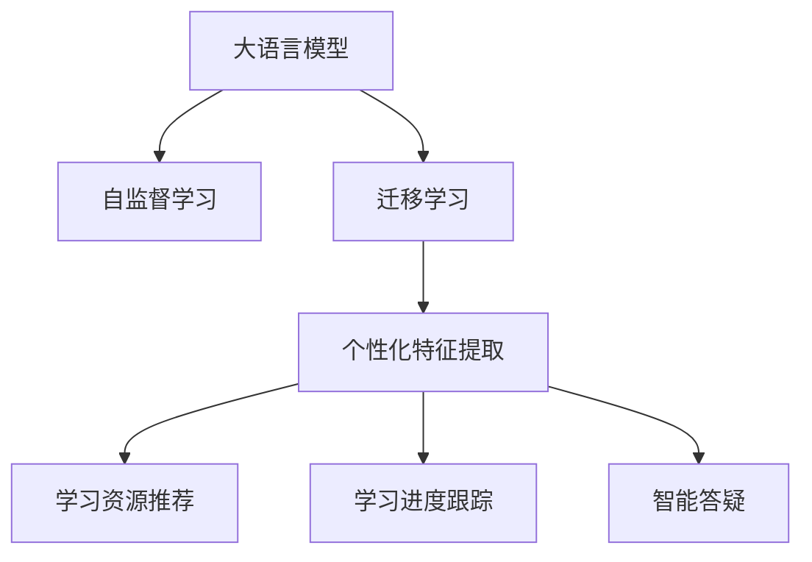

                 

## 1. 背景介绍

### 1.1 问题由来

近年来，随着深度学习技术的快速发展，人工智能在教育领域的应用逐渐增多。大语言模型(LLM)作为一种强大的自然语言处理工具，开始应用于个性化学习系统中。通过预训练语言模型，系统能够更好地理解学习者的语言表达和反馈，从而实现个性化推荐、智能答疑、学习进度跟踪等功能，大大提高了学习效率和效果。

个性化学习系统是指根据每个学习者的知识水平、学习习惯和需求，自动生成个性化学习计划和内容，提供适配的学习资源，以提高学习效果和效率的系统。传统的个性化学习系统往往依赖于教师的主观经验，难以对每个学习者进行精准分析。而大语言模型通过大量的语料预训练，可以自动捕捉语言中的复杂模式和规则，为个性化学习系统的建设提供了新的可能性。

### 1.2 问题核心关键点

当前，大语言模型在个性化学习系统中的应用主要集中在以下几个方面：

- 学习者个性化特征提取：通过预训练模型对学习者的语言表达进行分析，提取其知识水平、兴趣爱好、学习风格等个性化特征。
- 学习资源推荐：基于个性化特征，对学习者进行精准推荐，为其提供最合适的学习资源和练习材料。
- 学习进度跟踪：通过分析学习者的回答、反馈等，及时调整学习计划，确保学习进度。
- 智能答疑：对学习者的问题进行理解和回答，及时解决学习中的疑惑。

这些应用场景使得大语言模型在个性化学习系统中得以广泛应用，但也面临着一些挑战。如何有效地利用大语言模型，避免过度拟合，实现更加高效、精准的个性化学习，是当前研究的热点问题。

### 1.3 问题研究意义

研究大语言模型在个性化学习系统中的应用，对于提升个性化学习系统的智能化水平，提升学习效果和效率，具有重要意义：

1. 提高学习效率：通过个性化推荐和智能答疑，学习者能够获得更加符合自身需求的学习资源和练习材料，从而大大提升学习效率。
2. 提升学习效果：基于学习者个性化特征的分析和处理，系统能够为其提供更加个性化的学习建议，帮助其更好地掌握知识点。
3. 降低教学成本：通过自动化的分析和学习，系统能够为教师提供辅助支持，减少教师工作量，提升教学质量。
4. 适应个性化需求：不同的学习者具有不同的需求和背景，个性化学习系统能够根据学习者的实际情况，提供个性化的学习方案，满足其个性化需求。

## 2. 核心概念与联系

### 2.1 核心概念概述

为更好地理解大语言模型在个性化学习系统中的应用，本节将介绍几个密切相关的核心概念：

- 大语言模型(LLM)：指使用Transformer等深度学习架构，在大量无标签文本数据上进行预训练，学习到通用语言表示的语言模型。
- 自监督学习：指通过设计无标签的数据生成任务，训练模型自发学习语言知识和模式的方法。
- 迁移学习：指将一个领域学习到的知识迁移到另一个相关领域的方法，使模型能够在不同任务上取得更好的性能。
- 个性化特征提取：指利用大语言模型对学习者的语言表达进行分析，提取其个性化特征，如知识水平、兴趣爱好、学习风格等。
- 学习资源推荐：指基于个性化特征，为学习者推荐最合适的学习资源和练习材料。
- 学习进度跟踪：指通过分析学习者的回答、反馈等，及时调整学习计划，确保学习进度。
- 智能答疑：指通过自然语言处理技术，对学习者的问题进行理解和回答，及时解决学习中的疑惑。

这些核心概念之间的逻辑关系可以通过以下Mermaid流程图来展示：



这个流程图展示了大语言模型在个性化学习系统中的应用框架，其核心思想是通过自监督学习和大规模预训练，使模型学习到通用的语言知识和表示，然后通过迁移学习，将其应用于个性化学习系统的各个环节，从而实现高效、精准的个性化学习。

## 3. 核心算法原理 & 具体操作步骤

### 3.1 算法原理概述

基于大语言模型的个性化学习系统，本质上是一个多任务学习和迁移学习的过程。其核心思想是：通过预训练语言模型学习通用语言知识和表示，然后将模型迁移到个性化学习系统的各个任务中，通过多任务学习的方式，提升模型在特定任务上的性能。

具体而言，个性化学习系统通常包括以下几个关键任务：个性化特征提取、学习资源推荐、学习进度跟踪、智能答疑等。这些任务可以同时进行，也可以异步进行。通过多任务学习的方式，模型能够在各个任务上同时进行优化，从而提高整体的性能。

### 3.2 算法步骤详解

基于大语言模型的个性化学习系统一般包括以下几个关键步骤：

**Step 1: 准备预训练模型和数据集**
- 选择合适的预训练语言模型 $M_{\theta}$ 作为初始化参数，如 BERT、GPT 等。
- 准备学习者的语言表达数据集 $D=\{(x_i,y_i)\}_{i=1}^N, x_i \in \mathcal{X}, y_i \in \mathcal{Y}$，其中 $x_i$ 为学习者的语言表达，$y_i$ 为对应标签或特征。

**Step 2: 添加任务适配层**
- 根据任务类型，在预训练模型顶层设计合适的输出层和损失函数。
- 对于个性化特征提取任务，通常使用线性分类器输出学习者的知识水平、兴趣爱好等特征。
- 对于学习资源推荐任务，通常使用序列到序列模型生成推荐列表。
- 对于学习进度跟踪任务，通常使用回归模型输出学习进度和推荐的学习资源。
- 对于智能答疑任务，通常使用序列生成模型生成自然语言答案。

**Step 3: 设置微调超参数**
- 选择合适的优化算法及其参数，如 AdamW、SGD 等，设置学习率、批大小、迭代轮数等。
- 设置正则化技术及强度，包括权重衰减、Dropout、Early Stopping等。
- 确定冻结预训练参数的策略，如仅微调顶层，或全部参数都参与微调。

**Step 4: 执行梯度训练**
- 将训练集数据分批次输入模型，前向传播计算损失函数。
- 反向传播计算参数梯度，根据设定的优化算法和学习率更新模型参数。
- 周期性在验证集上评估模型性能，根据性能指标决定是否触发 Early Stopping。
- 重复上述步骤直到满足预设的迭代轮数或 Early Stopping 条件。

**Step 5: 测试和部署**
- 在测试集上评估微调后模型 $M_{\hat{\theta}}$ 的性能，对比微调前后的精度提升。
- 使用微调后的模型对新样本进行推理预测，集成到实际的应用系统中。
- 持续收集新的数据，定期重新微调模型，以适应数据分布的变化。

以上是基于大语言模型的个性化学习系统的通用流程。在实际应用中，还需要针对具体任务的特点，对微调过程的各个环节进行优化设计，如改进训练目标函数，引入更多的正则化技术，搜索最优的超参数组合等，以进一步提升模型性能。

### 3.3 算法优缺点

基于大语言模型的个性化学习系统具有以下优点：

1. 高效性：通过多任务学习和迁移学习，系统能够在多个任务上同时进行优化，从而提高整体的性能。
2. 适应性：大语言模型能够根据学习者的语言表达，提取其个性化特征，为个性化学习提供支持。
3. 灵活性：系统可以根据学习者的需求和反馈，动态调整学习计划和资源推荐。
4. 可扩展性：大语言模型具有强大的语言理解能力，能够处理各种类型的输入数据，适用于多种学习场景。

同时，该方法也存在一定的局限性：

1. 依赖标注数据：学习资源推荐、学习进度跟踪等任务通常需要标注数据，获取高质量标注数据的成本较高。
2. 泛化能力有限：当目标任务与预训练数据的分布差异较大时，微调的性能提升有限。
3. 复杂度较高：系统设计较为复杂，需要同时处理多个任务，开发和维护成本较高。
4. 可解释性不足：系统输出的决策过程通常缺乏可解释性，难以对其推理逻辑进行分析和调试。

尽管存在这些局限性，但就目前而言，基于大语言模型的个性化学习系统在教育领域的应用前景广阔，具有显著的学术和社会价值。

### 3.4 算法应用领域

基于大语言模型的个性化学习系统，在教育领域已经得到了广泛的应用，覆盖了几乎所有常见任务，例如：

- 个性化推荐系统：根据学习者的知识水平、兴趣爱好等特征，为其推荐最适合的学习资源和练习材料。
- 学习进度跟踪系统：通过分析学习者的回答、反馈等，及时调整学习计划，确保学习进度。
- 智能答疑系统：对学习者的问题进行理解和回答，及时解决学习中的疑惑。
- 个性化作业批改系统：根据学习者的作业进行自动评分，并提供详细的反馈。
- 自适应学习系统：根据学习者的反馈，动态调整学习内容和进度。

除了上述这些经典任务外，基于大语言模型的个性化学习系统还被创新性地应用到更多场景中，如在线教育、远程教育、游戏教育等，为教育技术发展带来了新的突破。

## 4. 数学模型和公式 & 详细讲解

### 4.1 数学模型构建

本节将使用数学语言对基于大语言模型的个性化学习系统进行更加严格的刻画。

记预训练语言模型为 $M_{\theta}$，其中 $\theta$ 为预训练得到的模型参数。假设个性化学习系统有 $k$ 个任务，分别为 $T_1, T_2, ..., T_k$。设任务 $T_i$ 的训练集为 $D_i=\{(x_{i,j}, y_{i,j})\}_{j=1}^{N_i}, x_{i,j} \in \mathcal{X}, y_{i,j} \in \mathcal{Y}_i$，其中 $\mathcal{Y}_i$ 为任务 $T_i$ 的标签或特征空间。

定义模型 $M_{\theta}$ 在数据样本 $(x,y)$ 上的损失函数为 $\ell_i(M_{\theta}(x),y)$，则在数据集 $D_i$ 上的经验风险为：

$$
\mathcal{L}_i(\theta) = \frac{1}{N_i}\sum_{j=1}^{N_i} \ell_i(M_{\theta}(x_{i,j}),y_{i,j})
$$

微调的优化目标是最小化经验风险，即找到最优参数：

$$
\theta^* = \mathop{\arg\min}_{\theta} \sum_{i=1}^{k} \mathcal{L}_i(\theta)
$$

在实践中，我们通常使用基于梯度的优化算法（如SGD、Adam等）来近似求解上述最优化问题。设 $\eta$ 为学习率，$\lambda$ 为正则化系数，则参数的更新公式为：

$$
\theta \leftarrow \theta - \eta \nabla_{\theta}\sum_{i=1}^{k}\mathcal{L}_i(\theta) - \eta\lambda\theta
$$

其中 $\nabla_{\theta}\sum_{i=1}^{k}\mathcal{L}_i(\theta)$ 为损失函数对参数 $\theta$ 的梯度，可通过反向传播算法高效计算。

### 4.2 公式推导过程

以下我们以学习资源推荐任务为例，推导基于大语言模型的推荐系统损失函数及其梯度的计算公式。

假设模型 $M_{\theta}$ 在输入 $x$ 上的输出为 $\hat{y}=M_{\theta}(x) \in [0,1]$，表示学习者选择第 $j$ 个推荐资源的概率。推荐列表 $\{y_1, y_2, ..., y_N\}$ 为任务 $T_i$ 的标签。则推荐任务交叉熵损失函数定义为：

$$
\ell_i(M_{\theta}(x),y) = -[y\log \hat{y} + (1-y)\log (1-\hat{y})]
$$

将其代入经验风险公式，得：

$$
\mathcal{L}_i(\theta) = -\frac{1}{N_i}\sum_{j=1}^{N_i} [y_{i,j}\log M_{\theta}(x_{i,j})+(1-y_{i,j})\log(1-M_{\theta}(x_{i,j}))]
$$

根据链式法则，损失函数对参数 $\theta_k$ 的梯度为：

$$
\frac{\partial \mathcal{L}_i(\theta)}{\partial \theta_k} = -\frac{1}{N_i}\sum_{j=1}^{N_i} (\frac{y_{i,j}}{M_{\theta}(x_{i,j})}-\frac{1-y_{i,j}}{1-M_{\theta}(x_{i,j}))) \frac{\partial M_{\theta}(x_{i,j})}{\partial \theta_k}
$$

其中 $\frac{\partial M_{\theta}(x_{i,j})}{\partial \theta_k}$ 可进一步递归展开，利用自动微分技术完成计算。

在得到损失函数的梯度后，即可带入参数更新公式，完成模型的迭代优化。重复上述过程直至收敛，最终得到适应个性化学习系统的最优模型参数 $\theta^*$。

## 5. 项目实践：代码实例和详细解释说明

### 5.1 开发环境搭建

在进行微调实践前，我们需要准备好开发环境。以下是使用Python进行PyTorch开发的环境配置流程：

1. 安装Anaconda：从官网下载并安装Anaconda，用于创建独立的Python环境。

2. 创建并激活虚拟环境：
```bash
conda create -n pytorch-env python=3.8 
conda activate pytorch-env
```

3. 安装PyTorch：根据CUDA版本，从官网获取对应的安装命令。例如：
```bash
conda install pytorch torchvision torchaudio cudatoolkit=11.1 -c pytorch -c conda-forge
```

4. 安装Transformers库：
```bash
pip install transformers
```

5. 安装各类工具包：
```bash
pip install numpy pandas scikit-learn matplotlib tqdm jupyter notebook ipython
```

完成上述步骤后，即可在`pytorch-env`环境中开始微调实践。

### 5.2 源代码详细实现

这里我们以学习资源推荐任务为例，给出使用Transformers库对BERT模型进行微调的PyTorch代码实现。

首先，定义推荐任务的数据处理函数：

```python
from transformers import BertTokenizer
from torch.utils.data import Dataset
import torch

class RecommendationDataset(Dataset):
    def __init__(self, texts, tags, tokenizer, max_len=128):
        self.texts = texts
        self.tags = tags
        self.tokenizer = tokenizer
        self.max_len = max_len
        
    def __len__(self):
        return len(self.texts)
    
    def __getitem__(self, item):
        text = self.texts[item]
        tags = self.tags[item]
        
        encoding = self.tokenizer(text, return_tensors='pt', max_length=self.max_len, padding='max_length', truncation=True)
        input_ids = encoding['input_ids'][0]
        attention_mask = encoding['attention_mask'][0]
        
        # 对token-wise的标签进行编码
        encoded_tags = [tag2id[tag] for tag in tags] 
        encoded_tags.extend([tag2id['O']] * (self.max_len - len(encoded_tags)))
        labels = torch.tensor(encoded_tags, dtype=torch.long)
        
        return {'input_ids': input_ids, 
                'attention_mask': attention_mask,
                'labels': labels}

# 标签与id的映射
tag2id = {'O': 0, 'B-RES': 1, 'I-RES': 2, 'B-MISC': 3, 'I-MISC': 4, 'B-ASSESS': 5, 'I-ASSESS': 6}
id2tag = {v: k for k, v in tag2id.items()}

# 创建dataset
tokenizer = BertTokenizer.from_pretrained('bert-base-cased')

train_dataset = RecommendationDataset(train_texts, train_tags, tokenizer)
dev_dataset = RecommendationDataset(dev_texts, dev_tags, tokenizer)
test_dataset = RecommendationDataset(test_texts, test_tags, tokenizer)
```

然后，定义模型和优化器：

```python
from transformers import BertForTokenClassification, AdamW

model = BertForTokenClassification.from_pretrained('bert-base-cased', num_labels=len(tag2id))

optimizer = AdamW(model.parameters(), lr=2e-5)
```

接着，定义训练和评估函数：

```python
from torch.utils.data import DataLoader
from tqdm import tqdm
from sklearn.metrics import classification_report

device = torch.device('cuda') if torch.cuda.is_available() else torch.device('cpu')
model.to(device)

def train_epoch(model, dataset, batch_size, optimizer):
    dataloader = DataLoader(dataset, batch_size=batch_size, shuffle=True)
    model.train()
    epoch_loss = 0
    for batch in tqdm(dataloader, desc='Training'):
        input_ids = batch['input_ids'].to(device)
        attention_mask = batch['attention_mask'].to(device)
        labels = batch['labels'].to(device)
        model.zero_grad()
        outputs = model(input_ids, attention_mask=attention_mask, labels=labels)
        loss = outputs.loss
        epoch_loss += loss.item()
        loss.backward()
        optimizer.step()
    return epoch_loss / len(dataloader)

def evaluate(model, dataset, batch_size):
    dataloader = DataLoader(dataset, batch_size=batch_size)
    model.eval()
    preds, labels = [], []
    with torch.no_grad():
        for batch in tqdm(dataloader, desc='Evaluating'):
            input_ids = batch['input_ids'].to(device)
            attention_mask = batch['attention_mask'].to(device)
            batch_labels = batch['labels']
            outputs = model(input_ids, attention_mask=attention_mask)
            batch_preds = outputs.logits.argmax(dim=2).to('cpu').tolist()
            batch_labels = batch_labels.to('cpu').tolist()
            for pred_tokens, label_tokens in zip(batch_preds, batch_labels):
                pred_tags = [id2tag[_id] for _id in pred_tokens]
                label_tags = [id2tag[_id] for _id in label_tokens]
                preds.append(pred_tags[:len(label_tags)])
                labels.append(label_tags)
                
    print(classification_report(labels, preds))
```

最后，启动训练流程并在测试集上评估：

```python
epochs = 5
batch_size = 16

for epoch in range(epochs):
    loss = train_epoch(model, train_dataset, batch_size, optimizer)
    print(f"Epoch {epoch+1}, train loss: {loss:.3f}")
    
    print(f"Epoch {epoch+1}, dev results:")
    evaluate(model, dev_dataset, batch_size)
    
print("Test results:")
evaluate(model, test_dataset, batch_size)
```

以上就是使用PyTorch对BERT进行推荐任务微调的完整代码实现。可以看到，得益于Transformers库的强大封装，我们可以用相对简洁的代码完成BERT模型的加载和微调。

### 5.3 代码解读与分析

让我们再详细解读一下关键代码的实现细节：

**RecommendationDataset类**：
- `__init__`方法：初始化文本、标签、分词器等关键组件。
- `__len__`方法：返回数据集的样本数量。
- `__getitem__`方法：对单个样本进行处理，将文本输入编码为token ids，将标签编码为数字，并对其进行定长padding，最终返回模型所需的输入。

**tag2id和id2tag字典**：
- 定义了标签与数字id之间的映射关系，用于将token-wise的预测结果解码回真实的标签。

**训练和评估函数**：
- 使用PyTorch的DataLoader对数据集进行批次化加载，供模型训练和推理使用。
- 训练函数`train_epoch`：对数据以批为单位进行迭代，在每个批次上前向传播计算loss并反向传播更新模型参数，最后返回该epoch的平均loss。
- 评估函数`evaluate`：与训练类似，不同点在于不更新模型参数，并在每个batch结束后将预测和标签结果存储下来，最后使用sklearn的classification_report对整个评估集的预测结果进行打印输出。

**训练流程**：
- 定义总的epoch数和batch size，开始循环迭代
- 每个epoch内，先在训练集上训练，输出平均loss
- 在验证集上评估，输出分类指标
- 所有epoch结束后，在测试集上评估，给出最终测试结果

可以看到，PyTorch配合Transformers库使得BERT微调的代码实现变得简洁高效。开发者可以将更多精力放在数据处理、模型改进等高层逻辑上，而不必过多关注底层的实现细节。

当然，工业级的系统实现还需考虑更多因素，如模型的保存和部署、超参数的自动搜索、更灵活的任务适配层等。但核心的微调范式基本与此类似。

## 6. 实际应用场景

### 6.1 智能个性化学习平台

智能个性化学习平台利用大语言模型，对学习者的语言表达进行分析，提取其个性化特征，如知识水平、兴趣爱好、学习风格等。然后，基于这些特征，为学习者推荐最合适的学习资源和练习材料。此外，平台还支持智能答疑、学习进度跟踪等功能，帮助学习者更好地掌握知识点。

在技术实现上，可以收集学习者的回答、反馈、阅读记录等数据，构建推荐和答疑模型，实现对学习者的精准支持。智能推荐系统可以根据学习者的反馈不断优化推荐策略，使其更加个性化、高效。智能答疑系统则通过自然语言处理技术，对学习者的问题进行理解和回答，及时解决学习中的疑惑。

### 6.2 自适应学习系统

自适应学习系统是一种基于大语言模型的个性化学习系统。该系统能够根据学习者的反馈，动态调整学习内容和进度。系统首先通过分析学习者的语言表达，提取其个性化特征，如知识水平、兴趣爱好、学习风格等。然后，根据这些特征，动态生成适合学习者的学习计划和资源。学习者在完成学习任务后，系统会收集反馈，进一步优化学习方案。

在技术实现上，可以构建推荐、答疑、进度跟踪等模型，并根据学习者的反馈不断优化推荐策略和答疑系统。通过多任务学习和迁移学习，系统能够在多个任务上同时进行优化，从而提高整体的性能。

### 6.3 远程学习平台

远程学习平台利用大语言模型，对学习者的语言表达进行分析，提取其个性化特征，为学习者推荐最合适的学习资源和练习材料。此外，平台还支持智能答疑、学习进度跟踪等功能，帮助学习者更好地掌握知识点。

在技术实现上，可以收集学习者的回答、反馈、阅读记录等数据，构建推荐和答疑模型，实现对学习者的精准支持。智能推荐系统可以根据学习者的反馈不断优化推荐策略，使其更加个性化、高效。智能答疑系统则通过自然语言处理技术，对学习者的问题进行理解和回答，及时解决学习中的疑惑。

### 6.4 未来应用展望

随着大语言模型和个性化学习技术的不断发展，基于大语言模型的个性化学习系统将呈现以下几个发展趋势：

1. 多模态学习：未来的学习系统将不仅关注文本数据，还将考虑图像、音频等多模态数据，以更全面地理解学习者的需求。
2. 知识图谱融合：未来的学习系统将融合知识图谱、逻辑规则等专家知识，引导微调过程学习更准确、合理的语言模型。
3. 迁移学习：未来的学习系统将更加注重迁移学习，利用预训练模型的广泛知识，快速适应新任务和新数据。
4. 持续学习：未来的学习系统将具备持续学习的能力，不断从新数据中学习，同时保持已学习的知识，以应对数据分布的变化。
5. 可解释性：未来的学习系统将更注重可解释性，通过引入因果分析、博弈论等工具，增强模型的可解释性和稳定性。

以上趋势凸显了大语言模型在个性化学习系统中的应用前景。这些方向的探索发展，必将进一步提升个性化学习系统的智能化水平，为学习者提供更加精准、高效的支持。

## 7. 工具和资源推荐
### 7.1 学习资源推荐

为了帮助开发者系统掌握大语言模型在个性化学习系统中的应用，这里推荐一些优质的学习资源：

1. 《深度学习理论与实践》系列博文：由大模型技术专家撰写，深入浅出地介绍了深度学习理论、实践和应用。

2. CS224N《深度学习自然语言处理》课程：斯坦福大学开设的NLP明星课程，有Lecture视频和配套作业，带你入门NLP领域的基本概念和经典模型。

3. 《Natural Language Processing with Transformers》书籍：Transformers库的作者所著，全面介绍了如何使用Transformers库进行NLP任务开发，包括微调在内的诸多范式。

4. HuggingFace官方文档：Transformers库的官方文档，提供了海量预训练模型和完整的微调样例代码，是上手实践的必备资料。

5. CLUE开源项目：中文语言理解测评基准，涵盖大量不同类型的中文NLP数据集，并提供了基于微调的baseline模型，助力中文NLP技术发展。

通过对这些资源的学习实践，相信你一定能够快速掌握大语言模型在个性化学习系统中的应用精髓，并用于解决实际的NLP问题。
### 7.2 开发工具推荐

高效的开发离不开优秀的工具支持。以下是几款用于大语言模型微调开发的常用工具：

1. PyTorch：基于Python的开源深度学习框架，灵活动态的计算图，适合快速迭代研究。大部分预训练语言模型都有PyTorch版本的实现。

2. TensorFlow：由Google主导开发的开源深度学习框架，生产部署方便，适合大规模工程应用。同样有丰富的预训练语言模型资源。

3. Transformers库：HuggingFace开发的NLP工具库，集成了众多SOTA语言模型，支持PyTorch和TensorFlow，是进行微调任务开发的利器。

4. Weights & Biases：模型训练的实验跟踪工具，可以记录和可视化模型训练过程中的各项指标，方便对比和调优。与主流深度学习框架无缝集成。

5. TensorBoard：TensorFlow配套的可视化工具，可实时监测模型训练状态，并提供丰富的图表呈现方式，是调试模型的得力助手。

6. Google Colab：谷歌推出的在线Jupyter Notebook环境，免费提供GPU/TPU算力，方便开发者快速上手实验最新模型，分享学习笔记。

合理利用这些工具，可以显著提升大语言模型在个性化学习系统中的开发效率，加快创新迭代的步伐。

### 7.3 相关论文推荐

大语言模型和个性化学习技术的发展源于学界的持续研究。以下是几篇奠基性的相关论文，推荐阅读：

1. Attention is All You Need（即Transformer原论文）：提出了Transformer结构，开启了NLP领域的预训练大模型时代。

2. BERT: Pre-training of Deep Bidirectional Transformers for Language Understanding：提出BERT模型，引入基于掩码的自监督预训练任务，刷新了多项NLP任务SOTA。

3. Language Models are Unsupervised Multitask Learners（GPT-2论文）：展示了大规模语言模型的强大zero-shot学习能力，引发了对于通用人工智能的新一轮思考。

4. Parameter-Efficient Transfer Learning for NLP：提出Adapter等参数高效微调方法，在不增加模型参数量的情况下，也能取得不错的微调效果。

5. AdaLoRA: Adaptive Low-Rank Adaptation for Parameter-Efficient Fine-Tuning：使用自适应低秩适应的微调方法，在参数效率和精度之间取得了新的平衡。

6. Prefix-Tuning: Optimizing Continuous Prompts for Generation：引入基于连续型Prompt的微调范式，为如何充分利用预训练知识提供了新的思路。

这些论文代表了大语言模型和个性化学习技术的发展脉络。通过学习这些前沿成果，可以帮助研究者把握学科前进方向，激发更多的创新灵感。

## 8. 总结：未来发展趋势与挑战

### 8.1 总结

本文对基于大语言模型的个性化学习系统进行了全面系统的介绍。首先阐述了大语言模型和微调技术的研究背景和意义，明确了微调在拓展预训练模型应用、提升个性化学习系统性能方面的独特价值。其次，从原理到实践，详细讲解了基于大语言模型的个性化学习系统的数学原理和关键步骤，给出了微调任务开发的完整代码实例。同时，本文还广泛探讨了微调方法在智能个性化学习系统中的应用场景，展示了微调范式的巨大潜力。

通过本文的系统梳理，可以看到，基于大语言模型的个性化学习系统在教育领域的应用前景广阔，具有显著的学术和社会价值。

### 8.2 未来发展趋势

展望未来，基于大语言模型的个性化学习系统将呈现以下几个发展趋势：

1. 模型规模持续增大。随着算力成本的下降和数据规模的扩张，预训练语言模型的参数量还将持续增长。超大规模语言模型蕴含的丰富语言知识，有望支撑更加复杂多变的个性化学习系统。

2. 微调方法日趋多样。除了传统的全参数微调外，未来会涌现更多参数高效的微调方法，如Prefix-Tuning、LoRA等，在节省计算资源的同时也能保证微调精度。

3. 持续学习成为常态。随着数据分布的不断变化，个性化学习系统也需要持续学习新知识以保持性能。如何在不遗忘原有知识的同时，高效吸收新样本信息，将成为重要的研究课题。

4. 标注样本需求降低。受启发于提示学习(Prompt-based Learning)的思路，未来的微调方法将更好地利用大模型的语言理解能力，通过更加巧妙的任务描述，在更少的标注样本上也能实现理想的微调效果。

5. 多模态微调崛起。当前的微调主要聚焦于纯文本数据，未来会进一步拓展到图像、视频、语音等多模态数据微调。多模态信息的融合，将显著提升语言模型对现实世界的理解和建模能力。

6. 模型通用性增强。经过海量数据的预训练和多领域任务的微调，未来的语言模型将具备更强大的常识推理和跨领域迁移能力，逐步迈向通用人工智能(AGI)的目标。

以上趋势凸显了大语言模型在个性化学习系统中的应用前景。这些方向的探索发展，必将进一步提升个性化学习系统的智能化水平，为学习者提供更加精准、高效的支持。

### 8.3 面临的挑战

尽管基于大语言模型的个性化学习系统已经取得了瞩目成就，但在迈向更加智能化、普适化应用的过程中，它仍面临着诸多挑战：

1. 标注成本瓶颈。虽然微调大大降低了标注数据的需求，但对于长尾应用场景，难以获得充足的高质量标注数据，成为制约微调性能的瓶颈。如何进一步降低微调对标注样本的依赖，将是一大难题。

2. 模型鲁棒性不足。当前微调模型面对域外数据时，泛化性能往往大打折扣。对于测试样本的微小扰动，微调模型的预测也容易发生波动。如何提高微调模型的鲁棒性，避免灾难性遗忘，还需要更多理论和实践的积累。

3. 推理效率有待提高。大规模语言模型虽然精度高，但在实际部署时往往面临推理速度慢、内存占用大等效率问题。如何在保证性能的同时，简化模型结构，提升推理速度，优化资源占用，将是重要的优化方向。

4. 可解释性亟需加强。当前微调模型更像是"黑盒"系统，难以解释其内部工作机制和决策逻辑。对于医疗、金融等高风险应用，算法的可解释性和可审计性尤为重要。如何赋予微调模型更强的可解释性，将是亟待攻克的难题。

5. 安全性有待保障。预训练语言模型难免会学习到有偏见、有害的信息，通过微调传递到下游任务，产生误导性、歧视性的输出，给实际应用带来安全隐患。如何从数据和算法层面消除模型偏见，避免恶意用途，确保输出的安全性，也将是重要的研究课题。

6. 知识整合能力不足。现有的微调模型往往局限于任务内数据，难以灵活吸收和运用更广泛的先验知识。如何让微调过程更好地与外部知识库、规则库等专家知识结合，形成更加全面、准确的信息整合能力，还有很大的想象空间。

正视微调面临的这些挑战，积极应对并寻求突破，将是大语言模型微调走向成熟的必由之路。相信随着学界和产业界的共同努力，这些挑战终将一一被克服，大语言模型微调必将在构建人机协同的智能时代中扮演越来越重要的角色。

### 8.4 研究展望

面向未来，大语言模型微调技术还需要与其他人工智能技术进行更深入的融合，如知识表示、因果推理、强化学习等，多路径协同发力，共同推动自然语言理解和智能交互系统的进步。只有勇于创新、敢于突破，才能不断拓展语言模型的边界，让智能技术更好地造福人类社会。

## 9. 附录：常见问题与解答

**Q1：大语言模型在个性化学习系统中的作用是什么？**

A: 大语言模型在个性化学习系统中的作用主要有以下几点：
1. 提取学习者个性化特征：通过预训练模型对学习者的语言表达进行分析，提取其知识水平、兴趣爱好、学习风格等个性化特征。
2. 推荐学习资源：基于个性化特征，为学习者推荐最合适的学习资源和练习材料。
3. 智能答疑：对学习者的问题进行理解和回答，及时解决学习中的疑惑。
4. 学习进度跟踪：通过分析学习者的回答、反馈等，及时调整学习计划，确保学习进度。

**Q2：如何选择合适的学习率？**

A: 学习率的选择对微调效果有着重要影响。一般建议从1e-5开始调参，逐步减小学习率，直至收敛。如果使用过大的学习率，容易破坏预训练权重，导致过拟合。

**Q3：在个性化学习系统中，大语言模型的推理效率如何？**

A: 大规模语言模型虽然精度高，但在实际部署时往往面临推理速度慢、内存占用大等效率问题。可以通过以下方法提升推理效率：
1. 模型裁剪：去除不必要的层和参数，减小模型尺寸，加快推理速度。
2. 量化加速：将浮点模型转为定点模型，压缩存储空间，提高计算效率。
3. 服务化封装：将模型封装为标准化服务接口，便于集成调用。
4. 弹性伸缩：根据请求流量动态调整资源配置，平衡服务质量和成本。
5. 监控告警：实时采集系统指标，设置异常告警阈值，确保服务稳定性。

**Q4：在个性化学习系统中，大语言模型是否需要持续学习？**

A: 是的。随着数据分布的不断变化，个性化学习系统也需要持续学习新知识以保持性能。持续学习可以有效避免模型过时，提升系统的适应性。

**Q5：在个性化学习系统中，如何处理长尾数据？**

A: 对于长尾数据，可以通过以下方法进行处理：
1. 数据增强：通过回译、近义替换等方式扩充训练集。
2. 数据重采样：对长尾数据进行重采样，增加其在训练集中的占比。
3. 对抗训练：引入对抗样本，提高模型鲁棒性，降低长尾数据的影响。

**Q6：在个性化学习系统中，大语言模型的可解释性如何？**

A: 大语言模型的可解释性通常不足，难以解释其内部工作机制和决策逻辑。可以通过以下方法增强可解释性：
1. 引入因果分析方法，识别出模型决策的关键特征，增强输出解释的因果性和逻辑性。
2. 借助博弈论工具，刻画人机交互过程，主动探索并规避模型的脆弱点，提高系统稳定性。
3. 引入更多先验知识，如知识图谱、逻辑规则等，引导微调过程学习更准确、合理的语言模型。

**Q7：在个性化学习系统中，大语言模型如何处理多模态数据？**

A: 未来的学习系统将不仅关注文本数据，还将考虑图像、音频等多模态数据。可以通过以下方法处理多模态数据：
1. 多模态融合：将不同模态的数据进行融合，形成统一的表示，便于模型的理解和学习。
2. 多任务学习：同时处理多个任务，提升模型在多个任务上的性能。
3. 迁移学习：利用预训练模型的广泛知识，快速适应新任务和新数据。

通过本文的系统梳理，可以看到，基于大语言模型的个性化学习系统在教育领域的应用前景广阔，具有显著的学术和社会价值。未来，伴随预训练语言模型和微调方法的持续演进，相信个性化学习系统必将进一步智能化、普适化，为学习者提供更加精准、高效的支持。

