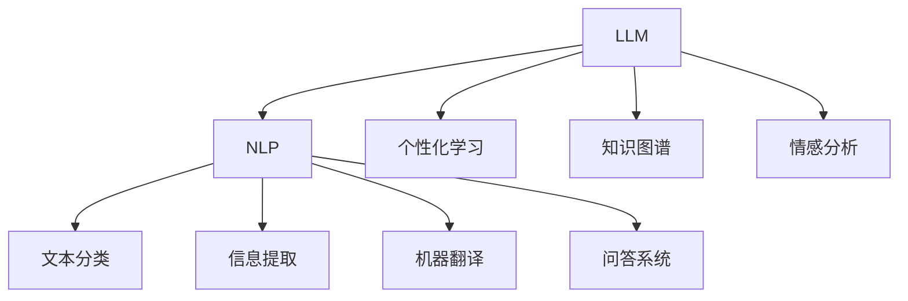

                 

# LLM在智能学习系统中的潜力

## 1. 背景介绍

### 1.1 问题由来
在人工智能的浪潮中，语言学习系统（LLM，Language Learning Model）逐渐成为学术界和工业界关注的焦点。LLM 不仅能够理解自然语言，还能够生成文本，这为智能学习系统的发展提供了巨大潜力。智能学习系统不仅包括传统的教育和学习应用，也包括语言学、认知科学、人工智能等领域的交叉研究。LLM 在智能学习系统中的应用场景日益丰富，其潜力也逐渐被发掘。

### 1.2 问题核心关键点
LLM 在智能学习系统中的应用主要涉及以下几个核心关键点：

- **自然语言理解与生成**：LLM 可以理解自然语言，并将其转换为可操作的形式，比如生成教学计划、自动生成学习内容等。
- **个性化学习**：基于学生的学习行为和反馈，LLM 可以提供个性化的学习建议，从而提升学习效率。
- **知识图谱构建与推理**：LLM 可以辅助构建知识图谱，并在其中进行推理，从而在知识问答和智能辅导中发挥重要作用。
- **跨模态学习**：LLM 可以处理文本、图像、声音等多种模态的信息，实现跨模态的智能学习。
- **情感智能**：LLM 可以分析学生的情绪和反馈，从而调整教学策略，提升学生的学习体验。

### 1.3 问题研究意义
LLM 在智能学习系统中的应用研究具有重要意义：

- **提高学习效率**：通过个性化的学习内容和策略，LLM 可以大幅提升学习效率。
- **促进教育公平**：LLM 可以覆盖更多的学习者，提供更加公平的教育资源。
- **推动教学创新**：LLM 可以辅助教师设计教学方案，提供智能辅导，从而推动教学方法的创新。
- **辅助科研**：LLM 可以辅助研究人员进行自然语言处理和认知科学的研究。

## 2. 核心概念与联系

### 2.1 核心概念概述

为更好地理解 LLM 在智能学习系统中的潜力，本节将介绍几个密切相关的核心概念：

- **语言学习系统（LLM）**：指能够理解、生成自然语言的模型。其基本原理是语言模型，通过自监督或监督学习训练得到。
- **自然语言处理（NLP）**：指对自然语言进行处理的各类技术，包括文本分类、信息提取、机器翻译、问答系统等。
- **个性化学习**：指根据学生的学习行为和反馈，提供个性化的学习资源和策略。
- **知识图谱**：指用于表示知识的图形结构，包括实体、关系、属性等。
- **情感分析**：指分析文本中的情感倾向，可以应用于情感智能。

这些核心概念之间的逻辑关系可以通过以下 Mermaid 流程图来展示：



这个流程图展示了 LLM 与其他核心概念之间的关系：

1. LLM 通过 NLP 技术，可以处理文本分类、信息提取、机器翻译等任务。
2. 结合个性化学习，LLM 能够根据学生的学习情况提供个性化的学习建议。
3. LLM 可以辅助构建知识图谱，并在其中进行推理。
4. LLM 可以分析文本中的情感倾向，从而实现情感智能。

## 3. 核心算法原理 & 具体操作步骤
### 3.1 算法原理概述

LLM 在智能学习系统中的应用主要基于以下算法原理：

- **自然语言处理（NLP）**：通过预训练语言模型（如 BERT、GPT-2 等），LLM 可以理解自然语言，并将其转换为可操作的形式。
- **个性化学习**：通过分析学生的学习行为和反馈，LLM 可以提供个性化的学习建议。
- **知识图谱构建与推理**：LLM 可以辅助构建知识图谱，并在其中进行推理。
- **跨模态学习**：LLM 可以处理文本、图像、声音等多种模态的信息，实现跨模态的智能学习。
- **情感分析**：通过分析文本中的情感倾向，LLM 可以实现情感智能。

### 3.2 算法步骤详解

基于 LLM 在智能学习系统中的应用，一般包括以下几个关键步骤：

**Step 1: 数据准备**
- 收集学生的学习行为数据，包括学习时间、学习内容、学习效果等。
- 收集教学资源和任务数据，包括教材、习题、测试题等。

**Step 2: 数据预处理**
- 对收集到的数据进行清洗和标注，以便于 LLM 处理。
- 将文本数据转换为向量形式，以便于模型输入。

**Step 3: 模型选择与训练**
- 选择合适的 LLM 模型，如 BERT、GPT-2 等。
- 在标注数据上对模型进行训练，以提升其对特定任务的适应能力。

**Step 4: 个性化学习策略制定**
- 根据学生的学习行为和反馈，制定个性化的学习策略。
- 动态调整学习内容和学习难度，以适应学生的学习进度。

**Step 5: 知识图谱构建与推理**
- 构建知识图谱，包括实体、关系、属性等。
- 在知识图谱中进行推理，回答学生的问题。

**Step 6: 情感分析**
- 分析学生的情感倾向，判断学生的学习状态。
- 根据情感分析结果，调整教学策略。

**Step 7: 应用部署**
- 将训练好的模型部署到实际应用系统中。
- 持续收集学生的学习数据，动态调整模型参数。

以上是基于 LLM 在智能学习系统中的主要应用步骤。在实际应用中，还需要针对具体任务的特点，对各步骤进行优化设计，以提高系统效果。

### 3.3 算法优缺点

LLM 在智能学习系统中的应用具有以下优点：

- **高效性**：LLM 可以处理大规模的文本数据，高效地提供学习建议和内容。
- **可扩展性**：LLM 可以适应不同的学习场景和任务，具有较强的可扩展性。
- **个性化**：LLM 能够根据学生的学习情况提供个性化的学习建议，提升学习效率。

同时，LLM 也存在一定的局限性：

- **数据依赖**：LLM 的效果很大程度上依赖于训练数据的质量和数量，获取高质量标注数据的成本较高。
- **可解释性不足**：LLM 通常被视为"黑盒"系统，难以解释其内部工作机制和决策逻辑。
- **鲁棒性不足**：LLM 在面对复杂的多模态信息时，可能表现出鲁棒性不足。

尽管存在这些局限性，但 LLM 在智能学习系统中的应用前景仍然广阔，值得进一步探索和优化。

### 3.4 算法应用领域

LLM 在智能学习系统中的应用领域非常广泛，包括但不限于以下几个方面：

- **个性化推荐系统**：根据学生的学习行为和反馈，LLM 可以推荐个性化的学习资源和内容。
- **智能辅导系统**：LLM 可以回答学生的问题，提供智能辅导。
- **教学评估系统**：LLM 可以分析学生的学习成果，提供教学评估和反馈。
- **情感智能系统**：LLM 可以分析学生的情感倾向，调整教学策略。
- **知识图谱辅助系统**：LLM 可以辅助构建知识图谱，并进行推理。
- **跨模态学习系统**：LLM 可以处理文本、图像、声音等多种模态的信息，实现跨模态的智能学习。

## 4. 数学模型和公式 & 详细讲解  
### 4.1 数学模型构建

在本节中，我们将通过数学语言对 LLM 在智能学习系统中的应用进行更加严格的刻画。

假设学生的学习行为数据为 $X$，教学资源和任务数据为 $Y$。我们定义损失函数 $\mathcal{L}(\theta)$ 为模型的训练目标，其中 $\theta$ 为模型的参数。

### 4.2 公式推导过程

假设 LLM 模型为 $M_{\theta}:\mathcal{X} \rightarrow \mathcal{Y}$，其中 $\mathcal{X}$ 为输入空间，$\mathcal{Y}$ 为输出空间。假设训练集为 $D=\{(x_i,y_i)\}_{i=1}^N$，其中 $x_i \in \mathcal{X}$ 为输入，$y_i \in \mathcal{Y}$ 为标签。

定义损失函数为：

$$
\mathcal{L}(\theta) = \frac{1}{N} \sum_{i=1}^N \ell(M_{\theta}(x_i),y_i)
$$

其中 $\ell$ 为损失函数，用于衡量模型预测结果与真实标签之间的差异。

### 4.3 案例分析与讲解

以个性化推荐系统为例，假设推荐系统根据学生的学习行为数据 $X$ 和教学资源数据 $Y$，推荐学生感兴趣的课程。

1. **数据准备**：
   - 收集学生的学习行为数据 $X$，包括学习时间、学习内容、学习效果等。
   - 收集教学资源和任务数据 $Y$，包括教材、习题、测试题等。

2. **数据预处理**：
   - 对收集到的数据进行清洗和标注，以便于模型处理。
   - 将文本数据转换为向量形式，以便于模型输入。

3. **模型选择与训练**：
   - 选择合适的 LLM 模型，如 BERT、GPT-2 等。
   - 在标注数据上对模型进行训练，以提升其对特定任务的适应能力。

4. **个性化学习策略制定**：
   - 根据学生的学习行为和反馈，制定个性化的学习策略。
   - 动态调整学习内容和学习难度，以适应学生的学习进度。

5. **推荐算法实现**：
   - 使用推荐算法（如协同过滤、深度学习等），根据学生的学习数据和教学资源，推荐个性化的课程。

6. **应用部署**：
   - 将训练好的模型部署到推荐系统中。
   - 持续收集学生的学习数据，动态调整模型参数。

## 5. 项目实践：代码实例和详细解释说明
### 5.1 开发环境搭建

在进行 LLM 在智能学习系统中的应用开发前，我们需要准备好开发环境。以下是使用 Python 进行 PyTorch 开发的环境配置流程：

1. 安装 Anaconda：从官网下载并安装 Anaconda，用于创建独立的 Python 环境。

2. 创建并激活虚拟环境：
```bash
conda create -n pytorch-env python=3.8 
conda activate pytorch-env
```

3. 安装 PyTorch：根据 CUDA 版本，从官网获取对应的安装命令。例如：
```bash
conda install pytorch torchvision torchaudio cudatoolkit=11.1 -c pytorch -c conda-forge
```

4. 安装 Transformers 库：
```bash
pip install transformers
```

5. 安装各类工具包：
```bash
pip install numpy pandas scikit-learn matplotlib tqdm jupyter notebook ipython
```

完成上述步骤后，即可在 `pytorch-env` 环境中开始开发实践。

### 5.2 源代码详细实现

下面我以个性化推荐系统为例，给出使用 Transformers 库对 BERT 模型进行个性化推荐开发的 PyTorch 代码实现。

首先，定义推荐系统的数据处理函数：

```python
from transformers import BertTokenizer
from torch.utils.data import Dataset
import torch

class RecommendationDataset(Dataset):
    def __init__(self, students, courses, tokenizer, max_len=128):
        self.students = students
        self.courses = courses
        self.tokenizer = tokenizer
        self.max_len = max_len
        
    def __len__(self):
        return len(self.students)
    
    def __getitem__(self, item):
        student = self.students[item]
        course = self.courses[item]
        
        encoding = self.tokenizer(student, return_tensors='pt', max_length=self.max_len, padding='max_length', truncation=True)
        input_ids = encoding['input_ids'][0]
        attention_mask = encoding['attention_mask'][0]
        
        # 对课程信息进行编码
        encoded_course = [course] * (self.max_len - len(course))
        encoded_course.extend(['<unk>'] * (self.max_len - len(encoded_course)))
        labels = torch.tensor(encoded_course, dtype=torch.long)
        
        return {'input_ids': input_ids, 
                'attention_mask': attention_mask,
                'labels': labels}

# 构建推荐系统
tokenizer = BertTokenizer.from_pretrained('bert-base-cased')

train_dataset = RecommendationDataset(train_students, train_courses, tokenizer)
dev_dataset = RecommendationDataset(dev_students, dev_courses, tokenizer)
test_dataset = RecommendationDataset(test_students, test_courses, tokenizer)
```

然后，定义模型和优化器：

```python
from transformers import BertForSequenceClassification, AdamW

model = BertForSequenceClassification.from_pretrained('bert-base-cased', num_labels=len(set(train_dataset.labels)))

optimizer = AdamW(model.parameters(), lr=2e-5)
```

接着，定义训练和评估函数：

```python
from torch.utils.data import DataLoader
from tqdm import tqdm
from sklearn.metrics import precision_recall_fscore_support

device = torch.device('cuda') if torch.cuda.is_available() else torch.device('cpu')
model.to(device)

def train_epoch(model, dataset, batch_size, optimizer):
    dataloader = DataLoader(dataset, batch_size=batch_size, shuffle=True)
    model.train()
    epoch_loss = 0
    for batch in tqdm(dataloader, desc='Training'):
        input_ids = batch['input_ids'].to(device)
        attention_mask = batch['attention_mask'].to(device)
        labels = batch['labels'].to(device)
        model.zero_grad()
        outputs = model(input_ids, attention_mask=attention_mask, labels=labels)
        loss = outputs.loss
        epoch_loss += loss.item()
        loss.backward()
        optimizer.step()
    return epoch_loss / len(dataloader)

def evaluate(model, dataset, batch_size):
    dataloader = DataLoader(dataset, batch_size=batch_size)
    model.eval()
    preds, labels = [], []
    with torch.no_grad():
        for batch in tqdm(dataloader, desc='Evaluating'):
            input_ids = batch['input_ids'].to(device)
            attention_mask = batch['attention_mask'].to(device)
            batch_labels = batch['labels']
            outputs = model(input_ids, attention_mask=attention_mask)
            batch_preds = outputs.logits.argmax(dim=2).to('cpu').tolist()
            batch_labels = batch_labels.to('cpu').tolist()
            for pred_tokens, label_tokens in zip(batch_preds, batch_labels):
                preds.append(pred_tokens[:len(label_tokens)])
                labels.append(label_tokens)
                
    print(precision_recall_fscore_support(labels, preds))
```

最后，启动训练流程并在测试集上评估：

```python
epochs = 5
batch_size = 16

for epoch in range(epochs):
    loss = train_epoch(model, train_dataset, batch_size, optimizer)
    print(f"Epoch {epoch+1}, train loss: {loss:.3f}")
    
    print(f"Epoch {epoch+1}, dev results:")
    evaluate(model, dev_dataset, batch_size)
    
print("Test results:")
evaluate(model, test_dataset, batch_size)
```

以上就是使用 PyTorch 对 BERT 进行个性化推荐系统开发的完整代码实现。可以看到，得益于 Transformers 库的强大封装，我们可以用相对简洁的代码完成 BERT 模型的加载和推荐系统开发。

### 5.3 代码解读与分析

让我们再详细解读一下关键代码的实现细节：

**RecommendationDataset类**：
- `__init__`方法：初始化学生数据、课程数据、分词器等关键组件。
- `__len__`方法：返回数据集的样本数量。
- `__getitem__`方法：对单个样本进行处理，将学生信息输入编码为token ids，将课程信息编码为数字，并对其进行定长padding，最终返回模型所需的输入。

**代码解读**：
- 定义了推荐系统的数据处理函数，将学生数据和课程数据转换为模型所需的输入形式。
- 定义了 BERT 模型和优化器，用于训练和优化推荐系统。
- 定义了训练和评估函数，用于训练和测试推荐系统模型。
- 启动训练流程并在测试集上评估推荐系统的效果。

## 6. 实际应用场景
### 6.1 智能教育平台
LLM 在智能教育平台中的应用非常广泛，可以帮助学生进行个性化学习、智能辅导、教学评估等。

**个性化学习**：
- 根据学生的学习行为和反馈，LLM 可以提供个性化的学习建议和资源。
- 动态调整学习内容和学习难度，以适应学生的学习进度。

**智能辅导**：
- 通过分析学生的学习数据，LLM 可以提供智能辅导。
- 回答学生的问题，提供学习建议和资源。

**教学评估**：
- 通过分析学生的学习数据，LLM 可以进行教学评估和反馈。
- 评估学生的学习成果，提供学习建议和改进方案。

### 6.2 智慧校园
智慧校园是 LLM 应用的重要场景之一，可以帮助学生进行个性化学习、智能辅导、校园管理等。

**个性化学习**：
- 根据学生的学习行为和反馈，LLM 可以提供个性化的学习建议和资源。
- 动态调整学习内容和学习难度，以适应学生的学习进度。

**智能辅导**：
- 通过分析学生的学习数据，LLM 可以提供智能辅导。
- 回答学生的问题，提供学习建议和资源。

**校园管理**：
- LLM 可以辅助校园管理，如智能排课、学生考勤、图书管理等。
- 自动化处理校园事务，提高校园管理效率。

### 6.3 在线教育
在线教育是 LLM 应用的重要场景之一，可以帮助学生进行个性化学习、智能辅导、在线课程管理等。

**个性化学习**：
- 根据学生的学习行为和反馈，LLM 可以提供个性化的学习建议和资源。
- 动态调整学习内容和学习难度，以适应学生的学习进度。

**智能辅导**：
- 通过分析学生的学习数据，LLM 可以提供智能辅导。
- 回答学生的问题，提供学习建议和资源。

**在线课程管理**：
- LLM 可以辅助在线课程管理，如智能推荐、智能评估、在线讨论等。
- 提高在线教育的教学效果和学生体验。

## 7. 工具和资源推荐
### 7.1 学习资源推荐

为了帮助开发者系统掌握 LLM 在智能学习系统中的应用，这里推荐一些优质的学习资源：

1. **《深度学习与自然语言处理》**：斯坦福大学郑怀恩教授所著，全面介绍了深度学习和自然语言处理的基础知识和前沿技术。
2. **Coursera《深度学习》课程**：吴恩达教授所讲授的深度学习课程，涵盖深度学习的基本概念和经典模型。
3. **Kaggle**：数据科学竞赛平台，提供了大量的 NLP 数据集和竞赛任务，可以用于 LLM 的应用实践。
4. **Google AI Hub**：谷歌开源的 AI 模型和工具库，提供了丰富的预训练模型和工具，可以用于 LLM 的开发。
5. **LLM 社区**：基于 LLM 的应用社区，提供了丰富的技术资源和交流平台。

通过对这些资源的学习实践，相信你一定能够快速掌握 LLM 在智能学习系统中的应用，并用于解决实际的智能学习问题。

### 7.2 开发工具推荐

高效的开发离不开优秀的工具支持。以下是几款用于 LLM 在智能学习系统中的开发工具：

1. **PyTorch**：基于 Python 的开源深度学习框架，灵活动态的计算图，适合快速迭代研究。
2. **TensorFlow**：由 Google 主导开发的开源深度学习框架，生产部署方便，适合大规模工程应用。
3. **Transformers**：HuggingFace 开发的 NLP 工具库，集成了众多 SOTA 语言模型，支持 PyTorch 和 TensorFlow，是进行 LLM 开发的利器。
4. **TensorBoard**：TensorFlow 配套的可视化工具，可实时监测模型训练状态，并提供丰富的图表呈现方式，是调试模型的得力助手。
5. **Jupyter Notebook**：交互式编程环境，支持 Python 代码的实时执行和展示，适合开发 LLM 应用。

合理利用这些工具，可以显著提升 LLM 在智能学习系统中的应用开发效率，加快创新迭代的步伐。

### 7.3 相关论文推荐

LLM 在智能学习系统中的应用研究源于学界的持续研究。以下是几篇奠基性的相关论文，推荐阅读：

1. **Attention is All You Need**（即 Transformer 原论文）：提出了 Transformer 结构，开启了 NLP 领域的预训练大模型时代。
2. **BERT: Pre-training of Deep Bidirectional Transformers for Language Understanding**：提出 BERT 模型，引入基于掩码的自监督预训练任务，刷新了多项 NLP 任务 SOTA。
3. **Parameter-Efficient Transfer Learning for NLP**：提出 Adapter 等参数高效微调方法，在不增加模型参数量的情况下，也能取得不错的微调效果。
4. **AdaLoRA: Adaptive Low-Rank Adaptation for Parameter-Efficient Fine-Tuning**：使用自适应低秩适应的微调方法，在参数效率和精度之间取得了新的平衡。
5. **Adaptive Prompt Design for Large-Scale Zero-Shot Extraction**：提出基于提示学习的零样本学习范式，进一步提升了 LLM 在零样本任务上的表现。

这些论文代表了大语言模型在智能学习系统中的应用发展脉络。通过学习这些前沿成果，可以帮助研究者把握学科前进方向，激发更多的创新灵感。

## 8. 总结：未来发展趋势与挑战
### 8.1 总结

本文对 LLM 在智能学习系统中的应用进行了全面系统的介绍。首先阐述了 LLM 在智能学习系统中的应用背景和意义，明确了其在个性化学习、智能辅导、教学评估等领域的重要作用。其次，从原理到实践，详细讲解了 LLM 在智能学习系统中的应用过程，给出了 LLM 在个性化推荐系统中的完整代码实现。同时，本文还广泛探讨了 LLM 在智能学习系统中的应用前景，展示了其在智慧校园、在线教育等领域的广阔应用前景。

通过本文的系统梳理，可以看到，LLM 在智能学习系统中的应用前景广阔，具有巨大的潜力。LLM 不仅能够提升学习效率，还能够推动教育公平、教学创新，为智能学习系统的全面发展提供技术支撑。

### 8.2 未来发展趋势

展望未来，LLM 在智能学习系统中的应用将呈现以下几个发展趋势：

1. **模型的规模化**：随着算力成本的下降和数据规模的扩张，LLM 的参数量将持续增长，具有更强的语言理解能力和生成能力。
2. **应用的泛化性**：LLM 将在更多领域得到应用，如智能辅导、在线教育、智慧校园等。
3. **融合多模态信息**：LLM 将融合文本、图像、声音等多种模态的信息，实现跨模态的智能学习。
4. **个性化学习的提升**：LLM 将通过个性化的学习策略，提升学习效率和体验。
5. **情感智能的发展**：LLM 将结合情感分析技术，实现情感智能，提供更人性化的智能辅导。
6. **知识图谱的构建与推理**：LLM 将辅助构建知识图谱，并在其中进行推理，提供更准确的答案。

以上趋势凸显了 LLM 在智能学习系统中的广阔前景，未来的应用将更加广泛、深入。

### 8.3 面临的挑战

尽管 LLM 在智能学习系统中的应用前景广阔，但在迈向更加智能化、普适化应用的过程中，仍面临诸多挑战：

1. **数据依赖**：LLM 的效果很大程度上依赖于训练数据的质量和数量，获取高质量标注数据的成本较高。
2. **可解释性不足**：LLM 通常被视为"黑盒"系统，难以解释其内部工作机制和决策逻辑。
3. **鲁棒性不足**：LLM 在面对复杂的多模态信息时，可能表现出鲁棒性不足。
4. **计算资源消耗**：大规模的 LLM 在训练和推理时，需要大量的计算资源，可能面临算力瓶颈。
5. **隐私与安全问题**：LLM 在处理学生数据时，需要保护学生隐私，避免数据泄露。

尽管存在这些挑战，但 LLM 在智能学习系统中的应用前景仍然广阔，值得进一步探索和优化。

### 8.4 研究展望

面对 LLM 在智能学习系统中的应用所面临的挑战，未来的研究需要在以下几个方面寻求新的突破：

1. **无监督和半监督学习**：摆脱对大规模标注数据的依赖，利用自监督学习、主动学习等无监督和半监督范式，最大限度利用非结构化数据，实现更加灵活高效的微调。
2. **参数高效与计算高效**：开发更加参数高效和计算高效的微调方法，在固定大部分预训练参数的同时，只更新极少量的任务相关参数。
3. **多模态学习**：将 LLM 与多模态信息融合，实现跨模态的智能学习。
4. **知识图谱与推理**：结合知识图谱与 LLM，进行推理，提升系统的准确性和鲁棒性。
5. **隐私保护与安全**：研究如何在保护学生隐私的前提下，实现智能学习系统的安全运行。

这些研究方向的探索，必将引领 LLM 在智能学习系统中的应用走向更高的台阶，为智能学习系统的全面发展提供技术支撑。面向未来，LLM 的研究将与 AI、认知科学等学科紧密结合，共同推动智能学习系统的进步。

## 9. 附录：常见问题与解答

**Q1：LML在智能学习系统中的应用效果如何？**

A: LML 在智能学习系统中的应用效果显著，特别是在个性化学习、智能辅导等方面表现优异。例如，基于 LML 的推荐系统可以根据学生的学习数据，推荐个性化的学习资源和内容，显著提升学习效率。

**Q2：LML 在智能学习系统中的应用是否依赖大规模标注数据？**

A: LML 的效果很大程度上依赖于训练数据的质量和数量，但可以通过半监督、无监督等方法，减少对标注数据的依赖，提高模型的泛化能力。例如，通过自监督学习，LML 可以在较少的标注数据下，取得不错的效果。

**Q3：LML 在智能学习系统中的应用是否有可解释性不足的问题？**

A: LML 通常被视为"黑盒"系统，难以解释其内部工作机制和决策逻辑。因此，未来的研究需要结合可解释性技术，如可视化、因果推断等，提升系统的可解释性和透明度。

**Q4：LML 在智能学习系统中的应用是否面临数据隐私和安全问题？**

A: LML 在处理学生数据时，需要保护学生隐私，避免数据泄露。未来需要研究如何设计隐私保护算法，确保数据安全。

**Q5：LML 在智能学习系统中的应用是否需要大规模的计算资源？**

A: LML 在训练和推理时，需要大量的计算资源，可能面临算力瓶颈。因此，需要研究如何优化算法，降低计算资源消耗，实现轻量级部署。

通过对这些问题的回答，可以更好地理解 LML 在智能学习系统中的应用前景和挑战，为未来的研究和实践提供指导。

