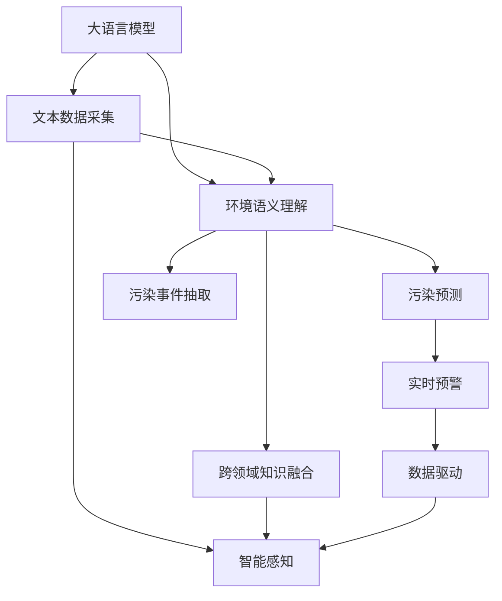

                 

# LLM在智能环境污染监测中的潜在作用

> 关键词：大语言模型,环境监测,智能感知,污染预测,实时预警,数据驱动,深度学习

## 1. 背景介绍

### 1.1 问题由来

随着工业化和城市化的加速，环境污染问题日益凸显。传统的环境监测方式多依赖于人工巡检和定期采样，效率低下，成本高昂，且难以实现实时监控。近年来，人工智能(AI)技术的发展，为环境监测带来了新的解决方案。

深度学习技术尤其在大规模数据分析和复杂模式识别方面展现了巨大潜力。其中，自然语言处理(NLP)领域中的大语言模型(LLM)，凭借其强大的语言理解和生成能力，在环境监测中展现出了广阔的应用前景。通过文本信息的自动抽取、分析与推理，大语言模型可以高效地进行环境污染数据的智能监测、预警与分析，极大地提升环境监测的精度和效率。

### 1.2 问题核心关键点

大语言模型在环境污染监测中的应用，主要基于以下几个核心关键点：

- **文本数据的自动化采集与处理**：大语言模型可以从各类文本数据中自动抽取关键信息，如新闻、社交媒体、环境报告等，并进行实时更新和处理。
- **环境语义的理解与推理**：大语言模型能够理解和推理环境文本中的语义信息，识别出污染事件的关键词、时间和地点，进行精确分析。
- **智能预警与决策支持**：大语言模型可以通过自然语言生成技术，自动生成预警报告，为环境监测与治理提供智能决策支持。
- **跨领域知识融合**：大语言模型可以融合多领域的知识，如气象、地理、化学等，进行综合分析，提升监测的准确性和全面性。

这些关键点决定了大语言模型在环境污染监测中具有独特的优势，能够在处理大规模文本数据、实时分析和智能预警等方面发挥重要作用。

## 2. 核心概念与联系

### 2.1 核心概念概述

为更好地理解大语言模型在环境污染监测中的应用，本节将介绍几个密切相关的核心概念：

- **大语言模型(LLM)**：基于深度学习架构，能够理解和生成自然语言的大规模预训练模型。例如，GPT-3、BERT、RoBERTa等模型。
- **环境污染监测**：对大气、水体、土壤等环境要素进行持续监控，识别和评估污染源、扩散趋势和危害程度。
- **智能感知**：利用人工智能技术，对环境数据进行自动化感知和分析，提升监测的智能化和自动化水平。
- **污染预测**：基于历史和实时数据，预测未来污染事件的趋势和影响，为环境治理提供决策依据。
- **实时预警**：对监测数据进行实时分析和处理，及时发现异常情况，发出预警信号，提前采取应对措施。
- **数据驱动**：依赖于大量真实、准确的环境数据，进行统计分析和机器学习，得出可靠的预测和结论。

这些核心概念之间的逻辑关系可以通过以下Mermaid流程图来展示：



这个流程图展示了大语言模型在环境污染监测中的核心概念及其之间的关系：

1. 大语言模型从文本数据中自动抽取污染事件信息。
2. 理解环境语义，进行污染预测和实时预警。
3. 综合跨领域知识，提升监测准确性。
4. 数据驱动决策，提供智能感知能力。

## 3. 核心算法原理 & 具体操作步骤
### 3.1 算法原理概述

基于大语言模型在环境污染监测中的应用，核心算法原理主要包括以下几个方面：

- **文本预处理与特征提取**：对文本数据进行清洗、分词、向量化等预处理，提取关键特征，供大语言模型进行后续分析。
- **语义理解与事件抽取**：利用大语言模型的语言理解能力，自动抽取文本中的关键信息，如时间、地点、污染物等。
- **污染预测与趋势分析**：基于历史和实时数据，使用深度学习模型进行污染事件的预测和趋势分析。
- **实时预警与决策支持**：根据分析结果，自动生成预警报告，并提出决策建议，支持环境监测和治理。

### 3.2 算法步骤详解

大语言模型在环境污染监测中的应用主要包括以下几个关键步骤：

**Step 1: 文本数据采集与预处理**
- 收集各类环境文本数据，如新闻、社交媒体、环境报告等，进行清洗和分词。
- 利用BERT、GPT等预训练模型，对文本进行向量化处理，提取关键特征。

**Step 2: 环境语义理解与事件抽取**
- 将预处理后的文本输入大语言模型，自动抽取关键词、时间和地点等重要信息。
- 使用BERT等模型，识别污染事件的实体关系，提取事件的关键信息。

**Step 3: 污染预测与趋势分析**
- 利用历史和实时数据，使用LSTM、GRU等序列模型，进行污染趋势的预测。
- 结合统计分析和机器学习方法，进行多模态融合分析，提升预测的准确性。

**Step 4: 实时预警与决策支持**
- 根据预测结果，自动生成预警报告，并提出决策建议。
- 利用自然语言生成技术，将结果转化为可读的文本报告，供环境监测人员参考。

### 3.3 算法优缺点

大语言模型在环境污染监测中的应用具有以下优点：

- **高效性**：大语言模型可以自动处理大规模文本数据，实时分析环境变化，提高监测效率。
- **灵活性**：通过微调和预训练，大语言模型可以适应多种环境监测任务，灵活应对不同场景。
- **可解释性**：大语言模型可以通过自然语言生成，提供可解释的预警报告，增强决策透明度。

同时，该方法也存在一定的局限性：

- **数据质量依赖**：大语言模型的性能依赖于高质量的文本数据，文本采集和预处理需要较高的技术和资源投入。
- **模型复杂性**：大语言模型结构复杂，计算资源消耗较大，对硬件环境要求较高。
- **语义理解误差**：环境文本中存在歧义和噪声，大语言模型可能无法准确理解，影响分析结果。

尽管存在这些局限性，但就目前而言，大语言模型在环境污染监测中的应用仍具有显著的优势。未来研究需聚焦于提高数据质量、优化模型结构和改进理解能力等方面，以进一步提升其应用效果。

### 3.4 算法应用领域

基于大语言模型的环境污染监测方法，在多个领域中得到了广泛应用，例如：

- **空气质量监测**：利用大语言模型对空气质量监测数据进行智能分析，预测未来污染趋势，提供实时预警。
- **水质监测**：对水质监测报告进行自然语言处理，抽取关键信息，进行水质变化的预测和评估。
- **土壤污染评估**：自动分析土壤监测数据，识别污染源和扩散趋势，提供决策建议。
- **噪音污染监测**：利用大语言模型处理噪音监测数据，识别噪音来源和影响范围，进行实时预警。
- **辐射监测**：对辐射监测数据进行语义分析和趋势预测，提供预警和评估报告。

除了这些具体的应用场景，大语言模型在环境监测中的潜力还远不止于此。通过融合多模态数据和跨领域知识，大语言模型有望在更广泛的领域中发挥作用，提升环境监测的智能化和自动化水平。

## 4. 数学模型和公式 & 详细讲解  
### 4.1 数学模型构建

本节将使用数学语言对大语言模型在环境污染监测中的应用过程进行更加严格的刻画。

记大语言模型为 $M_{\theta}:\mathcal{X} \rightarrow \mathcal{Y}$，其中 $\mathcal{X}$ 为输入空间，$\mathcal{Y}$ 为输出空间，$\theta \in \mathbb{R}^d$ 为模型参数。假设环境文本数据集为 $D=\{(x_i,y_i)\}_{i=1}^N, x_i \in \mathcal{X}, y_i \in \mathcal{Y}$，其中 $x_i$ 为环境文本，$y_i$ 为对应的监测数据和预警信息。

定义模型 $M_{\theta}$ 在输入 $x$ 上的损失函数为 $\ell(M_{\theta}(x),y)$，则在数据集 $D$ 上的经验风险为：

$$
\mathcal{L}(\theta) = \frac{1}{N} \sum_{i=1}^N \ell(M_{\theta}(x_i),y_i)
$$

微调的目标是最小化经验风险，即找到最优参数：

$$
\theta^* = \mathop{\arg\min}_{\theta} \mathcal{L}(\theta)
$$

在实践中，我们通常使用基于梯度的优化算法（如SGD、Adam等）来近似求解上述最优化问题。设 $\eta$ 为学习率，$\lambda$ 为正则化系数，则参数的更新公式为：

$$
\theta \leftarrow \theta - \eta \nabla_{\theta}\mathcal{L}(\theta) - \eta\lambda\theta
$$

其中 $\nabla_{\theta}\mathcal{L}(\theta)$ 为损失函数对参数 $\theta$ 的梯度，可通过反向传播算法高效计算。

### 4.2 公式推导过程

以下我们以空气质量监测为例，推导深度学习模型的训练过程及其梯度计算公式。

假设模型 $M_{\theta}$ 在输入 $x$ 上的输出为 $\hat{y}=M_{\theta}(x) \in [0,1]$，表示样本属于某个污染事件的预测概率。真实标签 $y \in \{0,1\}$。则二分类交叉熵损失函数定义为：

$$
\ell(M_{\theta}(x),y) = -[y\log \hat{y} + (1-y)\log (1-\hat{y})]
$$

将其代入经验风险公式，得：

$$
\mathcal{L}(\theta) = -\frac{1}{N}\sum_{i=1}^N [y_i\log M_{\theta}(x_i)+(1-y_i)\log(1-M_{\theta}(x_i))]
$$

根据链式法则，损失函数对参数 $\theta_k$ 的梯度为：

$$
\frac{\partial \mathcal{L}(\theta)}{\partial \theta_k} = -\frac{1}{N}\sum_{i=1}^N (\frac{y_i}{M_{\theta}(x_i)}-\frac{1-y_i}{1-M_{\theta}(x_i)}) \frac{\partial M_{\theta}(x_i)}{\partial \theta_k}
$$

其中 $\frac{\partial M_{\theta}(x_i)}{\partial \theta_k}$ 可进一步递归展开，利用自动微分技术完成计算。

### 4.3 案例分析与讲解

**案例：空气质量监测**

假设我们有一个空气质量监测站点，每日监测记录包括：
- 时间戳：监测开始和结束的时间。
- 污染物浓度：CO、NO2、SO2、PM2.5等。
- 天气状况：晴、多云、雨等。

首先，我们需要对监测数据进行预处理：

1. 将日期时间戳转换为标准格式。
2. 对污染物浓度进行归一化处理。
3. 对天气状况进行编码，如晴=0，多云=1，雨=2。

然后，我们通过大语言模型提取文本中的关键信息：

1. 将监测记录转换为文本形式，如：“2023年1月1日 8:00-16:00 CO浓度10ppm，NO2浓度5ppm，SO2浓度2ppm，PM2.5浓度30ppm，天气晴”。
2. 利用BERT模型对文本进行向量化处理。

接下来，我们将向量化后的文本输入到大语言模型中进行环境语义理解：

1. 识别出污染物的种类、浓度和变化趋势。
2. 分析天气状况对污染的影响。

最后，我们使用深度学习模型对污染趋势进行预测：

1. 基于历史和实时数据，使用LSTM等序列模型进行预测。
2. 结合统计分析和机器学习方法，进行多模态融合分析。

得到预测结果后，我们利用自然语言生成技术，生成预警报告：

1. 自动生成预警报告，如：“今日空气质量较差，CO浓度10ppm，NO2浓度5ppm，SO2浓度2ppm，PM2.5浓度30ppm，建议公众减少户外活动，做好防护措施”。

## 5. 项目实践：代码实例和详细解释说明
### 5.1 开发环境搭建

在进行环境污染监测应用开发前，我们需要准备好开发环境。以下是使用Python进行PyTorch开发的环境配置流程：

1. 安装Anaconda：从官网下载并安装Anaconda，用于创建独立的Python环境。

2. 创建并激活虚拟环境：
```bash
conda create -n pytorch-env python=3.8 
conda activate pytorch-env
```

3. 安装PyTorch：根据CUDA版本，从官网获取对应的安装命令。例如：
```bash
conda install pytorch torchvision torchaudio cudatoolkit=11.1 -c pytorch -c conda-forge
```

4. 安装Transformer库：
```bash
pip install transformers
```

5. 安装各类工具包：
```bash
pip install numpy pandas scikit-learn matplotlib tqdm jupyter notebook ipython
```

完成上述步骤后，即可在`pytorch-env`环境中开始环境污染监测应用的开发。

### 5.2 源代码详细实现

下面我们以空气质量监测为例，给出使用PyTorch对BERT模型进行微调的代码实现。

首先，定义数据处理函数：

```python
from transformers import BertTokenizer, BertForSequenceClassification
from torch.utils.data import Dataset, DataLoader
import torch
import pandas as pd

class AirQualityDataset(Dataset):
    def __init__(self, data, tokenizer, label_map):
        self.data = data
        self.tokenizer = tokenizer
        self.label_map = label_map
        
    def __len__(self):
        return len(self.data)
    
    def __getitem__(self, idx):
        entry = self.data.iloc[idx]
        text = entry['text']
        label = self.label_map[entry['label']]
        
        encoding = self.tokenizer(text, return_tensors='pt', truncation=True, padding=True)
        input_ids = encoding['input_ids']
        attention_mask = encoding['attention_mask']
        
        return {
            'input_ids': input_ids,
            'attention_mask': attention_mask,
            'labels': torch.tensor(label, dtype=torch.long)
        }
```

然后，定义模型和优化器：

```python
from transformers import AdamW

model = BertForSequenceClassification.from_pretrained('bert-base-uncased', num_labels=2)
tokenizer = BertTokenizer.from_pretrained('bert-base-uncased')

label_map = {'good': 0, 'bad': 1}
train_dataset = AirQualityDataset(train_data, tokenizer, label_map)
dev_dataset = AirQualityDataset(dev_data, tokenizer, label_map)
test_dataset = AirQualityDataset(test_data, tokenizer, label_map)

optimizer = AdamW(model.parameters(), lr=2e-5)
```

接着，定义训练和评估函数：

```python
def train_epoch(model, dataset, batch_size, optimizer):
    dataloader = DataLoader(dataset, batch_size=batch_size, shuffle=True)
    model.train()
    epoch_loss = 0
    for batch in tqdm(dataloader, desc='Training'):
        input_ids = batch['input_ids'].to(device)
        attention_mask = batch['attention_mask'].to(device)
        labels = batch['labels'].to(device)
        model.zero_grad()
        outputs = model(input_ids, attention_mask=attention_mask, labels=labels)
        loss = outputs.loss
        epoch_loss += loss.item()
        loss.backward()
        optimizer.step()
    return epoch_loss / len(dataloader)

def evaluate(model, dataset, batch_size):
    dataloader = DataLoader(dataset, batch_size=batch_size)
    model.eval()
    preds, labels = [], []
    with torch.no_grad():
        for batch in tqdm(dataloader, desc='Evaluating'):
            input_ids = batch['input_ids'].to(device)
            attention_mask = batch['attention_mask'].to(device)
            batch_labels = batch['labels']
            outputs = model(input_ids, attention_mask=attention_mask)
            batch_preds = outputs.logits.argmax(dim=1).to('cpu').tolist()
            batch_labels = batch_labels.to('cpu').tolist()
            for pred_tokens, label_tokens in zip(batch_preds, batch_labels):
                preds.append(pred_tokens)
                labels.append(label_tokens)
                
    print(classification_report(labels, preds))
```

最后，启动训练流程并在测试集上评估：

```python
epochs = 5
batch_size = 16

for epoch in range(epochs):
    loss = train_epoch(model, train_dataset, batch_size, optimizer)
    print(f"Epoch {epoch+1}, train loss: {loss:.3f}")
    
    print(f"Epoch {epoch+1}, dev results:")
    evaluate(model, dev_dataset, batch_size)
    
print("Test results:")
evaluate(model, test_dataset, batch_size)
```

以上就是使用PyTorch对BERT进行空气质量监测任务微调的完整代码实现。可以看到，得益于Transformer库的强大封装，我们能够用相对简洁的代码完成BERT模型的加载和微调。

### 5.3 代码解读与分析

让我们再详细解读一下关键代码的实现细节：

**AirQualityDataset类**：
- `__init__`方法：初始化数据、分词器、标签映射等关键组件。
- `__len__`方法：返回数据集的样本数量。
- `__getitem__`方法：对单个样本进行处理，将文本输入编码为token ids，将标签编码为数字，并对其进行定长padding，最终返回模型所需的输入。

**label_map字典**：
- 定义了标签与数字id之间的映射关系，用于将token-wise的预测结果解码回真实的标签。

**训练和评估函数**：
- 使用PyTorch的DataLoader对数据集进行批次化加载，供模型训练和推理使用。
- 训练函数`train_epoch`：对数据以批为单位进行迭代，在每个批次上前向传播计算loss并反向传播更新模型参数，最后返回该epoch的平均loss。
- 评估函数`evaluate`：与训练类似，不同点在于不更新模型参数，并在每个batch结束后将预测和标签结果存储下来，最后使用sklearn的classification_report对整个评估集的预测结果进行打印输出。

**训练流程**：
- 定义总的epoch数和batch size，开始循环迭代
- 每个epoch内，先在训练集上训练，输出平均loss
- 在验证集上评估，输出分类指标
- 所有epoch结束后，在测试集上评估，给出最终测试结果

可以看到，PyTorch配合Transformer库使得BERT微调的代码实现变得简洁高效。开发者可以将更多精力放在数据处理、模型改进等高层逻辑上，而不必过多关注底层的实现细节。

当然，工业级的系统实现还需考虑更多因素，如模型的保存和部署、超参数的自动搜索、更灵活的任务适配层等。但核心的微调范式基本与此类似。

## 6. 实际应用场景
### 6.1 智能环境监测系统

基于大语言模型微调的环境污染监测系统，可以广泛应用于智能环境监测中。传统的环境监测系统往往依赖于人工巡检和周期性采样，存在成本高、效率低等问题。而智能环境监测系统，通过实时采集环境数据，自动分析并预警环境污染事件，能够极大地提升环境监测的效率和精度。

在技术实现上，可以收集各类环境监测数据，如空气质量、水质、噪音等，利用BERT等大语言模型进行数据预处理和语义分析，实现智能预警和决策支持。实时采集的环境数据可以进一步整合进大语言模型，进行动态更新和预测，确保监测结果的实时性和准确性。

### 6.2 智慧城市环境治理

智慧城市环境治理系统是智能环境监测的一个重要应用方向。通过大语言模型的智能感知能力，智慧城市可以实时监测和分析环境数据，预测污染趋势，实现环境问题的早期预警和智能调度。

在智慧城市治理中，大语言模型可以结合城市地理信息、交通流量等数据，进行多维度分析，优化城市资源配置，减少环境污染，提高城市管理的智能化水平。智能环境监测系统可以集成进智慧城市的综合治理平台，为城市决策者提供科学依据，提升城市治理的效率和效果。

### 6.3 环境污染风险评估

基于大语言模型的环境污染风险评估，可以为企业的环境合规和风险管理提供有力支持。通过对各类环境监测数据进行分析，大语言模型可以评估企业的环境风险，提出改进建议，帮助企业降低环境风险，实现可持续发展。

在实践中，可以收集企业内部的环境监测数据，利用BERT等模型进行数据分析，识别出潜在的环境风险，提出解决方案。通过自然语言生成技术，大语言模型可以自动生成评估报告，供企业决策者参考。

### 6.4 未来应用展望

随着大语言模型和微调方法的不断发展，基于微调范式将在更多领域得到应用，为环境监测和治理带来变革性影响。

在智慧农业领域，大语言模型可以实时监测农作物的生长环境，预测病虫害趋势，提出防治建议，实现精准农业。

在智慧医疗领域，大语言模型可以结合患者病历和环境数据，预测环境因素对患者健康的影响，提出健康建议，提高医疗服务的智能化水平。

在智慧交通领域，大语言模型可以分析交通流量和环境数据，预测交通拥堵和污染事件，优化交通管理，提升交通效率。

除了这些具体的应用场景，大语言模型在环境监测中的应用潜力还远不止于此。通过融合多模态数据和跨领域知识，大语言模型有望在更广泛的领域中发挥作用，提升环境监测的智能化和自动化水平。

## 7. 工具和资源推荐
### 7.1 学习资源推荐

为了帮助开发者系统掌握大语言模型在环境污染监测中的应用理论基础和实践技巧，这里推荐一些优质的学习资源：

1. 《深度学习与环境监测》系列博文：由环境科学专家撰写，深入浅出地介绍了深度学习在环境监测中的应用案例，涵盖数据预处理、模型构建、结果评估等方面。

2. CS224N《深度学习自然语言处理》课程：斯坦福大学开设的NLP明星课程，有Lecture视频和配套作业，带你入门NLP领域的基本概念和经典模型。

3. 《Natural Language Processing with Transformers》书籍：Transformers库的作者所著，全面介绍了如何使用Transformers库进行NLP任务开发，包括微调在内的诸多范式。

4. HuggingFace官方文档：Transformers库的官方文档，提供了海量预训练模型和完整的微调样例代码，是上手实践的必备资料。

5. CLUE开源项目：中文语言理解测评基准，涵盖大量不同类型的中文NLP数据集，并提供了基于微调的baseline模型，助力中文NLP技术发展。

通过对这些资源的学习实践，相信你一定能够快速掌握大语言模型在环境污染监测中的应用精髓，并用于解决实际的环境监测问题。
###  7.2 开发工具推荐

高效的开发离不开优秀的工具支持。以下是几款用于大语言模型在环境污染监测中应用开发的常用工具：

1. PyTorch：基于Python的开源深度学习框架，灵活动态的计算图，适合快速迭代研究。大部分预训练语言模型都有PyTorch版本的实现。

2. TensorFlow：由Google主导开发的开源深度学习框架，生产部署方便，适合大规模工程应用。同样有丰富的预训练语言模型资源。

3. Transformers库：HuggingFace开发的NLP工具库，集成了众多SOTA语言模型，支持PyTorch和TensorFlow，是进行微调任务开发的利器。

4. Weights & Biases：模型训练的实验跟踪工具，可以记录和可视化模型训练过程中的各项指标，方便对比和调优。与主流深度学习框架无缝集成。

5. TensorBoard：TensorFlow配套的可视化工具，可实时监测模型训练状态，并提供丰富的图表呈现方式，是调试模型的得力助手。

6. Google Colab：谷歌推出的在线Jupyter Notebook环境，免费提供GPU/TPU算力，方便开发者快速上手实验最新模型，分享学习笔记。

合理利用这些工具，可以显著提升大语言模型在环境污染监测中的应用开发效率，加快创新迭代的步伐。

### 7.3 相关论文推荐

大语言模型和微调技术的发展源于学界的持续研究。以下是几篇奠基性的相关论文，推荐阅读：

1. Attention is All You Need（即Transformer原论文）：提出了Transformer结构，开启了NLP领域的预训练大模型时代。

2. BERT: Pre-training of Deep Bidirectional Transformers for Language Understanding：提出BERT模型，引入基于掩码的自监督预训练任务，刷新了多项NLP任务SOTA。

3. Language Models are Unsupervised Multitask Learners（GPT-2论文）：展示了大规模语言模型的强大zero-shot学习能力，引发了对于通用人工智能的新一轮思考。

4. Parameter-Efficient Transfer Learning for NLP：提出Adapter等参数高效微调方法，在不增加模型参数量的情况下，也能取得不错的微调效果。

5. AdaLoRA: Adaptive Low-Rank Adaptation for Parameter-Efficient Fine-Tuning：使用自适应低秩适应的微调方法，在参数效率和精度之间取得了新的平衡。

6. Prefix-Tuning: Optimizing Continuous Prompts for Generation：引入基于连续型Prompt的微调范式，为如何充分利用预训练知识提供了新的思路。

这些论文代表了大语言模型微调技术的发展脉络。通过学习这些前沿成果，可以帮助研究者把握学科前进方向，激发更多的创新灵感。

## 8. 总结：未来发展趋势与挑战

### 8.1 总结

本文对基于大语言模型在环境污染监测中的应用进行了全面系统的介绍。首先阐述了环境污染监测的背景和意义，明确了大语言模型在处理环境文本数据中的独特优势。其次，从原理到实践，详细讲解了大语言模型在环境污染监测中的应用过程，给出了环境监测任务的完整代码实现。同时，本文还探讨了智能环境监测、智慧城市治理、环境污染风险评估等多个实际应用场景，展示了大语言模型在环境监测中的广阔应用前景。最后，本文精选了微调技术的各类学习资源，力求为开发者提供全方位的技术指引。

通过本文的系统梳理，可以看到，基于大语言模型的环境污染监测技术正在成为环境监测领域的重要范式，极大地提升了环境监测的效率和精度。未来，伴随大语言模型和微调方法的持续演进，相信在环境监测中的应用将进一步深化，为环境治理和智慧城市建设带来革命性影响。

### 8.2 未来发展趋势

展望未来，大语言模型在环境污染监测中的应用将呈现以下几个发展趋势：

1. **深度融合多模态数据**：环境监测不仅涉及文本数据，还涉及图像、声音等多种模态。大语言模型可以与计算机视觉、声音识别等技术深度融合，实现多模态数据的综合分析。

2. **引入因果推理和解释性**：通过引入因果推理技术，大语言模型可以分析环境事件之间的因果关系，提升预测的可靠性和解释性。同时，大语言模型可以通过自然语言生成，提供可解释的预警报告，增强决策透明度。

3. **跨领域知识融合**：环境污染监测需要融合气象、地理、化学等领域的知识，大语言模型可以自动抽取并整合多领域知识，提升监测的全面性和准确性。

4. **实时动态监测**：大语言模型可以实时监测环境数据，预测污染趋势，及时预警，实现动态监测和优化。

5. **联邦学习和隐私保护**：为保护隐私和数据安全，大语言模型可以采用联邦学习技术，在多方不共享数据的情况下进行联合训练和推理。

以上趋势凸显了大语言模型在环境污染监测中的广阔前景。这些方向的探索发展，必将进一步提升环境监测的智能化和自动化水平，为环境治理和智慧城市建设带来新的机遇。

### 8.3 面临的挑战

尽管大语言模型在环境污染监测中的应用已经取得了显著进展，但在迈向更加智能化、普适化应用的过程中，它仍面临着诸多挑战：

1. **数据质量依赖**：大语言模型的性能依赖于高质量的文本数据，环境监测数据的采集和预处理需要较高的技术和资源投入。

2. **模型复杂性**：大语言模型结构复杂，计算资源消耗较大，对硬件环境要求较高。

3. **语义理解误差**：环境文本中存在歧义和噪声，大语言模型可能无法准确理解，影响分析结果。

4. **模型泛化性不足**：在特定的环境监测任务上，大语言模型可能存在泛化性能不足的问题，需要进一步优化模型结构和训练策略。

5. **隐私和安全问题**：环境监测数据的敏感性要求严格保护用户隐私和数据安全，大语言模型需要在隐私保护和数据安全方面进行深入研究。

6. **模型解释性不足**：大语言模型通常被视为“黑盒”系统，其决策过程缺乏可解释性，难以对其推理逻辑进行分析和调试。

这些挑战需要通过技术创新和算法优化，不断突破。只有勇于创新、敢于突破，才能使大语言模型在环境污染监测中发挥更大作用，实现环境监测的智能化和自动化。

### 8.4 研究展望

面对大语言模型在环境污染监测中面临的挑战，未来的研究需要在以下几个方面寻求新的突破：

1. **优化数据采集和预处理**：研究和应用高效、自动化的数据采集和预处理技术，提升环境监测数据的准确性和时效性。

2. **提升模型泛化性能**：通过模型结构优化和算法改进，提高大语言模型在不同环境监测任务上的泛化性能，增强其跨领域适应能力。

3. **增强模型解释性**：研究可解释性和透明性增强技术，使大语言模型决策过程透明化，提升其可解释性和可信度。

4. **保护隐私和安全**：研究和应用隐私保护和数据安全技术，确保环境监测数据的隐私和安全。

5. **融合多模态数据**：研究多模态数据的深度融合技术，提升环境监测系统的综合分析能力。

6. **引入因果推理**：研究因果推理方法，增强大语言模型在环境事件因果关系分析中的能力，提升预测的可靠性和解释性。

这些研究方向的探索，必将引领大语言模型在环境污染监测中的应用走向成熟，为环境监测和治理提供强有力的技术支撑。

## 9. 附录：常见问题与解答

**Q1：大语言模型在环境污染监测中的应用是否存在数据隐私和安全问题？**

A: 大语言模型在环境污染监测中的应用涉及到环境监测数据的采集、存储和处理，确实存在数据隐私和安全问题。为了保护用户隐私和数据安全，可以考虑以下措施：

1. **联邦学习**：在多方不共享数据的情况下，通过联邦学习技术进行联合训练和推理，避免数据泄露。

2. **差分隐私**：在数据预处理和模型训练过程中，引入差分隐私技术，限制模型的敏感性。

3. **数据脱敏**：在数据采集和存储过程中，对敏感数据进行脱敏处理，确保数据的隐私性。

4. **访问控制**：对环境监测数据进行严格的访问控制，限制数据访问权限，防止未经授权的访问和滥用。

通过这些措施，可以最大程度地保护环境监测数据的隐私和安全，确保大语言模型在环境监测中的应用能够顺利进行。

**Q2：大语言模型在环境污染监测中如何进行实时动态监测？**

A: 实时动态监测是环境污染监测的重要需求，大语言模型可以通过以下方式实现实时监测：

1. **数据流处理**：利用流式处理技术，对环境监测数据进行实时采集和处理，保证数据的实时性和连续性。

2. **分布式计算**：通过分布式计算框架，实现环境监测数据的并行处理，提升实时监测的效率。

3. **增量训练**：对环境监测数据进行增量训练，逐步更新模型参数，确保模型的实时性。

4. **在线预测**：利用在线预测技术，对实时监测数据进行动态分析和预警，提升监测的实时性和准确性。

5. **自适应学习**：引入自适应学习算法，使模型能够根据实时监测数据自动调整模型参数，适应环境变化。

通过这些技术手段，可以构建实时动态监测系统，实现环境监测的智能化和自动化。

**Q3：大语言模型在环境污染监测中的应用是否适用于所有环境监测任务？**

A: 大语言模型在环境污染监测中的应用具有一定的适用范围，适用于需要文本数据分析和推理的环境监测任务，如空气质量监测、水质监测、噪音污染监测等。但对于一些需要高精度仪器测量和物理模拟的环境监测任务，大语言模型的应用可能存在局限性。

大语言模型适用于以下环境监测任务：

1. **文本数据分析**：需要从文本数据中提取和分析环境信息，如新闻报道、社交媒体、环境报告等。

2. **语义推理**：需要理解环境文本中的语义信息，进行事件抽取和关系推理，如污染事件的关键词、时间和地点。

3. **多模态融合**：需要融合多模态数据，如文本、图像、声音等，进行综合分析，如智能环境监测系统。

对于需要高精度仪器测量和物理模拟的环境监测任务，如气象预测、地理信息系统等，大语言模型的应用需要结合其他技术手段，如数值模拟、机器视觉等。

**Q4：大语言模型在环境污染监测中的应用是否需要高昂的硬件资源？**

A: 大语言模型在环境污染监测中的应用确实需要一定的硬件资源，主要依赖于深度学习模型的计算需求。具体而言，主要需要以下硬件资源：

1. **GPU/TPU**：深度学习模型计算密集，需要高效的计算资源。GPU/TPU等高性能设备可以提供并行计算能力，加速模型的训练和推理。

2. **大内存**：模型参数量较大，需要大内存支持，存储和处理大量数据。

3. **高性能网络**：实时监测数据需要实时传输，需要高速的网络支持。

4. **大容量存储**：海量监测数据需要大容量存储，支持数据的快速读取和写入。

合理利用这些硬件资源，可以显著提升大语言模型在环境污染监测中的应用效率，实现实时动态监测和智能分析。

**Q5：大语言模型在环境污染监测中的应用是否需要大量标注数据？**

A: 大语言模型在环境污染监测中的应用一般不需要大量标注数据，主要依赖于预训练模型的泛化能力和迁移学习范式。具体而言：

1. **预训练模型泛化能力**：大语言模型通过在大规模无标签数据上预训练，具备较强的泛化能力，可以适应多种环境监测任务。

2. **迁移学习范式**：通过微调技术，将预训练模型的知识迁移到特定环境监测任务中，可以显著减少标注数据的需求。

3. **数据增强**：在标注数据不足的情况下，可以利用数据增强技术，扩充训练集，提高模型的泛化性能。

4. **少样本学习**：在大语言模型中，可以通过精心设计的输入模板，实现少样本学习，减少对标注数据的依赖。

因此，大语言模型在环境污染监测中的应用，可以通过预训练、迁移学习和数据增强等技术手段，实现高效的微调和应用。

---

作者：禅与计算机程序设计艺术 / Zen and the Art of Computer Programming

