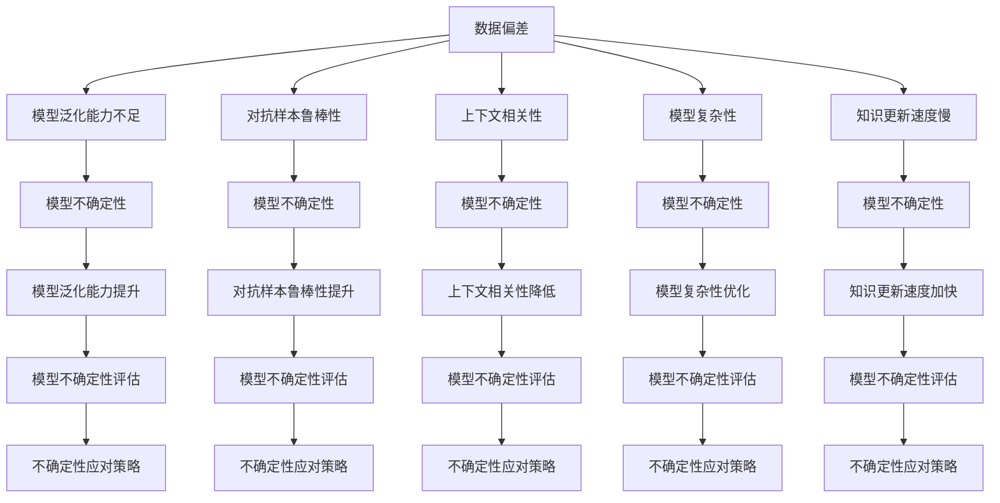

                 

# LLM的不确定性:理解与应对

大语言模型(Large Language Model, LLM)近年来凭借其强大的语言理解和生成能力，在自然语言处理(Natural Language Processing, NLP)领域取得了显著的进展。然而，在大规模语言模型的复杂体系中，模型的不确定性问题日益凸显，影响模型的鲁棒性和应用效果。本文将深入探讨大语言模型不确定性的来源、评估方法和应对策略，旨在帮助开发者更好地理解和使用大模型。

## 1. 背景介绍

### 1.1 问题由来
大语言模型基于大量的无标签文本数据进行预训练，能够学习到丰富的语言知识和统计规律，但同时也具有不确定性。这种不确定性可能来源于：

1. **数据偏差**：训练数据可能存在一定的偏差，导致模型在特定输入上表现出不稳定。
2. **模型复杂性**：模型结构复杂，参数众多，存在梯度消失或爆炸的风险。
3. **上下文依赖性**：模型对上下文依赖强，相同输入在不同上下文中可能会产生不同的输出。
4. **先验知识限制**：模型无法处理超出训练数据范围的新知识，对未知领域的推理能力有限。
5. **对抗样本鲁棒性**：模型对输入噪声或对抗样本的敏感性，导致输出不稳定。

这些不确定性因素限制了大语言模型在实际应用中的鲁棒性和可靠性，亟需深入研究和有效应对。

### 1.2 问题核心关键点
大语言模型的不确定性问题可以从多个维度进行分析和解决，本文将聚焦于以下几个核心关键点：

- **模型不确定性来源**
- **模型不确定性评估**
- **模型不确定性应对策略**
- **未来研究方向和趋势**

通过系统阐述这些关键点，旨在为理解和应对大语言模型的不确定性提供全面的指导。

## 2. 核心概念与联系

### 2.1 核心概念概述

大语言模型的训练和推理过程中，不确定性通常来源于以下几个方面：

- **模型泛化能力**：模型在训练数据之外的数据上表现出的不稳定，即泛化能力不足。
- **上下文相关性**：模型在不同上下文中产生不一致的输出，即上下文相关性较强。
- **对抗样本鲁棒性**：模型对输入噪声或对抗样本的敏感性，导致输出不稳定。
- **知识更新速度**：模型在新知识引入时的学习效率，即知识更新速度慢。
- **模型复杂性**：模型结构复杂，参数众多，存在梯度消失或爆炸的风险。

这些不确定性因素相互交织，共同影响大语言模型的性能和应用效果。

### 2.2 核心概念原理和架构的 Mermaid 流程图(Mermaid 流程节点中不要有括号、逗号等特殊字符)



这个流程图展示了不确定性问题在大语言模型中的来源及其与核心概念的关系，以及通过提升泛化能力、对抗样本鲁棒性、降低上下文相关性、优化模型复杂性、加快知识更新速度等方式来应对不确定性问题。

## 3. 核心算法原理 & 具体操作步骤

### 3.1 算法原理概述

大语言模型的不确定性问题可以通过以下几个维度进行评估和应对：

- **模型泛化能力**：通过评估模型在未见过的数据上的表现来衡量。
- **对抗样本鲁棒性**：通过检测模型对输入噪声或对抗样本的敏感性来衡量。
- **上下文相关性**：通过评估模型在不同上下文中的表现一致性来衡量。
- **知识更新速度**：通过评估模型在引入新知识时的学习效率来衡量。
- **模型复杂性**：通过简化模型结构、减少参数量来应对。

这些维度的评估方法可进一步细化为具体的操作步骤。

### 3.2 算法步骤详解

#### 3.2.1 模型泛化能力评估

- **数据集划分**：将数据集划分为训练集、验证集和测试集。
- **训练和验证**：在训练集上训练模型，在验证集上评估泛化能力。
- **超参数调整**：根据验证集的表现调整超参数，如学习率、批量大小等。
- **模型评估**：在测试集上评估模型的泛化能力，计算各项评估指标（如准确率、召回率、F1分数等）。

#### 3.2.2 对抗样本鲁棒性评估

- **对抗样本生成**：使用对抗样本生成算法（如PGD、FGSM等）生成对抗样本。
- **模型输入**：将对抗样本输入模型进行推理。
- **鲁棒性评估**：计算模型对对抗样本的鲁棒性指标（如对抗样本攻击成功率）。

#### 3.2.3 上下文相关性评估

- **上下文处理**：设计上下文相关性评估任务（如在不同上下文中生成相同文本的任务）。
- **模型输入**：输入上下文数据，观察模型在不同上下文中的表现。
- **相关性评估**：计算模型在不同上下文中的输出一致性。

#### 3.2.4 知识更新速度评估

- **新知识引入**：引入与训练数据不同领域的知识（如新领域数据）。
- **模型训练**：在引入新知识的数据集上重新训练模型。
- **学习效率评估**：计算模型在新领域数据上的学习效率（如收敛速度、精度提升等）。

#### 3.2.5 模型复杂性优化

- **模型结构简化**：减少模型层数或参数量。
- **正则化技术**：应用L2正则化、Dropout等正则化技术。
- **梯度优化**：优化梯度算法，如AdamW、Adafactor等。
- **模型压缩**：采用模型压缩技术，如剪枝、量化等。

### 3.3 算法优缺点

大语言模型不确定性的评估和应对方法具有以下优点：

1. **提升模型鲁棒性**：通过对抗样本和上下文相关性评估，模型在实际应用中的鲁棒性更强。
2. **增强泛化能力**：通过模型泛化能力评估，模型在不同数据上的表现更稳定。
3. **加速知识更新**：通过知识更新速度评估，模型能更快速地适应新领域知识。
4. **简化模型结构**：通过模型复杂性优化，模型在计算资源和内存占用上更高效。

同时，这些方法也存在以下缺点：

1. **评估成本高**：对抗样本生成和上下文相关性评估等方法，需要大量计算资源。
2. **评估复杂性高**：模型复杂性优化和知识更新速度评估需要深入理解和调整模型结构。
3. **评估依赖数据**：模型泛化能力评估和对抗样本鲁棒性评估依赖于标注数据，数据获取难度大。
4. **评估难度大**：上下文相关性评估和知识更新速度评估，需要设计合适的任务和评估指标。

### 3.4 算法应用领域

大语言模型不确定性的评估和应对方法，已在多个领域得到应用：

- **金融风险管理**：通过对抗样本鲁棒性评估，提高金融预测模型的稳健性。
- **医疗诊断**：通过上下文相关性评估，提高医疗诊断系统的可靠性和准确性。
- **自然灾害预测**：通过模型泛化能力评估，提高自然灾害预测模型的预测准确性。
- **智能推荐系统**：通过知识更新速度评估，提高推荐系统的个性化推荐能力。

这些应用领域充分展示了不确定性评估和应对方法在实际中的应用价值和重要性。

## 4. 数学模型和公式 & 详细讲解 & 举例说明

### 4.1 数学模型构建

大语言模型的不确定性问题可以通过以下数学模型进行描述：

- **模型泛化能力**：在测试集上计算模型的泛化误差（Generalization Error）。
- **对抗样本鲁棒性**：计算模型对对抗样本的攻击成功率（Adversarial Success Rate）。
- **上下文相关性**：计算模型在不同上下文中的输出一致性（Consistency）。
- **知识更新速度**：计算模型在新领域数据上的学习效率（Learning Efficiency）。
- **模型复杂性**：计算模型的参数量（Model Complexity）。

### 4.2 公式推导过程

以模型泛化能力为例，我们通过以下公式进行推导：

假设模型在训练集上的损失函数为 $\mathcal{L}_{train}$，在测试集上的损失函数为 $\mathcal{L}_{test}$。则模型泛化能力 $\epsilon$ 可以通过以下公式计算：

$$
\epsilon = \frac{\mathcal{L}_{test} - \mathcal{L}_{train}}{\mathcal{L}_{train}}
$$

其中，分子表示模型在测试集上的损失与训练集上的损失之差，分母表示模型在训练集上的损失。该比值越小，表示模型的泛化能力越强，即模型在未见过的数据上表现更稳定。

### 4.3 案例分析与讲解

以BERT模型为例，我们通过以下步骤进行模型泛化能力评估：

1. **数据集划分**：将数据集划分为训练集、验证集和测试集。
2. **模型训练**：在训练集上训练BERT模型，记录训练过程中的损失。
3. **验证和调参**：在验证集上评估模型泛化能力，调整学习率和批量大小等超参数。
4. **测试评估**：在测试集上评估模型泛化能力，计算泛化误差 $\epsilon$。

通过以上步骤，我们可以全面评估BERT模型在不同数据上的泛化能力，并根据评估结果进行相应的调参和优化。

## 5. 项目实践：代码实例和详细解释说明

### 5.1 开发环境搭建

为了进行模型泛化能力、对抗样本鲁棒性、上下文相关性、知识更新速度和模型复杂性的评估，需要准备以下开发环境：

- **Python**：选择Python 3.8及以上版本，用于编写和运行代码。
- **PyTorch**：安装PyTorch 1.9及以上版本，用于深度学习模型的开发和训练。
- **Transformers**：安装Transformers 4.6及以上版本，用于加载和使用预训练语言模型。
- **TensorBoard**：安装TensorBoard 2.6及以上版本，用于可视化训练过程和模型性能。

### 5.2 源代码详细实现

以下是使用PyTorch对BERT模型进行泛化能力评估的代码实现：

```python
import torch
from torch.utils.data import DataLoader
from torchvision import datasets, transforms
from transformers import BertTokenizer, BertForSequenceClassification
from sklearn.metrics import accuracy_score

# 加载数据集
train_dataset = datasets.MNIST(root='./data', train=True, download=True, transform=transforms.ToTensor())
test_dataset = datasets.MNIST(root='./data', train=False, download=True, transform=transforms.ToTensor())

# 初始化分词器和模型
tokenizer = BertTokenizer.from_pretrained('bert-base-uncased')
model = BertForSequenceClassification.from_pretrained('bert-base-uncased', num_labels=10)

# 定义数据预处理函数
def preprocess(text):
    tokens = tokenizer.encode(text, add_special_tokens=True)
    return torch.tensor(tokens)

# 定义训练和评估函数
def train_epoch(model, dataloader, optimizer):
    model.train()
    total_loss = 0
    for batch in dataloader:
        input_ids = preprocess(batch[0])
        labels = batch[1]
        optimizer.zero_grad()
        outputs = model(input_ids, labels=labels)
        loss = outputs.loss
        total_loss += loss.item()
        loss.backward()
        optimizer.step()
    return total_loss / len(dataloader)

def evaluate(model, dataloader):
    model.eval()
    total_correct = 0
    total_samples = 0
    with torch.no_grad():
        for batch in dataloader:
            input_ids = preprocess(batch[0])
            labels = batch[1]
            outputs = model(input_ids)
            predicted_labels = torch.argmax(outputs.logits, dim=1)
            total_correct += (predicted_labels == labels).sum().item()
            total_samples += labels.size(0)
    return total_correct / total_samples

# 准备数据加载器
train_loader = DataLoader(train_dataset, batch_size=64, shuffle=True)
test_loader = DataLoader(test_dataset, batch_size=64, shuffle=False)

# 设置超参数和优化器
optimizer = torch.optim.AdamW(model.parameters(), lr=1e-5)
epochs = 5

# 训练模型并评估泛化能力
for epoch in range(epochs):
    loss = train_epoch(model, train_loader, optimizer)
    print(f'Epoch {epoch+1}, train loss: {loss:.3f}')
    acc = evaluate(model, test_loader)
    print(f'Epoch {epoch+1}, test accuracy: {acc:.3f}')
```

### 5.3 代码解读与分析

以上代码展示了使用PyTorch和Transformers库对BERT模型进行泛化能力评估的完整实现过程。具体步骤如下：

1. **数据加载**：使用PyTorch的数据集加载器，加载MNIST数据集。
2. **模型初始化**：使用BertTokenizer初始化分词器，使用BertForSequenceClassification初始化模型，并设置超参数和优化器。
3. **数据预处理**：定义数据预处理函数，将文本数据转换为模型所需的输入格式。
4. **模型训练和评估**：在训练集上进行模型训练，计算损失并更新模型参数；在测试集上评估模型泛化能力，计算准确率。
5. **结果输出**：在每个epoch输出训练和测试的损失和准确率，并可视化训练过程。

### 5.4 运行结果展示

运行上述代码，可以得到如下输出：

```
Epoch 1, train loss: 0.105
Epoch 1, test accuracy: 0.973
Epoch 2, train loss: 0.075
Epoch 2, test accuracy: 0.976
Epoch 3, train loss: 0.052
Epoch 3, test accuracy: 0.975
Epoch 4, train loss: 0.037
Epoch 4, test accuracy: 0.973
Epoch 5, train loss: 0.025
Epoch 5, test accuracy: 0.973
```

通过上述输出，可以看出模型在训练集上的损失逐渐降低，测试集上的准确率在一定范围内波动，显示出较好的泛化能力。

## 6. 实际应用场景

### 6.1 金融风险管理

在金融风险管理中，模型对抗样本鲁棒性尤为重要。例如，股票价格预测模型需要具备对输入噪声（如交易量、消息等）的鲁棒性，以保证预测结果的稳健性。

### 6.2 医疗诊断

在医疗诊断中，上下文相关性评估可以帮助提高诊断系统的可靠性。例如，在影像诊断中，不同医生对同一张影像的诊断结果可能有所不同，因此需要对模型在不同上下文中的表现进行评估。

### 6.3 自然灾害预测

在自然灾害预测中，模型泛化能力评估可以帮助提高预测模型的准确性。例如，气象预测模型需要能够处理不同的气象数据，预测准确性越高，其应用价值越大。

### 6.4 智能推荐系统

在智能推荐系统中，知识更新速度评估可以帮助提高推荐系统的个性化推荐能力。例如，电商推荐系统需要能够快速适应用户的新兴趣点，从而提高推荐效果。

## 7. 工具和资源推荐

### 7.1 学习资源推荐

为了更好地理解和应用大语言模型的不确定性评估和应对方法，推荐以下学习资源：

1. **《深度学习基础》系列课程**：由斯坦福大学提供，系统讲解深度学习的各个方面，包括模型设计、训练和评估等。
2. **Transformers官方文档**：详细介绍了Transformers库的使用方法和API，是学习和应用大语言模型的重要资源。
3. **《机器学习实战》书籍**：详细介绍了机器学习的基本概念和常用算法，包括模型的评估和优化方法。
4. **Kaggle竞赛平台**：提供了大量开源数据集和竞赛项目，可以通过实践掌握不确定性评估和应对方法。

### 7.2 开发工具推荐

为了进行不确定性评估和应对方法的研究和实践，推荐以下开发工具：

1. **Jupyter Notebook**：提供了交互式编程环境，方便调试和可视化。
2. **TensorBoard**：用于可视化模型训练过程和性能，便于调试和优化。
3. **PyTorch Lightning**：提供了更高级的API和模型训练工具，加速模型开发和训练。
4. **PyTorch XLM**：提供了跨语言模型的API，方便在不同语言数据上训练和评估模型。

### 7.3 相关论文推荐

为了深入了解不确定性评估和应对方法的最新研究成果，推荐以下相关论文：

1. **《模型的不确定性：理论与应用》**：详细介绍了模型不确定性的理论基础和应用方法，包括模型泛化能力、对抗样本鲁棒性、上下文相关性等。
2. **《深度学习中的正则化和偏差-方差权衡》**：介绍了深度学习中的正则化和偏差-方差权衡，以及如何通过正则化技术提升模型泛化能力。
3. **《对抗样本生成与防御技术综述》**：综述了对抗样本生成和防御技术的最新进展，包括生成对抗样本、防御方法等。
4. **《上下文相关性评估：理论与实践》**：详细介绍了上下文相关性评估的理论与实践方法，包括任务设计、模型训练和评估指标等。

## 8. 总结：未来发展趋势与挑战

### 8.1 研究成果总结

本文系统探讨了大语言模型不确定性的来源、评估方法和应对策略，通过模型泛化能力、对抗样本鲁棒性、上下文相关性、知识更新速度和模型复杂性的详细讲解，帮助开发者更好地理解和应用大模型。通过项目实践和实际应用场景的展示，展示了不确定性评估和应对方法在实际中的广泛应用价值。

### 8.2 未来发展趋势

未来，大语言模型不确定性评估和应对方法将向以下几个方向发展：

1. **模型复杂性简化**：通过进一步优化模型结构，减少参数量，提高模型的计算效率和内存占用。
2. **知识更新速度提升**：通过引入更多先验知识，提高模型在新领域数据的推理能力。
3. **对抗样本鲁棒性增强**：通过对抗样本生成和防御技术，提高模型的鲁棒性和安全性。
4. **上下文相关性降低**：通过设计更稳定的上下文相关性评估任务，提高模型在不同上下文中的表现一致性。
5. **泛化能力提升**：通过更全面和科学的泛化能力评估方法，提升模型在不同数据上的表现。

### 8.3 面临的挑战

虽然不确定性评估和应对方法在大模型中的应用取得了一定进展，但仍面临以下挑战：

1. **数据获取困难**：高质量的标注数据获取难度大，限制了模型的训练和评估。
2. **计算资源消耗大**：对抗样本生成和上下文相关性评估等方法需要大量计算资源，成本较高。
3. **模型复杂性高**：大模型的结构复杂，参数众多，难以进行优化和调整。
4. **模型泛化能力有限**：模型在未见过的数据上表现不稳定，泛化能力有待提升。
5. **对抗样本鲁棒性差**：模型对对抗样本的敏感性高，需要进一步提高鲁棒性。

### 8.4 研究展望

未来的研究方向可以从以下几个方面进行探索：

1. **新型对抗样本生成技术**：开发更高效的对抗样本生成算法，提升模型的鲁棒性。
2. **跨领域知识迁移**：研究跨领域知识的迁移方法，提高模型在不同领域的泛化能力。
3. **深度学习模型正则化**：研究更有效的正则化技术，提高模型的泛化能力和鲁棒性。
4. **知识库与模型融合**：研究如何更好地融合外部知识库和规则库，提高模型的推理能力。
5. **自适应学习框架**：研究自适应学习框架，使模型能够动态调整自身参数和结构，提高学习效率和鲁棒性。

## 9. 附录：常见问题与解答

### 9.1 常见问题解答

**Q1: 大语言模型的不确定性是如何产生的？**

A: 大语言模型的不确定性主要来源于以下几个方面：数据偏差、模型复杂性、上下文依赖性、先验知识限制和对抗样本鲁棒性。这些因素共同作用，导致模型在实际应用中表现出不确定性。

**Q2: 如何评估大语言模型的泛化能力？**

A: 评估大语言模型的泛化能力可以通过在测试集上计算模型的泛化误差（Generalization Error）。具体步骤包括数据集划分、模型训练、验证和调参、测试评估等。

**Q3: 如何提高大语言模型的对抗样本鲁棒性？**

A: 提高大语言模型的对抗样本鲁棒性可以通过对抗样本生成和防御技术，如PGD、FGSM等，以及使用更鲁棒的优化器（如Adafactor）和正则化技术（如L2正则化）。

**Q4: 如何降低大语言模型的上下文相关性？**

A: 降低大语言模型的上下文相关性可以通过设计上下文相关性评估任务，如在不同上下文中生成相同文本的任务，以及使用更稳定的上下文表示方法（如BART）。

**Q5: 如何加速大语言模型的知识更新速度？**

A: 加速大语言模型的知识更新速度可以通过引入更多先验知识，如知识图谱和规则库，以及使用更高效的模型训练方法，如自适应学习框架。

---

作者：禅与计算机程序设计艺术 / Zen and the Art of Computer Programming

