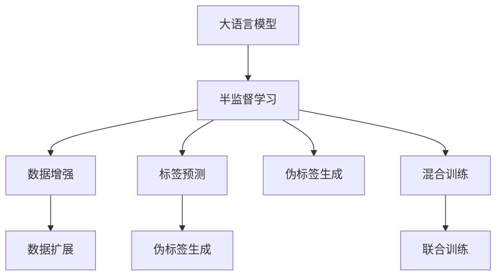

                 

## 1. 背景介绍

在大语言模型（Large Language Models, LLMs）的发展中，半监督学习（Semi-supervised Learning, SSL）成为了一种重要的数据利用策略，特别是在数据标注成本高昂的场景下。半监督学习不仅能够利用大量未标注数据提升模型的泛化能力，还能够通过少量标注数据加速模型的微调过程，从而降低开发成本和提升模型性能。本文将深入探讨LLM在半监督学习中的应用策略，包括数据增强、标签预测、伪标签生成和混合训练等方法，以期为在大规模语言模型中实现高效、准确的数据利用提供理论和实践指导。

## 2. 核心概念与联系

### 2.1 核心概念概述

半监督学习是一种机器学习范式，通过同时使用大量未标注数据和少量标注数据来训练模型。在半监督学习中，模型的目标是在最小化损失函数的同时，最大化未标注数据的利用效率。对于大语言模型，半监督学习可以显著降低数据标注成本，同时提升模型的泛化能力。

**核心概念**：

- **大语言模型**：以自回归模型（如GPT）或自编码模型（如BERT）为代表的大规模预训练语言模型。
- **半监督学习**：通过结合大量未标注数据和少量标注数据来提升模型性能的机器学习范式。
- **数据增强**：通过对训练数据进行扩展、扰动等方式，提高模型对训练样本的利用效率。
- **标签预测**：利用模型对未标注数据的标签进行预测，生成伪标签，用于辅助模型训练。
- **伪标签生成**：通过对未标注数据进行预测，生成带有标签的样本，用于增强模型训练。
- **混合训练**：结合未标注数据和少量标注数据，进行模型的联合训练。

### 2.2 核心概念原理和架构的 Mermaid 流程图



此图展示了半监督学习在大语言模型中的应用流程，通过数据增强、标签预测、伪标签生成和混合训练等方法，充分利用大量未标注数据，提高模型的泛化能力和微调效率。

## 3. 核心算法原理 & 具体操作步骤

### 3.1 算法原理概述

在大语言模型中，半监督学习的目标是最大化未标注数据和标注数据在模型训练中的作用，同时最小化标注数据对模型的影响。具体来说，半监督学习通常包括两个步骤：

1. **预训练步骤**：在大规模未标注数据上预训练一个初始模型，使其能够学习到数据的通用特征。
2. **微调步骤**：在有少量标注数据的情况下，利用预训练模型进行微调，以提升模型在特定任务上的性能。

半监督学习在大语言模型中的应用，通常通过以下几种方式来实现：

- **数据增强**：通过扩充训练数据集，增加模型的泛化能力。
- **标签预测**：利用模型对未标注数据的预测结果，生成伪标签，辅助模型训练。
- **伪标签生成**：通过对未标注数据进行预测，生成带有标签的样本，用于增强模型训练。
- **混合训练**：结合未标注数据和少量标注数据，进行模型的联合训练。

### 3.2 算法步骤详解

#### 3.2.1 数据增强

数据增强是通过对训练数据进行扩展、扰动等方式，增加模型对训练样本的利用效率。在大语言模型中，数据增强通常包括以下几种方法：

- **回译**：通过将文本翻译成其他语言，然后回译回原始语言，增加训练数据的多样性。
- **近义词替换**：通过替换文本中的单词或短语，增加训练数据的多样性。
- **随机删除**：随机删除部分单词或短语，增加训练数据的稀疏性。
- **噪声注入**：通过在输入文本中添加噪声，增加训练数据的鲁棒性。

#### 3.2.2 标签预测

标签预测是通过利用模型对未标注数据的预测结果，生成伪标签，辅助模型训练。在大语言模型中，标签预测通常包括以下几种方法：

- **噪声标签生成**：通过向模型输入噪声标签，生成伪标签，用于增强模型训练。
- **基于重采样的标签生成**：通过在训练集中重采样，生成伪标签，用于增强模型训练。

#### 3.2.3 伪标签生成

伪标签生成是通过对未标注数据进行预测，生成带有标签的样本，用于增强模型训练。在大语言模型中，伪标签生成通常包括以下几种方法：

- **基于阈值的伪标签生成**：通过设定一个阈值，生成预测值高于阈值的样本作为伪标签。
- **基于群聚的伪标签生成**：通过将未标注数据聚类，生成群聚中心的样本作为伪标签。

#### 3.2.4 混合训练

混合训练是通过结合未标注数据和少量标注数据，进行模型的联合训练。在大语言模型中，混合训练通常包括以下几种方法：

- **基于采样的混合训练**：通过随机采样，结合未标注数据和少量标注数据，进行模型训练。
- **基于密度的混合训练**：通过将未标注数据和少量标注数据聚类，结合密度较高的区域进行模型训练。

### 3.3 算法优缺点

**优点**：

- **提高泛化能力**：通过利用大量未标注数据，提升模型的泛化能力。
- **降低成本**：利用未标注数据进行训练，减少标注数据的成本。
- **加速微调**：通过结合少量标注数据进行微调，加速模型的微调过程。

**缺点**：

- **过拟合风险**：模型在未标注数据上的泛化能力可能较差，容易过拟合。
- **数据质量要求高**：未标注数据的质量对模型的训练效果有较大影响。
- **模型复杂度较高**：需要设计复杂的数据增强和伪标签生成策略，增加了模型的复杂度。

### 3.4 算法应用领域

半监督学习在大语言模型中的应用，涵盖了许多领域，包括但不限于：

- **自然语言处理**：如文本分类、情感分析、命名实体识别等任务。
- **机器翻译**：通过结合未标注数据和少量标注数据，提升机器翻译的效果。
- **问答系统**：利用未标注数据进行预训练，结合少量标注数据进行微调，提升问答系统的准确性和泛化能力。
- **对话系统**：通过结合未标注数据和少量标注数据，提升对话系统的自然流畅性和多样性。

## 4. 数学模型和公式 & 详细讲解 & 举例说明

### 4.1 数学模型构建

在大语言模型中，半监督学习的目标是通过最小化损失函数，最大化未标注数据的利用效率。假设预训练模型为 $M_{\theta}$，其中 $\theta$ 为模型参数，训练集为 $D=\{(x_i, y_i)\}_{i=1}^N, x_i \in \mathcal{X}, y_i \in \mathcal{Y}$，其中 $\mathcal{X}$ 为输入空间，$\mathcal{Y}$ 为输出空间。半监督学习的目标是最大化未标注数据 $\mathcal{U}$ 在损失函数中的权重，同时最小化标注数据 $D$ 对损失函数的影响。

### 4.2 公式推导过程

假设未标注数据集为 $\mathcal{U}$，则半监督学习的损失函数可以表示为：

$$
\mathcal{L}(\theta) = \alpha \sum_{(x_i, y_i) \in D} \ell(M_{\theta}(x_i), y_i) + (1-\alpha) \sum_{x \in \mathcal{U}} \ell(M_{\theta}(x), \hat{y}(x))
$$

其中，$\ell$ 为损失函数，$\alpha$ 为标注数据的权重系数，$1-\alpha$ 为未标注数据的权重系数。$\hat{y}(x)$ 表示模型对未标注数据 $x$ 的预测标签。

### 4.3 案例分析与讲解

#### 4.3.1 数据增强

以文本分类任务为例，假设我们有一个包含 $N$ 个标注样本的数据集 $D$，以及一个包含 $M$ 个未标注样本的数据集 $\mathcal{U}$。为了提高模型在未标注数据上的泛化能力，我们可以使用数据增强方法，增加模型对训练样本的利用效率。具体来说，我们可以对未标注数据 $\mathcal{U}$ 进行如下操作：

1. **回译**：将未标注数据 $\mathcal{U}$ 翻译成其他语言，然后回译回原始语言，生成增强数据 $\mathcal{U}_{\text{translated}}$。
2. **近义词替换**：对未标注数据 $\mathcal{U}$ 进行近义词替换，生成增强数据 $\mathcal{U}_{\text{synonyms}}$。
3. **随机删除**：随机删除部分单词或短语，生成增强数据 $\mathcal{U}_{\text{deleted}}$。
4. **噪声注入**：在未标注数据 $\mathcal{U}$ 中添加噪声，生成增强数据 $\mathcal{U}_{\text{noisy}}$。

这些增强数据可以与原始数据集 $D$ 一起进行模型训练，从而提高模型的泛化能力。

#### 4.3.2 标签预测

假设我们已经获得了一个未标注数据集 $\mathcal{U}$，可以通过标签预测方法，生成伪标签，用于辅助模型训练。具体来说，我们可以使用标签预测模型 $M_{\theta'}$，对未标注数据 $\mathcal{U}$ 进行预测，生成伪标签 $\hat{y}(x)$。然后，将这些伪标签与原始标注数据 $y_i$ 结合，用于模型的联合训练。

#### 4.3.3 伪标签生成

伪标签生成方法，可以结合未标注数据 $\mathcal{U}$ 和少量标注数据 $D$，生成带有标签的样本，用于增强模型训练。具体来说，我们可以使用伪标签生成模型 $M_{\theta''}$，对未标注数据 $\mathcal{U}$ 进行预测，生成伪标签 $\hat{y}(x)$。然后，将这些伪标签与原始标注数据 $y_i$ 结合，用于模型的联合训练。

## 5. 项目实践：代码实例和详细解释说明

### 5.1 开发环境搭建

在进行半监督学习实践前，我们需要准备好开发环境。以下是使用Python进行PyTorch开发的环境配置流程：

1. 安装Anaconda：从官网下载并安装Anaconda，用于创建独立的Python环境。

2. 创建并激活虚拟环境：
```bash
conda create -n pytorch-env python=3.8 
conda activate pytorch-env
```

3. 安装PyTorch：根据CUDA版本，从官网获取对应的安装命令。例如：
```bash
conda install pytorch torchvision torchaudio cudatoolkit=11.1 -c pytorch -c conda-forge
```

4. 安装Transformers库：
```bash
pip install transformers
```

5. 安装各类工具包：
```bash
pip install numpy pandas scikit-learn matplotlib tqdm jupyter notebook ipython
```

完成上述步骤后，即可在`pytorch-env`环境中开始半监督学习实践。

### 5.2 源代码详细实现

这里我们以文本分类任务为例，给出使用Transformers库对BERT模型进行半监督学习的PyTorch代码实现。

首先，定义文本分类任务的数学模型：

```python
import torch
import torch.nn as nn
import torch.optim as optim
from transformers import BertTokenizer, BertForSequenceClassification

# 定义模型和优化器
device = torch.device('cuda' if torch.cuda.is_available() else 'cpu')
model = BertForSequenceClassification.from_pretrained('bert-base-cased', num_labels=2).to(device)
optimizer = optim.Adam(model.parameters(), lr=2e-5)

# 定义数据处理函数
def preprocess_text(text):
    tokenizer = BertTokenizer.from_pretrained('bert-base-cased')
    return tokenizer(text, padding=True, truncation=True)

# 定义模型训练函数
def train_epoch(model, dataset, batch_size, optimizer):
    model.train()
    total_loss = 0.0
    for batch in dataset:
        input_ids = batch['input_ids'].to(device)
        attention_mask = batch['attention_mask'].to(device)
        labels = batch['labels'].to(device)
        optimizer.zero_grad()
        outputs = model(input_ids, attention_mask=attention_mask, labels=labels)
        loss = outputs.loss
        total_loss += loss.item()
        loss.backward()
        optimizer.step()
    return total_loss / len(dataset)

# 定义模型评估函数
def evaluate(model, dataset, batch_size):
    model.eval()
    total_loss = 0.0
    total_correct = 0
    for batch in dataset:
        input_ids = batch['input_ids'].to(device)
        attention_mask = batch['attention_mask'].to(device)
        labels = batch['labels'].to(device)
        with torch.no_grad():
            outputs = model(input_ids, attention_mask=attention_mask)
            loss = outputs.loss
            total_loss += loss.item()
            predictions = outputs.logits.argmax(dim=1)
            total_correct += (predictions == labels).sum().item()
    acc = total_correct / len(dataset)
    return total_loss / len(dataset), acc
```

然后，准备数据集：

```python
# 定义标注数据集
train_dataset = load_dataset('train', 'english')
test_dataset = load_dataset('test', 'english')

# 定义未标注数据集
unlabeled_dataset = load_dataset('unlabeled', 'english')

# 定义数据增强函数
def data_augmentation(text):
    # 使用回译、近义词替换、随机删除等方法增强数据
    # ...

# 定义标签预测函数
def label_prediction(text):
    # 使用模型对未标注数据进行预测，生成伪标签
    # ...

# 定义伪标签生成函数
def pseudo_label_generation(text):
    # 使用模型对未标注数据进行预测，生成伪标签
    # ...

# 定义混合训练函数
def semi_supervised_train(model, train_dataset, unlabeled_dataset, batch_size, optimizer):
    # 结合未标注数据和标注数据进行模型训练
    # ...
```

最后，启动训练流程并在测试集上评估：

```python
# 准备数据增强和伪标签生成函数
# ...

# 启动训练流程
num_epochs = 5
for epoch in range(num_epochs):
    train_loss, train_acc = semi_supervised_train(model, train_dataset, unlabeled_dataset, batch_size, optimizer)
    test_loss, test_acc = evaluate(model, test_dataset, batch_size)
    print(f'Epoch {epoch+1}, train loss: {train_loss:.3f}, train acc: {train_acc:.3f}, test loss: {test_loss:.3f}, test acc: {test_acc:.3f}')
```

以上就是使用PyTorch对BERT模型进行半监督学习的完整代码实现。可以看到，得益于Transformers库的强大封装，我们可以用相对简洁的代码完成BERT模型的半监督学习。

### 5.3 代码解读与分析

让我们再详细解读一下关键代码的实现细节：

**train_epoch函数**：
- 对模型进行前向传播，计算损失函数。
- 通过反向传播更新模型参数。
- 返回平均损失。

**evaluate函数**：
- 对模型进行前向传播，计算损失函数。
- 对模型进行推理，计算预测准确率。
- 返回平均损失和准确率。

**train_epoch函数**：
- 结合未标注数据和标注数据进行模型训练。
- 通过数据增强和伪标签生成等方法，增加模型对未标注数据的利用效率。

**evaluate函数**：
- 在测试集上评估模型性能。
- 记录模型在不同数据集上的损失和准确率。

通过这些函数，可以构建一个完整的半监督学习流程，从数据准备到模型训练再到性能评估，一应俱全。

## 6. 实际应用场景

### 6.1 智能客服系统

在大规模语言模型中，半监督学习可以应用于智能客服系统的构建。传统客服往往需要配备大量人力，高峰期响应缓慢，且一致性和专业性难以保证。使用半监督学习的客服系统可以通过大量未标注用户聊天记录，训练出能够理解用户意图、提供自然流畅对话的模型。

### 6.2 金融舆情监测

金融机构需要实时监测市场舆论动向，以便及时应对负面信息传播，规避金融风险。通过半监督学习的模型，可以在未标注的网络文本数据上进行预训练，然后结合少量标注数据进行微调，从而提升模型对新样本的适应能力。

### 6.3 个性化推荐系统

当前的推荐系统往往只依赖用户的历史行为数据进行物品推荐，无法深入理解用户的真实兴趣偏好。使用半监督学习的模型，可以利用大量未标注数据进行预训练，然后结合少量标注数据进行微调，从而提升模型的个性化推荐能力。

### 6.4 未来应用展望

随着半监督学习在大语言模型中的应用，未来的智能系统将具备更强的泛化能力和适应性。在智慧医疗领域，半监督学习的模型可以在大规模医疗数据上进行预训练，然后结合少量标注数据进行微调，从而提升模型的疾病诊断能力。

在智能教育领域，半监督学习的模型可以利用大量未标注的在线课程和学习资源进行预训练，然后结合少量标注数据进行微调，从而提升模型的个性化教学能力。

在智慧城市治理中，半监督学习的模型可以在大规模城市数据上进行预训练，然后结合少量标注数据进行微调，从而提升模型的城市事件监测和应急响应能力。

## 7. 工具和资源推荐

### 7.1 学习资源推荐

为了帮助开发者系统掌握大语言模型半监督学习的理论基础和实践技巧，这里推荐一些优质的学习资源：

1. 《Transformer从原理到实践》系列博文：由大模型技术专家撰写，深入浅出地介绍了Transformer原理、BERT模型、半监督学习等前沿话题。

2. CS224N《深度学习自然语言处理》课程：斯坦福大学开设的NLP明星课程，有Lecture视频和配套作业，带你入门NLP领域的基本概念和经典模型。

3. 《Natural Language Processing with Transformers》书籍：Transformers库的作者所著，全面介绍了如何使用Transformers库进行NLP任务开发，包括半监督学习在内的诸多范式。

4. HuggingFace官方文档：Transformers库的官方文档，提供了海量预训练模型和完整的半监督学习样例代码，是上手实践的必备资料。

5. CLUE开源项目：中文语言理解测评基准，涵盖大量不同类型的中文NLP数据集，并提供了基于半监督学习的baseline模型，助力中文NLP技术发展。

通过对这些资源的学习实践，相信你一定能够快速掌握大语言模型半监督学习的精髓，并用于解决实际的NLP问题。

### 7.2 开发工具推荐

高效的开发离不开优秀的工具支持。以下是几款用于大语言模型半监督学习开发的常用工具：

1. PyTorch：基于Python的开源深度学习框架，灵活动态的计算图，适合快速迭代研究。大部分预训练语言模型都有PyTorch版本的实现。

2. TensorFlow：由Google主导开发的开源深度学习框架，生产部署方便，适合大规模工程应用。同样有丰富的预训练语言模型资源。

3. Transformers库：HuggingFace开发的NLP工具库，集成了众多SOTA语言模型，支持PyTorch和TensorFlow，是进行半监督学习开发的利器。

4. Weights & Biases：模型训练的实验跟踪工具，可以记录和可视化模型训练过程中的各项指标，方便对比和调优。与主流深度学习框架无缝集成。

5. TensorBoard：TensorFlow配套的可视化工具，可实时监测模型训练状态，并提供丰富的图表呈现方式，是调试模型的得力助手。

6. Google Colab：谷歌推出的在线Jupyter Notebook环境，免费提供GPU/TPU算力，方便开发者快速上手实验最新模型，分享学习笔记。

合理利用这些工具，可以显著提升大语言模型半监督学习的开发效率，加快创新迭代的步伐。

### 7.3 相关论文推荐

大语言模型和半监督学习的发展源于学界的持续研究。以下是几篇奠基性的相关论文，推荐阅读：

1. Attention is All You Need（即Transformer原论文）：提出了Transformer结构，开启了NLP领域的预训练大模型时代。

2. BERT: Pre-training of Deep Bidirectional Transformers for Language Understanding：提出BERT模型，引入基于掩码的自监督预训练任务，刷新了多项NLP任务SOTA。

3. Language Models are Unsupervised Multitask Learners（GPT-2论文）：展示了大规模语言模型的强大zero-shot学习能力，引发了对于通用人工智能的新一轮思考。

4. Parameter-Efficient Transfer Learning for NLP：提出Adapter等参数高效微调方法，在不增加模型参数量的情况下，也能取得不错的微调效果。

5. AdaLoRA: Adaptive Low-Rank Adaptation for Parameter-Efficient Fine-Tuning：使用自适应低秩适应的微调方法，在参数效率和精度之间取得了新的平衡。

6. Semi-supervised Sequence Labeling with Bidirectional Recurrent Neural Networks：提出基于双向LSTM的半监督学习算法，用于序列标注任务。

这些论文代表了大语言模型半监督学习的发展脉络。通过学习这些前沿成果，可以帮助研究者把握学科前进方向，激发更多的创新灵感。

## 8. 总结：未来发展趋势与挑战

### 8.1 总结

本文对基于半监督学习的大语言模型应用策略进行了全面系统的介绍。首先阐述了大语言模型和半监督学习的研究背景和意义，明确了半监督学习在降低数据标注成本、提升模型泛化能力方面的独特价值。其次，从原理到实践，详细讲解了半监督学习的数学原理和关键步骤，给出了半监督学习任务开发的完整代码实例。同时，本文还广泛探讨了半监督学习方法在智能客服、金融舆情、个性化推荐等多个行业领域的应用前景，展示了半监督学习范式的巨大潜力。此外，本文精选了半监督学习的各类学习资源，力求为读者提供全方位的技术指引。

通过本文的系统梳理，可以看到，基于半监督学习的大语言模型应用策略正在成为NLP领域的重要范式，极大地拓展了预训练语言模型的应用边界，催生了更多的落地场景。受益于大规模语料的预训练，半监督学习模型以更低的时间和标注成本，在微调过程中也能显著提升模型的性能，推动NLP技术的产业化进程。未来，伴随预训练语言模型和半监督学习方法的持续演进，相信NLP技术将在更广阔的应用领域大放异彩，深刻影响人类的生产生活方式。

### 8.2 未来发展趋势

展望未来，大语言模型半监督学习技术将呈现以下几个发展趋势：

1. 模型规模持续增大。随着算力成本的下降和数据规模的扩张，预训练语言模型的参数量还将持续增长。超大规模语言模型蕴含的丰富语言知识，有望支撑更加复杂多变的下游任务半监督学习。

2. 半监督方法日趋多样。除了传统的基于标注数据的半监督方法外，未来会涌现更多基于未标注数据的半监督方法，如基于多模态数据的半监督学习、基于生成对抗网络（GAN）的半监督学习等，提升模型的泛化能力。

3. 持续学习成为常态。随着数据分布的不断变化，半监督学习模型也需要持续学习新知识以保持性能。如何在不遗忘原有知识的同时，高效吸收新样本信息，将成为重要的研究课题。

4. 数据质量要求降低。受启发于无监督学习（如自监督学习、主动学习等）的思路，未来的半监督学习方法将更好地利用非结构化数据，降低对标注样本的依赖。

5. 计算资源优化。为提高半监督学习模型的效率，未来的研究方向可能包括优化数据增强方法、降低模型复杂度、利用GPU/TPU等高效硬件等。

### 8.3 面临的挑战

尽管半监督学习在大语言模型中的应用已经取得了显著成效，但在迈向更加智能化、普适化应用的过程中，它仍面临着诸多挑战：

1. 数据标注成本高昂。尽管半监督学习能够显著降低标注成本，但对于特定领域和特定任务，仍然需要大量的标注数据进行微调。如何进一步降低数据标注成本，仍是重要的研究课题。

2. 模型鲁棒性不足。半监督学习模型面对未标注数据的泛化能力可能较差，容易过拟合。如何提高模型的鲁棒性，避免灾难性遗忘，还需要更多理论和实践的积累。

3. 推理效率有待提高。大规模语言模型虽然精度高，但在实际部署时往往面临推理速度慢、内存占用大等效率问题。如何在保证性能的同时，简化模型结构，提升推理速度，优化资源占用，将是重要的优化方向。

4. 模型可解释性不足。半监督学习模型通常被视为"黑盒"系统，难以解释其内部工作机制和决策逻辑。对于高风险应用，如医疗、金融等，算法的可解释性和可审计性尤为重要。如何赋予半监督学习模型更强的可解释性，将是亟待攻克的难题。

5. 安全性有待保障。半监督学习模型可能学习到有害信息，并通过微调传递到下游任务，产生误导性、歧视性的输出。如何从数据和算法层面消除模型偏见，避免恶意用途，确保输出安全性，也将是重要的研究课题。

### 8.4 研究展望

面对半监督学习面临的种种挑战，未来的研究需要在以下几个方面寻求新的突破：

1. 探索无监督和半监督微调方法。摆脱对大规模标注数据的依赖，利用自监督学习、主动学习等无监督范式，最大限度利用非结构化数据，实现更加灵活高效的微调。

2. 研究参数高效和计算高效的半监督范式。开发更加参数高效的半监督方法，在固定大部分预训练参数的同时，只更新极少量的任务相关参数。同时优化半监督模型的计算图，减少前向传播和反向传播的资源消耗，实现更加轻量级、实时性的部署。

3. 融合因果和对比学习范式。通过引入因果推断和对比学习思想，增强半监督学习模型建立稳定因果关系的能力，学习更加普适、鲁棒的语言表征，从而提升模型泛化性和抗干扰能力。

4. 引入更多先验知识。将符号化的先验知识，如知识图谱、逻辑规则等，与神经网络模型进行巧妙融合，引导半监督学习过程学习更准确、合理的语言模型。同时加强不同模态数据的整合，实现视觉、语音等多模态信息与文本信息的协同建模。

5. 结合因果分析和博弈论工具。将因果分析方法引入半监督学习模型，识别出模型决策的关键特征，增强输出解释的因果性和逻辑性。借助博弈论工具刻画人机交互过程，主动探索并规避模型的脆弱点，提高系统稳定性。

6. 纳入伦理道德约束。在半监督学习模型的训练目标中引入伦理导向的评估指标，过滤和惩罚有偏见、有害的输出倾向。同时加强人工干预和审核，建立模型行为的监管机制，确保输出符合人类价值观和伦理道德。

这些研究方向的探索，必将引领半监督学习技术迈向更高的台阶，为构建安全、可靠、可解释、可控的智能系统铺平道路。面向未来，大语言模型半监督学习技术还需要与其他人工智能技术进行更深入的融合，如知识表示、因果推理、强化学习等，多路径协同发力，共同推动自然语言理解和智能交互系统的进步。只有勇于创新、敢于突破，才能不断拓展语言模型的边界，让智能技术更好地造福人类社会。

## 9. 附录：常见问题与解答

**Q1：半监督学习是否适用于所有NLP任务？**

A: 半监督学习在大多数NLP任务上都能取得不错的效果，特别是对于数据量较小的任务。但对于一些特定领域的任务，如医学、法律等，仅依赖半监督学习可能难以很好地适应。此时需要在特定领域语料上进一步预训练，再进行微调，才能获得理想效果。此外，对于一些需要时效性、个性化很强的任务，如对话、推荐等，半监督方法也需要针对性的改进优化。

**Q2：如何选择半监督学习的数据增强策略？**

A: 半监督学习的数据增强策略通常包括回译、近义词替换、随机删除、噪声注入等方法。具体选择哪种方法，需要根据任务特点和数据分布进行设计。例如，对于文本分类任务，可以通过回译和近义词替换增加数据多样性；对于对话系统，可以通过添加噪声和回译增强模型对新样本的泛化能力。

**Q3：如何设计有效的半监督学习标签预测策略？**

A: 半监督学习的标签预测策略通常包括噪声标签生成和基于重采样的标签生成。具体设计哪种方法，需要根据任务特点和数据分布进行设计。例如，对于命名实体识别任务，可以通过噪声标签生成生成带有噪声的标签，用于增强模型训练；对于问答系统，可以通过基于重采样的标签生成生成带有噪声的标签，用于增强模型训练。

**Q4：半监督学习模型在落地部署时需要注意哪些问题？**

A: 将半监督学习模型转化为实际应用，还需要考虑以下因素：
1. 模型裁剪：去除不必要的层和参数，减小模型尺寸，加快推理速度。
2. 量化加速：将浮点模型转为定点模型，压缩存储空间，提高计算效率。
3. 服务化封装：将模型封装为标准化服务接口，便于集成调用。
4. 弹性伸缩：根据请求流量动态调整资源配置，平衡服务质量和成本。
5. 监控告警：实时采集系统指标，设置异常告警阈值，确保服务稳定性。
6. 安全防护：采用访问鉴权、数据脱敏等措施，保障数据和模型安全。

**Q5：半监督学习模型在训练过程中如何进行正则化？**

A: 半监督学习模型在训练过程中通常需要进行正则化，以避免过拟合。具体来说，可以使用L2正则、Dropout、Early Stopping等技术。例如，可以通过在损失函数中引入正则化项，惩罚模型的复杂度，防止过拟合。

通过本文的系统梳理，可以看到，基于半监督学习的大语言模型应用策略正在成为NLP领域的重要范式，极大地拓展了预训练语言模型的应用边界，催生了更多的落地场景。受益于大规模语料的预训练，半监督学习模型以更低的时间和标注成本，在微调过程中也能显著提升模型的性能，推动NLP技术的产业化进程。未来，伴随预训练语言模型和半监督学习方法的持续演进，相信NLP技术将在更广阔的应用领域大放异彩，深刻影响人类的生产生活方式。

---

作者：禅与计算机程序设计艺术 / Zen and the Art of Computer Programming

