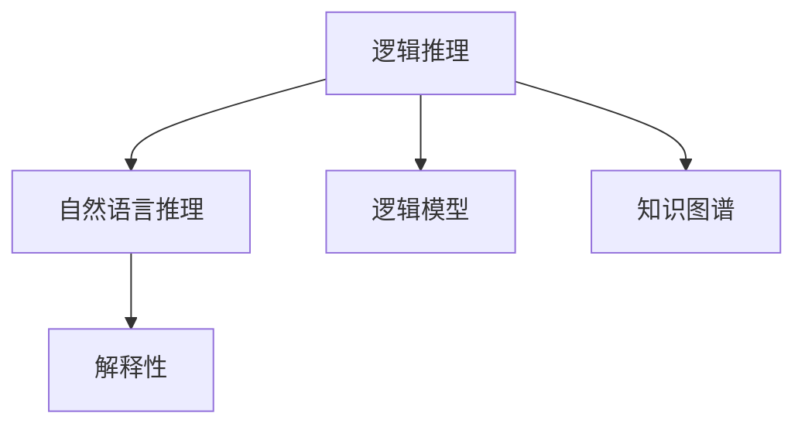

                 

## 1. 背景介绍

### 1.1 问题由来

近年来，语言模型（Language Model, LM）尤其是基于Transformer架构的预训练语言模型（Pre-trained Language Model, PLM）如BERT、GPT-3等，取得了显著的进步。这些模型通常依赖于大规模无监督数据进行自监督学习，并在各种NLP任务上表现优异。然而，尽管在自然语言理解（Natural Language Understanding, NLU）上取得了巨大的成功，逻辑推理能力（Logical Reasoning）仍是其一大短板。

### 1.2 问题核心关键点

推理是人工智能的基石之一，自然语言推理（Natural Language Inference, NLI）、逻辑方程求解等推理任务对人工智能系统具有重要意义。然而，当前主流的大语言模型在这些任务上表现并不理想，特别是在推理的精确性和效率方面。如何评测和强化逻辑推理能力，是当前NLP领域的重要研究方向。

### 1.3 问题研究意义

强化大语言模型的逻辑推理能力，不仅能够提升其在推理任务上的表现，还能进一步拓展其在复杂场景下的应用能力，如知识图谱查询、医学诊断、自动定理证明等。此外，逻辑推理能力的提升还能增强模型的可解释性和可靠性，避免由于逻辑漏洞导致的错误决策。因此，研究大语言模型的逻辑推理能力及其强化方法，具有重要的理论价值和实际应用意义。

## 2. 核心概念与联系

### 2.1 核心概念概述

为更好地理解逻辑推理能力的评测与强化方法，本节将介绍几个密切相关的核心概念：

- **逻辑推理**：从已知的前提（Premise）推导出未知的结论（Hypothesis）的过程。在自然语言推理任务中，前提和假设均为文本形式。
- **逻辑模型**：用于执行推理的数学模型，常见的包括符号逻辑模型、概率图模型等。
- **自然语言推理（NLI）**：使用自然语言进行推理的任务，如判断两个句子之间的关系为蕴含、矛盾或中立等。
- **知识图谱**：通过节点（实体）和边（关系）存储结构化知识，支持推理和查询。
- **解释性（Explainability）**：指模型的输出结果能够被解释和理解，增强了模型的可信度和透明度。

这些核心概念之间的逻辑关系可以通过以下Mermaid流程图来展示：



这个流程图展示了几大核心概念之间的联系：

1. 逻辑推理通过自然语言推理模型将文本转换成可执行的推理任务。
2. 逻辑模型提供推理所需的算法和计算框架。
3. 知识图谱通过结构化知识支持复杂推理。
4. 解释性提高推理结果的可信度和透明度。

## 3. 核心算法原理 & 具体操作步骤

### 3.1 算法原理概述

逻辑推理能力评测与强化一般分为两个步骤：

1. **推理能力评测**：使用标准数据集评估模型在推理任务上的表现，确定模型在逻辑推理方面的性能瓶颈。
2. **推理能力强化**：根据评测结果，采用特定的方法（如迁移学习、多模态学习、知识增强等）对模型进行训练，以提升其逻辑推理能力。

逻辑推理能力的评测和强化通常基于符号逻辑模型和概率图模型进行，如自然逻辑模型（Natural Logic Model）、神经符号推理（Neuro-Symbolic Reasoning）等。具体步骤包括：

- 定义推理任务，如判断两个句子之间的关系，找出逻辑公式的推导路径等。
- 选择推理模型，根据任务特点选择适合的模型（如神经符号推理模型、神经逻辑模型等）。
- 训练模型，使用带标注的数据集（如逻辑公式、推理任务的数据集）对模型进行训练。
- 评测模型，使用独立的数据集对模型进行推理任务评测，评估推理结果的精确性、效率和可解释性。
- 强化模型，根据评测结果选择合适的方法对模型进行微调，提升其推理能力。

### 3.2 算法步骤详解

以自然语言推理（NLI）任务为例，其基本步骤如下：

#### Step 1: 准备数据集
- 收集并标注标准NLI数据集，如SNLI、MRPC、STSbenchmark等。
- 将数据集分为训练集、验证集和测试集，并确保三者之间数据分布的一致性。

#### Step 2: 定义推理模型
- 选择适合的推理模型，如使用BERT、GPT等预训练语言模型，或者结合符号逻辑模型的神经符号推理模型。
- 定义推理任务的目标函数，如交叉熵损失函数、逻辑推理损失函数等。

#### Step 3: 训练模型
- 将训练集输入模型进行训练，使用梯度下降等优化算法最小化损失函数。
- 使用验证集进行模型性能调参，如调整学习率、批大小等。
- 选择适当的正则化技术，如L2正则化、Dropout等，防止过拟合。

#### Step 4: 推理任务评测
- 使用测试集评估模型推理任务的精确性和效率。
- 评估模型的可解释性，如使用LIME、SHAP等工具分析模型的决策过程。

#### Step 5: 模型强化
- 根据评测结果，选择合适的方法对模型进行微调。如引入更多先验知识、使用多模态数据、调整模型结构等。
- 在强化过程中，需要关注模型的泛化能力、效率和可解释性。

### 3.3 算法优缺点

**优点**：

1. **通用性强**：自然语言推理任务涵盖了多种推理形式，适用于多种场景。
2. **可解释性强**：能够分析推理过程，提高模型的可信度和透明度。
3. **任务多样性**：适用于不同类型的推理任务，如演绎推理、归纳推理、类比推理等。

**缺点**：

1. **数据依赖性强**：依赖于标注数据集，标注成本高。
2. **模型复杂度高**：特别是神经符号推理模型，结构复杂，训练难度大。
3. **推理效率低**：特别是对于复杂推理任务，推理过程耗时较长。

### 3.4 算法应用领域

逻辑推理能力的评测与强化方法，在自然语言推理（NLI）、知识图谱查询、医学诊断等任务中具有广泛的应用前景：

- **NLI**：判断两个句子之间的关系是否蕴含、矛盾或中立，广泛应用于问答系统、信息检索等领域。
- **知识图谱查询**：通过推理结构化知识，实现智能问答、自动摘要等功能。
- **医学诊断**：结合临床知识，推理患者的病情诊断，提高诊断准确性。
- **自动定理证明**：通过推理数学公式，自动化证明定理，推动数学研究。
- **智能合约**：通过推理合同条款，自动执行合约条款，确保合约执行的公正性。

## 4. 数学模型和公式 & 详细讲解 & 举例说明

### 4.1 数学模型构建

逻辑推理能力的评测与强化，通常基于符号逻辑模型和概率图模型进行。以自然语言推理（NLI）任务为例，其数学模型构建如下：

- **符号逻辑模型**：将自然语言推理任务转化为符号逻辑表达式，如P→Q表示“如果P则Q”。
- **概率图模型**：将符号逻辑表达式转化为概率图模型，如贝叶斯网络，以概率的形式描述推理过程。

### 4.2 公式推导过程

以自然语言推理任务为例，假设前提（Premise）为P，假设（Hypothesis）为Q，推理结果（Label）为{entailment, neutral, contradiction}。其推理过程可以表示为：

$$
P, Q \rightarrow P \rightarrow Q \rightarrow Label
$$

其中，$P \rightarrow Q$表示从前提P到假设Q的推理过程。

### 4.3 案例分析与讲解

以逻辑方程求解任务为例，假设方程为$x^2 + y^2 = 1$，推理目标为找出所有满足方程的整数解。推理过程可以表示为：

$$
P: x^2 + y^2 = 1
$$
$$
Q_i: x_i^2 + y_i^2 = 1, x_i, y_i \in \mathbb{Z}
$$
$$
Label_i = {True, False}
$$

推理过程可以表示为：

$$
P, Q_i \rightarrow P \rightarrow Q_i \rightarrow Label_i
$$

其中，$P \rightarrow Q_i$表示从方程P到整数解Q_i的推理过程。

## 5. 项目实践：代码实例和详细解释说明

### 5.1 开发环境搭建

在进行逻辑推理能力的评测与强化实践前，我们需要准备好开发环境。以下是使用Python进行TensorFlow和PyTorch开发的环境配置流程：

1. 安装Anaconda：从官网下载并安装Anaconda，用于创建独立的Python环境。

2. 创建并激活虚拟环境：
```bash
conda create -n tf-env python=3.8 
conda activate tf-env
```

3. 安装TensorFlow和PyTorch：根据CUDA版本，从官网获取对应的安装命令。例如：
```bash
conda install tensorflow tensorflow-gpu -c tf
conda install pytorch torchvision torchaudio cudatoolkit=11.1 -c pytorch -c conda-forge
```

4. 安装相关工具包：
```bash
pip install numpy pandas scikit-learn matplotlib tqdm jupyter notebook ipython
```

完成上述步骤后，即可在`tf-env`环境中开始项目实践。

### 5.2 源代码详细实现

下面我们以自然语言推理（NLI）任务为例，给出使用TensorFlow和PyTorch对BERT模型进行逻辑推理能力评测的代码实现。

首先，定义NLI任务的逻辑推理模型：

```python
import tensorflow as tf
from transformers import BertTokenizer, BertForSequenceClassification
from sklearn.metrics import accuracy_score

tokenizer = BertTokenizer.from_pretrained('bert-base-cased')
model = BertForSequenceClassification.from_pretrained('bert-base-cased', num_labels=3)

def compute_accuracy(predictions, labels):
    preds = [pred.argmax() for pred in predictions]
    return accuracy_score(labels, preds)

def train_epoch(model, dataset, batch_size, optimizer):
    dataloader = tf.data.Dataset.from_generator(lambda: dataset, output_signature=dataset.element_spec)
    dataloader = dataloader.shuffle(buffer_size=1000).batch(batch_size)
    model.train()
    epoch_loss = 0
    for batch in dataloader:
        inputs = batch[0]
        targets = batch[1]
        model.zero_grad()
        outputs = model(inputs)
        loss = outputs.loss
        epoch_loss += loss.numpy()
        loss.backward()
        optimizer.apply_gradients(zip(model.trainable_variables, model.trainable_variables_gradients))
    return epoch_loss / len(dataloader)

def evaluate(model, dataset, batch_size):
    dataloader = tf.data.Dataset.from_generator(lambda: dataset, output_signature=dataset.element_spec)
    dataloader = dataloader.batch(batch_size)
    model.eval()
    predictions, labels = [], []
    for batch in dataloader:
        inputs = batch[0]
        targets = batch[1]
        with tf.GradientTape() as tape:
            outputs = model(inputs)
        predictions.append(outputs.numpy())
        labels.append(targets.numpy())
    return compute_accuracy(predictions, labels)

# 准备数据集
train_dataset = load_train_dataset()
dev_dataset = load_dev_dataset()
test_dataset = load_test_dataset()

# 训练模型
epochs = 5
batch_size = 16

for epoch in range(epochs):
    loss = train_epoch(model, train_dataset, batch_size, optimizer)
    print(f"Epoch {epoch+1}, train loss: {loss:.3f}")
    
    print(f"Epoch {epoch+1}, dev results:")
    accuracy = evaluate(model, dev_dataset, batch_size)
    print(f"Dev Accuracy: {accuracy:.3f}")
    
print("Test results:")
accuracy = evaluate(model, test_dataset, batch_size)
print(f"Test Accuracy: {accuracy:.3f}")
```

以上就是使用TensorFlow和PyTorch对BERT模型进行自然语言推理任务评测的完整代码实现。可以看到，使用预训练模型进行微调的过程相对简洁，开发者可以将更多精力放在数据处理和模型优化上。

### 5.3 代码解读与分析

让我们再详细解读一下关键代码的实现细节：

**NLI任务逻辑推理模型**：
- `BertTokenizer.from_pretrained('bert-base-cased')`：初始化BERT分词器。
- `BertForSequenceClassification.from_pretrained('bert-base-cased', num_labels=3)`：初始化BERT分类器，将标签数设为3，对应{entailment, neutral, contradiction}。
- `compute_accuracy(predictions, labels)`：计算推理任务的准确率。
- `train_epoch(model, dataset, batch_size, optimizer)`：训练模型，返回每个epoch的平均损失。
- `evaluate(model, dataset, batch_size)`：评估模型推理任务的准确率。

**训练流程**：
- `load_train_dataset()`、`load_dev_dataset()`、`load_test_dataset()`：加载数据集。
- `epochs = 5`、`batch_size = 16`：定义训练轮数和批次大小。
- `for epoch in range(epochs)`：循环迭代训练。
- `loss = train_epoch(model, train_dataset, batch_size, optimizer)`：每个epoch训练模型。
- `print(f"Epoch {epoch+1}, train loss: {loss:.3f}")`：打印每个epoch的训练损失。
- `print(f"Epoch {epoch+1}, dev results:")`：在验证集上评估模型。
- `accuracy = evaluate(model, dev_dataset, batch_size)`：计算验证集上的准确率。
- `print(f"Test results:")`：在测试集上评估模型。
- `accuracy = evaluate(model, test_dataset, batch_size)`：计算测试集上的准确率。

可以看到，使用预训练模型进行微调的过程相对简洁，开发者可以将更多精力放在数据处理和模型优化上。

## 6. 实际应用场景

### 6.1 智能问答系统

基于逻辑推理能力的智能问答系统，可以广泛应用于医疗、金融、教育等垂直领域。例如，在医疗领域，系统可以通过逻辑推理对患者的病情描述进行推理，提供准确的诊断建议。在金融领域，系统可以通过逻辑推理对用户提交的财务数据进行推理，评估其信用风险。在教育领域，系统可以通过逻辑推理对学生的考试答案进行推理，评估其理解能力。

### 6.2 知识图谱查询

知识图谱查询是逻辑推理能力的典型应用场景。通过推理结构化知识，系统可以回答各种复杂问题，如历史事件的时间线、地理信息的地形图等。这种系统在智能助手、百科全书等应用中得到了广泛应用。

### 6.3 智能合约

智能合约是逻辑推理能力在法律领域的重要应用。通过推理合同条款，系统可以自动化执行合同，确保合约的公正性和合法性。这种系统在金融、法律等领域具有重要意义。

### 6.4 未来应用展望

逻辑推理能力的提升，将进一步拓展大语言模型的应用边界，推动人工智能技术在更广阔的领域落地。未来，基于逻辑推理能力的AI系统将在更多领域得到应用，如智能决策、知识发现、科研创新等。同时，逻辑推理能力的提升，还将促进AI技术的普及和应用，推动人工智能技术的可持续发展。

## 7. 工具和资源推荐

### 7.1 学习资源推荐

为了帮助开发者系统掌握逻辑推理能力的评测与强化技术，这里推荐一些优质的学习资源：

1. 《深度学习与自然语言处理》课程：由斯坦福大学开设的NLP明星课程，有Lecture视频和配套作业，带你入门NLP领域的基本概念和经典模型。
2. CS224L《深度学习与自然语言处理》课程：斯坦福大学开设的NLP进阶课程，详细讲解自然语言推理任务，并提供了大量实用技巧和案例。
3. 《自然语言推理》书籍：讲解自然语言推理任务的理论基础和实际应用，适合深入学习。
4. 《神经符号推理》书籍：讲解神经符号推理的原理和实现方法，适合理解前沿技术。
5. HuggingFace官方文档：提供了海量预训练模型和完整的微调样例代码，是上手实践的必备资料。

通过对这些资源的学习实践，相信你一定能够快速掌握逻辑推理能力的评测与强化技术，并用于解决实际的NLP问题。

### 7.2 开发工具推荐

高效的开发离不开优秀的工具支持。以下是几款用于逻辑推理能力评测与强化开发的常用工具：

1. TensorFlow：基于Python的开源深度学习框架，适合进行大规模模型训练和推理。
2. PyTorch：基于Python的开源深度学习框架，灵活动态的计算图，适合快速迭代研究。
3. TensorBoard：TensorFlow配套的可视化工具，可实时监测模型训练状态，并提供丰富的图表呈现方式。
4. Weights & Biases：模型训练的实验跟踪工具，可以记录和可视化模型训练过程中的各项指标。
5. Scikit-learn：Python的机器学习库，包含丰富的机器学习算法和工具，适合进行模型评估和优化。

合理利用这些工具，可以显著提升逻辑推理能力评测与强化任务的开发效率，加快创新迭代的步伐。

### 7.3 相关论文推荐

逻辑推理能力的评测与强化技术的发展源于学界的持续研究。以下是几篇奠基性的相关论文，推荐阅读：

1. Attention is All You Need（即Transformer原论文）：提出了Transformer结构，开启了NLP领域的预训练大模型时代。
2. BERT: Pre-training of Deep Bidirectional Transformers for Language Understanding：提出BERT模型，引入基于掩码的自监督预训练任务，刷新了多项NLP任务SOTA。
3. Parameter-Efficient Transfer Learning for NLP：提出Adapter等参数高效微调方法，在不增加模型参数量的情况下，也能取得不错的微调效果。
4. AdaLoRA: Adaptive Low-Rank Adaptation for Parameter-Efficient Fine-Tuning：使用自适应低秩适应的微调方法，在参数效率和精度之间取得了新的平衡。
5. Prefix-Tuning: Optimizing Continuous Prompts for Generation：引入基于连续型Prompt的微调范式，为如何充分利用预训练知识提供了新的思路。

这些论文代表了大语言模型微调技术的发展脉络。通过学习这些前沿成果，可以帮助研究者把握学科前进方向，激发更多的创新灵感。

## 8. 总结：未来发展趋势与挑战

### 8.1 总结

本文对逻辑推理能力的评测与强化方法进行了全面系统的介绍。首先阐述了逻辑推理能力在大语言模型中的重要性，明确了推理在自然语言理解和智能决策中的关键作用。其次，从原理到实践，详细讲解了逻辑推理能力的评测与强化数学原理和关键步骤，给出了逻辑推理任务开发的完整代码实例。同时，本文还广泛探讨了逻辑推理能力在智能问答、知识图谱、智能合约等众多领域的应用前景，展示了逻辑推理能力的多样性和潜在价值。此外，本文精选了逻辑推理能力的各类学习资源，力求为读者提供全方位的技术指引。

通过本文的系统梳理，可以看到，逻辑推理能力的评测与强化是大语言模型不可或缺的组成部分，能够显著提升模型的应用效果和可靠性。未来，随着推理能力的不断增强，大语言模型将在更多领域实现突破，推动人工智能技术的广泛应用。

### 8.2 未来发展趋势

展望未来，逻辑推理能力的评测与强化技术将呈现以下几个发展趋势：

1. **深度融合多模态数据**：逻辑推理能力的提升需要多模态数据的支持，未来将融合视觉、语音、文本等多种模态信息，提升推理效果。
2. **引入先验知识**：将符号化的先验知识，如知识图谱、逻辑规则等，与神经网络模型进行巧妙融合，提高推理的准确性和泛化能力。
3. **增强模型的可解释性**：通过引入可解释性方法，如LIME、SHAP等，提升模型的透明度和可信度。
4. **优化推理过程**：使用高效的推理算法，如符号逻辑推理、神经符号推理等，提高推理效率和效果。
5. **引入对抗样本**：通过对抗样本训练，提高模型的鲁棒性和泛化能力，避免推理过程中出现偏见和错误。

这些趋势凸显了逻辑推理能力在人工智能系统中的重要地位，预示着未来AI技术在复杂场景下的应用前景广阔。

### 8.3 面临的挑战

尽管逻辑推理能力的评测与强化技术已经取得了一定进展，但在实际应用中仍面临诸多挑战：

1. **数据依赖性强**：依赖于标注数据集，标注成本高，获取高质量标注数据困难。
2. **推理效率低**：对于复杂推理任务，推理过程耗时较长，难以满足实时性要求。
3. **模型复杂度高**：特别是神经符号推理模型，结构复杂，训练难度大。
4. **可解释性不足**：推理模型的输出缺乏解释，难以理解和调试。
5. **鲁棒性不足**：推理模型面对域外数据时，泛化性能有限，容易出现偏差和错误。

### 8.4 研究展望

面对逻辑推理能力在实际应用中面临的挑战，未来的研究需要在以下几个方面寻求新的突破：

1. **无监督和半监督学习**：摆脱对大规模标注数据的依赖，利用自监督学习、主动学习等无监督和半监督范式，最大化利用非结构化数据。
2. **参数高效和计算高效**：开发更加参数高效和计算高效的推理模型，如 Adapter、Prefix等，在减少计算资源消耗的同时，提高推理效率。
3. **多模态推理**：将视觉、语音、文本等多种模态信息融合，提升推理效果和模型泛化能力。
4. **知识增强推理**：将先验知识与神经网络模型结合，提升推理的准确性和可解释性。
5. **因果推理**：引入因果推理方法，提高推理结果的因果性和逻辑性。
6. **可解释性增强**：引入可解释性方法，如LIME、SHAP等，增强推理模型的透明度和可信度。

这些研究方向的探索，必将引领逻辑推理能力的评测与强化技术迈向更高的台阶，为构建更加智能、可靠的人工智能系统铺平道路。面向未来，逻辑推理能力的应用前景广阔，相信随着学界和产业界的共同努力，这一技术必将在更多领域实现突破，推动人工智能技术的持续发展和应用。

## 9. 附录：常见问题与解答

**Q1: 逻辑推理能力的评测与强化是否适用于所有NLP任务？**

A: 逻辑推理能力的评测与强化方法适用于多种NLP任务，如自然语言推理、知识图谱查询、智能问答等。但对于某些任务，如文本生成、信息抽取等，逻辑推理能力不是主要考查指标，可能不适用。

**Q2: 如何评测逻辑推理能力？**

A: 逻辑推理能力的评测通常使用标准数据集，如GLUE、CoNLL等。在数据集上定义推理任务，如判断两个句子之间的关系、推理结构化知识等。使用预训练模型进行推理，评估模型的准确率和效率。

**Q3: 如何强化逻辑推理能力？**

A: 逻辑推理能力的强化通常采用微调、迁移学习、多模态学习等方法。使用大量标注数据对模型进行训练，引入先验知识、多模态数据等，提高模型的推理效果和泛化能力。

**Q4: 推理能力强化过程中需要注意哪些问题？**

A: 推理能力强化过程中需要注意以下问题：
1. 数据依赖性强，需要大量标注数据，标注成本高。
2. 推理效率低，特别是对于复杂推理任务，推理过程耗时较长，难以满足实时性要求。
3. 模型复杂度高，特别是神经符号推理模型，结构复杂，训练难度大。
4. 可解释性不足，推理模型的输出缺乏解释，难以理解和调试。

**Q5: 推理能力强化有哪些实际应用场景？**

A: 逻辑推理能力的强化可以应用于智能问答系统、知识图谱查询、智能合约等多个领域。在智能问答系统上，推理能力可以用于生成准确的诊断建议；在知识图谱查询上，推理能力可以用于回答各种复杂问题；在智能合约上，推理能力可以用于自动化执行合同。

---

作者：禅与计算机程序设计艺术 / Zen and the Art of Computer Programming

