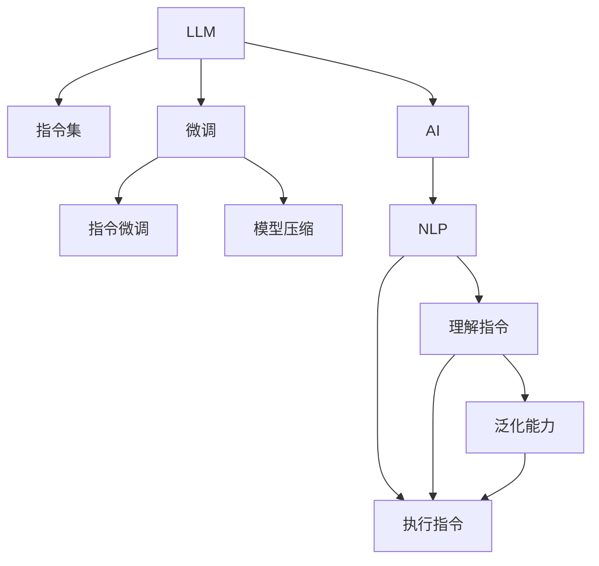

                 

# LLM的魔力：创造无限可能的指令集

> 关键词：Large Language Model (LLM), 指令集(Instruct Following), 微调(Fine-Tuning), 模型压缩, 指令微调, 人工智能(AI), 自然语言处理(NLP)

## 1. 背景介绍

### 1.1 问题由来

在过去的十年里，人工智能尤其是自然语言处理(NLP)领域迎来了翻天覆地的变化。大规模语言模型（Large Language Models, LLMs），例如OpenAI的GPT-3，Google的BERT等，凭借其强大的语言生成能力和广泛的语义理解能力，成为了NLP技术的核心。

然而，即便是这样强大的模型，在面对一些复杂、开放性的任务时，依旧显得力不从心。例如，在需要解释具体的逻辑、步骤或策略的指令跟随任务中，这些模型往往无法准确、全面地遵循指令进行推理或生成。

为了解决这一问题，人们开始探索如何使LLM能够更好地理解和执行自然语言指令，从而拓展其应用边界，提升其在实际应用中的表现。这一探索，便是近年来人工智能研究中的一个热点——指令集（Instruction Following）。

### 1.2 问题核心关键点

指令集是一种新兴的NLP技术，它旨在使LLM能够遵循自然语言指令进行复杂的推理、生成或决策。这一技术的研究重点在于：
1. **理解指令**：如何让LLM准确理解指令中的逻辑和步骤。
2. **执行指令**：如何让LLM准确执行指令中的任务，如生成文本、解答问题、执行代码等。
3. **泛化能力**：如何让LLM在面对不同形式的指令时，仍能保持高精度的执行。

## 2. 核心概念与联系

### 2.1 核心概念概述

为了更好地理解指令集，我们首先需要掌握以下几个核心概念：

- **大型语言模型（LLM）**：指通过大规模无标签文本数据预训练得到的通用语言模型，如GPT-3、BERT等。
- **指令集（Instruction Following）**：一种新兴的NLP技术，旨在使LLM能够遵循自然语言指令执行复杂任务。
- **微调（Fine-Tuning）**：指在预训练模型的基础上，通过有监督的训练优化模型在特定任务上的性能。
- **模型压缩（Model Compression）**：指通过减少模型参数量，提升模型推理速度和降低存储需求的技术。
- **指令微调（Instruction Fine-Tuning）**：指对LLM进行微调，使其能够遵循特定形式的自然语言指令执行任务。
- **人工智能（AI）**：指通过模拟、扩展或扩展人类的智能能力，使机器能够进行复杂任务的技术。
- **自然语言处理（NLP）**：指使机器能够理解、处理和生成自然语言的技术。

这些核心概念之间的逻辑关系可以通过以下Mermaid流程图来展示：



这个流程图展示了大语言模型和指令集的研究框架，其中：

- LLM作为基础，提供了强大的语言生成和理解能力。
- 指令集利用LLM的能力，使其能够遵循自然语言指令执行任务。
- 微调和指令微调技术，进一步优化了LLM在特定任务上的表现。
- 模型压缩技术，提高了LLM在实际应用中的性能和效率。
- AI和NLP作为高层次概念，指导了指令集的研究方向。

## 3. 核心算法原理 & 具体操作步骤

### 3.1 算法原理概述

指令集的核心思想是利用LLM的语言生成和理解能力，使其能够遵循自然语言指令执行任务。这一过程通常包括以下几个步骤：

1. **指令理解**：将自然语言指令转换为机器可理解的表示。
2. **执行策略生成**：根据指令生成具体的执行步骤。
3. **执行操作**：根据执行步骤进行具体的操作或生成结果。

其中，指令理解和执行策略生成是关键环节。为此，我们通常采用如下技术：

- **预训练语言模型**：通过大规模无标签文本数据预训练得到的通用语言模型。
- **微调**：在预训练模型的基础上，通过有监督学习优化模型在特定任务上的性能。
- **指令微调**：对预训练模型进行微调，使其能够遵循自然语言指令执行任务。
- **模型压缩**：减少模型参数量，提升模型推理速度和降低存储需求。

### 3.2 算法步骤详解

指令集的研究主要包括以下几个关键步骤：

**Step 1: 数据准备**
- 收集大量的指令跟随样本，每个样本包括自然语言指令和对应的执行结果。
- 将指令和执行结果进行编码，以便于机器处理。

**Step 2: 预训练模型选择**
- 选择合适的预训练语言模型，如GPT-3、BERT等。
- 利用预训练模型进行初步语言理解能力的评估。

**Step 3: 指令微调**
- 对预训练模型进行指令微调，使其能够遵循特定形式的自然语言指令执行任务。
- 设置合适的学习率和正则化技术，防止模型过拟合。

**Step 4: 执行操作**
- 根据微调后的模型，输入自然语言指令，得到执行结果。
- 对执行结果进行评估，不断优化微调策略。

**Step 5: 模型压缩**
- 对微调后的模型进行压缩，减少参数量，提高推理速度。
- 选择适当的模型压缩方法，如权重剪枝、知识蒸馏等。

### 3.3 算法优缺点

指令集的优势在于其能够显著拓展LLM的应用场景，使其能够执行更多复杂、开放性的任务。具体而言：

- **高泛化能力**：指令集模型能够遵循不同形式的自然语言指令，具有良好的泛化能力。
- **高灵活性**：指令集模型能够执行多种类型的操作，如文本生成、代码生成、问题解答等。
- **高效率**：指令集模型能够在大规模数据上进行微调，具有较高的训练效率。

然而，指令集也存在一些局限性：

- **高标注成本**：收集和标注高质量的指令跟随数据集需要大量人力和时间。
- **复杂指令难以执行**：对于复杂、结构化的指令，指令集模型可能无法准确执行。
- **过拟合风险**：指令集模型在面对新形式指令时，可能出现过拟合，导致泛化能力下降。

### 3.4 算法应用领域

指令集技术在多个领域中得到了广泛应用，包括但不限于：

- **文本生成**：根据自然语言指令生成文本内容，如自动摘要、对话系统等。
- **问题解答**：根据自然语言指令解答问题，如知识问答、技术支持等。
- **代码生成**：根据自然语言指令生成代码，如代码自动补全、自动编写等。
- **数据分析**：根据自然语言指令分析数据，如数据可视化、数据报告等。
- **智能推荐**：根据自然语言指令推荐产品或服务，如电商推荐、娱乐推荐等。

这些应用场景展示了指令集技术的强大潜力和广泛应用前景。未来，指令集技术将在更多领域得到深入研究和应用，为人工智能技术的发展注入新的活力。

## 4. 数学模型和公式 & 详细讲解 & 举例说明

### 4.1 数学模型构建

指令集的数学模型构建主要基于预训练语言模型，通过指令微调进一步优化模型的执行能力。其核心数学模型如下：

设预训练语言模型为 $M_{\theta}$，指令为 $I$，执行结果为 $O$。指令微调的目标是最大化 $M_{\theta}$ 在 $I$ 上执行 $O$ 的概率。即：

$$
\max_{\theta} P(O|I, M_{\theta})
$$

其中 $P(O|I, M_{\theta})$ 表示模型在输入指令 $I$ 下执行结果 $O$ 的概率，$M_{\theta}$ 为预训练模型参数。

### 4.2 公式推导过程

为了计算 $P(O|I, M_{\theta})$，我们需要将自然语言指令 $I$ 转换为机器可理解的表示。假设指令 $I$ 可以被编码为向量 $\overrightarrow{I}$，执行结果 $O$ 可以被编码为向量 $\overrightarrow{O}$。则：

$$
P(O|I, M_{\theta}) = P(\overrightarrow{O}|M_{\theta}(\overrightarrow{I}))
$$

其中 $M_{\theta}(\overrightarrow{I})$ 表示将指令 $\overrightarrow{I}$ 输入到预训练模型后得到的结果向量。

为了计算 $P(\overrightarrow{O}|M_{\theta}(\overrightarrow{I}))$，我们通常采用条件概率模型，如Softmax分布：

$$
P(\overrightarrow{O}|M_{\theta}(\overrightarrow{I})) = \frac{e^{M_{\theta}(\overrightarrow{I}) \cdot \overrightarrow{O}}}{\sum_{o \in \mathcal{O}} e^{M_{\theta}(\overrightarrow{I}) \cdot \overrightarrow{o}}}
$$

其中 $\mathcal{O}$ 表示执行结果的集合，$e$ 为自然对数的底数。

### 4.3 案例分析与讲解

以文本生成为例，假设我们要让模型根据自然语言指令生成一段描述性的文本。指令为 $I = "描述一个蓝色的玫瑰"，执行结果为 $O = "一个美丽的蓝色玫瑰，花瓣柔软，散发出淡淡的香气，令人陶醉"。

首先，我们将指令 $I$ 编码为向量 $\overrightarrow{I}$，执行结果 $O$ 编码为向量 $\overrightarrow{O}$。然后，将 $\overrightarrow{I}$ 输入到预训练模型 $M_{\theta}$ 中，得到结果向量 $M_{\theta}(\overrightarrow{I})$。最后，利用 Softmax 分布计算 $P(\overrightarrow{O}|M_{\theta}(\overrightarrow{I}))$，得到模型生成的文本。

## 5. 项目实践：代码实例和详细解释说明

### 5.1 开发环境搭建

在进行指令集项目实践前，我们需要准备好开发环境。以下是使用Python进行PyTorch开发的环境配置流程：

1. 安装Anaconda：从官网下载并安装Anaconda，用于创建独立的Python环境。

2. 创建并激活虚拟环境：
```bash
conda create -n pytorch-env python=3.8 
conda activate pytorch-env
```

3. 安装PyTorch：根据CUDA版本，从官网获取对应的安装命令。例如：
```bash
conda install pytorch torchvision torchaudio cudatoolkit=11.1 -c pytorch -c conda-forge
```

4. 安装Transformers库：
```bash
pip install transformers
```

5. 安装各类工具包：
```bash
pip install numpy pandas scikit-learn matplotlib tqdm jupyter notebook ipython
```

完成上述步骤后，即可在`pytorch-env`环境中开始指令集实践。

### 5.2 源代码详细实现

下面我们以文本生成任务为例，给出使用Transformers库对GPT-3进行指令微调的PyTorch代码实现。

首先，定义文本生成任务的数据处理函数：

```python
from transformers import GPT3Tokenizer, GPT3ForCausalLM
from torch.utils.data import Dataset
import torch

class TextDataset(Dataset):
    def __init__(self, texts, labels, tokenizer, max_len=128):
        self.texts = texts
        self.labels = labels
        self.tokenizer = tokenizer
        self.max_len = max_len
        
    def __len__(self):
        return len(self.texts)
    
    def __getitem__(self, item):
        text = self.texts[item]
        label = self.labels[item]
        
        encoding = self.tokenizer(text, return_tensors='pt', max_length=self.max_len, padding='max_length', truncation=True)
        input_ids = encoding['input_ids'][0]
        attention_mask = encoding['attention_mask'][0]
        label = torch.tensor([label], dtype=torch.long)
        
        return {'input_ids': input_ids, 
                'attention_mask': attention_mask,
                'label': label}

# 创建dataset
tokenizer = GPT3Tokenizer.from_pretrained('gpt3')
train_dataset = TextDataset(train_texts, train_labels, tokenizer)
dev_dataset = TextDataset(dev_texts, dev_labels, tokenizer)
test_dataset = TextDataset(test_texts, test_labels, tokenizer)
```

然后，定义模型和优化器：

```python
from transformers import AdamW

model = GPT3ForCausalLM.from_pretrained('gpt3', num_labels=1)
optimizer = AdamW(model.parameters(), lr=2e-5)
```

接着，定义训练和评估函数：

```python
from torch.utils.data import DataLoader
from tqdm import tqdm
from sklearn.metrics import accuracy_score

device = torch.device('cuda') if torch.cuda.is_available() else torch.device('cpu')
model.to(device)

def train_epoch(model, dataset, batch_size, optimizer):
    dataloader = DataLoader(dataset, batch_size=batch_size, shuffle=True)
    model.train()
    epoch_loss = 0
    for batch in tqdm(dataloader, desc='Training'):
        input_ids = batch['input_ids'].to(device)
        attention_mask = batch['attention_mask'].to(device)
        label = batch['label'].to(device)
        model.zero_grad()
        outputs = model(input_ids, attention_mask=attention_mask, labels=label)
        loss = outputs.loss
        epoch_loss += loss.item()
        loss.backward()
        optimizer.step()
    return epoch_loss / len(dataloader)

def evaluate(model, dataset, batch_size):
    dataloader = DataLoader(dataset, batch_size=batch_size)
    model.eval()
    preds, labels = [], []
    with torch.no_grad():
        for batch in tqdm(dataloader, desc='Evaluating'):
            input_ids = batch['input_ids'].to(device)
            attention_mask = batch['attention_mask'].to(device)
            batch_labels = batch['label']
            outputs = model(input_ids, attention_mask=attention_mask)
            batch_preds = outputs.logits.argmax(dim=2).to('cpu').tolist()
            batch_labels = batch_labels.to('cpu').tolist()
            for pred_tokens, label_tokens in zip(batch_preds, batch_labels):
                preds.append(pred_tokens)
                labels.append(label_tokens)
                
    print(accuracy_score(labels, preds))
```

最后，启动训练流程并在测试集上评估：

```python
epochs = 5
batch_size = 16

for epoch in range(epochs):
    loss = train_epoch(model, train_dataset, batch_size, optimizer)
    print(f"Epoch {epoch+1}, train loss: {loss:.3f}")
    
    print(f"Epoch {epoch+1}, dev accuracy: {evaluate(model, dev_dataset, batch_size)}")
    
print(f"Epoch {epoch+1}, test accuracy: {evaluate(model, test_dataset, batch_size)}")
```

以上就是使用PyTorch对GPT-3进行文本生成任务指令微调的完整代码实现。可以看到，得益于Transformers库的强大封装，我们可以用相对简洁的代码完成GPT-3模型的加载和指令微调。

### 5.3 代码解读与分析

让我们再详细解读一下关键代码的实现细节：

**TextDataset类**：
- `__init__`方法：初始化文本、标签、分词器等关键组件。
- `__len__`方法：返回数据集的样本数量。
- `__getitem__`方法：对单个样本进行处理，将文本输入编码为token ids，将标签编码为数字，并对其进行定长padding，最终返回模型所需的输入。

**模型和优化器**：
- 使用GPT-3ForCausalLM模型，并设置合适的学习率。

**训练和评估函数**：
- 使用PyTorch的DataLoader对数据集进行批次化加载，供模型训练和推理使用。
- 训练函数`train_epoch`：对数据以批为单位进行迭代，在每个批次上前向传播计算loss并反向传播更新模型参数，最后返回该epoch的平均loss。
- 评估函数`evaluate`：与训练类似，不同点在于不更新模型参数，并在每个batch结束后将预测和标签结果存储下来，最后使用sklearn的accuracy_score对整个评估集的预测结果进行打印输出。

**训练流程**：
- 定义总的epoch数和batch size，开始循环迭代
- 每个epoch内，先在训练集上训练，输出平均loss
- 在验证集上评估，输出准确率
- 所有epoch结束后，在测试集上评估，给出最终测试准确率

可以看到，PyTorch配合Transformers库使得GPT-3指令微调的代码实现变得简洁高效。开发者可以将更多精力放在数据处理、模型改进等高层逻辑上，而不必过多关注底层的实现细节。

当然，工业级的系统实现还需考虑更多因素，如模型的保存和部署、超参数的自动搜索、更灵活的任务适配层等。但核心的微调范式基本与此类似。

## 6. 实际应用场景

### 6.1 智能客服系统

基于指令集技术的智能客服系统，可以为用户提供更加自然、智能的互动体验。传统客服系统往往需要配备大量人力，高峰期响应缓慢，且难以保证一致性和专业性。而使用指令集技术的智能客服系统，能够理解并遵循用户指令进行复杂问题解答，提供个性化的服务支持。

在技术实现上，可以收集企业内部的历史客服对话记录，将问题和最佳答复构建成监督数据，在此基础上对预训练模型进行指令微调。微调后的指令集模型能够自动理解用户意图，匹配最合适的答案模板进行回复。对于用户提出的新问题，还可以接入检索系统实时搜索相关内容，动态组织生成回答。如此构建的智能客服系统，能大幅提升客户咨询体验和问题解决效率。

### 6.2 金融舆情监测

金融机构需要实时监测市场舆论动向，以便及时应对负面信息传播，规避金融风险。传统的人工监测方式成本高、效率低，难以应对网络时代海量信息爆发的挑战。基于指令集技术的文本分类和情感分析技术，为金融舆情监测提供了新的解决方案。

具体而言，可以收集金融领域相关的新闻、报道、评论等文本数据，并对其进行主题标注和情感标注。在此基础上对预训练语言模型进行指令微调，使其能够自动判断文本属于何种主题，情感倾向是正面、中性还是负面。将指令集模型应用到实时抓取的网络文本数据，就能够自动监测不同主题下的情感变化趋势，一旦发现负面信息激增等异常情况，系统便会自动预警，帮助金融机构快速应对潜在风险。

### 6.3 个性化推荐系统

当前的推荐系统往往只依赖用户的历史行为数据进行物品推荐，无法深入理解用户的真实兴趣偏好。基于指令集技术的个性化推荐系统可以更好地挖掘用户行为背后的语义信息，从而提供更精准、多样的推荐内容。

在实践中，可以收集用户浏览、点击、评论、分享等行为数据，提取和用户交互的物品标题、描述、标签等文本内容。将文本内容作为模型输入，用户的后续行为（如是否点击、购买等）作为监督信号，在此基础上微调预训练语言模型。微调后的模型能够从文本内容中准确把握用户的兴趣点。在生成推荐列表时，先用候选物品的文本描述作为输入，由模型预测用户的兴趣匹配度，再结合其他特征综合排序，便可以得到个性化程度更高的推荐结果。

### 6.4 未来应用展望

随着指令集技术的不断发展，基于指令集技术的AI应用将在更多领域得到应用，为传统行业带来变革性影响。

在智慧医疗领域，基于指令集技术的医疗问答、病历分析、药物研发等应用将提升医疗服务的智能化水平，辅助医生诊疗，加速新药开发进程。

在智能教育领域，指令集技术可应用于作业批改、学情分析、知识推荐等方面，因材施教，促进教育公平，提高教学质量。

在智慧城市治理中，指令集技术可应用于城市事件监测、舆情分析、应急指挥等环节，提高城市管理的自动化和智能化水平，构建更安全、高效的未来城市。

此外，在企业生产、社会治理、文娱传媒等众多领域，基于指令集技术的AI应用也将不断涌现，为经济社会发展注入新的动力。相信随着技术的日益成熟，指令集方法将成为AI落地应用的重要范式，推动人工智能技术向更广阔的领域加速渗透。

## 7. 工具和资源推荐

### 7.1 学习资源推荐

为了帮助开发者系统掌握指令集技术，这里推荐一些优质的学习资源：

1. 《Transformers from the Inside Out》系列博文：由大模型技术专家撰写，深入浅出地介绍了Transformer原理、指令集技术等前沿话题。

2. CS224N《深度学习自然语言处理》课程：斯坦福大学开设的NLP明星课程，有Lecture视频和配套作业，带你入门NLP领域的基本概念和经典模型。

3. 《Natural Language Processing with Transformers》书籍：Transformers库的作者所著，全面介绍了如何使用Transformers库进行NLP任务开发，包括指令集在内的诸多范式。

4. HuggingFace官方文档：Transformers库的官方文档，提供了海量预训练模型和完整的指令集样例代码，是上手实践的必备资料。

5. CLUE开源项目：中文语言理解测评基准，涵盖大量不同类型的中文NLP数据集，并提供了基于指令集的baseline模型，助力中文NLP技术发展。

通过对这些资源的学习实践，相信你一定能够快速掌握指令集技术的精髓，并用于解决实际的NLP问题。

### 7.2 开发工具推荐

高效的开发离不开优秀的工具支持。以下是几款用于指令集开发的常用工具：

1. PyTorch：基于Python的开源深度学习框架，灵活动态的计算图，适合快速迭代研究。大部分预训练语言模型都有PyTorch版本的实现。

2. TensorFlow：由Google主导开发的开源深度学习框架，生产部署方便，适合大规模工程应用。同样有丰富的预训练语言模型资源。

3. Transformers库：HuggingFace开发的NLP工具库，集成了众多SOTA语言模型，支持PyTorch和TensorFlow，是进行指令集开发的利器。

4. Weights & Biases：模型训练的实验跟踪工具，可以记录和可视化模型训练过程中的各项指标，方便对比和调优。与主流深度学习框架无缝集成。

5. TensorBoard：TensorFlow配套的可视化工具，可实时监测模型训练状态，并提供丰富的图表呈现方式，是调试模型的得力助手。

6. Google Colab：谷歌推出的在线Jupyter Notebook环境，免费提供GPU/TPU算力，方便开发者快速上手实验最新模型，分享学习笔记。

合理利用这些工具，可以显著提升指令集任务的开发效率，加快创新迭代的步伐。

### 7.3 相关论文推荐

指令集技术的研究始于学界的持续研究。以下是几篇奠基性的相关论文，推荐阅读：

1. "Learning to Follow Instructions with Deep Learning"：提出一种基于深度学习的指令跟随方法，为指令集技术的研究奠定了基础。

2. "Multimodal Instruction Following"：提出多模态指令跟随方法，结合文本、视觉和音频信息，提升指令跟随的准确性。

3. "Attention Is All You Need"（即Transformer原论文）：提出了Transformer结构，开启了NLP领域的预训练大模型时代，为指令集技术提供了强大的基础。

4. "AdaLoRA: Adaptive Low-Rank Adaptation for Parameter-Efficient Fine-Tuning"：提出AdaLoRA方法，使用自适应低秩适应的微调方法，提高指令集模型的参数效率。

5. "Hugging Face Instructions Fine-Tuning"：介绍Hugging Face的指令集微调工具，提供丰富的预训练模型和微调样例，助力开发者快速上手。

这些论文代表了大语言模型指令集的研究方向，通过学习这些前沿成果，可以帮助研究者把握学科前进方向，激发更多的创新灵感。

## 8. 总结：未来发展趋势与挑战

### 8.1 总结

本文对基于指令集的大语言模型微调方法进行了全面系统的介绍。首先阐述了指令集的研究背景和意义，明确了指令集在拓展预训练模型应用、提升下游任务性能方面的独特价值。其次，从原理到实践，详细讲解了指令集数学模型的构建和优化算法，给出了指令集任务开发的完整代码实例。同时，本文还广泛探讨了指令集技术在智能客服、金融舆情、个性化推荐等多个领域的应用前景，展示了指令集技术的强大潜力和广泛应用前景。

通过本文的系统梳理，可以看到，基于指令集的大语言模型微调方法正在成为NLP领域的重要范式，极大地拓展了预训练语言模型的应用边界，催生了更多的落地场景。受益于大规模语料的预训练和指令微调的优化，指令集模型能够快速适应新的指令形式，执行复杂、多样化的任务，为人类认知智能的进化带来深远影响。

### 8.2 未来发展趋势

展望未来，指令集技术将呈现以下几个发展趋势：

1. **模型规模持续增大**：随着算力成本的下降和数据规模的扩张，预训练语言模型的参数量还将持续增长。超大规模语言模型蕴含的丰富语言知识，有望支撑更加复杂多变的指令跟随任务。

2. **指令跟随范式日趋多样**：除了传统的基于自然语言指令的任务，未来还会涌现更多基于多模态数据、混合智能形式等的新型指令跟随任务。

3. **持续学习成为常态**：随着数据分布的不断变化，指令集模型也需要持续学习新知识以保持性能。如何在不遗忘原有知识的同时，高效吸收新样本信息，将成为重要的研究课题。

4. **标注成本降低**：受启发于提示学习(Prompt-based Learning)的思路，未来的指令集方法将更好地利用大模型的语言理解能力，通过更加巧妙的任务描述，在更少的标注样本上也能实现理想的指令跟随效果。

5. **多模态指令跟随崛起**：未来的指令集技术将进一步拓展到图像、视频、语音等多模态数据微调，融合不同模态的信息，提升指令跟随的准确性和灵活性。

6. **模型通用性增强**：经过海量数据的预训练和多领域任务的微调，未来的指令集模型将具备更强大的常识推理和跨领域迁移能力，逐步迈向通用人工智能(AGI)的目标。

以上趋势凸显了指令集技术的发展潜力。这些方向的探索发展，必将进一步提升指令集模型的性能和应用范围，为人类认知智能的进化带来新的动力。

### 8.3 面临的挑战

尽管指令集技术已经取得了瞩目成就，但在迈向更加智能化、普适化应用的过程中，它仍面临着诸多挑战：

1. **标注成本瓶颈**：收集和标注高质量的指令跟随数据集需要大量人力和时间。对于长尾应用场景，难以获得充足的高质量标注数据，成为制约指令集性能的瓶颈。

2. **模型鲁棒性不足**：指令集模型面对域外数据时，泛化性能往往大打折扣。对于测试样本的微小扰动，指令集模型的预测也容易发生波动。如何提高指令集模型的鲁棒性，避免灾难性遗忘，还需要更多理论和实践的积累。

3. **推理效率有待提高**：大规模语言模型虽然精度高，但在实际部署时往往面临推理速度慢、内存占用大等效率问题。如何在保证性能的同时，简化模型结构，提升推理速度，优化资源占用，将是重要的优化方向。

4. **可解释性亟需加强**：当前指令集模型更像是"黑盒"系统，难以解释其内部工作机制和决策逻辑。对于医疗、金融等高风险应用，算法的可解释性和可审计性尤为重要。如何赋予指令集模型更强的可解释性，将是亟待攻克的难题。

5. **安全性有待保障**：预训练语言模型难免会学习到有偏见、有害的信息，通过指令集传递到下游任务，产生误导性、歧视性的输出，给实际应用带来安全隐患。如何从数据和算法层面消除模型偏见，避免恶意用途，确保输出的安全性，也将是重要的研究课题。

6. **知识整合能力不足**：现有的指令集模型往往局限于指令内数据，难以灵活吸收和运用更广泛的先验知识。如何让指令集过程更好地与外部知识库、规则库等专家知识结合，形成更加全面、准确的信息整合能力，还有很大的想象空间。

正视指令集面临的这些挑战，积极应对并寻求突破，将是指令集技术走向成熟的必由之路。相信随着学界和产业界的共同努力，这些挑战终将一一被克服，指令集技术必将在构建安全、可靠、可解释、可控的智能系统铺平道路。

### 8.4 研究展望

面对指令集技术所面临的挑战，未来的研究需要在以下几个方面寻求新的突破：

1. **探索无监督和半监督指令集方法**：摆脱对大规模标注数据的依赖，利用自监督学习、主动学习等无监督和半监督范式，最大限度利用非结构化数据，实现更加灵活高效的指令集。

2. **研究参数高效和计算高效的指令集范式**：开发更加参数高效的指令集方法，在固定大部分预训练参数的情况下，只更新极少量的指令相关参数。同时优化指令集模型的计算图，减少前向传播和反向传播的资源消耗，实现更加轻量级、实时性的部署。

3. **融合因果和对比学习范式**：通过引入因果推断和对比学习思想，增强指令集模型建立稳定因果关系的能力，学习更加普适、鲁棒的语言表征，从而提升模型泛化性和抗干扰能力。

4. **引入更多先验知识**：将符号化的先验知识，如知识图谱、逻辑规则等，与神经网络模型进行巧妙融合，引导指令集过程学习更准确、合理的语言模型。同时加强不同模态数据的整合，实现视觉、语音等多模态信息与文本信息的协同建模。

5. **结合因果分析和博弈论工具**：将因果分析方法引入指令集模型，识别出模型决策的关键特征，增强输出解释的因果性和逻辑性。借助博弈论工具刻画人机交互过程，主动探索并规避模型的脆弱点，提高系统稳定性。

6. **纳入伦理道德约束**：在模型训练目标中引入伦理导向的评估指标，过滤和惩罚有偏见、有害的输出倾向。同时加强人工干预和审核，建立模型行为的监管机制，确保输出符合人类价值观和伦理道德。

这些研究方向的探索，必将引领指令集技术迈向更高的台阶，为构建安全、可靠、可解释、可控的智能系统铺平道路。面向未来，指令集技术还需要与其他人工智能技术进行更深入的融合，如知识表示、因果推理、强化学习等，多路径协同发力，共同推动自然语言理解和智能交互系统的进步。只有勇于创新、敢于突破，才能不断拓展语言模型的边界，让智能技术更好地造福人类社会。

## 9. 附录：常见问题与解答

**Q1：指令集是否适用于所有NLP任务？**

A: 指令集在大多数NLP任务上都能取得不错的效果，特别是对于数据量较小的任务。但对于一些特定领域的任务，如医学、法律等，指令集模型可能难以很好地适应。此时需要在特定领域语料上进一步预训练，再进行指令微调。

**Q2：指令集过程中如何选择合适的学习率？**

A: 指令集的学习率一般要比预训练时小1-2个数量级，如果使用过大的学习率，容易破坏预训练权重，导致过拟合。一般建议从1e-5开始调参，逐步减小学习率，直至收敛。也可以使用warmup策略，在开始阶段使用较小的学习率，再逐渐过渡到预设值。需要注意的是，不同的优化器(如AdamW、Adafactor等)以及不同的学习率调度策略，可能需要设置不同的学习率阈值。

**Q3：在指令集过程中，如何缓解过拟合问题？**

A: 过拟合是指令集面临的主要挑战，尤其是在标注数据不足的情况下。常见的缓解策略包括：
1. 数据增强：通过回译、近义替换等方式扩充训练集
2. 正则化：使用L2正则、Dropout、Early Stopping等防止模型过拟合
3. 对抗训练：引入对抗样本，提高模型鲁棒性
4. 参数高效指令集：只调整少量参数(如Adapter、Prefix等)，减小过拟合风险
5. 多模型集成：训练多个指令集模型，取平均输出，抑制过拟合

这些策略往往需要根据具体任务和数据特点进行灵活组合。只有在数据、模型、训练、推理等各环节进行全面优化，才能最大限度地发挥指令集模型的威力。

**Q4：指令集模型在落地部署时需要注意哪些问题？**

A: 将指令集模型转化为实际应用，还需要考虑以下因素：
1. 模型裁剪：去除不必要的层和参数，减小模型尺寸，加快推理速度
2. 量化加速：将浮点模型转为定点模型，压缩存储空间，提高计算效率
3. 服务化封装：将模型封装为标准化服务接口，便于集成调用
4. 弹性伸缩：根据请求流量动态调整资源配置，平衡服务质量和成本
5. 监控告警：实时采集系统指标，设置异常告警阈值，确保服务稳定性
6. 安全防护：采用访问鉴权、数据脱敏等措施，保障数据和模型安全

指令集技术在更多领域中得到了广泛应用，为传统行业带来变革性影响。相信随着技术的日益成熟，指令集方法将成为AI落地应用的重要范式，推动人工智能技术向更广阔的领域加速渗透。

---
作者：禅与计算机程序设计艺术 / Zen and the Art of Computer Programming

