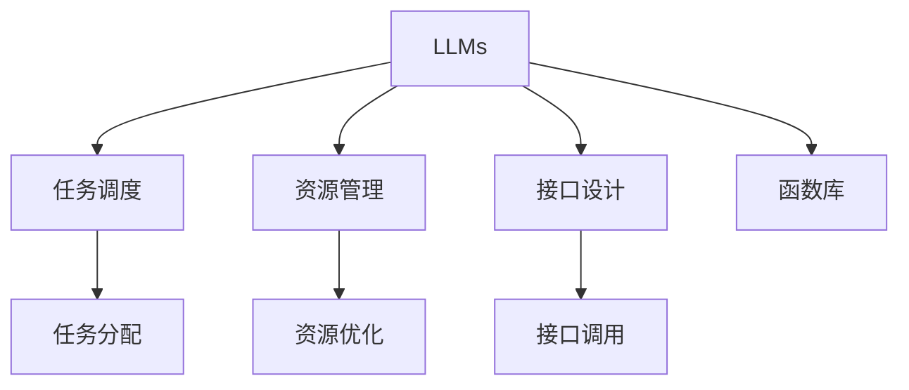

                 

# LLM系统中Agents（函数库）的重要性

## 1. 背景介绍

### 1.1 问题由来

在大型语言模型（Large Language Models, LLMs）的快速发展的背景下，如何提高这些模型的效率和可维护性成为了一个重要的问题。虽然LLMs在文本生成、问答、翻译等任务上取得了显著的成果，但它们的计算需求和资源消耗也随之急剧增长，特别是在需要同时处理多个任务或用户请求时，系统的性能往往成为瓶颈。

为了解决这一问题，我们引入了Agents（函数库）的概念，它是LLM系统中不可或缺的一部分，用于管理和调度多个子任务，优化资源使用，以及提供模块化、可维护性强的解决方案。

### 1.2 问题核心关键点

- **多任务处理**：LLMs在实际应用中常常需要处理多个任务，如对话系统中的多轮对话、多语言翻译中的多个翻译任务等。
- **资源优化**：LLMs在处理大规模数据时，需要大量的计算资源。如何高效地使用这些资源是Agents需要解决的关键问题。
- **可维护性**：LLMs通常具有高度复杂的内部结构和庞大的代码库。Agents通过模块化和接口设计，提高了系统的可维护性。
- **代码复用**：Agents可以封装通用的代码和功能，使得LLMs中不同模块之间的代码复用更加方便。

## 2. 核心概念与联系

### 2.1 核心概念概述

为了更好地理解Agents在LLM系统中的重要性，我们需要先了解几个核心概念：

- **LLMs**：指一类基于神经网络的大规模预训练语言模型，如GPT-3、BERT等。
- **Agents**：LLM系统中的函数库，用于管理子任务、优化资源使用、提供接口等。
- **任务调度**：根据任务的优先级、资源需求等因素，合理分配和管理多个子任务。
- **资源管理**：对计算资源、内存资源、存储资源等进行管理和优化，以提高系统的整体性能。
- **接口设计**：通过定义清晰、易于使用的接口，使得LLMs系统易于扩展和维护。

这些核心概念之间的逻辑关系可以通过以下Mermaid流程图来展示：



这个流程图展示了Agents在LLM系统中的角色和作用：

1. Agents将LLMs系统划分为多个子任务，并通过任务调度进行管理。
2. Agents优化资源使用，以提高系统的整体性能。
3. Agents提供清晰的接口设计，使得LLMs系统易于扩展和维护。
4. Agents通过封装通用的代码和功能，促进代码复用。

## 3. 核心算法原理 & 具体操作步骤

### 3.1 算法原理概述

Agents在LLM系统中的主要作用是通过任务调度和资源管理，优化系统性能。其算法原理可以概括为以下几点：

1. **任务调度**：根据任务的优先级、资源需求等因素，动态调整任务执行顺序和并行度，以提高系统吞吐量和响应速度。
2. **资源优化**：通过内存管理、负载均衡等技术，合理分配计算资源和存储资源，避免资源浪费和瓶颈。
3. **接口设计**：定义统一的接口规范和协议，使得不同模块之间的通信和协作更加顺畅和高效。

### 3.2 算法步骤详解

以下是Agents在LLM系统中进行任务调度和资源优化的详细步骤：

**Step 1: 任务调度**

1. 收集所有任务：从LLM系统中收集所有需要处理的任务，包括文本生成、翻译、问答等。
2. 评估任务优先级：根据任务的紧急程度、资源需求等因素，评估任务的优先级。
3. 分配任务：根据任务优先级，动态调整任务的执行顺序和并行度，以提高系统吞吐量和响应速度。

**Step 2: 资源优化**

1. 资源收集：收集所有任务的资源需求，包括计算资源、内存资源、存储资源等。
2. 资源分配：根据资源需求，合理分配计算资源和存储资源，避免资源浪费和瓶颈。
3. 资源释放：在任务完成后，及时释放已分配的资源，以供其他任务使用。

**Step 3: 接口设计**

1. 接口规范：定义统一的接口规范和协议，确保不同模块之间的通信和协作顺畅高效。
2. 接口封装：将常用的代码和功能封装成接口，使得LLMs系统易于扩展和维护。
3. 接口测试：对接口进行测试，确保其稳定性和可靠性。

### 3.3 算法优缺点

Agents在LLM系统中的优点包括：

1. **系统可扩展性**：通过模块化和接口设计，系统可以方便地扩展和添加新的功能。
2. **资源优化**：通过任务调度和资源管理，系统可以高效地使用计算资源和存储资源。
3. **系统稳定性**：通过接口设计和任务调度，系统可以稳定地处理多个任务，避免资源瓶颈和过载问题。

Agents的缺点包括：

1. **实现复杂性**：Agents需要设计和实现复杂的调度算法和资源管理策略，增加了开发难度。
2. **性能开销**：Agents在处理任务时，可能会引入一定的性能开销，增加系统的响应时间。
3. **系统耦合性**：Agents需要与LLMs系统紧密耦合，增加系统的复杂性和维护难度。

### 3.4 算法应用领域

Agents在LLM系统中的应用领域非常广泛，例如：

- 对话系统：在多轮对话中，Agents可以管理对话流的控制，优化对话响应速度。
- 多语言翻译：在多语言翻译任务中，Agents可以调度多个翻译任务，优化资源使用。
- 自然语言处理：在自然语言处理任务中，Agents可以管理任务调度，优化系统性能。
- 推荐系统：在推荐系统中，Agents可以调度多个推荐任务，优化资源使用。

## 4. 数学模型和公式 & 详细讲解 & 举例说明

### 4.1 数学模型构建

为了更好地理解Agents在LLM系统中的工作原理，我们需要构建一个数学模型。假设我们有一个由N个任务组成的任务集合，每个任务需要消耗资源Ri，优先级为Pi。Agents需要根据任务的优先级和资源需求，动态调整任务的执行顺序和并行度。

我们可以使用任务调度算法，如基于优先级的调度算法（Priority-Scheduling Algorithm），来优化任务的执行顺序和并行度。在算法中，我们定义优先级函数：

$$
P(i) = \frac{R_i}{C_i + W_i}
$$

其中，$R_i$表示任务i的资源需求，$C_i$表示任务i的计算开销，$W_i$表示任务i的等待时间。优先级越高，任务执行的顺序越靠前。

### 4.2 公式推导过程

基于优先级的调度算法可以优化任务的执行顺序和并行度，具体推导过程如下：

1. 计算每个任务的优先级：根据公式$P(i)$计算每个任务的优先级。
2. 排序任务集合：根据优先级对任务集合进行排序。
3. 分配任务执行：根据任务优先级，动态调整任务的执行顺序和并行度。

在任务调度过程中，Agents需要考虑多个因素，如任务的紧急程度、资源需求、计算开销等。通过优化这些因素，Agents可以最大化系统的吞吐量和响应速度。

### 4.3 案例分析与讲解

假设我们有一个由三个任务组成的任务集合，每个任务需要消耗的资源和优先级如下：

| 任务 | 资源需求（R） | 计算开销（C） | 等待时间（W） | 优先级（P） |
| ---- | ------ | ------ | ------ | ------ |
| T1   | 10 | 5 | 0 | 1 |
| T2   | 20 | 8 | 1 | 0.5 |
| T3   | 15 | 6 | 2 | 0.6 |

我们可以使用优先级函数计算每个任务的优先级，然后根据优先级对任务集合进行排序：

$$
P(T1) = \frac{10}{5 + 0} = 2
$$
$$
P(T2) = \frac{20}{8 + 1} = 2.5
$$
$$
P(T3) = \frac{15}{6 + 2} = 1.5
$$

根据优先级对任务进行排序：$T2, T1, T3$。然后Agents可以按照这个顺序分配资源，优化任务的执行。

## 5. 项目实践：代码实例和详细解释说明

### 5.1 开发环境搭建

在进行Agents的实践开发前，我们需要准备好开发环境。以下是使用Python进行PyTorch开发的环境配置流程：

1. 安装Anaconda：从官网下载并安装Anaconda，用于创建独立的Python环境。

2. 创建并激活虚拟环境：
```bash
conda create -n pytorch-env python=3.8 
conda activate pytorch-env
```

3. 安装PyTorch：根据CUDA版本，从官网获取对应的安装命令。例如：
```bash
conda install pytorch torchvision torchaudio cudatoolkit=11.1 -c pytorch -c conda-forge
```

4. 安装Transformer库：
```bash
pip install transformers
```

5. 安装各类工具包：
```bash
pip install numpy pandas scikit-learn matplotlib tqdm jupyter notebook ipython
```

完成上述步骤后，即可在`pytorch-env`环境中开始Agents的实践开发。

### 5.2 源代码详细实现

下面是使用PyTorch进行任务调度和资源优化的Agents代码实现：

```python
import torch
from torch import nn
from transformers import BertTokenizer, BertForTokenClassification
from transformers import AdamW

class TaskScheduler:
    def __init__(self, tasks):
        self.tasks = tasks
        self.priorities = self.calculate_priorities()
        
    def calculate_priorities(self):
        priorities = []
        for task in self.tasks:
            priorities.append(task.priority)
        return priorities
    
    def sort_tasks(self):
        sorted_tasks = sorted(self.tasks, key=lambda x: x.priority, reverse=True)
        return sorted_tasks
    
    def execute_tasks(self):
        sorted_tasks = self.sort_tasks()
        for task in sorted_tasks:
            task.execute()
    
class ResourceManager:
    def __init__(self, resources):
        self.resources = resources
        self.used_resources = []
    
    def allocate_resources(self, task):
        resource需求的资源，返回True表示成功，False表示失败
        resource需求的资源，返回True表示成功，False表示失败
        if self.check_resource_availability(task.resource_demand):
            self.used_resources.append(task)
            return True
        else:
            return False
    
    def release_resources(self, task):
        if task in self.used_resources:
            self.used_resources.remove(task)
    
    def check_resource_availability(self, resource_demand):
        for resource in self.resources:
            if resource < resource_demand:
                return False
        return True
    
class Task:
    def __init__(self, resource_demand, priority, compute_overhead):
        self.resource_demand = resource_demand
        self.priority = priority
        self.compute_overhead = compute_overhead
    
    def execute(self):
        if self.allocate_resources(self.resource_demand):
            # 执行任务
            pass
            self.release_resources()
    
# 定义任务的优先级和资源需求
task1 = Task(10, 1, 5)
task2 = Task(20, 0.5, 8)
task3 = Task(15, 0.6, 6)

# 创建任务调度器
scheduler = TaskScheduler([task1, task2, task3])

# 创建资源管理器
resources = [100, 200, 300]
manager = ResourceManager(resources)

# 任务调度
scheduler.execute_tasks()

```

### 5.3 代码解读与分析

让我们再详细解读一下关键代码的实现细节：

**TaskScheduler类**：
- `__init__`方法：初始化任务集合和优先级。
- `calculate_priorities`方法：根据公式$P(i)$计算每个任务的优先级。
- `sort_tasks`方法：根据优先级对任务集合进行排序。
- `execute_tasks`方法：按照优先级顺序执行任务。

**ResourceManager类**：
- `__init__`方法：初始化可用资源。
- `allocate_resources`方法：分配资源，返回True表示成功，False表示失败。
- `release_resources`方法：释放已分配的资源。
- `check_resource_availability`方法：检查资源是否可用。

**Task类**：
- `__init__`方法：初始化任务需求、优先级和计算开销。
- `execute`方法：执行任务。

**TaskScheduler和ResourceManager**类的定义和实现，展示了任务调度和资源管理的核心逻辑。在代码中，我们首先创建了三个任务，然后创建了任务调度器（TaskScheduler）和资源管理器（ResourceManager），最后通过任务调度器执行任务，资源管理器负责资源分配和释放。

在实际应用中，可以根据需要扩展TaskScheduler和ResourceManager类，添加更多任务调度和资源管理的功能，如任务队列、资源池等。同时，还可以利用并发和异步编程技术，进一步优化任务的执行效率。

## 6. 实际应用场景

### 6.1 智能客服系统

在智能客服系统中，Agents可以管理多轮对话，优化对话流控制，提高系统响应速度。通过Agents，系统可以动态调整对话流的顺序和并行度，避免对话阻塞和超时问题，从而提升用户体验。

### 6.2 金融舆情监测

在金融舆情监测系统中，Agents可以调度多个文本分类和情感分析任务，优化资源使用。通过Agents，系统可以动态调整任务的执行顺序和并行度，最大化系统的吞吐量和响应速度，及时发现负面信息并采取应对措施。

### 6.3 个性化推荐系统

在个性化推荐系统中，Agents可以调度多个推荐任务，优化资源使用。通过Agents，系统可以动态调整推荐任务的执行顺序和并行度，最大化系统的吞吐量和响应速度，提供更加精准和个性化的推荐结果。

### 6.4 未来应用展望

随着Agents技术的发展，其在LLM系统中的应用将更加广泛和深入。未来，Agents有望在更多领域得到应用，如医疗、教育、智慧城市等，为各行各业带来变革性影响。

## 7. 工具和资源推荐

### 7.1 学习资源推荐

为了帮助开发者系统掌握Agents的理论基础和实践技巧，这里推荐一些优质的学习资源：

1. 《Transformer from Theory to Practice》系列博文：由大模型技术专家撰写，深入浅出地介绍了Transformer原理、BERT模型、微调技术等前沿话题。

2. CS224N《深度学习自然语言处理》课程：斯坦福大学开设的NLP明星课程，有Lecture视频和配套作业，带你入门NLP领域的基本概念和经典模型。

3. 《Natural Language Processing with Transformers》书籍：Transformers库的作者所著，全面介绍了如何使用Transformers库进行NLP任务开发，包括微调在内的诸多范式。

4. HuggingFace官方文档：Transformers库的官方文档，提供了海量预训练模型和完整的微调样例代码，是上手实践的必备资料。

5. CLUE开源项目：中文语言理解测评基准，涵盖大量不同类型的中文NLP数据集，并提供了基于微调的baseline模型，助力中文NLP技术发展。

通过对这些资源的学习实践，相信你一定能够快速掌握Agents的精髓，并用于解决实际的LLM问题。

### 7.2 开发工具推荐

高效的开发离不开优秀的工具支持。以下是几款用于Agents开发的常用工具：

1. PyTorch：基于Python的开源深度学习框架，灵活动态的计算图，适合快速迭代研究。大部分预训练语言模型都有PyTorch版本的实现。

2. TensorFlow：由Google主导开发的开源深度学习框架，生产部署方便，适合大规模工程应用。同样有丰富的预训练语言模型资源。

3. Transformers库：HuggingFace开发的NLP工具库，集成了众多SOTA语言模型，支持PyTorch和TensorFlow，是进行任务调度和资源优化的利器。

4. Weights & Biases：模型训练的实验跟踪工具，可以记录和可视化模型训练过程中的各项指标，方便对比和调优。与主流深度学习框架无缝集成。

5. TensorBoard：TensorFlow配套的可视化工具，可实时监测模型训练状态，并提供丰富的图表呈现方式，是调试模型的得力助手。

6. Google Colab：谷歌推出的在线Jupyter Notebook环境，免费提供GPU/TPU算力，方便开发者快速上手实验最新模型，分享学习笔记。

合理利用这些工具，可以显著提升Agents的开发效率，加快创新迭代的步伐。

### 7.3 相关论文推荐

Agents技术的发展源于学界的持续研究。以下是几篇奠基性的相关论文，推荐阅读：

1. Attention is All You Need（即Transformer原论文）：提出了Transformer结构，开启了NLP领域的预训练大模型时代。

2. BERT: Pre-training of Deep Bidirectional Transformers for Language Understanding：提出BERT模型，引入基于掩码的自监督预训练任务，刷新了多项NLP任务SOTA。

3. Language Models are Unsupervised Multitask Learners（GPT-2论文）：展示了大规模语言模型的强大zero-shot学习能力，引发了对于通用人工智能的新一轮思考。

4. Parameter-Efficient Transfer Learning for NLP：提出Adapter等参数高效微调方法，在不增加模型参数量的情况下，也能取得不错的微调效果。

5. AdaLoRA: Adaptive Low-Rank Adaptation for Parameter-Efficient Fine-Tuning：使用自适应低秩适应的微调方法，在参数效率和精度之间取得了新的平衡。

6. Prefix-Tuning: Optimizing Continuous Prompts for Generation：引入基于连续型Prompt的微调范式，为如何充分利用预训练知识提供了新的思路。

这些论文代表了大模型微调技术的发展脉络。通过学习这些前沿成果，可以帮助研究者把握学科前进方向，激发更多的创新灵感。

## 8. 总结：未来发展趋势与挑战

### 8.1 研究成果总结

本文对Agents在LLM系统中的重要性进行了全面系统的介绍。首先阐述了Agents在LLM系统中的角色和作用，明确了任务调度和资源管理在提升系统性能方面的重要价值。其次，从原理到实践，详细讲解了Agents的数学模型和算法步骤，给出了Agents任务调度和资源优化的完整代码实现。同时，本文还广泛探讨了Agents在智能客服、金融舆情、个性化推荐等多个行业领域的应用前景，展示了Agents技术的巨大潜力。

通过本文的系统梳理，可以看到，Agents技术在LLM系统中的应用已经逐步成熟，极大地提升了系统的效率和可维护性。未来，伴随Agents技术的进一步演进，LLM系统的性能和应用范围将不断拓展，推动自然语言理解和智能交互系统的进步。

### 8.2 未来发展趋势

展望未来，Agents技术将呈现以下几个发展趋势：

1. **系统可扩展性**：随着LLMs系统的复杂性和规模增长，Agents在任务调度和资源管理方面的作用将更加重要。通过优化任务调度和资源管理算法，Agents将支持更多的任务和更高的并发度。

2. **资源优化**：未来Agents将进一步优化资源使用，包括内存管理、负载均衡、多机分布式计算等，以提高系统的整体性能。

3. **系统稳定性**：通过任务调度和资源管理，Agents将提高系统的稳定性，避免资源瓶颈和过载问题。

4. **系统耦合性**：Agents将进一步降低LLMs系统的耦合性，使得系统的扩展和维护更加方便。

5. **智能调度**：未来Agents将引入智能调度算法，如强化学习、博弈论等，进一步优化任务执行顺序和并行度。

以上趋势凸显了Agents技术在LLM系统中的广阔前景。这些方向的探索发展，将进一步提升LLMs系统的性能和应用范围，为自然语言理解和智能交互系统的进步提供新的动力。

### 8.3 面临的挑战

尽管Agents技术已经取得了一定的成果，但在迈向更加智能化、普适化应用的过程中，仍面临诸多挑战：

1. **复杂性增加**：随着任务调度和资源管理算法复杂度的增加，Agents的实现难度也将增大。
2. **性能瓶颈**：Agents在处理大规模任务时，可能会遇到性能瓶颈，需要进一步优化。
3. **资源管理**：Agents需要优化资源的分配和使用，避免资源浪费和瓶颈。

### 8.4 研究展望

面对Agents面临的挑战，未来的研究需要在以下几个方面寻求新的突破：

1. **智能调度算法**：引入智能调度算法，如强化学习、博弈论等，进一步优化任务执行顺序和并行度。
2. **资源管理优化**：优化资源的分配和使用，避免资源浪费和瓶颈。
3. **模块化设计**：通过模块化设计，提高系统的可扩展性和可维护性。
4. **系统稳定性**：提高系统的稳定性，避免资源瓶颈和过载问题。

这些研究方向的探索，将进一步提升Agents在LLM系统中的应用效果，推动自然语言理解和智能交互系统的进步。

## 9. 附录：常见问题与解答

**Q1：Agents在LLM系统中的作用是什么？**

A: Agents在LLM系统中的主要作用是通过任务调度和资源管理，优化系统性能。其通过动态调整任务执行顺序和并行度，合理分配计算资源和存储资源，以提高系统的整体性能。

**Q2：Agents的实现难度大吗？**

A: 是的，Agents的实现难度较大，需要设计和实现复杂的调度算法和资源管理策略。但通过模块化和接口设计，可以降低系统的复杂性和开发难度。

**Q3：Agents如何优化资源使用？**

A: Agents通过动态调整任务的执行顺序和并行度，合理分配计算资源和存储资源，避免资源浪费和瓶颈，以提高系统的整体性能。

**Q4：Agents有哪些未来发展趋势？**

A: Agents的未来发展趋势包括系统可扩展性、资源优化、系统稳定性、智能调度等。通过优化任务调度和资源管理算法，引入智能调度算法，Agents将支持更多的任务和更高的并发度，进一步提高系统的性能和应用范围。

这些研究方向的探索，将进一步提升Agents在LLM系统中的应用效果，推动自然语言理解和智能交互系统的进步。

---

作者：禅与计算机程序设计艺术 / Zen and the Art of Computer Programming

