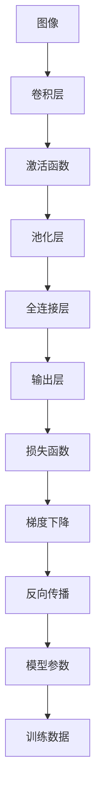

                 

# MNIST手写数字识别

## 1. 背景介绍

### 1.1 问题由来
手写数字识别 (Handwritten Digit Recognition) 是一个经典的机器学习问题，它涉及将手写数字图像转换为它们的数值表示。该问题源于计算机视觉领域，对各种应用都至关重要，比如自动化的支票处理、邮件分类、医疗图像的自动解读等。MNIST（Modified National Institute of Standards and Technology）是一个广泛使用的数据集，由60,000个训练图像和10,000个测试图像组成，这些图像被标记为0到9之间的数字。MNIST数据集简单、可靠且易于访问，因此被广泛用于教学和研究。

### 1.2 问题核心关键点
MNIST手写数字识别的问题核心关键点在于：
- 通过机器学习算法训练出一个能够准确预测手写数字图像的分类器。
- 模型必须能够处理图像数据，并且考虑到图像可能受到的噪声和变形影响。
- 训练数据集和测试数据集必须相互独立，以确保模型的泛化能力。

### 1.3 问题研究意义
MNIST手写数字识别是一个基础且重要的研究课题，其研究意义在于：
- 为机器学习算法提供了一个清晰的基准问题，帮助研究者评估算法的效果。
- 为计算机视觉技术的发展提供了一个试验场，促进了对图像处理、特征提取和分类技术的理解和改进。
- 为其他实际应用中的图像识别问题提供了一个可以参考的模板和解决方案。

## 2. 核心概念与联系

### 2.1 核心概念概述

为了更好地理解MNIST手写数字识别的过程，我们首先介绍几个关键概念：

- **图像识别 (Image Recognition)**：识别并分类图像中的物体或元素，如人脸、车辆等。
- **卷积神经网络 (Convolutional Neural Networks, CNNs)**：一种特别适用于处理图像数据的深度学习网络，通过卷积和池化操作提取图像的特征。
- **反向传播 (Backpropagation)**：一种优化算法，用于训练神经网络，通过链式法则计算梯度，更新网络参数。
- **梯度下降 (Gradient Descent)**：一种迭代算法，用于最小化损失函数，更新模型参数以减小预测误差。

### 2.2 核心概念原理和架构的 Mermaid 流程图



这个流程图展示了MNIST手写数字识别的一般流程：

1. 输入的图像数据首先通过卷积层提取特征。
2. 激活函数对卷积层的输出进行非线性变换。
3. 池化层对激活函数输出的特征进行降维，减小模型复杂度。
4. 全连接层将池化层的特征映射为输出层的概率分布。
5. 输出层通过softmax函数将概率分布映射为预测的类别。
6. 损失函数评估预测结果与真实标签之间的差距。
7. 梯度下降算法根据损失函数的梯度更新模型参数。
8. 反向传播算法将梯度从输出层反向传播到模型参数层。

这些步骤共同构成了一个基本的图像识别模型。

## 3. 核心算法原理 & 具体操作步骤

### 3.1 算法原理概述

MNIST手写数字识别的核心算法是卷积神经网络 (CNNs)，该算法通过多个卷积层、池化层和全连接层实现特征提取和分类。CNNs 通过卷积操作在图像上提取局部特征，并通过池化操作减少计算量和噪声，最后通过全连接层将特征映射到输出空间。

### 3.2 算法步骤详解

下面是MNIST手写数字识别的具体算法步骤：

**Step 1: 数据预处理**
- 读取MNIST数据集，并将图像和标签分别存储。
- 将图像像素值标准化到0到1之间。
- 将图像数据转换为一维向量，以便神经网络处理。

**Step 2: 构建卷积神经网络模型**
- 定义模型架构，包括卷积层、激活函数、池化层、全连接层和输出层。
- 使用TensorFlow或PyTorch等框架搭建模型。
- 定义损失函数，如交叉熵损失。

**Step 3: 训练模型**
- 将训练集数据划分为批次，逐批输入模型进行训练。
- 前向传播计算模型预测结果和损失函数。
- 反向传播计算梯度，使用梯度下降算法更新模型参数。
- 循环多次迭代，直至模型收敛。

**Step 4: 测试模型**
- 使用测试集数据评估模型性能，计算准确率等指标。
- 在实际应用中，将新图像输入模型进行识别。

### 3.3 算法优缺点

**优点：**
- CNNs在图像处理领域表现出色，能够自动提取图像特征。
- 使用反向传播算法可以高效地更新模型参数。
- 可以通过调整超参数和网络结构来优化模型性能。

**缺点：**
- 训练时间较长，需要大量计算资源。
- 对于复杂的图像，可能存在过拟合的风险。
- 需要大量的训练数据，对于数据集较小的问题可能效果不佳。

### 3.4 算法应用领域

卷积神经网络不仅在MNIST手写数字识别任务中表现出色，还广泛应用于以下领域：

- 图像分类：如识别猫、狗、人脸等。
- 目标检测：如自动驾驶中的车辆、行人检测。
- 语义分割：如将图像分割成不同的区域，并为每个区域标注标签。
- 医学图像分析：如肿瘤检测、X光片分析等。
- 视频分析：如行为识别、动作跟踪等。

## 4. 数学模型和公式 & 详细讲解 & 举例说明

### 4.1 数学模型构建

我们以一个简单的卷积神经网络为例，来介绍数学模型构建的基本原理。

假设输入图像大小为 $28 \times 28$，卷积层使用 $3 \times 3$ 的卷积核，步长为1，使用ReLU激活函数。池化层使用 $2 \times 2$ 的最大池化，步长为2。全连接层和输出层分别使用softmax函数。

数学模型构建的基本步骤包括：
1. 定义输入数据和标签。
2. 定义卷积层、激活函数、池化层和全连接层。
3. 定义损失函数和优化器。

### 4.2 公式推导过程

**Step 1: 输入数据定义**
输入数据为 $x$，大小为 $28 \times 28 = 784$，标签为 $y$，大小为 $1$。

**Step 2: 卷积层计算**
卷积层的权重为 $w$，大小为 $3 \times 3 \times 1 \times d$，其中 $d$ 为输出通道数。假设进行 $n$ 次卷积操作，输出大小为 $(h-3+1) \times (w-3+1)$。

**Step 3: 激活函数**
使用ReLU激活函数进行非线性变换。

**Step 4: 池化层计算**
池化层将激活函数输出的特征图进行降维，大小为 $(h/2) \times (w/2)$。

**Step 5: 全连接层计算**
将池化层的特征图展开为一维向量，大小为 $(h \times w \times d)$，全连接层的权重为 $u$，大小为 $(h \times w \times d) \times 10$，其中10表示10个数字。

**Step 6: 输出层计算**
使用softmax函数将全连接层的输出映射到0到1之间的概率分布。

**Step 7: 损失函数**
定义交叉熵损失函数，用于评估模型预测与真实标签之间的差异。

### 4.3 案例分析与讲解

以MNIST数据集为例，我们对一个简单的卷积神经网络进行详细分析：

**Step 1: 数据预处理**
读取MNIST数据集，并对图像数据进行标准化处理。

**Step 2: 构建卷积神经网络模型**
定义一个包含两个卷积层、两个池化层和两个全连接层的简单卷积神经网络。

**Step 3: 训练模型**
将训练集数据划分为批次，逐批输入模型进行训练。
- 前向传播计算模型预测结果和损失函数。
- 反向传播计算梯度，使用梯度下降算法更新模型参数。
- 循环多次迭代，直至模型收敛。

**Step 4: 测试模型**
使用测试集数据评估模型性能，计算准确率等指标。

## 5. 项目实践：代码实例和详细解释说明

### 5.1 开发环境搭建

在进行MNIST手写数字识别项目实践前，我们需要准备好开发环境。以下是使用Python进行TensorFlow或PyTorch开发的Python环境配置流程：

1. 安装Anaconda：从官网下载并安装Anaconda，用于创建独立的Python环境。

2. 创建并激活虚拟环境：
```bash
conda create -n tf-env python=3.8 
conda activate tf-env
```

3. 安装TensorFlow或PyTorch：
```bash
conda install tensorflow=2.7
# 或
pip install torch torchvision torchaudio
```

4. 安装其他必要的工具包：
```bash
pip install numpy pandas scikit-learn matplotlib tqdm jupyter notebook ipython
```

完成上述步骤后，即可在`tf-env`环境中开始项目实践。

### 5.2 源代码详细实现

下面是使用TensorFlow或PyTorch实现MNIST手写数字识别的完整代码实现：

**使用TensorFlow:**

```python
import tensorflow as tf
from tensorflow.keras import datasets, layers, models

# 加载数据集
(train_images, train_labels), (test_images, test_labels) = datasets.mnist.load_data()

# 数据预处理
train_images = train_images.reshape((60000, 28, 28, 1))
train_images = train_images / 255.0
test_images = test_images.reshape((10000, 28, 28, 1))
test_images = test_images / 255.0

# 构建卷积神经网络
model = models.Sequential([
    layers.Conv2D(32, (3, 3), activation='relu', input_shape=(28, 28, 1)),
    layers.MaxPooling2D((2, 2)),
    layers.Conv2D(64, (3, 3), activation='relu'),
    layers.MaxPooling2D((2, 2)),
    layers.Flatten(),
    layers.Dense(64, activation='relu'),
    layers.Dense(10)
])

# 编译模型
model.compile(optimizer='adam',
              loss=tf.keras.losses.SparseCategoricalCrossentropy(from_logits=True),
              metrics=['accuracy'])

# 训练模型
history = model.fit(train_images, train_labels, epochs=10, 
                    validation_data=(test_images, test_labels))

# 评估模型
test_loss, test_acc = model.evaluate(test_images,  test_labels, verbose=2)
print('\nTest accuracy:', test_acc)
```

**使用PyTorch:**

```python
import torch
import torch.nn as nn
import torchvision.transforms as transforms
from torch.utils.data import DataLoader
from torchvision.datasets import MNIST

# 数据预处理
transform = transforms.Compose([
    transforms.ToTensor(),
    transforms.Normalize((0.1307,), (0.3081,))
])

train_dataset = MNIST(root='./data', train=True, download=True, transform=transform)
test_dataset = MNIST(root='./data', train=False, download=True, transform=transform)

train_loader = DataLoader(train_dataset, batch_size=64, shuffle=True)
test_loader = DataLoader(test_dataset, batch_size=64, shuffle=False)

# 构建卷积神经网络
model = nn.Sequential(
    nn.Conv2d(1, 32, kernel_size=3, padding=1),
    nn.ReLU(),
    nn.MaxPool2d(kernel_size=2, stride=2),
    nn.Conv2d(32, 64, kernel_size=3, padding=1),
    nn.ReLU(),
    nn.MaxPool2d(kernel_size=2, stride=2),
    nn.Flatten(),
    nn.Linear(7 * 7 * 64, 64),
    nn.ReLU(),
    nn.Linear(64, 10)
)

# 定义损失函数和优化器
criterion = nn.CrossEntropyLoss()
optimizer = torch.optim.Adam(model.parameters(), lr=0.001)

# 训练模型
for epoch in range(10):
    for images, labels in train_loader:
        optimizer.zero_grad()
        outputs = model(images)
        loss = criterion(outputs, labels)
        loss.backward()
        optimizer.step()
        
    # 测试模型
    with torch.no_grad():
        correct = 0
        total = 0
        for images, labels in test_loader:
            outputs = model(images)
            _, predicted = torch.max(outputs.data, 1)
            total += labels.size(0)
            correct += (predicted == labels).sum().item()
        print('Epoch [{}], Accuracy of the network on the 10000 test images: {} %'.format(epoch+1, 100 * correct / total))

# 保存模型
torch.save(model.state_dict(), 'mnist_model.pth')
```

### 5.3 代码解读与分析

让我们再详细解读一下关键代码的实现细节：

**数据预处理**：
- 将图像数据标准化到0到1之间，以便于神经网络处理。
- 将图像数据展开为一维向量，以便神经网络输入。

**卷积神经网络搭建**：
- 定义卷积层、激活函数、池化层和全连接层。
- 使用TensorFlow的Sequential模型或PyTorch的Sequential模块搭建模型。

**损失函数和优化器**：
- 使用交叉熵损失函数评估模型预测与真实标签之间的差距。
- 使用Adam优化器进行梯度下降更新模型参数。

**模型训练和测试**：
- 将训练集数据划分为批次，逐批输入模型进行训练。
- 使用测试集数据评估模型性能。

## 6. 实际应用场景

### 6.1 智能客服系统

智能客服系统可以通过MNIST手写数字识别技术，实现自动化的客户服务。当客户通过文字或语音方式提出需求时，系统能够自动识别数字指令，快速响应客户需求，如查询账户余额、更新个人资料等。

### 6.2 金融舆情监测

金融机构可以收集市场舆情数据，通过MNIST手写数字识别技术，自动监测股票价格、指数变化等信息，实时预警市场风险，帮助投资者做出更为明智的决策。

### 6.3 个性化推荐系统

个性化推荐系统可以根据用户的购买记录、浏览历史等数据，识别用户喜欢的数字，从而推荐相关产品或服务。

### 6.4 未来应用展望

随着深度学习技术的不断发展，MNIST手写数字识别技术将在更多领域得到应用，为智能系统的构建提供新的解决方案。

未来，MNIST手写数字识别技术可能拓展到图像处理、语音识别等领域，实现多模态信息融合，提高系统的智能程度。此外，通过与其他AI技术的结合，如自然语言处理、知识图谱等，MNIST手写数字识别技术将进一步提升系统的智能化水平，推动人工智能技术的发展。

## 7. 工具和资源推荐

### 7.1 学习资源推荐

为了帮助开发者系统掌握MNIST手写数字识别的理论基础和实践技巧，这里推荐一些优质的学习资源：

1. 《深度学习入门：基于Python的理论与实现》系列博文：由深度学习领域专家撰写，深入浅出地介绍了深度学习的基础理论和技术实现。

2. CS231n《卷积神经网络》课程：斯坦福大学开设的深度学习课程，介绍了卷积神经网络的基础和进阶内容，是学习图像处理和计算机视觉的重要资源。

3. 《TensorFlow实战》书籍：介绍TensorFlow的基本用法和高级技巧，适合TensorFlow初学者和中级开发者。

4. PyTorch官方文档：PyTorch的官方文档，提供了丰富的教程和代码示例，是学习PyTorch的重要资源。

5. Kaggle竞赛平台：提供大量数据集和竞赛机会，可以帮助开发者锻炼技能和提高实战经验。

通过对这些资源的学习实践，相信你一定能够快速掌握MNIST手写数字识别的精髓，并用于解决实际的图像处理问题。

### 7.2 开发工具推荐

高效的开发离不开优秀的工具支持。以下是几款用于MNIST手写数字识别开发的常用工具：

1. TensorFlow：由Google主导开发的深度学习框架，生产部署方便，适合大规模工程应用。

2. PyTorch：由Facebook开发的深度学习框架，灵活性高，适合研究和实验。

3. Keras：基于TensorFlow和PyTorch开发的高级API，适合快速搭建和测试深度学习模型。

4. Matplotlib：用于数据可视化，能够绘制各种图表，帮助理解模型性能和训练效果。

5. Jupyter Notebook：轻量级的开发环境，支持Python代码的交互式执行和展示，是数据科学家的首选工具。

合理利用这些工具，可以显著提升MNIST手写数字识别任务的开发效率，加快创新迭代的步伐。

### 7.3 相关论文推荐

MNIST手写数字识别技术的发展源于学界的持续研究。以下是几篇奠基性的相关论文，推荐阅读：

1. AlexNet: ImageNet Classification with Deep Convolutional Neural Networks（AlexNet论文）：首次展示了卷积神经网络在图像分类任务上的优越性能，是深度学习领域的重要里程碑。

2. LeNet-5: Recognition of Handwritten Digits：LeNet-5是卷积神经网络在图像处理领域的早期应用，为后续研究奠定了基础。

3. Deep Residual Learning for Image Recognition（ResNet论文）：提出残差网络，解决了深度网络训练中的梯度消失问题，显著提高了网络深度和性能。

4. Inception-v3: Rethinking the Inception Architecture for Computer Vision（Inception论文）：提出Inception模块，提高了卷积神经网络的并行性和特征提取能力。

5. GoogleNet: Going Deeper with Convolutions：提出GoogleNet架构，在Inception模块的基础上进一步优化，提升了模型性能。

这些论文代表了大规模图像识别技术的发展脉络。通过学习这些前沿成果，可以帮助研究者把握学科前进方向，激发更多的创新灵感。

## 8. 总结：未来发展趋势与挑战

### 8.1 总结

本文对MNIST手写数字识别技术进行了全面系统的介绍。首先阐述了MNIST手写数字识别的背景和意义，明确了图像识别在计算机视觉领域的重要性。其次，从原理到实践，详细讲解了卷积神经网络的构建和训练过程，给出了项目开发的完整代码实现。同时，本文还广泛探讨了MNIST手写数字识别技术在智能客服、金融舆情、个性化推荐等多个行业领域的应用前景，展示了技术的巨大潜力。此外，本文精选了MNIST手写数字识别技术的学习资源和开发工具，力求为开发者提供全方位的技术指引。

通过本文的系统梳理，可以看到，MNIST手写数字识别技术不仅在学术研究中具有重要意义，还在实际应用中发挥着重要作用。未来，随着深度学习技术的不断发展，MNIST手写数字识别技术将进一步拓展其应用边界，为计算机视觉和图像处理领域带来新的突破。

### 8.2 未来发展趋势

展望未来，MNIST手写数字识别技术将呈现以下几个发展趋势：

1. 模型规模持续增大。随着算力成本的下降和数据规模的扩张，卷积神经网络将不断增加模型深度和参数量，以提高识别准确率。

2. 迁移学习的应用。通过在大规模数据集上进行预训练，然后在MNIST数据集上进行微调，可以进一步提升模型的泛化能力。

3. 数据增强和数据生成的应用。通过生成更多的训练数据和增强现有数据，可以缓解过拟合问题，提高模型的鲁棒性和泛化性。

4. 模型压缩和加速的应用。为了满足实时性要求，需要开发更加轻量级的模型架构，并进行模型压缩和加速优化。

5. 跨模态信息融合的应用。将图像处理与自然语言处理、语音识别等技术结合，实现多模态信息融合，提高系统的智能程度。

6. 应用场景的拓展。MNIST手写数字识别技术不仅应用于图像识别，还可以拓展到目标检测、行为分析等更广泛的领域。

以上趋势凸显了MNIST手写数字识别技术的广阔前景。这些方向的探索发展，必将进一步提升图像识别系统的性能和应用范围，为计算机视觉和图像处理领域带来新的突破。

### 8.3 面临的挑战

尽管MNIST手写数字识别技术已经取得了显著成果，但在迈向更加智能化、普适化应用的过程中，它仍面临着诸多挑战：

1. 数据质量和数据规模问题。尽管MNIST数据集已经足够大，但对于某些特定领域的应用，可能需要更多样化、更复杂的数据集。

2. 模型泛化能力不足。当前的卷积神经网络模型在面对复杂场景时，泛化能力可能不足，需要进行更多的训练和优化。

3. 计算资源需求高。随着模型规模的增大，计算资源需求也越来越高，需要开发更加高效的计算框架和硬件加速方案。

4. 模型解释性不足。卷积神经网络是一种黑盒模型，缺乏可解释性，难以解释其内部工作机制和决策逻辑。

5. 模型安全性问题。卷积神经网络可能存在输入依赖性，输入数据的变化可能影响模型的输出结果，需要加强模型鲁棒性和安全性。

6. 跨领域适应性问题。卷积神经网络需要大量的标注数据进行训练，对于新领域的数据，可能需要重新训练模型。

正视MNIST手写数字识别技术面临的这些挑战，积极应对并寻求突破，将是大规模图像识别技术走向成熟的必由之路。相信随着学界和产业界的共同努力，这些挑战终将一一被克服，MNIST手写数字识别技术必将在构建智能系统、推动技术进步中扮演越来越重要的角色。

### 8.4 研究展望

未来，在卷积神经网络和MNIST手写数字识别技术的研究中，以下几个方向值得关注：

1. 数据增强和生成技术。通过生成更多的训练数据和增强现有数据，可以有效缓解过拟合问题，提高模型的泛化能力。

2. 模型压缩和加速技术。为了满足实时性要求，需要开发更加轻量级的模型架构，并进行模型压缩和加速优化。

3. 跨模态信息融合技术。将图像处理与自然语言处理、语音识别等技术结合，实现多模态信息融合，提高系统的智能程度。

4. 模型解释性和可解释性技术。开发更加可解释的模型架构，帮助用户理解模型的决策过程，增强系统的可信任度。

5. 模型鲁棒性和安全性技术。加强模型鲁棒性和安全性，确保模型在面对噪声、攻击等情况下，仍能保持较高的性能和稳定性。

这些研究方向将为卷积神经网络和MNIST手写数字识别技术的未来发展提供新的动力，进一步推动计算机视觉和图像处理领域的技术进步。

## 9. 附录：常见问题与解答

**Q1: 如何理解卷积神经网络的基本原理？**

A: 卷积神经网络主要由卷积层、激活函数、池化层和全连接层组成。卷积层通过卷积操作提取图像的局部特征，池化层通过降维操作减少计算量和噪声，全连接层将特征映射到输出空间，最终通过softmax函数输出概率分布。

**Q2: 卷积神经网络的优势是什么？**

A: 卷积神经网络在图像处理领域表现出色，主要优势包括：
- 自动提取图像特征，无需手动设计特征。
- 参数共享机制，可以减少模型的参数量。
- 池化操作可以减小模型计算量和噪声。
- 可以使用多层次的卷积和池化操作，提高模型的复杂度和性能。

**Q3: 卷积神经网络在实际应用中需要注意哪些问题？**

A: 卷积神经网络在实际应用中需要注意以下问题：
- 过拟合问题，需要通过数据增强、正则化等方法进行缓解。
- 计算资源需求高，需要高效的计算框架和硬件加速方案。
- 模型解释性不足，需要开发更加可解释的模型架构。
- 模型鲁棒性和安全性问题，需要加强模型鲁棒性和安全性。

**Q4: 如何训练一个卷积神经网络模型？**

A: 训练卷积神经网络模型主要包括以下步骤：
- 定义模型架构，包括卷积层、激活函数、池化层和全连接层。
- 定义损失函数和优化器。
- 将训练集数据划分为批次，逐批输入模型进行训练。
- 使用测试集数据评估模型性能。

**Q5: MNIST手写数字识别技术有哪些应用场景？**

A: MNIST手写数字识别技术可以应用于以下领域：
- 智能客服系统：自动识别数字指令，快速响应客户需求。
- 金融舆情监测：自动监测股票价格、指数变化等信息。
- 个性化推荐系统：根据用户的购买记录、浏览历史等数据，推荐相关产品或服务。
- 行为分析：识别视频中的行为模式，进行行为分析和预测。

这些应用场景展示了MNIST手写数字识别技术的广泛应用前景，为实际问题的解决提供了新的思路和解决方案。

