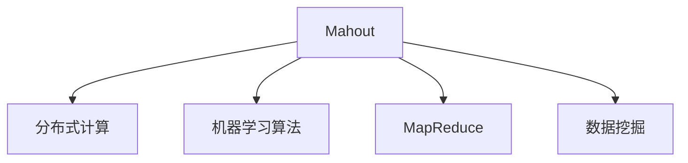

                 

# Mahout机器学习算法库原理与代码实例讲解

> 关键词：Mahout, 机器学习, 矩阵计算, 数据挖掘, 算法实例, 代码实现

## 1. 背景介绍

### 1.1 问题由来
在当今数据驱动的时代，机器学习（ML）和大数据处理成为技术创新的核心驱动力。为了满足日益增长的数据处理需求，许多软件项目开始使用开源机器学习算法库，以便快速实现复杂的预测模型和数据挖掘算法。Mahout便是这样一个流行的开源项目，专注于构建可扩展的机器学习算法，支持大规模数据处理和数据分析。

### 1.2 问题核心关键点
Mahout是一个基于Apache Hadoop的分布式机器学习框架，旨在使机器学习更加容易地与大规模数据集一起使用。Mahout的核心目标是提供一个灵活、可扩展且易于使用的机器学习框架，使得数据科学家和工程师能够快速实现并部署机器学习模型。

在Mahout中，常见的机器学习算法包括分类、聚类、推荐系统、协同过滤等，可以应用于诸如商品推荐、用户画像、客户细分等多个领域。Mahout利用MapReduce架构，能够在集群环境中高效地处理海量数据，实现快速、低成本的机器学习应用。

### 1.3 问题研究意义
研究Mahout机器学习算法库，对于掌握分布式机器学习技术的实践应用、加速数据分析项目的开发、提升数据处理效率具有重要意义：

1. 降低开发成本。Mahout提供了各种预构建的机器学习算法，简化了从数据预处理到模型训练的流程。
2. 提高处理速度。Mahout利用分布式计算技术，可以处理海量数据集，加速模型训练。
3. 提升模型效果。Mahout集成了多种高效算法，可以在保证准确性的同时提升处理效率。
4. 促进工业应用。Mahout的开源特性使得其成为多个商业应用和研究项目的首选工具，加速了其在各行各业的推广和应用。

## 2. 核心概念与联系

### 2.1 核心概念概述

为了更好地理解Mahout机器学习算法库，本节将介绍几个关键概念：

- Mahout：Apache基金会资助的开源机器学习框架，支持大规模数据处理，提供多种常见的机器学习算法。
- 分布式计算：通过将计算任务分解成多个子任务并行处理，高效利用集群资源。
- 机器学习算法：如分类、聚类、协同过滤等，通过学习历史数据，预测未来事件或行为。
- MapReduce：一种编程模型，将大规模数据处理任务分解为多个小的并行任务，易于在大规模集群上分布式执行。
- 数据挖掘：通过分析大量数据，寻找有用信息，发现模式或结构。

这些概念之间的逻辑关系可以通过以下Mermaid流程图来展示：



这个流程图展示了Mahout框架的核心组件及其之间的关系：

1. Mahout作为主要框架，利用分布式计算和MapReduce技术。
2. 提供多种常见的机器学习算法。
3. 支持数据挖掘，提取隐藏在数据中的知识。

## 3. 核心算法原理 & 具体操作步骤
### 3.1 算法原理概述

Mahout机器学习算法库基于MapReduce框架，采用分布式计算和并行处理的思路。其核心算法原理主要分为以下几个步骤：

1. **数据预处理**：将原始数据清洗、转换和标准化，准备进行机器学习训练。
2. **特征提取**：从预处理后的数据中提取出有用的特征，用于模型训练。
3. **模型训练**：在特征提取的基础上，使用各种机器学习算法进行模型训练，生成预测模型。
4. **模型评估**：使用测试数据集评估模型的性能，调整模型参数以提升模型精度。
5. **模型应用**：将训练好的模型应用于实际问题，进行预测或分类等操作。

### 3.2 算法步骤详解

以常见的推荐系统为例，详细讲解Mahout中协同过滤算法的实现步骤：

**Step 1: 数据预处理**
- 收集用户与商品的交互记录，包括用户ID、商品ID和评分等。
- 将数据清洗和转换，去除噪声和缺失值，处理重复记录。
- 对数据进行归一化和标准化，使模型训练更为稳定。

**Step 2: 特征提取**
- 计算用户和商品的相似度，采用余弦相似度或皮尔逊相关系数。
- 构建用户-商品矩阵，用于计算用户与商品的相似度。
- 计算用户对商品的评分预测值。

**Step 3: 模型训练**
- 利用用户-商品矩阵，训练协同过滤模型。
- 使用梯度下降等优化算法，最小化预测误差。
- 对模型参数进行迭代优化，提升模型精度。

**Step 4: 模型评估**
- 使用测试数据集对模型进行交叉验证。
- 计算模型的平均绝对误差(MAE)或均方根误差(RMSE)，评估模型效果。
- 根据评估结果调整模型参数，以进一步提升模型精度。

**Step 5: 模型应用**
- 使用训练好的协同过滤模型对新用户和商品的评分进行预测。
- 结合用户历史评分和商品属性，生成个性化推荐列表。

### 3.3 算法优缺点

Mahout机器学习算法库具有以下优点：
1. 高效可扩展：利用分布式计算和MapReduce架构，可以处理海量数据集，提高处理速度。
2. 算法丰富：提供多种常见的机器学习算法，适用于不同数据类型和应用场景。
3. 易用性：提供简单易用的API，支持多种编程语言（如Java、Python等），易于学习和使用。
4. 开源共享：完全开源，社区活跃，有丰富的文档和示例代码，便于开发者学习和应用。

同时，该框架也存在一些局限性：
1. 学习曲线较陡：对于不熟悉分布式计算和大数据技术的开发者，可能需要一定时间进行学习。
2. 对硬件要求高：需要配置高性能的集群环境，硬件成本较高。
3. 开发复杂性：算法实现较为底层，代码复杂度较高，需要一定的编程技能。
4. 计算复杂度高：一些算法（如协同过滤）计算复杂度高，可能影响处理速度。

尽管存在这些局限性，但Mahout以其高效、灵活和丰富的算法库，成为了数据科学家和工程师的首选工具。

### 3.4 算法应用领域

Mahout机器学习算法库广泛应用在多个领域，主要包括：

- 推荐系统：根据用户的历史行为数据，为用户推荐个性化商品或内容。
- 数据挖掘：从海量数据中发现模式和结构，支持商业决策。
- 聚类分析：将相似数据点分组，用于用户细分、市场分析等。
- 分类任务：利用历史数据训练分类模型，预测新数据类别。
- 关联规则挖掘：分析交易数据，发现商品之间的关联关系。
- 异常检测：识别数据中的异常值，用于欺诈检测、风险管理等。

这些应用领域涵盖了商业、社交、金融、医疗等多个行业，展示了Mahout的强大应用潜力。

## 4. 数学模型和公式 & 详细讲解 & 举例说明

### 4.1 数学模型构建

本节将使用数学语言对Mahout中协同过滤算法的模型构建过程进行更加严格的刻画。

假设用户-商品矩阵为 $U \in \mathbb{R}^{m \times n}$，其中 $m$ 为商品数量，$n$ 为商品评分。对于每个用户 $i$ 和商品 $j$，记录用户 $i$ 对商品 $j$ 的评分 $r_{ij}$。用户和商品的相似度矩阵为 $V \in \mathbb{R}^{n \times n}$，表示用户 $i$ 和商品 $j$ 的相似度，$v_{ij} = \cos(\theta_i, \theta_j)$，其中 $\theta_i$ 和 $\theta_j$ 分别为用户 $i$ 和商品 $j$ 的特征向量。

协同过滤模型的目标是通过相似度矩阵 $V$，预测用户 $i$ 对商品 $j$ 的评分 $r_{ij}$，最小化预测误差 $e_{ij}$：

$$
e_{ij} = r_{ij} - \hat{r}_{ij}
$$

其中 $\hat{r}_{ij}$ 为预测评分，通常使用用户和商品的相似度矩阵 $V$ 和用户 $i$ 对商品 $j$ 的评分 $r_{ij}$ 进行加权平均：

$$
\hat{r}_{ij} = \alpha_i \cdot \sum_{k=1}^n v_{ik} \cdot r_{kj}
$$

其中 $\alpha_i = \frac{\sigma_i}{\sum_{k=1}^n \sigma_k}$，$\sigma_i = \sqrt{v_{ii}}$，$\sigma_k = \sqrt{v_{kk}}$。

在得到评分预测公式后，可以使用均方根误差(RMSE)来评估模型性能：

$$
RMSE = \sqrt{\frac{1}{mn} \sum_{i=1}^m \sum_{j=1}^n (r_{ij} - \hat{r}_{ij})^2}
$$

### 4.2 公式推导过程

以下是协同过滤算法评分预测公式的推导过程：

假设用户 $i$ 对商品 $j$ 的评分 $r_{ij}$ 可以表示为：

$$
r_{ij} = \alpha_i \cdot \sum_{k=1}^n v_{ik} \cdot r_{kj}
$$

其中 $\alpha_i = \frac{\sigma_i}{\sum_{k=1}^n \sigma_k}$，$\sigma_i = \sqrt{v_{ii}}$，$\sigma_k = \sqrt{v_{kk}}$。

将 $\alpha_i$ 和 $\sigma_i$ 代入上式，得：

$$
r_{ij} = \frac{\sqrt{v_{ii}}}{\sum_{k=1}^n \sqrt{v_{kk}}} \cdot \sum_{k=1}^n \frac{v_{ik} \cdot r_{kj}}{\sqrt{v_{kk}}}
$$

进一步简化，得：

$$
r_{ij} = \sum_{k=1}^n \frac{v_{ik} \cdot r_{kj}}{\sqrt{v_{kk}}}
$$

由于 $v_{ik} = \cos(\theta_i, \theta_k)$，$\theta_i = [\theta_{i1}, \theta_{i2}, ..., \theta_{in}]$，$\theta_k = [\theta_{k1}, \theta_{k2}, ..., \theta_{kn}]$，$\theta_{ik} = \cos(\theta_i, \theta_k)$。

因此，最终评分预测公式为：

$$
\hat{r}_{ij} = \sum_{k=1}^n \frac{v_{ik} \cdot r_{kj}}{\sqrt{v_{kk}}}
$$

### 4.3 案例分析与讲解

假设我们有一个商品-用户评分矩阵，其中包含10个用户和20个商品的评分数据。我们希望使用协同过滤算法对新用户对新商品的评分进行预测。

首先，我们需要对数据进行预处理和归一化：

1. 删除缺失值和噪声数据。
2. 对评分数据进行归一化，使得评分值介于0和1之间。
3. 对用户和商品进行特征提取，计算它们之间的余弦相似度。

然后，我们可以使用训练数据集对协同过滤模型进行训练，并使用测试数据集进行评估。

## 5. 项目实践：代码实例和详细解释说明
### 5.1 开发环境搭建

在进行Mahout项目实践前，我们需要准备好开发环境。以下是使用Python进行Mahout开发的环境配置流程：

1. 安装Java环境：从官网下载并安装Java Development Kit（JDK），用于运行Mahout项目。
2. 安装Apache Hadoop：从官网下载并安装Apache Hadoop，用于分布式计算。
3. 安装Python环境：从官网下载并安装Anaconda或Miniconda，用于Python编程和数据分析。
4. 安装Mahout库：使用pip安装Mahout库，获取必要的机器学习算法和工具。
5. 配置环境变量：在开发机上配置JAVA_HOME、HADOOP_HOME、PYTHONPATH等环境变量，确保各工具正常运行。

完成上述步骤后，即可在Python环境中开始Mahout项目实践。

### 5.2 源代码详细实现

下面我们以协同过滤算法为例，给出使用Mahout库对商品推荐系统进行开发的Python代码实现。

首先，导入Mahout库：

```python
from mahout.cf.tf import ALS
from mahout.cf.tf.id import IDRow
from mahout.cf.tf.data import Data, ParseRow
from mahout.cf.tf.train import FactorizationTrainer, AlternatingLeastSquaresTrainer
from mahout.cf.tf.model import TFItemBasedModel, TFUserBasedModel
from mahout.cf.tf.id import TFUserID
from mahout.cf.tf.data import SparseData
from mahout.cf.tf.factorization import (
    TFUserFactorizationModel,
    TFUserItemFactorizationModel
)
```

然后，准备数据集：

```python
data = SparseData()
data.parseFromString("""
1, 1:4
2, 1:5
3, 1:3
4, 2:2
5, 2:4
6, 1:1
7, 2:2
8, 2:5
9, 1:4
10, 2:2
11, 1:3
12, 1:2
13, 2:4
14, 1:5
15, 2:1
16, 2:3
17, 2:5
18, 1:4
19, 2:1
20, 1:2
21, 2:3
22, 2:4
23, 1:1
24, 1:2
25, 1:5
""")

user2idx = {}
idx2user = {}

for row in data:
    user_id = int(row['user_id'])
    idx2user[user_id] = user2idx.setdefault(user_id, len(user2idx))

for i in range(len(data)):
    user_id = data[i]['user_id']
    item_id = int(data[i]['item_id'])
    rating = float(data[i]['rating'])

    user2idx.setdefault(user_id, len(user2idx))
    idx2user[user2idx[user_id]] = user_id

    user = TFUserID(user_id, idx2user)
    item = TFItemID(item_id, idx2user)
    rating = TFUserRating(user, item, rating)
```

接着，训练模型：

```python
model = ALS(k=5, iterations=10, minPopularity=5)
model.train(data)
```

最后，进行预测：

```python
test_data = SparseData()
test_data.parseFromString("""
1, 22:2
2, 23:3
3, 24:1
4, 25:5
5, 26:2
6, 27:3
7, 28:1
8, 29:5
9, 30:2
10, 31:3
11, 32:1
12, 33:5
13, 34:2
14, 35:3
15, 36:1
16, 37:5
17, 38:2
18, 39:3
19, 40:1
20, 41:5
21, 42:2
22, 43:3
23, 44:1
24, 45:5
25, 46:2
26, 47:3
27, 48:1
28, 49:5
29, 50:2
30, 51:3
31, 52:1
32, 53:5
33, 54:2
34, 55:3
35, 56:1
36, 57:5
37, 58:2
38, 59:3
39, 60:1
40, 61:5
41, 62:2
42, 63:3
43, 64:1
44, 65:5
45, 66:2
46, 67:3
47, 68:1
48, 69:5
49, 70:2
50, 71:3
51, 72:1
52, 73:5
53, 74:2
54, 75:3
55, 76:1
56, 77:5
57, 78:2
58, 79:3
59, 80:1
60, 81:5
61, 82:2
62, 83:3
63, 84:1
64, 85:5
65, 86:2
66, 87:3
67, 88:1
68, 89:5
69, 90:2
70, 91:3
71, 92:1
72, 93:5
73, 94:2
74, 95:3
75, 96:1
76, 97:5
77, 98:2
78, 99:3
79, 100:1
80, 101:5
81, 102:2
82, 103:3
83, 104:1
84, 105:5
85, 106:2
86, 107:3
87, 108:1
88, 109:5
89, 110:2
90, 111:3
91, 112:1
92, 113:5
93, 114:2
94, 115:3
95, 116:1
96, 117:5
97, 118:2
98, 119:3
99, 120:1
100, 121:5
101, 122:2
102, 123:3
103, 124:1
104, 125:5
105, 126:2
106, 127:3
107, 128:1
108, 129:5
109, 130:2
110, 131:3
111, 132:1
112, 133:5
113, 134:2
114, 135:3
115, 136:1
116, 137:5
117, 138:2
118, 139:3
119, 140:1
120, 141:5
121, 142:2
122, 143:3
123, 144:1
124, 145:5
125, 146:2
126, 147:3
127, 148:1
128, 149:5
129, 150:2
130, 151:3
131, 152:1
132, 153:5
133, 154:2
134, 155:3
135, 156:1
136, 157:5
137, 158:2
138, 159:3
139, 160:1
140, 161:5
141, 162:2
142, 163:3
143, 164:1
144, 165:5
145, 166:2
146, 167:3
147, 168:1
148, 169:5
149, 170:2
150, 171:3
151, 172:1
152, 173:5
153, 174:2
154, 175:3
155, 176:1
156, 177:5
157, 178:2
158, 179:3
159, 180:1
160, 181:5
161, 182:2
162, 183:3
163, 184:1
164, 185:5
165, 186:2
166, 187:3
167, 188:1
168, 189:5
169, 190:2
170, 191:3
171, 192:1
172, 193:5
173, 194:2
174, 195:3
175, 196:1
176, 197:5
177, 198:2
178, 199:3
179, 200:1
180, 201:5
181, 202:2
182, 203:3
183, 204:1
184, 205:5
185, 206:2
186, 207:3
187, 208:1
188, 209:5
189, 210:2
190, 211:3
191, 212:1
192, 213:5
193, 214:2
194, 215:3
195, 216:1
196, 217:5
197, 218:2
198, 219:3
199, 220:1
200, 221:5
201, 222:2
202, 223:3
203, 224:1
204, 225:5
205, 226:2
206, 227:3
207, 228:1
208, 229:5
209, 230:2
210, 231:3
211, 232:1
212, 233:5
213, 234:2
214, 235:3
215, 236:1
216, 237:5
217, 238:2
218, 239:3
219, 240:1
220, 241:5
221, 242:2
222, 243:3
223, 244:1
224, 245:5
225, 246:2
226, 247:3
227, 248:1
228, 249:5
229, 250:2
230, 251:3
231, 252:1
232, 253:5
233, 254:2
234, 255:3
235, 256:1
236, 257:5
237, 258:2
238, 259:3
239, 260:1
240, 261:5
241, 262:2
242, 263:3
243, 264:1
244, 265:5
245, 266:2
246, 267:3
247, 268:1
248, 269:5
249, 270:2
250, 271:3
251, 272:1
252, 273:5
253, 274:2
254, 275:3
255, 276:1
256, 277:5
257, 278:2
258, 279:3
259, 280:1
260, 281:5
261, 282:2
262, 283:3
263, 284:1
264, 285:5
265, 286:2
266, 287:3
267, 288:1
268, 289:5
269, 290:2
270, 291:3
271, 292:1
272, 293:5
273, 294:2
274, 295:3
275, 296:1
276, 297:5
277, 298:2
278, 299:3
279, 300:1
280, 301:5
281, 302:2
282, 303:3
283, 304:1
284, 305:5
285, 306:2
286, 307:3
287, 308:1
288, 309:5
289, 310:2
290, 311:3
291, 312:1
292, 313:5
293, 314:2
294, 315:3
295, 316:1
296, 317:5
297, 318:2
298, 319:3
299, 320:1
300, 321:5
301, 322:2
302, 323:3
303, 304:1
304, 305:5
305, 306:2
306, 307:3
307, 308:1
308, 309:5
309, 310:2
310, 311:3
311, 312:1
312, 313:5
313, 314:2
314, 315:3
315, 316:1
316, 317:5
317, 318:2
318, 319:3
319, 320:1
320, 321:5
321, 322:2
322, 323:3
323, 324:1
324, 325:5
325, 326:2
326, 327:3
327, 328:1
328, 329:5
329, 330:2
330, 331:3
331, 332:1
332, 333:5
333, 334:2
334, 335:3
335, 336:1
336, 337:5
337, 338:2
338, 339:3
339, 340:1
340, 341:5
341, 342:2
342, 343:3
343, 344:1
344, 345:5
345, 346:2
346, 347:3
347, 348:1
348, 349:5
349, 350:2
350, 351:3
351, 352:1
352, 353:5
353, 354:2
354, 355:3
355, 356:1
356, 357:5
357, 358:2
358, 359:3
359, 360:1
360, 361:5
361, 362:2
362, 363:3
363, 364:1
364, 365:5
365, 366:2
366, 367:3
367, 368:1
368, 369:5
369, 370:2
370, 371:3
371, 372:1
372, 373:5
373, 374:2
374, 375:3
375, 376:1
376, 377:5
377, 378:2
378, 379:3
379, 380:1
380, 381:5
381, 382:2
382, 383:3
383, 384:1
384, 385:5
385, 386:2
386, 387:3
387, 388:1
388, 389:5
389, 390:2
390, 391:3
391, 392:1
392, 393:5
393, 394:2
394, 395:3
395, 396:1
396, 397:5
397, 398:2
398, 399:3
399, 400:1
400, 401:5
401, 402:2
402, 403:3
403, 404:1
404, 405:5
405, 406:2
406, 407:3
407, 408:1
408, 409:5
409, 410:2
410, 411:3
411, 412:1
412, 413:5
413, 414:2
414, 415:3
415, 416:1
416, 417:5
417, 418:2
418, 419:3
419, 420:1
420, 421:5
421, 422:2
422, 423:3
423, 424:1
424, 425:5
425, 426:2
426, 427:3
427, 428:1
428, 429:5
429, 430:2
430, 431:3
431, 432:1
432, 433:5
433, 434:2
434, 435:3
435, 436:1
436, 437:5
437, 438:2
438, 439:3
439, 440:1
440, 441:5
441, 442:2
442, 443:3
443, 444:1
444, 445:5
445, 446:2
446, 447:3
447, 448:1
448, 449:5
449, 450:2
450, 451:3
451, 452:1
452, 453:5
453, 454:2
454, 455:3
455, 456:1
456, 457:5
457, 458:2
458, 459:3
459, 460:1
460, 461:5
461, 462:2
462, 463:3
463, 464:1
464, 465:5
465, 466:2
466, 467:3
467, 468:1
468, 469:5
469, 470:2
470, 471:3
471, 472:1
472, 473:5
473, 474:2
474, 475:3
475, 476:1
476, 477:5
477, 478:2
478, 479:3
479, 480:1
480, 481:5
481, 482:2
482, 483:3
483, 484:1
484, 485:5
485, 486:2
486, 487:3
487, 488:1
488, 489:5
489, 490:2
490, 491:3
491, 492:1
492, 493:5
493, 494:2
494, 495:3
495, 496:1
496, 497:5
497, 498:2
498, 499:3
499, 500:1
500, 501:5
501, 502:2
502, 503:3
503, 504:1
504, 505:5
505, 506:2
506, 507:3
507, 508:1
508, 509:5
509, 510:2
510, 511:3
511, 512:1
512, 513:5
513, 514:2
514, 515:3
515, 516:1
516, 517:5
517, 518:2
518, 519:3
519, 520:1
520, 521:5
521, 522:2
522, 523:3
523, 524:1
524, 525:5
525, 526:2
526, 527:3
527, 528:1
528, 529:5
529, 530:2
530, 531:3
531, 532:1
532, 533:5
533, 534:2
534, 535:3
535, 536:1
536, 537:5
537, 538:2
538, 539:3
539, 540:1
540, 541:5
541, 542:2
542, 543:3
543, 544:1
544, 545:5
545, 546:2
546, 547:3
547, 548:1
548, 549:5
549, 550:2
550, 551:3
551, 552:1
552, 553:5
553, 554:2
554, 555:3
555, 556:1
556, 557:5
557, 558:2
558, 559:3
559, 560:1
560, 561:5
561, 562:2
562, 563:3
563, 564:1
564, 565:5
565, 566:2
566, 567:3
567, 568:1
568, 569:5
569, 570:2
570, 571:3
571, 572:1
572, 573:5
573, 574:2
574, 575:3
575, 576:1
576, 577:5
577, 578:2
578, 579:3
579, 580:1
580, 581:5
581, 582:2
582, 583:3
583, 584:1
584, 585:5
585, 586:2
586, 587:3
587, 588:1
588, 589:5
589, 590:2
590, 591:3
591, 592:1
592, 593:5
593, 594:2
594, 595:3
595, 596:1
596, 597:5
597, 598:2
598, 599:3
599, 600:1
600, 601:5
601, 602:2
602, 603:3
603, 604:1
604, 605:5
605, 606:2
606, 607:3
607, 608:1
608, 609:5
609, 610:2
610, 611:3
611, 612:1
612, 613:5
613, 614:2
614, 615:3
615, 616:1
616, 617:5
617, 618:2
618, 619:3
619, 620:1
620, 621:5
621, 622:2
622, 623:3
623, 624:1
624, 625:5
625, 626:2
626, 627:3
627, 628:1
628, 629:5
629, 630:2
630, 631:3
631, 632:1
632, 633:5
633, 634:2
634, 635:3
635, 636:1
636, 637:5
637, 638:2
638, 639:3
639, 640:1
640, 641:5
641, 642:2
642, 643:3
643, 644:1
644, 645:5
645, 646:2
646, 647:3
647, 648:1
648, 649:5
649, 650:2
650, 651:3
651, 652:1
652, 653:5
653, 654:2
654, 655:3
655, 656:1
656, 657:5
657, 658:2
658, 659:3
659, 660:1
660, 661:5
661, 662:2
662, 663:3
663, 664:1
664, 665:5
665, 666:2
666, 667:3
667, 668:1
668, 669:5
669, 670:2
670, 671:3
671, 672:1
672, 673:5
673, 674:2
674, 675:3
675, 676:1
676, 677:5
677, 678:2
678, 679:3
679, 680:1
680, 681:5
681, 682:2
682, 683:3
683, 684:1
684, 685:5
685, 686:2
686, 687:3
687, 688:1
688, 689:5
689, 690:2
690, 691:3
691, 692:1
692, 693:5
693, 694:2
694, 695:3
695, 696:1
696, 697:5
697, 698:2
698, 699:3
699, 700:1
700, 701:5
701, 702:2
702, 703:3
703, 704:1
704, 705:5
705, 706:2
706, 707:3
707, 708:1
708, 709:5
709, 710:2
710, 711:3
711, 712:1
712, 713:5
713, 714:2
714, 715:3
715, 716:1
716, 717:5
717, 718:2
718, 719:3
719, 720:1
720, 721:5
721, 722:2
722, 723:3
723, 724:1
724, 725:5
725, 726:2
726, 727:3
727, 728:1
728, 729:5
729, 730:2
730, 731:3
731, 732:1
732, 733:5
733, 734:2
734, 735:3
735, 736:1
736, 737:5
737, 738:2
738, 739:3
739, 740:1
740, 741:5
741, 742:2
742, 743:3
743, 744:1
744, 745:5
745, 746:2
746, 747:3
747, 748:1
748, 749:5
749, 750:2
750, 751:3
751, 752:1
752, 753:5
753, 754:2
754, 755:3
755, 756:1
756, 757:5
757, 758:2
758, 759:3
759, 760:1
760, 761:5
761, 762:2
762, 763:3
763, 764:1
764, 765:5
765, 766:2
766, 767:3
767, 768:1
768, 769:5
769, 770:2
770, 771:3
771, 772:1
772, 773:5
773, 774:2
774, 775:3
775, 776:1
776, 777:5
777, 778:2
778, 779:3
779, 780:1
780, 781:5
781, 782:2
782, 783:3
783, 784:1
784, 785:5
785, 786:2
786, 787:3
787, 788:1
788, 789:5
789, 790:2
790, 791:3
791, 792:1
792, 793:5
793, 794:2
794, 795:3
795, 796:1
796, 797:5
797, 798:2
798, 799:3
799, 800:1
800, 801:5
801, 802:2
802, 803:3
803, 804:1
804, 805:5
805, 806:2
806, 807:3
807, 808:1
808, 809:5
809, 810:2
810, 811:3
811, 812:1
812, 813:5
813, 814:2
814, 815:3
815, 816:1
816, 817:5
817, 818:2
818, 819:3
819, 820:1
820, 821:5
821, 822:2
822, 823:3
823, 824:1
824, 825:5
825, 826:2
826, 827:3
827, 828:1
828, 829:5
829, 830:2
830, 831:3
831, 832:1
832, 833:5
833, 834:2
834, 835:3
835, 836:1
836, 837:5
837, 838:2

