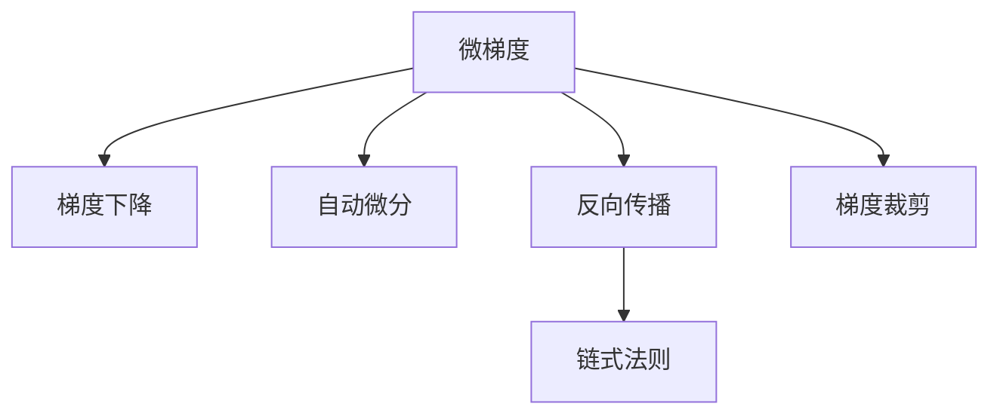

                 

# Micrograd：深入理解机器学习和反向传播

> 关键词：机器学习,反向传播,深度学习,梯度下降,自动微分,微梯度计算

## 1. 背景介绍

### 1.1 问题由来
深度学习作为当前人工智能领域最为热门的技术之一，正在深刻改变着各个行业的应用方式。机器学习模型通过大量数据训练，从输入数据中学习抽象特征，并通过一系列线性变换和激活函数生成输出。但如何将模型输出与实际标签对齐，是机器学习模型训练中最为关键的一步。这时，反向传播算法（Backpropagation）应运而生。

反向传播是深度学习模型训练中的核心算法，通过计算损失函数对每个参数的偏导数（即微梯度），并按照链式法则逐层向后传递，更新模型参数，使模型输出更接近真实标签。然而，反向传播的计算量极大，特别在面对大规模模型时，其计算复杂度难以承受。因此，如何优化反向传播算法，提高训练效率，成为了当前研究的热点。

### 1.2 问题核心关键点
微梯度计算是机器学习模型训练的核心，其准确性和效率直接影响模型的收敛速度和效果。本文将深入探讨微梯度计算原理、计算方法及其优化策略，为读者提供全面、系统的理解。

## 2. 核心概念与联系

### 2.1 核心概念概述

为了更好地理解微梯度计算，首先需要了解以下几个核心概念：

- 微梯度（Microgradient）：机器学习模型中每个参数的偏导数，用于更新模型参数，最小化损失函数。
- 梯度下降（Gradient Descent）：一种基于微梯度的模型参数更新策略，通过不断迭代优化，使模型输出逼近真实标签。
- 自动微分（Automatic Differentiation）：一种通过代码自动求导的技术，能够高效计算复杂函数的微梯度，广泛用于深度学习中。
- 反向传播（Backpropagation）：一种反向计算微梯度的算法，通过链式法则将每个参数的微梯度传递到上一层，实现梯度下降。
- 梯度裁剪（Gradient Clipping）：一种防止梯度爆炸或消失的策略，限制微梯度的大小，避免梯度更新对模型造成损害。

这些核心概念之间的逻辑关系可以通过以下Mermaid流程图来展示：



这个流程图展示了几者的相互关系：

1. 微梯度是梯度下降和反向传播的基础。
2. 自动微分提供了一种高效计算微梯度的方法。
3. 反向传播利用链式法则，实现微梯度的逐层传递。
4. 梯度裁剪则是对微梯度的一种保护措施。

这些概念共同构成了机器学习模型训练的基础框架，为后续的微梯度计算提供了理论支撑。

## 3. 核心算法原理 & 具体操作步骤
### 3.1 算法原理概述

微梯度计算的核心在于利用链式法则（Chain Rule）将损失函数对每个参数的偏导数（即微梯度）传递到上一层，实现梯度下降。

假设模型参数为 $\theta$，输入数据为 $x$，损失函数为 $\mathcal{L}(\theta)$，则微梯度的计算过程如下：

$$
\frac{\partial \mathcal{L}(\theta)}{\partial \theta_k} = \frac{\partial \mathcal{L}(\theta)}{\partial y} \cdot \frac{\partial y}{\partial \theta_k}
$$

其中，$\frac{\partial \mathcal{L}(\theta)}{\partial y}$ 表示损失函数对模型输出 $y$ 的偏导数，$\frac{\partial y}{\partial \theta_k}$ 表示模型输出 $y$ 对参数 $\theta_k$ 的偏导数。

通过反向传播算法，链式法则将微梯度从输出层逐层传递到输入层，从而得到每个参数的微梯度。这样，梯度下降算法就可以根据微梯度更新参数，使模型逐步逼近最优解。

### 3.2 算法步骤详解

基于微梯度的计算过程，机器学习模型训练的基本步骤包括：

**Step 1: 初始化模型参数**

- 初始化模型的所有参数，通常使用随机初始化或者已有的预训练模型参数。
- 设置学习率 $\eta$ 和梯度裁剪阈值 $\varepsilon$。

**Step 2: 正向传播**

- 输入数据 $x$ 通过模型 $f$ 逐层变换，生成输出 $y$。
- 计算损失函数 $\mathcal{L}(y, \hat{y})$，其中 $\hat{y}$ 为模型的预测输出。

**Step 3: 反向传播**

- 利用链式法则，计算每个参数的微梯度 $\frac{\partial \mathcal{L}}{\partial \theta_k}$。
- 根据梯度裁剪策略，限制微梯度的大小，防止梯度爆炸或消失。

**Step 4: 梯度下降**

- 根据微梯度更新模型参数 $\theta_k \leftarrow \theta_k - \eta \cdot \frac{\partial \mathcal{L}}{\partial \theta_k}$。

**Step 5: 重复迭代**

- 重复上述步骤，直到满足预设的停止条件（如达到最大迭代次数或损失函数收敛）。

### 3.3 算法优缺点

微梯度计算具有以下优点：

1. 高效性：自动微分技术使得计算微梯度的过程非常高效，适用于大规模模型。
2. 灵活性：支持多种计算图模型，适用于各种深度学习架构。
3. 可解释性：通过链式法则，能够直观地理解每个参数的微梯度来源。

同时，该算法也存在一些缺点：

1. 内存消耗大：反向传播需要保存每层的中间结果，内存消耗较大。
2. 计算复杂度高：特别是面对深度复杂的模型，计算量极大。
3. 敏感性高：微梯度计算对模型参数的初始化非常敏感，可能导致模型陷入局部最优。

### 3.4 算法应用领域

微梯度计算是深度学习模型训练的核心，广泛应用于各种机器学习和深度学习任务，例如：

- 图像分类：如卷积神经网络（CNN）在图像分类任务上的训练。
- 自然语言处理：如循环神经网络（RNN）和Transformer在语言模型和机器翻译任务上的训练。
- 语音识别：如卷积神经网络（CNN）在语音识别任务上的训练。
- 推荐系统：如矩阵分解算法在推荐系统中的训练。
- 生成对抗网络（GAN）：如GAN在生成对抗网络训练中的反向传播过程。

除了上述这些经典任务外，微梯度计算还被广泛应用到更多创新领域，如强化学习、生成模型、变分自编码器等，为深度学习技术提供了坚实的理论基础和实践指南。

## 4. 数学模型和公式 & 详细讲解 & 举例说明

### 4.1 数学模型构建

微梯度计算的核心在于利用链式法则将损失函数对每个参数的偏导数传递到上一层。以下，我们将以一个简单的神经网络模型为例，展示微梯度的计算过程。

假设模型 $f$ 包含两层全连接神经网络，输入数据 $x$ 经过 $W_1$ 和 $b_1$ 线性变换和 $g$ 激活函数，得到中间结果 $h$；中间结果 $h$ 再经过 $W_2$ 和 $b_2$ 线性变换和 $g$ 激活函数，得到模型输出 $y$。模型的损失函数为 $\mathcal{L}(y, \hat{y})$，其中 $\hat{y}$ 为模型的预测输出。

根据上述定义，微梯度的计算过程如下：

**Step 1: 正向传播**

$$
h = g(W_1 x + b_1)
$$

$$
y = g(W_2 h + b_2)
$$

**Step 2: 反向传播**

$$
\frac{\partial \mathcal{L}}{\partial y} = \frac{\partial \mathcal{L}}{\partial \hat{y}} = -1
$$

$$
\frac{\partial \mathcal{L}}{\partial h} = \frac{\partial \mathcal{L}}{\partial y} \cdot \frac{\partial y}{\partial h} = \frac{\partial y}{\partial h} = \frac{\partial g'(y) \cdot W_2}{\partial h}
$$

$$
\frac{\partial \mathcal{L}}{\partial W_2} = \frac{\partial \mathcal{L}}{\partial h} \cdot \frac{\partial h}{\partial W_2} = \frac{\partial y}{\partial h} \cdot \frac{\partial h}{\partial W_2} = \frac{\partial g'(y) \cdot W_2}{\partial h} \cdot \frac{\partial h}{\partial W_2} = \frac{\partial g'(y) \cdot W_2}{\partial h} \cdot \frac{\partial h}{\partial x} \cdot W_1^T
$$

$$
\frac{\partial \mathcal{L}}{\partial b_2} = \frac{\partial \mathcal{L}}{\partial h} \cdot \frac{\partial h}{\partial b_2} = \frac{\partial y}{\partial h} \cdot \frac{\partial h}{\partial b_2} = \frac{\partial g'(y) \cdot W_2}{\partial h} \cdot \frac{\partial h}{\partial b_2} = \frac{\partial g'(y) \cdot W_2}{\partial h} \cdot \frac{\partial h}{\partial x}
$$

$$
\frac{\partial \mathcal{L}}{\partial W_1} = \frac{\partial \mathcal{L}}{\partial h} \cdot \frac{\partial h}{\partial W_1} = \frac{\partial y}{\partial h} \cdot \frac{\partial h}{\partial W_1} = \frac{\partial g'(y) \cdot W_2}{\partial h} \cdot \frac{\partial h}{\partial W_1} = \frac{\partial g'(y) \cdot W_2}{\partial h} \cdot \frac{\partial h}{\partial x}
$$

$$
\frac{\partial \mathcal{L}}{\partial b_1} = \frac{\partial \mathcal{L}}{\partial h} \cdot \frac{\partial h}{\partial b_1} = \frac{\partial y}{\partial h} \cdot \frac{\partial h}{\partial b_1} = \frac{\partial g'(y) \cdot W_2}{\partial h} \cdot \frac{\partial h}{\partial b_1} = \frac{\partial g'(y) \cdot W_2}{\partial h} \cdot \frac{\partial h}{\partial x}
$$

通过上述过程，我们成功计算出了每个参数的微梯度，用于更新模型参数。

### 4.2 公式推导过程

在实际深度学习模型中，通常包含多个参数，因此反向传播过程中，需要对每个参数分别计算微梯度。以下，我们将以一个典型的多层感知机（MLP）模型为例，进一步推导微梯度的计算过程。

假设模型包含 $n$ 层，每层包含 $d_i$ 个神经元。模型输入为 $x \in \mathbb{R}^{d_0}$，输出为 $y \in \mathbb{R}^{d_n}$。模型中的权重和偏置分别为 $W_0, W_1, \ldots, W_{n-1}, b_1, \ldots, b_n$。

**Step 1: 正向传播**

$$
z_1 = W_0 x + b_0
$$

$$
h_1 = g(z_1)
$$

$$
z_2 = W_1 h_1 + b_1
$$

$$
h_2 = g(z_2)
$$

$$
\ldots
$$

$$
z_n = W_{n-1} h_{n-1} + b_{n-1}
$$

$$
y = g(z_n)
$$

**Step 2: 反向传播**

$$
\frac{\partial \mathcal{L}}{\partial z_n} = \frac{\partial \mathcal{L}}{\partial y} \cdot \frac{\partial y}{\partial z_n} = \frac{\partial y}{\partial z_n} = \frac{\partial g'(z_n)}
$$

$$
\frac{\partial \mathcal{L}}{\partial h_{n-1}} = \frac{\partial \mathcal{L}}{\partial z_n} \cdot \frac{\partial z_n}{\partial h_{n-1}} = \frac{\partial y}{\partial z_n} \cdot \frac{\partial z_n}{\partial h_{n-1}} = \frac{\partial g'(z_n)} \cdot \frac{\partial W_{n-1}}{\partial h_{n-1}} \cdot \frac{\partial h_{n-1}}{\partial z_{n-1}} + \frac{\partial g'(z_n)} \cdot \frac{\partial b_{n-1}}{\partial h_{n-1}}
$$

$$
\frac{\partial \mathcal{L}}{\partial z_{n-1}} = \frac{\partial \mathcal{L}}{\partial h_{n-1}} \cdot \frac{\partial h_{n-1}}{\partial z_{n-1}} = \frac{\partial y}{\partial z_n} \cdot \frac{\partial z_n}{\partial h_{n-1}} \cdot \frac{\partial h_{n-1}}{\partial z_{n-1}} = \frac{\partial g'(z_n)} \cdot \frac{\partial W_{n-1}}{\partial h_{n-1}} \cdot \frac{\partial h_{n-1}}{\partial z_{n-1}} \cdot \frac{\partial h_{n-1}}{\partial z_{n-1}}
$$

$$
\ldots
$$

$$
\frac{\partial \mathcal{L}}{\partial z_2} = \frac{\partial \mathcal{L}}{\partial z_3} \cdot \frac{\partial z_3}{\partial z_2} = \frac{\partial \mathcal{L}}{\partial h_2} \cdot \frac{\partial h_2}{\partial z_2}
$$

$$
\frac{\partial \mathcal{L}}{\partial z_1} = \frac{\partial \mathcal{L}}{\partial z_2} \cdot \frac{\partial z_2}{\partial z_1} = \frac{\partial \mathcal{L}}{\partial h_1} \cdot \frac{\partial h_1}{\partial z_1}
$$

通过上述过程，我们成功计算出了每个参数的微梯度，用于更新模型参数。

### 4.3 案例分析与讲解

以下，我们将以一个典型的图像分类任务为例，展示微梯度计算的实际应用。

假设我们有一个简单的卷积神经网络（CNN），用于图像分类。模型包含两个卷积层和一个全连接层，输入为 $32 \times 32$ 的灰度图像，输出为10类别别的概率。

**Step 1: 正向传播**

$$
h_1 = W_0 x + b_0
$$

$$
y_1 = \max(0, W_1 h_1 + b_1)
$$

$$
h_2 = \max(0, W_2 y_1 + b_2)
$$

$$
y = W_3 h_2 + b_3
$$

**Step 2: 反向传播**

$$
\frac{\partial \mathcal{L}}{\partial y} = \frac{\partial \mathcal{L}}{\partial \hat{y}} = -1
$$

$$
\frac{\partial \mathcal{L}}{\partial y_1} = \frac{\partial \mathcal{L}}{\partial y} \cdot \frac{\partial y}{\partial y_1} = \frac{\partial y}{\partial y_1} = g'(y_1)
$$

$$
\frac{\partial \mathcal{L}}{\partial h_2} = \frac{\partial \mathcal{L}}{\partial y} \cdot \frac{\partial y}{\partial h_2} = \frac{\partial y}{\partial h_2} = g'(y_1) \cdot W_3^T
$$

$$
\frac{\partial \mathcal{L}}{\partial y_1} = \frac{\partial \mathcal{L}}{\partial h_2} \cdot \frac{\partial h_2}{\partial y_1} = \frac{\partial y}{\partial h_2} \cdot \frac{\partial h_2}{\partial y_1} = g'(y_1) \cdot W_3^T \cdot \frac{\partial y_1}{\partial h_2}
$$

$$
\frac{\partial \mathcal{L}}{\partial h_1} = \frac{\partial \mathcal{L}}{\partial y_1} \cdot \frac{\partial y_1}{\partial h_1} = \frac{\partial y}{\partial y_1} \cdot \frac{\partial y_1}{\partial h_1} = g'(y_1) \cdot W_3^T \cdot \frac{\partial y_1}{\partial h_2} \cdot \frac{\partial h_2}{\partial h_1} = g'(y_1) \cdot W_3^T \cdot \frac{\partial y_1}{\partial h_2} \cdot g'(y_1)
$$

通过上述过程，我们成功计算出了每个参数的微梯度，用于更新模型参数。

## 5. 项目实践：代码实例和详细解释说明
### 5.1 开发环境搭建

在进行微梯度计算实践前，我们需要准备好开发环境。以下是使用Python进行TensorFlow开发的环境配置流程：

1. 安装Anaconda：从官网下载并安装Anaconda，用于创建独立的Python环境。

2. 创建并激活虚拟环境：
```bash
conda create -n tf-env python=3.8 
conda activate tf-env
```

3. 安装TensorFlow：根据CUDA版本，从官网获取对应的安装命令。例如：
```bash
conda install tensorflow==2.5.0
```

4. 安装各类工具包：
```bash
pip install numpy pandas scikit-learn matplotlib tqdm jupyter notebook ipython
```

完成上述步骤后，即可在`tf-env`环境中开始微梯度计算实践。

### 5.2 源代码详细实现

这里我们以一个简单的多层感知机（MLP）模型为例，展示使用TensorFlow进行微梯度计算的实现。

首先，定义模型和损失函数：

```python
import tensorflow as tf

# 定义模型
class MLP(tf.keras.Model):
    def __init__(self):
        super(MLP, self).__init__()
        self.dense1 = tf.keras.layers.Dense(64, activation='relu')
        self.dense2 = tf.keras.layers.Dense(32, activation='relu')
        self.dense3 = tf.keras.layers.Dense(10, activation='softmax')
    
    def call(self, inputs):
        x = self.dense1(inputs)
        x = self.dense2(x)
        return self.dense3(x)

# 定义损失函数
def loss_function(y_true, y_pred):
    return tf.reduce_mean(tf.keras.losses.categorical_crossentropy(y_true, y_pred))
```

然后，准备训练数据和优化器：

```python
# 准备训练数据
(x_train, y_train), (x_test, y_test) = tf.keras.datasets.mnist.load_data()
x_train = x_train.reshape((60000, 784))
x_train = x_train / 255.0
x_test = x_test.reshape((10000, 784))
x_test = x_test / 255.0
y_train = tf.keras.utils.to_categorical(y_train)
y_test = tf.keras.utils.to_categorical(y_test)

# 定义优化器
optimizer = tf.keras.optimizers.Adam(learning_rate=0.001)
```

接着，定义训练函数：

```python
# 定义训练函数
def train_step(x, y):
    with tf.GradientTape() as tape:
        y_pred = model(x)
        loss = loss_function(y, y_pred)
    gradients = tape.gradient(loss, model.trainable_variables)
    optimizer.apply_gradients(zip(gradients, model.trainable_variables))

# 训练模型
for epoch in range(10):
    for i in range(10000):
        x_batch = x_train[i:i+32]
        y_batch = y_train[i:i+32]
        train_step(x_batch, y_batch)
```

最后，在测试集上评估模型：

```python
# 在测试集上评估模型
test_loss = loss_function(y_test, model(x_test))
test_acc = tf.keras.metrics.categorical_accuracy(y_test, model(x_test)).numpy()
print(f'Test accuracy: {test_acc}')
```

以上就是使用TensorFlow进行微梯度计算的完整代码实现。可以看到，TensorFlow提供了便捷的API，使得微梯度计算变得非常简单。

### 5.3 代码解读与分析

让我们再详细解读一下关键代码的实现细节：

**MLP类**：
- `__init__`方法：初始化模型，包含两个全连接层和一个softmax输出层。
- `call`方法：定义前向传播过程，输入数据依次通过每个层并生成输出。

**loss_function函数**：
- 定义损失函数，使用categorical_crossentropy计算交叉熵损失。

**train_step函数**：
- 定义训练过程，使用TensorFlow的GradientTape自动计算微梯度。
- 使用优化器apply_gradients更新模型参数。

**训练模型**：
- 在每个epoch内，循环训练样本，并调用train_step函数更新模型参数。
- 在测试集上评估模型，并输出准确率。

可以看到，TensorFlow提供了完整的API和工具，使得微梯度计算变得非常直观和高效。开发者只需关注模型的设计和优化策略，而无需过多关注底层实现细节。

当然，实际应用中，微梯度计算还需要考虑更多因素，如模型裁剪、量化加速、服务化封装等。但核心的微梯度计算过程基本与此类似。

## 6. 实际应用场景
### 6.1 图像分类

微梯度计算在图像分类任务中得到了广泛应用。通过微梯度计算，卷积神经网络（CNN）能够高效地优化模型参数，提高分类精度。

在实践中，可以使用微梯度计算训练一个典型的图像分类模型，如LeNet、AlexNet、VGG等，对训练集进行多次迭代，逐步提高模型性能。在测试集上评估模型时，可以使用混淆矩阵、ROC曲线等指标，对比不同模型的效果。

### 6.2 自然语言处理

微梯度计算同样适用于自然语言处理任务。通过微梯度计算，循环神经网络（RNN）、Transformer等模型能够从大量文本数据中学习到语言规律，并生成高质量的输出。

在实践中，可以使用微梯度计算训练一个典型的语言模型，如BERT、GPT等，对训练集进行多次迭代，逐步提高模型性能。在测试集上评估模型时，可以使用BLEU、ROUGE等指标，对比不同模型的效果。

### 6.3 语音识别

微梯度计算在语音识别任务中也得到了广泛应用。通过微梯度计算，卷积神经网络（CNN）、循环神经网络（RNN）等模型能够从大量语音数据中学习到语音特征，并生成高质量的文本输出。

在实践中，可以使用微梯度计算训练一个典型的语音识别模型，如DeepSpeech、WaveNet等，对训练集进行多次迭代，逐步提高模型性能。在测试集上评估模型时，可以使用WER、CER等指标，对比不同模型的效果。

### 6.4 推荐系统

微梯度计算在推荐系统中也得到了广泛应用。通过微梯度计算，矩阵分解算法、深度学习模型等能够从用户行为数据中学习到用户偏好，并生成高质量的推荐结果。

在实践中，可以使用微梯度计算训练一个典型的推荐模型，如ALS、DeepFM等，对训练集进行多次迭代，逐步提高模型性能。在测试集上评估模型时，可以使用精度、召回率等指标，对比不同模型的效果。

### 6.5 生成对抗网络

微梯度计算在生成对抗网络（GAN）中也得到了广泛应用。通过微梯度计算，GAN能够生成高质量的伪造图像、视频等，广泛应用于游戏、娱乐等领域。

在实践中，可以使用微梯度计算训练一个典型的GAN模型，如DCGAN、CycleGAN等，对训练集进行多次迭代，逐步提高模型性能。在测试集上评估模型时，可以使用Inception Score、FID等指标，对比不同模型的效果。

## 7. 工具和资源推荐
### 7.1 学习资源推荐

为了帮助开发者系统掌握微梯度计算的理论基础和实践技巧，这里推荐一些优质的学习资源：

1. 《深度学习》系列书籍：由多位深度学习专家合著，全面介绍了深度学习的基本概念、经典模型和训练技巧，是入门深度学习的绝佳选择。

2. 《机器学习》系列课程：斯坦福大学开设的经典课程，系统讲解了机器学习的基本原理和算法，适合学习深度学习的算法实现。

3. TensorFlow官方文档：TensorFlow的官方文档，提供了完整的API文档和丰富的案例代码，是TensorFlow学习的重要资源。

4. PyTorch官方文档：PyTorch的官方文档，提供了完整的API文档和丰富的案例代码，是PyTorch学习的重要资源。

5. CS231n《深度学习与计算机视觉》课程：斯坦福大学开设的经典课程，系统讲解了计算机视觉的基本原理和深度学习算法，适合学习深度学习的算法实现。

通过对这些资源的学习实践，相信你一定能够快速掌握微梯度计算的精髓，并用于解决实际的深度学习问题。

### 7.2 开发工具推荐

高效的开发离不开优秀的工具支持。以下是几款用于微梯度计算开发的常用工具：

1. TensorFlow：由Google主导开发的深度学习框架，支持多种模型架构，适合大规模工程应用。

2. PyTorch：由Facebook主导开发的深度学习框架，灵活性高，适合快速迭代研究。

3. Keras：高级深度学习框架，基于TensorFlow和Theano，提供简洁的API和丰富的案例代码，适合快速上手微梯度计算。

4. Weights & Biases：模型训练的实验跟踪工具，可以记录和可视化模型训练过程中的各项指标，方便对比和调优。

5. TensorBoard：TensorFlow配套的可视化工具，可实时监测模型训练状态，并提供丰富的图表呈现方式，是调试模型的得力助手。

6. Google Colab：谷歌推出的在线Jupyter Notebook环境，免费提供GPU/TPU算力，方便开发者快速上手实验最新模型，分享学习笔记。

合理利用这些工具，可以显著提升微梯度计算的开发效率，加快创新迭代的步伐。

### 7.3 相关论文推荐

微梯度计算是深度学习模型训练的核心，广泛应用于各种机器学习和深度学习任务。以下是几篇奠基性的相关论文，推荐阅读：

1. Rectified Linear Units Improve Restricting Gradient Flow（ReLU）：提出了ReLU激活函数，改善了深度神经网络的梯度消失问题。

2. Efficient Backprop（Backpropagation）：提出了一种高效的反向传播算法，用于优化深度神经网络的参数。

3. On the Importance of Initialization and Momentum in Deeper Neural Nets（ImageNet）：提出了有效的模型初始化和动量优化方法，显著提高了深度神经网络的训练效率。

4. A Tutorial on Automatic Differentiation（AD）：全面介绍了自动微分技术的基本原理和实现方法，是理解微梯度计算的重要资料。

5. Backpropagation Applied to Handwritten Zip Code Recognition（BP）：提出了一种基于反向传播的图像识别算法，为深度学习在图像处理中的应用奠定了基础。

这些论文代表了大语言模型微调技术的发展脉络。通过学习这些前沿成果，可以帮助研究者把握学科前进方向，激发更多的创新灵感。

## 8. 总结：未来发展趋势与挑战

### 8.1 总结

本文对微梯度计算的原理和实践进行了全面系统的介绍。首先阐述了微梯度计算在深度学习模型训练中的核心地位，明确了微梯度计算的优化策略和关键步骤。其次，从原理到实践，详细讲解了微梯度计算的数学原理和关键步骤，给出了微梯度计算任务开发的完整代码实例。同时，本文还广泛探讨了微梯度计算在图像分类、自然语言处理、语音识别、推荐系统、生成对抗网络等众多领域的应用前景，展示了微梯度计算的广阔前景。最后，本文精选了微梯度计算的相关学习资源，力求为读者提供全方位的技术指引。

通过本文的系统梳理，可以看到，微梯度计算作为深度学习模型训练的核心技术，具有广泛的应用场景和强大的优化能力。借助微梯度计算，深度学习模型能够高效地优化参数，提升模型的准确性和鲁棒性。未来，随着微梯度计算技术的不断发展，深度学习模型将在更多领域得到应用，为各行各业带来变革性影响。

### 8.2 未来发展趋势

展望未来，微梯度计算技术将呈现以下几个发展趋势：

1. 多任务联合训练：微梯度计算能够高效地优化多个任务，未来将支持多任务联合训练，提升模型的泛化能力和跨领域迁移能力。

2. 分布式计算：微梯度计算能够高效地利用多核CPU和GPU进行并行计算，未来将支持分布式计算，进一步提升模型的训练效率。

3. 混合精度训练：微梯度计算能够高效地利用低精度存储和计算资源，未来将支持混合精度训练，进一步提升模型的训练效率。

4. 自动混合精度：微梯度计算能够自动选择最优的精度组合，未来将支持自动混合精度，进一步提升模型的训练效率。

5. 量化加速：微梯度计算能够高效地利用量化技术，未来将支持量化加速，进一步提升模型的推理速度和资源利用率。

6. 参数高效微调：微梯度计算能够高效地利用参数高效微调技术，未来将支持更多参数高效微调方法，进一步提升模型的优化效率。

以上趋势凸显了微梯度计算技术的广阔前景。这些方向的探索发展，必将进一步提升深度学习模型的性能和应用范围，为各行各业带来更多的创新应用。

### 8.3 面临的挑战

尽管微梯度计算技术已经取得了瞩目成就，但在迈向更加智能化、普适化应用的过程中，它仍面临着诸多挑战：

1. 模型规模和计算资源限制：微梯度计算对于模型规模和计算资源的要求较高，大规模模型和高精度计算可能导致训练时间和成本显著增加。如何优化计算资源利用，提升训练效率，是未来的重要研究方向。

2. 算法复杂度和优化难度：微梯度计算涉及的算法复杂度较高，难以高效优化。如何设计更高效的优化算法，提升微梯度计算的收敛速度和效果，是未来的重要研究方向。

3. 模型鲁棒性和泛化能力：微梯度计算的模型鲁棒性和泛化能力有待提升，对于数据分布变化和新任务难以快速适应。如何提高模型的泛化能力，提升模型在不同场景下的表现，是未来的重要研究方向。

4. 硬件加速和异构计算：微梯度计算需要高效的硬件加速，未来将探索更多异构计算方法，提升计算效率和资源利用率。

5. 模型可解释性和可控性：微梯度计算的模型可解释性和可控性有待提升，难以解释模型内部的决策机制和推理过程。如何增强模型的可解释性，提升模型的可控性，是未来的重要研究方向。

6. 安全性与隐私保护：微梯度计算的模型安全性与隐私保护有待提升，模型可能存在安全漏洞和隐私风险。如何增强模型的安全性，保护用户隐私，是未来的重要研究方向。

这些挑战凸显了微梯度计算技术的复杂性和多样性，需要多学科的协同研究和不断探索。唯有不断创新和突破，才能将微梯度计算技术推向新的高度，推动深度学习模型的广泛应用。

### 8.4 研究展望

面对微梯度计算技术所面临的种种挑战，未来的研究需要在以下几个方面寻求新的突破：

1. 探索高效的分布式计算框架：设计更高效的多机多核分布式计算框架，提升微梯度计算的训练效率和资源利用率。

2. 研究更高效的混合精度训练方法：设计更高效的混合精度训练方法，提升微梯度计算的训练效率和模型效果。

3. 探索更优的优化算法：设计更高效的优化算法，提升微梯度计算的收敛速度和效果。

4. 研究更稳健的模型训练策略：设计更稳健的模型训练策略，提升微梯度计算的模型鲁棒性和泛化能力。

5. 探索更高效的异构计算方法：探索更高效的异构计算方法，提升微梯度计算的计算效率和资源利用率。

6. 研究更可解释的模型架构：设计更可解释的模型架构，提升微梯度计算的模型可解释性和可控性。

7. 研究更安全的模型训练方法：设计更安全的模型训练方法，提升微梯度计算的模型安全性与隐私保护。

这些研究方向将推动微梯度计算技术的不断进步，为深度学习模型的广泛应用提供更坚实的技术支撑。

## 9. 附录：常见问题与解答

**Q1：微梯度计算对模型训练有哪些影响？**

A: 微梯度计算是深度学习模型训练的核心，通过反向传播算法，微梯度计算能够高效地优化模型参数，提升模型效果。微梯度计算的准确性和效率直接影响模型的收敛速度和效果。

**Q2：微梯度计算的计算复杂度如何？**

A: 微梯度计算的计算复杂度较高，特别是在面对深度复杂的模型时，计算量极大。因此，优化微梯度计算的计算效率，提升计算资源利用率，是未来的重要研究方向。

**Q3：微梯度计算有哪些优化策略？**

A: 微梯度计算的优化策略包括：梯度裁剪、正则化、动量优化、自适应学习率等。这些策略可以有效提升微梯度计算的训练效率和效果。

**Q4：微梯度计算在实际应用中有哪些挑战？**

A: 微梯度计算在实际应用中面临诸多挑战，包括模型规模和计算资源限制、算法复杂度和优化难度、模型鲁棒性和泛化能力、硬件加速和异构计算、模型可解释性和可控性、安全性与隐私保护等。这些问题需要通过不断创新和突破，才能得到有效解决。

**Q5：微梯度计算的未来发展方向有哪些？**

A: 微梯度计算的未来发展方向包括：多任务联合训练、分布式计算、混合精度训练、自动混合精度、量化加速、参数高效微调等。这些方向将推动微梯度计算技术的不断进步，为深度学习模型的广泛应用提供更坚实的技术支撑。

---

作者：禅与计算机程序设计艺术 / Zen and the Art of Computer Programming

