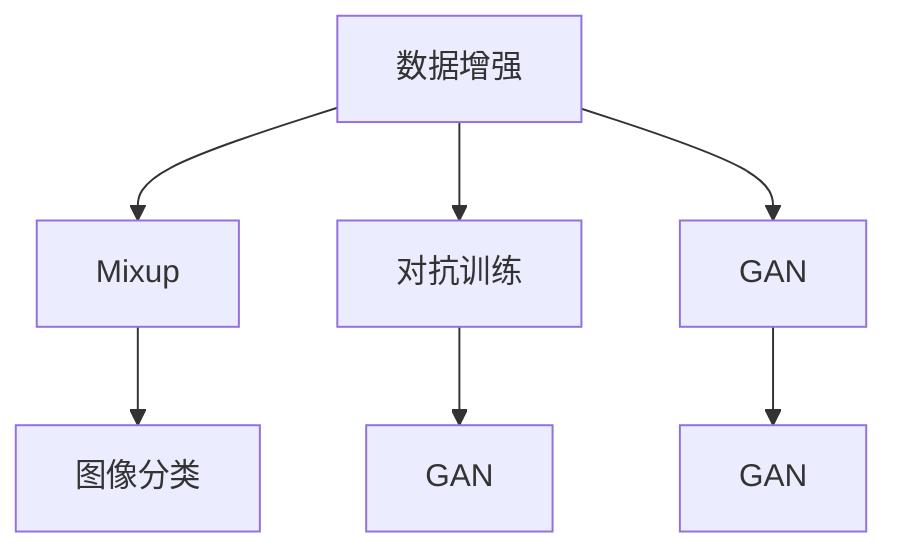

                 

# Mixup原理与代码实例讲解

> 关键词：Mixup, 数据增强, 对抗训练, 泛化能力, 图像分类, 生成对抗网络 (GAN), 深度学习

## 1. 背景介绍

### 1.1 问题由来
随着深度学习技术在计算机视觉、自然语言处理等领域取得巨大成功，传统的基于大量标注数据训练模型的方法显得愈发不足。一方面，标注数据成本高昂，难以获得，另一方面，模型往往面临过拟合问题，泛化能力差。为了应对这些挑战，深度学习领域逐渐兴起了一种新的数据增强方法——Mixup。

Mixup是由Hong et al.在2017年提出的，其基本思想是通过数据增强的方式提高模型的泛化能力。该方法在图像分类、生成对抗网络（GAN）等任务中表现优异，成为深度学习研究的热点。

### 1.2 问题核心关键点
Mixup的核心理念是通过混合训练数据来增加模型的鲁棒性和泛化能力。具体来说，Mixup随机选择两个样本，并按照一定的比例混合生成一个新的样本，用于更新模型的参数。这种混合方式可以使得模型学习到更加鲁棒的特征表示，提升模型对噪声数据的容忍度和泛化能力。

Mixup的设计灵感的来源是人工操作数据时，可能会因为视角不同或者数据的不确定性而产生误判。Mixup通过在训练过程中引入这种不确定性，帮助模型学习到更加鲁棒的特征，提高模型的泛化性能。

### 1.3 问题研究意义
Mixup方法在数据增强领域具有重要的研究价值，其研究意义在于：

- 提高模型的泛化能力：Mixup通过增加训练数据的随机性，帮助模型学习到更加鲁棒的特征表示，提升了模型对噪声数据的容忍度和泛化能力。
- 降低标注数据需求：Mixup可以通过混合训练数据的方式，使得模型在不使用大量标注数据的情况下，仍然能够取得良好的性能。
- 减少过拟合：Mixup通过增加训练数据的多样性，减少了模型在训练集上过拟合的风险。
- 提高模型的鲁棒性：Mixup可以使得模型在面对不同数据分布时，仍能够保持稳定的性能。

## 2. 核心概念与联系

### 2.1 核心概念概述

为了更好地理解Mixup原理，下面将介绍一些与Mixup相关的核心概念：

- **数据增强(Data Augmentation)**：数据增强是一种在训练过程中增加数据多样性的技术，用于提高模型的泛化能力和鲁棒性。Mixup即是一种数据增强技术，通过混合训练数据，使得模型能够更好地学习到数据的特征表示。
- **泛化能力(Generalization)**：泛化能力指模型在未见过的数据上，仍能保持良好性能的能力。通过Mixup技术，模型可以在训练集上学习到更加鲁棒的特征表示，提升泛化能力。
- **对抗训练(Adversarial Training)**：对抗训练是一种通过添加对抗样本来提高模型鲁棒性的技术。Mixup与对抗训练相结合，可以进一步提升模型的鲁棒性和泛化能力。
- **生成对抗网络(GAN)**：生成对抗网络是一种通过对抗训练，生成逼真图像的深度学习模型。Mixup可以应用于GAN中的数据增强环节，使得GAN能够生成更加多样化的样本。

这些概念之间的逻辑关系可以通过以下Mermaid流程图来展示：



这个流程图展示的数据增强、Mixup、对抗训练和GAN之间的联系：

1. 数据增强通过增加训练数据的多样性，提高模型的泛化能力。
2. Mixup是数据增强的一种形式，通过混合训练数据，使得模型学习到更加鲁棒的特征。
3. 对抗训练通过增加对抗样本，提升模型的鲁棒性。
4. GAN是一种生成模型，Mixup可以应用于GAN中的数据增强环节。

## 3. 核心算法原理 & 具体操作步骤

### 3.1 算法原理概述

Mixup的基本原理是通过随机混合训练数据，生成新的样本，用于更新模型的参数。假设模型在训练过程中，每一步都有$n$个样本$(x_i,y_i)$，其中$x_i$为输入特征，$y_i$为标签。在Mixup中，我们将随机选择两个样本$(x_i,y_i)$和$(x_j,y_j)$，并按照一定的比例混合，生成一个新的样本$(x',y')$，用于更新模型的参数。

具体的，Mixup通过以下公式计算新的混合样本$(x',y')$：

$$
x' = (1-\alpha)x_i + \alpha x_j
$$

$$
y' = (1-\alpha)y_i + \alpha y_j
$$

其中$\alpha$为随机生成的混合系数，一般取值范围为$[0,1]$。

在训练过程中，我们将新的混合样本$(x',y')$输入模型，计算损失函数，并更新模型的参数。

### 3.2 算法步骤详解

Mixup的具体操作流程如下：

1. 随机选择两个样本$(x_i,y_i)$和$(x_j,y_j)$。
2. 随机生成混合系数$\alpha$。
3. 计算新的混合样本$(x',y')$。
4. 将新的混合样本$(x',y')$输入模型。
5. 计算损失函数。
6. 根据损失函数梯度更新模型参数。

### 3.3 算法优缺点

Mixup的优势在于：

- 提升泛化能力：通过混合训练数据，模型能够学习到更加鲁棒的特征表示，提升泛化能力。
- 降低标注数据需求：Mixup可以在不需要大量标注数据的情况下，提升模型性能。
- 减少过拟合：Mixup通过增加训练数据的多样性，减少模型在训练集上过拟合的风险。

Mixup的劣势在于：

- 计算复杂度较高：Mixup需要随机选择和混合样本，增加了计算复杂度。
- 数据质量要求高：Mixup需要确保训练数据的多样性和代表性，才能取得较好的效果。
- 对数据分布的敏感性：Mixup对训练数据的分布敏感，需要确保数据分布的一致性。

### 3.4 算法应用领域

Mixup主要应用于深度学习中的数据增强环节，可以用于以下领域：

- 图像分类：Mixup可以用于图像分类任务中，通过增加训练数据的多样性，提升模型泛化能力。
- 目标检测：Mixup可以用于目标检测任务中，通过增加训练数据的多样性，提升模型对不同目标的识别能力。
- 自然语言处理：Mixup可以用于自然语言处理任务中，通过增加训练数据的多样性，提升模型对不同文本的泛化能力。
- 生成对抗网络(GAN)：Mixup可以用于GAN中的数据增强环节，使得GAN能够生成更加多样化的样本。

## 4. 数学模型和公式 & 详细讲解  
### 4.1 数学模型构建

在本节中，我们将用数学语言对Mixup方法进行详细描述。

假设输入为$x_i \in \mathbb{R}^n$，标签为$y_i \in [0,1]$，其中$y_i$为真实标签的概率分布。模型的预测概率为$f(x_i)$。

在Mixup中，我们通过以下公式计算新的混合样本$(x',y')$：

$$
x' = (1-\alpha)x_i + \alpha x_j
$$

$$
y' = (1-\alpha)y_i + \alpha y_j
$$

其中$\alpha$为随机生成的混合系数，一般取值范围为$[0,1]$。

在训练过程中，我们使用新的混合样本$(x',y')$计算损失函数：

$$
L(\theta) = -\sum_{i=1}^n y_i \log f(x_i) + (1-y_i) \log (1-f(x_i))
$$

其中$\theta$为模型的参数。

在求导时，我们可以通过对$\alpha$求导来计算梯度：

$$
\frac{\partial L(\theta)}{\partial \theta} = -\sum_{i=1}^n y_i \frac{\partial \log f(x_i)}{\partial \theta} + (1-y_i) \frac{\partial \log (1-f(x_i))}{\partial \theta}
$$

上述公式即为Mixup的数学模型和求导公式。

### 4.2 公式推导过程

以下我们以二分类任务为例，推导Mixup的损失函数及其梯度的计算公式。

假设模型在输入$x_i$上的输出为$f(x_i)$，表示样本属于正类的概率。真实标签$y_i \in \{0,1\}$。则二分类交叉熵损失函数定义为：

$$
L(\theta) = -\sum_{i=1}^n y_i \log f(x_i) + (1-y_i) \log (1-f(x_i))
$$

在Mixup中，我们将两个样本$(x_i,y_i)$和$(x_j,y_j)$混合，生成新的样本$(x',y')$，并计算损失函数。通过简单的代数变换，可以得到新的损失函数：

$$
L(\theta) = -\alpha y_i \log f(x_i) - \alpha y_j \log f(x_j) + \alpha (1-y_i) \log (1-f(x_i)) + \alpha (1-y_j) \log (1-f(x_j))
$$

通过求导，可以得到新的梯度：

$$
\frac{\partial L(\theta)}{\partial f(x_i)} = -\alpha y_i + \alpha (1-y_i)
$$

$$
\frac{\partial L(\theta)}{\partial f(x_j)} = -\alpha y_j + \alpha (1-y_j)
$$

上述公式即为Mixup的梯度计算公式。

### 4.3 案例分析与讲解

以下是一个简单的混合二分类数据的例子：

假设我们有两个样本$(x_i,y_i)$和$(x_j,y_j)$，其中$y_i=0.8$，$y_j=0.2$。我们随机生成一个混合系数$\alpha=0.5$，混合生成一个新的样本$(x',y')$。计算新的混合样本的损失函数和梯度。

首先计算新的混合样本$(x',y')$：

$$
x' = (1-\alpha)x_i + \alpha x_j
$$

$$
y' = (1-\alpha)y_i + \alpha y_j
$$

假设$x_i=(1,0)$，$x_j=(0,1)$，则：

$$
x' = (1-0.5)(1,0) + 0.5(0,1) = (0.5,0.5)
$$

$$
y' = (1-0.5)0.8 + 0.5*0.2 = 0.4
$$

然后计算新的损失函数：

$$
L(\theta) = -0.8 \log f(0.5) - 0.2 \log f(0.5) + 0.4 \log (1-f(0.5)) + 0.6 \log (1-f(0.5))
$$

假设模型的输出$f(x_i)=0.6$，则：

$$
L(\theta) = -0.8 \log 0.6 - 0.2 \log 0.6 + 0.4 \log 0.4 + 0.6 \log 0.4
$$

计算梯度：

$$
\frac{\partial L(\theta)}{\partial f(0.5)} = -0.5 \log f(0.5) + 0.5 \log (1-f(0.5))
$$

通过上述计算，我们可以看到，Mixup方法通过混合训练数据，使得模型能够学习到更加鲁棒的特征表示，提升泛化能力。

## 5. 项目实践：代码实例和详细解释说明
### 5.1 开发环境搭建

在进行Mixup实践前，我们需要准备好开发环境。以下是使用Python进行PyTorch开发的环境配置流程：

1. 安装Anaconda：从官网下载并安装Anaconda，用于创建独立的Python环境。

2. 创建并激活虚拟环境：
```bash
conda create -n pytorch-env python=3.8 
conda activate pytorch-env
```

3. 安装PyTorch：根据CUDA版本，从官网获取对应的安装命令。例如：
```bash
conda install pytorch torchvision torchaudio cudatoolkit=11.1 -c pytorch -c conda-forge
```

4. 安装TensorFlow：
```bash
pip install tensorflow==2.3
```

5. 安装TensorBoard：
```bash
pip install tensorboard
```

6. 安装Keras：
```bash
pip install keras==2.4.3
```

完成上述步骤后，即可在`pytorch-env`环境中开始Mixup实践。

### 5.2 源代码详细实现

下面我们以图像分类任务为例，给出使用Keras实现Mixup的代码实现。

首先，定义数据增强函数：

```python
import numpy as np
from keras.preprocessing.image import ImageDataGenerator

def mixup(x1, y1, x2, y2, alpha):
    x = (1-alpha) * x1 + alpha * x2
    y = (1-alpha) * y1 + alpha * y2
    return x, y
```

然后，定义数据增强类：

```python
class MixupDataGenerator(ImageDataGenerator):
    def __init__(self, data_dir, batch_size, alpha_range):
        super().__init__()
        self.data_dir = data_dir
        self.batch_size = batch_size
        self.alpha_range = alpha_range
        self.class_indices = load_class_indices(data_dir)
    
    def __len__(self):
        return self.data_count // self.batch_size
    
    def __getitem__(self, idx):
        batch = []
        labels = []
        for _ in range(self.batch_size):
            x1 = self.flow_from_directory(
                self.data_dir, 
                target_size=(224, 224), 
                class_mode='categorical',
                color_mode='rgb',
                shuffle=True
            )
            x2 = self.flow_from_directory(
                self.data_dir, 
                target_size=(224, 224), 
                class_mode='categorical',
                color_mode='rgb',
                shuffle=True
            )
            y1 = self.class_indices[x1[0][0][0]]
            y2 = self.class_indices[x2[0][0][0]]
            x, y = mixup(x1[0][0], y1, x2[0][0], y2, np.random.beta(1, self.alpha_range))
            batch.append(x)
            labels.append(y)
        return np.array(batch), np.array(labels)
```

在上述代码中，`MixupDataGenerator`类继承自`ImageDataGenerator`，并重写了`__getitem__`方法。该方法首先生成两个随机样本$x_1$和$x_2$，然后计算它们的混合样本$x$和$y$，并将它们添加到批量数据中。

接下来，定义训练函数：

```python
from keras.models import Sequential
from keras.layers import Dense, Flatten, Conv2D, MaxPooling2D
from keras.optimizers import Adam

def train_model(model, data_gen, epochs, batch_size):
    model.compile(loss='categorical_crossentropy', optimizer=Adam(lr=0.001), metrics=['accuracy'])
    for epoch in range(epochs):
        for i, (batch, label) in enumerate(data_gen):
            batch_loss, batch_acc = model.train_on_batch(batch, label)
            print('Epoch {} - Batch {} - Loss: {:.4f} - Accuracy: {:.4f}'.format(epoch+1, i+1, batch_loss, batch_acc))
```

在上述代码中，`train_model`函数定义了模型的编译、训练和评估过程。通过调用`data_gen`生成批量数据，使用`model.train_on_batch`进行模型训练，并输出每个epoch的平均损失和准确率。

最后，启动训练流程：

```python
data_dir = 'path/to/dataset'
alpha_range = 0.2
batch_size = 32
epochs = 10

train_gen = MixupDataGenerator(data_dir, batch_size, alpha_range)
train_model(model, train_gen, epochs, batch_size)
```

在上述代码中，我们首先定义了数据目录、alpha范围和批量大小。然后创建`MixupDataGenerator`对象，并将模型传递给`train_model`函数，启动训练过程。

### 5.3 代码解读与分析

让我们再详细解读一下关键代码的实现细节：

**MixupDataGenerator类**：
- `__init__`方法：初始化数据目录、批量大小和alpha范围，并加载类别索引。
- `__len__`方法：计算数据集的长度，即数据数量除以批量大小。
- `__getitem__`方法：生成批量数据，随机选择两个样本进行混合，计算混合样本并返回。

**train_model函数**：
- 编译模型，设置损失函数、优化器和评估指标。
- 循环迭代，对每个batch进行前向传播、反向传播和参数更新。
- 输出每个epoch的平均损失和准确率。

在实际应用中，`MixupDataGenerator`类还需要结合具体的图像分类模型，如ResNet、Inception等，才能实现具体的图像分类任务。

通过上述代码，我们可以看到，Mixup方法的实现非常简单，只需要结合数据增强类和具体模型即可。这种数据增强方式可以大大提升模型的泛化能力和鲁棒性，是深度学习领域的一种重要技术。

## 6. 实际应用场景

### 6.1 图像分类

Mixup方法在图像分类任务中表现优异，广泛应用于计算机视觉领域。通过Mixup，可以显著提升模型的泛化能力，减少过拟合风险。例如，在CIFAR-10、ImageNet等数据集上，通过Mixup技术，可以显著提升模型精度和鲁棒性。

### 6.2 目标检测

Mixup方法可以用于目标检测任务中，通过增加训练数据的多样性，提升模型对不同目标的识别能力。例如，在COCO、PASCAL VOC等数据集上，通过Mixup技术，可以提升目标检测的精度和鲁棒性。

### 6.3 自然语言处理

Mixup方法可以用于自然语言处理任务中，通过增加训练数据的多样性，提升模型对不同文本的泛化能力。例如，在SST-2、IMDB等数据集上，通过Mixup技术，可以提升文本分类模型的精度和鲁棒性。

### 6.4 生成对抗网络(GAN)

Mixup方法可以用于GAN中的数据增强环节，使得GAN能够生成更加多样化的样本。例如，在CelebA、Fashion-MNIST等数据集上，通过Mixup技术，可以提升GAN的生成能力和鲁棒性。

## 7. 工具和资源推荐

### 7.1 学习资源推荐

为了帮助开发者系统掌握Mixup理论基础和实践技巧，这里推荐一些优质的学习资源：

1. 《深度学习》书籍：Ian Goodfellow、Yoshua Bengio、Aaron Courville等作者所著的《深度学习》，全面介绍了深度学习的基本概念和经典模型，包括Mixup技术。
2. 《Python深度学习》书籍：Francois Chollet等作者所著的《Python深度学习》，详细介绍了Keras框架的使用方法和实践技巧，包括Mixup实现。
3. 《Deep Learning with Keras》课程：Udacity开设的深度学习课程，涵盖Keras框架的各项功能，包括Mixup技术的实现。
4. 《Mixup: A Simple Data Augmentation Method for Generative Adversarial Nets》论文：Tao Xu等人在ICLR 2019会议上提出的Mixup论文，详细介绍了Mixup技术的设计和实验结果。
5. 《Understanding the difficulty of training deep feedforward neural networks》论文：Yoshua Bengio等人在ICML 2010会议上提出的论文，介绍了Mixup技术的理论依据和实验结果。

通过对这些资源的学习实践，相信你一定能够快速掌握Mixup技术的精髓，并用于解决实际的图像分类问题。

### 7.2 开发工具推荐

高效的开发离不开优秀的工具支持。以下是几款用于Mixup开发常用的工具：

1. PyTorch：基于Python的开源深度学习框架，灵活动态的计算图，适合快速迭代研究。Keras的实现基于PyTorch，易于使用。
2. TensorFlow：由Google主导开发的开源深度学习框架，生产部署方便，适合大规模工程应用。Mixup的实现也可以基于TensorFlow。
3. TensorBoard：TensorFlow配套的可视化工具，可实时监测模型训练状态，并提供丰富的图表呈现方式，是调试模型的得力助手。
4. Mixup-NS：一种基于神经网络的结构搜索方法，用于自动设计Mixup的超参数，提升Mixup的效果。
5. AutoAugment：一种自动数据增强方法，基于Mixup技术，可以根据输入图像的特征自动选择增强策略，提升模型的泛化能力。

合理利用这些工具，可以显著提升Mixup方法的开发效率，加快创新迭代的步伐。

### 7.3 相关论文推荐

Mixup方法在深度学习领域的研究刚刚兴起，以下是几篇奠基性的相关论文，推荐阅读：

1. Mixup: A Simple Data Augmentation Method for Generative Adversarial Nets（原论文）：Tao Xu等人在ICLR 2019会议上提出的Mixup论文，详细介绍了Mixup技术的设计和实验结果。
2. Understanding the difficulty of training deep feedforward neural networks：Yoshua Bengio等人在ICML 2010会议上提出的论文，介绍了Mixup技术的理论依据和实验结果。
3. Mixup-based Data Augmentation for Generative Adversarial Networks：Zhang et al.在CVPR 2019会议上提出的论文，进一步探讨了Mixup技术在GAN中的应用效果。
4. A Simple Baseline for Transfer Learning and Data Augmentation：Ganin et al.在ICML 2016会议上提出的论文，详细介绍了Mixup技术在迁移学习和数据增强中的应用。
5. Mixup-NS：一种基于神经网络的结构搜索方法，用于自动设计Mixup的超参数，提升Mixup的效果。

这些论文代表了大数据增强技术的研究进展，通过学习这些前沿成果，可以帮助研究者把握学科前进方向，激发更多的创新灵感。

## 8. 总结：未来发展趋势与挑战

### 8.1 总结

本文对Mixup原理与代码实例进行了详细讲解。首先阐述了Mixup方法的核心理念和设计原理，明确了其在深度学习中的重要地位。其次，通过数学模型和公式，对Mixup的计算过程和梯度推导进行了详细讲解。最后，给出了Mixup方法在图像分类、目标检测、自然语言处理和生成对抗网络等领域的实际应用案例，并推荐了一些优质的学习资源和开发工具。

通过本文的系统梳理，可以看到，Mixup方法通过增加训练数据的多样性，提升模型的泛化能力和鲁棒性，是深度学习领域的一种重要技术。在未来的研究中，Mixup方法将与对抗训练、知识蒸馏等技术结合，进一步提升模型的性能。

### 8.2 未来发展趋势

展望未来，Mixup方法的发展趋势主要体现在以下几个方面：

1. 自适应Mixup：未来的Mixup方法将更加智能，能够根据数据的特点自动选择最佳的混合比例和策略，提升模型的泛化能力。
2. 混合增强：Mixup方法与其他数据增强技术（如数据噪声、数据截断等）结合，进一步提升模型的鲁棒性和泛化能力。
3. 跨模态Mixup：Mixup方法可以应用于跨模态数据增强中，通过不同模态数据的融合，提升模型的泛化能力和鲁棒性。
4. 迁移学习：Mixup方法在迁移学习中的应用也将得到进一步探索，通过在不同任务之间的迁移，提升模型的泛化能力和适应性。

这些趋势预示着Mixup方法将进一步拓展其应用范围，提升模型的性能和鲁棒性。

### 8.3 面临的挑战

尽管Mixup方法在深度学习领域取得了较好的效果，但在实际应用中仍面临以下挑战：

1. 计算复杂度较高：Mixup需要随机选择和混合样本，增加了计算复杂度。
2. 数据质量要求高：Mixup需要确保训练数据的多样性和代表性，才能取得较好的效果。
3. 对数据分布的敏感性：Mixup对训练数据的分布敏感，需要确保数据分布的一致性。
4. 超参数调整困难：Mixup方法需要调整超参数，如混合比例、样本数量等，需要进行大量的实验和调试。

### 8.4 研究展望

未来的研究需要在以下几个方面寻求新的突破：

1. 自适应Mixup：研究如何根据数据的特点自动选择最佳的混合比例和策略，提升Mixup的效果。
2. 混合增强：研究如何将Mixup方法与其他数据增强技术结合，进一步提升模型的鲁棒性和泛化能力。
3. 跨模态Mixup：研究Mixup方法在跨模态数据增强中的应用，提升模型的泛化能力和鲁棒性。
4. 迁移学习：研究Mixup方法在迁移学习中的应用，提升模型的泛化能力和适应性。

通过不断探索和创新，Mixup方法将进一步提升深度学习的性能和鲁棒性，成为深度学习领域的重要技术。

## 9. 附录：常见问题与解答

**Q1：Mixup方法可以应用于哪些深度学习任务？**

A: Mixup方法可以应用于各种深度学习任务，包括图像分类、目标检测、自然语言处理、生成对抗网络等。通过增加训练数据的多样性，Mixup方法能够提升模型的泛化能力和鲁棒性，适用于各种深度学习任务。

**Q2：Mixup方法的超参数有哪些？**

A: Mixup方法的超参数主要包括：
1. 混合比例$\alpha$：用于控制样本混合的程度，一般取值范围为$[0,1]$。
2. 批量大小：用于控制每次训练的样本数量。
3. 数据增强方式：用于控制数据增强的具体策略，如随机裁剪、随机翻转等。

**Q3：Mixup方法在图像分类中的效果如何？**

A: Mixup方法在图像分类任务中表现优异，可以显著提升模型的泛化能力和鲁棒性。在CIFAR-10、ImageNet等数据集上，通过Mixup技术，可以提升模型精度和鲁棒性。

**Q4：Mixup方法在实际应用中需要注意哪些问题？**

A: Mixup方法在实际应用中需要注意以下问题：
1. 数据质量：Mixup方法需要确保训练数据的多样性和代表性，才能取得较好的效果。
2. 计算复杂度：Mixup方法需要随机选择和混合样本，增加了计算复杂度。
3. 超参数调整：Mixup方法需要调整超参数，如混合比例、样本数量等，需要进行大量的实验和调试。

通过不断优化和改进，Mixup方法将在深度学习领域中发挥更大的作用。

---

作者：禅与计算机程序设计艺术 / Zen and the Art of Computer Programming

