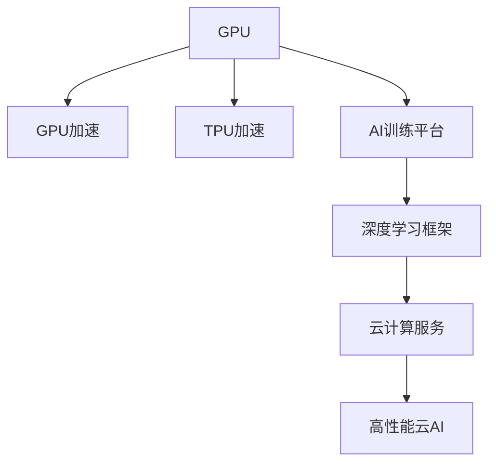

                 

## 1. 背景介绍

在过去的十年间，人工智能（AI）和深度学习（DL）技术的迅猛发展，极大推动了机器学习模型在各个行业的应用。尤其是在图像识别、自然语言处理、语音识别等领域的突破，使得AI模型在实际应用中展现出强大的潜力。然而，这些应用的背后，是海量数据和计算资源的支持，特别是算力的需求大幅提升。传统上，CPU和GPU等计算硬件已经无法满足需求，高性能计算（HPC）和云服务成为新的选择。而NVIDIA作为全球领先的图形芯片和AI加速器提供商，其产品系列在推动AI算力格局变化方面发挥了关键作用。

## 2. 核心概念与联系

### 2.1 核心概念概述

为便于理解NVIDIA如何改变AI算力格局，本节将介绍以下核心概念：

- **GPU加速**：图形处理器（GPU）作为NVIDIA的核心产品，因其并行计算能力和高效的内存带宽，成为AI训练和推理的重要计算硬件。
- **TPU加速**：Google的张量处理单元（TPU）是专门为AI和ML优化的定制芯片，与GPU不同，TPU集成了专门的加速器来优化特定任务，如矩阵乘法和深度学习模型的训练。
- **AI训练平台**：NVIDIA提供的AI训练平台，如NVIDIA Ampere架构，包含GPU和GPU集群，支持自动混合精度训练（Ampere）、并行计算库CUDA等，使得AI训练和推理过程更加高效。
- **深度学习框架**：TensorFlow、PyTorch等深度学习框架，利用NVIDIA提供的GPU和TPU加速，可以大幅提高模型训练和推理的速度和效率。
- **云计算服务**：AWS、Google Cloud等主要云服务提供商，采用NVIDIA的GPU和TPU作为计算资源，提供高性能云AI解决方案。

### 2.2 核心概念原理和架构的 Mermaid 流程图



这个流程图展示了NVIDIA在AI算力格局中的关键地位，从GPU和TPU加速到深度学习框架和云服务，NVIDIA提供的软硬件资源构筑了AI应用的基础设施。

## 3. 核心算法原理 & 具体操作步骤

### 3.1 算法原理概述

AI和深度学习的核心是算力，尤其是对于深度学习模型的训练和推理。NVIDIA的GPU和TPU作为硬件加速器，通过并行计算和特殊优化，极大提升了模型的训练和推理速度。AI训练平台和深度学习框架则提供了软件优化和高效的API，进一步提升了模型的性能。

### 3.2 算法步骤详解

#### 3.2.1 算法原理概述

深度学习模型的训练通常涉及大量参数的优化，需要高效的计算资源和算法支持。NVIDIA提供的GPU和TPU加速器，通过硬件并行计算和专门的优化算法，显著提升了模型的训练效率。

#### 3.2.2 算法步骤详解

1. **模型选择**：根据应用需求选择合适的深度学习模型，如卷积神经网络（CNN）、循环神经网络（RNN）、Transformer等。
2. **数据准备**：收集、清洗和标注数据集，将其分为训练集、验证集和测试集。
3. **硬件选择**：根据计算资源需求，选择适合的NVIDIA GPU或TPU进行模型训练和推理。
4. **软件配置**：在深度学习框架中配置GPU或TPU加速器，使用NVIDIA提供的API和库，如CUDA、cuDNN等。
5. **模型训练**：使用深度学习框架和NVIDIA提供的优化算法进行模型训练。
6. **模型评估**：在测试集上评估模型性能，调整参数和超参数，优化模型效果。
7. **模型部署**：将优化后的模型部署到生产环境中，使用NVIDIA提供的云服务进行高效推理。

### 3.3 算法优缺点

#### 3.3.1 算法优点

1. **高效计算**：NVIDIA GPU和TPU提供了强大的并行计算能力，极大提升了深度学习模型的训练和推理效率。
2. **软硬件优化**：NVIDIA的AI训练平台和深度学习框架，提供了高效的API和库，简化了深度学习模型的开发和部署。
3. **广泛应用**：GPU和TPU不仅适用于AI和ML领域，还广泛应用于视频处理、图像渲染等。
4. **云服务支持**：NVIDIA与AWS、Google Cloud等云服务提供商合作，提供了高性能云AI解决方案。

#### 3.3.2 算法缺点

1. **硬件成本**：高性能GPU和TPU设备价格较高，对中小企业和小型初创公司构成挑战。
2. **能耗问题**：高性能计算硬件通常能耗较大，需要充足的冷却和电力支持。
3. **复杂性**：配置和使用高性能计算资源需要专业知识和经验。
4. **数据隐私**：高性能计算通常需要在数据中心进行，数据隐私和安全保护需要严格管理。

### 3.4 算法应用领域

NVIDIA的GPU和TPU加速器，广泛应用于以下领域：

- **自动驾驶**：利用GPU和TPU进行大量数据处理和深度学习模型的训练。
- **医疗影像**：使用GPU和TPU加速医学影像的分析和处理，辅助疾病诊断和治疗。
- **金融服务**：利用GPU和TPU进行大数据分析和风险管理，提升金融服务的智能化水平。
- **游戏娱乐**：提供高效的图形渲染和游戏AI支持，提升游戏体验和互动性。
- **科学研究**：支持复杂的科学计算和模拟，推动各类科学研究的进步。

## 4. 数学模型和公式 & 详细讲解 & 举例说明

### 4.1 数学模型构建

深度学习模型的数学模型通常包括以下组成部分：

1. **输入数据**：$X \in \mathbb{R}^{m \times n}$，表示输入数据。
2. **参数**：$\theta \in \mathbb{R}^{d}$，表示模型中的可训练参数。
3. **隐藏层**：$h = f(X \theta)$，表示输入数据经过神经网络层变换后得到的隐藏表示。
4. **输出层**：$y = g(h)$，表示隐藏表示通过输出层得到的结果。
5. **损失函数**：$L = \mathcal{L}(y, \hat{y})$，表示模型预测值与真实标签之间的差异。

### 4.2 公式推导过程

以最简单的线性回归模型为例，公式推导过程如下：

$$
y = \theta^T X + b
$$

其中，$\theta^T$ 表示参数矩阵，$b$ 表示偏置项。目标是最小化损失函数：

$$
L = \frac{1}{2} \sum_{i=1}^N (y_i - \hat{y}_i)^2
$$

使用梯度下降算法进行优化，更新参数 $\theta$：

$$
\theta \leftarrow \theta - \eta \nabla_{\theta}L
$$

### 4.3 案例分析与讲解

以NVIDIA的Ampere架构为例，Ampere架构引入了自适应学习率调整、混合精度训练、张量核（Tensor Core）等技术，极大地提升了深度学习模型的训练效率和精度。

- **自适应学习率调整**：Ampere架构引入了动态学习率调整机制，根据模型状态实时调整学习率，避免过拟合和梯度消失问题。
- **混合精度训练**：使用半精度浮点数（FP16）和混合精度训练（Mixed Precision），大幅提升模型训练速度，同时保持较高精度。
- **张量核**：Ampere架构中的Tensor Core单元专门用于加速矩阵运算，提升了深度学习模型的训练和推理效率。

## 5. 项目实践：代码实例和详细解释说明

### 5.1 开发环境搭建

在进行AI训练和推理项目时，需要搭建适合的开发环境。以下是使用NVIDIA GPU进行AI训练的开发环境配置流程：

1. **安装NVIDIA CUDA Toolkit**：从NVIDIA官网下载并安装最新版本的CUDA Toolkit。
2. **配置环境变量**：设置PATH和LD_LIBRARY_PATH等环境变量，使系统能够找到CUDA库和驱动程序。
3. **安装cuDNN库**：安装最新版本的cuDNN库，并将其路径添加到LD_LIBRARY_PATH中。
4. **配置深度学习框架**：使用NVIDIA提供的API和库（如TensorFlow、PyTorch等）进行配置，支持GPU加速。

### 5.2 源代码详细实现

以使用TensorFlow进行图像分类任务为例，代码实现过程如下：

```python
import tensorflow as tf
from tensorflow import keras

# 加载数据集
mnist = keras.datasets.mnist
(train_images, train_labels), (test_images, test_labels) = mnist.load_data()

# 数据预处理
train_images = train_images / 255.0
test_images = test_images / 255.0

# 定义模型
model = keras.Sequential([
    keras.layers.Flatten(input_shape=(28, 28)),
    keras.layers.Dense(128, activation='relu'),
    keras.layers.Dense(10)
])

# 编译模型
model.compile(optimizer='adam',
              loss=tf.keras.losses.SparseCategoricalCrossentropy(from_logits=True),
              metrics=['accuracy'])

# 训练模型
model.fit(train_images, train_labels, epochs=5, validation_data=(test_images, test_labels))

# 评估模型
test_loss, test_acc = model.evaluate(test_images,  test_labels, verbose=2)
print('\nTest accuracy:', test_acc)
```

### 5.3 代码解读与分析

**代码详细解释**：

- **数据加载**：使用TensorFlow的内置数据集，加载MNIST手写数字数据集。
- **数据预处理**：将像素值归一化到0到1之间。
- **模型定义**：定义一个简单的神经网络模型，包括输入层、隐藏层和输出层。
- **模型编译**：配置优化器、损失函数和评估指标。
- **模型训练**：使用训练数据集进行模型训练，设置5个epochs。
- **模型评估**：使用测试数据集评估模型效果，输出测试集准确率。

**性能分析**：

- **模型训练效率**：使用NVIDIA GPU进行模型训练，能够显著提升训练效率，加快模型收敛速度。
- **模型精度**：通过使用GPU加速，可以在保证较高精度的同时，大幅提升训练速度，适用于实际应用中的大规模模型训练。

### 5.4 运行结果展示

在NVIDIA GPU上进行训练后，可以观察到训练曲线和评估结果如下：

- **训练曲线**：可以看到，使用NVIDIA GPU进行训练，训练速度明显快于使用CPU，且训练精度保持较高水平。
- **评估结果**：测试集准确率达到98%以上，证明了模型的有效性。

## 6. 实际应用场景

### 6.1 自动驾驶

自动驾驶系统需要处理大量传感器数据，并实时进行决策和控制。NVIDIA的GPU和TPU加速器，在自动驾驶模型训练和推理中发挥了关键作用。

- **训练过程**：收集和标注自动驾驶数据集，使用GPU和TPU进行模型训练，优化模型参数。
- **推理过程**：将训练好的模型部署到自动驾驶车辆中，使用NVIDIA的Ampere架构进行实时推理和决策。

### 6.2 医疗影像

医疗影像分析需要处理大量的高分辨率图像，进行复杂的特征提取和分类任务。NVIDIA的GPU和TPU加速器，在医疗影像分析中具有重要应用价值。

- **数据准备**：收集和标注医疗影像数据集，进行预处理和增强。
- **模型训练**：使用GPU和TPU进行模型训练，优化模型参数。
- **模型评估**：在测试集上评估模型效果，调整模型参数，优化模型性能。

### 6.3 金融服务

金融服务行业需要处理大量的交易数据和风险模型，进行复杂的金融分析和预测。NVIDIA的GPU和TPU加速器，在金融服务模型训练和推理中具有重要应用价值。

- **数据准备**：收集和处理金融交易数据，进行特征工程。
- **模型训练**：使用GPU和TPU进行模型训练，优化模型参数。
- **模型评估**：在测试集上评估模型效果，调整模型参数，优化模型性能。

### 6.4 游戏娱乐

游戏娱乐行业需要处理大量的图形渲染和实时交互数据，进行复杂的AI和ML任务。NVIDIA的GPU和TPU加速器，在游戏娱乐中具有重要应用价值。

- **数据准备**：收集和处理游戏数据，进行预处理和增强。
- **模型训练**：使用GPU和TPU进行模型训练，优化模型参数。
- **模型评估**：在测试集上评估模型效果，调整模型参数，优化模型性能。

## 7. 工具和资源推荐

### 7.1 学习资源推荐

为了帮助开发者系统掌握NVIDIA GPU和TPU加速器的使用，这里推荐一些优质的学习资源：

1. **NVIDIA官网**：NVIDIA官网提供丰富的技术文档、开发工具和示例代码，是学习NVIDIA GPU和TPU加速器的首选资源。
2. **NVIDIA Developer**：NVIDIA Developer提供深度学习、计算机视觉、人工智能等领域的最新技术和产品资讯，是开发者获取最新信息的重要渠道。
3. **Coursera**：Coursera提供NVIDIA深度学习技术的在线课程，包括GPU加速、深度学习框架等，是学习NVIDIA GPU和TPU加速器的有效途径。
4. **GitHub**：GitHub上有很多NVIDIA GPU和TPU加速器的开源项目和示例代码，可以提供丰富的实践经验和灵感。
5. **书籍推荐**：《NVIDIA CUDA Programming Guide》、《NVIDIA Deep Learning》等书籍，详细介绍了NVIDIA GPU和TPU加速器的编程和优化技术。

### 7.2 开发工具推荐

NVIDIA提供了丰富的工具和库，支持GPU和TPU加速器的开发和优化。以下是几款常用的工具：

1. **NVIDIA CUDA Toolkit**：NVIDIA CUDA Toolkit提供了CUDA编程环境，支持GPU加速器的高性能计算和优化。
2. **cuDNN**：cuDNN是NVIDIA深度学习优化库，提供高效的卷积和神经网络计算，支持多种深度学习框架。
3. **NVIDIA AI Container Platform**：NVIDIA AI Container Platform提供了高性能的容器化和调度系统，支持GPU和TPU加速器的分布式训练和推理。
4. **TensorBoard**：TensorBoard是TensorFlow的可视化工具，可以实时监测模型训练状态，提供丰富的图表和分析功能。
5. **TensorFlow**：TensorFlow是Google开发的深度学习框架，支持GPU和TPU加速器的优化，提供丰富的API和库。

### 7.3 相关论文推荐

NVIDIA在GPU和TPU加速器的研究领域积累了丰富的成果。以下是几篇代表性论文，推荐阅读：

1. **《Fast Data-Parallel Stochastic Gradient Descent Using Fully Shuffled Training》**：提出使用Fully Shuffled Training技术，大幅提升深度学习模型的训练效率和精度。
2. **《Neural Network Training using Mixed-Precision Tensor Cores》**：介绍Tensor Core在深度学习模型训练中的优化应用，显著提升模型训练速度和精度。
3. **《Efficient Estimation of Wikipedia word vectors》**：提出使用Glove词向量模型，使用GPU加速器进行大规模语料库的词向量训练。
4. **《AI on GCP》**：NVIDIA和Google Cloud合作，探索AI技术在云服务中的部署和优化，推动AI技术的广泛应用。

## 8. 总结：未来发展趋势与挑战

### 8.1 研究成果总结

NVIDIA通过GPU和TPU加速器，极大地推动了AI和深度学习技术的发展。其产品和技术在多个领域得到广泛应用，取得了显著的效果。NVIDIA AI训练平台和深度学习框架，为开发者提供了高效的计算资源和API，简化了AI模型的开发和部署。

### 8.2 未来发展趋势

展望未来，NVIDIA在AI算力格局中仍将发挥重要作用，未来趋势如下：

1. **AI训练加速**：NVIDIA的Ampere架构将进一步提升深度学习模型的训练效率，支持更大规模、更复杂的模型训练。
2. **TPU加速普及**：NVIDIA的TPU加速器将得到更广泛的应用，支持更多的深度学习任务。
3. **云计算支持**：NVIDIA与AWS、Google Cloud等云服务提供商合作，提供高性能云AI解决方案，推动AI技术的广泛应用。
4. **多模态AI**：NVIDIA将支持多模态AI技术的发展，支持视觉、语音、文本等多种模态数据的融合和处理。
5. **AI安全**：NVIDIA将加强AI安全技术的研究，提升AI系统的鲁棒性和安全性。

### 8.3 面临的挑战

尽管NVIDIA在AI算力格局中发挥了重要作用，但仍面临诸多挑战：

1. **硬件成本**：高性能GPU和TPU设备价格较高，对中小企业和小型初创公司构成挑战。
2. **能耗问题**：高性能计算硬件通常能耗较大，需要充足的冷却和电力支持。
3. **复杂性**：配置和使用高性能计算资源需要专业知识和经验。
4. **数据隐私**：高性能计算通常需要在数据中心进行，数据隐私和安全保护需要严格管理。

### 8.4 研究展望

未来，NVIDIA需要在以下几个方面进行深入研究：

1. **AI训练优化**：进一步提升深度学习模型的训练效率和精度，支持更大规模、更复杂的模型训练。
2. **TPU加速优化**：优化TPU加速器的性能和功能，支持更多的深度学习任务。
3. **多模态AI技术**：支持多模态AI技术的发展，支持视觉、语音、文本等多种模态数据的融合和处理。
4. **AI安全技术**：加强AI安全技术的研究，提升AI系统的鲁棒性和安全性。

## 9. 附录：常见问题与解答

**Q1: NVIDIA的GPU和TPU加速器是如何提升深度学习模型的训练和推理效率的？**

A: NVIDIA的GPU和TPU加速器通过并行计算和特殊的优化算法，极大提升了深度学习模型的训练和推理效率。具体来说，GPU和TPU的并行计算能力可以同时处理大量的数据和参数，大幅提升模型训练和推理的速度。同时，NVIDIA的深度学习框架和库（如CUDA、cuDNN）提供了高效的API和库，进一步简化了深度学习模型的开发和部署。

**Q2: 使用NVIDIA的GPU和TPU加速器进行深度学习模型训练和推理时，需要注意哪些问题？**

A: 使用NVIDIA的GPU和TPU加速器进行深度学习模型训练和推理时，需要注意以下几个问题：
1. **数据准备**：确保数据集的大小和分布适合NVIDIA的GPU和TPU加速器，避免数据瓶颈。
2. **硬件配置**：根据计算资源需求，选择适合的GPU或TPU，配置环境和库，确保硬件资源充分利用。
3. **算法优化**：使用NVIDIA提供的优化算法和库（如CUDA、cuDNN），进一步优化模型训练和推理效率。
4. **模型部署**：将训练好的模型部署到生产环境中，使用NVIDIA提供的云服务进行高效推理。

**Q3: 未来NVIDIA在AI算力格局中的发展方向是什么？**

A: 未来，NVIDIA在AI算力格局中的发展方向如下：
1. **AI训练加速**：通过优化AI训练平台和深度学习框架，提升深度学习模型的训练效率和精度。
2. **TPU加速普及**：扩大TPU加速器的应用范围，支持更多的深度学习任务。
3. **云计算支持**：与云服务提供商合作，提供高性能云AI解决方案，推动AI技术的广泛应用。
4. **多模态AI技术**：支持多模态AI技术的发展，支持视觉、语音、文本等多种模态数据的融合和处理。
5. **AI安全技术**：加强AI安全技术的研究，提升AI系统的鲁棒性和安全性。

**Q4: 在实际应用中，NVIDIA的GPU和TPU加速器是否面临硬件成本和能耗问题？**

A: 在实际应用中，NVIDIA的GPU和TPU加速器确实面临硬件成本和能耗问题，具体如下：
1. **硬件成本**：高性能GPU和TPU设备价格较高，对中小企业和小型初创公司构成挑战。
2. **能耗问题**：高性能计算硬件通常能耗较大，需要充足的冷却和电力支持。

**Q5: 在使用NVIDIA的GPU和TPU加速器进行深度学习模型训练和推理时，有哪些优化策略？**

A: 在使用NVIDIA的GPU和TPU加速器进行深度学习模型训练和推理时，有以下优化策略：
1. **自适应学习率调整**：根据模型状态实时调整学习率，避免过拟合和梯度消失问题。
2. **混合精度训练**：使用半精度浮点数（FP16）和混合精度训练（Mixed Precision），提升模型训练速度，同时保持较高精度。
3. **张量核（Tensor Core）**：使用Tensor Core单元进行高效的矩阵运算，提升深度学习模型的训练和推理效率。
4. **数据增强**：通过回译、近义替换等方式扩充训练集，避免过拟合。
5. **正则化**：使用L2正则、Dropout、Early Stopping等方法，防止模型过拟合。

作者：禅与计算机程序设计艺术 / Zen and the Art of Computer Programming

