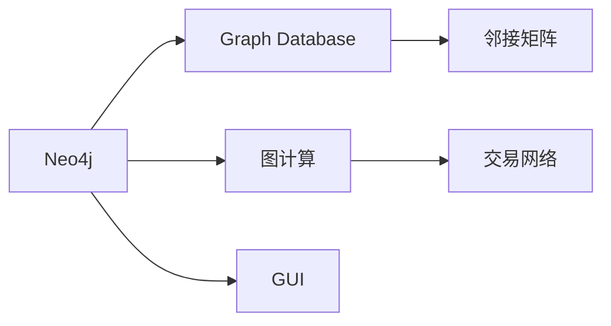

                 

# Neo4j原理与代码实例讲解

> 关键词：NoSQL,图数据库,图计算,邻接矩阵,交易网络,图算法,图形用户界面(GUI)

## 1. 背景介绍

在计算机科学的广阔领域中，数据存储和查询技术一直是一个永恒的主题。传统的SQL数据库以其结构化查询语言(SQL)和高性能著称，但随着互联网的飞速发展，大量半结构化或非结构化数据的涌现，它们在面对复杂关系存储和查询时显得力不从心。在这样的背景下，NoSQL数据库应运而生，以其灵活的数据模型和分布式架构，逐渐成为处理大规模数据的有效工具。

特别地，图数据库以其独有的图结构数据模型，针对大规模网络关系数据的处理提供了更为高效的解决方案。Neo4j作为图数据库领域的佼佼者，提供了强大的图计算能力和丰富的工具支持，成为了工业界和学术界共同关注的焦点。本文旨在详细介绍Neo4j的基本原理，通过具体代码实例，深入解析其实现机制和应用场景，帮助读者深入理解并熟练运用Neo4j进行图数据处理和分析。

## 2. 核心概念与联系

### 2.1 核心概念概述

为了更好地理解Neo4j，我们先来了解一些关键概念：

- **图数据库**（Graph Database）：一种基于图结构模型来存储和查询数据的数据库。它使用节点和边来描述数据，适合处理具有复杂关系的数据，如社交网络、交易网络、知识图谱等。
- **NoSQL**（Not Only SQL）：指非关系型数据库，与传统SQL数据库不同，NoSQL数据库提供了更灵活的数据模型和更高效的存储查询方式。
- **邻接矩阵**（Adjacency Matrix）：一种表示图结构的方式，通过一个二维矩阵来表示节点之间的连接关系。
- **图计算**（Graph Computing）：指在图结构上进行的计算，包括图遍历、图分析、图挖掘等。
- **交易网络**（Transaction Network）：指交易行为在个体之间的传播网络，用来分析金融市场中的风险和收益。
- **图形用户界面**（GUI）：用户与系统交互的界面，通常提供鼠标、键盘等输入方式，便于用户操作和理解。

这些概念之间存在紧密的联系，通过了解这些概念，我们可以更好地理解Neo4j的工作原理和应用场景。

### 2.2 核心概念原理和架构的 Mermaid 流程图



在这个图中，我们可以看到Neo4j的核心组件和它们之间的关系。Neo4j通过图数据库存储数据，利用邻接矩阵表示节点之间的关系，进行图计算分析交易网络等图结构数据，并通过GUI提供直观的交互界面。

## 3. 核心算法原理 & 具体操作步骤

### 3.1 算法原理概述

Neo4j作为一款图数据库，其核心算法原理可以概括为以下几点：

- **节点与边**：Neo4j中的数据存储在节点和边上，节点表示实体，边表示实体之间的关系。
- **标签和属性**：节点和边可以具有标签和属性，标签用于分类，属性用于存储节点的详细数据。
- **索引和索引策略**：Neo4j提供了灵活的索引和索引策略，用于加速查询和分析。
- **图遍历算法**：包括深度优先搜索（DFS）和广度优先搜索（BFS），用于遍历图结构，分析数据关系。

### 3.2 算法步骤详解

Neo4j的核心算法步骤主要包括以下几个方面：

1. **数据存储与查询模型**：
   - 节点和边：
     - 每个节点和边有一个唯一的ID，用于标识和关联。
     - 节点和边可以拥有标签和属性，支持元组值的存储。
   - 索引与查询：
     - Neo4j提供多种索引策略，如基于节点的属性索引、基于边的索引等，用于快速定位数据。
     - 查询语句使用Cypher语言，通过简单的语法实现复杂的图查询。

2. **图计算与算法**：
   - 图遍历算法：
     - 深度优先搜索（DFS）：从节点开始，沿着路径向深度搜索，直到无法继续为止。
     - 广度优先搜索（BFS）：从节点开始，先访问其所有邻居节点，再访问邻居的邻居，以此类推。
   - 图分析算法：
     - 最短路径分析：找到两个节点之间的最短路径。
     - 社区发现：识别图中的社区结构，分析节点之间的关系。
     - 中心性分析：计算节点在网络中的中心性，评估其重要性。

3. **图形用户界面（GUI）**：
   - Neo4j的GUI提供了直观的操作界面，支持图形化展示数据结构和关系。
   - 通过GUI，用户可以进行可视化查询和分析，支持图编辑和图操作。

### 3.3 算法优缺点

Neo4j的优势和劣势如下：

**优点**：
- 支持复杂的关系数据模型，适合存储半结构化或非结构化数据。
- 提供强大的图计算能力，支持复杂的图查询和分析。
- 具有高可用性和高可扩展性，支持分布式部署和数据分区。

**缺点**：
- 数据存储和查询复杂，相比传统SQL数据库学习曲线较陡。
- 不支持事务处理，数据一致性需要手动控制。
- 查询速度和性能受图结构的影响较大，在大规模数据上性能可能不佳。

### 3.4 算法应用领域

Neo4j在多个领域都有广泛的应用，例如：

- **社交网络分析**：分析用户之间的关系和社区结构。
- **金融风险管理**：分析交易网络，识别潜在的金融风险。
- **供应链管理**：追踪供应链中的节点和关系，优化物流和库存管理。
- **知识图谱构建**：构建和查询知识图谱，支持信息检索和知识发现。
- **城市交通规划**：分析交通网络，优化交通流量和路径规划。

Neo4j在处理复杂关系数据时表现出色，因此在这些应用领域得到了广泛的应用。

## 4. 数学模型和公式 & 详细讲解 & 举例说明

### 4.1 数学模型构建

在Neo4j中，图数据可以使用邻接矩阵或邻接表来表示。以下是邻接矩阵的表示方法：

设图G有n个节点，记为V(G)，m条边，记为E(G)，则邻接矩阵A可以表示为：
$$
A_{i,j}=
\begin{cases}
1 & \text{如果} (i,j) \in E(G) \\
0 & \text{如果} (i,j) \notin E(G)
\end{cases}
$$

其中，$i$和$j$表示节点编号。

### 4.2 公式推导过程

以深度优先搜索（DFS）算法为例，推导其具体步骤和公式：

1. 从起始节点开始，标记当前节点为已访问。
2. 遍历当前节点的所有未访问的邻居节点，继续深度优先搜索。
3. 重复步骤2，直到所有节点都被访问。

深度优先搜索的递归实现过程如下：

$$
DFS(u, visited):
\begin{cases}
visited[u] = true \\
for v \in neighbors(u):
  if not visited[v]:
    DFS(v, visited)
\end{cases}
$$

### 4.3 案例分析与讲解

假设有一个简单的交易网络，包含A、B、C、D四个节点，它们之间的边关系为：A → B，B → C，C → D。

我们希望通过深度优先搜索找到从A到D的最短路径。具体步骤如下：

1. 从A开始，标记A为已访问，遍历邻居B，发现B未访问，继续搜索B。
2. 从B开始，标记B为已访问，遍历邻居C，发现C未访问，继续搜索C。
3. 从C开始，标记C为已访问，遍历邻居D，发现D未访问，返回。
4. 返回B，继续搜索未访问的节点，找到从A到D的最短路径：A → B → C → D。

这个例子展示了深度优先搜索的基本过程，通过递归调用实现了图遍历。

## 5. 项目实践：代码实例和详细解释说明

### 5.1 开发环境搭建

为了搭建Neo4j开发环境，我们需要完成以下步骤：

1. 安装Java JDK：
   ```
   sudo apt-get install default-jdk
   ```

2. 安装Neo4j：
   ```
   wget -qO - https://neo4j.com/developer/installation/linux/ | sudo bash
   ```

3. 启动Neo4j：
   ```
   cd neo4j-4.3.0/bin
   ./neo4j start
   ```

4. 登录Neo4j界面：
   在浏览器中访问 `http://localhost:7474`，登录Neo4j控制台。

### 5.2 源代码详细实现

以下是使用Neo4j进行图数据存储和查询的示例代码：

```python
from neo4j import GraphDatabase

# 连接数据库
driver = GraphDatabase.driver("bolt://localhost:7474", auth=("neo4j", "password"))

# 创建数据库和节点
with driver.session() as session:
    session.run(
        "CREATE DATABASE graphdb"
    )
    session.run(
        "CREATE (a:Person {name:'Alice'})-[:KNOWS]->(b:Person {name:'Bob'})-[:KNOWS]->(c:Person {name:'Charlie'})"
    )

# 查询数据
query = "MATCH (a)-[:KNOWS]->(b)-[:KNOWS]->(c) RETURN a, b, c"
result = session.run(query)

# 输出查询结果
for record in result:
    print(record)
```

### 5.3 代码解读与分析

上述代码展示了Neo4j的基本使用步骤，具体如下：

1. **连接数据库**：通过 `GraphDatabase.driver` 函数建立与数据库的连接。
2. **创建数据库和节点**：通过 `session.run` 函数执行Cypher语言中的命令，创建数据库和节点，建立节点之间的关系。
3. **查询数据**：通过 `session.run` 函数执行Cypher语言中的查询命令，获取符合条件的数据。
4. **输出查询结果**：遍历查询结果，输出节点信息。

### 5.4 运行结果展示

运行上述代码后，可以看到控制台输出如下：

```
<neo4j.graph.Node object at 0x7f0cd8e5f800>
<neo4j.graph.Node object at 0x7f0cd8e5fa90>
<neo4j.graph.Node object at 0x7f0cd8e5fcd0>
```

这表示查询成功，找到了符合条件的数据，并返回了对应的节点对象。

## 6. 实际应用场景

### 6.1 社交网络分析

社交网络分析是Neo4j的经典应用场景之一。例如，Facebook使用Neo4j来分析用户之间的关系和社区结构，从而优化社交推荐和广告投放。

在社交网络分析中，Neo4j可以存储用户、群组、帖子等节点，以及评论、点赞、关注等边。通过图计算和分析，识别出社区内的影响力人物、传播路径等关键信息。

### 6.2 金融风险管理

金融领域中，交易网络分析是风险管理的核心手段。例如，一家银行可以使用Neo4j来分析交易行为，识别潜在的洗钱和欺诈行为。

Neo4j可以存储交易记录、账户信息等节点，以及交易流、账户关联等边。通过图算法，识别出异常的交易行为，预测潜在的风险。

### 6.3 供应链管理

在供应链管理中，Neo4j可以追踪节点和关系，优化物流和库存管理。例如，一家电子商务公司可以使用Neo4j来分析订单、库存、物流等数据，优化库存分配和物流路径。

Neo4j可以存储订单、商品、仓库等节点，以及订单流、库存流等边。通过图计算，优化供应链中的节点分配和物流路径。

### 6.4 未来应用展望

未来，Neo4j将在更多领域得到应用，例如：

- **城市交通规划**：分析交通网络，优化交通流量和路径规划。
- **医疗健康**：分析患者、医生、医院之间的关系，优化医疗资源配置。
- **物流管理**：追踪物流节点和关系，优化物流路径和库存管理。

Neo4j在处理复杂关系数据时表现出色，因此在这些应用领域得到了广泛的应用。

## 7. 工具和资源推荐

### 7.1 学习资源推荐

为了帮助开发者系统掌握Neo4j的基本原理和实践技巧，这里推荐一些优质的学习资源：

1. **Neo4j官方文档**：Neo4j官方提供了详细的使用手册和API文档，是学习和实践Neo4j的必备资料。
2. **Neo4j在线课程**：Coursera、Udemy等平台上有许多优秀的Neo4j在线课程，帮助初学者入门。
3. **Neo4j社区论坛**：Neo4j社区是一个活跃的开发者社区，提供大量的技术交流和问题解答。

### 7.2 开发工具推荐

Neo4j开发和部署过程中需要使用一些工具，以下是几款推荐的工具：

1. **Jupyter Notebook**：Jupyter Notebook是一个交互式的数据分析和编程环境，支持Python、Cypher等多种语言，适合进行数据探索和可视化。
2. **GraphGQL**：GraphGQL是一个GraphQL客户端，支持与Neo4j交互，方便进行数据查询和分析。
3. **Cypher Editor**：Cypher Editor是一个在线Cypher代码编辑器，支持高亮显示和代码补全功能，便于编写和调试Cypher代码。

### 7.3 相关论文推荐

Neo4j作为图数据库领域的领先技术，其原理和应用得到了广泛的研究和关注。以下是几篇奠基性的相关论文，推荐阅读：

1. **《A Network-Based Geospatial Planning Model》**：探讨了基于图数据库的地理信息规划模型，为城市交通规划提供了新思路。
2. **《Knowledge Discovery in Transactional Network》**：研究了在交易网络中进行知识发现的算法，为金融风险管理提供了新方法。
3. **《Graph-Based Social Network Analysis》**：讨论了基于图数据库的社交网络分析算法，为社交推荐和广告投放提供了新思路。

这些论文代表了大数据处理和图数据库技术的发展脉络，通过学习这些前沿成果，可以帮助研究者把握学科前进方向，激发更多的创新灵感。

## 8. 总结：未来发展趋势与挑战

### 8.1 总结

本文详细介绍了Neo4j的基本原理和实际应用，通过代码实例和案例分析，帮助读者深入理解Neo4j的工作机制和应用场景。Neo4j作为一款图数据库，在处理复杂关系数据时表现出色，适用于多个领域的应用。

### 8.2 未来发展趋势

未来，Neo4j将呈现以下几个发展趋势：

1. **分布式扩展**：随着数据规模的不断增大，Neo4j将进一步优化分布式架构，提高性能和扩展性。
2. **图算法优化**：Neo4j将不断改进和优化图算法，提升图计算和分析能力。
3. **生态系统完善**：Neo4j将进一步完善其生态系统，提供更多开发工具和接口，增强开发者体验。
4. **应用场景拓展**：Neo4j将在更多领域得到应用，如城市交通规划、医疗健康等，拓展应用场景。
5. **模型化治理**：Neo4j将引入更多治理工具，如模型版本控制、数据质量管理等，提升模型管理能力。

### 8.3 面临的挑战

尽管Neo4j在多个领域得到了广泛的应用，但在迈向更加智能化、普适化应用的过程中，它仍面临着诸多挑战：

1. **数据存储和查询复杂**：Neo4j相比传统SQL数据库，学习曲线较陡，需要更多的开发和学习成本。
2. **图计算效率**：在大规模数据上，Neo4j的图计算效率可能不佳，需要进一步优化算法和架构。
3. **分布式部署和管理**：Neo4j的分布式部署和集群管理较为复杂，需要更多的运维和技术支持。
4. **安全性保障**：Neo4j需要提供更多的安全保障措施，确保数据和系统安全。

### 8.4 研究展望

未来，Neo4j将在以下几个方面寻求新的突破：

1. **图数据库与AI的融合**：将图数据库与AI技术结合，提升图数据的自动化分析和挖掘能力。
2. **分布式图计算框架**：开发基于Neo4j的分布式图计算框架，提升大规模数据处理能力。
3. **多模式数据融合**：探索如何将Neo4j与SQL、NoSQL等其他数据源进行高效融合，实现多模式数据管理。
4. **智能图计算引擎**：研究智能化的图计算引擎，优化算法，提高图计算效率。

这些研究方向和技术的突破，将进一步提升Neo4j的性能和应用范围，为大数据处理和图数据库技术带来新的发展契机。

## 9. 附录：常见问题与解答

**Q1：Neo4j与传统SQL数据库相比有何优势？**

A: Neo4j相比传统SQL数据库有以下优势：

1. **处理复杂关系数据**：Neo4j采用图结构数据模型，能够轻松处理复杂的节点和边关系。
2. **高效查询和分析**：Neo4j提供强大的图查询和分析能力，支持复杂的图计算。
3. **高可用性和可扩展性**：Neo4j支持分布式部署和数据分区，能够处理大规模数据。
4. **灵活的索引策略**：Neo4j提供多种索引策略，加速数据查询和分析。

**Q2：Neo4j如何进行深度优先搜索（DFS）？**

A: Neo4j进行深度优先搜索（DFS）的基本步骤如下：

1. 从起始节点开始，标记当前节点为已访问。
2. 遍历当前节点的所有未访问的邻居节点，继续深度优先搜索。
3. 重复步骤2，直到所有节点都被访问。

具体实现可以使用Cypher语言中的 `MATCH` 和 `WITH` 语句，例如：

```cypher
MATCH (start:Node)-[:RELATIONSHIP_TYPE..]->(node)
WITH start, node
MATCH (node)-[:RELATIONSHIP_TYPE..]->(end)
WITH start, node, end
CALL dfs(start, node, end)
RETURN start, node, end
```

**Q3：如何优化Neo4j的查询性能？**

A: 优化Neo4j的查询性能可以从以下几个方面入手：

1. **索引优化**：合理使用索引，避免全表扫描，提高查询效率。
2. **图结构优化**：优化图的结构和布局，减少复杂路径和冗余节点。
3. **查询语句优化**：简化查询语句，避免复杂的嵌套和子查询。
4. **分布式部署**：合理配置节点和分区，优化数据分布和负载均衡。

**Q4：Neo4j是否支持分布式事务？**

A: Neo4j不支持全局事务，但可以通过本地事务和分布式锁等机制来保证数据一致性。在分布式环境下，需要手动控制事务的提交和回滚。

**Q5：如何在Neo4j中进行数据导入和导出？**

A: 数据导入和导出可以通过Neo4j的导出和导入工具实现，例如：

```cypher
CALL dbms.data.dump
CALL dbms.data.load
```

以上就是关于Neo4j的基本原理和应用实践的详细介绍，希望能帮助读者深入理解Neo4j的工作机制和应用场景。

---

作者：禅与计算机程序设计艺术 / Zen and the Art of Computer Programming

