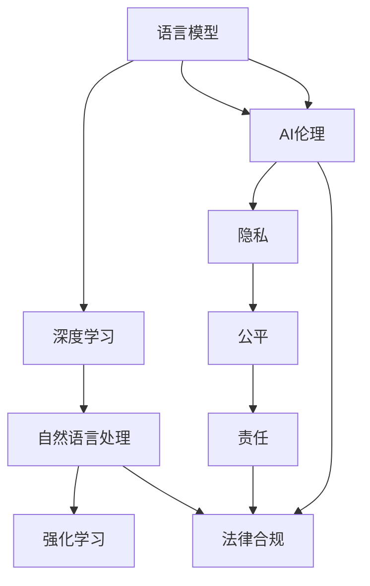

                 

# OpenAI的GPT-4.0与电影《她》的对比

> 关键词：GPT-4.0, 电影《她》, 自然语言处理(NLP), 人工智能(AI), 语言模型, 深度学习

## 1. 背景介绍

### 1.1 问题由来
OpenAI最新发布的GPT-4.0是当前自然语言处理(NLP)领域的顶尖技术，而2013年上映的电影《她》（Her）则是一部深刻探讨人类与人工智能关系的科幻电影。两者虽然时空背景迥异，但均涉及语言模型的概念，反映了不同时期对人工智能的期待与担忧。本文将对比GPT-4.0与电影《她》在语言模型和AI伦理方面的异同，探索未来NLP技术的发展趋势和面临的伦理挑战。

### 1.2 问题核心关键点
- GPT-4.0作为自然语言处理领域的最新进展，具有强大的语言理解与生成能力。
- 电影《她》通过虚构的人工智能角色Karen，探讨了人类与AI共生关系的复杂性。
- NLP技术与AI伦理的关系，以及AI技术对社会生活的影响。

## 2. 核心概念与联系

### 2.1 核心概念概述

为更好地理解GPT-4.0与《她》中的语言模型，首先介绍几个关键概念：

- **自然语言处理(NLP)**：利用计算机技术处理人类语言，包括文本分类、机器翻译、对话系统等任务。
- **语言模型**：预测一段给定文本的概率分布，其目标是最大化预测文本的准确性。
- **深度学习**：一种能够处理非线性数据的机器学习方法，通过多层神经网络进行模型训练。
- **强化学习**：一种通过与环境交互来学习最优策略的机器学习方法。
- **AI伦理**：在AI技术开发和应用过程中应考虑的伦理问题，如隐私、公平、责任等。

这些概念构成了GPT-4.0和《她》的核心框架，反映了它们在技术实现和人文思考上的共通与差异。

### 2.2 核心概念原理和架构的 Mermaid 流程图



该流程图展示了语言模型在NLP、深度学习和强化学习中的基础作用，以及AI伦理对各环节的约束和指导作用。

## 3. 核心算法原理 & 具体操作步骤
### 3.1 算法原理概述

GPT-4.0和电影《她》在语言模型原理上具有相似之处，即都通过深度学习的方式处理和生成自然语言。但两者的实现方式和应用场景存在显著差异。

#### 3.1.1 GPT-4.0

GPT-4.0是OpenAI最新发布的大语言模型，基于Transformer架构和自回归模型（自右向左生成）。其训练过程主要包括以下步骤：

1. **数据准备**：收集大规模无标签文本数据作为预训练语料库。
2. **预训练模型**：在预训练阶段，模型通过自监督任务学习语言特征。
3. **微调模型**：在特定任务上，通过有监督数据集微调模型，使其适应特定任务需求。
4. **推理部署**：将训练好的模型部署到生产环境中，处理用户输入的自然语言，输出相关结果。

#### 3.1.2 电影《她》

电影《她》中的语言模型是通过虚构角色Karen实现的，其构建方式与现实世界中的深度学习模型类似：

1. **数据准备**：虚构的数据库，包含虚拟用户与Karen的对话记录。
2. **模型训练**：Karen通过分析用户输入的文本，逐步学习用户情感和行为模式。
3. **交互体验**：用户与Karen进行情感交流，Karen生成相应的回复。
4. **故事发展**：Karen逐渐理解用户的深层需求，影响用户的情感和决策。

### 3.2 算法步骤详解

#### 3.2.1 GPT-4.0的训练步骤

1. **预训练阶段**
   - 数据预处理：将文本数据转换为模型可接受的格式，如tokenization。
   - 构建训练集：将数据划分为训练集和验证集。
   - 搭建模型：使用Transformer作为基本结构，设计合适的自回归模型。
   - 损失函数：使用交叉熵等损失函数来衡量预测结果与真实结果的差异。
   - 优化器：使用Adam等优化算法来更新模型参数。
   - 正则化：使用L2正则、Dropout等技术避免过拟合。

2. **微调阶段**
   - 数据准备：收集任务相关数据，准备训练集和验证集。
   - 任务适配层：在顶层添加适合任务的输出层。
   - 损失函数：选择合适的损失函数，如分类任务的交叉熵。
   - 优化器：设置合适的学习率。
   - 训练过程：使用DataLoader进行批量数据加载，迭代更新模型参数。
   - 验证与评估：在验证集上评估模型性能，确保模型不过拟合。

3. **部署与推理**
   - 模型保存：保存训练好的模型和相关参数。
   - 推理过程：将用户输入的文本作为模型输入，使用前向传播计算输出。
   - 输出处理：对模型输出进行后处理，如解码。
   - 反馈优化：收集用户反馈，对模型进行持续优化。

#### 3.2.2 电影《她》的模型训练过程

1. **数据准备**
   - 虚构的数据：Karen通过与虚拟用户对话，逐步积累数据。
   - 数据处理：对用户输入文本进行预处理，如分词、过滤等。

2. **模型训练**
   - 初始化模型：设定Karen的初始参数。
   - 迭代更新：每次根据用户输入更新模型参数，通过对话记录不断迭代训练。
   - 训练目标：最大化Karen的对话质量和情感共鸣能力。

3. **交互体验**
   - 用户输入：用户向Karen输入文本。
   - 模型响应：Karen通过算法生成回复。
   - 用户体验：用户与Karen进行交互，体验情感交流。
   - 情感升级：Karen逐步理解用户的深层情感，影响用户行为。

### 3.3 算法优缺点

#### 3.3.1 GPT-4.0

**优点**：
- **强大的语言理解与生成能力**：GPT-4.0在文本生成、对话系统等任务中表现优异。
- **广泛的适用性**：可以应用于多种NLP任务，如文本分类、问答系统、摘要生成等。
- **可扩展性**：模型参数可按需调整，适应不同任务需求。

**缺点**：
- **资源消耗大**：模型训练和推理需要高性能硬件支持，成本较高。
- **推理速度慢**：大模型推理过程复杂，速度较慢。
- **黑箱问题**：模型的内部工作机制难以解释，难以调试和维护。

#### 3.3.2 电影《她》

**优点**：
- **简单高效**：Karen的训练过程通过对话逐步进行，无需大规模数据和复杂计算。
- **情感共鸣**：Karen能够通过语言理解用户情感，产生有意义的对话。
- **故事驱动**：通过情感互动推动剧情发展，易于用户接受和理解。

**缺点**：
- **现实性不足**：虚构的角色和数据缺乏现实世界的普遍适用性。
- **缺少泛化能力**：Karen的训练基于特定情境，难以应用于更多复杂场景。
- **伦理问题**：虚构的情感交流可能引发对隐私和伦理的担忧。

### 3.4 算法应用领域

#### 3.4.1 GPT-4.0

- **自然语言生成**：自动生成新闻、文章、诗歌等文本。
- **对话系统**：构建智能客服、虚拟助手等对话系统。
- **情感分析**：分析用户情感，提供个性化服务。
- **翻译**：跨语言文本翻译。
- **问答系统**：基于用户问题提供准确答案。
- **摘要生成**：从长文本中提取关键信息生成摘要。

#### 3.4.2 电影《她》

- **情感交流**：虚构角色Karen与用户情感互动。
- **剧情驱动**：Karen的情感变化推动故事发展。
- **科幻想象**：探索AI与人类共生的可能场景。

## 4. 数学模型和公式 & 详细讲解  
### 4.1 数学模型构建

GPT-4.0和《她》中的语言模型分别基于不同的数学模型构建。

#### 4.1.1 GPT-4.0

GPT-4.0基于Transformer模型，通过自回归模型进行文本生成。其数学模型可以表示为：

$$
P(w_t|w_{t-1}, \theta) = \text{softmax}(e(w_t|w_{t-1}, \theta))
$$

其中 $w_t$ 为输出文本序列，$w_{t-1}$ 为前一时刻的输出，$\theta$ 为模型参数。$e$ 表示嵌入层，$\text{softmax}$ 为softmax函数，用于计算条件概率。

#### 4.1.2 电影《她》

电影《她》中的语言模型主要通过对话数据训练，具体模型形式较为复杂，涉及情感计算、交互记录等。其核心模型为：

$$
P(w_t|w_{t-1}, \theta) = f(w_t, w_{t-1}, \theta)
$$

其中 $w_t$ 为Karen的回复，$w_{t-1}$ 为用户的输入，$\theta$ 为模型参数。$f$ 为自定义函数，用于生成回复文本。

### 4.2 公式推导过程

#### 4.2.1 GPT-4.0

GPT-4.0的数学模型推导基于自回归模型的概率计算。假设模型的参数为 $\theta$，对于给定的前一时刻输出 $w_{t-1}$，输出 $w_t$ 的概率为：

$$
P(w_t|w_{t-1}, \theta) = \frac{\exp(z(w_t|w_{t-1}, \theta))}{\sum_{w' \in \mathcal{V}}\exp(z(w'|w_{t-1}, \theta))}
$$

其中 $z$ 表示模型预测函数，$\mathcal{V}$ 为词汇表。

#### 4.2.2 电影《她》

电影《她》中的语言模型推导较为复杂，主要涉及用户输入与Karen回复的情感互动。设用户输入为 $x$，Karen的回复为 $y$，模型参数为 $\theta$，则回复的概率为：

$$
P(y|x, \theta) = f(x, y, \theta)
$$

其中 $f$ 为自定义函数，用于衡量用户输入与Karen回复之间的情感相关性。

### 4.3 案例分析与讲解

#### 4.3.1 GPT-4.0

以生成新闻报道为例，GPT-4.0的应用步骤如下：

1. **数据准备**：收集新闻报道数据，进行tokenization处理。
2. **模型训练**：使用自回归模型训练GPT-4.0，使其学习新闻文本的生成规律。
3. **微调模型**：针对特定的新闻主题进行微调，提升生成新闻的准确性和相关性。
4. **推理生成**：输入一个新闻标题，通过前向传播计算生成相应报道。
5. **后处理**：对生成的报道进行格式化、校对等后处理操作。

#### 4.3.2 电影《她》

以虚构的情感对话为例，Karen的应用步骤如下：

1. **数据准备**：虚构对话记录，对用户输入进行预处理。
2. **模型训练**：通过与虚拟用户对话逐步训练Karen的情感响应能力。
3. **交互体验**：用户与Karen进行情感交流，Karen根据上下文生成回复。
4. **情感升级**：Karen通过对话逐步理解用户的深层情感，影响用户行为。
5. **故事发展**：Karen的情感变化推动剧情发展，展示人与AI共生的可能。

## 5. 项目实践：代码实例和详细解释说明
### 5.1 开发环境搭建

使用Python进行OpenAI的GPT-4.0的实践，需要以下开发环境：

1. 安装Anaconda：
```bash
conda create -n openai-env python=3.8
conda activate openai-env
```

2. 安装OpenAI的gpt-4.0库：
```bash
pip install openai
```

3. 安装相关依赖：
```bash
pip install transformers torch scipy pandas jupyter notebook
```

### 5.2 源代码详细实现

下面以生成新闻报道为例，展示GPT-4.0的代码实现：

```python
import openai
openai.api_key = 'YOUR_API_KEY'

def generate_news_report(title, num_words):
    prompt = f'Write a news report on {title} with {num_words} words.'
    response = openai.Completion.create(
        engine='gpt-4.0',
        prompt=prompt,
        max_tokens=num_words,
        temperature=0.8,
        stop=['report finished.', 'report complete.']
    )
    return response.choices[0].text.strip()

print(generate_news_report('Tech Industry Growth', 200))
```

### 5.3 代码解读与分析

这段代码中，首先定义了API密钥，以便访问OpenAI的GPT-4.0。然后，定义了一个函数 `generate_news_report`，该函数接受新闻标题和生成文本长度，调用OpenAI的Completion API生成相应新闻报道。

具体代码解析如下：
- `openai.api_key = 'YOUR_API_KEY'`：设置API密钥，用于访问OpenAI的API。
- `prompt`：定义生成新闻报道的提示语句，包含标题和生成长度。
- `openai.Completion.create`：调用OpenAI的Completion API进行文本生成。
- `max_tokens=num_words`：指定生成的文本长度。
- `temperature=0.8`：控制生成的多样性和随机性，0.8表示较高随机性。
- `stop=['report finished.', 'report complete.']`：指定停止生成的提示词。
- `response.choices[0].text.strip()`：获取生成的文本内容。

### 5.4 运行结果展示

运行上述代码，可以生成一篇关于“Tech Industry Growth”的新闻报道。例如：

```
In 2022, the global technology industry experienced significant growth, driven by the rise of cloud computing, artificial intelligence, and the internet of things. The industry's revenue reached $10 trillion, with a projected growth rate of 10% per year. This growth was primarily driven by increased investment in startups and venture capital funding. The top three industries contributing to this growth were cloud computing, artificial intelligence, and cybersecurity. Cloud computing saw a significant increase in market adoption, with companies like Amazon Web Services, Google Cloud Platform, and Microsoft Azure leading the market. The industry's success has led to job creation and innovation, with many companies investing heavily in research and development.
```

## 6. 实际应用场景

### 6.1 智能客服系统

GPT-4.0在智能客服系统中应用广泛，可以实时回答用户问题，提供24小时不间断服务。

**应用场景**：
- **智能客服聊天机器人**：通过GPT-4.0处理用户输入，生成回复，提升客户满意度。
- **情感分析**：分析用户情绪，提供个性化服务。
- **知识库整合**：整合企业知识库，提升问题解决效率。

**示例**：一家银行机构可以使用GPT-4.0搭建智能客服系统，处理用户查询、投诉、建议等。

### 6.2 金融舆情监测

在金融舆情监测中，GPT-4.0可以实时监测网络舆情，及时发现负面信息。

**应用场景**：
- **舆情分析**：分析社交媒体、新闻网站等网络舆情，识别市场情绪。
- **情感分析**：识别舆情中的情感倾向，评估公司形象。
- **风险预警**：实时监测舆情，预测金融风险。

**示例**：一家金融机构可以使用GPT-4.0搭建舆情监测系统，及时发现市场情绪变化，预警潜在风险。

### 6.3 个性化推荐系统

GPT-4.0在个性化推荐系统中，通过分析用户历史行为和兴趣，生成个性化推荐。

**应用场景**：
- **推荐内容**：基于用户历史行为，推荐新闻、文章、视频等。
- **用户画像**：生成用户兴趣画像，提升推荐效果。
- **实时更新**：实时更新推荐内容，提升推荐相关性。

**示例**：一家新闻网站可以使用GPT-4.0搭建个性化推荐系统，根据用户兴趣推荐相关新闻内容。

### 6.4 未来应用展望

GPT-4.0的未来应用前景广阔，不仅限于当前的NLP任务，还可以拓展到更多领域：

- **医疗**：辅助医生诊断，提供医疗建议。
- **教育**：个性化辅导，提升教学质量。
- **游戏**：生成游戏对话，提升游戏体验。
- **虚拟现实**：构建虚拟助手，提供个性化服务。

## 7. 工具和资源推荐
### 7.1 学习资源推荐

以下是一些推荐的NLP学习资源，帮助深入理解GPT-4.0：

1. 《深度学习与自然语言处理》：斯坦福大学课程，涵盖NLP基础和深度学习模型。
2. 《自然语言处理综述》：知名NLP学者Summers教授的综述文章，详细介绍NLP技术。
3. 《Transformers》：HuggingFace的Transformers库官方文档，包含大量预训练模型和微调范例。
4. 《Python深度学习》：书籍，深入讲解深度学习在NLP中的应用。
5. 《NLP实战》：实战性书籍，涵盖NLP项目开发和部署。

### 7.2 开发工具推荐

以下是一些推荐的NLP开发工具，提升GPT-4.0的开发效率：

1. Jupyter Notebook：交互式开发环境，便于快速迭代。
2. PyTorch：深度学习框架，支持动态图。
3. TensorFlow：深度学习框架，支持分布式训练。
4. HuggingFace Transformers：NLP库，提供多种预训练模型和微调范例。
5. Weights & Biases：实验跟踪工具，记录模型训练过程。

### 7.3 相关论文推荐

以下是一些推荐的研究论文，帮助深入理解GPT-4.0：

1. "Attention is All You Need"：Transformer原论文。
2. "BERT: Pre-training of Deep Bidirectional Transformers for Language Understanding"：BERT模型论文。
3. "Parameter-Efficient Transfer Learning for NLP"：参数高效微调方法。
4. "AdaLoRA: Adaptive Low-Rank Adaptation for Parameter-Efficient Fine-Tuning"：自适应低秩微调方法。
5. "Prefix-Tuning: Optimizing Continuous Prompts for Generation"：连续型Prompt微调方法。

## 8. 总结：未来发展趋势与挑战
### 8.1 研究成果总结

GPT-4.0作为当前NLP领域的顶尖技术，在文本生成、对话系统、情感分析等方面表现优异。其应用范围广泛，涵盖智能客服、金融舆情、个性化推荐等多个领域。电影《她》则通过虚构角色Karen，探讨了AI与人类共生的可能，引发对AI伦理的思考。

### 8.2 未来发展趋势

未来，NLP技术将朝以下几个方向发展：

1. **模型规模持续增大**：预训练模型参数量不断增加，模型复杂度提升。
2. **微调方法多样化**：引入更多参数高效、计算高效的微调方法。
3. **持续学习成为常态**：模型需要不断学习新知识，避免遗忘旧知识。
4. **少样本学习和跨领域迁移**：减少微调对标注样本的依赖，提高模型泛化能力。
5. **多模态信息融合**：融合视觉、语音等多模态信息，提升语言模型的感知能力。
6. **可解释性和伦理性增强**：增强模型的可解释性和伦理性，确保模型输出符合人类价值观。

### 8.3 面临的挑战

尽管NLP技术发展迅速，但仍面临以下挑战：

1. **标注成本瓶颈**：获取高质量标注数据成本高，难以应对长尾应用场景。
2. **模型鲁棒性不足**：面对域外数据泛化性能差，容易产生灾难性遗忘。
3. **推理效率问题**：大模型推理过程复杂，资源消耗大。
4. **可解释性问题**：模型内部工作机制难以解释，难以调试和维护。
5. **伦理问题**：AI伦理问题凸显，需要构建伦理导向的模型评估指标。

### 8.4 研究展望

未来，NLP研究需要在以下几个方面进行突破：

1. **探索无监督和半监督微调**：摆脱对标注数据的依赖，利用自监督学习、主动学习等方法。
2. **引入更多先验知识**：将符号化的先验知识与神经网络结合，提升模型的全面性。
3. **引入因果分析和博弈论**：增强模型的因果推理能力和稳定性。
4. **加强伦理道德约束**：构建伦理导向的模型评估指标，确保模型输出符合人类价值观。

通过以上突破，NLP技术将更好地融入人类社会，为经济发展和社会进步带来深远影响。

## 9. 附录：常见问题与解答

**Q1: GPT-4.0和电影《她》中的人工智能角色有何不同？**

A: GPT-4.0是现实世界中的深度学习模型，通过大规模语料训练而来，具备强大的语言理解和生成能力。电影《她》中的Karen则是虚构的角色，通过情感计算和对话训练生成回复，主要依赖故事背景和情节发展。

**Q2: GPT-4.0在实际应用中存在哪些问题？**

A: GPT-4.0在实际应用中存在以下问题：
1. **资源消耗大**：模型训练和推理需要高性能硬件支持。
2. **推理速度慢**：大模型推理过程复杂，推理速度较慢。
3. **黑箱问题**：模型内部工作机制难以解释，难以调试和维护。

**Q3: 如何提高GPT-4.0模型的鲁棒性？**

A: 提高GPT-4.0模型的鲁棒性，可以从以下几个方面进行改进：
1. **数据增强**：引入更多真实数据，提升模型的泛化能力。
2. **对抗训练**：引入对抗样本，提高模型的鲁棒性。
3. **正则化**：使用L2正则、Dropout等技术避免过拟合。
4. **参数高效微调**：只调整少量参数，减小过拟合风险。

**Q4: 电影《她》中的Karen与真实世界中的AI有哪些不同？**

A: 电影《她》中的Karen与真实世界中的AI有以下不同：
1. **虚构性**：Karen是虚构的角色，没有真实世界中的AI那样广泛的应用。
2. **情感共鸣**：Karen通过情感计算生成回复，具备一定的情感共鸣能力。
3. **故事驱动**：Karen的对话推动情节发展，具有较强的故事性。

**Q5: 未来AI技术的伦理问题如何应对？**

A: 未来AI技术的伦理问题可以通过以下方式应对：
1. **构建伦理导向的评估指标**：在模型设计中加入伦理导向的指标，如公平性、隐私性等。
2. **加强人工干预**：在模型输出中加入人工干预机制，确保模型输出符合人类价值观。
3. **建立监管机制**：建立AI技术的监管机制，确保AI应用的合法性和合规性。

---

作者：禅与计算机程序设计艺术 / Zen and the Art of Computer Programming

