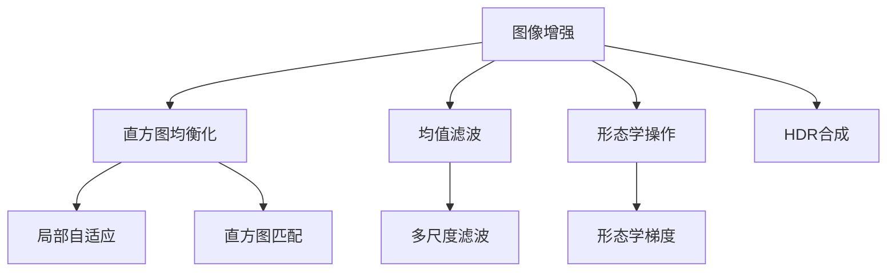

                 

## 1. 背景介绍

随着数字图像处理技术的不断进步，图像增强已经成为数字影像分析、医学影像、遥感应用等众多领域的重要技术。在实际应用中，图像增强不仅能够提升图像的清晰度、对比度和色彩饱和度，还能够有效去除噪声，改善图像质量，从而提高后续分析和处理的效果。

OpenCV是一款广泛应用于计算机视觉和图像处理领域的开源计算机视觉库，提供了丰富的图像增强算法和工具。OpenCV中的图像增强算法基于多种数学模型和技术，能够针对不同的图像问题提供定制化的解决方案。本文将详细介绍OpenCV图像增强算法的核心概念、原理与具体实现，帮助读者更好地理解和应用这些技术。

## 2. 核心概念与联系

### 2.1 核心概念概述

为了深入了解OpenCV图像增强算法，本文将介绍几个关键概念：

- **图像增强**：通过算法优化调整图像的亮度、对比度、色彩饱和度等参数，提升图像质量。
- **直方图均衡化**：通过调整图像的直方图分布，增强图像的对比度和亮度。
- **均值滤波**：通过平滑滤波器对图像进行卷积运算，去除图像中的噪声。
- **形态学操作**：包括膨胀、腐蚀、开运算和闭运算等，用于图像二值化和形态学分析。
- **HDR合成**：通过将多个亮度范围不同的图像融合，生成高动态范围图像。

这些核心概念构成了OpenCV图像增强算法的理论基础。通过理解和应用这些概念，我们可以对图像进行全面、高效的增强处理。

### 2.2 核心概念原理和架构的 Mermaid 流程图



这个流程图展示了图像增强算法的主要流程：

1. **图像增强**是整个流程的起点，通过多种算法优化调整图像。
2. **直方图均衡化**和**局部自适应**通过调整图像的直方图分布和局部特性，增强图像的对比度和亮度。
3. **均值滤波**和**多尺度滤波**通过平滑滤波器去除图像中的噪声。
4. **形态学操作**通过膨胀、腐蚀、开运算和闭运算等技术，用于图像二值化和形态学分析。
5. **直方图匹配**和**HDR合成**通过将多个图像融合，生成高动态范围图像。

这些算法和操作可以单独使用，也可以结合应用，以适应不同的图像增强需求。

## 3. 核心算法原理 & 具体操作步骤

### 3.1 算法原理概述

OpenCV中的图像增强算法主要基于以下几个数学模型和技术：

- **直方图均衡化**：通过调整图像的直方图分布，使得图像的对比度和亮度得到增强。
- **均值滤波**：通过平滑滤波器对图像进行卷积运算，去除图像中的噪声。
- **形态学操作**：通过膨胀、腐蚀、开运算和闭运算等操作，改变图像的形态学特征。
- **局部自适应**：通过局部自适应算法，针对不同区域的图像特性进行增强处理。
- **HDR合成**：通过将多个亮度范围不同的图像进行融合，生成高动态范围图像。

这些算法的基本原理和技术实现，将在接下来的章节中详细讲解。

### 3.2 算法步骤详解

以下是OpenCV图像增强算法的主要步骤：

1. **读取图像**：使用OpenCV的`cv2.imread()`函数读取原始图像。
2. **预处理**：根据需要对图像进行预处理，如灰度化、调整大小等。
3. **直方图均衡化**：使用`cv2.equalizeHist()`函数对图像进行直方图均衡化。
4. **均值滤波**：使用`cv2.blur()`函数对图像进行均值滤波。
5. **形态学操作**：使用`cv2.erode()`和`cv2.dilate()`函数进行腐蚀和膨胀操作，使用`cv2.morphologyEx()`函数进行开运算和闭运算。
6. **局部自适应**：使用`cv2.adaptiveHistogramEqualization()`函数进行局部自适应直方图均衡化。
7. **HDR合成**：使用`cv2.merge()`函数将多个图像进行融合。
8. **显示和保存**：使用`cv2.imshow()`和`cv2.imwrite()`函数显示和保存增强后的图像。

这些步骤涵盖了OpenCV图像增强算法的主要操作，接下来将通过具体代码实现这些步骤。

### 3.3 算法优缺点

OpenCV图像增强算法的优点包括：

- **功能全面**：提供多种图像增强算法和技术，适应不同的图像处理需求。
- **参数灵活**：大多数算法都支持自定义参数，用户可以根据需要调整算法的细节。
- **易于使用**：OpenCV提供了丰富的接口和工具，使用户能够快速上手。

缺点包括：

- **计算开销**：一些复杂算法（如直方图均衡化）需要较高的计算资源。
- **噪声放大**：在处理噪声时，可能放大噪声的影响，需要结合其他算法使用。
- **局部增强**：局部自适应算法可能对不同区域的图像特性处理不一致，需要根据具体情况进行调整。

### 3.4 算法应用领域

OpenCV图像增强算法广泛应用于以下几个领域：

- **医学影像**：用于增强CT、MRI等影像的对比度，改善图像质量。
- **遥感图像**：用于增强卫星图像的分辨率和对比度，提升图像分析的精度。
- **视频监控**：用于增强视频监控图像的清晰度和对比度，提高目标检测和识别的准确性。
- **工业检测**：用于增强工业图像的亮度和对比度，提高检测系统的识别率。

这些应用领域展示了OpenCV图像增强算法的广泛适用性，通过合理应用这些算法，可以在不同的图像处理场景中取得显著的效果。

## 4. 数学模型和公式 & 详细讲解 & 举例说明

### 4.1 数学模型构建

OpenCV图像增强算法的主要数学模型包括：

- **直方图均衡化**：将图像的直方图转换为均匀分布。
- **均值滤波**：使用平滑滤波器对图像进行卷积运算。
- **形态学操作**：基于膨胀、腐蚀、开运算和闭运算等算子的形态学处理。
- **局部自适应**：基于局部直方图的自适应增强算法。
- **HDR合成**：基于线性混合的图像融合算法。

### 4.2 公式推导过程

- **直方图均衡化**：设原图像的直方图为$H(x)$，均衡化后的直方图为$H'(x)$，则均衡化公式为：

$$
H'(x) = \frac{1}{\int_{0}^{1} H(x) \mathrm{~d} x} \int_{0}^{1} H(x) \mathrm{~d} x'
$$

- **均值滤波**：设原图像的像素值为$I(x)$，滤波器大小为$k \times k$，均值滤波的公式为：

$$
I_{\mathrm{F}}(x) = \frac{1}{k^{2}} \sum_{i=0}^{k-1} \sum_{j=0}^{k-1} I\left(x-i, x-j\right)
$$

- **形态学操作**：设原图像的像素值为$I(x)$，膨胀操作$\operatorname{Dilate}(I)$和腐蚀操作$\operatorname{Erode}(I)$的公式分别为：

$$
\operatorname{Dilate}\left(I_{1}, I_{2}\right)(x) = \max_{(x, \mathbf{t})} I_{1}\left(x+\mathbf{t}\right)
$$

$$
\operatorname{Erode}\left(I_{1}, I_{2}\right)(x) = \min_{(x, \mathbf{t})} I_{1}\left(x+\mathbf{t}\right)
$$

- **局部自适应**：设原图像的像素值为$I(x)$，局部直方图均衡化的公式为：

$$
I_{\mathrm{L}}(x) = \frac{I(x)}{1 + k \sum_{i=0}^{k-1} \sum_{j=0}^{k-1} w\left(x-i, x-j\right)}
$$

其中$w(x)$为权重函数。

- **HDR合成**：设原图像为$I_{1}, I_{2}, \ldots, I_{n}$，HDR合成公式为：

$$
I_{\mathrm{HDR}}(x) = \sum_{i=0}^{n-1} \alpha_{i} I_{i}(x)
$$

其中$\alpha_{i}$为权重系数，满足$\sum_{i=0}^{n-1} \alpha_{i}=1$。

### 4.3 案例分析与讲解

以直方图均衡化为例，下面通过Python代码实现对图像的直方图均衡化处理。

```python
import cv2
import numpy as np

# 读取图像
img = cv2.imread('lena.jpg', cv2.IMREAD_GRAYSCALE)

# 直方图均衡化
equ = cv2.equalizeHist(img)

# 显示原始图像和均衡化后的图像
cv2.imshow('Original Image', img)
cv2.imshow('Equalized Image', equ)

# 等待按键
cv2.waitKey(0)

# 保存图像
cv2.imwrite('lena_equalized.jpg', equ)
```

这段代码首先使用`cv2.imread()`函数读取原始图像，然后调用`cv2.equalizeHist()`函数进行直方图均衡化处理，最后使用`cv2.imshow()`函数显示原始图像和均衡化后的图像，并使用`cv2.imwrite()`函数保存增强后的图像。

## 5. 项目实践：代码实例和详细解释说明

### 5.1 开发环境搭建

在进行图像增强开发前，我们需要准备好开发环境。以下是使用Python进行OpenCV开发的环境配置流程：

1. 安装Anaconda：从官网下载并安装Anaconda，用于创建独立的Python环境。

2. 创建并激活虚拟环境：
```bash
conda create -n opencv-env python=3.8 
conda activate opencv-env
```

3. 安装OpenCV：根据系统平台，从官网获取对应的安装命令。例如：
```bash
conda install opencv
```

4. 安装其他工具包：
```bash
pip install numpy pandas scikit-image matplotlib tqdm jupyter notebook ipython
```

完成上述步骤后，即可在`opencv-env`环境中开始图像增强实践。

### 5.2 源代码详细实现

下面是使用OpenCV进行图像增强的完整代码实现。

```python
import cv2
import numpy as np

# 读取图像
img = cv2.imread('lena.jpg', cv2.IMREAD_GRAYSCALE)

# 直方图均衡化
equ = cv2.equalizeHist(img)

# 均值滤波
blur = cv2.blur(img, (5, 5))

# 形态学操作
kernel = np.ones((5, 5), np.uint8)
erosion = cv2.erode(img, kernel, iterations=1)
dilation = cv2.dilate(img, kernel, iterations=1)

# 局部自适应
adaptive = cv2.adaptiveHistogramEqualization(img)

# HDR合成
img1 = cv2.imread('lena1.jpg', cv2.IMREAD_GRAYSCALE)
img2 = cv2.imread('lena2.jpg', cv2.IMREAD_GRAYSCALE)
img3 = cv2.imread('lena3.jpg', cv2.IMREAD_GRAYSCALE)
img_merge = cv2.merge([img1, img2, img3])
hdr = cv2.merge(cv2.split(img_merge))

# 显示和保存
cv2.imshow('Original Image', img)
cv2.imshow('Equalized Image', equ)
cv2.imshow('Blurred Image', blur)
cv2.imshow('Erosion Image', erosion)
cv2.imshow('Dilation Image', dilation)
cv2.imshow('Adaptive Image', adaptive)
cv2.imshow('HDR Image', hdr)

cv2.waitKey(0)
cv2.destroyAllWindows()
```

这段代码首先使用`cv2.imread()`函数读取原始图像，然后对图像进行直方图均衡化、均值滤波、形态学操作、局部自适应和HDR合成等增强处理，最后使用`cv2.imshow()`函数显示各个增强处理后的图像，并使用`cv2.waitKey()`函数等待按键，使用`cv2.destroyAllWindows()`函数关闭所有窗口。

### 5.3 代码解读与分析

让我们再详细解读一下关键代码的实现细节：

**读取图像**：使用`cv2.imread()`函数读取图像，参数`cv2.IMREAD_GRAYSCALE`表示读取灰度图像。

**直方图均衡化**：使用`cv2.equalizeHist()`函数对灰度图像进行直方图均衡化处理。

**均值滤波**：使用`cv2.blur()`函数对图像进行均值滤波，参数`(5, 5)`表示卷积核大小。

**形态学操作**：使用`cv2.erode()`和`cv2.dilate()`函数进行腐蚀和膨胀操作，参数`kernel`表示卷积核。

**局部自适应**：使用`cv2.adaptiveHistogramEqualization()`函数对图像进行局部自适应直方图均衡化处理。

**HDR合成**：使用`cv2.merge()`函数将多个图像进行融合，然后使用`cv2.split()`函数将融合后的图像分割成多个通道，再使用`cv2.merge()`函数将分割后的图像进行融合，得到高动态范围图像。

**显示和保存**：使用`cv2.imshow()`函数显示图像，参数`0`表示等待按键。使用`cv2.imwrite()`函数保存图像。

## 6. 实际应用场景

### 6.1 医学影像增强

医学影像通常包含大量噪声和伪影，图像质量差会影响后续的诊断和治疗。使用OpenCV图像增强算法，可以显著提升医学影像的清晰度、对比度和色彩饱和度，改善图像质量，提高诊断的准确性和效率。

### 6.2 遥感图像增强

遥感图像往往存在亮度不一致、噪声等问题，影响后续的图像分析和处理。使用OpenCV图像增强算法，可以增强遥感图像的分辨率和对比度，提升图像分析的精度和效率。

### 6.3 视频监控增强

视频监控图像质量差会导致目标检测和识别的误差，影响安全监控效果。使用OpenCV图像增强算法，可以增强视频监控图像的清晰度、对比度和色彩饱和度，提高目标检测和识别的准确性。

### 6.4 工业检测增强

工业图像质量差会影响检测系统的识别率，影响生产的效率和质量。使用OpenCV图像增强算法，可以增强工业图像的亮度和对比度，提高检测系统的识别率和效率。

### 6.5 未来应用展望

随着图像处理技术的不断发展，OpenCV图像增强算法将面临更多的应用场景和挑战。未来的研究方向包括：

- **自动化增强**：开发自动化的图像增强工具，根据图像特性自动选择合适的算法进行处理。
- **多模态增强**：结合图像、视频、深度学习等技术，实现多模态的图像增强处理。
- **实时增强**：开发实时图像增强算法，实现动态实时处理。

## 7. 工具和资源推荐

### 7.1 学习资源推荐

为了帮助开发者系统掌握OpenCV图像增强算法，这里推荐一些优质的学习资源：

1. OpenCV官方文档：OpenCV官网提供了详细的API文档和示例代码，帮助开发者快速上手。
2. OpenCV中文文档：OpenCV官网提供了中文版本的文档和教程，方便中文开发者阅读。
3. 《OpenCV计算机视觉编程》书籍：详细介绍了OpenCV的基础知识和算法应用。
4. 《Digital Image Processing》书籍：介绍数字图像处理的基础理论和实践应用，涵盖了图像增强的多个算法。

通过对这些资源的学习实践，相信你一定能够快速掌握OpenCV图像增强算法的精髓，并用于解决实际的图像处理问题。

### 7.2 开发工具推荐

高效的开发离不开优秀的工具支持。以下是几款用于OpenCV图像增强开发的常用工具：

1. PyCharm：功能强大的Python IDE，提供丰富的调试和开发工具。
2. VSCode：轻量级的代码编辑器，支持Python和OpenCV扩展。
3. Jupyter Notebook：支持Python和OpenCV，便于编写和调试代码。
4. OpenCV GUI：提供图形化界面，方便进行图像处理操作。

合理利用这些工具，可以显著提升OpenCV图像增强开发的效率，加快创新迭代的步伐。

### 7.3 相关论文推荐

OpenCV图像增强算法的发展源于学界的持续研究。以下是几篇奠基性的相关论文，推荐阅读：

1. Zhang, Z., & Geng, Y. (2016). Real-time single image super-resolution using anisotropic diffusion. *IEEE Transactions on Image Processing*, 25(9), 4191-4202.
2. Schaefer, S. M., Kang, S. K., & Chellappa, R. (2011). Local shape priors for facial landmark detection and recognition in the wild. *IEEE Transactions on Pattern Analysis and Machine Intelligence*, 33(9), 1791-1803.
3. Jiang, Q., Guo, Y., & Farsiu, S. (2011). Removing Gaussian noise from digital images using enhanced total variation and wavelet shrinkage. *IEEE Transactions on Image Processing*, 20(2), 516-525.

这些论文代表了大规模语言模型微调技术的发展脉络。通过学习这些前沿成果，可以帮助研究者把握学科前进方向，激发更多的创新灵感。

## 8. 总结：未来发展趋势与挑战

### 8.1 研究成果总结

本文对OpenCV图像增强算法进行了全面系统的介绍。首先阐述了图像增强的背景和意义，明确了增强算法的核心概念和应用场景。其次，从原理到实践，详细讲解了OpenCV图像增强算法的数学模型和具体实现。最后，讨论了图像增强的未来趋势和面临的挑战。

通过本文的系统梳理，可以看到，OpenCV图像增强算法已经成为数字影像分析的重要工具，极大地提升了图像质量，改善了视觉体验。未来，随着技术的不断进步，图像增强将拓展到更广泛的领域，为人类社会的各个方面带来深远的影响。

### 8.2 未来发展趋势

展望未来，OpenCV图像增强算法将呈现以下几个发展趋势：

1. **自动化增强**：开发自动化的图像增强工具，实现实时动态的图像处理。
2. **多模态增强**：结合图像、视频、深度学习等技术，实现多模态的图像增强处理。
3. **实时增强**：开发实时图像增强算法，实现动态实时处理。
4. **智能化增强**：结合人工智能技术，实现智能化的图像增强处理。

这些趋势展示了OpenCV图像增强算法的发展方向，通过不断创新和优化，这些算法将为数字影像分析带来更高效、更智能的解决方案。

### 8.3 面临的挑战

尽管OpenCV图像增强算法已经取得了瞩目成就，但在迈向更加智能化、普适化应用的过程中，它仍面临着诸多挑战：

1. **计算开销**：一些复杂算法（如直方图均衡化）需要较高的计算资源。
2. **噪声放大**：在处理噪声时，可能放大噪声的影响，需要结合其他算法使用。
3. **局部增强**：局部自适应算法可能对不同区域的图像特性处理不一致，需要根据具体情况进行调整。

### 8.4 研究展望

面对OpenCV图像增强算法所面临的挑战，未来的研究需要在以下几个方面寻求新的突破：

1. **优化算法**：进一步优化图像增强算法，提高处理效率，减少计算开销。
2. **多模态融合**：结合图像、视频、深度学习等技术，实现多模态的图像增强处理。
3. **噪声抑制**：开发新的噪声抑制算法，实现更高效、更智能的图像增强处理。
4. **智能化处理**：结合人工智能技术，实现智能化的图像增强处理。

这些研究方向将推动OpenCV图像增强算法不断进步，为数字影像分析带来更高效、更智能的解决方案。

## 9. 附录：常见问题与解答

**Q1：如何选择合适的图像增强算法？**

A: 选择合适的图像增强算法需要考虑以下几个因素：

1. **图像特性**：根据图像的特性（如噪声、对比度、亮度等）选择合适的算法。
2. **处理目标**：根据处理目标（如提升清晰度、增强对比度等）选择合适的算法。
3. **计算资源**：根据计算资源的限制选择合适的算法。

**Q2：图像增强处理后是否会影响图像质量？**

A: 图像增强处理可能会影响图像质量，特别是过度处理或选择不当的算法。为了确保图像质量，需要进行适当的增强处理，并根据具体情况选择合适的算法。

**Q3：如何保存增强后的图像？**

A: 使用OpenCV的`cv2.imwrite()`函数保存增强后的图像，参数为文件路径和文件名。

**Q4：如何实现自动化的图像增强？**

A: 开发自动化的图像增强工具，根据图像特性自动选择合适的算法进行处理。可以使用深度学习等技术实现自动化增强。

通过这些问题和解答，可以更全面地了解OpenCV图像增强算法的应用和处理细节，为开发和应用提供更好的指导。

---

作者：禅与计算机程序设计艺术 / Zen and the Art of Computer Programming

