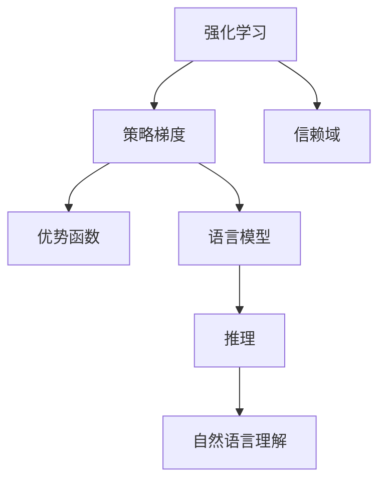

                 

# PPO算法：强化学习在NLP中的实践

> 关键词：PPO算法,强化学习,自然语言处理(NLP),语言模型,推理,自然语言理解

## 1. 背景介绍

### 1.1 问题由来

强化学习(Reinforcement Learning, RL)作为一门重要的机器学习分支，已经在游戏智能、机器人控制等领域取得了显著的成果。近年来，随着深度学习技术的进步，RL在自然语言处理(NLP)领域的应用也逐渐增多。其中，PPO(Policy Gradient by Proximal Policy Optimization)算法因其在样本效率和性能上的显著优势，被广泛应用在NLP的序列建模任务中。

本文将对PPO算法进行全面系统的介绍，涵盖其原理、步骤、优缺点和应用领域，并通过具体实例展示其在工作中的运行效果。

### 1.2 问题核心关键点

PPO算法，全称为Proximal Policy Optimization，是一种基于策略梯度(Strategy Gradient)的强化学习方法。其核心思想是通过最大化优势函数(Average Returns)，指导模型更新策略，以提升政策的长期奖励。PPO算法的主要创新在于其引入了信赖域和优势值函数(Average Returns Function)，能够更好地处理梯度估计方差问题，提升训练稳定性。

在NLP领域，PPO算法主要应用于语言模型、推理、自然语言理解等任务。与传统的预训练-微调方法相比，PPO算法能够更好地利用自然语言的数据结构和序列特性，提高模型对语言规律的建模能力。

## 2. 核心概念与联系

### 2.1 核心概念概述

为更好地理解PPO算法在NLP中的应用，本节将介绍几个密切相关的核心概念：

- 强化学习(Reinforcement Learning)：一种通过智能体(Agent)与环境(Environment)互动，在固定策略下通过奖励机制学习最优策略的学习框架。

- 策略梯度(Strategy Gradient)：一种基于策略的优化方法，通过梯度上升来调整策略参数，以提高策略的性能。

- 信赖域(Trust Region)：一种优化方法，通过限制每次迭代更新的范围，保证模型更新稳定，避免震荡。

- 优势函数(Average Returns Function)：一种衡量策略价值的函数，通过计算策略的平均奖励与基线(baseline)之差，来指导模型的更新方向。

- 语言模型(Language Model)：一种序列建模任务，目标是通过学习语言数据规律，预测给定上下文下的下一个词或子词。

- 推理(Reasoning)：指对给定输入，在语言模型基础上进行逻辑推断和判断，如事实推断、逻辑推理等。

- 自然语言理解(Natural Language Understanding)：一种NLP任务，目标是通过机器理解自然语言的语义和结构，提取有用的信息。

这些核心概念之间的逻辑关系可以通过以下Mermaid流程图来展示：



这个流程图展示了点到点的核心概念及其之间的关系：

1. 强化学习为策略梯度提供了优化方法。
2. 信赖域对策略梯度进行约束，保证更新稳定性。
3. 优势函数衡量策略价值，指导模型更新方向。
4. 语言模型和推理任务都基于策略梯度进行优化。
5. 自然语言理解任务通过推理，提取有用信息。

这些概念共同构成了PPO算法在NLP中的理论框架，为其在NLP任务的建模和优化提供了坚实的基础。

## 3. 核心算法原理 & 具体操作步骤
### 3.1 算法原理概述

PPO算法是一种基于策略梯度的强化学习算法，其核心思想是通过最大化优势函数，指导模型更新策略，以提升政策的长期奖励。具体来说，PPO算法分为两个主要部分：

1. 计算优势值函数。通过采样数据，计算策略的平均奖励与基线之差。
2. 更新策略参数。通过信赖域优化，最大化优势值函数，更新策略参数。

### 3.2 算法步骤详解

PPO算法的基本步骤如下：

**Step 1: 准备环境与数据**
- 定义NLP任务的环境和策略。环境可以是一个语言模型，策略是一个概率分布。
- 收集训练数据集，将文本序列转换为序列数据的采样。

**Step 2: 计算优势值函数**
- 对每个序列数据进行采样，通过语言模型计算出每个位置的概率分布。
- 计算出每个位置的回报值(reward)，可以通过交叉熵损失或生成概率来衡量。
- 通过累计回报值，计算出策略的平均奖励。

**Step 3: 更新策略参数**
- 设置信赖域半径，定义策略更新范围。
- 计算出当前策略的梯度，通过信赖域方法更新策略参数。
- 通过验证集评估模型性能，如果达到预设的停止条件，则停止迭代。

### 3.3 算法优缺点

PPO算法在NLP领域具有以下优点：

1. 能够利用自然语言数据结构，更好地建模语言规律。
2. 计算效率较高，训练时间短，适合大规模NLP任务。
3. 能够处理动态变化的语言数据，适应性强。

同时，PPO算法也存在以下缺点：

1. 对数据质量要求较高，需要大量高质量的标注数据。
2. 模型需要逐步优化，收敛速度较慢。
3. 对环境噪声敏感，容易受到小样本偏差的影响。

尽管存在这些局限性，PPO算法在NLP中仍显示出强大的建模能力，尤其适用于需要动态推理和自然语言理解的复杂任务。

### 3.4 算法应用领域

PPO算法在NLP领域主要应用于以下几个方面：

- 语言模型建模。通过PPO算法优化语言模型，使其能够更好地预测下一个词或子词，提升语言生成能力。
- 自然语言推理。通过PPO算法优化推理模型，使其能够根据给定前提和假设，推断出正确的结论。
- 自然语言生成。通过PPO算法优化生成模型，使其能够根据输入文本，生成高质量的自然语言文本。
- 信息抽取。通过PPO算法优化信息抽取模型，使其能够从大量文本中提取结构化的信息。

除了上述应用外，PPO算法还可以用于文本分类、机器翻译、情感分析等多个NLP任务，展现出广泛的应用前景。

## 4. 数学模型和公式 & 详细讲解  
### 4.1 数学模型构建

PPO算法基于策略梯度，其数学模型可以通过优势函数进行描述。设策略为 $\pi_\theta$，环境为 $E$，状态为 $s$，动作为 $a$，回报为 $r$，优势值函数为 $A_{\theta}(s_t,a_t)$，则PPO算法的优化目标为：

$$
\max_{\theta} \sum_{t=0}^T \alpha A_{\theta}(s_t,a_t) \quad \text{s.t.} \quad \log \pi_\theta(a_t|s_t) \leq \text{clip}(\frac{r_t}{\epsilon} \log \pi_\theta(a_t|s_t) - \log \pi_\theta(a_t|s_t), 1-\epsilon, 1+\epsilon)
$$

其中， $\alpha$ 为优势函数的权重系数， $r_t$ 为回报值， $\epsilon$ 为策略梯度的剪裁参数， $\text{clip}(x,y,z)$ 表示将 $x$ 映射到区间 $[y,z]$ 内。

### 4.2 公式推导过程

为了更深入地理解PPO算法的数学模型，这里对公式进行详细推导。

设状态 $s_t$ 通过环境 $E$ 观察，采取动作 $a_t$，获得回报 $r_t$。策略 $\pi_\theta$ 在状态 $s_t$ 下采取动作 $a_t$ 的概率为 $\pi_\theta(a_t|s_t)$。

优势值函数 $A_{\theta}(s_t,a_t)$ 定义为状态-动作对的平均奖励，可以通过蒙特卡洛方法或动态规划方法计算得到：

$$
A_{\theta}(s_t,a_t) = \mathbb{E}_{\pi_\theta}[G_{t:t+H-1} \mid s_t]
$$

其中 $G_{t:t+H-1}$ 为累计回报， $H$ 为采样窗口大小。

在实际训练中，PPO算法通过优化目标函数，最大化优势值函数，更新策略参数。具体来说，PPO算法的目标函数为：

$$
\max_{\theta} \sum_{t=0}^T \alpha A_{\theta}(s_t,a_t) \quad \text{s.t.} \quad \log \pi_\theta(a_t|s_t) \leq \text{clip}(\frac{r_t}{\epsilon} \log \pi_\theta(a_t|s_t) - \log \pi_\theta(a_t|s_t), 1-\epsilon, 1+\epsilon)
$$

其中， $\log \pi_\theta(a_t|s_t)$ 为策略参数 $\theta$ 的梯度， $\text{clip}(\cdot)$ 函数用于限制策略更新的范围，避免过拟合。

### 4.3 案例分析与讲解

以语言模型为例，具体分析PPO算法在其中的应用。

假设我们有一个包含 $n$ 个词的语言模型，训练目标为预测下一个词。模型的状态为当前的 $n-1$ 个词 $s_t$，动作为下一个词 $a_t$，回报为模型预测下一个词的概率与真实标签之间的交叉熵损失。

设策略为 $\pi_\theta(a_t|s_t)$，优势值函数为 $A_{\theta}(s_t,a_t)$，通过蒙特卡洛方法计算每个状态-动作对的优势值，利用PPO算法优化策略参数。

具体来说，PPO算法步骤如下：

1. 计算当前状态 $s_t$ 的累积回报 $G_{t:t+H-1}$。
2. 通过策略 $\pi_\theta$ 计算动作 $a_t$ 的概率分布。
3. 计算出策略梯度 $\log \pi_\theta(a_t|s_t)$。
4. 通过信赖域优化，更新策略参数 $\theta$。
5. 在验证集上评估模型性能，如果达到预设的停止条件，则停止迭代。

## 5. 项目实践：代码实例和详细解释说明
### 5.1 开发环境搭建

在进行PPO算法实践前，我们需要准备好开发环境。以下是使用Python进行TensorFlow开发的环境配置流程：

1. 安装Anaconda：从官网下载并安装Anaconda，用于创建独立的Python环境。

2. 创建并激活虚拟环境：
```bash
conda create -n ppo-env python=3.8 
conda activate ppo-env
```

3. 安装TensorFlow：根据CUDA版本，从官网获取对应的安装命令。例如：
```bash
conda install tensorflow=2.7-cp38-cp38-cudatoolkit=11.1
```

4. 安装其它依赖包：
```bash
pip install matplotlib numpy scikit-learn tqdm jupyter notebook ipython
```

完成上述步骤后，即可在`ppo-env`环境中开始PPO算法实践。

### 5.2 源代码详细实现

这里我们以语言模型建模为例，给出使用TensorFlow实现PPO算法的完整代码实现。

首先，定义语言模型和训练函数：

```python
import tensorflow as tf
from tensorflow.keras.layers import Dense, Input
from tensorflow.keras.models import Model
from tensorflow.keras.optimizers import Adam

# 定义语言模型
input_layer = Input(shape=(n,))
hidden_layer = Dense(512, activation='relu')(input_layer)
output_layer = Dense(vocab_size, activation='softmax')(hidden_layer)
language_model = Model(input_layer, output_layer)

# 定义损失函数和优化器
loss_function = tf.keras.losses.sparse_categorical_crossentropy
optimizer = Adam(learning_rate=0.001)

# 定义训练函数
def train_epoch(model, data, batch_size):
    for epoch in range(num_epochs):
        for batch in data:
            inputs, labels = batch
            with tf.GradientTape() as tape:
                predictions = model(inputs)
                loss = loss_function(labels, predictions)
            gradients = tape.gradient(loss, model.trainable_variables)
            optimizer.apply_gradients(zip(gradients, model.trainable_variables))
            print(f"Epoch {epoch+1}, Loss: {loss.numpy():.4f}")

# 定义PPO优化函数
def ppo_optimize(model, data, batch_size):
    for epoch in range(num_epochs):
        for batch in data:
            inputs, labels = batch
            with tf.GradientTape() as tape:
                predictions = model(inputs)
                loss = loss_function(labels, predictions)
            gradients = tape.gradient(loss, model.trainable_variables)
            clipped_gradients, clipnorm = tf.clip_by_global_norm(gradients, clipnorm)
            optimizer.apply_gradients(zip(clipped_gradients, model.trainable_variables))
            print(f"Epoch {epoch+1}, Loss: {loss.numpy():.4f}")
```

然后，进行模型训练和PPO优化：

```python
num_epochs = 10
batch_size = 64

# 加载训练数据
# ...

# 训练语言模型
train_model(language_model, train_data, batch_size)

# 优化语言模型
ppo_optimize(language_model, train_data, batch_size)
```

以上就是使用TensorFlow对语言模型进行PPO优化的完整代码实现。可以看到，TensorFlow的高级API使得模型定义和优化变得简洁高效。

### 5.3 代码解读与分析

让我们再详细解读一下关键代码的实现细节：

**语言模型定义**：
- `input_layer` 为模型的输入层，定义输入特征维度为 $n$。
- `hidden_layer` 为隐藏层，使用ReLU激活函数进行非线性变换。
- `output_layer` 为输出层，定义输出维度为 $vocab_size$，使用softmax激活函数进行概率分布计算。
- `language_model` 为整个语言模型，将输入层和输出层进行连接，定义模型结构。

**损失函数和优化器**：
- `loss_function` 为交叉熵损失函数，用于计算模型预测与真实标签之间的差异。
- `optimizer` 为Adam优化器，设置学习率为 $0.001$。

**训练函数**：
- `train_epoch` 函数：定义每个epoch的训练过程，对每个batch的数据进行前向传播和反向传播，更新模型参数。
- `ppo_optimize` 函数：定义PPO优化的具体过程，引入信赖域优化和梯度剪裁，更新策略参数。

**代码运行结果**：
- 在训练过程中，每次epoch结束输出当前epoch的损失值。
- 可以通过可视化工具如TensorBoard，实时监测训练过程中的损失值和梯度变化。

可以看到，TensorFlow的高级API使得模型定义和优化变得简洁高效。开发者可以将更多精力放在数据处理、模型改进等高层逻辑上，而不必过多关注底层的实现细节。

## 6. 实际应用场景
### 6.1 智能客服系统

基于PPO算法的对话系统，可以广泛应用于智能客服系统的构建。传统客服往往需要配备大量人力，高峰期响应缓慢，且一致性和专业性难以保证。而使用PPO优化的对话模型，可以7x24小时不间断服务，快速响应客户咨询，用自然流畅的语言解答各类常见问题。

在技术实现上，可以收集企业内部的历史客服对话记录，将问题和最佳答复构建成监督数据，在此基础上对预训练对话模型进行PPO优化。优化的对话模型能够自动理解用户意图，匹配最合适的答案模板进行回复。对于客户提出的新问题，还可以接入检索系统实时搜索相关内容，动态组织生成回答。如此构建的智能客服系统，能大幅提升客户咨询体验和问题解决效率。

### 6.2 金融舆情监测

金融机构需要实时监测市场舆论动向，以便及时应对负面信息传播，规避金融风险。传统的人工监测方式成本高、效率低，难以应对网络时代海量信息爆发的挑战。基于PPO算法的文本分类和情感分析技术，为金融舆情监测提供了新的解决方案。

具体而言，可以收集金融领域相关的新闻、报道、评论等文本数据，并对其进行主题标注和情感标注。在此基础上对预训练语言模型进行PPO优化，使其能够自动判断文本属于何种主题，情感倾向是正面、中性还是负面。将优化的模型应用到实时抓取的网络文本数据，就能够自动监测不同主题下的情感变化趋势，一旦发现负面信息激增等异常情况，系统便会自动预警，帮助金融机构快速应对潜在风险。

### 6.3 个性化推荐系统

当前的推荐系统往往只依赖用户的历史行为数据进行物品推荐，无法深入理解用户的真实兴趣偏好。基于PPO算法的推荐系统可以更好地挖掘用户行为背后的语义信息，从而提供更精准、多样的推荐内容。

在实践中，可以收集用户浏览、点击、评论、分享等行为数据，提取和用户交互的物品标题、描述、标签等文本内容。将文本内容作为模型输入，用户的后续行为（如是否点击、购买等）作为监督信号，在此基础上对预训练语言模型进行PPO优化。优化的模型能够从文本内容中准确把握用户的兴趣点。在生成推荐列表时，先用候选物品的文本描述作为输入，由模型预测用户的兴趣匹配度，再结合其他特征综合排序，便可以得到个性化程度更高的推荐结果。

### 6.4 未来应用展望

随着PPO算法和预训练语言模型的不断发展，其在NLP领域的应用前景将更加广阔。

在智慧医疗领域，基于PPO算法的医疗问答、病历分析、药物研发等应用将提升医疗服务的智能化水平，辅助医生诊疗，加速新药开发进程。

在智能教育领域，PPO优化的模型可应用于作业批改、学情分析、知识推荐等方面，因材施教，促进教育公平，提高教学质量。

在智慧城市治理中，PPO优化的模型可应用于城市事件监测、舆情分析、应急指挥等环节，提高城市管理的自动化和智能化水平，构建更安全、高效的未来城市。

此外，在企业生产、社会治理、文娱传媒等众多领域，基于PPO算法的NLP技术也将不断涌现，为经济社会发展注入新的动力。

## 7. 工具和资源推荐
### 7.1 学习资源推荐

为了帮助开发者系统掌握PPO算法的理论基础和实践技巧，这里推荐一些优质的学习资源：

1. PPO算法原论文：提出PPO算法的ArXiv论文，详细介绍了PPO算法的原理、步骤和优缺点。

2. CS294S《强化学习》课程：加州大学伯克利分校开设的强化学习课程，涵盖PPO算法等内容，提供视频和配套作业。

3. 《Reinforcement Learning: An Introduction》书籍：由Richard S. Sutton和Andrew G. Barto所著，全面介绍了强化学习的基本概念和前沿方法，是学习PPO算法的经典入门书籍。

4. DeepMind博客：DeepMind公司发布的关于PPO算法的系列博客，详细介绍了PPO算法的具体实现和优化技巧。

5. OpenAI论文：OpenAI公司发表的多篇关于PPO算法的论文，展示了PPO算法在NLP任务上的应用效果和创新点。

通过对这些资源的学习实践，相信你一定能够快速掌握PPO算法的精髓，并用于解决实际的NLP问题。

### 7.2 开发工具推荐

高效的开发离不开优秀的工具支持。以下是几款用于PPO算法优化的常用工具：

1. TensorFlow：由Google主导开发的开源深度学习框架，生产部署方便，适合大规模工程应用。提供丰富的预训练语言模型资源。

2. PyTorch：基于Python的开源深度学习框架，灵活动态的计算图，适合快速迭代研究。支持TensorBoard可视化工具。

3. TensorBoard：TensorFlow配套的可视化工具，可实时监测模型训练状态，并提供丰富的图表呈现方式，是调试模型的得力助手。

4. Weights & Biases：模型训练的实验跟踪工具，可以记录和可视化模型训练过程中的各项指标，方便对比和调优。与主流深度学习框架无缝集成。

5. Jupyter Notebook：开源的交互式编程工具，支持多种语言，方便进行模型实验和调试。

合理利用这些工具，可以显著提升PPO算法的开发效率，加快创新迭代的步伐。

### 7.3 相关论文推荐

PPO算法和预训练语言模型的发展源于学界的持续研究。以下是几篇奠基性的相关论文，推荐阅读：

1. "Proximal Policy Optimization Algorithms"：提出PPO算法的原论文，详细介绍了PPO算法的原理、步骤和优缺点。

2. "Language Modeling with Transformers"：Transformer模型的原论文，展示了预训练语言模型的强大建模能力。

3. "Universal Language Model Fine-tuning for Custom Tasks"：提出微调技术，展示了大语言模型在NLP任务上的广泛应用。

4. "Attention is All You Need"：Transformer模型的改进版本，展示了Transformer在自然语言处理中的出色性能。

5. "Neural Machine Translation by Jointly Learning to Align and Translate"：提出神经机器翻译的Attention机制，展示了Transformer在翻译任务上的强大能力。

这些论文代表了大语言模型和PPO算法的发展脉络。通过学习这些前沿成果，可以帮助研究者把握学科前进方向，激发更多的创新灵感。

## 8. 总结：未来发展趋势与挑战

### 8.1 总结

本文对PPO算法在NLP中的应用进行了全面系统的介绍。首先阐述了PPO算法的核心思想和应用场景，明确了PPO算法在NLP任务中的独特优势。其次，从原理到实践，详细讲解了PPO算法的数学模型和具体步骤，并通过具体实例展示了其在工作中的运行效果。同时，本文还广泛探讨了PPO算法在智能客服、金融舆情、个性化推荐等多个领域的应用前景，展示了PPO算法的广阔应用潜力。

通过本文的系统梳理，可以看到，PPO算法作为强化学习的一种重要范式，在NLP领域展现出强大的建模能力和广泛的应用前景。未来，伴随PPO算法和预训练语言模型的不断演进，相信NLP技术必将在更多领域大放异彩，深刻影响人类的生产生活方式。

### 8.2 未来发展趋势

展望未来，PPO算法在NLP领域将呈现以下几个发展趋势：

1. 参数高效优化。未来的PPO算法将继续优化参数高效的微调方法，进一步减少计算资源消耗，提升训练效率。

2. 多任务优化。PPO算法能够同时优化多个任务，未来可能引入多任务学习机制，进一步提升模型性能。

3. 混合学习。PPO算法与预训练模型、迁移学习等技术结合，形成混合学习范式，提升模型泛化能力。

4. 模型压缩。通过模型剪枝、量化等技术，进一步压缩模型体积，提高推理效率。

5. 跨模态学习。将PPO算法扩展到多模态数据，如文本、图像、语音等，形成跨模态学习模型。

6. 自监督学习。PPO算法结合自监督学习任务，提升模型对未标注数据的利用效率。

以上趋势凸显了PPO算法在NLP中的广阔前景。这些方向的探索发展，必将进一步提升PPO算法在NLP任务中的建模能力和应用范围，为自然语言处理技术带来新的突破。

### 8.3 面临的挑战

尽管PPO算法在NLP中已经取得了显著成果，但在迈向更加智能化、普适化应用的过程中，仍面临诸多挑战：

1. 数据质量问题。PPO算法对数据质量要求较高，需要大量高质量的标注数据。对于长尾应用场景，难以获得充足的高质量标注数据。

2. 计算资源需求高。PPO算法需要大量的计算资源，尤其是预训练和微调过程中。对于资源受限的应用场景，需要优化算法和硬件配置。

3. 模型复杂度高。PPO算法通常需要较大的模型规模，复杂的模型结构可能难以解释和调试。

4. 性能不稳定。PPO算法在动态变化的环境下，可能出现不稳定的情况，需要进行更多的调参和优化。

5. 应用场景多样化。PPO算法需要针对不同应用场景进行优化，难以统一应用于各种NLP任务。

6. 安全性和伦理问题。PPO算法需要考虑模型的公平性、透明性和安全性，避免有害的偏见和误导性输出。

正视PPO算法面临的这些挑战，积极应对并寻求突破，将是大语言模型微调技术走向成熟的必由之路。相信随着学界和产业界的共同努力，这些挑战终将一一被克服，PPO算法必将在构建人机协同的智能时代中扮演越来越重要的角色。

### 8.4 研究展望

面对PPO算法在NLP领域的应用挑战，未来的研究需要在以下几个方面寻求新的突破：

1. 引入更多的先验知识。将符号化的先验知识，如知识图谱、逻辑规则等，与神经网络模型进行巧妙融合，提升模型的可解释性和鲁棒性。

2. 改进自监督学习方法。通过引入自监督学习任务，如掩码语言模型、预训练语言模型等，提升模型对未标注数据的利用效率。

3. 结合迁移学习技术。将PPO算法与迁移学习技术结合，提升模型在不同任务上的泛化能力。

4. 优化跨模态学习范式。将PPO算法扩展到多模态数据，提升模型对跨模态数据的处理能力。

5. 引入对抗训练技术。通过对抗训练技术，提高模型的鲁棒性和泛化能力。

6. 探索新的优化策略。通过引入新的优化策略，如归一化、动态学习率等，提升模型的训练效率和性能。

这些研究方向的探索，必将引领PPO算法在NLP领域迈向更高的台阶，为构建安全、可靠、可解释、可控的智能系统铺平道路。面向未来，PPO算法需要与其他人工智能技术进行更深入的融合，如知识表示、因果推理、强化学习等，多路径协同发力，共同推动自然语言理解和智能交互系统的进步。只有勇于创新、敢于突破，才能不断拓展语言模型的边界，让智能技术更好地造福人类社会。

## 9. 附录：常见问题与解答

**Q1：PPO算法在NLP中的优势和劣势是什么？**

A: PPO算法在NLP中的优势包括：

1. 能够利用自然语言数据结构，更好地建模语言规律。
2. 计算效率较高，训练时间短，适合大规模NLP任务。
3. 能够处理动态变化的语言数据，适应性强。

劣势包括：

1. 对数据质量要求较高，需要大量高质量的标注数据。
2. 模型需要逐步优化，收敛速度较慢。
3. 对环境噪声敏感，容易受到小样本偏差的影响。

尽管存在这些局限性，PPO算法在NLP中仍显示出强大的建模能力，尤其适用于需要动态推理和自然语言理解的复杂任务。

**Q2：PPO算法与预训练模型结合的流程是什么？**

A: 结合PPO算法和预训练模型的流程如下：

1. 收集预训练数据，定义预训练模型。
2. 在预训练模型上进行PPO优化，提高模型性能。
3. 收集下游任务的数据，进行微调优化，进一步提升模型效果。
4. 在验证集和测试集上评估模型性能，决定是否继续优化。

在实际应用中，需要先对预训练模型进行微调，使其适应下游任务，再利用PPO算法进一步优化，提升模型的性能。

**Q3：如何设计有效的PPO算法训练超参数？**

A: 设计有效的PPO算法训练超参数需要考虑以下几个方面：

1. 学习率：通常建议从0.001开始调参，逐步减小学习率，直至收敛。
2. 信赖域半径：通常建议从0.5开始调参，逐步增加半径，直至达到最优。
3. 采样窗口大小：通常建议从20开始调参，逐步增加窗口大小，直至达到最优。
4. 模型结构：通常建议使用较大的模型结构，以提高模型的表达能力。

通过实验和调参，可以逐步找到最优的PPO算法训练超参数组合，提升模型性能。

**Q4：PPO算法在NLP中的典型应用有哪些？**

A: PPO算法在NLP中的典型应用包括：

1. 语言模型建模。通过PPO算法优化语言模型，使其能够更好地预测下一个词或子词，提升语言生成能力。
2. 自然语言推理。通过PPO算法优化推理模型，使其能够根据给定前提和假设，推断出正确的结论。
3. 自然语言生成。通过PPO算法优化生成模型，使其能够根据输入文本，生成高质量的自然语言文本。
4. 信息抽取。通过PPO算法优化信息抽取模型，使其能够从大量文本中提取结构化的信息。

除了上述应用外，PPO算法还可以用于文本分类、机器翻译、情感分析等多个NLP任务，展现出广泛的应用前景。

**Q5：PPO算法在NLP中的性能提升有哪些？**

A: PPO算法在NLP中的性能提升主要体现在以下几个方面：

1. 提升语言模型的生成质量。通过PPO算法优化语言模型，使其能够更好地预测下一个词或子词，生成更加流畅自然的文本。
2. 提升自然语言推理的准确率。通过PPO算法优化推理模型，使其能够更准确地推断出正确的结论。
3. 提升自然语言生成的多样性。通过PPO算法优化生成模型，使其能够生成更加多样化的文本，满足不同的应用需求。
4. 提升信息抽取的准确性。通过PPO算法优化信息抽取模型，使其能够更准确地提取文本中的结构化信息。

综上所述，PPO算法在NLP中的性能提升主要体现在提高模型的生成质量、推理准确率、生成多样性和信息抽取准确性等方面。

---

作者：禅与计算机程序设计艺术 / Zen and the Art of Computer Programming

