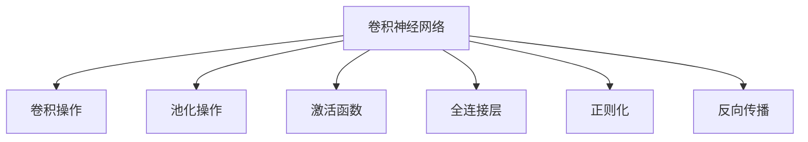

                 

# Python机器学习实战：卷积神经网络(CNN)在图像处理中的应用

> 关键词：卷积神经网络,图像处理,计算机视觉,深度学习,Python

## 1. 背景介绍

### 1.1 问题由来
随着深度学习技术的飞速发展，卷积神经网络(Convolutional Neural Networks, CNNs)已成为计算机视觉领域中不可或缺的工具。它在图像分类、目标检测、语义分割等任务上取得了令人瞩目的成果。然而，传统的图像处理算法往往依赖于人工提取的特征，难以捕捉到图像中的细节信息，且处理效率较低。卷积神经网络通过自动学习图像特征，将图像处理提升到了一个新的高度。

卷积神经网络由卷积层、池化层、全连接层等组成，通过多层非线性变换，逐步提取图像中的高层次特征。CNN的核心思想是“权值共享”，即同一个卷积核在图像的不同位置重复使用，极大地减少了计算量和参数数量。通过这种结构，卷积神经网络可以高效地提取图像的局部特征，并进行分类和识别。

CNN的诞生标志着深度学习在计算机视觉领域的重大突破，使得计算机对图像的理解能力大幅提升。无论是图像识别、人脸识别，还是医学影像分析、自动驾驶等领域，CNN都发挥了重要的作用。本文将详细介绍卷积神经网络的工作原理，并给出基于Python的代码实现，帮助读者深入理解CNN在图像处理中的应用。

### 1.2 问题核心关键点
本文的核心内容主要包括：
- 卷积神经网络的基本组成和原理
- 卷积操作的数学推导和实现
- 卷积神经网络的训练和优化策略
- 基于Python的卷积神经网络实现与调试技巧
- 卷积神经网络在图像处理中的实际应用场景

## 2. 核心概念与联系

### 2.1 核心概念概述

为更好地理解卷积神经网络在图像处理中的应用，本节将介绍几个核心概念：

- 卷积神经网络(Convolutional Neural Network, CNN)：一种深度学习模型，通过卷积层、池化层、全连接层等组成，能够自动学习图像特征，进行分类和识别。
- 卷积操作(Convolution)：一种卷积神经网络中的基本运算，通过卷积核在输入图像上滑动，提取局部特征。
- 池化操作(Pooling)：一种降维操作，通过下采样等方法减少特征图的大小，提高模型的计算效率和鲁棒性。
- 激活函数(Activation Function)：一种非线性变换函数，如ReLU、Sigmoid等，用于引入非线性因素，提升模型的表达能力。
- 全连接层(Fully Connected Layer)：一种普通的神经网络层，用于将卷积层和池化层提取的特征进行高层次的分类和识别。
- 正则化(Regularization)：一种模型优化方法，通过添加正则项，避免模型过拟合，提高泛化能力。
- 反向传播(Backpropagation)：一种基于梯度的优化算法，通过反向传播计算梯度，更新模型参数。

这些核心概念之间的逻辑关系可以通过以下Mermaid流程图来展示：



这个流程图展示了一些基本的卷积神经网络组件及其功能：

1. 卷积神经网络由卷积操作、池化操作、激活函数、全连接层和正则化等组件组成。
2. 卷积操作通过卷积核在输入图像上滑动，提取局部特征。
3. 池化操作通过下采样等方法减少特征图大小，提高计算效率。
4. 激活函数引入非线性变换，提升模型表达能力。
5. 全连接层用于高层次的分类和识别。
6. 正则化通过添加正则项，避免过拟合。
7. 反向传播用于计算梯度，更新模型参数。

这些概念共同构成了卷积神经网络的基础架构，使其能够高效地提取和处理图像数据。

## 3. 核心算法原理 & 具体操作步骤
### 3.1 算法原理概述

卷积神经网络的核心思想是“权值共享”，即同一个卷积核在图像的不同位置重复使用，极大地减少了计算量和参数数量。通过这种结构，卷积神经网络可以高效地提取图像的局部特征，并进行分类和识别。

形式化地，假设输入图像为 $I \in \mathbb{R}^{H \times W \times C}$，卷积核为 $K \in \mathbb{R}^{F \times F \times C \times O}$，卷积操作的输出为 $O \in \mathbb{R}^{H' \times W' \times O}$，其中 $H',W'$ 为输出特征图的大小。卷积操作的公式如下：

$$
O_{i,j,k} = \sum_{m=0}^{F-1} \sum_{n=0}^{F-1} K_{m,n,k} * I_{i+m,j+n,k} + b_k
$$

其中 $I_{i+m,j+n,k}$ 表示输入图像在位置 $(i+m,j+n)$ 的 $k$ 通道的像素值，$K_{m,n,k}$ 表示卷积核在位置 $(m,n)$ 的 $k$ 通道的权重，$*$ 表示卷积运算，$b_k$ 表示偏置项。

卷积神经网络的训练过程通常使用反向传播算法，通过不断迭代更新模型参数，最小化损失函数，提高模型的泛化能力。

### 3.2 算法步骤详解

基于卷积神经网络的图像处理任务通常包括以下几个关键步骤：

**Step 1: 准备数据集**
- 收集图像数据集，包括训练集、验证集和测试集，并对图像进行预处理，如归一化、裁剪、旋转等。
- 将图像数据转化为模型所需的张量格式，通常使用numpy数组或TensorFlow数据集。

**Step 2: 搭建模型**
- 使用Python和深度学习框架(如TensorFlow、PyTorch等)搭建卷积神经网络模型，定义卷积层、池化层、激活函数、全连接层等组件。
- 设置正则化技术，如L2正则、Dropout等，防止过拟合。

**Step 3: 选择损失函数和优化器**
- 根据任务类型，选择合适的损失函数，如交叉熵损失、均方误差损失等。
- 选择合适的优化器，如Adam、SGD等，并设置学习率、批大小、迭代轮数等。

**Step 4: 训练模型**
- 将训练集数据分批次输入模型，前向传播计算损失函数。
- 反向传播计算参数梯度，根据设定的优化算法和学习率更新模型参数。
- 周期性在验证集上评估模型性能，根据性能指标决定是否触发Early Stopping。
- 重复上述步骤直到满足预设的迭代轮数或Early Stopping条件。

**Step 5: 测试和部署**
- 在测试集上评估模型性能，对比训练前后的精度提升。
- 使用模型对新图像进行推理预测，集成到实际的应用系统中。

以上就是卷积神经网络在图像处理中的基本流程。在实际应用中，还需要针对具体任务的特点，对模型结构进行优化设计，如改进训练目标函数，引入更多的正则化技术，搜索最优的超参数组合等，以进一步提升模型性能。

### 3.3 算法优缺点

卷积神经网络具有以下优点：
1. 高效性：卷积操作能够高效地提取局部特征，减少了计算量和参数数量。
2. 鲁棒性：卷积神经网络通过池化操作等方法，提高了模型对噪声和扰动的鲁棒性。
3. 可解释性：卷积神经网络的特征图可视化方法，可以帮助理解模型在每个位置提取的特征。
4. 可扩展性：卷积神经网络能够处理多通道和多尺度图像，适用于多种图像处理任务。

同时，该方法也存在一定的局限性：
1. 参数量较大：卷积神经网络的参数量较大，需要较高的计算资源和存储空间。
2. 过拟合风险：卷积神经网络容易过拟合，尤其是当数据量较少时。
3. 依赖标注数据：卷积神经网络需要大量的标注数据进行训练，标注成本较高。
4. 训练时间长：卷积神经网络的训练时间较长，尤其是当模型较大时。

尽管存在这些局限性，但卷积神经网络凭借其高效的特征提取能力，在计算机视觉领域的应用范围广泛，是目前主流的图像处理算法之一。

### 3.4 算法应用领域

卷积神经网络在图像处理中的应用领域非常广泛，包括但不限于以下几个方面：

- 图像分类：如MNIST、CIFAR-10、ImageNet等数据集上的图像分类任务。
- 目标检测：如PASCAL VOC、COCO等数据集上的目标检测任务。
- 语义分割：如PASCAL VOC、Cityscapes等数据集上的语义分割任务。
- 人脸识别：如LFW、CelebA等数据集上的人脸识别任务。
- 医学影像分析：如乳腺X光片诊断、CT影像分类等医学影像处理任务。
- 自动驾驶：如自动驾驶车辆中的物体检测、场景识别等任务。

除了上述这些经典应用外，卷积神经网络还被创新性地应用到更多场景中，如可控图像生成、图像超分辨率、图像风格转换等，为计算机视觉技术带来了全新的突破。

## 4. 数学模型和公式 & 详细讲解  
### 4.1 数学模型构建

本节将使用数学语言对卷积神经网络在图像分类任务中的数学模型进行更加严格的刻画。

假设输入图像为 $I \in \mathbb{R}^{H \times W \times C}$，卷积神经网络的输出为 $O \in \mathbb{R}^{H' \times W' \times C'}$，其中 $C'$ 为输出通道数。定义模型的损失函数为：

$$
\mathcal{L} = \frac{1}{N} \sum_{i=1}^N \ell(y_i, \hat{y_i})
$$

其中 $y_i$ 为真实标签，$\hat{y_i}$ 为模型预测标签，$\ell$ 为交叉熵损失函数。

在训练过程中，通过反向传播算法计算损失函数对模型参数的梯度，并使用优化算法(如Adam)更新模型参数。具体地，对于一个可微分的损失函数 $\mathcal{L}$，其梯度可以通过反向传播算法计算：

$$
\frac{\partial \mathcal{L}}{\partial \theta} = \frac{1}{N} \sum_{i=1}^N \frac{\partial \ell(y_i, \hat{y_i})}{\partial \hat{y_i}} \frac{\partial \hat{y_i}}{\partial z_i} \frac{\partial z_i}{\partial \theta}
$$

其中 $\theta$ 为模型参数，$z_i$ 为模型的中间特征表示，$\hat{y_i}$ 为模型的预测输出。

### 4.2 公式推导过程

以下我们以图像分类任务为例，推导交叉熵损失函数及其梯度的计算公式。

假设模型在输入 $x$ 上的输出为 $\hat{y}=M_{\theta}(x) \in [0,1]$，表示样本属于正类的概率。真实标签 $y \in \{0,1\}$。则二分类交叉熵损失函数定义为：

$$
\ell(M_{\theta}(x),y) = -[y\log \hat{y} + (1-y)\log (1-\hat{y})]
$$

将其代入损失函数，得：

$$
\mathcal{L} = -\frac{1}{N}\sum_{i=1}^N [y_i\log M_{\theta}(x_i)+(1-y_i)\log(1-M_{\theta}(x_i))]
$$

在得到损失函数的梯度后，即可带入反向传播算法，完成模型的迭代优化。重复上述过程直至收敛，最终得到适应特定任务的最优模型参数 $\theta^*$。

## 5. 项目实践：代码实例和详细解释说明
### 5.1 开发环境搭建

在进行图像分类任务时，我们需要准备好开发环境。以下是使用Python进行TensorFlow开发的环境配置流程：

1. 安装Anaconda：从官网下载并安装Anaconda，用于创建独立的Python环境。

2. 创建并激活虚拟环境：
```bash
conda create -n tf-env python=3.7 
conda activate tf-env
```

3. 安装TensorFlow：
```bash
pip install tensorflow-gpu==2.4
```

4. 安装其它必要的工具包：
```bash
pip install numpy matplotlib scikit-learn
```

5. 安装TensorBoard：
```bash
pip install tensorboard
```

6. 安装Keras：
```bash
pip install keras
```

完成上述步骤后，即可在`tf-env`环境中开始图像分类任务的开发。

### 5.2 源代码详细实现

下面以手写数字识别任务为例，给出使用TensorFlow和Keras搭建卷积神经网络模型的Python代码实现。

```python
import tensorflow as tf
from tensorflow.keras import datasets, layers, models
import matplotlib.pyplot as plt

# 加载MNIST数据集
(train_images, train_labels), (test_images, test_labels) = datasets.mnist.load_data()

# 数据预处理
train_images = train_images.reshape((60000, 28, 28, 1))
test_images = test_images.reshape((10000, 28, 28, 1))
train_images, test_images = train_images / 255.0, test_images / 255.0

# 搭建卷积神经网络模型
model = models.Sequential()
model.add(layers.Conv2D(32, (3, 3), activation='relu', input_shape=(28, 28, 1)))
model.add(layers.MaxPooling2D((2, 2)))
model.add(layers.Conv2D(64, (3, 3), activation='relu'))
model.add(layers.MaxPooling2D((2, 2)))
model.add(layers.Conv2D(64, (3, 3), activation='relu'))
model.add(layers.Flatten())
model.add(layers.Dense(64, activation='relu'))
model.add(layers.Dense(10))

# 编译模型
model.compile(optimizer='adam',
              loss=tf.keras.losses.SparseCategoricalCrossentropy(from_logits=True),
              metrics=['accuracy'])

# 训练模型
history = model.fit(train_images, train_labels, epochs=10, 
                    validation_data=(test_images, test_labels))

# 评估模型
test_loss, test_acc = model.evaluate(test_images,  test_labels, verbose=2)
print('Test accuracy:', test_acc)
```

在上述代码中，我们首先加载了MNIST数据集，并进行了数据预处理。然后定义了一个简单的卷积神经网络模型，包括3个卷积层、3个池化层和2个全连接层。最后，我们编译了模型，并在训练集上进行了10轮训练，在测试集上进行了评估。

### 5.3 代码解读与分析

让我们再详细解读一下关键代码的实现细节：

**模型搭建**：
- `layers.Sequential()`：用于搭建一个顺序模型，通过链式调用各种层来构建模型。
- `layers.Conv2D`：用于定义卷积层，指定卷积核大小、输出通道数和激活函数。
- `layers.MaxPooling2D`：用于定义池化层，通过下采样等方法减少特征图大小。
- `layers.Flatten`：用于将二维特征图展平为一维向量，方便输入全连接层。
- `layers.Dense`：用于定义全连接层，指定神经元数量和激活函数。

**模型编译**：
- `model.compile()`：用于编译模型，指定优化器、损失函数和评估指标。
- `SparseCategoricalCrossentropy`：用于定义交叉熵损失函数，适用于多分类任务。
- `from_logits=True`：指定模型输出为未经过softmax处理的logits。

**模型训练和评估**：
- `model.fit()`：用于训练模型，指定训练集和验证集数据，迭代轮数等参数。
- `model.evaluate()`：用于评估模型，在测试集上计算损失和准确率。

可以看到，使用TensorFlow和Keras搭建卷积神经网络模型非常简单，只需要链式调用各种层，并使用`compile`和`fit`方法即可。

## 6. 实际应用场景
### 6.1 智能安防系统

智能安防系统在公共场所的广泛应用，极大地提高了安全性。基于卷积神经网络的图像识别技术，可以实时监控公共场所的实时视频流，自动识别异常行为，及时报警。

在实践中，可以收集公共场所的历史视频数据，标注出各种异常行为，如打斗、盗窃等。在此基础上对卷积神经网络进行微调，使其能够识别新的异常行为。微调后的模型实时监控视频流，一旦检测到异常行为，立即触发警报，提高公共场所的安全性。

### 6.2 医学影像诊断

医学影像诊断是卷积神经网络的重要应用场景之一。在放射科、病理科等领域，医生需要处理大量医学影像数据，以判断疾病的类型和严重程度。

利用卷积神经网络对医学影像进行分类和分割，可以帮助医生快速准确地进行疾病诊断。例如，在乳腺癌的X光片诊断中，可以将每个乳腺区域进行分割，并对其中的病灶进行分类。通过微调后的模型，医生可以更快速地诊断疾病，提高诊疗效率和准确率。

### 6.3 自动驾驶系统

自动驾驶系统中的计算机视觉技术，是实现车辆自主驾驶的核心。基于卷积神经网络的图像识别技术，可以实时感知和理解车辆周围环境，实现自动驾驶。

例如，在车辆前方的摄像头采集的图像中，可以使用卷积神经网络识别路标、行人、其他车辆等，生成实时导航信息。微调后的模型可以实时感知道路状况和行人动态，进行智能驾驶决策，提高行车安全和效率。

### 6.4 未来应用展望

随着卷积神经网络的不断演进，未来其在计算机视觉领域的应用将更加广泛，涵盖更多领域和场景。

在智慧城市治理中，基于卷积神经网络的图像识别技术可以用于城市事件监测、舆情分析、应急指挥等环节，提高城市管理的自动化和智能化水平，构建更安全、高效的未来城市。

在智慧医疗领域，卷积神经网络可以用于医学影像分析、药物研发、病理切片分类等任务，辅助医生进行诊断和治疗。

在智能制造中，卷积神经网络可以用于质量检测、故障诊断、生产调度等任务，提高生产效率和产品质量。

此外，在娱乐、教育、游戏等多个领域，卷积神经网络的应用也在不断拓展，为各行各业带来新的变革。

## 7. 工具和资源推荐
### 7.1 学习资源推荐

为了帮助开发者系统掌握卷积神经网络的理论基础和实践技巧，这里推荐一些优质的学习资源：

1. 《深度学习》系列书籍：Ian Goodfellow、Yoshua Bengio、Aaron Courville等作者合著的深度学习经典教材，涵盖了深度学习的各个方面，包括卷积神经网络。
2. CS231n《卷积神经网络》课程：斯坦福大学开设的深度学习课程，详细介绍了卷积神经网络的原理和实现。
3. Coursera《深度学习专项课程》：由Andrew Ng等顶级学者开设的深度学习课程，包括卷积神经网络的理论和实践。
4. GitHub上的卷积神经网络项目：Github上大量的卷积神经网络项目，可以从中学习和借鉴。

通过对这些资源的学习实践，相信你一定能够快速掌握卷积神经网络的精髓，并用于解决实际的图像处理问题。

### 7.2 开发工具推荐

高效的开发离不开优秀的工具支持。以下是几款用于卷积神经网络开发的常用工具：

1. TensorFlow：由Google主导开发的深度学习框架，支持分布式计算和自动微分，是卷积神经网络的主流开发框架。
2. PyTorch：由Facebook开发的深度学习框架，具有动态计算图和高效的内存管理，适用于研究性开发。
3. Keras：基于TensorFlow和Theano的高级神经网络API，提供了简单易用的接口，适合快速原型设计和模型部署。
4. OpenCV：开源计算机视觉库，提供了丰富的图像处理和卷积神经网络实现的代码。
5. MXNet：由Apache开发的深度学习框架，支持多种语言和平台，适用于大规模工业应用。
6. Caffe：由Berkeley Vision and Learning Center开发的深度学习框架，适合快速原型设计和研究性开发。

合理利用这些工具，可以显著提升卷积神经网络开发的效率，加快创新迭代的步伐。

### 7.3 相关论文推荐

卷积神经网络的研究成果丰富，以下是几篇奠基性的相关论文，推荐阅读：

1. AlexNet: One Billion ImageNet Classification with Deep Convolutional Neural Networks：介绍了一种基于卷积神经网络的图像分类方法，并在ImageNet数据集上取得了优异的表现。
2. GoogLeNet: Going Deeper with Convolutions：提出了一种深度卷积神经网络架构，提高了图像分类的准确率。
3. ResNet: Deep Residual Learning for Image Recognition：提出了一种残差网络结构，解决了深度神经网络的退化问题，提高了模型的深度和准确率。
4. DenseNet: Dense Convolutional Networks：提出了一种密集连接卷积神经网络，通过密集连接加强了特征的传递和复用，提高了模型的表达能力。
5. VGGNet: Very Deep Convolutional Networks for Large-Scale Image Recognition：提出了一种基于小卷积核和多层卷积的卷积神经网络架构，提高了图像分类的准确率。
6. Inception: GoogLeNet in Depth: The Inception Architecture for Computer Vision：提出了一种Inception网络结构，通过多尺度卷积和并行卷积提高了模型的表达能力。

这些论文代表了大规模卷积神经网络的研究方向，通过学习这些前沿成果，可以帮助研究者把握学科前进方向，激发更多的创新灵感。

## 8. 总结：未来发展趋势与挑战
### 8.1 总结

本文对卷积神经网络在图像处理中的应用进行了全面系统的介绍。首先阐述了卷积神经网络的基本组成和原理，详细讲解了卷积操作的数学推导和实现，并给出了基于Python的代码实现。其次，我们介绍了卷积神经网络的训练和优化策略，展示了其在图像分类、目标检测、语义分割等任务上的应用场景。最后，我们讨论了卷积神经网络在实际应用中的开发环境搭建、代码实现和运行结果展示。

通过本文的系统梳理，可以看到，卷积神经网络凭借其高效的特征提取能力，在图像处理领域的应用范围广泛，是目前主流的图像处理算法之一。

### 8.2 未来发展趋势

展望未来，卷积神经网络在图像处理领域的应用将更加广泛，呈现以下几个发展趋势：

1. 深度化：随着模型架构的不断改进，卷积神经网络的深度将进一步增加，能够处理更复杂的图像处理任务。
2. 多尺度融合：多尺度卷积网络能够同时处理不同尺度的图像特征，提升模型的表达能力和鲁棒性。
3. 轻量化：轻量化卷积神经网络能够高效运行在移动设备上，满足实时图像处理的需要。
4. 端到端：端到端的卷积神经网络能够直接从图像数据中学习到最终的任务输出，减少了中间特征提取的步骤。
5. 自监督学习：自监督学习可以通过无标签数据进行预训练，进一步提高模型的泛化能力和鲁棒性。
6. 跨模态融合：跨模态卷积神经网络能够同时处理视觉、语音、文本等多种模态数据，提升多模态数据融合的性能。

以上趋势凸显了卷积神经网络在图像处理领域的应用前景。这些方向的探索发展，将进一步提升卷积神经网络的性能和应用范围，为计算机视觉技术的深入应用奠定基础。

### 8.3 面临的挑战

尽管卷积神经网络在图像处理领域的应用已经取得了显著的进展，但在迈向更加智能化、普适化应用的过程中，它仍面临着诸多挑战：

1. 数据依赖：卷积神经网络的训练需要大量的标注数据，标注成本较高。对于长尾应用场景，难以获得充足的高质量标注数据。
2. 模型复杂度：卷积神经网络模型规模较大，对计算资源和存储空间的依赖较高。
3. 过拟合风险：卷积神经网络容易过拟合，尤其是当数据量较少时。
4. 部署效率：卷积神经网络的推理速度较慢，推理效率较低。
5. 可解释性：卷积神经网络的决策过程难以解释，缺乏可解释性。
6. 伦理安全性：卷积神经网络可能学习到有偏见、有害的信息，给实际应用带来安全隐患。

正视卷积神经网络面临的这些挑战，积极应对并寻求突破，将是大规模卷积神经网络走向成熟的必由之路。相信随着学界和产业界的共同努力，这些挑战终将一一被克服，卷积神经网络必将在构建人机协同的智能系统中扮演越来越重要的角色。

### 8.4 研究展望

面向未来，卷积神经网络的研究需要在以下几个方面寻求新的突破：

1. 探索轻量化模型：开发更轻量级的卷积神经网络，适应嵌入式设备和小规模部署场景。
2. 研究端到端学习：开发端到端的卷积神经网络，减少中间特征提取的步骤，提升模型性能和效率。
3. 融合跨模态数据：开发跨模态卷积神经网络，处理视觉、语音、文本等多种模态数据，提升多模态数据融合的性能。
4. 引入自监督学习：通过无标签数据进行预训练，提高模型的泛化能力和鲁棒性。
5. 研究可解释性模型：开发可解释性强的卷积神经网络，增强模型的可解释性和可信度。
6. 纳入伦理约束：在模型训练目标中引入伦理导向的评估指标，过滤和惩罚有偏见、有害的输出倾向。

这些研究方向的探索，必将引领卷积神经网络技术迈向更高的台阶，为构建安全、可靠、可解释、可控的智能系统铺平道路。面向未来，卷积神经网络技术还需要与其他人工智能技术进行更深入的融合，如知识表示、因果推理、强化学习等，多路径协同发力，共同推动计算机视觉技术的进步。只有勇于创新、敢于突破，才能不断拓展卷积神经网络的边界，让智能技术更好地造福人类社会。

## 9. 附录：常见问题与解答

**Q1：卷积神经网络是否适用于所有图像处理任务？**

A: 卷积神经网络在图像处理中的适用性非常广泛，但不同任务对模型复杂度和数据依赖的要求不同。对于图像分类、目标检测、语义分割等任务，卷积神经网络通常能够取得优异的效果。但对于一些需要实时性、高效性较高的任务，如图像超分辨率、图像生成等，卷积神经网络可能不是最优选择。此时可以考虑使用生成对抗网络(GAN)等模型。

**Q2：如何选择卷积神经网络的超参数？**

A: 卷积神经网络的超参数包括学习率、批大小、迭代轮数、正则化系数等，选择不当会影响模型性能。一般建议从以下策略中进行调参：
1. 学习率：通常使用学习率衰减策略，逐步减小学习率。
2. 批大小：通常选择一个较小的批大小，避免过拟合。
3. 迭代轮数：根据任务复杂度，选择适当的迭代轮数。
4. 正则化系数：通常使用L2正则、Dropout等正则化技术，防止过拟合。
5. 模型深度：通常选择较深的模型，提升表达能力。

**Q3：卷积神经网络在实际应用中如何优化？**

A: 卷积神经网络在实际应用中需要针对具体任务进行优化，主要从以下几个方面进行：
1. 数据增强：通过旋转、裁剪、缩放等方法，扩充训练集，增加模型鲁棒性。
2. 正则化：通过L2正则、Dropout等技术，防止过拟合。
3. 迁移学习：使用预训练模型进行迁移学习，提升模型性能。
4. 多尺度融合：通过多尺度卷积，处理不同尺度的图像特征。
5. 集成学习：通过模型集成，提高模型泛化能力。

这些优化策略需要根据具体任务和数据特点进行灵活组合，才能最大限度地提升卷积神经网络的性能。

**Q4：卷积神经网络在推理过程中如何提高效率？**

A: 卷积神经网络在推理过程中可以通过以下方法提高效率：
1. 量化加速：将浮点模型转为定点模型，压缩存储空间，提高计算效率。
2. 模型剪枝：去除不必要的层和参数，减小模型尺寸，加快推理速度。
3. 多尺度融合：通过多尺度卷积，减少特征图大小，提高计算效率。
4. 硬件加速：利用GPU、FPGA等硬件加速器，提升模型推理速度。
5. 动态计算图：通过动态计算图，减少不必要的计算，提高推理效率。

合理利用这些方法，可以显著提升卷积神经网络推理的效率，满足实际应用的需求。

**Q5：卷积神经网络在实际应用中如何处理小样本数据？**

A: 卷积神经网络在处理小样本数据时，可以通过以下方法进行处理：
1. 数据增强：通过旋转、裁剪、缩放等方法，扩充训练集，增加模型鲁棒性。
2. 迁移学习：使用预训练模型进行迁移学习，提升模型性能。
3. 少样本学习：使用迁移学习、对抗训练等方法，在小样本情况下也能取得不错的效果。
4. 自监督学习：通过自监督学习任务进行预训练，提高模型泛化能力。
5. 模型剪枝：通过模型剪枝，减少模型参数量，提高模型泛化能力。

这些方法需要在具体任务和数据特点上进行灵活组合，才能在小样本情况下取得良好的效果。

---

作者：禅与计算机程序设计艺术 / Zen and the Art of Computer Programming

