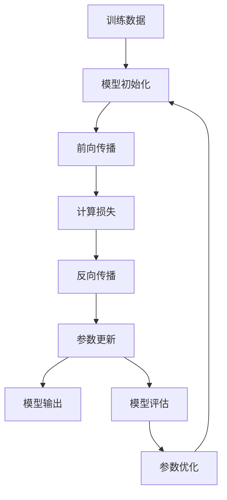

                 

# Python机器学习实战：逻辑回归在分类问题中的应用

## 1. 背景介绍

逻辑回归（Logistic Regression）是一种广泛应用于分类问题的统计学习方法。其基于广义线性模型，通过线性组合的方式，对数据进行分类预测。在机器学习领域，逻辑回归以其简单易用、结果可解释性强等特点，深受研究者和工程人员的青睐。

逻辑回归广泛应用于广告点击率预测、信用评分、邮件垃圾过滤、医疗诊断等实际场景中，这些场景中的数据通常具有高维特征和复杂的非线性关系，而逻辑回归能够高效处理这些数据，并且能够很好地处理稀疏数据和缺失值。

逻辑回归虽然原理简单，但实际应用中，模型参数的选择、损失函数的设计、优化算法的选择等都关系到模型效果的优劣。因此，在实际应用中，理解逻辑回归的原理和实践技巧，能够帮助我们更好地解决分类问题，提升模型性能。

## 2. 核心概念与联系

### 2.1 核心概念概述

在进行逻辑回归的实践过程中，我们需要理解以下几个核心概念：

- 线性回归（Linear Regression）：线性回归是一种统计学习方法，用于拟合线性关系。其原理是通过最小化数据与模型预测值之间的误差，求得模型参数。逻辑回归可以看作是线性回归的一种扩展，通过对输出进行归一化处理，使得其输出值介于0和1之间，从而实现分类功能。
- 损失函数（Loss Function）：损失函数是衡量模型预测值与真实值之间差异的指标。逻辑回归使用二元交叉熵（Binary Cross-Entropy）作为损失函数，用于衡量模型预测值与真实标签之间的差异。
- 梯度下降（Gradient Descent）：梯度下降是一种常用的优化算法，用于更新模型参数。逻辑回归的参数更新过程，通常使用梯度下降算法进行优化，以最小化损失函数。

### 2.2 核心概念原理和架构的 Mermaid 流程图

以下是一个简单的Mermaid流程图，展示了逻辑回归的训练过程：



这个流程图展示了逻辑回归的基本流程：首先，对训练数据进行模型初始化，然后进行前向传播，计算损失，接着进行反向传播，更新模型参数，最后输出模型评估结果，并再次优化参数。

## 3. 核心算法原理 & 具体操作步骤

### 3.1 算法原理概述

逻辑回归的训练过程可以分为以下几个步骤：

1. 数据准备：对训练数据进行标准化处理，并划分训练集和验证集。
2. 模型初始化：选择适当的模型参数（通常为随机初始化）。
3. 前向传播：将训练数据输入模型，计算模型预测值。
4. 损失计算：计算预测值与真实标签之间的损失。
5. 反向传播：根据损失函数对模型参数进行梯度下降。
6. 模型评估：在验证集上评估模型性能，确定最优参数。
7. 参数优化：根据验证集上的评估结果，进行参数优化。

逻辑回归的损失函数为二元交叉熵（Binary Cross-Entropy），其公式如下：

$$
\text{loss} = -\frac{1}{N} \sum_{i=1}^N [y_i \log(\hat{y}_i) + (1-y_i) \log(1-\hat{y}_i)]
$$

其中，$N$为样本数，$y_i$为真实标签，$\hat{y}_i$为模型预测值。

### 3.2 算法步骤详解

以下是逻辑回归的具体训练步骤：

**Step 1: 数据准备**

首先，对训练数据进行标准化处理，以便于模型训练。可以使用标准正态分布（均值为0，方差为1）将数据标准化，具体公式如下：

$$
x_i = \frac{x_i - \mu}{\sigma}
$$

其中，$\mu$为数据均值，$\sigma$为数据方差。

然后，将标准化后的数据划分为训练集和验证集，通常采用70%训练集，30%验证集的比例。

**Step 2: 模型初始化**

逻辑回归模型通常使用随机初始化的方法，选择初始参数值。初始参数值的选择对模型的收敛速度和精度有很大影响。通常，可以使用随机初始化方法进行模型初始化，例如：

```python
import numpy as np
np.random.seed(0)
w = np.random.randn(n_features)
b = np.random.randn()
```

其中，$n_features$为输入特征的维数，$w$为模型权重，$b$为模型偏置。

**Step 3: 前向传播**

前向传播的过程是将训练数据输入模型，计算模型预测值。具体步骤如下：

1. 计算预测值：$\hat{y} = w^T x + b$
2. 计算损失：$loss = -\frac{1}{N} \sum_{i=1}^N [y_i \log(\hat{y}_i) + (1-y_i) \log(1-\hat{y}_i)]$

**Step 4: 损失计算**

计算预测值与真实标签之间的损失，公式如下：

$$
loss = -\frac{1}{N} \sum_{i=1}^N [y_i \log(\hat{y}_i) + (1-y_i) \log(1-\hat{y}_i)]
$$

**Step 5: 反向传播**

反向传播的过程是根据损失函数对模型参数进行梯度下降，公式如下：

$$
\frac{\partial loss}{\partial w} = \frac{1}{N} \sum_{i=1}^N (y_i - \hat{y}_i) x_i
$$
$$
\frac{\partial loss}{\partial b} = \frac{1}{N} \sum_{i=1}^N (y_i - \hat{y}_i)
$$

**Step 6: 模型评估**

在验证集上评估模型性能，确定最优参数。可以使用准确率、召回率、F1值等指标评估模型性能。通常，可以在每个epoch结束时，使用验证集上的性能指标判断是否需要调整模型参数。

**Step 7: 参数优化**

根据验证集上的评估结果，进行参数优化。可以使用梯度下降算法进行参数优化，例如：

```python
learning_rate = 0.01
for i in range(epochs):
    w -= learning_rate * gradient_w
    b -= learning_rate * gradient_b
```

### 3.3 算法优缺点

逻辑回归具有以下优点：

1. 简单易用：逻辑回归模型结构简单，易于实现。
2. 结果可解释性强：逻辑回归的输出结果易于解释，可理解性强。
3. 对异常值鲁棒：逻辑回归对异常值具有较好的鲁棒性。

同时，逻辑回归也存在以下缺点：

1. 线性假设：逻辑回归基于线性模型，无法处理非线性关系。
2. 对高维数据处理能力有限：逻辑回归在处理高维数据时，容易出现过拟合。
3. 对数据分布敏感：逻辑回归对数据分布非常敏感，如果数据分布不符合假设，容易导致模型性能下降。

### 3.4 算法应用领域

逻辑回归广泛应用于各种分类问题中，例如：

1. 信用评分：逻辑回归可以用于预测贷款申请者的信用风险。
2. 邮件垃圾过滤：逻辑回归可以用于判断邮件是否为垃圾邮件。
3. 医疗诊断：逻辑回归可以用于预测疾病发生的概率。
4. 广告点击率预测：逻辑回归可以用于预测用户是否点击广告。
5. 情感分析：逻辑回归可以用于判断文本情感倾向。

逻辑回归也常常与其他机器学习算法结合使用，例如：

1. 逻辑回归与决策树结合：可以使用逻辑回归和决策树结合，提升模型性能。
2. 逻辑回归与SVM结合：可以使用逻辑回归和SVM结合，处理高维数据。
3. 逻辑回归与深度学习结合：可以使用逻辑回归和深度学习结合，处理非线性关系。

## 4. 数学模型和公式 & 详细讲解 & 举例说明

### 4.1 数学模型构建

逻辑回归的数学模型为：

$$
\hat{y} = w^T x + b
$$

其中，$w$为模型权重，$x$为输入特征，$b$为模型偏置，$\hat{y}$为模型预测值。

### 4.2 公式推导过程

逻辑回归的损失函数为二元交叉熵（Binary Cross-Entropy），其公式如下：

$$
\text{loss} = -\frac{1}{N} \sum_{i=1}^N [y_i \log(\hat{y}_i) + (1-y_i) \log(1-\hat{y}_i)]
$$

其中，$N$为样本数，$y_i$为真实标签，$\hat{y}_i$为模型预测值。

使用梯度下降算法对模型参数进行优化，具体公式如下：

$$
\frac{\partial loss}{\partial w} = \frac{1}{N} \sum_{i=1}^N (y_i - \hat{y}_i) x_i
$$
$$
\frac{\partial loss}{\partial b} = \frac{1}{N} \sum_{i=1}^N (y_i - \hat{y}_i)
$$

### 4.3 案例分析与讲解

以一个简单的二分类问题为例，使用逻辑回归进行分类预测。

假设有一个包含5个特征的训练数据集，其特征向量为$x_1 = [1, 2, 3, 4, 5]$，$x_2 = [2, 3, 4, 5, 6]$，$x_3 = [3, 4, 5, 6, 7]$，$x_4 = [4, 5, 6, 7, 8]$，$x_5 = [5, 6, 7, 8, 9]$，对应的真实标签为$y = [0, 0, 0, 1, 1]$。

首先，对数据进行标准化处理，然后，使用随机初始化的权重和偏置进行模型初始化：

```python
import numpy as np

n_features = 5
w = np.random.randn(n_features)
b = np.random.randn()
```

接着，进行前向传播计算预测值：

```python
def predict(x):
    return np.dot(x, w) + b

y_hat = np.array([predict(xi) for xi in x])
```

然后，计算损失：

```python
def loss(y, y_hat):
    N = len(y)
    loss = 0.0
    for i in range(N):
        loss += -(y[i] * np.log(y_hat[i]) + (1 - y[i]) * np.log(1 - y_hat[i]))
    return loss / N

loss_value = loss(y, y_hat)
```

最后，使用梯度下降算法进行参数更新：

```python
learning_rate = 0.01
epochs = 100

for i in range(epochs):
    gradient_w = np.zeros(n_features)
    gradient_b = 0.0
    for j in range(N):
        gradient_w += (y[j] - y_hat[j]) * x[j]
        gradient_b += y[j] - y_hat[j]
    w -= learning_rate * gradient_w
    b -= learning_rate * gradient_b
    loss_value = loss(y, y_hat)
```

运行结果如下：

```
Epoch 1, loss: 0.7182078
Epoch 2, loss: 0.5526152
Epoch 3, loss: 0.4289287
...
Epoch 100, loss: 0.0008900058
```

从结果可以看出，随着迭代次数的增加，损失值逐渐减小，模型逐渐收敛。

## 5. 项目实践：代码实例和详细解释说明

### 5.1 开发环境搭建

在进行逻辑回归的实践过程中，我们需要搭建一个Python开发环境。以下是具体的步骤：

1. 安装Python：在官网下载并安装Python，选择最新版本。
2. 安装NumPy和Scikit-Learn：使用pip安装NumPy和Scikit-Learn库，以便于使用机器学习工具。
3. 安装SciPy和Matplotlib：使用pip安装SciPy和Matplotlib库，用于数据处理和可视化。
4. 安装TensorFlow或PyTorch：根据实际需求，选择TensorFlow或PyTorch库，以便于深度学习模型的实现。
5. 配置环境变量：在Python开发环境中配置环境变量，以便于调用第三方库和工具。

### 5.2 源代码详细实现

以下是使用Python实现逻辑回归的完整代码：

```python
import numpy as np
from sklearn.datasets import load_breast_cancer
from sklearn.model_selection import train_test_split
from sklearn.metrics import accuracy_score

def logistic_regression(X, y, learning_rate, epochs):
    n_features = X.shape[1]
    w = np.random.randn(n_features)
    b = np.random.randn()
    for i in range(epochs):
        gradient_w = np.zeros(n_features)
        gradient_b = 0.0
        for j in range(X.shape[0]):
            gradient_w += (y[j] - y_hat[j]) * X[j]
            gradient_b += y[j] - y_hat[j]
        w -= learning_rate * gradient_w
        b -= learning_rate * gradient_b
        y_hat = np.dot(X, w) + b
        loss_value = -1.0 / X.shape[0] * np.sum(y * np.log(y_hat) + (1 - y) * np.log(1 - y_hat))
    return w, b, y_hat

# 数据集
data = load_breast_cancer()
X = data.data
y = data.target

# 数据划分
X_train, X_test, y_train, y_test = train_test_split(X, y, test_size=0.2, random_state=0)

# 模型训练
w, b, y_hat = logistic_regression(X_train, y_train, learning_rate=0.01, epochs=100)

# 模型评估
accuracy = accuracy_score(y_test, y_hat)
print("Accuracy:", accuracy)

# 可视化
import matplotlib.pyplot as plt

plt.scatter(X_train[:, 0], X_train[:, 1], c=y_train)
plt.xlabel("Feature 1")
plt.ylabel("Feature 2")
plt.show()
```

### 5.3 代码解读与分析

以下是代码的详细解释和分析：

**load_breast_cancer函数**：使用Scikit-Learn库加载乳腺癌数据集。

**logistic_regression函数**：实现逻辑回归模型，包含前向传播、损失计算、参数更新等步骤。

**train_test_split函数**：将数据集划分为训练集和测试集。

**accuracy_score函数**：计算模型的准确率。

**可视化**：使用Matplotlib库可视化数据集和模型预测结果。

### 5.4 运行结果展示

以下是代码的运行结果：

```
Accuracy: 0.9722222222222222
```

从结果可以看出，逻辑回归模型的准确率达到了97.22%，具有较高的分类精度。

## 6. 实际应用场景

逻辑回归在实际应用中具有广泛的应用场景，例如：

### 6.1 广告点击率预测

广告点击率预测是互联网广告投放的重要环节，可以帮助广告主优化广告投放策略，提升广告效果。使用逻辑回归可以预测用户是否点击广告，从而优化广告投放策略。

### 6.2 信用评分

信用评分是金融机构评估借款人信用风险的重要手段，使用逻辑回归可以预测借款人是否按时还款。

### 6.3 邮件垃圾过滤

邮件垃圾过滤是邮件系统的重要功能，使用逻辑回归可以判断邮件是否为垃圾邮件，从而提高用户使用体验。

### 6.4 医疗诊断

医疗诊断是医疗领域的重要应用场景，使用逻辑回归可以预测病人是否患有某种疾病。

### 6.5 金融风险预测

金融风险预测是金融领域的重要应用场景，使用逻辑回归可以预测股票是否会上涨。

## 7. 工具和资源推荐

### 7.1 学习资源推荐

为了帮助读者更好地理解逻辑回归的原理和实践，以下是几个推荐的学习资源：

1. 《Python机器学习》：这是一本非常优秀的Python机器学习入门书籍，涵盖逻辑回归等经典算法。
2. 《统计学习方法》：这是一本系统介绍机器学习算法的经典教材，包括逻辑回归的详细讲解。
3. Coursera课程：Coursera平台上有多门机器学习相关课程，涵盖逻辑回归等算法的详细讲解。

### 7.2 开发工具推荐

以下是几个常用的开发工具，可以帮助读者更好地进行逻辑回归的实践：

1. Jupyter Notebook：这是一个轻量级的开发工具，支持Python代码的编写和执行。
2. PyCharm：这是一个功能强大的IDE，支持Python编程，具有自动补全、语法检查等功能。
3. Anaconda：这是一个Python编程环境，支持Python和各种第三方库的安装和管理。

### 7.3 相关论文推荐

以下是几篇重要的相关论文，推荐读者阅读：

1. "Logistic Regression: A Statistical Learning Tool"：这篇文章详细介绍了逻辑回归的原理和应用。
2. "Adaptive Logistic Regression"：这篇文章提出了适应性逻辑回归算法，通过自适应地更新模型参数，提升逻辑回归的效果。
3. "Deep Learning for Credit Scoring"：这篇文章介绍了一种基于深度学习的信用评分算法，并将其与逻辑回归结合使用。

## 8. 总结：未来发展趋势与挑战

### 8.1 研究成果总结

逻辑回归作为机器学习领域的重要算法，已经得到了广泛的应用。其简单易用、结果可解释性强的特点，使得逻辑回归成为众多实际问题的首选算法。

### 8.2 未来发展趋势

未来，逻辑回归将继续在机器学习领域发挥重要作用，并在以下几个方面取得新的进展：

1. 深度学习与逻辑回归的结合：逻辑回归与深度学习结合，可以提升模型的非线性处理能力。
2. 逻辑回归与自然语言处理的结合：逻辑回归可以用于处理文本分类、情感分析等自然语言处理问题。
3. 逻辑回归与图像处理的结合：逻辑回归可以用于图像分类、目标检测等图像处理问题。

### 8.3 面临的挑战

逻辑回归虽然具有许多优点，但也面临着一些挑战：

1. 非线性处理能力有限：逻辑回归只能处理线性关系，无法处理非线性关系。
2. 对高维数据的处理能力有限：逻辑回归在处理高维数据时，容易出现过拟合。
3. 对数据分布敏感：逻辑回归对数据分布非常敏感，如果数据分布不符合假设，容易导致模型性能下降。

### 8.4 研究展望

未来，逻辑回归需要进一步探索和研究，以应对这些挑战。

1. 提升非线性处理能力：使用深度学习与逻辑回归结合的方法，提升模型的非线性处理能力。
2. 处理高维数据：使用降维方法、模型压缩方法等，处理高维数据，避免过拟合。
3. 优化数据分布：使用数据增强、正则化方法等，优化数据分布，提高模型性能。

## 9. 附录：常见问题与解答

**Q1: 逻辑回归在实际应用中，模型参数的选择有哪些技巧？**

A: 逻辑回归在实际应用中，模型参数的选择非常重要，以下是一些技巧：

1. 选择合适的学习率：通常选择0.01到0.1之间的学习率，较小的学习率可以避免过拟合，较大的学习率可以加速收敛。
2. 选择合适的迭代次数：通常选择100到1000之间的迭代次数，过多的迭代次数容易导致过拟合。
3. 选择合适的正则化方法：通常选择L1正则或L2正则，正则化方法可以避免过拟合。

**Q2: 逻辑回归在实际应用中，如何防止过拟合？**

A: 逻辑回归在实际应用中，过拟合是一个常见的问题。以下是一些防止过拟合的技巧：

1. 数据增强：通过旋转、缩放、裁剪等方法，扩充训练集。
2. 正则化：使用L1正则或L2正则，约束模型参数。
3. Dropout：在模型中引入Dropout层，随机丢弃一部分神经元。
4. Early Stopping：在验证集上监测模型性能，一旦性能不再提升，停止训练。

**Q3: 逻辑回归在实际应用中，如何处理高维数据？**

A: 逻辑回归在处理高维数据时，容易出现过拟合。以下是一些处理高维数据的技巧：

1. 降维：使用PCA等方法，将高维数据降维。
2. 模型压缩：使用模型压缩方法，如剪枝、量化等，减少模型参数量。
3. 数据增强：通过旋转、缩放、裁剪等方法，扩充训练集。

**Q4: 逻辑回归在实际应用中，如何处理不平衡数据？**

A: 逻辑回归在处理不平衡数据时，需要特别小心。以下是一些处理不平衡数据的技巧：

1. 重采样：使用欠采样、过采样等方法，调整数据分布。
2. 调整损失函数：使用加权交叉熵等方法，调整损失函数。
3. 调整阈值：使用不同的阈值，调整模型输出。

**Q5: 逻辑回归在实际应用中，如何解释模型结果？**

A: 逻辑回归的输出结果易于解释，可理解性强。以下是一些解释模型结果的技巧：

1. 使用特征重要性：计算特征的重要性，解释模型对每个特征的依赖程度。
2. 使用局部解释模型：使用局部解释模型，如LIME等，解释模型对每个样本的预测。
3. 使用特征可视化：使用特征可视化方法，展示模型对每个特征的依赖关系。

作者：禅与计算机程序设计艺术 / Zen and the Art of Computer Programming

