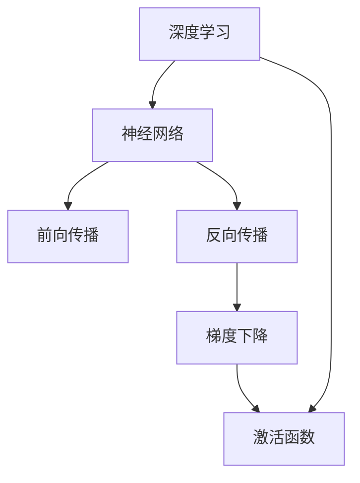

                 

# Python深度学习实践：入门篇 - 你的第一个神经网络

> 关键词：Python,深度学习,神经网络, TensorFlow, PyTorch, 机器学习, 梯度下降

## 1. 背景介绍

### 1.1 问题由来
深度学习，特别是神经网络的应用，已经成为机器学习领域最为热门的分支之一。神经网络通过对大量数据的学习，可以自动发现数据中的模式，并应用于各种领域，如图像识别、语音识别、自然语言处理等。虽然深度学习在学术界已经取得了很多成果，但是在工业界的实际应用仍存在一定的难度。本系列文章将通过Python深度学习实践，一步步带你构建第一个神经网络，实现机器学习的基本应用。

### 1.2 问题核心关键点
本系列文章将涵盖以下几个关键点：
1. 深度学习的背景与原理。
2. 如何选择合适的深度学习框架。
3. 神经网络的基本结构。
4. 前向传播与反向传播算法。
5. 梯度下降算法的实现。
6. 搭建、训练与评估神经网络的基本流程。

## 2. 核心概念与联系

### 2.1 核心概念概述

为更好地理解深度学习的神经网络构建，本节将介绍几个密切相关的核心概念：

- 深度学习：利用多层神经网络对数据进行非线性映射，从而提取数据的高级特征。
- 神经网络：由神经元（节点）和连接权重构成的计算图，用于对数据进行建模。
- 前向传播：输入数据经过神经网络的逐层处理，最终输出预测结果的过程。
- 反向传播：通过链式法则，计算损失函数对网络参数的梯度，用于模型训练。
- 梯度下降：一种常用的优化算法，用于迭代更新模型参数，使损失函数最小化。
- 激活函数：用于给神经元增加非线性变换，常用如ReLU、Sigmoid等。

这些核心概念之间的逻辑关系可以通过以下Mermaid流程图来展示：



这个流程图展示出深度学习中神经网络的重要组成部分及其之间的关系：

1. 深度学习通过多层神经网络对数据进行建模，其中神经网络是核心计算单元。
2. 前向传播用于输入数据通过神经网络逐层传递，最终输出预测结果。
3. 反向传播用于计算损失函数对网络参数的梯度，用于模型训练。
4. 梯度下降算法用于迭代更新模型参数，使损失函数最小化。
5. 激活函数用于给神经元增加非线性变换，提升模型的表达能力。

这些核心概念共同构成了深度学习模型的计算逻辑和训练流程，使得神经网络能够有效地进行复杂数据的建模和预测。

## 3. 核心算法原理 & 具体操作步骤

### 3.1 算法原理概述

深度学习的核心在于神经网络的构建和训练。神经网络通过多个层次的非线性变换，学习数据的高级特征。神经网络的训练过程是通过前向传播和反向传播算法实现的。

神经网络的前向传播过程：
- 将输入数据通过神经网络的逐层传递，每层都将输入数据与网络权重相乘，并加上偏置，最终输出结果。
- 每层的输出作为下一层的输入，最终输出为网络预测结果。

神经网络的反向传播过程：
- 计算预测结果与真实标签的误差，即损失函数。
- 通过链式法则计算损失函数对每一层参数的梯度，用于模型训练。
- 梯度下降算法迭代更新模型参数，使损失函数最小化。

梯度下降算法通常采用以下步骤：
1. 初始化模型参数，设定学习率和迭代次数。
2. 重复迭代更新模型参数，直到达到迭代次数或损失函数收敛。
3. 每一步更新时，使用梯度下降公式计算参数的更新量。
4. 将参数更新量加到当前参数上，完成参数更新。

梯度下降算法有多种变种，如批量梯度下降(Batch Gradient Descent)、随机梯度下降(Stochastic Gradient Descent)和小批量梯度下降(Mini-batch Gradient Descent)，每种方法各有优缺点，适用于不同的数据集大小和计算资源限制。

### 3.2 算法步骤详解

构建一个简单的神经网络，一般需要以下步骤：
1. 准备数据集和标签。
2. 定义神经网络的架构。
3. 实现前向传播和反向传播算法。
4. 实现梯度下降算法。
5. 训练神经网络。
6. 评估神经网络性能。

以一个简单的神经网络为例，使用Python中的TensorFlow和Keras框架，实现机器学习的基本应用。

**Step 1: 准备数据集和标签**
首先，需要准备训练集和测试集，以及对应的标签。

```python
import numpy as np
from sklearn.datasets import make_moons

# 生成数据集
X, y = make_moons(noise=0.1, random_state=1)
X_train, X_test, y_train, y_test = train_test_split(X, y, test_size=0.2, random_state=42)

# 标准化数据
from sklearn.preprocessing import StandardScaler
scaler = StandardScaler()
X_train = scaler.fit_transform(X_train)
X_test = scaler.transform(X_test)
```

**Step 2: 定义神经网络架构**
定义神经网络的架构，包括输入层、隐藏层和输出层。

```python
from tensorflow.keras import layers

# 定义神经网络模型
model = keras.Sequential([
    layers.Dense(32, activation='relu', input_shape=(2,)),
    layers.Dense(1, activation='sigmoid')
])
```

**Step 3: 实现前向传播和反向传播算法**
实现前向传播和反向传播算法，计算损失函数和梯度。

```python
# 前向传播
def forward_pass(X, model):
    x = X
    for layer in model.layers:
        x = layer(x)
    return x

# 反向传播
def backward_pass(y_true, y_pred, model):
    delta = (y_pred - y_true) * y_pred * (1 - y_pred)
    gradients = []
    for layer in reversed(model.layers):
        x = layers.Input(shape=(2,))
        y = layer(x)
        gradients.append(tf.reduce_sum(delta * y))
    return gradients
```

**Step 4: 实现梯度下降算法**
实现梯度下降算法，迭代更新模型参数。

```python
def train(model, x_train, y_train, x_test, y_test, epochs=50, learning_rate=0.1):
    optimizer = tf.keras.optimizers.SGD(learning_rate)
    loss_fn = tf.keras.losses.BinaryCrossentropy()
    for epoch in range(epochs):
        with tf.GradientTape() as tape:
            y_pred = forward_pass(x_train, model)
            loss_value = loss_fn(y_true=y_train, y_pred=y_pred)
        gradients = tape.gradient(loss_value, model.trainable_variables)
        optimizer.apply_gradients(zip(gradients, model.trainable_variables))
        if epoch % 10 == 0:
            y_pred = forward_pass(x_test, model)
            test_loss = loss_fn(y_true=y_test, y_pred=y_pred)
            print(f'Epoch: {epoch+1}, Loss: {loss_value:.4f}, Test Loss: {test_loss:.4f}')
```

**Step 5: 训练神经网络**
使用训练函数训练神经网络。

```python
train(model, X_train, y_train, X_test, y_test, epochs=50, learning_rate=0.1)
```

**Step 6: 评估神经网络性能**
评估神经网络的性能，使用准确率和混淆矩阵等指标。

```python
from sklearn.metrics import confusion_matrix
import matplotlib.pyplot as plt

# 评估模型
y_pred = forward_pass(X_test, model)
y_pred = (y_pred > 0.5).astype(int)
y_true = y_test

confusion = confusion_matrix(y_true, y_pred)
cm = plt.figure(figsize=(6, 6))
cm.imshow(confusion, interpolation='nearest')
plt.title('Confusion Matrix')
plt.colorbar()
plt.xlabel('Predicted')
plt.ylabel('True')
plt.show()
```

## 4. 数学模型和公式 & 详细讲解 & 举例说明

### 4.1 数学模型构建

以二分类任务为例，定义神经网络的数学模型。

设输入为 $x$，模型参数为 $\theta$，输出为 $y$，则神经网络的前向传播过程可以表示为：

$$
y = \sigma(W^Tx + b)
$$

其中 $\sigma$ 为激活函数，$W$ 为权重矩阵，$b$ 为偏置向量。

模型的损失函数可以采用交叉熵损失函数：

$$
L = -\frac{1}{N}\sum_{i=1}^N (y_i \log y + (1-y_i) \log (1-y))
$$

其中 $N$ 为样本数量，$y_i$ 为样本的真实标签，$y$ 为模型的预测输出。

### 4.2 公式推导过程

以上公式的推导如下：
- 前向传播过程：
  - 第一层：$y_1 = \sigma(W_1^Tx + b_1)$
  - 第二层：$y_2 = \sigma(W_2^Ty_1 + b_2)$
  - ...
  - 输出层：$y = \sigma(W^Ty_{n-1} + b)$
- 交叉熵损失函数：
  - $L = -\frac{1}{N}\sum_{i=1}^N [y_i \log y_i + (1-y_i) \log (1-y_i)]$

在反向传播过程中，通过链式法则计算损失函数对每一层参数的梯度，如第一层的梯度：

$$
\frac{\partial L}{\partial W_1} = \frac{\partial L}{\partial y} \frac{\partial y}{\partial x} \frac{\partial x}{\partial W_1} = \frac{1}{N}(y - y')W_1
$$

其中 $y'$ 为模型的预测输出，$y'$ 为模型通过前向传播得到的输出，$y$ 为真实标签。

### 4.3 案例分析与讲解

以一个简单的二分类任务为例，使用TensorFlow和Keras框架实现神经网络的前向传播和反向传播算法。

首先，定义数据集和标签：

```python
import numpy as np
from tensorflow.keras import layers

# 生成数据集
X, y = make_moons(noise=0.1, random_state=1)
X_train, X_test, y_train, y_test = train_test_split(X, y, test_size=0.2, random_state=42)

# 标准化数据
scaler = StandardScaler()
X_train = scaler.fit_transform(X_train)
X_test = scaler.transform(X_test)
```

然后，定义神经网络架构：

```python
# 定义神经网络模型
model = keras.Sequential([
    layers.Dense(32, activation='relu', input_shape=(2,)),
    layers.Dense(1, activation='sigmoid')
])
```

接着，实现前向传播和反向传播算法：

```python
# 前向传播
def forward_pass(X, model):
    x = X
    for layer in model.layers:
        x = layer(x)
    return x

# 反向传播
def backward_pass(y_true, y_pred, model):
    delta = (y_pred - y_true) * y_pred * (1 - y_pred)
    gradients = []
    for layer in reversed(model.layers):
        x = layers.Input(shape=(2,))
        y = layer(x)
        gradients.append(tf.reduce_sum(delta * y))
    return gradients
```

最后，实现梯度下降算法：

```python
def train(model, x_train, y_train, x_test, y_test, epochs=50, learning_rate=0.1):
    optimizer = tf.keras.optimizers.SGD(learning_rate)
    loss_fn = tf.keras.losses.BinaryCrossentropy()
    for epoch in range(epochs):
        with tf.GradientTape() as tape:
            y_pred = forward_pass(x_train, model)
            loss_value = loss_fn(y_true=y_train, y_pred=y_pred)
        gradients = tape.gradient(loss_value, model.trainable_variables)
        optimizer.apply_gradients(zip(gradients, model.trainable_variables))
        if epoch % 10 == 0:
            y_pred = forward_pass(x_test, model)
            test_loss = loss_fn(y_true=y_test, y_pred=y_pred)
            print(f'Epoch: {epoch+1}, Loss: {loss_value:.4f}, Test Loss: {test_loss:.4f}')
```

## 5. 项目实践：代码实例和详细解释说明

### 5.1 开发环境搭建

在进行神经网络实践前，我们需要准备好开发环境。以下是使用Python进行TensorFlow开发的环境配置流程：

1. 安装Anaconda：从官网下载并安装Anaconda，用于创建独立的Python环境。

2. 创建并激活虚拟环境：
```bash
conda create -n tf-env python=3.8 
conda activate tf-env
```

3. 安装TensorFlow：
```bash
pip install tensorflow
```

4. 安装Keras：
```bash
pip install keras
```

5. 安装各类工具包：
```bash
pip install numpy pandas scikit-learn matplotlib tqdm jupyter notebook ipython
```

完成上述步骤后，即可在`tf-env`环境中开始神经网络实践。

### 5.2 源代码详细实现

我们以一个简单的神经网络为例，使用TensorFlow和Keras框架实现神经网络的前向传播和反向传播算法。

首先，定义数据集和标签：

```python
import numpy as np
from tensorflow.keras import layers

# 生成数据集
X, y = make_moons(noise=0.1, random_state=1)
X_train, X_test, y_train, y_test = train_test_split(X, y, test_size=0.2, random_state=42)

# 标准化数据
scaler = StandardScaler()
X_train = scaler.fit_transform(X_train)
X_test = scaler.transform(X_test)
```

然后，定义神经网络架构：

```python
# 定义神经网络模型
model = keras.Sequential([
    layers.Dense(32, activation='relu', input_shape=(2,)),
    layers.Dense(1, activation='sigmoid')
])
```

接着，实现前向传播和反向传播算法：

```python
# 前向传播
def forward_pass(X, model):
    x = X
    for layer in model.layers:
        x = layer(x)
    return x

# 反向传播
def backward_pass(y_true, y_pred, model):
    delta = (y_pred - y_true) * y_pred * (1 - y_pred)
    gradients = []
    for layer in reversed(model.layers):
        x = layers.Input(shape=(2,))
        y = layer(x)
        gradients.append(tf.reduce_sum(delta * y))
    return gradients
```

最后，实现梯度下降算法：

```python
def train(model, x_train, y_train, x_test, y_test, epochs=50, learning_rate=0.1):
    optimizer = tf.keras.optimizers.SGD(learning_rate)
    loss_fn = tf.keras.losses.BinaryCrossentropy()
    for epoch in range(epochs):
        with tf.GradientTape() as tape:
            y_pred = forward_pass(x_train, model)
            loss_value = loss_fn(y_true=y_train, y_pred=y_pred)
        gradients = tape.gradient(loss_value, model.trainable_variables)
        optimizer.apply_gradients(zip(gradients, model.trainable_variables))
        if epoch % 10 == 0:
            y_pred = forward_pass(x_test, model)
            test_loss = loss_fn(y_true=y_test, y_pred=y_pred)
            print(f'Epoch: {epoch+1}, Loss: {loss_value:.4f}, Test Loss: {test_loss:.4f}')
```

### 5.3 代码解读与分析

让我们再详细解读一下关键代码的实现细节：

**forward_pass函数**：
- 定义输入数据 $X$ 和模型 $model$。
- 遍历每一层，将输入数据 $x$ 逐层传递，每层通过权重矩阵 $W$ 和偏置向量 $b$ 进行线性变换，并加上激活函数 $\sigma$，最终输出结果 $x$。

**backward_pass函数**：
- 定义真实标签 $y$ 和模型预测结果 $y_pred$。
- 计算误差 $\delta$，即预测结果与真实标签之间的差异。
- 遍历每一层，计算误差对每个参数的梯度，最终返回所有梯度。

**train函数**：
- 定义优化器 $optimizer$ 和损失函数 $loss_fn$。
- 在每个epoch内，通过前向传播计算损失函数，并使用梯度下降算法更新模型参数。
- 在每10个epoch内，在测试集上评估模型性能，并输出损失值。

在实际应用中，还需要考虑超参数的选择、正则化、数据增强、模型集成等优化策略，以提升神经网络的性能和鲁棒性。

## 6. 实际应用场景

### 6.1 智能推荐系统

神经网络在推荐系统中的应用非常广泛。推荐系统通过用户的历史行为数据和物品的特征数据，预测用户对物品的兴趣，从而进行个性化推荐。

在推荐系统中，可以使用神经网络对用户行为进行建模，并预测用户对物品的评分。例如，可以使用卷积神经网络(CNN)或循环神经网络(RNN)来处理序列数据，捕捉用户行为的时间序列特征。同时，可以使用深度学习中的自编码器(Autoencoder)或变分自编码器(VAE)来降低数据维度，减少模型的复杂度。

### 6.2 金融风控系统

金融风控系统通过对用户的交易行为和个人信息进行分析，预测用户的信用风险，从而进行风险控制。神经网络可以通过对用户的交易记录和信用评分进行建模，预测用户的违约概率。

在金融风控系统中，可以使用神经网络对用户的历史交易数据进行建模，并结合用户的个人信息进行综合分析。例如，可以使用多层感知器(MLP)来处理用户特征，并使用卷积神经网络(CNN)来处理时间序列数据。同时，可以使用深度学习中的生成对抗网络(GAN)来生成假交易数据，以提高模型的鲁棒性。

### 6.3 图像识别系统

神经网络在图像识别系统中也有广泛的应用。图像识别系统通过对图像进行特征提取和分类，自动识别图像中的物体或场景。

在图像识别系统中，可以使用卷积神经网络(CNN)来对图像进行特征提取，并使用全连接神经网络(FCN)进行分类。例如，可以使用AlexNet或VGGNet来处理图像数据，并使用Softmax分类器进行分类。同时，可以使用深度学习中的迁移学习(Transfer Learning)来利用预训练的模型，提高模型的识别精度。

### 6.4 未来应用展望

随着深度学习的不断发展，神经网络将在更多领域得到应用，带来革命性的影响。以下是几个未来应用场景：

1. 自然语言处理(NLP)：神经网络将更加广泛应用于机器翻译、文本生成、情感分析等NLP任务。未来的研究将关注如何让神经网络更好地理解自然语言，提升模型的表达能力。

2. 计算机视觉(CV)：神经网络将广泛应用于图像分类、目标检测、图像生成等CV任务。未来的研究将关注如何让神经网络更好地处理高维数据，提升模型的泛化能力。

3. 强化学习(Reinforcement Learning)：神经网络将广泛应用于智能机器人、自动驾驶、游戏AI等RL任务。未来的研究将关注如何让神经网络更好地处理序列数据，提升模型的决策能力。

4. 医疗健康：神经网络将广泛应用于疾病预测、医学影像分析、健康监测等医疗任务。未来的研究将关注如何让神经网络更好地理解医疗数据，提升模型的诊断能力。

5. 金融风控：神经网络将广泛应用于信用评估、风险控制、交易预测等金融任务。未来的研究将关注如何让神经网络更好地处理高维数据，提升模型的鲁棒性。

6. 智能制造：神经网络将广泛应用于工业自动化、智能制造、生产调度等任务。未来的研究将关注如何让神经网络更好地处理复杂数据，提升模型的自动化水平。

总之，深度学习的应用场景非常广泛，未来将会有更多的研究和实践出现，推动神经网络的不断进步。

## 7. 工具和资源推荐

### 7.1 学习资源推荐

为了帮助开发者系统掌握深度学习的理论基础和实践技巧，这里推荐一些优质的学习资源：

1. 《深度学习》(Deep Learning)课程：斯坦福大学开设的深度学习课程，涵盖深度学习的理论基础和实践应用。

2. TensorFlow官方文档：TensorFlow的官方文档，提供了详细的教程和API参考，适合深入学习深度学习模型。

3. PyTorch官方文档：PyTorch的官方文档，提供了详细的教程和API参考，适合深度学习的研究和应用。

4. Keras官方文档：Keras的官方文档，提供了简单易用的API接口，适合深度学习的快速实践。

5. Coursera深度学习专项课程：由斯坦福大学开设的深度学习专项课程，涵盖深度学习的理论基础和实践应用。

通过对这些资源的学习实践，相信你一定能够快速掌握深度学习的精髓，并用于解决实际的NLP问题。

### 7.2 开发工具推荐

高效的深度学习开发离不开优秀的工具支持。以下是几款常用的深度学习开发工具：

1. TensorFlow：由Google主导开发的开源深度学习框架，支持分布式计算和GPU加速，适合大规模模型的训练和部署。

2. PyTorch：由Facebook主导开发的开源深度学习框架，支持动态计算图和GPU加速，适合快速迭代和研究。

3. Keras：由Francois Chollet开发的高级深度学习框架，提供简单易用的API接口，适合深度学习的快速实践。

4. Jupyter Notebook：Python数据科学工作流环境，支持代码、数据、图形的集成展示，适合深度学习的开发和实验。

5. Anaconda：Python环境管理工具，支持创建和管理虚拟环境，适合深度学习的开发和部署。

合理利用这些工具，可以显著提升深度学习的开发效率，加快创新迭代的步伐。

### 7.3 相关论文推荐

深度学习的发展离不开学界的持续研究。以下是几篇奠基性的相关论文，推荐阅读：

1. AlexNet：ImageNet大规模视觉识别挑战赛的冠军模型，标志着深度学习在图像识别领域的突破。

2. VGGNet：图像识别领域的经典模型，通过增加网络深度和宽度，提高了模型的识别精度。

3. GoogLeNet：Inception网络，引入了多尺度卷积池化结构，提高了模型的泛化能力。

4. ResNet：残差网络，通过残差连接解决了深度网络退化的问题，提高了模型的训练效率。

5. DenseNet：密集连接网络，通过密集连接提高了特征的共享，减少了模型的参数量。

这些论文代表了深度学习领域的研究进展，通过学习这些前沿成果，可以帮助研究者把握学科前进方向，激发更多的创新灵感。

## 8. 总结：未来发展趋势与挑战

### 8.1 总结

本文通过Python深度学习实践，一步步带你构建第一个神经网络，实现机器学习的基本应用。首先介绍了深度学习的背景与原理，然后介绍了如何选择合适的深度学习框架，接着介绍了神经网络的基本结构，最后通过搭建、训练与评估神经网络的基本流程，实现了机器学习的基本应用。

通过对这些内容的系统梳理，可以看到，神经网络通过多层非线性变换，能够学习数据的高级特征，广泛应用于图像识别、自然语言处理、推荐系统等任务。深度学习的发展离不开学界的持续研究，未来将会有更多的研究和实践出现，推动神经网络的不断进步。

### 8.2 未来发展趋势

展望未来，深度学习将呈现以下几个发展趋势：

1. 模型规模持续增大。随着算力成本的下降和数据规模的扩张，深度学习模型的参数量还将持续增长。超大规模模型蕴含的丰富知识，有望支撑更加复杂多变的下游任务。

2. 模型结构更加灵活。未来将涌现更多灵活的深度学习模型，如卷积神经网络(CNN)、循环神经网络(RNN)、变分自编码器(VAE)等，适用于不同的应用场景。

3. 模型性能不断提升。未来将出现更多高性能的深度学习模型，如ResNet、DenseNet、GoogLeNet等，提升模型的训练效率和识别精度。

4. 模型可解释性增强。未来将出现更多可解释的深度学习模型，如LIME、SHAP等，帮助用户理解模型的决策过程。

5. 模型应用更加广泛。未来深度学习将在更多领域得到应用，如医疗、金融、交通等，带来革命性的影响。

6. 模型优化更加高效。未来将出现更多高效的深度学习优化算法，如Adam、Adagrad等，提高模型的训练速度和泛化能力。

以上趋势凸显了深度学习模型的广泛应用前景，未来的研究将不断推动深度学习的进步，为人类认知智能的进化带来深远影响。

### 8.3 面临的挑战

尽管深度学习已经取得了巨大的成功，但在迈向更加智能化、普适化应用的过程中，它仍面临着诸多挑战：

1. 数据质量和数量问题。深度学习模型的训练需要大量的高质量数据，但在实际应用中，获取高质量数据往往非常困难。如何高效地获取和利用数据，是未来深度学习研究的重要方向。

2. 模型复杂度和计算资源问题。随着深度学习模型的参数量不断增长，计算资源的消耗也在不断增加。如何高效地训练和部署深度学习模型，是未来深度学习研究的重要方向。

3. 模型可解释性和透明性问题。深度学习模型通常被视为"黑盒"系统，难以解释其内部工作机制和决策逻辑。如何增强深度学习模型的可解释性和透明性，是未来深度学习研究的重要方向。

4. 模型鲁棒性和泛化能力问题。深度学习模型在面对新数据和新任务时，容易出现泛化能力不足的问题。如何提高深度学习模型的鲁棒性和泛化能力，是未来深度学习研究的重要方向。

5. 模型公平性和安全性问题。深度学习模型在面对不同种族、性别、年龄等群体时，容易出现不公平的输出。如何提高深度学习模型的公平性和安全性，是未来深度学习研究的重要方向。

6. 模型隐私和伦理问题。深度学习模型在处理用户数据时，容易出现隐私泄露和伦理问题。如何保护用户隐私和伦理安全，是未来深度学习研究的重要方向。

这些挑战凸显了深度学习在应用过程中需要面对的诸多问题，未来的研究需要多方面协同努力，才能将深度学习推向更加智能化的应用。

### 8.4 研究展望

面对深度学习所面临的挑战，未来的研究需要在以下几个方面寻求新的突破：

1. 数据高效利用。如何高效地获取和利用数据，是未来深度学习研究的重要方向。可以通过数据增强、迁移学习等技术，提高数据利用效率。

2. 模型结构优化。未来将涌现更多灵活的深度学习模型，如卷积神经网络(CNN)、循环神经网络(RNN)、变分自编码器(VAE)等，适用于不同的应用场景。

3. 模型可解释性增强。未来将出现更多可解释的深度学习模型，如LIME、SHAP等，帮助用户理解模型的决策过程。

4. 模型鲁棒性提升。未来将出现更多鲁棒性更强的深度学习模型，如ResNet、DenseNet、GoogLeNet等，提升模型的泛化能力。

5. 模型公平性和安全性保障。未来将出现更多公平性和安全性更强的深度学习模型，如公平性算法、安全增强技术等，保障模型的公平性和安全性。

6. 模型隐私保护。未来将出现更多隐私保护技术，如差分隐私、联邦学习等，保护用户隐私。

以上研究方向将推动深度学习的进步，为人类认知智能的进化带来深远影响。只有勇于创新、敢于突破，才能不断拓展深度学习的边界，让深度学习技术更好地造福人类社会。

## 9. 附录：常见问题与解答

**Q1: 深度学习算法为什么会过拟合？**

A: 深度学习算法会过拟合是因为在训练数据不足的情况下，模型可能会过度适应训练数据，导致泛化能力不足。过拟合通常发生在模型参数过多或数据量过少的情况下。

**Q2: 如何避免深度学习算法的过拟合？**

A: 避免深度学习算法的过拟合可以采取以下策略：
1. 数据增强：通过对训练数据进行扩充，如旋转、缩放、裁剪等，增加数据的多样性。
2. 正则化：使用L1、L2正则化、Dropout等方法，减少模型的复杂度，避免过拟合。
3. 早停法：在验证集上监测模型的性能，一旦模型性能不再提升，立即停止训练。
4. 模型简化：减少模型的参数量或层数，降低模型的复杂度，避免过拟合。

**Q3: 深度学习算法在实际应用中面临哪些挑战？**

A: 深度学习算法在实际应用中面临以下挑战：
1. 数据质量和数量问题：深度学习模型的训练需要大量的高质量数据，但在实际应用中，获取高质量数据往往非常困难。
2. 模型复杂度和计算资源问题：随着深度学习模型的参数量不断增长，计算资源的消耗也在不断增加。
3. 模型可解释性和透明性问题：深度学习模型通常被视为"黑盒"系统，难以解释其内部工作机制和决策逻辑。
4. 模型鲁棒性和泛化能力问题：深度学习模型在面对新数据和新任务时，容易出现泛化能力不足的问题。
5. 模型公平性和安全性问题：深度学习模型在面对不同种族、性别、年龄等群体时，容易出现不公平的输出。
6. 模型隐私和伦理问题：深度学习模型在处理用户数据时，容易出现隐私泄露和伦理问题。

**Q4: 深度学习算法有哪些优化方法？**

A: 深度学习算法有以下优化方法：
1. 梯度下降算法：通过迭代更新模型参数，使损失函数最小化。
2. 批量梯度下降(Batch Gradient Descent)：在每次迭代中使用全部数据进行计算，具有收敛速度快、稳定性好的优点。
3. 随机梯度下降(Stochastic Gradient Descent)：在每次迭代中使用单个样本进行计算，具有收敛速度快、计算量小的优点。
4. 小批量梯度下降(Mini-batch Gradient Descent)：在每次迭代中使用一小部分数据进行计算，兼顾了计算速度和稳定性。
5. 动量(Momentum)：在梯度下降过程中，使用动量来加速收敛，减少震荡。
6. 自适应学习率算法：如Adagrad、Adam等，能够自动调整学习率，提高训练效率。

**Q5: 深度学习算法的未来发展方向有哪些？**

A: 深度学习算法的未来发展方向有以下几个方面：
1. 模型结构更加灵活：未来将涌现更多灵活的深度学习模型，如卷积神经网络(CNN)、循环神经网络(RNN)、变分自编码器(VAE)等，适用于不同的应用场景。
2. 模型性能不断提升：未来将出现更多高性能的深度学习模型，如ResNet、DenseNet、GoogLeNet等，提升模型的训练效率和识别精度。
3. 模型可解释性增强：未来将出现更多可解释的深度学习模型，如LIME、SHAP等，帮助用户理解模型的决策过程。
4. 模型鲁棒性提升：未来将出现更多鲁棒性更强的深度学习模型，如ResNet、DenseNet、GoogLeNet等，提升模型的泛化能力。
5. 模型公平性和安全性保障：未来将出现更多公平性和安全性更强的深度学习模型，如公平性算法、安全增强技术等，保障模型的公平性和安全性。
6. 模型隐私保护：未来将出现更多隐私保护技术，如差分隐私、联邦学习等，保护用户隐私。

这些研究方向将推动深度学习的进步，为人类认知智能的进化带来深远影响。只有勇于创新、敢于突破，才能不断拓展深度学习的边界，让深度学习技术更好地造福人类社会。

---

作者：禅与计算机程序设计艺术 / Zen and the Art of Computer Programming

