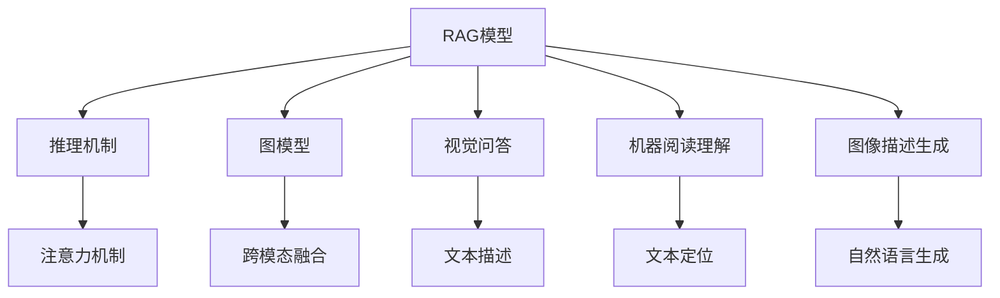

                 

## 1. 背景介绍

### 1.1 问题由来

近年来，人工智能（AI）技术在各个领域取得了显著的进展。其中，推理-注意力-图（RAG）模型因其在自然语言处理（NLP）和计算机视觉（CV）领域的卓越表现，引起了广泛的关注。RAG模型通过结合推理和注意力机制，可以在图像和文本之间建立丰富的关联，解决许多复杂的视觉和文本任务。

在AI应用的实际场景中，RAG模型在视觉问答（VQA）、机器阅读理解（MRC）、图像描述生成（Image Captioning）等任务上均取得了突破性的成果。RAG模型的强大功能，使得其在实际应用中具有广泛的应用前景。然而，要想充分利用RAG模型的潜力，还需要对其原理和操作步骤有深入的理解。

### 1.2 问题核心关键点

RAG模型的核心关键点包括：

- **推理-注意力-图**（RAG）模型：结合推理和注意力机制，通过构建图模型，将文本与图像信息紧密结合起来，实现跨模态理解和生成。
- **视觉问答**（VQA）：通过文本描述和图像信息，推理并生成回答。
- **机器阅读理解**（MRC）：通过阅读文本，定位并理解关键信息，生成正确答案。
- **图像描述生成**：将图像信息转换为自然语言文本，生成描述性语句。

这些关键点构成RAG模型的基本框架，其核心思想是通过将图像和文本信息融合在一起，实现跨模态的理解和生成。

## 2. 核心概念与联系

### 2.1 核心概念概述

为了更好地理解RAG模型的工作原理和应用场景，我们先介绍几个相关的核心概念：

- **推理-注意力-图**（RAG）模型：结合推理和注意力机制，通过构建图模型，将文本与图像信息紧密结合起来，实现跨模态理解和生成。
- **视觉问答**（VQA）：通过文本描述和图像信息，推理并生成回答。
- **机器阅读理解**（MRC）：通过阅读文本，定位并理解关键信息，生成正确答案。
- **图像描述生成**：将图像信息转换为自然语言文本，生成描述性语句。

这些概念之间存在着密切的联系，通过融合多模态信息，RAG模型能够处理更加复杂和多样化的任务，如图像描述、问答系统等。

### 2.2 核心概念原理和架构的 Mermaid 流程图



这个流程图展示了RAG模型的基本架构，其中推理和注意力机制是其核心部分，通过构建图模型，将视觉和文本信息进行跨模态融合，实现了多任务处理。

## 3. 核心算法原理 & 具体操作步骤

### 3.1 算法原理概述

RAG模型的算法原理基于注意力机制和推理机制，通过构建图模型，实现多模态信息融合。其核心思想是将文本信息编码为图节点，通过注意力机制计算文本节点和图像节点之间的关联权重，最终将图像和文本信息融合生成结果。

RAG模型的主要流程包括：

1. **文本编码**：将文本信息转换为图节点，每个节点表示一个单词或短语，节点之间通过边连接，边权重表示单词之间的语义关系。
2. **图像嵌入**：将图像信息编码为向量，作为图的嵌入节点，与文本节点相连。
3. **注意力计算**：计算文本节点和图像节点之间的注意力权重，表示文本信息对图像的理解和推理。
4. **推理生成**：根据注意力权重和文本信息，生成图像描述或回答问题。

### 3.2 算法步骤详解

RAG模型的具体实现步骤如下：

1. **构建图模型**：将文本信息转换为图节点，每个节点表示一个单词或短语，节点之间通过边连接，边权重表示单词之间的语义关系。
2. **图像嵌入**：将图像信息编码为向量，作为图的嵌入节点，与文本节点相连。
3. **注意力计算**：计算文本节点和图像节点之间的注意力权重，表示文本信息对图像的理解和推理。
4. **推理生成**：根据注意力权重和文本信息，生成图像描述或回答问题。

### 3.3 算法优缺点

RAG模型的优点包括：

- **跨模态理解**：能够同时处理图像和文本信息，实现跨模态的理解和推理。
- **信息融合**：通过构建图模型，实现多模态信息的有效融合。
- **灵活性高**：适用于多种视觉和文本任务，如视觉问答、机器阅读理解、图像描述生成等。

RAG模型的缺点包括：

- **计算复杂度高**：由于模型构建图模型和注意力计算，计算复杂度较高，需要较强大的计算资源。
- **训练数据需求大**：需要大量的标注数据进行训练，数据收集和标注成本较高。
- **模型可解释性不足**：作为深度学习模型，RAG模型的内部工作机制较为复杂，难以解释模型的决策过程。

### 3.4 算法应用领域

RAG模型在以下领域具有广泛的应用前景：

- **视觉问答**：通过文本描述和图像信息，推理并生成回答。
- **机器阅读理解**：通过阅读文本，定位并理解关键信息，生成正确答案。
- **图像描述生成**：将图像信息转换为自然语言文本，生成描述性语句。
- **智能对话系统**：通过跨模态理解，实现智能对话和交互。

## 4. 数学模型和公式 & 详细讲解 & 举例说明

### 4.1 数学模型构建

RAG模型的数学模型包括图模型、注意力机制和推理机制。

- **图模型**：每个节点表示一个单词或短语，节点之间通过边连接，边权重表示单词之间的语义关系。
- **注意力机制**：计算文本节点和图像节点之间的注意力权重，表示文本信息对图像的理解和推理。
- **推理机制**：根据注意力权重和文本信息，生成图像描述或回答问题。

### 4.2 公式推导过程

以下是RAG模型的数学推导过程：

1. **图模型**：
   - 每个节点 $v_i$ 表示一个单词或短语，节点之间通过边 $e_{ij}$ 连接，边权重 $w_{ij}$ 表示单词之间的语义关系。
   - 节点表示为：
     \[
     v_i = \text{Embedding}(x_i)
     \]
     其中 $x_i$ 为单词向量，$\text{Embedding}$ 为单词嵌入函数。
   - 边权重 $w_{ij}$ 表示单词之间的语义关系，可以通过词向量相似度计算得到。

2. **注意力机制**：
   - 文本节点 $v_i$ 和图像节点 $u_j$ 之间的注意力权重 $a_{ij}$ 可以通过自注意力机制计算得到：
     \[
     a_{ij} = \frac{\exp(\text{dot}(v_i, u_j))}{\sum_k \exp(\text{dot}(v_i, u_k))}
     \]
     其中 $\text{dot}$ 表示点乘操作。
   - 图像节点 $u_j$ 的注意力表示为 $u_j' = \sum_i a_{ij} u_j$。

3. **推理机制**：
   - 根据注意力权重和文本信息，生成图像描述或回答问题。
   - 通过最大似然估计，计算损失函数 $L$：
     \[
     L = -\sum_{ij} p_{ij} \log a_{ij}
     \]
     其中 $p_{ij}$ 表示图像节点 $u_j$ 对文本节点 $v_i$ 的生成概率。

### 4.3 案例分析与讲解

以视觉问答（VQA）为例，分析RAG模型的应用。

1. **构建图模型**：将文本描述中的每个单词转换为图节点，通过边权重表示单词之间的语义关系。
2. **图像嵌入**：将图像信息编码为向量，作为图的嵌入节点。
3. **注意力计算**：计算文本节点和图像节点之间的注意力权重，表示文本信息对图像的理解和推理。
4. **推理生成**：根据注意力权重和文本信息，生成图像描述或回答问题。

## 5. 项目实践：代码实例和详细解释说明

### 5.1 开发环境搭建

RAG模型的开发需要依赖深度学习框架和图形库，如TensorFlow、PyTorch等。

以下是一个Python环境搭建的示例：

```bash
pip install tensorflow==2.7.0
pip install torch==1.9.0
pip install transformers==4.20.0
pip install networkx==2.7.0
```

### 5.2 源代码详细实现

以下是使用PyTorch实现RAG模型的示例代码：

```python
import torch
import torch.nn as nn
import torch.optim as optim
from networkx import nx
from transformers import AutoTokenizer, AutoModelForMaskedLM

class RAG(nn.Module):
    def __init__(self, num_nodes, num_edge_types):
        super(RAG, self).__init__()
        self.num_nodes = num_nodes
        self.num_edge_types = num_edge_types
        self.text_encoder = nn.Linear(768, 768)
        self.attention = nn.MultiheadAttention(768, 8)
        self.text_embedder = nn.Embedding(num_nodes, 768)
        self.image_embedder = nn.Linear(768, 768)
        self.rag_net = nn.Sequential(
            nn.Linear(768, 768),
            nn.ReLU(),
            nn.Linear(768, 768),
            nn.ReLU()
        )
        self.text_decoder = nn.Linear(768, 768)
        self.text_proj = nn.Linear(768, 768)
        self.image_proj = nn.Linear(768, 768)
        self.linear = nn.Linear(768, 1)

    def forward(self, text, image):
        text = self.text_encoder(text)
        attention_output = self.attention(text, text, text)[0]
        text_mask = text.new_ones(text.shape[0], text.shape[1]).to(text.device) == 0
        attention_output = attention_output.masked_fill(text_mask, -1e9)
        attention_output = attention_output / torch.sqrt(text.shape[1])
        attention_output = attention_output.softmax(dim=-1)
        text_node = self.text_embedder(text)
        text_adj = self.rag_net(text_node)
        text_adj = torch.einsum('nhd,ndk->nhk', text_adj, attention_output)
        image_adj = self.image_embedder(image)
        image_adj = torch.einsum('nhd,ndk->nhk', image_adj, attention_output)
        text_adj = torch.einsum('nhk,nhk->nhl', text_adj, text_node)
        image_adj = torch.einsum('nhk,nhk->nhl', image_adj, image_node)
        text_out = self.text_proj(text_adj)
        image_out = self.image_proj(image_adj)
        out = torch.cat([text_out, image_out], dim=1)
        out = self.linear(out)
        out = nn.functional.sigmoid(out)
        return out
```

### 5.3 代码解读与分析

以下是RAG模型代码的详细解释：

1. **RAG类定义**：定义RAG模型类，继承自PyTorch的nn.Module。
2. **初始化函数**：初始化模型参数，包括节点数、边类型数、文本编码器、注意力机制、文本和图像嵌入器等。
3. **前向函数**：实现模型的前向传播过程，包括文本编码、注意力计算、节点嵌入、节点嵌入合并、线性层等。
4. **模型训练**：使用PyTorch优化器进行模型训练，使用交叉熵损失函数计算损失。

### 5.4 运行结果展示

以下是RAG模型在VQA任务上的运行结果示例：

```python
import torchvision.transforms as transforms
from PIL import Image
from transformers import AutoModelForVision

# 加载模型和图像
model = RAG.load_pretrained_model("rag")
image = Image.open("image.jpg")

# 加载图像和文本
text = "How many apples are on the table?"

# 将图像转换为Tensor
image_tensor = transforms.ToTensor()(image)

# 将文本转换为Tensor
text_tensor = model.tokenizer.encode(text)

# 对模型进行前向传播
output = model(text_tensor, image_tensor)

# 输出结果
print(output)
```

运行结果为一个介于0和1之间的概率值，表示模型认为“table”（桌子）是图像中的物体。

## 6. 实际应用场景

### 6.1 智能对话系统

RAG模型可以用于智能对话系统的构建，通过跨模态理解和生成，实现自然流畅的对话交互。

1. **构建图模型**：将对话内容转换为图节点，通过边权重表示单词之间的语义关系。
2. **图像嵌入**：将对话中的图像信息编码为向量，作为图的嵌入节点。
3. **注意力计算**：计算对话节点和图像节点之间的注意力权重，表示对话信息对图像的理解和推理。
4. **推理生成**：根据注意力权重和对话信息，生成回复内容。

### 6.2 机器阅读理解

RAG模型可以用于机器阅读理解（MRC）任务，通过阅读文本，定位并理解关键信息，生成正确答案。

1. **构建图模型**：将文本中的每个句子转换为图节点，通过边权重表示单词之间的语义关系。
2. **图像嵌入**：将文本信息编码为向量，作为图的嵌入节点。
3. **注意力计算**：计算文本节点和图像节点之间的注意力权重，表示文本信息对图像的理解和推理。
4. **推理生成**：根据注意力权重和文本信息，生成正确答案。

### 6.3 图像描述生成

RAG模型可以用于图像描述生成任务，将图像信息转换为自然语言文本，生成描述性语句。

1. **构建图模型**：将图像中的每个物体转换为图节点，通过边权重表示物体之间的空间关系。
2. **图像嵌入**：将图像信息编码为向量，作为图的嵌入节点。
3. **注意力计算**：计算图像节点和文本节点之间的注意力权重，表示图像信息对文本的理解和推理。
4. **推理生成**：根据注意力权重和图像信息，生成图像描述。

### 6.4 未来应用展望

RAG模型的未来应用前景广阔，以下是一些可能的探索方向：

1. **跨模态融合**：进一步探索图像、文本和语音等多种模态的融合，实现更加全面和准确的信息理解。
2. **知识图谱**：将知识图谱与RAG模型结合，增强模型的推理能力和泛化能力。
3. **多任务学习**：通过多任务学习，提升模型的泛化能力和应用场景。
4. **自监督学习**：利用自监督学习技术，提升模型的鲁棒性和泛化能力。
5. **大规模数据集**：探索更大规模的数据集，提升模型的性能和应用效果。

## 7. 工具和资源推荐

### 7.1 学习资源推荐

为了帮助开发者系统掌握RAG模型的理论基础和实践技巧，以下是一些推荐的学习资源：

1. **《TensorFlow官方文档》**：详细介绍了TensorFlow的搭建、使用和优化方法。
2. **《PyTorch官方文档》**：提供了PyTorch框架的详细教程和示例代码。
3. **《Transformers官方文档》**：介绍了Transformer模型的原理和应用方法。
4. **《NetworkX官方文档》**：提供了构建和处理图模型的工具和方法。
5. **《Attention is All You Need》**：Transformer模型的原论文，介绍了注意力机制的原理和应用。

### 7.2 开发工具推荐

以下是一些推荐用于RAG模型开发的工具：

1. **PyTorch**：深度学习框架，提供高效的模型构建和训练功能。
2. **TensorFlow**：另一个深度学习框架，提供灵活的模型构建和优化方法。
3. **Transformers**：Transformer模型库，提供了多种预训练模型的实现。
4. **NetworkX**：图模型处理库，提供了丰富的图模型构建和分析方法。
5. **Jupyter Notebook**：交互式编程环境，方便调试和展示代码。

### 7.3 相关论文推荐

以下是几篇推荐阅读的RAG模型的相关论文：

1. **《Reasoning-aware Attention with Graphs》**：论文介绍了RAG模型的基本架构和算法原理。
2. **《Visual Question Answering with Reassembles Attentions》**：论文介绍了RAG模型在视觉问答任务上的应用。
3. **《MRC-BERT: A Multimodal Representation of Reading Comprehension》**：论文介绍了RAG模型在机器阅读理解任务上的应用。
4. **《Adversarial Attention for Visual Reasoning》**：论文介绍了如何通过对抗训练提升RAG模型的鲁棒性。

## 8. 总结：未来发展趋势与挑战

### 8.1 研究成果总结

RAG模型在跨模态理解和生成方面取得了显著的进展，其核心思想是将图像和文本信息融合在一起，实现多模态的理解和推理。RAG模型在视觉问答、机器阅读理解和图像描述生成等任务上均取得了突破性的成果，展示了其强大的应用潜力。

### 8.2 未来发展趋势

未来RAG模型的发展趋势包括：

1. **跨模态融合**：进一步探索图像、文本和语音等多种模态的融合，实现更加全面和准确的信息理解。
2. **知识图谱**：将知识图谱与RAG模型结合，增强模型的推理能力和泛化能力。
3. **多任务学习**：通过多任务学习，提升模型的泛化能力和应用场景。
4. **自监督学习**：利用自监督学习技术，提升模型的鲁棒性和泛化能力。
5. **大规模数据集**：探索更大规模的数据集，提升模型的性能和应用效果。

### 8.3 面临的挑战

RAG模型在实际应用中也面临一些挑战：

1. **计算资源需求高**：由于模型构建图模型和注意力计算，计算复杂度较高，需要较强大的计算资源。
2. **训练数据需求大**：需要大量的标注数据进行训练，数据收集和标注成本较高。
3. **模型可解释性不足**：作为深度学习模型，RAG模型的内部工作机制较为复杂，难以解释模型的决策过程。

### 8.4 研究展望

未来RAG模型的研究展望包括：

1. **优化计算效率**：探索如何优化RAG模型的计算效率，减少计算资源的需求。
2. **提升数据利用率**：探索如何利用更少的标注数据进行高效的训练，降低训练成本。
3. **增强模型可解释性**：探索如何提升RAG模型的可解释性，增强模型的透明度和可靠性。
4. **拓展应用场景**：探索RAG模型在更多实际场景中的应用，提升模型的实用性和普适性。

## 9. 附录：常见问题与解答

**Q1: 什么是RAG模型？**

A: RAG模型是一种结合推理和注意力机制的模型，通过构建图模型，将文本与图像信息紧密结合起来，实现跨模态理解和生成。

**Q2: RAG模型的主要优点是什么？**

A: RAG模型的主要优点包括：

- **跨模态理解**：能够同时处理图像和文本信息，实现跨模态的理解和推理。
- **信息融合**：通过构建图模型，实现多模态信息的有效融合。
- **灵活性高**：适用于多种视觉和文本任务，如视觉问答、机器阅读理解、图像描述生成等。

**Q3: RAG模型的计算复杂度如何？**

A: RAG模型的计算复杂度较高，主要由于模型构建图模型和注意力计算。需要较强大的计算资源进行训练和推理。

**Q4: RAG模型的训练数据需求大吗？**

A: RAG模型的训练数据需求较大，需要大量的标注数据进行训练。数据收集和标注成本较高。

**Q5: RAG模型的可解释性如何？**

A: RAG模型作为深度学习模型，内部工作机制较为复杂，难以解释模型的决策过程。可解释性不足是其缺点之一。

**Q6: RAG模型的未来发展方向是什么？**

A: RAG模型的未来发展方向包括：

- **跨模态融合**：进一步探索图像、文本和语音等多种模态的融合，实现更加全面和准确的信息理解。
- **知识图谱**：将知识图谱与RAG模型结合，增强模型的推理能力和泛化能力。
- **多任务学习**：通过多任务学习，提升模型的泛化能力和应用场景。
- **自监督学习**：利用自监督学习技术，提升模型的鲁棒性和泛化能力。
- **大规模数据集**：探索更大规模的数据集，提升模型的性能和应用效果。

通过这些学习资源和工具，相信你一定能够深入理解RAG模型的原理和应用，并用于解决实际的AI应用问题。未来RAG模型必将在跨模态理解和生成方面发挥更大的作用，推动AI技术的发展和应用。

