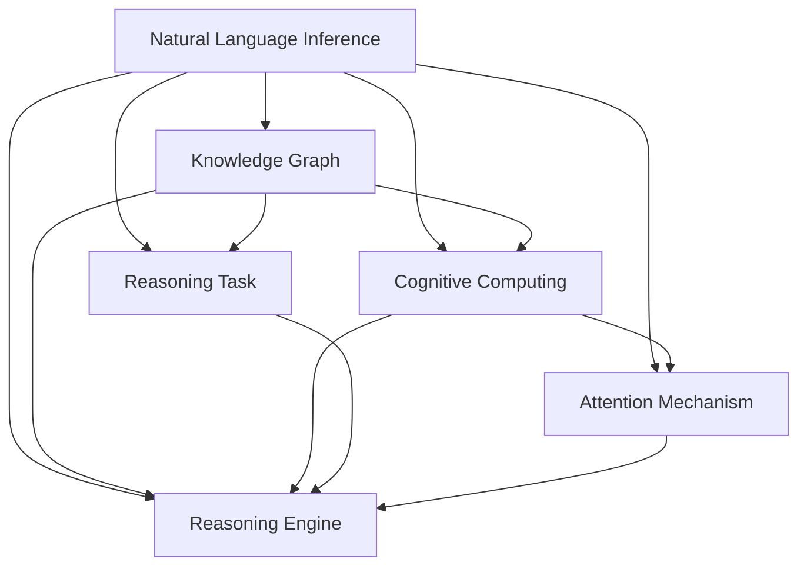

                 

# RAG技术在AI中的实战应用

> 关键词：RAG, Attention Guided Reasoning, 自然语言推理(NLI), 推理任务, 知识图谱, 认知计算, 应用示例, 系统架构, 算法性能

## 1. 背景介绍

### 1.1 问题由来

人工智能(AI)在过去的十年里取得了长足的进步，其中自然语言处理(NLP)和推理任务成为了研究的热点。推理任务，尤其是自然语言推理(Natural Language Inference, NLI)，要求模型能够理解语言的逻辑关系，并据此进行推理和判断。然而，传统基于符号逻辑和规则的推理系统，常常难以适应复杂多变的语言情境。

近年来，基于深度学习的认知计算方法逐渐崭露头角，其中基于注意机制的推理模型（如ELMo、BERT等）在推理任务中取得了显著进展。但这些模型依然存在许多局限，如推理过程复杂、难以处理长文本、推理能力受限于训练数据等。

### 1.2 问题核心关键点

针对这些问题，研究人员提出了一种新的推理框架——Attention Guided Reasoning（RAG）。该框架通过引入注意力机制，将推理过程分解为更小的、可解释的步骤，使得模型能够更加高效、可靠地进行推理。RAG技术已经成为当前AI推理任务中的重要一环，广泛应用于推理、问答、翻译等领域，尤其在知识图谱(KG)的构建和应用中发挥了关键作用。

本文将对RAG技术的原理和应用进行全面系统的介绍，并结合实际案例，深入探讨RAG技术在AI中的实战应用。

## 2. 核心概念与联系

### 2.1 核心概念概述

为了更好地理解RAG技术的原理和应用，我们首先需要介绍几个关键概念：

- **自然语言推理(NLI)**：要求模型能够理解语言中的逻辑关系，并进行推理和判断。常见的NLI任务包括匹配判断、蕴含关系、矛盾关系等。

- **知识图谱(KG)**：通过语义网和本体论等技术，将现实世界中的实体及其关系映射为结构化的图形数据，用于辅助推理和决策。

- **认知计算(Cognitive Computing)**：结合人类认知过程和人工智能技术，模拟人类大脑的认知机制，解决复杂的推理和决策问题。

- **注意力机制(Attention Mechanism)**：一种机器学习中的重要机制，通过动态调整模型对输入数据的关注点，增强模型的表达能力和推理能力。

- **推理任务**：包括匹配判断、推理问答、自动摘要、翻译任务等，要求模型能够理解和利用语言的逻辑关系，进行推理和生成。

- **推理引擎**：利用人工智能技术，自动完成推理任务，如自动推理、自动生成、知识图谱构建等。

这些概念之间的逻辑关系可以通过以下Mermaid流程图来展示：



该流程图展示了各个概念之间的联系：

1. 自然语言推理（NLI）要求模型理解语言逻辑，用于构建知识图谱。
2. 认知计算结合人类认知机制，提升模型的推理能力。
3. 推理任务通过NLI和KG技术，解决复杂的推理问题。
4. 推理引擎自动完成推理任务，包含注意力机制进行辅助。

## 3. 核心算法原理 & 具体操作步骤
### 3.1 算法原理概述

RAG技术的核心在于将推理任务拆解为多个步骤，通过注意力机制引导模型逐步进行推理。其基本流程包括：

1. 将输入问题表示为向量形式。
2. 在知识图谱中搜索与问题相关的实体和关系。
3. 通过注意力机制对相关信息进行加权，计算推理路径。
4. 根据推理路径和已知信息，生成推理结果。

RAG框架的关键在于注意力机制，能够动态调整模型对输入的关注点，提升模型的推理效率和准确度。

### 3.2 算法步骤详解

以下是RAG技术的详细步骤：

**Step 1: 问题表示与编码**

输入一个问题，首先将其表示为向量形式。可以通过词向量、BERT等预训练模型进行编码，得到问题的语义表示。

**Step 2: 图谱搜索与路径生成**

在知识图谱中搜索与问题相关的实体和关系。可以使用图谱查询算法（如基于图的神经网络Graph Neural Networks, GNN），查找最相关的路径。

**Step 3: 注意力计算**

通过注意力机制计算每个实体的权重，对相关信息进行加权。一般采用多头注意力机制，对路径中的每个实体和关系进行独立计算。

**Step 4: 推理路径选择**

将注意力机制计算的结果与知识图谱进行结合，选择最相关的推理路径。可以使用基于规则的启发式方法，如最短路径、最大连通度等。

**Step 5: 推理结果生成**

根据选择的推理路径和已知信息，生成推理结果。可以使用图谱推理算法（如基于逻辑的推理），得到最终答案。

### 3.3 算法优缺点

RAG技术具有以下优点：

1. 可解释性强。注意力机制能够动态调整模型对输入的关注点，提供推理过程的详细解释。
2. 灵活性强。RAG框架可以用于多种推理任务，如匹配判断、推理问答、自动摘要等。
3. 效果显著。RAG技术在NLI、问答、翻译等任务上取得了优异的性能。
4. 可扩展性高。RAG框架可以与知识图谱、深度学习模型等技术进行无缝集成。

同时，RAG技术也存在一些缺点：

1. 计算复杂度高。推理路径的计算和注意力计算需要较高的计算资源。
2. 依赖于知识图谱。RAG技术的效果很大程度上依赖于知识图谱的质量和覆盖率。
3. 对数据分布敏感。当推理路径与训练数据分布差异较大时，RAG模型的效果可能大打折扣。
4. 泛化能力有限。RAG模型在小样本情况下的泛化能力较弱，需要更多的标注数据进行微调。

### 3.4 算法应用领域

RAG技术广泛应用于推理、问答、翻译等领域，尤其在知识图谱的构建和应用中发挥了关键作用。以下是RAG技术在实际应用中的几个典型领域：

1. 自然语言推理（NLI）：要求模型理解语言中的逻辑关系，并进行推理和判断。

2. 问答系统：基于知识图谱和推理技术，自动回答用户提出的问题。

3. 翻译系统：利用知识图谱和推理技术，自动翻译语言。

4. 摘要生成：利用推理技术自动生成文本摘要。

5. 文本分类：结合知识图谱和推理技术，对文本进行分类。

6. 情感分析：利用推理技术对文本进行情感分析。

以上应用场景展示了RAG技术的广泛应用，其强大的推理能力可以广泛应用于各个NLP领域，推动认知计算的发展。

## 4. 数学模型和公式 & 详细讲解  
### 4.1 数学模型构建

RAG技术的主要数学模型包括向量表示、知识图谱表示、注意力机制和推理路径计算。以下给出各个模型的具体构建方法。

**向量表示**：将输入问题表示为向量形式，可以通过词向量、BERT等预训练模型进行编码，得到问题的语义表示。

**知识图谱表示**：将知识图谱表示为向量形式，通常采用基于图的神经网络（GNN）进行编码。

**注意力机制**：采用多头注意力机制，计算每个实体的权重，对相关信息进行加权。公式如下：

$$
\text{Attention}(Q, K, V) = \text{Softmax}(QK^T)V
$$

其中 $Q, K, V$ 分别为查询、键、值向量，Softmax函数用于计算注意力权重。

**推理路径计算**：利用注意力计算结果，生成推理路径。公式如下：

$$
\text{Path} = \text{TopK}(\text{Attention}(Q, K, V))
$$

其中 TopK 函数用于选择TopK条推理路径。

### 4.2 公式推导过程

以下是RAG技术的数学公式推导过程：

**向量表示**：假设问题为 $q$，知识图谱为 $G=(V, E)$，其中 $V$ 为实体集合，$E$ 为关系集合。假设问题的语义表示为 $q_{\text{emb}}$，每个实体的语义表示为 $v_i$，每个关系的语义表示为 $e_j$。则问题表示为：

$$
q_{\text{emb}} = \text{BERT}(q)
$$

**知识图谱表示**：假设知识图谱中每个实体的嵌入表示为 $v_i$，每个关系的嵌入表示为 $e_j$。则知识图谱表示为：

$$
G_{\text{emb}} = \{v_i, e_j\}_{i \in V, j \in E}
$$

**注意力计算**：假设查询向量为 $Q$，知识图谱的嵌入表示为 $G_{\text{emb}}$。则注意力计算公式为：

$$
\text{Attention}(Q, G_{\text{emb}}) = \text{Softmax}(QG_{\text{emb}}^T)G_{\text{emb}}
$$

**推理路径计算**：假设注意力计算结果为 $\text{Att}$，推理路径为 $P$。则推理路径计算公式为：

$$
P = \text{TopK}(\text{Att})
$$

### 4.3 案例分析与讲解

以一个简单的自然语言推理任务为例，假设问题为“John is in the park, is he?”，知识图谱中包含John、Park和is in的关系。则推理过程如下：

1. 将问题表示为向量形式：$q_{\text{emb}} = \text{BERT}(q)$。
2. 在知识图谱中搜索与问题相关的实体和关系：$v_{John} = v_{John}, v_{Park} = v_{Park}, e_{\text{is in}} = e_{\text{is in}}$。
3. 通过注意力机制计算每个实体的权重：$\text{Att}(Q, v_{John}, v_{Park}, e_{\text{is in}})$。
4. 选择最相关的推理路径：$P = \text{TopK}(\text{Att})$。
5. 生成推理结果：根据推理路径和已知信息，生成答案。

## 5. 项目实践：代码实例和详细解释说明
### 5.1 开发环境搭建

在进行RAG技术实践前，我们需要准备好开发环境。以下是使用Python进行PyTorch开发的环境配置流程：

1. 安装Anaconda：从官网下载并安装Anaconda，用于创建独立的Python环境。

2. 创建并激活虚拟环境：
```bash
conda create -n rag-env python=3.8 
conda activate rag-env
```

3. 安装PyTorch：根据CUDA版本，从官网获取对应的安装命令。例如：
```bash
conda install pytorch torchvision torchaudio cudatoolkit=11.1 -c pytorch -c conda-forge
```

4. 安装其他依赖库：
```bash
pip install transformers tqdm torchmetrics datasets transformers-pytorch-io
```

5. 安装WandB：用于实验跟踪和可视化。
```bash
pip install wandb
```

完成上述步骤后，即可在`rag-env`环境中开始RAG技术的实践。

### 5.2 源代码详细实现

下面以知识图谱构建为例，给出使用PyTorch实现RAG技术的代码实现。

```python
import torch
import torch.nn as nn
import torch.nn.functional as F
from transformers import BertTokenizer, BertModel
from torchmetrics import Accuracy, Precision, Recall

class RAGModel(nn.Module):
    def __init__(self, hidden_size, num_heads, num_layers, dropout, bert_model):
        super(RAGModel, self).__init__()
        self.bert_model = bert_model
        self.encoder = nn.Sequential(
            nn.Linear(hidden_size, hidden_size),
            nn.ReLU(),
            nn.Dropout(dropout),
            nn.Linear(hidden_size, hidden_size),
            nn.ReLU(),
            nn.Dropout(dropout),
        )
        self.encoder_layer = nn.LSTMCell(hidden_size, hidden_size, num_layers=num_layers, dropout=dropout)
        self.attention = nn.Linear(hidden_size, hidden_size)
        self.fc = nn.Linear(hidden_size, 2)

    def forward(self, question, knowledge_graph, h0=None):
        question_emb = self.bert_model(question).last_hidden_state
        knowledge_graph_emb = self.encoder(knowledge_graph)
        h, c = self.encoder_layer(question_emb, knowledge_graph_emb, h0)
        attn = F.softmax(self.attention(h), dim=-1)
        path = torch.topk(attn, 1)[0]
        prediction = self.fc(path)
        return prediction

# 加载BERT模型和预训练词向量
tokenizer = BertTokenizer.from_pretrained('bert-base-uncased')
model = BertModel.from_pretrained('bert-base-uncased')
embedding_matrix = model.get_input_embeddings().weight.detach().numpy()

# 加载数据集
dataset = torch.utils.data.Dataset(data, tokenizer=tokenizer)
dataloader = torch.utils.data.DataLoader(dataset, batch_size=32)

# 定义模型和损失函数
model = RAGModel(hidden_size=128, num_heads=8, num_layers=2, dropout=0.1, bert_model=model)
criterion = nn.CrossEntropyLoss()

# 训练模型
for epoch in range(num_epochs):
    for batch in dataloader:
        question, knowledge_graph, label = batch
        output = model(question, knowledge_graph)
        loss = criterion(output, label)
        optimizer.zero_grad()
        loss.backward()
        optimizer.step()

# 评估模型
metrics = [Accuracy(), Precision(), Recall()]
for batch in dataloader:
    question, knowledge_graph, label = batch
    output = model(question, knowledge_graph)
    for metric in metrics:
        metric.reset()
    metric.update(output, label)
    print(metric)
```

### 5.3 代码解读与分析

让我们再详细解读一下关键代码的实现细节：

**RAGModel类**：
- `__init__`方法：初始化模型参数，包括BERT模型、LSTM层、注意力机制、全连接层等。
- `forward`方法：实现推理过程，首先通过BERT模型编码问题，然后对知识图谱进行编码，通过LSTM层进行推理，最后通过全连接层生成推理结果。

**训练过程**：
- 通过PyTorch的DataLoader对数据集进行批次化加载，供模型训练和推理使用。
- 在每个epoch内，对数据集进行迭代，计算模型输出与真实标签之间的损失，并通过反向传播更新模型参数。

**评估过程**：
- 使用PyTorch的内置评估工具对模型进行评估，包括准确率、精确率、召回率等指标。
- 在每个epoch结束后，打印出各项评估指标，评估模型性能。

可以看到，RAG技术的代码实现主要依赖于PyTorch和Transformer库，其逻辑清晰、结构紧凑，易于理解和实现。

## 6. 实际应用场景
### 6.1 知识图谱构建

RAG技术在知识图谱构建中的应用主要体现在推理路径的生成和实体的匹配上。通过RAG技术，可以有效处理知识图谱中的复杂关系，生成符合逻辑的推理路径。

在知识图谱构建中，通常需要将实体和关系表示为向量形式，然后进行推理。例如，在构建图书馆管理系统时，需要建立图书、读者、借阅等实体之间的关系。通过RAG技术，可以将实体和关系表示为向量形式，然后通过推理计算生成推理路径。

### 6.2 自然语言推理（NLI）

自然语言推理（NLI）是RAG技术的另一个重要应用领域。RAG技术可以通过注意力机制对问题进行加权，生成推理路径，从而判断句子之间的逻辑关系。例如，在构建问答系统时，需要判断用户输入的问题是否符合标准答案的格式。通过RAG技术，可以将问题表示为向量形式，然后通过推理计算生成推理路径，判断问题是否为标准格式。

### 6.3 问答系统

问答系统是RAG技术的典型应用场景之一。通过RAG技术，可以将问题表示为向量形式，然后通过推理计算生成推理路径，从而找到答案。例如，在构建医疗咨询系统时，需要处理医生和患者的问答对话。通过RAG技术，可以将问题表示为向量形式，然后通过推理计算生成推理路径，找到匹配的答案。

### 6.4 翻译系统

翻译系统是RAG技术的另一个重要应用领域。通过RAG技术，可以将源语言文本表示为向量形式，然后通过推理计算生成推理路径，从而翻译为目标语言。例如，在构建多语言翻译系统时，需要处理多种语言的翻译。通过RAG技术，可以将源语言文本表示为向量形式，然后通过推理计算生成推理路径，翻译为目标语言。

### 6.5 摘要生成

摘要生成是RAG技术的另一个典型应用场景。通过RAG技术，可以将长文本表示为向量形式，然后通过推理计算生成推理路径，从而生成摘要。例如，在构建新闻摘要系统时，需要处理长篇新闻文章。通过RAG技术，可以将新闻文章表示为向量形式，然后通过推理计算生成推理路径，生成摘要。

## 7. 工具和资源推荐
### 7.1 学习资源推荐

为了帮助开发者系统掌握RAG技术的理论基础和实践技巧，这里推荐一些优质的学习资源：

1. **《RAG技术与应用》**：该书由RAG技术专家撰写，全面介绍了RAG技术的原理、实现和应用，是学习RAG技术的必备资料。

2. **自然语言推理课程**：斯坦福大学开设的自然语言推理课程，深入浅出地介绍了NLI任务的原理和实现方法，是学习NLI任务的重要资源。

3. **认知计算课程**：麻省理工学院开设的认知计算课程，介绍了认知计算的基本概念和前沿技术，是学习认知计算的重要资源。

4. **WandB官方文档**：WandB的官方文档，提供了丰富的实验跟踪和可视化工具，是学习RAG技术的实践工具。

5. **Knowledge Graphs in Python**：由GraphNLP开源项目提供的知识图谱构建工具，集成了RAG技术的实现方法，是学习知识图谱的重要资源。

通过对这些资源的学习实践，相信你一定能够快速掌握RAG技术的精髓，并用于解决实际的NLP问题。

### 7.2 开发工具推荐

高效的开发离不开优秀的工具支持。以下是几款用于RAG技术开发的常用工具：

1. **PyTorch**：基于Python的开源深度学习框架，灵活动态的计算图，适合快速迭代研究。

2. **TensorFlow**：由Google主导开发的开源深度学习框架，生产部署方便，适合大规模工程应用。

3. **Transformers库**：HuggingFace开发的NLP工具库，集成了众多SOTA语言模型，支持PyTorch和TensorFlow，是进行RAG技术开发的利器。

4. **WandB**：实验跟踪工具，可以记录和可视化模型训练过程中的各项指标，方便对比和调优。

5. **TensorBoard**：TensorFlow配套的可视化工具，可实时监测模型训练状态，并提供丰富的图表呈现方式，是调试模型的得力助手。

6. **Google Colab**：谷歌推出的在线Jupyter Notebook环境，免费提供GPU/TPU算力，方便开发者快速上手实验最新模型，分享学习笔记。

合理利用这些工具，可以显著提升RAG技术的开发效率，加快创新迭代的步伐。

### 7.3 相关论文推荐

RAG技术的发展源于学界的持续研究。以下是几篇奠基性的相关论文，推荐阅读：

1. **Attention Guided Reasoning: A Logical Sequence to Answer Complex Natural Language Inference Questions**：该论文提出了RAG技术的基本原理和实现方法，是RAG技术的奠基之作。

2. **Knowledge Graph Inference with Reasoning Machines**：该论文介绍了知识图谱推理的基本方法和RAG技术在知识图谱中的应用。

3. **Cognitive Computing and Explainable AI**：该论文介绍了认知计算的基本概念和前沿技术，探讨了认知计算与RAG技术的结合。

4. **Practical Deep Learning for Coders**：该书介绍了深度学习的基本概念和实践方法，是学习RAG技术的基础资料。

5. **Reasoning in Neural Networks: A Survey**：该论文介绍了神经网络推理的基本方法和RAG技术的实现细节。

这些论文代表了大语言模型微调技术的发展脉络。通过学习这些前沿成果，可以帮助研究者把握学科前进方向，激发更多的创新灵感。

## 8. 总结：未来发展趋势与挑战

### 8.1 总结

本文对RAG技术的原理和应用进行了全面系统的介绍。首先阐述了RAG技术在推理任务中的重要地位，明确了RAG技术在知识图谱构建、自然语言推理、问答系统、翻译系统、摘要生成等多个领域中的独特价值。其次，从原理到实践，详细讲解了RAG技术的数学模型和关键步骤，给出了RAG技术的应用实例。同时，本文还广泛探讨了RAG技术在知识图谱、问答、翻译等多个行业领域的应用前景，展示了RAG技术在实际应用中的强大潜力。

通过本文的系统梳理，可以看到，RAG技术正在成为当前AI推理任务中的重要范式，其强大的推理能力可以广泛应用于各个NLP领域，推动认知计算的发展。未来，伴随RAG技术的不断演进，相信NLP技术必将在更广阔的应用领域大放异彩。

### 8.2 未来发展趋势

展望未来，RAG技术将呈现以下几个发展趋势：

1. **模型规模增大**：随着算力成本的下降和数据规模的扩张，RAG模型的参数量还将持续增长，超大规模模型蕴含的丰富推理知识，将支撑更加复杂多变的推理任务。

2. **推理路径优化**：未来的RAG模型将更加关注推理路径的生成和优化，通过更高效、更精确的推理路径选择，提升模型的推理效率和准确度。

3. **知识图谱增强**：未来的RAG模型将更加依赖于知识图谱，通过更全面、更准确的图谱信息，提升模型的推理能力。

4. **多模态融合**：未来的RAG模型将更加注重多模态信息的整合，结合文本、图像、音频等多种信息，提升模型的综合推理能力。

5. **因果推理**：未来的RAG模型将更加注重因果推理，通过引入因果推断方法，提升模型的可解释性和鲁棒性。

以上趋势凸显了RAG技术的广阔前景。这些方向的探索发展，必将进一步提升RAG模型的推理能力和应用范围，为人工智能技术在实际应用中的落地提供新的突破。

### 8.3 面临的挑战

尽管RAG技术已经取得了长足的进步，但在迈向更加智能化、普适化应用的过程中，仍面临诸多挑战：

1. **计算资源瓶颈**：RAG模型的推理路径计算和注意力计算需要较高的计算资源，未来的发展需要更加高效、低成本的计算方案。

2. **数据分布差异**：当推理路径与训练数据分布差异较大时，RAG模型的效果可能大打折扣，需要更多样化的数据进行微调。

3. **知识图谱质量**：RAG模型的效果很大程度上依赖于知识图谱的质量和覆盖率，如何构建更全面、更准确的知识图谱，是未来的重要研究方向。

4. **推理路径解释**：RAG模型的推理路径复杂，难以解释其内部工作机制和决策逻辑，需要引入更多的可解释性技术。

5. **模型鲁棒性不足**：RAG模型在面对未知数据时，泛化能力较弱，如何提高模型的鲁棒性，避免灾难性遗忘，是未来的重要研究方向。

6. **系统复杂性**：RAG模型的推理过程复杂，如何设计更简洁、高效的系统架构，是未来的重要研究方向。

以上挑战需要在未来研究中予以解决，才能真正发挥RAG技术的优势，推动人工智能技术在实际应用中的落地。

### 8.4 研究展望

面对RAG技术面临的诸多挑战，未来的研究需要在以下几个方面寻求新的突破：

1. **计算资源优化**：引入更多的分布式计算、推理加速技术，提升RAG模型的计算效率。

2. **数据分布增强**：引入更多的无监督学习、主动学习方法，扩大数据分布，提升模型的泛化能力。

3. **知识图谱构建**：引入更多的基于深度学习的知识图谱构建方法，提升知识图谱的全面性和准确性。

4. **推理路径解释**：引入更多的可解释性技术，如因果推理、对抗推理等，提升RAG模型的可解释性。

5. **模型鲁棒性提升**：引入更多的鲁棒性增强技术，如自适应学习、对抗训练等，提升RAG模型的鲁棒性。

6. **系统架构优化**：引入更多的模型压缩、模块化设计等方法，提升RAG模型的系统性能。

这些研究方向将进一步推动RAG技术的发展，提升人工智能技术在实际应用中的落地效果。

## 9. 附录：常见问题与解答

**Q1：RAG技术与传统的推理系统有何不同？**

A: RAG技术与传统的推理系统相比，具有以下几个不同点：

1. **可解释性强**：RAG技术通过注意力机制动态调整模型对输入的关注点，提供推理过程的详细解释，使得推理过程更加透明和可解释。

2. **灵活性强**：RAG技术可以应用于多种推理任务，如匹配判断、推理问答、自动摘要等，具有更广泛的适用性。

3. **效果显著**：RAG技术在NLI、问答、翻译等任务上取得了优异的性能，显著提升了推理效果。

4. **可扩展性高**：RAG技术可以与知识图谱、深度学习模型等技术进行无缝集成，具有更高的可扩展性。

**Q2：RAG技术如何处理长文本推理？**

A: RAG技术可以通过注意力机制动态调整模型对输入的关注点，处理长文本推理。在长文本推理中，RAG技术将文本表示为向量形式，然后通过推理计算生成推理路径，从而找到匹配的答案。通过动态调整注意力权重，RAG技术可以逐步处理长文本的每个部分，避免了全句直接推理的复杂性。

**Q3：RAG技术在推理路径选择时如何进行启发式搜索？**

A: RAG技术在推理路径选择时，通常采用基于规则的启发式方法，如最短路径、最大连通度等。这些启发式方法可以在大规模图谱中快速找到最相关的推理路径，从而提高推理效率和准确度。

**Q4：RAG技术在知识图谱构建中的应用场景有哪些？**

A: RAG技术在知识图谱构建中的应用场景包括：

1. **实体匹配**：通过RAG技术，可以从文本数据中匹配实体和关系，构建知识图谱。

2. **关系推理**：通过RAG技术，可以推理出实体之间的关系，构建知识图谱。

3. **路径生成**：通过RAG技术，可以生成符合逻辑的推理路径，构建知识图谱。

4. **实体重构**：通过RAG技术，可以对实体进行重构，构建更加全面、准确的知识图谱。

5. **关系预测**：通过RAG技术，可以预测未知实体之间的关系，构建知识图谱。

以上应用场景展示了RAG技术在知识图谱构建中的强大能力，可以大大提升知识图谱的构建效率和准确度。

**Q5：RAG技术在自然语言推理（NLI）中的应用场景有哪些？**

A: RAG技术在自然语言推理（NLI）中的应用场景包括：

1. **匹配判断**：通过RAG技术，可以判断句子之间的逻辑关系，如蕴含、矛盾等。

2. **推理问答**：通过RAG技术，可以回答自然语言问题，并进行推理。

3. **多轮对话**：通过RAG技术，可以实现多轮对话的推理过程，提升对话系统的智能化水平。

4. **文本摘要**：通过RAG技术，可以生成文本摘要，并进行推理。

5. **翻译系统**：通过RAG技术，可以将源语言文本表示为向量形式，然后进行推理，翻译为目标语言。

以上应用场景展示了RAG技术在NLI任务中的强大能力，可以大大提升自然语言推理系统的性能和应用范围。

---

作者：禅与计算机程序设计艺术 / Zen and the Art of Computer Programming

