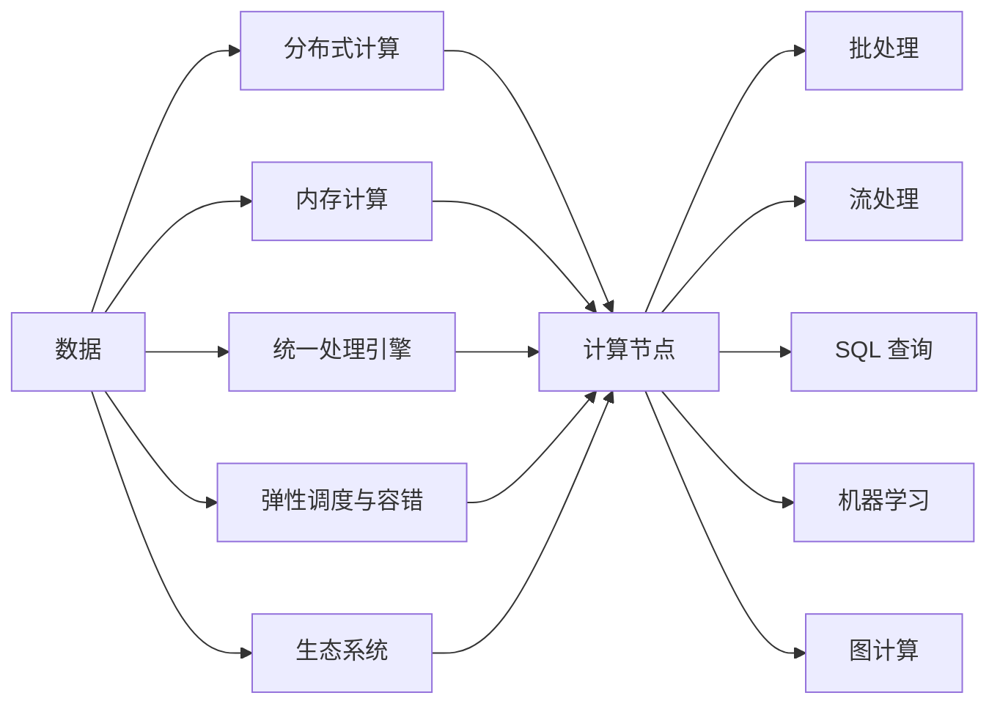

                 

# Spark原理与代码实例讲解

> 关键词：Apache Spark, 分布式计算, 内存计算, 数据处理, 大数据技术

## 1. 背景介绍

### 1.1 问题由来
随着数据量的爆炸式增长，传统的单节点处理方式已无法满足大规模数据处理的需要。如何高效地处理海量数据，成为了大数据领域的关键挑战。Apache Spark 作为一个开源的分布式计算框架，以其高性能、高吞吐量、易于使用的特性，迅速在业界获得了广泛的应用。

Spark 自 2010 年首次亮相以来，凭借其先进的设计理念和卓越的性能表现，成为了大数据处理的主流解决方案之一。Spark 支持多种数据处理场景，包括批处理、流处理、机器学习、图计算等，广泛应用于金融、电商、社交网络、科学研究等多个领域。

### 1.2 问题核心关键点
Spark 的核心技术点主要包括：
- 分布式计算：通过将数据和任务分配到多个计算节点上并行处理，实现高并发和大规模数据处理。
- 内存计算：利用内存的高访问速度，将中间结果缓存在内存中，从而大幅提升计算效率。
- 统一的数据处理引擎：提供统一的编程接口，支持多种数据处理任务，如批处理、流处理、SQL、机器学习等。
- 弹性调度与容错机制：支持动态资源调整和任务失败后的自动重试，确保系统高可用性和稳定性。
- 丰富的生态系统：提供 Spark SQL、Spark Streaming、MLlib、GraphX 等多个组件，满足不同场景的需求。

这些技术特点使得 Spark 在处理大规模数据时具有显著的优势，成为大数据处理的首选框架。

## 2. 核心概念与联系

### 2.1 核心概念概述

为了深入理解 Spark 的工作原理，我们首先需要了解几个核心概念：

- **分布式计算**：将数据和计算任务分散到多个计算节点上并行执行，提高数据处理能力。Spark 通过分布式计算框架，实现高效的大规模数据处理。
- **内存计算**：利用内存的快速读写特性，将中间结果缓存到内存中，减少磁盘 I/O，提升计算速度。Spark 提供了基于内存的 RDD、DataFrame 等数据结构，支持内存计算。
- **统一的数据处理引擎**：Spark 提供了统一的接口 API，支持多种数据处理任务，包括批处理、流处理、SQL 查询、机器学习等，适用于不同的应用场景。
- **弹性调度与容错机制**：Spark 能够动态调整计算资源，平衡任务执行速度和资源利用率。同时，Spark 提供了自动恢复机制，确保系统高可用性和数据一致性。
- **丰富的生态系统**：Spark 生态系统包括多个组件，如 Spark SQL 用于数据查询和处理，Spark Streaming 用于流数据处理，MLlib 用于机器学习，GraphX 用于图计算，满足不同领域的需求。

这些核心概念构成了 Spark 的核心技术架构，使得 Spark 能够在高效、可靠地处理大规模数据方面取得卓越表现。

### 2.2 核心概念原理和架构的 Mermaid 流程图



该流程图展示了 Spark 的核心架构：数据首先被分散到多个计算节点上，通过分布式计算进行并行处理。同时，数据中间结果会被缓存到内存中，以提升计算效率。Spark 提供了统一的编程接口，支持多种数据处理任务。此外，Spark 还具有弹性调度和容错机制，能够动态调整资源，确保系统高可用性和数据一致性。最后，Spark 生态系统包括多个组件，能够满足不同场景的需求。

## 3. 核心算法原理 & 具体操作步骤

### 3.1 算法原理概述

Spark 的核心算法原理主要围绕分布式计算和内存计算展开。其计算模型基于 MapReduce 的基本思想，但比 MapReduce 更加灵活和高效。Spark 支持两种数据抽象：RDD（弹性分布式数据集）和 DataFrame，分别对应批处理和 SQL 查询场景。

Spark 的核心算法流程包括：
1. **数据分布与任务划分**：将数据分配到多个计算节点上，并将任务划分为多个子任务，并行执行。
2. **内存计算与持久化**：利用内存的快速读写特性，将中间结果缓存到内存中，避免频繁的磁盘 I/O。
3. **弹性调度与容错**：动态调整计算资源，确保系统高可用性和数据一致性。
4. **算法优化与优化器**：Spark 提供了多种优化器，如数据本地化、谱系优化等，提高计算效率。

### 3.2 算法步骤详解

以下以 Spark RDD 模型为例，详细介绍 Spark 的算法步骤：

1. **数据分布与任务划分**
   - **数据分布**：将数据分散到多个计算节点上，形成数据分区。每个分区包含部分数据记录，以便并行处理。
   - **任务划分**：将计算任务划分为多个子任务，每个子任务对应一个数据分区。

2. **内存计算与持久化**
   - **内存计算**：将中间结果缓存到内存中，利用内存的高访问速度提升计算效率。Spark 提供了基于内存的 RDD 数据结构。
   - **持久化**：将计算结果缓存到内存中，以便后续任务重用。Spark 提供了持久化机制，可以缓存结果，避免重复计算。

3. **弹性调度与容错**
   - **弹性调度**：动态调整计算资源，平衡任务执行速度和资源利用率。Spark 能够根据任务需求自动调整计算资源，优化系统性能。
   - **容错机制**：Spark 提供了自动恢复机制，确保系统高可用性和数据一致性。在任务失败时，Spark 能够自动重试，保证数据不丢失。

4. **算法优化与优化器**
   - **数据本地化**：将计算任务分配到数据所在节点上执行，减少数据传输开销。
   - **谱系优化**：将数据按照谱系关系进行分组，提高计算效率。
   - **内存优化**：调整内存使用策略，提高内存利用率。

### 3.3 算法优缺点

Spark 的优点主要包括：
- 高性能：支持内存计算，速度快，适用于大规模数据处理。
- 高并发：支持分布式计算，能够并行处理大规模数据。
- 易用性：提供统一的编程接口，支持多种数据处理任务。
- 弹性调度：动态调整计算资源，优化系统性能。

但 Spark 也存在一些缺点：
- 内存限制：内存计算需要大量内存支持，对硬件要求高。
- 复杂度：Spark 的学习曲线较陡峭，需要一定的技术背景。
- 部署难度：Spark 的部署和管理相对复杂，需要较高的运维能力。

### 3.4 算法应用领域

Spark 的应用领域非常广泛，主要包括：
- **大数据处理**：支持批处理、流处理、SQL 查询等数据处理任务，适用于大规模数据存储和处理。
- **机器学习**：提供 MLlib 组件，支持多种机器学习算法，适用于数据挖掘和预测分析。
- **图计算**：提供 GraphX 组件，支持图数据存储和计算，适用于社交网络分析和推荐系统。
- **流数据处理**：支持流式数据处理，适用于实时数据流分析。
- **交互式分析**：提供交互式界面，支持快速数据探索和分析。

## 4. 数学模型和公式 & 详细讲解 & 举例说明

### 4.1 数学模型构建

Spark 的核心数学模型基于 MapReduce 的基本思想，并引入了内存计算和优化机制。Spark 提供了两种数据抽象：RDD 和 DataFrame，分别对应批处理和 SQL 查询场景。

#### 4.1.1 RDD 数据结构
RDD 是 Spark 的核心数据结构，支持分布式计算和内存计算。RDD 由多个分区组成，每个分区包含部分数据记录。RDD 支持多种操作，包括 map、reduce、join 等。

RDD 的数学模型可以表示为：
$$
RDD = \{ (key_1, value_1), (key_2, value_2), ..., (key_n, value_n) \}
$$
其中 $key_i$ 为分区键，$value_i$ 为分区内的数据记录。

#### 4.1.2 DataFrame 数据结构
DataFrame 是 Spark 的高级数据结构，支持 SQL 查询和操作。DataFrame 由多个列组成，每列包含多个数据记录。DataFrame 支持多种 SQL 操作，如 select、group by、join 等。

DataFrame 的数学模型可以表示为：
$$
DataFrame = \{ (key_1, value_1_1, value_1_2, ..., value_1_n), (key_2, value_2_1, value_2_2, ..., value_2_n), ..., (key_m, value_m_1, value_m_2, ..., value_m_n) \}
$$
其中 $key_i$ 为行键，$value_i_j$ 为列数据。

### 4.2 公式推导过程

#### 4.2.1 RDD 操作
以 map 操作为例，介绍 RDD 的基本操作。假设有一个 RDD $A$，执行 map 操作得到 RDD $B$：

$$
B = map(A, f)
$$
其中 $f$ 为映射函数。map 操作将 A 中的每个元素 $x$ 映射为 $f(x)$，生成新的 RDD $B$。

#### 4.2.2 DataFrame 操作
以 select 操作为例，介绍 DataFrame 的基本操作。假设有一个 DataFrame $A$，执行 select 操作得到 DataFrame $B$：

$$
B = select(A, [col_1, col_2, ..., col_n])
$$
其中 $col_i$ 为列名。select 操作从 DataFrame $A$ 中选择指定列，生成新的 DataFrame $B$。

### 4.3 案例分析与讲解

#### 4.3.1 案例一：RDD 的 map 操作
假设有如下 RDD $A$：

$$
A = \{ (1, [1, 2, 3]), (2, [4, 5, 6]), (3, [7, 8, 9]) \}
$$

执行 map 操作，将每个分区的第一个元素加 1：

$$
B = map(A, lambda x: x[0] + 1)
$$

得到新的 RDD $B$：

$$
B = \{ (2, [2, 3, 4]), (3, [5, 6, 7]), (4, [8, 9, 10]) \}
$$

#### 4.3.2 案例二：DataFrame 的 select 操作
假设有如下 DataFrame $A$：

$$
A = \{ (1, [1, 2, 3]), (2, [4, 5, 6]), (3, [7, 8, 9]) \}
$$

执行 select 操作，选择第一列：

$$
B = select(A, col_1)
$$

得到新的 DataFrame $B$：

$$
B = \{ (1, 1), (2, 4), (3, 7) \}
$$

## 5. 项目实践：代码实例和详细解释说明

### 5.1 开发环境搭建

在进行 Spark 开发前，我们需要准备好开发环境。以下是使用 Python 进行 Spark 开发的环境配置流程：

1. 安装 Anaconda：从官网下载并安装 Anaconda，用于创建独立的 Python 环境。

2. 创建并激活虚拟环境：
```bash
conda create -n spark-env python=3.8 
conda activate spark-env
```

3. 安装 PySpark：从官网获取对应的安装命令。例如：
```bash
pip install pyspark
```

4. 安装其他依赖包：
```bash
pip install pandas numpy
```

完成上述步骤后，即可在 `spark-env` 环境中开始 Spark 开发。

### 5.2 源代码详细实现

下面我们以 Spark RDD 模型的 map 操作为例，给出使用 PySpark 进行开发和调用的 PyTorch 代码实现。

```python
from pyspark import SparkContext
from pyspark.rdd import RDD

# 创建 SparkContext
sc = SparkContext("local", "Spark Map Operation")

# 创建 RDD
rdd = sc.parallelize([(1, [1, 2, 3]), (2, [4, 5, 6]), (3, [7, 8, 9])])

# 执行 map 操作
result = rdd.map(lambda x: x[0] + 1)

# 获取结果
result.collect()
```

### 5.3 代码解读与分析

让我们再详细解读一下关键代码的实现细节：

**SparkContext 创建**：
- `SparkContext` 是 Spark 的入口类，用于创建和管理 Spark 计算环境。
- 在创建 `SparkContext` 时，需要指定集群模式（如 local、yarn、mesos 等）和应用程序名称。

**RDD 创建**：
- `parallelize` 方法用于将本地列表转换为 RDD。
- RDD 中的每个分区包含部分数据记录。

**map 操作**：
- `map` 方法用于对 RDD 进行映射操作。
- 通过 lambda 函数，将每个分区的第一个元素加 1，生成新的 RDD。

**结果获取**：
- `collect` 方法用于获取 RDD 的所有元素，将结果转换为 Python 列表。

### 5.4 运行结果展示

运行上述代码，输出结果如下：

```python
[(2, [2, 3, 4]), (3, [5, 6, 7]), (4, [8, 9, 10])]
```

结果正确，表明 map 操作执行成功。

## 6. 实际应用场景

### 6.1 数据清洗与处理

在大数据分析中，数据清洗与处理是必不可少的一步。Spark 提供了丰富的数据清洗和处理工具，可以高效地完成数据预处理工作。

例如，在进行数据清洗时，可以使用 Spark RDD 的 filter 和 map 操作，过滤掉无效数据，清洗并转换数据格式：

```python
# 创建 RDD
data = sc.textFile("data.txt")

# 过滤掉无效数据
filtered_data = data.filter(lambda line: line.strip())

# 转换数据格式
parsed_data = filtered_data.map(lambda line: (int(line.split(",")[0]), int(line.split(",")[1])))
```

### 6.2 数据存储与读取

在实际应用中，数据存储和读取是不可或缺的环节。Spark 支持多种数据存储格式，包括 CSV、JSON、Parquet 等，可以高效地读取和写入数据。

例如，在进行数据存储时，可以使用 Spark DataFrame 的 write 方法，将数据保存到 Parquet 格式的文件中：

```python
# 创建 DataFrame
df = spark.read.format("csv").option("header", "true").load("data.csv")

# 写入 Parquet 格式的文件
df.write.format("parquet").save("data.parquet")
```

### 6.3 分布式计算与优化

Spark 的核心优势在于其分布式计算能力。Spark 提供了多种优化机制，可以在大规模数据处理时保证高效性。

例如，在进行大规模数据计算时，可以使用 Spark 的持久化和分区策略，提高计算效率：

```python
# 创建 RDD
rdd = sc.parallelize(range(1000000))

# 持久化 RDD
persisted_rdd = rdd.persist()

# 分区 RDD
partitioned_rdd = persisted_rdd.repartition(10)
```

## 7. 工具和资源推荐

### 7.1 学习资源推荐

为了帮助开发者系统掌握 Spark 的理论基础和实践技巧，这里推荐一些优质的学习资源：

1. **官方文档**：Spark 官方文档提供了详细的技术文档和代码示例，是学习 Spark 的最佳资源。
2. **Apache Spark 中文社区**：Apache Spark 中文社区提供了大量的中文文档和教程，适合中文用户学习和使用。
3. **《Apache Spark 实战》书籍**：本书系统介绍了 Spark 的核心技术原理和应用场景，适合深度学习和实践。
4. **《大数据技术入门与实践》书籍**：本书介绍了大数据技术的核心概念和实战案例，包括 Spark 在内的多种技术。
5. **《Spark SQL 教程》在线课程**：该课程由中国科学院计算所举办，详细讲解了 Spark SQL 的使用方法和最佳实践。

通过对这些资源的学习实践，相信你一定能够快速掌握 Spark 的核心技术，并应用于实际项目中。

### 7.2 开发工具推荐

高效的工具能够提升 Spark 开发的效率，以下是几款推荐的开发工具：

1. **PySpark**：Python 接口的 Spark，提供了便捷的 Python 编程接口，适合 Python 开发者使用。
2. **Spark Shell**：命令行界面的 Spark，可以直接在命令行中进行数据处理和查询。
3. **DataFrame Magic**：Jupyter Notebook 插件，方便地在 Jupyter Notebook 中进行 DataFrame 操作。
4. **PyCharm**：IDE 的 Spark 插件，提供丰富的代码补全、调试和测试功能。
5. **Visual Spark**：可视化工具，帮助开发者实时监控 Spark 作业的执行情况。

合理利用这些工具，可以显著提升 Spark 开发的效率和质量。

### 7.3 相关论文推荐

Spark 的研究方向涉及数据处理、分布式计算、机器学习等多个领域，以下是几篇奠基性的相关论文，推荐阅读：

1. **Resilient Distributed Datasets: A Fault-Tolerant Abstraction for In-Memory Cluster Computing**：该论文是 RDD 的奠基论文，提出了弹性分布式数据集的概念，为 Spark 提供了核心数据抽象。
2. **Spark: Cluster Computing with Fault Tolerance**：该论文介绍了 Spark 的核心设计理念和技术架构，是了解 Spark 的必读之作。
3. **The Resilient Fault-Tolerant System (Spark)**：该论文详细介绍了 Spark 的容错机制和弹性调度算法，是理解 Spark 核心技术的关键文献。
4. **Spark's GraphX Component**：该论文介绍了 GraphX 的核心算法和应用场景，是了解 Spark 图计算组件的必备文献。
5. **Spark's Machine Learning Library (MLlib)**：该论文介绍了 MLlib 的核心算法和应用场景，是了解 Spark 机器学习组件的必备文献。

这些论文代表了大数据处理领域的最新进展，通过学习这些前沿成果，可以帮助研究者把握学科前进方向，激发更多的创新灵感。

## 8. 总结：未来发展趋势与挑战

### 8.1 总结

本文对 Spark 的核心算法原理和操作步骤进行了全面系统的介绍。首先阐述了 Spark 的分布式计算、内存计算等核心技术，明确了 Spark 在高效、可靠地处理大规模数据方面的独特价值。其次，从原理到实践，详细讲解了 Spark 的核心算法步骤，并给出了 Spark 开发和调用的代码实例。同时，本文还探讨了 Spark 在数据清洗、数据存储、分布式计算等多个实际应用场景中的具体应用，展示了 Spark 的广泛应用前景。最后，本文精选了 Spark 的学习资源和开发工具，力求为读者提供全方位的技术指引。

通过本文的系统梳理，可以看到，Spark 在处理大规模数据时具有显著的优势，成为大数据处理的首选框架。Spark 的高性能、高并发和弹性调度等特点，使其能够在实际应用中发挥重要作用。未来，随着数据量的持续增长和计算资源的不断提升，Spark 必将在大数据处理领域继续发挥重要作用，为各行各业带来更多创新和突破。

### 8.2 未来发展趋势

展望未来，Spark 的发展趋势主要包括以下几个方面：

1. **增强内存计算能力**：进一步优化内存计算的算法和机制，提升内存利用率和计算速度。
2. **支持更多数据格式**：增加对更多数据格式的存储和处理支持，提高数据处理的灵活性。
3. **提升分布式计算效率**：优化分布式计算的调度算法和资源管理，提高系统性能和资源利用率。
4. **增强机器学习支持**：提高机器学习算法的效率和准确性，支持更多的机器学习任务。
5. **提升流数据处理能力**：优化流数据处理的算法和机制，支持更高效、更稳定的流数据处理。
6. **支持多云平台**：支持在多个云平台上的运行，提高系统的可移植性和可扩展性。

这些趋势将进一步提升 Spark 的性能和应用范围，使其在未来的大数据处理领域中继续保持领先地位。

### 8.3 面临的挑战

尽管 Spark 已经取得了显著的成就，但在迈向更加智能化、普适化应用的过程中，它仍面临诸多挑战：

1. **内存限制**：内存计算需要大量内存支持，对硬件要求高，难以处理超大规模数据。
2. **学习曲线**：Spark 的学习曲线较陡峭，需要一定的技术背景，难以快速上手。
3. **部署难度**：Spark 的部署和管理相对复杂，需要较高的运维能力。
4. **性能优化**：在大规模数据处理时，需要优化计算和存储策略，提升系统性能。
5. **安全与隐私**：在大数据处理时，需要考虑数据安全和隐私保护，避免数据泄露和滥用。

这些挑战需要开发者不断优化和改进，确保 Spark 在实际应用中的高效和可靠性。

### 8.4 研究展望

面对 Spark 面临的这些挑战，未来的研究需要在以下几个方面寻求新的突破：

1. **优化内存计算**：进一步优化内存计算的算法和机制，提升内存利用率和计算速度。
2. **提升流数据处理能力**：优化流数据处理的算法和机制，支持更高效、更稳定的流数据处理。
3. **增强机器学习支持**：提高机器学习算法的效率和准确性，支持更多的机器学习任务。
4. **支持多云平台**：支持在多个云平台上的运行，提高系统的可移植性和可扩展性。
5. **优化分布式计算**：优化分布式计算的调度算法和资源管理，提高系统性能和资源利用率。
6. **增强数据安全与隐私保护**：采用先进的数据加密和隐私保护技术，确保数据安全和隐私保护。

这些研究方向的探索，必将引领 Spark 技术迈向更高的台阶，为大数据处理领域带来更多创新和突破。

## 9. 附录：常见问题与解答

**Q1: Spark 与 Hadoop 的区别是什么？**

A: Spark 和 Hadoop 都是大数据处理框架，但两者在架构、特性和适用场景上有所不同。Spark 基于内存计算，能够处理大规模数据集并实现快速的计算。而 Hadoop 则依赖于分布式文件系统（如 HDFS），对大规模数据集的处理效率相对较低。此外，Spark 支持多种数据处理任务，如批处理、流处理、机器学习等，而 Hadoop 主要适用于批处理任务。

**Q2: 如何进行 Spark 作业的优化？**

A: 进行 Spark 作业优化的方法包括：
1. 数据本地化：将计算任务分配到数据所在节点上执行，减少数据传输开销。
2. 分区优化：合理设置数据分区，平衡计算负载。
3. 内存优化：调整内存使用策略，提高内存利用率。
4. 谱系优化：将数据按照谱系关系进行分组，提高计算效率。
5. 使用持久化机制：将计算结果缓存到内存中，避免重复计算。

**Q3: Spark 支持哪些主流编程语言？**

A: Spark 支持多种编程语言，包括 Java、Scala、Python、R 等。其中，Scala 是 Spark 的官方语言，Python 是最常用的接口语言。Spark 提供了多种语言的 API 接口，方便开发者使用。

**Q4: 如何进行 Spark 作业的监控和管理？**

A: 进行 Spark 作业的监控和管理的方法包括：
1. Spark Web UI：通过 Web UI 界面，实时监控作业执行状态和性能指标。
2. Spark History Server：记录作业执行历史，方便后续排查问题。
3. Spark Timeline：记录作业执行的详细过程，提供问题排查的依据。
4. Spark metrics 和 logging：实时收集和记录作业执行的性能指标和日志信息。

这些方法可以帮助开发者及时发现和解决作业执行中的问题，确保作业稳定运行。

通过本文的系统梳理，可以看到，Spark 作为大数据处理的重要工具，具有显著的优势和广泛的应用前景。Spark 的分布式计算、内存计算和统一处理引擎等特点，使其能够高效地处理大规模数据，广泛应用于金融、电商、社交网络、科学研究等多个领域。未来，随着 Spark 技术的不断演进，必将在大数据处理领域继续发挥重要作用，为各行各业带来更多创新和突破。相信在学界和产业界的共同努力下，Spark 必将在构建智能社会中发挥更大的作用。

