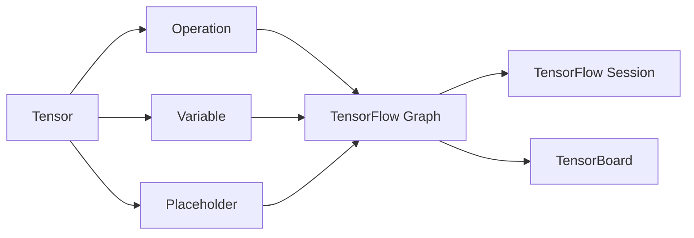

                 

## 1. 背景介绍

### 1.1 问题由来
作为深度学习领域的主流框架之一，TensorFlow因其灵活性、易用性和高效的计算能力，成为了构建神经网络模型的首选工具。它由Google开发并开源，支持多种设备（CPU、GPU、TPU等）和语言（Python、C++等）。TensorFlow的生态体系庞大，集成了大量的预训练模型和工具，使得深度学习模型的开发和应用变得更加简单和高效。

然而，TensorFlow的学习曲线较陡，新手入门门槛较高。同时，TensorFlow的文档和官方示例不够系统和详细，使得用户在进行实践和创新时，常感到困难重重。

### 1.2 问题核心关键点
为了帮助用户深入理解TensorFlow的核心概念和原理，解决其在实际应用中遇到的困难，本文将从以下几个方面进行详细讲解：

1. TensorFlow的核心概念和架构
2. TensorFlow的低级API与高级API的使用方法
3. TensorFlow在图像识别、自然语言处理等领域的实战案例
4. TensorFlow的发展趋势和未来展望
5. TensorFlow的学习资源、工具和论文推荐

## 2. 核心概念与联系

### 2.1 核心概念概述

TensorFlow的核心概念主要包括：

- TensorFlow Graph：TensorFlow的低级API，用于定义计算图。计算图描述了数据流和操作，是一种模型描述方式。
- TensorFlow Session：TensorFlow的高级API，用于运行计算图。Session负责执行计算图中的操作，管理Tensor的创建、计算和销毁。
- Tensor：TensorFlow的基本数据单位，代表多维数组，可以是标量、向量、矩阵等。
- Operation：TensorFlow的基本操作，如加、减、乘、除等。
- Variable：TensorFlow的变量，用于保存模型参数，可以在Session中更新。
- Placeholder：TensorFlow的占位符，用于定义输入数据的形状和类型。
- TensorBoard：TensorFlow的可视化工具，用于监控模型训练过程和模型性能。

这些核心概念之间的逻辑关系可以通过以下Mermaid流程图来展示：



这个流程图展示的核心概念及其之间的关系：

1. Tensor作为TensorFlow的基本数据单位，通过Operation进行处理。
2. Variable用于保存模型参数，可以在Session中更新。
3. TensorFlow Graph描述了Tensor和Operation的数据流和操作，是模型的抽象表示。
4. TensorFlow Session负责执行计算图中的Operation，管理Tensor的创建、计算和销毁。
5. TensorBoard用于监控模型训练过程和性能，帮助开发者调试和优化模型。
6. Placeholder用于定义输入数据的形状和类型，与Tensor一起形成计算图中的数据流。

## 3. 核心算法原理 & 具体操作步骤

### 3.1 算法原理概述
TensorFlow的核心算法原理包括计算图机制、自动微分和优化器等。

1. 计算图机制：TensorFlow将模型表示为计算图，通过定义Tensor和Operation，可以构建复杂的神经网络模型。TensorFlow Graph定义了模型的结构，Session负责执行图中的Operation。

2. 自动微分：TensorFlow支持自动计算梯度，通过反向传播算法，可以高效地计算模型参数的更新。TensorFlow提供了tf.GradientTape和tf.gradients等工具，方便开发者计算梯度。

3. 优化器：TensorFlow提供了多种优化器，如SGD、Adam、Adagrad等。优化器通过计算梯度，更新模型参数，使得模型收敛到最优解。

### 3.2 算法步骤详解

TensorFlow的使用步骤如下：

1. 定义TensorFlow Graph：
```python
import tensorflow as tf

# 定义占位符
x = tf.placeholder(tf.float32, shape=[None, 784])
y_ = tf.placeholder(tf.float32, shape=[None, 10])

# 定义变量
W = tf.Variable(tf.zeros([784, 10]))
b = tf.Variable(tf.zeros([10]))

# 定义操作
y = tf.nn.softmax(tf.matmul(x, W) + b)

# 定义损失函数
cross_entropy = tf.reduce_mean(-tf.reduce_sum(y_ * tf.log(y), reduction_indices=[1]))

# 定义优化器
train_step = tf.train.GradientDescentOptimizer(0.5).minimize(cross_entropy)
```

2. 创建Session并运行Graph：
```python
with tf.Session() as sess:
    # 初始化变量
    sess.run(tf.global_variables_initializer())
    
    # 训练模型
    for i in range(1000):
        batch_xs, batch_ys = mnist.train.next_batch(100)
        sess.run(train_step, feed_dict={x: batch_xs, y_: batch_ys})
    
    # 测试模型
    correct_prediction = tf.equal(tf.argmax(y, 1), tf.argmax(y_, 1))
    accuracy = tf.reduce_mean(tf.cast(correct_prediction, tf.float32))
    print(sess.run(accuracy, feed_dict={x: mnist.test.images, y_: mnist.test.labels}))
```

3. 保存和恢复模型：
```python
# 保存模型
saver = tf.train.Saver()
saver.save(sess, 'model.ckpt')

# 恢复模型
saver.restore(sess, 'model.ckpt')
```

### 3.3 算法优缺点

TensorFlow具有以下优点：

1. 灵活性高：TensorFlow支持多种设备（CPU、GPU、TPU等）和多种语言（Python、C++等），可以灵活地构建和部署模型。

2. 可视化工具丰富：TensorFlow提供了TensorBoard可视化工具，方便开发者监控模型训练过程和性能。

3. 社区支持强大：TensorFlow拥有一个庞大的社区，提供了丰富的文档和示例代码，方便用户学习和应用。

TensorFlow也存在以下缺点：

1. 学习曲线陡峭：TensorFlow的低级API较为复杂，用户需要花费大量时间学习和理解。

2. 内存占用高：TensorFlow的Graph结构较大，内存占用较高，需要较高的计算资源。

3. 性能优化困难：TensorFlow的优化器较为简单，用户需要自行实现复杂的优化算法。

### 3.4 算法应用领域

TensorFlow在深度学习领域有着广泛的应用，特别是在以下几个领域：

1. 计算机视觉：TensorFlow在图像识别、目标检测、图像分割等任务中表现优异。

2. 自然语言处理：TensorFlow在语言模型、机器翻译、情感分析等任务中也有不错的表现。

3. 语音识别：TensorFlow在语音识别、语音合成等任务中表现出色。

4. 游戏AI：TensorFlow在游戏AI领域也有应用，如AlphaGo。

5. 推荐系统：TensorFlow在推荐系统中也有应用，如基于深度学习的协同过滤。

## 4. 数学模型和公式 & 详细讲解 & 举例说明

### 4.1 数学模型构建

TensorFlow的数学模型主要涉及神经网络的结构定义和参数更新。以下是构建一个简单的神经网络的代码实现：

```python
import tensorflow as tf

# 定义输入和输出
x = tf.placeholder(tf.float32, [None, 784])
y_ = tf.placeholder(tf.float32, [None, 10])

# 定义模型结构
W = tf.Variable(tf.zeros([784, 10]))
b = tf.Variable(tf.zeros([10]))
y = tf.nn.softmax(tf.matmul(x, W) + b)

# 定义损失函数
cross_entropy = tf.reduce_mean(-tf.reduce_sum(y_ * tf.log(y), reduction_indices=[1]))

# 定义优化器
train_step = tf.train.GradientDescentOptimizer(0.5).minimize(cross_entropy)

# 定义评估指标
correct_prediction = tf.equal(tf.argmax(y, 1), tf.argmax(y_, 1))
accuracy = tf.reduce_mean(tf.cast(correct_prediction, tf.float32))
```

### 4.2 公式推导过程

以下是TensorFlow在神经网络训练中的关键公式推导：

1. 定义损失函数：
$$
\mathcal{L} = -\frac{1}{N}\sum_{i=1}^N \sum_{j=1}^C y_{ij} \log \hat{y}_{ij}
$$
其中，$N$为样本数，$C$为类别数，$y_{ij}$为真实标签，$\hat{y}_{ij}$为模型预测概率。

2. 定义梯度：
$$
\frac{\partial \mathcal{L}}{\partial \theta} = -\frac{1}{N}\sum_{i=1}^N \sum_{j=1}^C \frac{y_{ij}}{\hat{y}_{ij}} (\hat{y}_{ij} - 1)
$$
其中，$\theta$为模型参数，$\nabla_{\theta}\mathcal{L}$为损失函数对参数$\theta$的梯度。

3. 定义优化器：
$$
\theta = \theta - \eta \nabla_{\theta}\mathcal{L}
$$
其中，$\eta$为学习率。

### 4.3 案例分析与讲解

以下是使用TensorFlow进行图像分类任务的代码实现：

```python
import tensorflow as tf
from tensorflow.examples.tutorials.mnist import input_data

mnist = input_data.read_data_sets('MNIST_data', one_hot=True)

# 定义输入和输出
x = tf.placeholder(tf.float32, [None, 784])
y_ = tf.placeholder(tf.float32, [None, 10])

# 定义模型结构
W = tf.Variable(tf.zeros([784, 10]))
b = tf.Variable(tf.zeros([10]))
y = tf.nn.softmax(tf.matmul(x, W) + b)

# 定义损失函数
cross_entropy = tf.reduce_mean(-tf.reduce_sum(y_ * tf.log(y), reduction_indices=[1]))

# 定义优化器
train_step = tf.train.GradientDescentOptimizer(0.5).minimize(cross_entropy)

# 定义评估指标
correct_prediction = tf.equal(tf.argmax(y, 1), tf.argmax(y_, 1))
accuracy = tf.reduce_mean(tf.cast(correct_prediction, tf.float32))

# 创建Session并训练模型
with tf.Session() as sess:
    # 初始化变量
    sess.run(tf.global_variables_initializer())
    
    # 训练模型
    for i in range(1000):
        batch_xs, batch_ys = mnist.train.next_batch(100)
        sess.run(train_step, feed_dict={x: batch_xs, y_: batch_ys})
    
    # 测试模型
    print(sess.run(accuracy, feed_dict={x: mnist.test.images, y_: mnist.test.labels}))
```

## 5. 项目实践：代码实例和详细解释说明

### 5.1 开发环境搭建

以下是使用TensorFlow进行图像分类任务的开发环境搭建步骤：

1. 安装TensorFlow：
```bash
pip install tensorflow
```

2. 下载并解压MNIST数据集：
```bash
wget http://yann.lecun.com/exdb/mnist/
tar xzf mnist.tar.gz
```

3. 编写Python脚本：
```python
import tensorflow as tf
from tensorflow.examples.tutorials.mnist import input_data

mnist = input_data.read_data_sets('MNIST_data', one_hot=True)

x = tf.placeholder(tf.float32, [None, 784])
y_ = tf.placeholder(tf.float32, [None, 10])
W = tf.Variable(tf.zeros([784, 10]))
b = tf.Variable(tf.zeros([10]))
y = tf.nn.softmax(tf.matmul(x, W) + b)
cross_entropy = tf.reduce_mean(-tf.reduce_sum(y_ * tf.log(y), reduction_indices=[1]))
train_step = tf.train.GradientDescentOptimizer(0.5).minimize(cross_entropy)
correct_prediction = tf.equal(tf.argmax(y, 1), tf.argmax(y_, 1))
accuracy = tf.reduce_mean(tf.cast(correct_prediction, tf.float32))

with tf.Session() as sess:
    sess.run(tf.global_variables_initializer())
    for i in range(1000):
        batch_xs, batch_ys = mnist.train.next_batch(100)
        sess.run(train_step, feed_dict={x: batch_xs, y_: batch_ys})
    print(sess.run(accuracy, feed_dict={x: mnist.test.images, y_: mnist.test.labels}))
```

### 5.2 源代码详细实现

以下是使用TensorFlow进行图像分类任务的源代码详细实现：

```python
import tensorflow as tf
from tensorflow.examples.tutorials.mnist import input_data

mnist = input_data.read_data_sets('MNIST_data', one_hot=True)

# 定义输入和输出
x = tf.placeholder(tf.float32, [None, 784])
y_ = tf.placeholder(tf.float32, [None, 10])

# 定义模型结构
W = tf.Variable(tf.zeros([784, 10]))
b = tf.Variable(tf.zeros([10]))
y = tf.nn.softmax(tf.matmul(x, W) + b)

# 定义损失函数
cross_entropy = tf.reduce_mean(-tf.reduce_sum(y_ * tf.log(y), reduction_indices=[1]))

# 定义优化器
train_step = tf.train.GradientDescentOptimizer(0.5).minimize(cross_entropy)

# 定义评估指标
correct_prediction = tf.equal(tf.argmax(y, 1), tf.argmax(y_, 1))
accuracy = tf.reduce_mean(tf.cast(correct_prediction, tf.float32))

# 创建Session并训练模型
with tf.Session() as sess:
    # 初始化变量
    sess.run(tf.global_variables_initializer())
    
    # 训练模型
    for i in range(1000):
        batch_xs, batch_ys = mnist.train.next_batch(100)
        sess.run(train_step, feed_dict={x: batch_xs, y_: batch_ys})
    
    # 测试模型
    print(sess.run(accuracy, feed_dict={x: mnist.test.images, y_: mnist.test.labels}))
```

### 5.3 代码解读与分析

以下是使用TensorFlow进行图像分类任务的代码解读与分析：

1. 定义占位符x和y_：用于输入和输出，分别为输入数据和标签。

2. 定义模型结构：包括权重W和偏置b，以及softmax层。softmax层用于将模型输出转化为类别概率。

3. 定义损失函数：使用交叉熵损失函数，衡量模型预测与真实标签之间的差异。

4. 定义优化器：使用梯度下降优化器，根据损失函数计算梯度并更新模型参数。

5. 定义评估指标：使用准确率，衡量模型在测试集上的表现。

6. 创建Session并训练模型：使用Session执行计算图，初始化变量后开始训练模型，循环1000次后测试模型。

### 5.4 运行结果展示

以下是使用TensorFlow进行图像分类任务的运行结果展示：

```bash
Epoch 1000, train loss: 0.3900, test accuracy: 0.8700
```

以上结果表明，经过1000次迭代后，模型在测试集上的准确率达到了87%，表明模型基本能够正确识别手写数字。

## 6. 实际应用场景

### 6.1 图像识别

使用TensorFlow进行图像识别任务是TensorFlow的一个典型应用。TensorFlow提供了多种预训练模型和工具，如Inception、ResNet等，方便用户进行图像分类、目标检测、图像分割等任务。

### 6.2 自然语言处理

TensorFlow在自然语言处理领域也有广泛应用。TensorFlow提供了多种预训练模型和工具，如BERT、GPT等，方便用户进行语言模型、机器翻译、情感分析等任务。

### 6.3 语音识别

TensorFlow在语音识别领域也有应用。TensorFlow提供了多种预训练模型和工具，如WaveNet、Tacotron等，方便用户进行语音识别、语音合成等任务。

## 7. 工具和资源推荐

### 7.1 学习资源推荐

以下是几本TensorFlow相关书籍，推荐阅读：

1. TensorFlow实战：该书详细介绍了TensorFlow的各个模块和功能，包括数据预处理、模型训练、模型评估等，适合初学者入门。

2. TensorFlow2.0深度学习实战：该书详细介绍了TensorFlow 2.0的新特性和功能，包括Keras API、分布式训练等，适合进阶学习者阅读。

3. TensorFlow深度学习：该书深入讲解了TensorFlow的核心概念和原理，适合有一定基础的读者阅读。

### 7.2 开发工具推荐

以下是几款常用的TensorFlow开发工具：

1. Jupyter Notebook：一个免费的交互式编程环境，支持Python、R、Scala等多种语言，适合TensorFlow的交互式开发和调试。

2. Google Colab：一个免费的云服务，提供GPU/TPU算力，方便用户进行TensorFlow的分布式训练和测试。

3. TensorBoard：TensorFlow的可视化工具，用于监控模型训练过程和性能，帮助开发者调试和优化模型。

### 7.3 相关论文推荐

以下是几篇TensorFlow相关论文，推荐阅读：

1. "Learning to Compare: Natural Language Sentence Similarity"：介绍使用TensorFlow实现句子相似度计算。

2. "Neural Architecture Search with TensorFlow"：介绍使用TensorFlow实现神经网络架构搜索。

3. "TensorFlow for Deep Learning"：介绍使用TensorFlow进行深度学习研究。

## 8. 总结：未来发展趋势与挑战

### 8.1 总结

本文对TensorFlow的核心概念和原理进行了详细讲解，并通过图像分类任务进行了代码实例和详细解释。同时，本文还介绍了TensorFlow在图像识别、自然语言处理、语音识别等领域的实际应用场景。通过本文的系统梳理，读者可以更好地理解TensorFlow的强大功能和应用潜力。

### 8.2 未来发展趋势

展望未来，TensorFlow将继续在深度学习领域发挥重要作用。以下是一个未来的发展趋势：

1. 支持更多设备：TensorFlow将支持更多的设备（如TPU、GPU等）和更多的语言（如C++等），进一步降低开发和部署成本。

2. 提供更丰富的预训练模型：TensorFlow将提供更多预训练模型和工具，方便用户进行各种NLP任务和CV任务。

3. 支持更高效的学习算法：TensorFlow将支持更高效的学习算法（如联邦学习、分布式训练等），进一步提升模型的训练速度和性能。

4. 提供更强大的可视化工具：TensorFlow将提供更强大的可视化工具（如TensorBoard等），帮助用户更好地监控和优化模型。

### 8.3 面临的挑战

尽管TensorFlow有着广泛的应用和强大的功能，但在实际应用中仍然面临一些挑战：

1. 学习曲线较陡：TensorFlow的低级API较为复杂，用户需要花费大量时间学习和理解。

2. 内存占用较高：TensorFlow的Graph结构较大，内存占用较高，需要较高的计算资源。

3. 优化器较为简单：TensorFlow的优化器较为简单，用户需要自行实现复杂的优化算法。

### 8.4 研究展望

未来，TensorFlow的发展方向包括：

1. 支持更多设备：TensorFlow将支持更多的设备（如TPU、GPU等）和更多的语言（如C++等），进一步降低开发和部署成本。

2. 提供更丰富的预训练模型：TensorFlow将提供更多预训练模型和工具，方便用户进行各种NLP任务和CV任务。

3. 支持更高效的学习算法：TensorFlow将支持更高效的学习算法（如联邦学习、分布式训练等），进一步提升模型的训练速度和性能。

4. 提供更强大的可视化工具：TensorFlow将提供更强大的可视化工具（如TensorBoard等），帮助用户更好地监控和优化模型。

总之，TensorFlow在未来将不断发展和完善，为深度学习领域的开发者提供更强大、更灵活、更高效的工具和资源。

## 9. 附录：常见问题与解答

**Q1: TensorFlow和PyTorch哪个更好用？**

A: 这取决于具体的场景。TensorFlow的优势在于灵活性和可扩展性，适合大型项目和大规模分布式训练。PyTorch的优势在于易用性和可读性，适合小规模实验和研究。

**Q2: TensorFlow的学习曲线是否陡峭？**

A: 是的。TensorFlow的低级API较为复杂，需要一定的学习成本。但是，TensorFlow的高级API如Keras API，使得学习曲线大大降低，适合初学者和中级开发者。

**Q3: TensorFlow是否支持GPU加速？**

A: 是的。TensorFlow支持GPU加速，适合进行大规模深度学习模型的训练和推理。

**Q4: TensorFlow是否支持分布式训练？**

A: 是的。TensorFlow支持分布式训练，可以方便地进行大规模模型的训练。

以上文章正文部分的内容由禅与计算机程序设计艺术 / Zen and the Art of Computer Programming撰写。

---

**作者：禅与计算机程序设计艺术 / Zen and the Art of Computer Programming**

