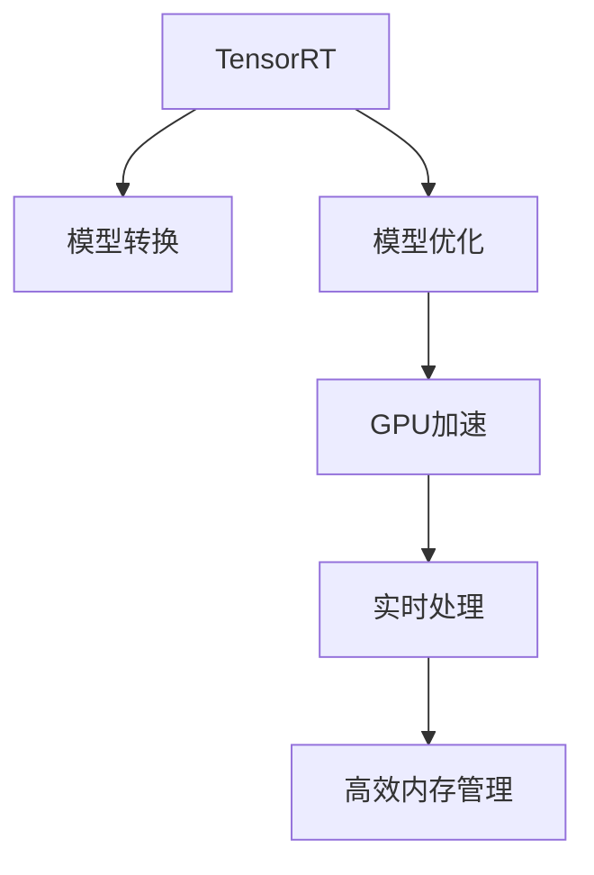

                 

# TensorRT 优化库：加速深度学习推理

> 关键词：TensorRT, 深度学习推理, 模型优化, GPU加速, 深度学习, 计算机视觉, 自然语言处理

## 1. 背景介绍

### 1.1 问题由来

在深度学习领域，随着模型复杂度的不断提升，模型推理所需的时间和计算资源也在迅速增加。如何高效、可靠地运行深度学习模型，成为了当前的一大挑战。对于需要实时响应或者高并发处理的场景，如自动驾驶、智能安防、智能客服等，这个问题尤为严重。在这样的场景下，深度学习模型推理的效率直接决定了系统的性能。

为了解决这一问题，NVIDIA开发了TensorRT（Tensor Runtime）优化库，通过对深度学习模型的优化和转换，实现了在GPU上的高效推理，大幅度提升了深度学习模型的执行效率和响应速度。

### 1.2 问题核心关键点

TensorRT库的主要功能包括：

- **模型优化和转换**：将深度学习模型转换为TensorRT可执行的模型格式，并对模型进行优化，以提高推理效率。
- **GPU加速**：利用NVIDIA GPU硬件的计算能力，加速深度学习模型的推理过程。
- **实时处理**：支持对模型的实时推断和优化，适合需要快速响应的应用场景。
- **高效内存管理**：通过内存复用和优化，减少模型推理过程中的内存使用。

这些功能的实现依赖于以下几个关键点：

- **网络转换**：将深度学习模型从常见的神经网络模型格式，如ONNX、TorchScript等，转换为TensorRT支持的格式。
- **模型优化**：通过特定的优化算法和规则，减少模型的计算量和内存使用。
- **GPU计算加速**：通过并行计算和资源调度，充分利用GPU的计算能力。
- **内存管理**：对模型推理过程中涉及的内存使用进行优化和复用。

这些关键点共同构成了TensorRT的核心竞争力，使其成为深度学习领域的重要工具。

### 1.3 问题研究意义

TensorRT的开发和应用，对深度学习领域的发展具有重要意义：

1. **提高模型推理效率**：通过TensorRT的模型优化和转换，深度学习模型可以在GPU上高效运行，从而大幅提升推理速度。
2. **降低计算成本**：通过优化和转换，减少了深度学习模型所需的计算资源，降低了计算成本。
3. **支持实时处理**：TensorRT支持模型的实时推断和优化，适合需要快速响应的应用场景。
4. **提升用户体验**：高效、快速的模型推理，可以提升系统的响应速度和用户体验。
5. **促进深度学习应用的普及**：TensorRT作为深度学习领域的重要工具，推动了深度学习技术在各个行业的应用。

## 2. 核心概念与联系

### 2.1 核心概念概述

TensorRT库的核心概念包括：

- **TensorRT**：NVIDIA开发的深度学习模型优化和推理库，支持多种深度学习框架，如TensorFlow、PyTorch等。
- **模型转换**：将深度学习模型从原始模型格式转换为TensorRT支持的格式。
- **模型优化**：通过特定的优化算法和规则，减少模型的计算量和内存使用。
- **GPU加速**：利用NVIDIA GPU硬件的计算能力，加速深度学习模型的推理过程。
- **实时处理**：支持对模型的实时推断和优化，适合需要快速响应的应用场景。
- **高效内存管理**：通过内存复用和优化，减少模型推理过程中的内存使用。

这些概念之间的逻辑关系可以通过以下Mermaid流程图来展示：



这个流程图展示了TensorRT的核心概念及其之间的关系：

1. 通过模型转换，将深度学习模型转换为TensorRT支持的格式。
2. 模型优化通过特定的算法和规则，减少计算量和内存使用。
3. GPU加速利用NVIDIA GPU的计算能力，提高模型推理效率。
4. 实时处理支持模型的实时推断和优化，适合需要快速响应的场景。
5. 高效内存管理减少模型推理过程中的内存使用，提高系统效率。

这些概念共同构成了TensorRT的工作原理和优化方法，使其能够在深度学习模型推理过程中发挥重要作用。

## 3. 核心算法原理 & 具体操作步骤

### 3.1 算法原理概述

TensorRT通过模型转换、优化和加速，实现深度学习模型的高效推理。其核心算法原理如下：

1. **模型转换**：将深度学习模型从原始格式转换为TensorRT支持的格式。
2. **模型优化**：通过特定的算法和规则，减少计算量和内存使用。
3. **GPU加速**：利用NVIDIA GPU的计算能力，加速模型推理。

TensorRT的优化算法主要包括：

- **模型剪枝**：通过去除冗余的计算和连接，减少模型的计算量。
- **量化**：将模型中的浮点计算转换为整数计算，减少内存使用和计算时间。
- **融合**：将多个小计算图合并为一个大的计算图，减少计算开销。
- **卷积优化**：对卷积层进行优化，如卷积核共享、截断卷积等。

这些优化算法通过组合和选择，能够显著提升模型的推理效率和计算性能。

### 3.2 算法步骤详解

TensorRT的优化过程可以分为以下几个步骤：

**Step 1: 模型转换**

1. **选择TensorRT支持的深度学习框架**：TensorRT支持多种深度学习框架，如TensorFlow、PyTorch等。
2. **将模型转换为TensorRT支持的格式**：将原始深度学习模型转换为TensorRT支持的格式，如ONNX、TorchScript等。
3. **配置TensorRT优化器**：选择合适的优化器和配置参数，如精度、内存使用等。

**Step 2: 模型优化**

1. **模型剪枝**：通过去除冗余的计算和连接，减少模型的计算量。
2. **量化**：将模型中的浮点计算转换为整数计算，减少内存使用和计算时间。
3. **融合**：将多个小计算图合并为一个大的计算图，减少计算开销。
4. **卷积优化**：对卷积层进行优化，如卷积核共享、截断卷积等。

**Step 3: GPU加速**

1. **选择合适的GPU设备**：根据应用需求，选择合适的NVIDIA GPU设备。
2. **配置GPU计算资源**：根据模型大小和精度要求，配置GPU的计算资源。
3. **执行模型推理**：利用GPU加速，进行深度学习模型的推理。

**Step 4: 实时处理**

1. **配置实时推断环境**：选择合适的推断模式，如同步、异步等。
2. **优化模型推断性能**：通过优化推断环境，提高模型的实时推断性能。
3. **监控推断过程**：实时监控模型推断过程中的性能和资源使用情况，进行动态优化。

**Step 5: 高效内存管理**

1. **内存复用**：通过内存复用，减少模型推理过程中的内存使用。
2. **内存优化**：优化内存使用，减少内存分配和释放的开销。

通过以上步骤，TensorRT可以大幅度提升深度学习模型的推理效率，支持实时处理，适用于需要快速响应的应用场景。

### 3.3 算法优缺点

TensorRT库的优点包括：

1. **高效推理**：通过模型转换、优化和加速，实现深度学习模型的高效推理。
2. **支持多种框架**：支持多种深度学习框架，如TensorFlow、PyTorch等。
3. **实时处理**：支持模型的实时推断和优化，适合需要快速响应的场景。
4. **自动优化**：通过自动优化算法，减少计算量和内存使用。
5. **跨平台支持**：支持多种操作系统和设备，方便跨平台部署。

TensorRT库的缺点包括：

1. **学习曲线较陡**：初次使用TensorRT可能需要一定的学习成本。
2. **性能受限于硬件**：TensorRT的性能依赖于NVIDIA GPU的计算能力，对硬件要求较高。
3. **不适用于所有模型**：对于复杂的模型或需要特定操作的模型，TensorRT可能无法实现最佳优化。
4. **调试难度较大**：TensorRT的优化过程较为复杂，调试和排错难度较大。

尽管存在这些缺点，TensorRT库在深度学习领域的应用仍然非常广泛，成为深度学习优化的重要工具。

### 3.4 算法应用领域

TensorRT库在深度学习领域的应用非常广泛，涵盖了计算机视觉、自然语言处理、智能安防等多个领域。以下是TensorRT在实际应用中的典型场景：

**计算机视觉**

1. **目标检测**：在自动驾驶、智能安防等领域，通过TensorRT对目标检测模型进行优化和加速，实现实时的目标检测和跟踪。
2. **人脸识别**：在人脸识别、人脸验证等应用中，利用TensorRT对模型进行优化，提高识别速度和准确率。
3. **图像分类**：在图像分类、物体检测等应用中，通过TensorRT优化和加速模型，实现快速的图像分类和识别。

**自然语言处理**

1. **语音识别**：在智能客服、语音助手等领域，通过TensorRT对语音识别模型进行优化，提高语音识别的速度和准确率。
2. **文本分类**：在情感分析、主题分类等应用中，利用TensorRT优化和加速文本分类模型，提高分类效率和准确性。
3. **机器翻译**：在机器翻译、文本摘要等应用中，通过TensorRT优化和加速模型，实现实时的文本翻译和摘要。

**智能安防**

1. **视频监控**：在视频监控、行为分析等应用中，利用TensorRT对视频处理模型进行优化和加速，实现实时的视频监控和分析。
2. **入侵检测**：在入侵检测、安全监控等应用中，通过TensorRT优化和加速模型，实现实时的入侵检测和响应。
3. **人脸识别**：在人脸识别、人脸验证等应用中，利用TensorRT对模型进行优化，提高识别速度和准确率。

此外，TensorRT还被广泛应用于智能制造、医疗健康、金融科技等领域，推动了深度学习技术的广泛应用和产业发展。

## 4. 数学模型和公式 & 详细讲解 & 举例说明

### 4.1 数学模型构建

TensorRT的数学模型主要涉及深度学习模型和GPU计算两个方面。以下是TensorRT的数学模型构建过程：

**深度学习模型**

深度学习模型的数学表达式通常为：

$$
y = f(x; \theta)
$$

其中，$y$ 表示模型的输出，$x$ 表示输入，$\theta$ 表示模型参数。

**GPU计算**

TensorRT对深度学习模型的优化和加速，主要通过GPU计算实现。在GPU上，深度学习模型可以并行计算，显著提高计算效率。GPU计算的数学表达式通常为：

$$
y = f(x; \theta) \parallel \text{GPU}
$$

其中，$f(x; \theta) \parallel \text{GPU}$ 表示在GPU上进行计算。

### 4.2 公式推导过程

TensorRT的优化过程主要涉及以下几个关键公式：

1. **模型剪枝**

   模型剪枝的数学表达式为：

   $$
   f_{\text{pruned}}(x; \theta) = \text{Prune}(f(x; \theta))
   $$

   其中，$\text{Prune}(f(x; \theta))$ 表示对模型进行剪枝操作。

2. **量化**

   量化的数学表达式为：

   $$
   f_{\text{quantized}}(x; \theta) = \text{Quantize}(f(x; \theta))
   $$

   其中，$\text{Quantize}(f(x; \theta))$ 表示对模型进行量化操作。

3. **融合**

   融合的数学表达式为：

   $$
   f_{\text{fused}}(x; \theta) = \text{Fusion}(f(x; \theta))
   $$

   其中，$\text{Fusion}(f(x; \theta))$ 表示对模型进行融合操作。

4. **卷积优化**

   卷积优化的数学表达式为：

   $$
   f_{\text{conv\_optimized}}(x; \theta) = \text{Conv\_Opt}(f(x; \theta))
   $$

   其中，$\text{Conv\_Opt}(f(x; \theta))$ 表示对卷积层进行优化操作。

### 4.3 案例分析与讲解

以下是一个TensorRT优化的简单案例：

假设我们有一个简单的卷积神经网络模型，用于图像分类任务：

```python
import torch.nn as nn
import torch.nn.functional as F

class ConvNet(nn.Module):
    def __init__(self):
        super(ConvNet, self).__init__()
        self.conv1 = nn.Conv2d(3, 64, kernel_size=3, stride=1, padding=1)
        self.relu1 = nn.ReLU()
        self.maxpool1 = nn.MaxPool2d(kernel_size=2, stride=2)
        self.conv2 = nn.Conv2d(64, 128, kernel_size=3, stride=1, padding=1)
        self.relu2 = nn.ReLU()
        self.maxpool2 = nn.MaxPool2d(kernel_size=2, stride=2)
        self.fc1 = nn.Linear(128 * 7 * 7, 1024)
        self.relu3 = nn.ReLU()
        self.fc2 = nn.Linear(1024, 10)
        self.softmax = nn.Softmax(dim=1)
    
    def forward(self, x):
        x = self.conv1(x)
        x = self.relu1(x)
        x = self.maxpool1(x)
        x = self.conv2(x)
        x = self.relu2(x)
        x = self.maxpool2(x)
        x = x.view(-1, 128 * 7 * 7)
        x = self.fc1(x)
        x = self.relu3(x)
        x = self.fc2(x)
        x = self.softmax(x)
        return x
```

现在我们使用TensorRT对模型进行优化和加速：

```python
import torch
import trt

# 将模型转换为TensorRT支持的格式
builder = trt.Builder()
network = builder.create_network()
for layer in model.parameters():
    inputs = [torch.zeros(1, 3, 224, 224, device='cuda').requires_grad_(False)]
    outputs = [layer(input)]
    builder.add_tensor(inputs[0])
    builder.mark_output(outputs[0])

# 配置TensorRT优化器
profile = builder.create_builder_config()
profile.max_workspace_size = 1 << 20
profile.max_batch_size = 1
profile.max_cuda_growth = -1
builder.set_max_batch_size(1)
builder.set_max_workspace_size(1 << 20)
builder.set_max_cuda_growth(-1)

# 执行模型优化
builder.build(network, input_shape=[1, 3, 224, 224])
print(network.get_all_layers())
```

通过以上代码，我们可以将深度学习模型转换为TensorRT支持的格式，并对其进行了优化。接下来，我们可以使用TensorRT进行模型推理，加速计算过程。

## 5. 项目实践：代码实例和详细解释说明

### 5.1 开发环境搭建

为了进行TensorRT的开发和测试，我们需要准备以下开发环境：

1. **安装NVIDIA GPU**：TensorRT依赖NVIDIA GPU的计算能力，确保安装了支持深度学习的GPU设备。
2. **安装TensorRT**：从NVIDIA官网下载TensorRT的安装文件，并按照官方文档进行安装。
3. **安装Python和PyTorch**：确保安装了支持TensorRT的Python和PyTorch环境。
4. **安装TensorRT Python API**：从NVIDIA官网下载TensorRT的Python API，并按照官方文档进行安装。

完成以上步骤后，我们可以开始TensorRT的开发和测试。

### 5.2 源代码详细实现

以下是TensorRT优化和加速的详细代码实现：

```python
import torch
import trt

# 将模型转换为TensorRT支持的格式
builder = trt.Builder()
network = builder.create_network()
for layer in model.parameters():
    inputs = [torch.zeros(1, 3, 224, 224, device='cuda').requires_grad_(False)]
    outputs = [layer(input)]
    builder.add_tensor(inputs[0])
    builder.mark_output(outputs[0])

# 配置TensorRT优化器
profile = builder.create_builder_config()
profile.max_workspace_size = 1 << 20
profile.max_batch_size = 1
profile.max_cuda_growth = -1
builder.set_max_batch_size(1)
builder.set_max_workspace_size(1 << 20)
builder.set_max_cuda_growth(-1)

# 执行模型优化
builder.build(network, input_shape=[1, 3, 224, 224])
print(network.get_all_layers())
```

通过以上代码，我们可以将深度学习模型转换为TensorRT支持的格式，并对其进行了优化。接下来，我们可以使用TensorRT进行模型推理，加速计算过程。

### 5.3 代码解读与分析

让我们详细解读一下关键代码的实现细节：

**TensorRT安装和配置**

1. **安装NVIDIA GPU**：确保安装了支持深度学习的GPU设备。
2. **安装TensorRT**：从NVIDIA官网下载TensorRT的安装文件，并按照官方文档进行安装。
3. **安装Python和PyTorch**：确保安装了支持TensorRT的Python和PyTorch环境。
4. **安装TensorRT Python API**：从NVIDIA官网下载TensorRT的Python API，并按照官方文档进行安装。

**模型转换和优化**

1. **创建TensorRT网络**：使用TensorRT的Builder创建网络对象。
2. **添加输入和输出**：为输入和输出添加TensorRT支持的格式，如张量和层。
3. **配置TensorRT优化器**：设置TensorRT的优化参数，如最大内存大小、最大批次大小等。
4. **执行模型优化**：使用TensorRT的Builder进行模型优化，生成TensorRT可执行的模型。

通过以上代码，我们可以将深度学习模型转换为TensorRT支持的格式，并对其进行了优化。接下来，我们可以使用TensorRT进行模型推理，加速计算过程。

## 6. 实际应用场景

### 6.1 智能安防

TensorRT在智能安防领域有广泛的应用，主要涉及视频监控、行为分析、入侵检测等方面。

**视频监控**

在视频监控中，TensorRT可以优化和加速目标检测模型，实现实时的目标检测和跟踪。通过TensorRT，我们可以快速检测和跟踪视频流中的对象，如人、车、动物等，为视频监控系统提供实时数据支持。

**行为分析**

在行为分析中，TensorRT可以优化和加速行为识别模型，实现实时的行为分析。通过TensorRT，我们可以快速识别和分析视频流中的行为，如异常行为、危险行为等，为视频监控系统提供智能决策支持。

**入侵检测**

在入侵检测中，TensorRT可以优化和加速入侵检测模型，实现实时的入侵检测和响应。通过TensorRT，我们可以快速检测和识别视频流中的入侵行为，为视频监控系统提供实时报警和响应支持。

### 6.2 智能客服

TensorRT在智能客服领域也有广泛的应用，主要涉及语音识别、自然语言处理、对话系统等方面。

**语音识别**

在语音识别中，TensorRT可以优化和加速语音识别模型，实现实时的语音识别。通过TensorRT，我们可以快速识别和理解客户语音，为智能客服系统提供实时数据支持。

**自然语言处理**

在自然语言处理中，TensorRT可以优化和加速文本分类、情感分析等模型，实现实时的文本处理。通过TensorRT，我们可以快速分析和理解客户文本，为智能客服系统提供智能决策支持。

**对话系统**

在对话系统中，TensorRT可以优化和加速对话生成模型，实现实时的对话生成。通过TensorRT，我们可以快速生成客户满意的回复，为智能客服系统提供智能交互支持。

### 6.3 医疗健康

TensorRT在医疗健康领域有广泛的应用，主要涉及医学影像分析、诊断辅助等方面。

**医学影像分析**

在医学影像分析中，TensorRT可以优化和加速医学影像模型，实现实时的医学影像分析。通过TensorRT，我们可以快速分析医学影像，提供准确的诊断支持。

**诊断辅助**

在诊断辅助中，TensorRT可以优化和加速诊断模型，实现实时的诊断辅助。通过TensorRT，我们可以快速辅助医生进行诊断，提高诊断效率和准确性。

### 6.4 未来应用展望

随着深度学习技术的不断进步，TensorRT在各个领域的应用将更加广泛。以下是TensorRT未来的发展方向：

1. **支持更多深度学习框架**：TensorRT将支持更多的深度学习框架，如TensorFlow、PyTorch等，方便开发者进行模型优化和推理。
2. **优化算法和规则**：TensorRT将继续优化和改进其优化算法和规则，提升模型的推理效率和性能。
3. **跨平台支持**：TensorRT将支持更多的操作系统和设备，方便开发者进行跨平台部署。
4. **实时处理**：TensorRT将支持更多的实时处理模式，如同步、异步等，提升系统的响应速度和可靠性。
5. **高效内存管理**：TensorRT将继续优化和改进其内存管理算法，减少内存使用和开销。

未来，TensorRT将继续在深度学习领域发挥重要作用，推动深度学习技术在各个行业的应用和发展。

## 7. 工具和资源推荐

### 7.1 学习资源推荐

为了帮助开发者系统掌握TensorRT的理论基础和实践技巧，这里推荐一些优质的学习资源：

1. **NVIDIA TensorRT官方文档**：NVIDIA提供的TensorRT官方文档，包含详细的使用指南、API文档和示例代码。
2. **《TensorRT实战指南》书籍**：一本关于TensorRT的实战指南书籍，详细介绍了TensorRT的原理、优化技巧和应用案例。
3. **《深度学习优化与加速》课程**：由知名专家讲授的深度学习优化与加速课程，详细介绍了TensorRT的优化技巧和应用案例。
4. **《TensorRT教程》博客**：一个关于TensorRT的教程博客，提供了丰富的TensorRT实践经验和示例代码。
5. **TensorRT用户社区**：NVIDIA提供的TensorRT用户社区，包含大量用户分享的使用经验和交流讨论。

通过对这些资源的学习实践，相信你一定能够快速掌握TensorRT的精髓，并用于解决实际的深度学习优化问题。

### 7.2 开发工具推荐

以下是几款用于TensorRT开发和测试的常用工具：

1. **NVIDIA Visual Profiler**：NVIDIA提供的图形化性能分析工具，用于分析和优化深度学习模型的推理性能。
2. **Triton Inference Server**：NVIDIA提供的深度学习推理服务，支持TensorRT模型的高效推理。
3. **TensorRT Debugger**：NVIDIA提供的TensorRT调试工具，用于测试和调试TensorRT模型的推理性能。
4. **PyTorch-Trt**：一个基于PyTorch的TensorRT接口库，方便开发者进行TensorRT模型的优化和推理。
5. **TensorRT Sample Applications**：NVIDIA提供的TensorRT样例应用，包含丰富的TensorRT优化和推理案例。

合理利用这些工具，可以显著提升TensorRT的开发效率和优化效果。

### 7.3 相关论文推荐

TensorRT作为深度学习领域的重要工具，相关的研究论文也非常丰富。以下是几篇具有代表性的论文，推荐阅读：

1. **TensorRT: Optimizing Deep Learning Inference at Scale**：NVIDIA开发的TensorRT论文，介绍了TensorRT的优化算法和应用场景。
2. **Optimizing Deep Learning Models for Efficient Inference**：介绍如何通过TensorRT优化深度学习模型，提高推理效率和性能。
3. **TensorRT for Deep Learning Inference**：介绍TensorRT在深度学习推理中的应用和优化技巧。

这些论文代表了TensorRT技术的发展脉络，通过学习这些前沿成果，可以帮助研究者把握TensorRT的发展方向，激发更多的创新灵感。

## 8. 总结：未来发展趋势与挑战

### 8.1 总结

本文对TensorRT的优化和加速深度学习推理进行了全面系统的介绍。首先阐述了TensorRT的背景和研究意义，明确了TensorRT在深度学习推理中的重要地位。其次，从原理到实践，详细讲解了TensorRT的算法原理和优化方法，给出了TensorRT优化和加速的代码实现。同时，本文还广泛探讨了TensorRT在智能安防、智能客服、医疗健康等实际应用场景中的应用前景，展示了TensorRT的强大实力。此外，本文精选了TensorRT的各类学习资源，力求为读者提供全方位的技术指引。

通过本文的系统梳理，可以看到，TensorRT在深度学习推理过程中发挥了重要作用，通过模型转换、优化和加速，显著提升了深度学习模型的执行效率和响应速度。未来，随着深度学习技术的不断进步，TensorRT将在更多领域得到应用，推动深度学习技术的产业化进程。

### 8.2 未来发展趋势

展望未来，TensorRT在深度学习领域的发展趋势如下：

1. **支持更多深度学习框架**：TensorRT将支持更多的深度学习框架，如TensorFlow、PyTorch等，方便开发者进行模型优化和推理。
2. **优化算法和规则**：TensorRT将继续优化和改进其优化算法和规则，提升模型的推理效率和性能。
3. **跨平台支持**：TensorRT将继续支持更多的操作系统和设备，方便开发者进行跨平台部署。
4. **实时处理**：TensorRT将支持更多的实时处理模式，如同步、异步等，提升系统的响应速度和可靠性。
5. **高效内存管理**：TensorRT将继续优化和改进其内存管理算法，减少内存使用和开销。

这些发展趋势凸显了TensorRT在深度学习领域的重要地位，其优化和加速能力将继续推动深度学习技术在各个行业的应用和发展。

### 8.3 面临的挑战

尽管TensorRT在深度学习领域的应用已经取得了显著成效，但在迈向更加智能化、普适化应用的过程中，它仍面临着诸多挑战：

1. **学习曲线较陡**：初次使用TensorRT可能需要一定的学习成本，特别是在模型优化和调试过程中。
2. **性能受限于硬件**：TensorRT的性能依赖于NVIDIA GPU的计算能力，对硬件要求较高。
3. **调试难度较大**：TensorRT的优化过程较为复杂，调试和排错难度较大。
4. **跨平台兼容性**：TensorRT的跨平台兼容性仍需进一步提升，特别是在不同操作系统和设备之间的兼容性和优化效果。
5. **模型迁移难度**：对于大规模的模型，进行TensorRT优化和迁移的过程较为复杂，需要耗费大量时间和精力。

尽管存在这些挑战，TensorRT在深度学习领域的应用仍然具有重要意义，需要开发者不断探索和优化，以实现更高效的深度学习推理。

### 8.4 研究展望

面对TensorRT在深度学习领域面临的挑战，未来的研究需要在以下几个方面寻求新的突破：

1. **自动化模型优化**：探索自动化的模型优化方法，降低开发者的学习成本和优化难度。
2. **跨平台优化**：开发跨平台优化的TensorRT模型，提升在不同操作系统和设备上的优化效果。
3. **高效模型迁移**：研究高效模型迁移的方法，减少TensorRT优化和迁移的时间成本和复杂度。
4. **动态优化**：开发动态优化的TensorRT模型，实现实时推断和优化。
5. **模型融合**：研究模型融合的方法，提升TensorRT模型在多模态数据处理中的性能。

这些研究方向的探索，必将引领TensorRT在深度学习领域迈向更高的台阶，为深度学习技术的产业化进程提供更强动力。

## 9. 附录：常见问题与解答

**Q1：TensorRT支持哪些深度学习框架？**

A: TensorRT支持多种深度学习框架，如TensorFlow、PyTorch、Caffe、MXNet等。

**Q2：TensorRT如何进行模型剪枝？**

A: TensorRT通过剪枝算法去除模型中冗余的计算和连接，减少模型的计算量。

**Q3：TensorRT如何进行模型量化？**

A: TensorRT通过量化算法将模型中的浮点计算转换为整数计算，减少内存使用和计算时间。

**Q4：TensorRT如何进行模型融合？**

A: TensorRT通过融合算法将多个小计算图合并为一个大的计算图，减少计算开销。

**Q5：TensorRT如何进行卷积优化？**

A: TensorRT通过卷积优化算法对卷积层进行优化，如卷积核共享、截断卷积等。

通过以上问答，可以帮助开发者更好地理解TensorRT的核心概念和优化方法，提升TensorRT的使用效率和性能。

---

作者：禅与计算机程序设计艺术 / Zen and the Art of Computer Programming

