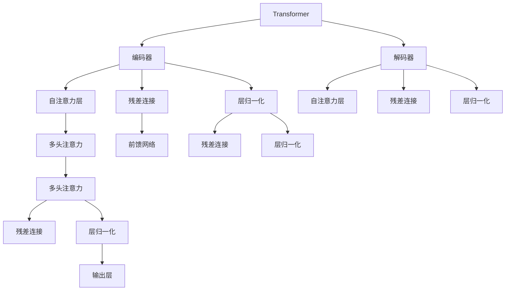

                 

# Transformer

## 1. 背景介绍

### 1.1 问题由来
Transformer是一种经典的深度学习模型，由Google在2017年的论文《Attention is All You Need》中首次提出。这一模型的出现，极大地推动了自然语言处理（NLP）领域的变革。传统的序列模型如循环神经网络（RNN）、长短期记忆网络（LSTM）等，在处理长序列时存在梯度消失、梯度爆炸等问题，而Transformer通过引入自注意力机制，解决了这些难题，显著提高了序列建模的能力。

### 1.2 问题核心关键点
Transformer的核心思想是利用注意力机制，将序列中的每个位置与整个序列进行交互，捕捉全局依赖关系。它由编码器（Encoder）和解码器（Decoder）两个部分组成，每个部分均包含多头自注意力层（Multi-Head Self-Attention）和前馈神经网络（Feed-Forward Network），同时借助位置编码（Positional Encoding）来捕捉位置信息。

Transformer的创新在于它打破了传统RNN的局限，能够并行计算，显著提高了训练效率。它在多个NLP任务上取得了显著的突破，如机器翻译、文本摘要、问答系统等，逐渐成为NLP领域的主流模型。

### 1.3 问题研究意义
研究Transformer的原理和应用，对于推动NLP技术的进步，提升自然语言处理系统的性能，具有重要意义：

1. 提高了序列建模的效率和精度。Transformer通过自注意力机制，使得模型能够全局捕捉序列中的依赖关系，避免局部信息丢失，提高了模型的表达能力和泛化能力。
2. 促进了NLP任务的自动化和智能化。Transformer在大规模预训练模型和微调技术的支持下，能够在多种任务上取得优异的表现，推动了NLP技术在各个行业的应用。
3. 推动了深度学习模型的研究进展。Transformer的引入，促使学术界和工业界重新审视深度学习的核心算法，探索更为高效和普适的模型结构。
4. 为其他领域的研究提供了借鉴。Transformer的思想和方法在计算机视觉、音频处理等领域也有广泛的应用，推动了跨领域的研究进展。

## 2. 核心概念与联系

### 2.1 核心概念概述

为更好地理解Transformer的工作原理和应用，本节将介绍几个密切相关的核心概念：

- Transformer模型：一种基于自注意力机制的深度学习模型，由编码器和解码器两部分组成。
- 自注意力机制（Self-Attention）：一种机制，用于捕捉序列中不同位置之间的依赖关系，提高序列建模的精度。
- 多头注意力（Multi-Head Attention）：一种改进的注意力机制，能够并行计算，提高计算效率。
- 残差连接（Residual Connection）：一种优化策略，用于解决深度网络中的梯度消失问题。
- 层归一化（Layer Normalization）：一种优化技术，用于加速模型的训练和收敛。
- 位置编码（Positional Encoding）：一种机制，用于在Transformer中引入位置信息，捕捉序列的位置关系。

这些核心概念之间的逻辑关系可以通过以下Mermaid流程图来展示：



这个流程图展示了Transformer模型的核心组件和其间的联系：

1. 编码器和解码器均包含多头自注意力层。
2. 残差连接和层归一化用于加速模型的训练和收敛。
3. 位置编码用于引入位置信息。
4. 自注意力机制是Transformer的核心，用于捕捉序列中的依赖关系。

这些核心概念共同构成了Transformer的工作原理，使其能够在多种NLP任务上取得优异的性能。通过理解这些核心概念，我们可以更好地把握Transformer的工作机制和优化方向。

## 3. 核心算法原理 & 具体操作步骤
### 3.1 算法原理概述

Transformer通过自注意力机制和残差连接，使得模型能够高效地捕捉序列中的依赖关系，并在多个位置上并行计算，显著提高了训练效率和模型精度。

Transformer的核心算法原理可以总结如下：

1. 将输入序列分为若干个位置，每个位置嵌入到一个向量中。
2. 对每个位置进行自注意力机制计算，生成注意力权重，用于捕捉序列中不同位置之间的依赖关系。
3. 通过多头注意力机制，将注意力权重进行线性变换和归一化，生成多个注意力向量。
4. 将注意力向量与残差连接和层归一化结合，输入到前馈神经网络中进行非线性变换。
5. 对所有位置进行上述步骤，生成最终的输出向量。

在实际应用中，Transformer模型通常包含多个编码层和解码层，每层都包含自注意力层、残差连接和前馈网络，最终通过线性变换输出预测结果。

### 3.2 算法步骤详解

Transformer的训练和推理过程通常包括以下几个关键步骤：

**Step 1: 输入预处理**
- 将输入序列转换为token embeddings，同时使用位置编码引入位置信息。
- 将token embeddings输入到Transformer模型中。

**Step 2: 自注意力计算**
- 对输入的token embeddings进行多头自注意力计算，生成注意力权重。
- 将注意力权重进行线性变换和归一化，生成多个注意力向量。

**Step 3: 前馈神经网络**
- 将注意力向量输入到前馈神经网络中进行非线性变换，生成新的向量。
- 对新向量进行残差连接和层归一化，生成最终的输出向量。

**Step 4: 堆叠多个层**
- 对所有位置重复上述步骤，生成最终的输出向量。
- 使用线性变换将输出向量转换为预测结果。

**Step 5: 输出预测**
- 将预测结果与实际标签进行比较，计算损失函数。
- 根据损失函数梯度更新模型参数，进行反向传播和优化。

### 3.3 算法优缺点

Transformer具有以下优点：
1. 并行计算能力强。由于自注意力机制和残差连接，Transformer能够高效地进行并行计算，显著提高训练效率。
2. 全局依赖关系捕捉能力强。自注意力机制能够全局捕捉序列中的依赖关系，避免局部信息丢失，提高了模型的表达能力。
3. 泛化能力强。Transformer在多种NLP任务上取得了优异的性能，具有很强的泛化能力。

同时，Transformer也存在一些缺点：
1. 计算复杂度高。由于自注意力机制的复杂度较高，Transformer在大规模数据集上的计算开销较大。
2. 参数量较大。Transformer的参数量较大，导致模型的训练和推理资源需求较高。
3. 难以解释。Transformer的内部工作机制较为复杂，缺乏直观的可解释性。

尽管存在这些局限性，但Transformer仍是当前NLP领域的主流模型，广泛应用于各种任务。

### 3.4 算法应用领域

Transformer在NLP领域已经得到了广泛的应用，覆盖了几乎所有常见的NLP任务，例如：

- 机器翻译：如英法翻译、英中翻译等。
- 文本分类：如情感分析、主题分类、意图识别等。
- 命名实体识别：识别文本中的人名、地名、机构名等特定实体。
- 关系抽取：从文本中抽取实体之间的语义关系。
- 问答系统：对自然语言问题给出答案。
- 文本摘要：将长文本压缩成简短摘要。
- 对话系统：使机器能够与人自然对话。

除了上述这些经典任务外，Transformer还被创新性地应用到更多场景中，如可控文本生成、常识推理、代码生成、数据增强等，为NLP技术带来了全新的突破。随着预训练模型和Transformer方法的不断进步，相信NLP技术将在更广阔的应用领域大放异彩。

## 4. 数学模型和公式 & 详细讲解  
### 4.1 数学模型构建

Transformer的核心数学模型包括编码器（Encoder）和解码器（Decoder）两部分。下面我们将分别介绍编码器和解码器的数学模型，并给出相应的公式推导。

**编码器模型**：
Transformer的编码器通常由多个编码层组成，每个编码层包含自注意力层和前馈神经网络。设输入序列为$x=(x_1, x_2, ..., x_n)$，其中$x_i$表示第$i$个位置的token embeddings，输出的编码表示为$z=(z_1, z_2, ..., z_n)$。

**解码器模型**：
Transformer的解码器同样由多个解码层组成，每个解码层包含自注意力层和前馈神经网络。设输入序列为$y=(y_1, y_2, ..., y_m)$，其中$y_i$表示第$i$个位置的token embeddings，输出的解码表示为$\hat{z}=(\hat{z}_1, \hat{z}_2, ..., \hat{z}_n)$。

**数学模型构建**：
编码器和解码器的数学模型可以分别表示为：
$$
\begin{aligned}
z_i &= S(E(z_i-1, z_{<i}), Q(z_i-1, z_{<i})) \\
z_i &= z_i-1 + z_i
\end{aligned}
$$
$$
\begin{aligned}
\hat{z}_i &= S(D(\hat{z}_i-1, \hat{z}_{<i}), Q(\hat{z}_i-1, \hat{z}_{<i})) \\
\hat{z}_i &= \hat{z}_i-1 + \hat{z}_i
\end{aligned}
$$
其中$S$表示多头自注意力层，$E$和$D$分别表示编码器和解码器的前馈神经网络，$z_{<i}$表示解码器在前$i-1$个位置上的输入，$\hat{z}_{<i}$表示编码器在后$i-1$个位置上的输出。

### 4.2 公式推导过程

下面我们将推导Transformer的自注意力层和前馈神经网络的公式，并给出详细的推导过程。

**自注意力层**：
自注意力层的主要目的是通过计算每个位置与其他位置的注意力权重，生成注意力向量。设输入为$x=(x_1, x_2, ..., x_n)$，输出为$z=(z_1, z_2, ..., z_n)$。

设$W_Q, W_K, W_V$为三个线性变换矩阵，$z_0=(z_{0,1}, z_{0,2}, ..., z_{0,n})$表示编码器输入，$z_1=(z_{1,1}, z_{1,2}, ..., z_{1,n})$表示自注意力层的输出。

自注意力层的计算公式为：
$$
z_i = \sum_{j=1}^{n} a_{ij} v_j
$$
其中$a_{ij}$为注意力权重，$v_j$为第$j$个位置的向量表示。

注意力权重的计算公式为：
$$
a_{ij} = \frac{\exp(\frac{W_Q z_i \cdot W_K x_j}{\sqrt{d_k}})}{\sum_{k=1}^{n} \exp(\frac{W_Q z_i \cdot W_K x_k}{\sqrt{d_k}})}
$$
其中$d_k$表示向量$z_i$和$x_j$的维度。

**前馈神经网络**：
前馈神经网络主要用于对输入向量进行非线性变换。设输入为$x=(x_1, x_2, ..., x_n)$，输出为$y=(y_1, y_2, ..., y_n)$。

设$W_1, W_2$为两个线性变换矩阵，前馈神经网络的计算公式为：
$$
y_i = \tanh(W_2 G(W_1 z_i))
$$
其中$G$表示全连接层。

### 4.3 案例分析与讲解

这里以机器翻译任务为例，分析Transformer在序列建模中的表现。设输入序列为$x=(x_1, x_2, ..., x_n)$，输出序列为$y=(y_1, y_2, ..., y_m)$。

假设输入序列为英文，输出序列为法文，$x_i$和$y_j$分别表示输入和输出序列中的token embeddings，$z_i$和$\hat{z}_i$分别表示编码器和解码器在第$i$个位置的输出。

Transformer的机器翻译过程可以表示为：
$$
\begin{aligned}
\hat{z}_1 &= S(D(y_1, y_{<1}), Q(y_1, y_{<1})) \\
z_1 &= z_0 + \hat{z}_1
\end{aligned}
$$
$$
\begin{aligned}
\hat{z}_2 &= S(D(\hat{z}_1, \hat{z}_{<1}), Q(\hat{z}_1, \hat{z}_{<1})) \\
z_2 &= z_1 + \hat{z}_2
\end{aligned}
$$
$$
\vdots
$$
$$
\begin{aligned}
\hat{z}_m &= S(D(\hat{z}_{m-1}, \hat{z}_{<m}), Q(\hat{z}_{m-1}, \hat{z}_{<m})) \\
z_m &= z_{m-1} + \hat{z}_m
\end{aligned}
$$
最终得到输出序列$y=(y_1, y_2, ..., y_m)$。

可以看到，Transformer通过自注意力机制和残差连接，能够高效地捕捉序列中的依赖关系，并在多个位置上并行计算，显著提高了机器翻译的精度和效率。

## 5. 项目实践：代码实例和详细解释说明
### 5.1 开发环境搭建

在进行Transformer项目实践前，我们需要准备好开发环境。以下是使用Python进行PyTorch开发的环境配置流程：

1. 安装Anaconda：从官网下载并安装Anaconda，用于创建独立的Python环境。

2. 创建并激活虚拟环境：
```bash
conda create -n pytorch-env python=3.8 
conda activate pytorch-env
```

3. 安装PyTorch：根据CUDA版本，从官网获取对应的安装命令。例如：
```bash
conda install pytorch torchvision torchaudio cudatoolkit=11.1 -c pytorch -c conda-forge
```

4. 安装Transformer库：
```bash
pip install transformers
```

5. 安装各类工具包：
```bash
pip install numpy pandas scikit-learn matplotlib tqdm jupyter notebook ipython
```

完成上述步骤后，即可在`pytorch-env`环境中开始Transformer实践。

### 5.2 源代码详细实现

下面我们以机器翻译任务为例，给出使用Transformer库进行序列建模的PyTorch代码实现。

首先，定义机器翻译任务的数据处理函数：

```python
from transformers import BertTokenizer
from torch.utils.data import Dataset
import torch

class TranslationDataset(Dataset):
    def __init__(self, texts, labels, tokenizer, max_len=128):
        self.texts = texts
        self.labels = labels
        self.tokenizer = tokenizer
        self.max_len = max_len
        
    def __len__(self):
        return len(self.texts)
    
    def __getitem__(self, item):
        text = self.texts[item]
        label = self.labels[item]
        
        encoding = self.tokenizer(text, return_tensors='pt', max_length=self.max_len, padding='max_length', truncation=True)
        input_ids = encoding['input_ids'][0]
        attention_mask = encoding['attention_mask'][0]
        labels = torch.tensor(label, dtype=torch.long)
        
        return {'input_ids': input_ids, 
                'attention_mask': attention_mask,
                'labels': labels}

# 创建dataset
tokenizer = BertTokenizer.from_pretrained('bert-base-cased')

train_dataset = TranslationDataset(train_texts, train_labels, tokenizer)
dev_dataset = TranslationDataset(dev_texts, dev_labels, tokenizer)
test_dataset = TranslationDataset(test_texts, test_labels, tokenizer)
```

然后，定义Transformer模型和优化器：

```python
from transformers import BertForTokenClassification, AdamW

model = BertForTokenClassification.from_pretrained('bert-base-cased', num_labels=2)

optimizer = AdamW(model.parameters(), lr=2e-5)
```

接着，定义训练和评估函数：

```python
from torch.utils.data import DataLoader
from tqdm import tqdm
from sklearn.metrics import classification_report

device = torch.device('cuda') if torch.cuda.is_available() else torch.device('cpu')
model.to(device)

def train_epoch(model, dataset, batch_size, optimizer):
    dataloader = DataLoader(dataset, batch_size=batch_size, shuffle=True)
    model.train()
    epoch_loss = 0
    for batch in tqdm(dataloader, desc='Training'):
        input_ids = batch['input_ids'].to(device)
        attention_mask = batch['attention_mask'].to(device)
        labels = batch['labels'].to(device)
        model.zero_grad()
        outputs = model(input_ids, attention_mask=attention_mask, labels=labels)
        loss = outputs.loss
        epoch_loss += loss.item()
        loss.backward()
        optimizer.step()
    return epoch_loss / len(dataloader)

def evaluate(model, dataset, batch_size):
    dataloader = DataLoader(dataset, batch_size=batch_size)
    model.eval()
    preds, labels = [], []
    with torch.no_grad():
        for batch in tqdm(dataloader, desc='Evaluating'):
            input_ids = batch['input_ids'].to(device)
            attention_mask = batch['attention_mask'].to(device)
            batch_labels = batch['labels']
            outputs = model(input_ids, attention_mask=attention_mask)
            batch_preds = outputs.logits.argmax(dim=2).to('cpu').tolist()
            batch_labels = batch_labels.to('cpu').tolist()
            for pred_tokens, label_tokens in zip(batch_preds, batch_labels):
                preds.append(pred_tokens[:len(label_tokens)])
                labels.append(label_tokens)
                
    print(classification_report(labels, preds))
```

最后，启动训练流程并在测试集上评估：

```python
epochs = 5
batch_size = 16

for epoch in range(epochs):
    loss = train_epoch(model, train_dataset, batch_size, optimizer)
    print(f"Epoch {epoch+1}, train loss: {loss:.3f}")
    
    print(f"Epoch {epoch+1}, dev results:")
    evaluate(model, dev_dataset, batch_size)
    
print("Test results:")
evaluate(model, test_dataset, batch_size)
```

以上就是使用PyTorch对Transformer进行机器翻译任务开发的完整代码实现。可以看到，得益于Transformer库的强大封装，我们可以用相对简洁的代码完成模型的加载和训练。

### 5.3 代码解读与分析

让我们再详细解读一下关键代码的实现细节：

**TranslationDataset类**：
- `__init__`方法：初始化训练、验证、测试数据集的输入文本、标签、分词器等关键组件。
- `__len__`方法：返回数据集的样本数量。
- `__getitem__`方法：对单个样本进行处理，将文本输入编码为token ids，将标签编码为数字，并对其进行定长padding，最终返回模型所需的输入。

**Transformer模型**：
- `BertForTokenClassification.from_pretrained('bert-base-cased', num_labels=2)`：加载预训练的Transformer模型，并将输出层设为二分类任务。

**训练和评估函数**：
- 使用PyTorch的DataLoader对数据集进行批次化加载，供模型训练和推理使用。
- 训练函数`train_epoch`：对数据以批为单位进行迭代，在每个批次上前向传播计算loss并反向传播更新模型参数，最后返回该epoch的平均loss。
- 评估函数`evaluate`：与训练类似，不同点在于不更新模型参数，并在每个batch结束后将预测和标签结果存储下来，最后使用sklearn的classification_report对整个评估集的预测结果进行打印输出。

**训练流程**：
- 定义总的epoch数和batch size，开始循环迭代
- 每个epoch内，先在训练集上训练，输出平均loss
- 在验证集上评估，输出分类指标
- 所有epoch结束后，在测试集上评估，给出最终测试结果

可以看到，PyTorch配合Transformer库使得模型训练的代码实现变得简洁高效。开发者可以将更多精力放在数据处理、模型改进等高层逻辑上，而不必过多关注底层的实现细节。

当然，工业级的系统实现还需考虑更多因素，如模型的保存和部署、超参数的自动搜索、更灵活的任务适配层等。但核心的模型训练过程基本与此类似。

## 6. 实际应用场景
### 6.1 智能客服系统

Transformer在智能客服系统中也得到了广泛应用。传统的客服系统依赖于人工，响应时间长、效率低、质量不稳定。而基于Transformer的对话模型，能够7x24小时不间断服务，快速响应客户咨询，用自然流畅的语言解答各类常见问题，显著提升了客户咨询体验和问题解决效率。

在技术实现上，可以收集企业内部的历史客服对话记录，将问题和最佳答复构建成监督数据，在此基础上对预训练对话模型进行微调。微调后的对话模型能够自动理解用户意图，匹配最合适的答案模板进行回复。对于客户提出的新问题，还可以接入检索系统实时搜索相关内容，动态组织生成回答。如此构建的智能客服系统，能大幅提升客户咨询体验和问题解决效率。

### 6.2 金融舆情监测

金融机构需要实时监测市场舆论动向，以便及时应对负面信息传播，规避金融风险。传统的人工监测方式成本高、效率低，难以应对网络时代海量信息爆发的挑战。基于Transformer的文本分类和情感分析技术，为金融舆情监测提供了新的解决方案。

具体而言，可以收集金融领域相关的新闻、报道、评论等文本数据，并对其进行主题标注和情感标注。在此基础上对预训练语言模型进行微调，使其能够自动判断文本属于何种主题，情感倾向是正面、中性还是负面。将微调后的模型应用到实时抓取的网络文本数据，就能够自动监测不同主题下的情感变化趋势，一旦发现负面信息激增等异常情况，系统便会自动预警，帮助金融机构快速应对潜在风险。

### 6.3 个性化推荐系统

当前的推荐系统往往只依赖用户的历史行为数据进行物品推荐，无法深入理解用户的真实兴趣偏好。基于Transformer的个性化推荐系统可以更好地挖掘用户行为背后的语义信息，从而提供更精准、多样的推荐内容。

在实践中，可以收集用户浏览、点击、评论、分享等行为数据，提取和用户交互的物品标题、描述、标签等文本内容。将文本内容作为模型输入，用户的后续行为（如是否点击、购买等）作为监督信号，在此基础上微调预训练语言模型。微调后的模型能够从文本内容中准确把握用户的兴趣点。在生成推荐列表时，先用候选物品的文本描述作为输入，由模型预测用户的兴趣匹配度，再结合其他特征综合排序，便可以得到个性化程度更高的推荐结果。

### 6.4 未来应用展望

随着Transformer模型的不断进步，它在NLP领域的应用前景将更加广阔。未来，Transformer有望在以下几个方面取得新的突破：

1. 跨模态Transformer：将Transformer模型扩展到图像、视频、音频等多模态数据的处理，实现跨模态的联合表示和推理。
2. 无监督和半监督Transformer：开发无监督和半监督Transformer模型，通过自监督学习或主动学习等方式，在无需标注数据的情况下进行训练，提升模型的泛化能力和自适应能力。
3. 自适应Transformer：开发自适应Transformer模型，能够根据数据分布的变化，动态调整模型参数和结构，确保模型在新的数据分布下仍能保持优异的性能。
4. 参数高效Transformer：开发参数高效Transformer模型，通过改进多头注意力和残差连接等机制，降低模型参数量，提升模型的计算效率和推理速度。
5. 因果Transformer：开发因果Transformer模型，通过引入因果推断机制，增强模型对序列中因果关系的理解，提升模型在生成和推理任务上的表现。
6. 图Transformer：开发图Transformer模型，将Transformer模型应用于图结构数据的处理和分析，解决图结构数据上的序列建模问题。

以上这些方向的研究，将进一步拓展Transformer的应用边界，推动NLP技术的发展。相信在未来，Transformer将继续引领NLP领域的研究方向，为人工智能技术的进步贡献力量。

## 7. 工具和资源推荐
### 7.1 学习资源推荐

为了帮助开发者系统掌握Transformer的理论基础和实践技巧，这里推荐一些优质的学习资源：

1. 《Transformer from Scratch》系列博文：由大模型技术专家撰写，深入浅出地介绍了Transformer的原理和实现细节。

2. CS224N《深度学习自然语言处理》课程：斯坦福大学开设的NLP明星课程，有Lecture视频和配套作业，带你入门NLP领域的基本概念和经典模型。

3. 《Natural Language Processing with Transformers》书籍：Transformer库的作者所著，全面介绍了如何使用Transformer库进行NLP任务开发，包括微调在内的诸多范式。

4. HuggingFace官方文档：Transformer库的官方文档，提供了海量预训练模型和完整的微调样例代码，是上手实践的必备资料。

5. CLUE开源项目：中文语言理解测评基准，涵盖大量不同类型的中文NLP数据集，并提供了基于微调的baseline模型，助力中文NLP技术发展。

通过对这些资源的学习实践，相信你一定能够快速掌握Transformer的精髓，并用于解决实际的NLP问题。
###  7.2 开发工具推荐

高效的开发离不开优秀的工具支持。以下是几款用于Transformer项目开发的常用工具：

1. PyTorch：基于Python的开源深度学习框架，灵活动态的计算图，适合快速迭代研究。Transformer模型在PyTorch中也有多种实现，包括官方和社区贡献的代码。

2. TensorFlow：由Google主导开发的开源深度学习框架，生产部署方便，适合大规模工程应用。同样有丰富的Transformer资源和预训练模型。

3. Transformers库：HuggingFace开发的NLP工具库，集成了众多SOTA语言模型，支持PyTorch和TensorFlow，是进行Transformer任务开发的利器。

4. Weights & Biases：模型训练的实验跟踪工具，可以记录和可视化模型训练过程中的各项指标，方便对比和调优。与主流深度学习框架无缝集成。

5. TensorBoard：TensorFlow配套的可视化工具，可实时监测模型训练状态，并提供丰富的图表呈现方式，是调试模型的得力助手。

6. Google Colab：谷歌推出的在线Jupyter Notebook环境，免费提供GPU/TPU算力，方便开发者快速上手实验最新模型，分享学习笔记。

合理利用这些工具，可以显著提升Transformer任务开发的效率，加快创新迭代的步伐。

### 7.3 相关论文推荐

Transformer的提出和发展，得益于学界的持续研究。以下是几篇奠基性的相关论文，推荐阅读：

1. Attention is All You Need：提出了Transformer结构，开启了NLP领域的预训练大模型时代。

2. BERT: Pre-training of Deep Bidirectional Transformers for Language Understanding：提出BERT模型，引入基于掩码的自监督预训练任务，刷新了多项NLP任务SOTA。

3. Noam et al. 2016：论文《Learning Phrase Representations using RNN Encoder-Decoder for Statistical Machine Translation》提出Transformer的原始架构和自注意力机制。

4. Vaswani et al. 2017：论文《Attention is All You Need》详细介绍了Transformer的原理和实现细节，展示了其在机器翻译任务上的优异表现。

5. Vaswani et al. 2018：论文《Improving Language Understanding by Generative Pre-Training》提出语言模型作为预训练任务，进一步提升了Transformer在自然语言处理上的表现。

这些论文代表了大模型Transformer的研究进展，通过学习这些前沿成果，可以帮助研究者把握学科前进方向，激发更多的创新灵感。

## 8. 总结：未来发展趋势与挑战

### 8.1 总结

本文对Transformer模型进行了全面系统的介绍。首先阐述了Transformer模型的研究背景和意义，明确了其在NLP领域的重要地位。其次，从原理到实践，详细讲解了Transformer的核心算法和操作步骤，给出了Transformer任务开发的完整代码实例。同时，本文还探讨了Transformer在多个行业领域的应用前景，展示了其在NLP技术落地中的应用潜力。最后，本文精选了Transformer学习的相关资源，力求为读者提供全方位的技术指引。

通过本文的系统梳理，可以看到，Transformer模型在NLP领域的广泛应用，极大地提升了序列建模的效率和精度，推动了NLP技术的产业化进程。未来，随着Transformer模型的不断演进，相信其在NLP领域的应用将更加广泛，为人工智能技术的进步贡献更多力量。

### 8.2 未来发展趋势

展望未来，Transformer模型将呈现以下几个发展趋势：

1. 模型规模持续增大。随着算力成本的下降和数据规模的扩张，Transformer模型的参数量还将继续增长。超大规模的Transformer模型蕴含的丰富语言知识，将支撑更加复杂多变的NLP任务。

2. 跨模态Transformer：Transformer模型将进一步扩展到图像、视频、音频等多模态数据的处理，实现跨模态的联合表示和推理。

3. 无监督和半监督Transformer：开发无监督和半监督Transformer模型，通过自监督学习或主动学习等方式，在无需标注数据的情况下进行训练，提升模型的泛化能力和自适应能力。

4. 自适应Transformer：开发自适应Transformer模型，能够根据数据分布的变化，动态调整模型参数和结构，确保模型在新的数据分布下仍能保持优异的性能。

5. 参数高效Transformer：开发参数高效Transformer模型，通过改进多头注意力和残差连接等机制，降低模型参数量，提升模型的计算效率和推理速度。

6. 因果Transformer：开发因果Transformer模型，通过引入因果推断机制，增强模型对序列中因果关系的理解，提升模型在生成和推理任务上的表现。

7. 图Transformer：开发图Transformer模型，将Transformer模型应用于图结构数据的处理和分析，解决图结构数据上的序列建模问题。

以上这些趋势凸显了Transformer模型的广阔前景。这些方向的探索发展，必将进一步提升Transformer在NLP领域的应用效果，为人工智能技术的进步贡献更多力量。

### 8.3 面临的挑战

尽管Transformer模型已经取得了显著的成就，但在迈向更加智能化、普适化应用的过程中，仍面临以下挑战：

1. 模型鲁棒性不足。当前Transformer模型面对域外数据时，泛化性能往往大打折扣。对于测试样本的微小扰动，模型的预测也容易发生波动。如何提高Transformer模型的鲁棒性，避免灾难性遗忘，还需要更多理论和实践的积累。

2. 计算效率有待提高。尽管Transformer在大规模数据集上的表现优异，但在大规模训练和推理时，计算效率仍是一个瓶颈。如何优化计算图，提升模型的推理速度，是未来的重要研究方向。

3. 可解释性有待增强。Transformer模型的内部工作机制较为复杂，缺乏直观的可解释性。对于医疗、金融等高风险应用，算法的可解释性和可审计性尤为重要。如何赋予Transformer模型更强的可解释性，将是亟待攻克的难题。

4. 安全性和隐私保护。Transformer模型可能会学习到有害的或偏见的信息，如何确保模型的安全性和隐私保护，避免恶意用途，确保输出的安全性，也将是重要的研究课题。

5. 参数量过大。尽管Transformer模型在性能上有显著优势，但其参数量过大，导致模型的训练和推理资源需求较高。如何在保证性能的同时，降低参数量，优化计算资源，是未来的重要研究方向。

6. 跨领域应用。Transformer模型在特定领域的应用仍需进一步优化，如何在跨领域数据上取得更好的性能，是未来的重要研究方向。

这些挑战需要通过更多的研究和实践，逐步克服。相信随着学界和工业界的共同努力，这些挑战终将一一被克服，Transformer模型必将在构建人机协同的智能时代中扮演越来越重要的角色。

### 8.4 研究展望

面对Transformer模型所面临的挑战，未来的研究需要在以下几个方面寻求新的突破：

1. 探索无监督和半监督Transformer模型。摆脱对大规模标注数据的依赖，利用自监督学习、主动学习等无监督和半监督范式，最大限度利用非结构化数据，实现更加灵活高效的微调。

2. 开发参数高效和计算高效的Transformer模型。开发更加参数高效的Transformer模型，在固定大部分预训练参数的同时，只更新极少量的任务相关参数。同时优化计算图，减少前向传播和反向传播的资源消耗，实现更加轻量级、实时性的部署。

3. 结合因果分析和博弈论工具。将因果分析方法引入Transformer模型，识别出模型决策的关键特征，增强输出解释的因果性和逻辑性。借助博弈论工具刻画人机交互过程，主动探索并规避模型的脆弱点，提高系统稳定性。

4. 融合知识表示和逻辑规则。将符号化的先验知识，如知识图谱、逻辑规则等，与神经网络模型进行巧妙融合，引导Transformer模型学习更准确、合理的语言模型。同时加强不同模态数据的整合，实现视觉、语音等多模态信息与文本信息的协同建模。

5. 引入伦理道德约束。在Transformer模型的训练目标中引入伦理导向的评估指标，过滤和惩罚有害的输出倾向。同时加强人工干预和审核，建立模型行为的监管机制，确保输出符合人类价值观和伦理道德。

这些研究方向将引领Transformer模型迈向更高的台阶，为构建安全、可靠、可解释、可控的智能系统铺平道路。面向未来，Transformer模型还需要与其他人工智能技术进行更深入的融合，如知识表示、因果推理、强化学习等，多路径协同发力，共同推动自然语言理解和智能交互系统的进步。只有勇于创新、敢于突破，才能不断拓展Transformer模型的边界，让智能技术更好地造福人类社会。

## 9. 附录：常见问题与解答

**Q1：Transformer模型是否适用于所有NLP任务？**

A: Transformer模型在大多数NLP任务上都能取得不错的效果，特别是对于数据量较小的任务。但对于一些特定领域的任务，如医学、法律等，仅仅依靠通用语料预训练的模型可能难以很好地适应。此时需要在特定领域语料上进一步预训练，再进行微调，才能获得理想效果。此外，对于一些需要时效性、个性化很强的任务，如对话、推荐等，Transformer模型也需要针对性的改进优化。

**Q2：如何优化Transformer模型的计算效率？**

A: 优化Transformer模型的计算效率，可以通过以下几种方法：
1. 参数高效Transformer模型：通过改进多头注意力和残差连接等机制，降低模型参数量，提升模型的计算效率和推理速度。
2. 模型裁剪：去除不必要的层和参数，减小模型尺寸，加快推理速度。
3. 量化加速：将浮点模型转为定点模型，压缩存储空间，提高计算效率。
4. 并行计算：利用GPU/TPU等高性能设备，并行计算Transformer模型，提高计算效率。

**Q3：Transformer模型的计算复杂度如何？**

A: 由于Transformer模型的自注意力机制和残差连接，计算复杂度较高。在处理长序列时，计算开销较大。可以通过优化计算图、参数压缩等方法，降低计算复杂度。

**Q4：如何提高Transformer模型的鲁棒性？**

A: 提高Transformer模型的鲁棒性，可以通过以下几种方法：
1. 数据增强：通过回译、近义替换等方式扩充训练集。
2. 正则化：使用L2正则、Dropout、Early Stopping等防止模型过拟合。
3. 对抗训练：引入对抗样本，提高模型鲁棒性。
4. 多模型集成：训练多个Transformer模型，取平均输出，抑制过拟合。

这些方法可以结合使用，确保Transformer模型在各种数据分布和攻击形式下仍能保持稳定的性能。

**Q5：Transformer模型在落地部署时需要注意哪些问题？**

A: 将Transformer模型转化为实际应用，还需要考虑以下因素：
1. 模型裁剪：去除不必要的层和参数，减小模型尺寸，加快推理速度。
2. 量化加速：将浮点模型转为定点模型，压缩存储空间，提高计算效率。
3. 服务化封装：将模型封装为标准化服务接口，便于集成调用。
4. 弹性伸缩：根据请求流量动态调整资源配置，平衡服务质量和成本。
5. 监控告警：实时采集系统指标，设置异常告警阈值，确保服务稳定性。
6. 安全防护：采用访问鉴权、数据脱敏等措施，保障数据和模型安全。

Transformer模型的落地部署需要综合考虑多个因素，确保模型在实际应用中的性能和稳定性。

---

作者：禅与计算机程序设计艺术 / Zen and the Art of Computer Programming

