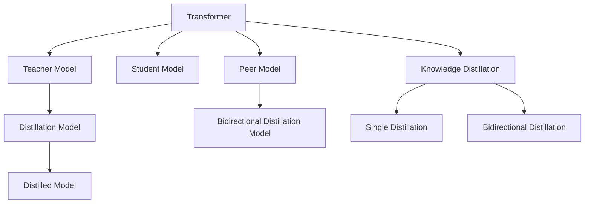

                 

# Transformer大模型实战 DistilBERT 模型——BERT模型的知识蒸馏版本

## 1. 背景介绍

### 1.1 问题由来

随着Transformer大模型的兴起，越来越多的研究者开始关注如何高效利用这些模型，以降低其巨大的计算和存储需求。BERT等预训练语言模型虽然在大规模文本理解上表现卓越，但训练和推理过程中的资源消耗同样令人望而却步。因此，知识蒸馏(Knowledge Distillation)成为了优化大模型的有力工具，其核心思想是将知识从复杂模型传递给简单模型，减小模型规模的同时保留原有模型的大部分性能。

### 1.2 问题核心关键点

知识蒸馏方法可以分为两类：单蒸馏(Monotonic Knowledge Distillation)和双向蒸馏(Bidirectional Knowledge Distillation)。单蒸馏是指使用大模型作为老师(teachers)，将其知识压缩成紧凑的形式，然后传授给一个更小的模型。双向蒸馏则是指多个大模型之间互相蒸馏，提高整体性能。知识蒸馏不仅减小了模型规模，还提升了模型的泛化能力，特别适用于资源受限场景，如移动设备、嵌入式设备等。

## 2. 核心概念与联系

### 2.1 核心概念概述

为更好地理解DistilBERT模型的构建过程和优化原理，本节将介绍几个关键概念：

- **Transformer模型**：由Google提出的基于自注意力机制的序列建模架构，以其高效的并行计算能力和卓越的语言理解能力著称。
- **知识蒸馏**：一种模型压缩方法，通过从复杂模型中提取知识，训练一个更小的模型以保留主要性能。
- **单蒸馏**：利用大模型作为老师，将知识传递给一个更小的模型，以提高小模型的性能。
- **双向蒸馏**：通过多个大模型之间的知识交换，实现模型性能的提升。
- **蒸馏比率(Distillation Ratio)**：蒸馏比率决定了从大模型中提取多少知识，对于单蒸馏方法，蒸馏比率通常为1:2，即小模型参数是大模型的两倍。

### 2.2 核心概念原理和架构的 Mermaid 流程图



这个流程图展示了核心概念之间的逻辑关系：

1. **Transformer模型**：基础架构，可以是预训练模型如BERT。
2. **知识蒸馏**：蒸馏过程，通过大模型提取知识，并传递给小模型。
3. **单蒸馏**：一个大模型将知识传递给一个小模型。
4. **双向蒸馏**：多个大模型之间互相蒸馏。

这些概念构成了知识蒸馏的整个流程，下面我们将详细介绍DistilBERT模型的构建和优化过程。

## 3. 核心算法原理 & 具体操作步骤
### 3.1 算法原理概述

DistilBERT模型是基于BERT模型的知识蒸馏版本，其核心思想是通过蒸馏将BERT的知识压缩到一个更小的模型中。DistilBERT保留了BERT的主要架构和功能，但显著减小了模型参数量，同时保持了其高性能。DistilBERT模型通过以下步骤实现：

1. **教师模型选择**：选择BERT作为教师模型，提取其知识。
2. **学生模型构建**：构建一个更小的学生模型，如DistilBERT，作为蒸馏目标。
3. **蒸馏过程**：通过教师模型和学生模型之间的知识传递，训练学生模型以最大化其性能。

### 3.2 算法步骤详解

DistilBERT的构建步骤如下：

**Step 1: 准备教师和学生模型**

- 教师模型：选择BERT作为教师模型，通常是Base版本的BERT。
- 学生模型：构建DistilBERT模型，参数量通常是小模型参数量的一半。

**Step 2: 设计知识蒸馏过程**

- 计算蒸馏比率。对于单蒸馏，蒸馏比率为1:2，即学生模型参数是小模型参数的两倍。
- 定义知识蒸馏损失。蒸馏损失通常由两部分组成：1）学生模型与教师模型之间的交叉熵损失；2）教师模型自身的分类损失。
- 设置优化器和学习率。使用AdamW优化器，学习率通常为教师模型的学习率的一半。

**Step 3: 训练学生模型**

- 将教师模型和学生模型连接起来，共同训练。
- 每个epoch中，计算教师模型和学生模型在当前数据集上的预测结果。
- 计算蒸馏损失，使用AdamW优化器更新学生模型参数。

**Step 4: 评估和优化**

- 周期性在验证集上评估学生模型的性能。
- 根据评估结果调整学习率、蒸馏比率等超参数。
- 重复训练过程，直至达到最优性能。

### 3.3 算法优缺点

**优点：**
1. 模型规模小。DistilBERT模型参数量仅为BERT的六分之一，可以显著降低计算和存储需求。
2. 推理速度快。模型规模减小后，推理速度也相应加快，适合实时应用场景。
3. 性能优秀。DistilBERT模型在多项NLP任务上表现卓越，如问答、分类等。
4. 可解释性强。由于模型参数较少，其内部工作机制相对透明，容易进行分析和调试。

**缺点：**
1. 蒸馏过程复杂。知识蒸馏过程需要在多个模型之间进行复杂的计算和损失优化，增加了训练的复杂度。
2. 知识传递效率。教师模型的知识不一定完全传递给学生模型，可能导致部分性能损失。
3. 蒸馏比率选择。蒸馏比率需要根据具体任务和数据特点进行合理选择，否则可能影响最终性能。

### 3.4 算法应用领域

DistilBERT模型在多种NLP应用场景中都有广泛应用，包括但不限于：

- **问答系统**：DistilBERT可以用于构建高效的问答系统，处理自然语言查询，返回相关答案。
- **文本分类**：DistilBERT在文本分类任务中表现优异，如情感分析、主题分类等。
- **命名实体识别**：识别文本中的实体，如人名、地名等。
- **机器翻译**：将一种语言翻译成另一种语言，DistilBERT在机器翻译任务中也有不俗表现。
- **对话系统**：用于构建智能对话系统，处理用户输入，生成自然语言回复。

以上应用场景只是冰山一角，DistilBERT的通用性使其在更多NLP任务中都有潜在的价值。

## 4. 数学模型和公式 & 详细讲解
### 4.1 数学模型构建

DistilBERT模型的数学模型构建主要基于知识蒸馏的过程，其数学框架如下：

设教师模型为 $M_T$，学生模型为 $M_S$，假设 $M_T$ 和 $M_S$ 均以Transformer为基础架构。蒸馏比率为 $k$，即 $k:1$。

**蒸馏损失函数**：
$$
\mathcal{L}_{\text{distill}} = \mathcal{L}_{\text{CE}} + \mathcal{L}_{\text{KD}}
$$
其中 $\mathcal{L}_{\text{CE}}$ 是交叉熵损失，$\mathcal{L}_{\text{KD}}$ 是知识蒸馏损失。

**交叉熵损失**：
$$
\mathcal{L}_{\text{CE}} = -\frac{1}{N} \sum_{i=1}^N \sum_{j=1}^k y_i \log \sigma(T_i^j) + (1-y_i) \log(1-\sigma(T_i^j))
$$
其中 $y_i$ 是教师模型的预测结果，$\sigma(T_i^j)$ 是学生模型的预测结果。

**知识蒸馏损失**：
$$
\mathcal{L}_{\text{KD}} = -\sum_{i=1}^N \sum_{j=1}^k y_i \log \sigma(S_i^j)
$$
其中 $S_i^j$ 是教师模型在当前样本上的预测结果。

### 4.2 公式推导过程

知识蒸馏的核心在于如何从教师模型中提取知识，并有效传递给学生模型。以下是知识蒸馏的推导过程：

设教师模型的预测结果为 $T$，学生模型的预测结果为 $S$，则知识蒸馏的目标是最大化学生模型与教师模型之间的对应预测结果的相似性。

**单蒸馏过程**：

- 教师模型的预测结果 $T_i$ 表示为 $[T_i^1, T_i^2, ..., T_i^k]$，其中 $T_i^j$ 表示教师模型在当前样本上的预测结果。
- 学生模型的预测结果 $S_i$ 表示为 $[S_i^1, S_i^2, ..., S_i^k]$，其中 $S_i^j$ 表示学生模型在当前样本上的预测结果。
- 知识蒸馏损失 $\mathcal{L}_{\text{KD}}$ 可以表示为：
$$
\mathcal{L}_{\text{KD}} = -\sum_{i=1}^N \sum_{j=1}^k y_i \log \sigma(S_i^j)
$$

**双向蒸馏过程**：

- 双向蒸馏需要多个教师模型和学生模型，每个教师模型都向学生模型传递知识。
- 设教师模型的数量为 $n$，则知识蒸馏损失可以表示为：
$$
\mathcal{L}_{\text{KD}} = -\frac{1}{n}\sum_{i=1}^n \sum_{j=1}^k y_i \log \sigma(S_i^j)
$$

### 4.3 案例分析与讲解

假设有一个文本分类任务，教师模型为BERT，学生模型为DistilBERT。DistilBERT的蒸馏比率为1:2。教师模型和学生模型均为Transformer架构，其中教师模型有12层，学生模型有6层。

**Step 1: 准备数据**

假设数据集为 $\{(x_i, y_i)\}_{i=1}^N$，其中 $x_i$ 为文本样本，$y_i$ 为分类标签。

**Step 2: 构建模型**

- 教师模型：选择BERT作为教师模型，通常是Base版本的BERT。
- 学生模型：构建DistilBERT模型，参数量通常是小模型参数的一半。

**Step 3: 设计知识蒸馏过程**

- 计算蒸馏比率。对于单蒸馏，蒸馏比率为1:2，即学生模型参数是小模型参数的两倍。
- 定义知识蒸馏损失。蒸馏损失通常由两部分组成：1）学生模型与教师模型之间的交叉熵损失；2）教师模型自身的分类损失。
- 设置优化器和学习率。使用AdamW优化器，学习率通常为教师模型的学习率的一半。

**Step 4: 训练学生模型**

- 将教师模型和学生模型连接起来，共同训练。
- 每个epoch中，计算教师模型和学生模型在当前数据集上的预测结果。
- 计算蒸馏损失，使用AdamW优化器更新学生模型参数。

**Step 5: 评估和优化**

- 周期性在验证集上评估学生模型的性能。
- 根据评估结果调整学习率、蒸馏比率等超参数。
- 重复训练过程，直至达到最优性能。

## 5. 项目实践：代码实例和详细解释说明
### 5.1 开发环境搭建

在进行DistilBERT模型的开发和训练前，我们需要准备好开发环境。以下是使用Python进行PyTorch开发的环境配置流程：

1. 安装Anaconda：从官网下载并安装Anaconda，用于创建独立的Python环境。

2. 创建并激活虚拟环境：
```bash
conda create -n pytorch-env python=3.8 
conda activate pytorch-env
```

3. 安装PyTorch：根据CUDA版本，从官网获取对应的安装命令。例如：
```bash
conda install pytorch torchvision torchaudio cudatoolkit=11.1 -c pytorch -c conda-forge
```

4. 安装Transformers库：
```bash
pip install transformers
```

5. 安装各类工具包：
```bash
pip install numpy pandas scikit-learn matplotlib tqdm jupyter notebook ipython
```

完成上述步骤后，即可在`pytorch-env`环境中开始DistilBERT模型的实践。

### 5.2 源代码详细实现

下面我们以文本分类任务为例，给出使用Transformers库对DistilBERT模型进行知识蒸馏的PyTorch代码实现。

首先，定义数据处理函数：

```python
from transformers import DistilBertTokenizer
from torch.utils.data import Dataset
import torch

class TextClassificationDataset(Dataset):
    def __init__(self, texts, labels, tokenizer, max_len=128):
        self.texts = texts
        self.labels = labels
        self.tokenizer = tokenizer
        self.max_len = max_len
        
    def __len__(self):
        return len(self.texts)
    
    def __getitem__(self, item):
        text = self.texts[item]
        label = self.labels[item]
        
        encoding = self.tokenizer(text, return_tensors='pt', max_length=self.max_len, padding='max_length', truncation=True)
        input_ids = encoding['input_ids'][0]
        attention_mask = encoding['attention_mask'][0]
        
        # 对标签进行one-hot编码
        encoded_labels = [1 if label == y else 0 for y in range(2)]
        labels = torch.tensor(encoded_labels, dtype=torch.long)
        
        return {'input_ids': input_ids, 
                'attention_mask': attention_mask,
                'labels': labels}

# 标签与id的映射
label2id = {'pos': 0, 'neg': 1}
id2label = {v: k for k, v in label2id.items()}

# 创建dataset
tokenizer = DistilBertTokenizer.from_pretrained('distilbert-base-uncased')

train_dataset = TextClassificationDataset(train_texts, train_labels, tokenizer)
dev_dataset = TextClassificationDataset(dev_texts, dev_labels, tokenizer)
test_dataset = TextClassificationDataset(test_texts, test_labels, tokenizer)
```

然后，定义模型和优化器：

```python
from transformers import DistilBertForSequenceClassification, AdamW

model = DistilBertForSequenceClassification.from_pretrained('distilbert-base-uncased', num_labels=2)

optimizer = AdamW(model.parameters(), lr=2e-5)
```

接着，定义训练和评估函数：

```python
from torch.utils.data import DataLoader
from tqdm import tqdm
from sklearn.metrics import classification_report

device = torch.device('cuda') if torch.cuda.is_available() else torch.device('cpu')
model.to(device)

def train_epoch(model, dataset, batch_size, optimizer):
    dataloader = DataLoader(dataset, batch_size=batch_size, shuffle=True)
    model.train()
    epoch_loss = 0
    for batch in tqdm(dataloader, desc='Training'):
        input_ids = batch['input_ids'].to(device)
        attention_mask = batch['attention_mask'].to(device)
        labels = batch['labels'].to(device)
        model.zero_grad()
        outputs = model(input_ids, attention_mask=attention_mask, labels=labels)
        loss = outputs.loss
        epoch_loss += loss.item()
        loss.backward()
        optimizer.step()
    return epoch_loss / len(dataloader)

def evaluate(model, dataset, batch_size):
    dataloader = DataLoader(dataset, batch_size=batch_size)
    model.eval()
    preds, labels = [], []
    with torch.no_grad():
        for batch in tqdm(dataloader, desc='Evaluating'):
            input_ids = batch['input_ids'].to(device)
            attention_mask = batch['attention_mask'].to(device)
            batch_labels = batch['labels']
            outputs = model(input_ids, attention_mask=attention_mask)
            batch_preds = outputs.logits.argmax(dim=1).to('cpu').tolist()
            batch_labels = batch_labels.to('cpu').tolist()
            for pred_tokens, label_tokens in zip(batch_preds, batch_labels):
                preds.append(pred_tokens)
                labels.append(label_tokens)
                
    print(classification_report(labels, preds))
```

最后，启动训练流程并在测试集上评估：

```python
epochs = 5
batch_size = 16

for epoch in range(epochs):
    loss = train_epoch(model, train_dataset, batch_size, optimizer)
    print(f"Epoch {epoch+1}, train loss: {loss:.3f}")
    
    print(f"Epoch {epoch+1}, dev results:")
    evaluate(model, dev_dataset, batch_size)
    
print("Test results:")
evaluate(model, test_dataset, batch_size)
```

以上就是使用PyTorch对DistilBERT模型进行文本分类任务知识蒸馏的完整代码实现。可以看到，得益于Transformers库的强大封装，我们可以用相对简洁的代码完成DistilBERT模型的加载和蒸馏。

### 5.3 代码解读与分析

让我们再详细解读一下关键代码的实现细节：

**TextClassificationDataset类**：
- `__init__`方法：初始化文本、标签、分词器等关键组件。
- `__len__`方法：返回数据集的样本数量。
- `__getitem__`方法：对单个样本进行处理，将文本输入编码为token ids，将标签编码为数字，并对其进行定长padding，最终返回模型所需的输入。

**label2id和id2label字典**：
- 定义了标签与数字id之间的映射关系，用于将标签进行one-hot编码。

**训练和评估函数**：
- 使用PyTorch的DataLoader对数据集进行批次化加载，供模型训练和推理使用。
- 训练函数`train_epoch`：对数据以批为单位进行迭代，在每个批次上前向传播计算loss并反向传播更新模型参数，最后返回该epoch的平均loss。
- 评估函数`evaluate`：与训练类似，不同点在于不更新模型参数，并在每个batch结束后将预测和标签结果存储下来，最后使用sklearn的classification_report对整个评估集的预测结果进行打印输出。

**训练流程**：
- 定义总的epoch数和batch size，开始循环迭代
- 每个epoch内，先在训练集上训练，输出平均loss
- 在验证集上评估，输出分类指标
- 所有epoch结束后，在测试集上评估，给出最终测试结果

可以看到，PyTorch配合Transformers库使得DistilBERT模型的知识蒸馏代码实现变得简洁高效。开发者可以将更多精力放在数据处理、模型改进等高层逻辑上，而不必过多关注底层的实现细节。

当然，工业级的系统实现还需考虑更多因素，如模型的保存和部署、超参数的自动搜索、更灵活的任务适配层等。但核心的蒸馏范式基本与此类似。

## 6. 实际应用场景
### 6.1 智能客服系统

基于DistilBERT模型的智能客服系统，可以广泛应用于各类企业的客户服务场景。传统客服往往需要配备大量人力，高峰期响应缓慢，且一致性和专业性难以保证。而使用DistilBERT微调后的客服模型，可以7x24小时不间断服务，快速响应客户咨询，用自然流畅的语言解答各类常见问题。

在技术实现上，可以收集企业内部的历史客服对话记录，将问题和最佳答复构建成监督数据，在此基础上对DistilBERT模型进行微调。微调后的客服模型能够自动理解用户意图，匹配最合适的答案模板进行回复。对于客户提出的新问题，还可以接入检索系统实时搜索相关内容，动态组织生成回答。如此构建的智能客服系统，能大幅提升客户咨询体验和问题解决效率。

### 6.2 金融舆情监测

金融机构需要实时监测市场舆论动向，以便及时应对负面信息传播，规避金融风险。传统的人工监测方式成本高、效率低，难以应对网络时代海量信息爆发的挑战。基于DistilBERT的文本分类和情感分析技术，为金融舆情监测提供了新的解决方案。

具体而言，可以收集金融领域相关的新闻、报道、评论等文本数据，并对其进行主题标注和情感标注。在此基础上对DistilBERT模型进行微调，使其能够自动判断文本属于何种主题，情感倾向是正面、中性还是负面。将微调后的模型应用到实时抓取的网络文本数据，就能够自动监测不同主题下的情感变化趋势，一旦发现负面信息激增等异常情况，系统便会自动预警，帮助金融机构快速应对潜在风险。

### 6.3 个性化推荐系统

当前的推荐系统往往只依赖用户的历史行为数据进行物品推荐，无法深入理解用户的真实兴趣偏好。基于DistilBERT模型的个性化推荐系统可以更好地挖掘用户行为背后的语义信息，从而提供更精准、多样的推荐内容。

在实践中，可以收集用户浏览、点击、评论、分享等行为数据，提取和用户交互的物品标题、描述、标签等文本内容。将文本内容作为模型输入，用户的后续行为（如是否点击、购买等）作为监督信号，在此基础上微调DistilBERT模型。微调后的模型能够从文本内容中准确把握用户的兴趣点。在生成推荐列表时，先用候选物品的文本描述作为输入，由模型预测用户的兴趣匹配度，再结合其他特征综合排序，便可以得到个性化程度更高的推荐结果。

### 6.4 未来应用展望

随着DistilBERT模型的不断发展，其在更多领域的应用前景将更加广阔。

在智慧医疗领域，基于DistilBERT的问答、病历分析、药物研发等应用将提升医疗服务的智能化水平，辅助医生诊疗，加速新药开发进程。

在智能教育领域，DistilBERT可应用于作业批改、学情分析、知识推荐等方面，因材施教，促进教育公平，提高教学质量。

在智慧城市治理中，DistilBERT可应用于城市事件监测、舆情分析、应急指挥等环节，提高城市管理的自动化和智能化水平，构建更安全、高效的未来城市。

此外，在企业生产、社会治理、文娱传媒等众多领域，基于DistilBERT的人工智能应用也将不断涌现，为经济社会发展注入新的动力。相信随着技术的日益成熟，DistilBERT模型必将在更广阔的应用领域大放异彩，深刻影响人类的生产生活方式。

## 7. 工具和资源推荐
### 7.1 学习资源推荐

为了帮助开发者系统掌握DistilBERT模型的构建过程和优化原理，这里推荐一些优质的学习资源：

1. 《Transformer从原理到实践》系列博文：由大模型技术专家撰写，深入浅出地介绍了Transformer原理、DistilBERT模型、知识蒸馏技术等前沿话题。

2. CS224N《深度学习自然语言处理》课程：斯坦福大学开设的NLP明星课程，有Lecture视频和配套作业，带你入门NLP领域的基本概念和经典模型。

3. 《Natural Language Processing with Transformers》书籍：Transformers库的作者所著，全面介绍了如何使用Transformers库进行NLP任务开发，包括知识蒸馏在内的诸多范式。

4. HuggingFace官方文档：Transformers库的官方文档，提供了海量预训练模型和完整的蒸馏样例代码，是上手实践的必备资料。

5. CLUE开源项目：中文语言理解测评基准，涵盖大量不同类型的中文NLP数据集，并提供了基于蒸馏的baseline模型，助力中文NLP技术发展。

通过对这些资源的学习实践，相信你一定能够快速掌握DistilBERT模型的精髓，并用于解决实际的NLP问题。
###  7.2 开发工具推荐

高效的开发离不开优秀的工具支持。以下是几款用于DistilBERT模型开发的常用工具：

1. PyTorch：基于Python的开源深度学习框架，灵活动态的计算图，适合快速迭代研究。大部分预训练语言模型都有PyTorch版本的实现。

2. TensorFlow：由Google主导开发的开源深度学习框架，生产部署方便，适合大规模工程应用。同样有丰富的预训练语言模型资源。

3. Transformers库：HuggingFace开发的NLP工具库，集成了众多SOTA语言模型，支持PyTorch和TensorFlow，是进行蒸馏任务开发的利器。

4. Weights & Biases：模型训练的实验跟踪工具，可以记录和可视化模型训练过程中的各项指标，方便对比和调优。与主流深度学习框架无缝集成。

5. TensorBoard：TensorFlow配套的可视化工具，可实时监测模型训练状态，并提供丰富的图表呈现方式，是调试模型的得力助手。

6. Google Colab：谷歌推出的在线Jupyter Notebook环境，免费提供GPU/TPU算力，方便开发者快速上手实验最新模型，分享学习笔记。

合理利用这些工具，可以显著提升DistilBERT模型的开发效率，加快创新迭代的步伐。

### 7.3 相关论文推荐

DistilBERT模型的发展源于学界的持续研究。以下是几篇奠基性的相关论文，推荐阅读：

1. DistilBERT: A Distilled Version of BERT：提出DistilBERT模型，使用知识蒸馏技术将BERT的性能与参数量压缩至更小，同时保持了高性能。

2. Knowledge Distillation is All you Need: A Simple Framework for Identifying Model-Agnostic Transfer Learning Opportunities：提出知识蒸馏框架，用于模型之间的知识传递，以提高小模型的性能。

3. Transfer Learning from Self-Supervised Learning with BERT and DistilBERT for Text Classification and Question Answering：使用蒸馏技术改进BERT模型，使其在文本分类和问答任务中表现优异。

4. Natural Language Processing (almost) Free: With Large and Small Transformer-Based Models with Data-Free and Supervision-Free Knowledge Distillation：提出无需标注数据和监督信号的知识蒸馏方法，适用于微调小模型。

5. Distillation Guided Rejuvenation of Large Pre-trained Models for Bioinformatics Applications：使用蒸馏技术对大模型进行微调，以提升其在生物信息学领域的应用效果。

这些论文代表了大语言模型蒸馏技术的发展脉络。通过学习这些前沿成果，可以帮助研究者把握学科前进方向，激发更多的创新灵感。

## 8. 总结：未来发展趋势与挑战
### 8.1 总结

本文对DistilBERT模型的构建和优化过程进行了全面系统的介绍。首先阐述了DistilBERT模型的背景和意义，明确了知识蒸馏在优化大模型中的独特价值。其次，从原理到实践，详细讲解了DistilBERT模型的数学原理和关键步骤，给出了蒸馏任务开发的完整代码实例。同时，本文还广泛探讨了DistilBERT模型在智能客服、金融舆情、个性化推荐等多个领域的应用前景，展示了蒸馏范式的巨大潜力。此外，本文精选了知识蒸馏技术的各类学习资源，力求为读者提供全方位的技术指引。

通过本文的系统梳理，可以看到，知识蒸馏方法在大模型优化中的重要性，使其能够在保留模型性能的同时，减小资源消耗，适用于更广泛的场景。DistilBERT模型在实际应用中已经证明了自己的优势，相信未来会在更多领域发挥更大的作用。

### 8.2 未来发展趋势

展望未来，知识蒸馏技术将呈现以下几个发展趋势：

1. 模型规模持续增大。随着算力成本的下降和数据规模的扩张，预训练语言模型的参数量还将持续增长。超大批次的训练和推理也可能遇到显存不足的问题。如何减小模型规模，同时保持性能，将是重要的研究方向。

2. 蒸馏方法多样化。未来会涌现更多参数高效的蒸馏方法，如Adapter、LoRA等，在节省计算资源的同时也能保证微调精度。

3. 知识传递效率。如何更有效地从教师模型中提取知识，并传递给学生模型，将是蒸馏技术的关键。

4. 蒸馏比率选择。蒸馏比率需要根据具体任务和数据特点进行合理选择，否则可能影响最终性能。

5. 知识蒸馏与其他技术结合。知识蒸馏可以与对抗训练、持续学习等技术结合，形成更强大的模型。

以上趋势凸显了知识蒸馏技术的广阔前景。这些方向的探索发展，必将进一步提升知识蒸馏技术的精度和效率，为构建高效、智能的系统提供有力支持。

### 8.3 面临的挑战

尽管知识蒸馏技术已经取得了显著进展，但在迈向更加智能化、普适化应用的过程中，它仍面临诸多挑战：

1. 知识提取难度。知识蒸馏的核心在于如何从教师模型中提取有效的知识，并将其传递给学生模型。在复杂任务中，如何准确提取知识，仍是挑战之一。

2. 知识传递效率。教师模型的知识不一定完全传递给学生模型，可能导致部分性能损失。

3. 蒸馏比率选择。蒸馏比率需要根据具体任务和数据特点进行合理选择，否则可能影响最终性能。

4. 模型鲁棒性。蒸馏后的模型可能存在鲁棒性不足的问题，需要在实际应用中进行充分的测试和优化。

5. 可解释性。知识蒸馏后的模型，其内部工作机制可能变得更加复杂，如何提高模型的可解释性，仍是重要课题。

6. 知识更新。模型需要不断更新知识，以应对数据分布的变化，如何在保证性能的同时，保持模型活性和时效性，需要更多研究。

正视知识蒸馏面临的这些挑战，积极应对并寻求突破，将是大语言模型知识蒸馏技术迈向成熟的必由之路。相信随着学界和产业界的共同努力，这些挑战终将一一被克服，知识蒸馏技术必将在构建高效、智能的系统中发挥越来越重要的作用。

### 8.4 研究展望

面对知识蒸馏技术所面临的种种挑战，未来的研究需要在以下几个方面寻求新的突破：

1. 探索无监督和半监督蒸馏方法。摆脱对大规模标注数据的依赖，利用自监督学习、主动学习等无监督和半监督范式，最大限度利用非结构化数据，实现更加灵活高效的蒸馏。

2. 研究参数高效和计算高效的蒸馏范式。开发更加参数高效的蒸馏方法，在固定大部分预训练参数的同时，只更新极少量的任务相关参数。同时优化蒸馏模型的计算图，减少前向传播和反向传播的资源消耗，实现更加轻量级、实时性的部署。

3. 融合因果和对比学习范式。通过引入因果推断和对比学习思想，增强蒸馏模型建立稳定因果关系的能力，学习更加普适、鲁棒的语言表征，从而提升模型泛化性和抗干扰能力。

4. 引入更多先验知识。将符号化的先验知识，如知识图谱、逻辑规则等，与神经网络模型进行巧妙融合，引导蒸馏过程学习更准确、合理的语言模型。同时加强不同模态数据的整合，实现视觉、语音等多模态信息与文本信息的协同建模。

5. 结合因果分析和博弈论工具。将因果分析方法引入蒸馏模型，识别出模型决策的关键特征，增强输出解释的因果性和逻辑性。借助博弈论工具刻画人机交互过程，主动探索并规避模型的脆弱点，提高系统稳定性。

6. 纳入伦理道德约束。在模型训练目标中引入伦理导向的评估指标，过滤和惩罚有偏见、有害的输出倾向。同时加强人工干预和审核，建立模型行为的监管机制，确保输出符合人类价值观和伦理道德。

这些研究方向的探索，必将引领知识蒸馏技术迈向更高的台阶，为构建安全、可靠、可解释、可控的智能系统铺平道路。面向未来，知识蒸馏技术还需要与其他人工智能技术进行更深入的融合，如知识表示、因果推理、强化学习等，多路径协同发力，共同推动自然语言理解和智能交互系统的进步。只有勇于创新、敢于突破，才能不断拓展知识蒸馏技术的边界，让智能技术更好地造福人类社会。

## 9. 附录：常见问题与解答

**Q1：知识蒸馏方法适用于所有NLP任务吗？**

A: 知识蒸馏方法在大多数NLP任务上都能取得不错的效果，特别是对于数据量较小的任务。但对于一些特定领域的任务，如医学、法律等，仅仅依靠通用语料预训练的模型可能难以很好地适应。此时需要在特定领域语料上进一步预训练，再进行蒸馏，才能获得理想效果。此外，对于一些需要时效性、个性化很强的任务，如对话、推荐等，蒸馏方法也需要针对性的改进优化。

**Q2：知识蒸馏过程中如何选择合适的蒸馏比率？**

A: 蒸馏比率的选择需要根据具体任务和数据特点进行合理选择。对于单蒸馏方法，蒸馏比率通常为1:2，即学生模型参数是小模型参数的两倍。过高的蒸馏比率可能导致学生模型过拟合，过低的蒸馏比率可能导致知识传递不足。实践中，可以通过交叉验证等方法，选择合适的蒸馏比率。

**Q3：知识蒸馏过程中如何缓解过拟合问题？**

A: 过拟合是知识蒸馏面临的主要挑战之一。常见的缓解策略包括：
1. 数据增强：通过回译、近义替换等方式扩充训练集
2. 正则化：使用L2正则、Dropout、Early Stopping等避免过拟合
3. 对抗训练：引入对抗样本，提高模型鲁棒性
4. 参数高效蒸馏：只调整少量参数(如Adapter、Prefix等)，减小过拟合风险

这些策略往往需要根据具体任务和数据特点进行灵活组合。只有在数据、模型、训练、推理等各环节进行全面优化，才能最大限度地发挥知识蒸馏的优势。

**Q4：知识蒸馏后的模型在落地部署时需要注意哪些问题？**

A: 将知识蒸馏后的模型转化为实际应用，还需要考虑以下因素：
1. 模型裁剪：去除不必要的层和参数，减小模型尺寸，加快推理速度
2. 量化加速：将浮点模型转为定点模型，压缩存储空间，提高计算效率
3. 服务化封装：将模型封装为标准化服务接口，便于集成调用
4. 弹性伸缩：根据请求流量动态调整资源配置，平衡服务质量和成本
5. 监控告警：实时采集系统指标，设置异常告警阈值，确保服务稳定性
6. 安全防护：采用访问鉴权、数据脱敏等措施，保障数据和模型安全

知识蒸馏后的模型，其推理速度和资源需求相对较低，但为了保证性能和安全性，仍需要进行全面的优化和部署。

**Q5：知识蒸馏方法与迁移学习有何区别？**

A: 知识蒸馏和迁移学习都是模型压缩和优化的方法，但它们的目标和方式有所不同。知识蒸馏旨在通过从复杂模型中提取知识，训练一个更小的模型以保留主要性能。而迁移学习是将一个领域学习到的知识，迁移到另一个不同但相关的领域中。知识蒸馏强调的是模型间的知识传递，迁移学习强调的是任务间的知识迁移。在实践中，两者常常结合使用，以提高模型在特定任务上的性能。

