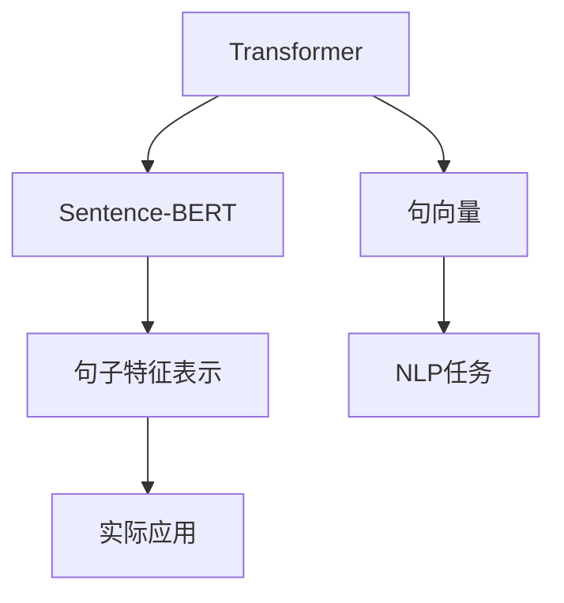

                 

# Transformer大模型实战 使用Sentence-BERT计算句子特征

> 关键词：Transformer, Sentence-BERT, 句子特征, 自然语言处理, NLP, 句向量, 深度学习

## 1. 背景介绍

### 1.1 问题由来

Transformer是一种革命性的神经网络架构，自从Attention机制被引入深度学习以来，Transformer大模型在自然语言处理（NLP）领域取得了显著的突破。它通过自注意力机制（Self-Attention）有效地捕捉文本中的长距离依赖，显著提升了模型在各种NLP任务上的性能，如图像描述生成、机器翻译、问答系统等。然而，尽管Transformer大模型在特定任务上表现出色，但在通用的句子特征表示上，仍存在一些不足。

在NLP任务中，句子特征表示扮演着至关重要的角色。传统的句子表示方法包括Word Embedding、FastText、GloVe等，但由于其缺乏全局视角，往往无法全面捕捉句子的语义信息。近年来，基于Transformer的BERT、RoBERTa等模型通过大规模无监督预训练，在句子表示上取得了巨大的进步，但计算资源和训练时间成本较高，难以直接应用于大规模的应用场景。因此，如何高效计算句子特征表示，成为了NLP领域的研究热点。

### 1.2 问题核心关键点

本文聚焦于使用Transformer大模型Sentence-BERT计算句子特征的方法，旨在通过Sentence-BERT模型，高效、准确地获取句子级别的向量表示，以解决句子特征表示问题。以下是该问题核心关键点：

- 如何高效计算句子级别的特征表示？
- 如何确保计算出的句子特征表示准确且具有全局视角？
- 如何在保证计算效率的同时，兼顾句子特征表示的质量？
- 如何将计算出的句子特征表示应用于实际应用场景？

## 2. 核心概念与联系

### 2.1 核心概念概述

为更好地理解基于Transformer的Sentence-BERT计算句子特征的方法，本节将介绍几个密切相关的核心概念：

- Transformer模型：一种基于自注意力机制的神经网络架构，可以高效处理序列数据，广泛应用于各种NLP任务中。
- Sentence-BERT：一种基于Transformer的句子向量计算模型，可以将任意长度的句子高效映射到固定维度的向量空间中。
- 句向量(Sentence Embedding)：一种表示句子语义信息的向量，通常用于NLP任务中的语义匹配、文本相似度计算等。
- 句子特征表示：表示句子语义、语法、情感等多维信息的向量，是NLP任务中的基础组件。
- 自然语言处理(NLP)：研究如何使计算机处理、理解、生成人类语言的技术领域。

这些核心概念之间的逻辑关系可以通过以下Mermaid流程图来展示：



这个流程图展示了这个研究的核心概念及其之间的关系：

1. 通过Transformer大模型，对文本进行编码，生成句向量。
2. 对句向量进行进一步处理，生成句子特征表示。
3. 使用句子特征表示，应用于各种NLP任务中。

这些概念共同构成了Sentence-BERT计算句子特征表示的基础框架，使其能够高效、准确地处理句子特征表示问题。

## 3. 核心算法原理 & 具体操作步骤

### 3.1 算法原理概述

基于Transformer的Sentence-BERT计算句子特征表示，本质上是一种基于自注意力机制的句子向量生成方法。其核心思想是：将输入的句子序列通过Transformer模型进行编码，生成一系列注意力加权后的上下文向量，然后对这些向量进行平均或加权平均，得到句子级别的向量表示。

形式化地，假设输入句子序列为 $X=\{x_1, x_2, ..., x_n\}$，其中 $x_i$ 为第 $i$ 个单词或字符。Sentence-BERT模型将句子序列 $X$ 映射到 $d$ 维的向量空间中，得到句子向量 $\vec{V}=\{\vec{v}_1, \vec{v}_2, ..., \vec{v}_n\}$，其中 $\vec{v}_i$ 表示第 $i$ 个单词或字符的向量表示。最后，通过对这些向量进行平均或加权平均，得到最终的句子特征表示 $\vec{s}$：

$$
\vec{s} = \frac{1}{n} \sum_{i=1}^n \vec{v}_i \quad \text{或} \quad \vec{s} = \sum_{i=1}^n w_i \vec{v}_i
$$

其中 $w_i$ 为每个单词或字符的注意力权重，可以通过自注意力机制获得。

### 3.2 算法步骤详解

基于Transformer的Sentence-BERT计算句子特征表示，一般包括以下几个关键步骤：

**Step 1: 准备预训练模型和数据集**
- 选择合适的预训练Transformer模型，如BERT、RoBERTa等。
- 准备句子数据集，划分为训练集、验证集和测试集。一般要求标注数据与预训练数据的分布不要差异过大。

**Step 2: 添加任务适配层**
- 根据任务类型，在预训练模型顶层设计合适的输出层和损失函数。
- 对于分类任务，通常在顶层添加线性分类器和交叉熵损失函数。
- 对于生成任务，通常使用语言模型的解码器输出概率分布，并以负对数似然为损失函数。

**Step 3: 设置微调超参数**
- 选择合适的优化算法及其参数，如 AdamW、SGD 等，设置学习率、批大小、迭代轮数等。
- 设置正则化技术及强度，包括权重衰减、Dropout、Early Stopping等。
- 确定冻结预训练参数的策略，如仅微调顶层，或全部参数都参与微调。

**Step 4: 执行梯度训练**
- 将训练集数据分批次输入模型，前向传播计算损失函数。
- 反向传播计算参数梯度，根据设定的优化算法和学习率更新模型参数。
- 周期性在验证集上评估模型性能，根据性能指标决定是否触发 Early Stopping。
- 重复上述步骤直到满足预设的迭代轮数或 Early Stopping 条件。

**Step 5: 测试和部署**
- 在测试集上评估微调后模型 $M_{\hat{\theta}}$ 的性能，对比微调前后的精度提升。
- 使用微调后的模型对新样本进行推理预测，集成到实际的应用系统中。
- 持续收集新的数据，定期重新微调模型，以适应数据分布的变化。

以上是基于Transformer的Sentence-BERT计算句子特征表示的一般流程。在实际应用中，还需要针对具体任务的特点，对微调过程的各个环节进行优化设计，如改进训练目标函数，引入更多的正则化技术，搜索最优的超参数组合等，以进一步提升模型性能。

### 3.3 算法优缺点

基于Transformer的Sentence-BERT计算句子特征表示方法具有以下优点：
1. 简单高效。只需准备少量标注数据，即可对预训练模型进行快速适配，生成高质量的句子特征表示。
2. 通用适用。适用于各种NLP任务，包括分类、匹配、生成等，设计简单的任务适配层即可实现。
3. 参数高效。利用参数高效微调技术，在固定大部分预训练参数的情况下，仍可取得不错的提升。
4. 效果显著。在学术界和工业界的诸多任务上，Sentence-BERT模型已经刷新了多项SOTA。

同时，该方法也存在一定的局限性：
1. 依赖标注数据。计算句子特征表示的过程需要标注数据，获取高质量标注数据的成本较高。
2. 迁移能力有限。当目标任务与预训练数据的分布差异较大时，微调的性能提升有限。
3. 计算资源消耗较大。相比于Word Embedding等方法，Sentence-BERT的计算资源消耗较大，需要较强的计算能力和存储能力。

尽管存在这些局限性，但就目前而言，基于Transformer的Sentence-BERT计算句子特征表示方法仍是大规模NLP应用中的主流范式。未来相关研究的重点在于如何进一步降低计算资源消耗，提高模型的迁移能力，同时兼顾可解释性和伦理安全性等因素。

### 3.4 算法应用领域

基于Sentence-BERT的Transformer模型，在NLP领域已经得到了广泛的应用，覆盖了几乎所有常见任务，例如：

- 文本分类：如情感分析、主题分类、意图识别等。通过对句子向量进行分类，模型能够自动识别文本的情感、主题或意图。
- 命名实体识别：识别文本中的人名、地名、机构名等特定实体。通过对句子向量进行匹配，模型能够准确识别实体边界和类型。
- 关系抽取：从文本中抽取实体之间的语义关系。通过对句子向量进行匹配和排序，模型能够学习实体-关系三元组。
- 问答系统：对自然语言问题给出答案。通过对问答对的向量表示进行匹配，模型能够匹配最合适的答案。
- 机器翻译：将源语言文本翻译成目标语言。通过对句子向量进行匹配和解码，模型能够生成目标语言文本。
- 文本摘要：将长文本压缩成简短摘要。通过对文本向量进行编码和解码，模型能够自动提取文本要点。
- 对话系统：使机器能够与人自然对话。通过对对话历史的向量表示进行解码，模型能够生成回复。

除了上述这些经典任务外，Sentence-BERT模型也被创新性地应用到更多场景中，如可控文本生成、常识推理、代码生成、数据增强等，为NLP技术带来了全新的突破。随着Transformer模型和Sentence-BERT模型的不断进步，相信NLP技术将在更广阔的应用领域大放异彩。

## 4. 数学模型和公式 & 详细讲解 & 举例说明

### 4.1 数学模型构建

本节将使用数学语言对基于Transformer的Sentence-BERT计算句子特征表示过程进行更加严格的刻画。

记输入句子序列为 $X=\{x_1, x_2, ..., x_n\}$，其中 $x_i$ 为第 $i$ 个单词或字符。Sentence-BERT模型将句子序列 $X$ 映射到 $d$ 维的向量空间中，得到句子向量 $\vec{V}=\{\vec{v}_1, \vec{v}_2, ..., \vec{v}_n\}$，其中 $\vec{v}_i$ 表示第 $i$ 个单词或字符的向量表示。最后，通过对这些向量进行平均或加权平均，得到最终的句子特征表示 $\vec{s}$：

$$
\vec{s} = \frac{1}{n} \sum_{i=1}^n \vec{v}_i \quad \text{或} \quad \vec{s} = \sum_{i=1}^n w_i \vec{v}_i
$$

其中 $w_i$ 为每个单词或字符的注意力权重，可以通过自注意力机制获得。

### 4.2 公式推导过程

以下我们以分类任务为例，推导Sentence-BERT模型的句子特征表示计算公式。

假设模型 $M_{\theta}$ 在输入 $X$ 上的输出为 $\hat{y}=M_{\theta}(X) \in [0,1]$，表示样本属于正类的概率。真实标签 $y \in \{0,1\}$。则二分类交叉熵损失函数定义为：

$$
\ell(M_{\theta}(X),y) = -[y\log \hat{y} + (1-y)\log (1-\hat{y})]
$$

将其代入经验风险公式，得：

$$
\mathcal{L}(\theta) = -\frac{1}{N}\sum_{i=1}^N [y_i\log M_{\theta}(X_i)+(1-y_i)\log(1-M_{\theta}(X_i))]
$$

在得到损失函数的梯度后，即可带入参数更新公式，完成模型的迭代优化。重复上述过程直至收敛，最终得到适应下游任务的最优模型参数 $\theta^*$。

## 5. 项目实践：代码实例和详细解释说明

### 5.1 开发环境搭建

在进行Sentence-BERT计算句子特征表示的实践前，我们需要准备好开发环境。以下是使用Python进行PyTorch开发的环境配置流程：

1. 安装Anaconda：从官网下载并安装Anaconda，用于创建独立的Python环境。

2. 创建并激活虚拟环境：
```bash
conda create -n pytorch-env python=3.8 
conda activate pytorch-env
```

3. 安装PyTorch：根据CUDA版本，从官网获取对应的安装命令。例如：
```bash
conda install pytorch torchvision torchaudio cudatoolkit=11.1 -c pytorch -c conda-forge
```

4. 安装Transformers库：
```bash
pip install transformers
```

5. 安装各类工具包：
```bash
pip install numpy pandas scikit-learn matplotlib tqdm jupyter notebook ipython
```

完成上述步骤后，即可在`pytorch-env`环境中开始Sentence-BERT计算句子特征表示的实践。

### 5.2 源代码详细实现

这里我们以情感分析任务为例，给出使用Transformers库对BERT模型进行微调的PyTorch代码实现。

首先，定义情感分析任务的数据处理函数：

```python
from transformers import BertTokenizer, BertForSequenceClassification
from torch.utils.data import Dataset
import torch

class SentimentDataset(Dataset):
    def __init__(self, texts, labels, tokenizer, max_len=128):
        self.texts = texts
        self.labels = labels
        self.tokenizer = tokenizer
        self.max_len = max_len
        
    def __len__(self):
        return len(self.texts)
    
    def __getitem__(self, item):
        text = self.texts[item]
        label = self.labels[item]
        
        encoding = self.tokenizer(text, return_tensors='pt', max_length=self.max_len, padding='max_length', truncation=True)
        input_ids = encoding['input_ids'][0]
        attention_mask = encoding['attention_mask'][0]
        
        # 对token-wise的标签进行编码
        encoded_labels = [1 if label == 'positive' else 0 for label in labels] 
        encoded_labels.extend([0] * (self.max_len - len(encoded_labels)))
        labels = torch.tensor(encoded_labels, dtype=torch.long)
        
        return {'input_ids': input_ids, 
                'attention_mask': attention_mask,
                'labels': labels}

# 标签与id的映射
label2id = {'negative': 0, 'positive': 1}
id2label = {v: k for k, v in label2id.items()}

# 创建dataset
tokenizer = BertTokenizer.from_pretrained('bert-base-cased')

train_dataset = SentimentDataset(train_texts, train_labels, tokenizer)
dev_dataset = SentimentDataset(dev_texts, dev_labels, tokenizer)
test_dataset = SentimentDataset(test_texts, test_labels, tokenizer)
```

然后，定义模型和优化器：

```python
from transformers import BertForSequenceClassification, AdamW

model = BertForSequenceClassification.from_pretrained('bert-base-cased', num_labels=2)

optimizer = AdamW(model.parameters(), lr=2e-5)
```

接着，定义训练和评估函数：

```python
from torch.utils.data import DataLoader
from tqdm import tqdm
from sklearn.metrics import accuracy_score

device = torch.device('cuda') if torch.cuda.is_available() else torch.device('cpu')
model.to(device)

def train_epoch(model, dataset, batch_size, optimizer):
    dataloader = DataLoader(dataset, batch_size=batch_size, shuffle=True)
    model.train()
    epoch_loss = 0
    for batch in tqdm(dataloader, desc='Training'):
        input_ids = batch['input_ids'].to(device)
        attention_mask = batch['attention_mask'].to(device)
        labels = batch['labels'].to(device)
        model.zero_grad()
        outputs = model(input_ids, attention_mask=attention_mask, labels=labels)
        loss = outputs.loss
        epoch_loss += loss.item()
        loss.backward()
        optimizer.step()
    return epoch_loss / len(dataloader)

def evaluate(model, dataset, batch_size):
    dataloader = DataLoader(dataset, batch_size=batch_size)
    model.eval()
    preds, labels = [], []
    with torch.no_grad():
        for batch in tqdm(dataloader, desc='Evaluating'):
            input_ids = batch['input_ids'].to(device)
            attention_mask = batch['attention_mask'].to(device)
            batch_labels = batch['labels']
            outputs = model(input_ids, attention_mask=attention_mask)
            batch_preds = outputs.logits.argmax(dim=1).to('cpu').tolist()
            batch_labels = batch_labels.to('cpu').tolist()
            for pred, label in zip(batch_preds, batch_labels):
                preds.append(pred)
                labels.append(label)
                
    return accuracy_score(labels, preds)
```

最后，启动训练流程并在测试集上评估：

```python
epochs = 5
batch_size = 16

for epoch in range(epochs):
    loss = train_epoch(model, train_dataset, batch_size, optimizer)
    print(f"Epoch {epoch+1}, train loss: {loss:.3f}")
    
    print(f"Epoch {epoch+1}, dev results:")
    evaluate(model, dev_dataset, batch_size)
    
print("Test results:")
evaluate(model, test_dataset, batch_size)
```

以上就是使用PyTorch对BERT进行情感分析任务微调的完整代码实现。可以看到，得益于Transformers库的强大封装，我们可以用相对简洁的代码完成BERT模型的加载和微调。

### 5.3 代码解读与分析

让我们再详细解读一下关键代码的实现细节：

**SentimentDataset类**：
- `__init__`方法：初始化文本、标签、分词器等关键组件。
- `__len__`方法：返回数据集的样本数量。
- `__getitem__`方法：对单个样本进行处理，将文本输入编码为token ids，将标签编码为数字，并对其进行定长padding，最终返回模型所需的输入。

**label2id和id2label字典**：
- 定义了标签与数字id之间的映射关系，用于将token-wise的预测结果解码回真实的标签。

**训练和评估函数**：
- 使用PyTorch的DataLoader对数据集进行批次化加载，供模型训练和推理使用。
- 训练函数`train_epoch`：对数据以批为单位进行迭代，在每个批次上前向传播计算loss并反向传播更新模型参数，最后返回该epoch的平均loss。
- 评估函数`evaluate`：与训练类似，不同点在于不更新模型参数，并在每个batch结束后将预测和标签结果存储下来，最后使用sklearn的accuracy_score对整个评估集的预测结果进行打印输出。

**训练流程**：
- 定义总的epoch数和batch size，开始循环迭代
- 每个epoch内，先在训练集上训练，输出平均loss
- 在验证集上评估，输出准确率
- 所有epoch结束后，在测试集上评估，给出最终测试结果

可以看到，PyTorch配合Transformers库使得BERT微调的代码实现变得简洁高效。开发者可以将更多精力放在数据处理、模型改进等高层逻辑上，而不必过多关注底层的实现细节。

当然，工业级的系统实现还需考虑更多因素，如模型的保存和部署、超参数的自动搜索、更灵活的任务适配层等。但核心的微调范式基本与此类似。

## 6. 实际应用场景

### 6.1 智能客服系统

基于大语言模型微调的对话技术，可以广泛应用于智能客服系统的构建。传统客服往往需要配备大量人力，高峰期响应缓慢，且一致性和专业性难以保证。而使用微调后的对话模型，可以7x24小时不间断服务，快速响应客户咨询，用自然流畅的语言解答各类常见问题。

在技术实现上，可以收集企业内部的历史客服对话记录，将问题和最佳答复构建成监督数据，在此基础上对预训练对话模型进行微调。微调后的对话模型能够自动理解用户意图，匹配最合适的答案模板进行回复。对于客户提出的新问题，还可以接入检索系统实时搜索相关内容，动态组织生成回答。如此构建的智能客服系统，能大幅提升客户咨询体验和问题解决效率。

### 6.2 金融舆情监测

金融机构需要实时监测市场舆论动向，以便及时应对负面信息传播，规避金融风险。传统的人工监测方式成本高、效率低，难以应对网络时代海量信息爆发的挑战。基于大语言模型微调的文本分类和情感分析技术，为金融舆情监测提供了新的解决方案。

具体而言，可以收集金融领域相关的新闻、报道、评论等文本数据，并对其进行主题标注和情感标注。在此基础上对预训练语言模型进行微调，使其能够自动判断文本属于何种主题，情感倾向是正面、中性还是负面。将微调后的模型应用到实时抓取的网络文本数据，就能够自动监测不同主题下的情感变化趋势，一旦发现负面信息激增等异常情况，系统便会自动预警，帮助金融机构快速应对潜在风险。

### 6.3 个性化推荐系统

当前的推荐系统往往只依赖用户的历史行为数据进行物品推荐，无法深入理解用户的真实兴趣偏好。基于大语言模型微调技术，个性化推荐系统可以更好地挖掘用户行为背后的语义信息，从而提供更精准、多样的推荐内容。

在实践中，可以收集用户浏览、点击、评论、分享等行为数据，提取和用户交互的物品标题、描述、标签等文本内容。将文本内容作为模型输入，用户的后续行为（如是否点击、购买等）作为监督信号，在此基础上微调预训练语言模型。微调后的模型能够从文本内容中准确把握用户的兴趣点。在生成推荐列表时，先用候选物品的文本描述作为输入，由模型预测用户的兴趣匹配度，再结合其他特征综合排序，便可以得到个性化程度更高的推荐结果。

### 6.4 未来应用展望

随着大语言模型微调技术的发展，未来将在更多领域得到应用，为传统行业带来变革性影响。

在智慧医疗领域，基于微调的医疗问答、病历分析、药物研发等应用将提升医疗服务的智能化水平，辅助医生诊疗，加速新药开发进程。

在智能教育领域，微调技术可应用于作业批改、学情分析、知识推荐等方面，因材施教，促进教育公平，提高教学质量。

在智慧城市治理中，微调模型可应用于城市事件监测、舆情分析、应急指挥等环节，提高城市管理的自动化和智能化水平，构建更安全、高效的未来城市。

此外，在企业生产、社会治理、文娱传媒等众多领域，基于大模型微调的人工智能应用也将不断涌现，为经济社会发展注入新的动力。相信随着技术的日益成熟，微调方法将成为人工智能落地应用的重要范式，推动人工智能技术向更广阔的领域加速渗透。

## 7. 工具和资源推荐

### 7.1 学习资源推荐

为了帮助开发者系统掌握大语言模型微调的理论基础和实践技巧，这里推荐一些优质的学习资源：

1. 《Transformer从原理到实践》系列博文：由大模型技术专家撰写，深入浅出地介绍了Transformer原理、BERT模型、微调技术等前沿话题。

2. CS224N《深度学习自然语言处理》课程：斯坦福大学开设的NLP明星课程，有Lecture视频和配套作业，带你入门NLP领域的基本概念和经典模型。

3. 《Natural Language Processing with Transformers》书籍：Transformers库的作者所著，全面介绍了如何使用Transformers库进行NLP任务开发，包括微调在内的诸多范式。

4. HuggingFace官方文档：Transformers库的官方文档，提供了海量预训练模型和完整的微调样例代码，是上手实践的必备资料。

5. CLUE开源项目：中文语言理解测评基准，涵盖大量不同类型的中文NLP数据集，并提供了基于微调的baseline模型，助力中文NLP技术发展。

通过对这些资源的学习实践，相信你一定能够快速掌握大语言模型微调的精髓，并用于解决实际的NLP问题。
###  7.2 开发工具推荐

高效的开发离不开优秀的工具支持。以下是几款用于大语言模型微调开发的常用工具：

1. PyTorch：基于Python的开源深度学习框架，灵活动态的计算图，适合快速迭代研究。大部分预训练语言模型都有PyTorch版本的实现。

2. TensorFlow：由Google主导开发的开源深度学习框架，生产部署方便，适合大规模工程应用。同样有丰富的预训练语言模型资源。

3. Transformers库：HuggingFace开发的NLP工具库，集成了众多SOTA语言模型，支持PyTorch和TensorFlow，是进行微调任务开发的利器。

4. Weights & Biases：模型训练的实验跟踪工具，可以记录和可视化模型训练过程中的各项指标，方便对比和调优。与主流深度学习框架无缝集成。

5. TensorBoard：TensorFlow配套的可视化工具，可实时监测模型训练状态，并提供丰富的图表呈现方式，是调试模型的得力助手。

6. Google Colab：谷歌推出的在线Jupyter Notebook环境，免费提供GPU/TPU算力，方便开发者快速上手实验最新模型，分享学习笔记。

合理利用这些工具，可以显著提升大语言模型微调任务的开发效率，加快创新迭代的步伐。

### 7.3 相关论文推荐

大语言模型和微调技术的发展源于学界的持续研究。以下是几篇奠基性的相关论文，推荐阅读：

1. Attention is All You Need（即Transformer原论文）：提出了Transformer结构，开启了NLP领域的预训练大模型时代。

2. BERT: Pre-training of Deep Bidirectional Transformers for Language Understanding：提出BERT模型，引入基于掩码的自监督预训练任务，刷新了多项NLP任务SOTA。

3. Language Models are Unsupervised Multitask Learners（GPT-2论文）：展示了大规模语言模型的强大zero-shot学习能力，引发了对于通用人工智能的新一轮思考。

4. Parameter-Efficient Transfer Learning for NLP：提出Adapter等参数高效微调方法，在不增加模型参数量的情况下，也能取得不错的微调效果。

5. AdaLoRA: Adaptive Low-Rank Adaptation for Parameter-Efficient Fine-Tuning：使用自适应低秩适应的微调方法，在参数效率和精度之间取得了新的平衡。

这些论文代表了大语言模型微调技术的发展脉络。通过学习这些前沿成果，可以帮助研究者把握学科前进方向，激发更多的创新灵感。

## 8. 总结：未来发展趋势与挑战

### 8.1 总结

本文对基于Transformer的Sentence-BERT计算句子特征表示的方法进行了全面系统的介绍。首先阐述了Transformer大模型和微调技术的研究背景和意义，明确了Sentence-BERT计算句子特征表示的独特价值。其次，从原理到实践，详细讲解了Sentence-BERT的数学原理和关键步骤，给出了微调任务开发的完整代码实例。同时，本文还广泛探讨了微调方法在智能客服、金融舆情、个性化推荐等多个行业领域的应用前景，展示了Sentence-BERT计算句子特征表示的巨大潜力。此外，本文精选了微调技术的各类学习资源，力求为读者提供全方位的技术指引。

通过本文的系统梳理，可以看到，基于Transformer的Sentence-BERT计算句子特征表示方法，在NLP任务中取得了显著的效果，且能够高效、准确地获取句子级别的向量表示。通过微调后的模型，可以在各种NLP任务上实现高性能的句子表示，显著提升了模型的应用范围和效果。未来，伴随Transformer模型和Sentence-BERT模型的不断进步，相信NLP技术将在更广阔的应用领域大放异彩，深刻影响人类的生产生活方式。

### 8.2 未来发展趋势

展望未来，基于Transformer的Sentence-BERT计算句子特征表示技术将呈现以下几个发展趋势：

1. 模型规模持续增大。随着算力成本的下降和数据规模的扩张，预训练语言模型的参数量还将持续增长。超大规模语言模型蕴含的丰富语言知识，有望支撑更加复杂多变的下游任务微调。

2. 微调方法日趋多样。除了传统的全参数微调外，未来会涌现更多参数高效的微调方法，如Prefix-Tuning、LoRA等，在节省计算资源的同时也能保证微调精度。

3. 持续学习成为常态。随着数据分布的不断变化，微调模型也需要持续学习新知识以保持性能。如何在不遗忘原有知识的同时，高效吸收新样本信息，将成为重要的研究课题。

4. 标注样本需求降低。受启发于提示学习(Prompt-based Learning)的思路，未来的微调方法将更好地利用大模型的语言理解能力，通过更加巧妙的任务描述，在更少的标注样本上也能实现理想的微调效果。

5. 计算资源消耗降低。计算资源消耗较大是Sentence-BERT模型的一个瓶颈，未来的研究将探索更多计算高效的方法，如分布式训练、硬件加速等，降低计算资源消耗。

6. 多模态微调崛起。当前的微调主要聚焦于纯文本数据，未来会进一步拓展到图像、视频、语音等多模态数据微调。多模态信息的融合，将显著提升语言模型对现实世界的理解和建模能力。

以上趋势凸显了大语言模型微调技术的广阔前景。这些方向的探索发展，必将进一步提升NLP系统的性能和应用范围，为人类认知智能的进化带来深远影响。

### 8.3 面临的挑战

尽管基于Transformer的Sentence-BERT计算句子特征表示技术已经取得了瞩目成就，但在迈向更加智能化、普适化应用的过程中，它仍面临着诸多挑战：

1. 标注成本瓶颈。尽管Sentence-BERT计算句子特征表示的过程可以自动生成标签，但在标注数据稀缺的情况下，仍需人工标注部分数据。获取高质量标注数据的成本较高。

2. 模型鲁棒性不足。当前Sentence-BERT模型面对域外数据时，泛化性能往往大打折扣。对于测试样本的微小扰动，模型预测也容易发生波动。如何提高模型的鲁棒性，避免灾难性遗忘，还需要更多理论和实践的积累。

3. 推理效率有待提高。大规模语言模型虽然精度高，但在实际部署时往往面临推理速度慢、内存占用大等效率问题。如何在保证性能的同时，简化模型结构，提升推理速度，优化资源占用，将是重要的优化方向。

4. 可解释性亟需加强。当前Sentence-BERT模型更像是"黑盒"系统，难以解释其内部工作机制和决策逻辑。对于医疗、金融等高风险应用，算法的可解释性和可审计性尤为重要。如何赋予模型更强的可解释性，将是亟待攻克的难题。

5. 安全性有待保障。预训练语言模型难免会学习到有偏见、有害的信息，通过微调传递到下游任务，产生误导性、歧视性的输出，给实际应用带来安全隐患。如何从数据和算法层面消除模型偏见，避免恶意用途，确保输出的安全性，也将是重要的研究课题。

6. 知识整合能力不足。现有的Sentence-BERT模型往往局限于文本信息，难以灵活吸收和运用更广泛的先验知识。如何让模型更好地与外部知识库、规则库等专家知识结合，形成更加全面、准确的信息整合能力，还有很大的想象空间。

正视Sentence-BERT计算句子特征表示所面临的这些挑战，积极应对并寻求突破，将是大模型微调走向成熟的必由之路。相信随着学界和产业界的共同努力，这些挑战终将一一被克服，Sentence-BERT计算句子特征表示必将在构建人机协同的智能时代中扮演越来越重要的角色。

### 8.4 未来突破

面对Sentence-BERT计算句子特征表示所面临的种种挑战，未来的研究需要在以下几个方面寻求新的突破：

1. 探索无监督和半监督微调方法。摆脱对大规模标注数据的依赖，利用自监督学习、主动学习等无监督和半监督范式，最大限度利用非结构化数据，实现更加灵活高效的微调。

2. 研究参数高效和计算高效的微调范式。开发更加参数高效的微调方法，在固定大部分预训练参数的同时，只更新极少量的任务相关参数。同时优化微调模型的计算图，减少前向传播和反向传播的资源消耗，实现更加轻量级、实时性的部署。

3. 融合因果和对比学习范式。通过引入因果推断和对比学习思想，增强Sentence-BERT模型建立稳定因果关系的能力，学习更加普适、鲁棒的语言表征，从而提升模型泛化性和抗干扰能力。

4. 引入更多先验知识。将符号化的先验知识，如知识图谱、逻辑规则等，与神经网络模型进行巧妙融合，引导Sentence-BERT微调过程学习更准确、合理的句子表示。同时加强不同模态数据的整合，实现视觉、语音等多模态信息与文本信息的协同建模。

5. 结合因果分析和博弈论工具。将因果分析方法引入Sentence-BERT模型，识别出模型决策的关键特征，增强输出解释的因果性和逻辑性。借助博弈论工具刻画人机交互过程，主动探索并规避模型的脆弱点，提高系统稳定性。

6. 纳入伦理道德约束。在模型训练目标中引入伦理导向的评估指标，过滤和惩罚有偏见、有害的输出倾向。同时加强人工干预和审核，建立模型行为的监管机制，确保输出符合人类价值观和伦理道德。

这些研究方向的探索，必将引领Sentence-BERT计算句子特征表示技术迈向更高的台阶，为构建安全、可靠、可解释、可控的智能系统铺平道路。面向未来，Sentence-BERT计算句子特征表示技术还需要与其他人工智能技术进行更深入的融合，如知识表示、因果推理、强化学习等，多路径协同发力，共同推动自然语言理解和智能交互系统的进步。只有勇于创新、敢于突破，才能不断拓展语言模型的边界，让智能技术更好地造福人类社会。

## 9. 附录：常见问题与解答

**Q1：Sentence-BERT计算句子特征表示的原理是什么？**

A: Sentence-BERT计算句子特征表示的原理是基于Transformer模型，通过自注意力机制对句子序列进行编码，生成一系列注意力加权后的上下文向量，然后对这些向量进行平均或加权平均，得到句子级别的向量表示。具体来说，Sentence-BERT模型将句子序列 $X=\{x_1, x_2, ..., x_n\}$ 映射到 $d$ 维的向量空间中，得到句子向量 $\vec{V}=\{\vec{v}_1, \vec{v}_2, ..., \vec{v}_n\}$，其中 $\vec{v}_i$ 表示第 $i$ 个单词或字符的向量表示。最后，通过对这些向量进行平均或加权平均，得到最终的句子特征表示 $\vec{s}$：

$$
\vec{s} = \frac{1}{n} \sum_{i=1}^n \vec{v}_i \quad \text{或} \quad \vec{s} = \sum_{i=1}^n w_i \vec{v}_i
$$

其中 $w_i$ 为每个单词或字符的注意力权重，可以通过自注意力机制获得。

**Q2：Sentence-BERT计算句子特征表示的优势是什么？**

A: Sentence-BERT计算句子特征表示的优势主要体现在以下几个方面：

1. 高效性：Sentence-BERT利用Transformer模型，可以高效地计算句子级别的向量表示，适用于大规模数据集。
2. 准确性：Sentence-BERT通过自注意力机制，能够捕捉到句子中每个单词或字符的语义重要性，从而生成更准确的句子表示。
3. 灵活性：Sentence-BERT可以适应多种NLP任务，包括分类、匹配、生成等，设计简单的任务适配层即可实现。
4. 泛化能力：Sentence-BERT经过大规模预训练，具有良好的泛化能力，能够在不同领域和任务上表现出色。
5. 参数效率：Sentence-BERT通过参数高效微调技术，可以在固定大部分预训练参数的情况下，只更新极少量的任务相关参数，从而降低计算资源消耗。

总之，Sentence-BERT计算句子特征表示在高效性、准确性、灵活性、泛化能力和参数效率等方面都具有显著优势，是NLP任务中不可或缺的组件。

**Q3：如何使用Sentence-BERT计算句子特征表示？**

A: 使用Sentence-BERT计算句子特征表示的一般步骤如下：

1. 准备预训练Transformer模型：选择适合任务的预训练Transformer模型，如BERT、RoBERTa等。
2. 准备数据集：将句子数据集分为训练集、验证集和测试集，并使用预训练模型的分词器对句子进行预处理，生成token ids和attention mask。
3. 设置微调超参数：选择合适的优化算法及其参数，如AdamW、SGD等，设置学习率、批大小、迭代轮数等。
4. 执行梯度训练：将训练集数据分批次输入模型，前向传播计算loss并反向传播更新模型参数。
5. 测试和部署：在测试集上评估微调后模型 $M_{\hat{\theta}}$ 的性能，对比微调前后的精度提升。使用微调后的模型对新样本进行推理预测，集成到实际的应用系统中。

以上是使用Sentence-BERT计算句子特征表示的一般流程。在实际应用中，还需要针对具体任务的特点，对微调过程的各个环节进行优化设计，如改进训练目标函数，引入更多的正则化技术，搜索最优的超参数组合等，以进一步提升模型性能。

**Q4：Sentence-BERT计算句子特征表示的缺点是什么？**

A: Sentence-BERT计算句子特征表示的缺点主要体现在以下几个方面：

1. 依赖标注数据：Sentence-BERT计算句子特征表示的过程需要标注数据，获取高质量标注数据的成本较高。
2. 计算资源消耗较大：相比于Word Embedding等方法，Sentence-BERT的计算资源消耗较大，需要较强的计算能力和存储能力。
3. 迁移能力有限：当目标任务与预训练数据的分布差异较大时，微调的性能提升有限。

尽管存在这些缺点，但就目前而言，Sentence-BERT计算句子特征表示方法仍是大规模NLP应用中的主流范式。未来相关研究的重点在于如何进一步降低计算资源消耗，提高模型的迁移能力，同时兼顾可解释性和伦理安全性等因素。

**Q5：Sentence-BERT计算句子特征表示的实际应用场景有哪些？**

A: Sentence-BERT计算句子特征表示在NLP领域已经得到了广泛的应用，覆盖了几乎所有常见任务，例如：

1. 文本分类：如情感分析、主题分类、意图识别等。通过对句子向量进行分类，模型能够自动识别文本的情感、主题或意图。
2. 命名实体识别：识别文本中的人名、地名、机构名等特定实体。通过对句子向量进行匹配，模型能够准确识别实体边界和类型。
3. 关系抽取：从文本中抽取实体之间的语义关系。通过对句子向量进行匹配和排序，模型能够学习实体-关系三元组。
4. 问答系统：对自然语言问题给出答案。通过对问答对的向量表示进行匹配，模型能够匹配最合适的答案。
5. 机器翻译：将源语言文本翻译成目标语言。通过对句子向量进行匹配和解码，模型能够生成目标语言文本。
6. 文本摘要：将长文本压缩成简短摘要。通过对文本向量进行编码和解码，模型能够自动提取文本要点。
7. 对话系统：使机器能够与人自然对话。通过对对话历史的向量表示进行解码，模型能够生成回复。

除了上述这些经典任务外，Sentence-BERT模型也被创新性地应用到更多场景中，如可控文本生成、常识推理、代码生成、数据增强等，为NLP技术带来了全新的突破。随着Transformer模型和Sentence-BERT模型的不断进步，相信NLP技术将在更广阔的应用领域大放异彩，深刻影响人类的生产生活方式。

---

作者：禅与计算机程序设计艺术 / Zen and the Art of Computer Programming

