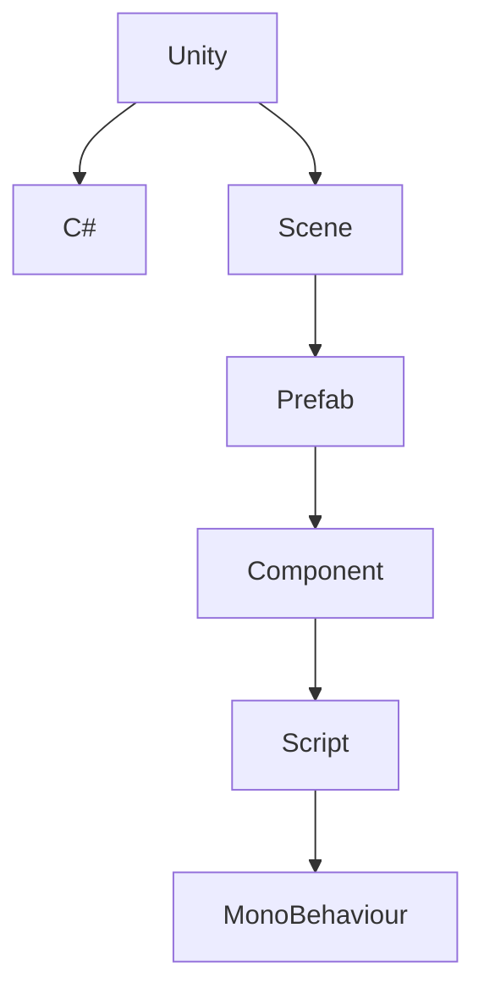

                 

# Unity 游戏开发：C# 脚本和场景管理

> 关键词：Unity, C#, 游戏开发, 脚本编写, 场景管理, 资产管理, 游戏逻辑

## 1. 背景介绍

Unity是一款广泛使用的跨平台游戏引擎，支持PC、游戏机、移动平台等各类终端设备的开发。其强大而灵活的引擎特性、丰富的资源库以及活跃的社区支持，使其成为了全球游戏开发者首选的开发工具。

本文将介绍如何在Unity中编写和部署C#脚本，并通过场景管理来提升游戏的性能和体验。

## 2. 核心概念与联系

### 2.1 核心概念概述

为更好地理解Unity中的C#脚本编写和场景管理，本节将介绍几个关键概念：

- Unity：一款跨平台游戏引擎，支持2D和3D游戏开发，拥有强大的物理引擎、粒子系统、动画系统等功能。
- C#：一种现代的面向对象编程语言，广泛用于Unity中编写游戏逻辑和交互代码。
- 场景(Scene)：Unity中的游戏世界，包含多个预制件(Prefab)和组件(Component)，用于表示游戏中的环境和交互。
- 预制件(Prefab)：游戏中的可重用对象，通常包括网格、纹理、动画等资源。
- 组件(Component)：预制件中的可配置组件，如Rigidbody用于物理模拟，Animator用于动画控制等。
- 脚本(Script)：使用C#编写的游戏逻辑，通过MonoBehaviour脚本组件挂载到预制件上，实现游戏行为。

这些核心概念之间通过Unity的框架和组件架构有机地联系起来，共同构成了Unity游戏开发的基础。

### 2.2 核心概念原理和架构的 Mermaid 流程图



这个流程图展示了Unity、C#、场景、预制件、组件和脚本之间的关系。

1. Unity引擎为游戏提供了一个强大的平台，支持C#作为主要编程语言。
2. 场景是Unity中表示游戏世界的核心概念，由多个预制件组成。
3. 预制件是可重用的游戏对象，通常包含网格、纹理、动画等资源。
4. 组件是预制件中的可配置部分，通过组件可以实现预制件的多种功能。
5. 脚本是使用C#编写的游戏逻辑，通过脚本可以控制预制件的动态行为。
6. MonoBehaviour是Unity中的基础脚本类，所有脚本都继承自MonoBehaviour。

这些概念之间的联系和作用，构建了Unity游戏开发的整体框架。

## 3. 核心算法原理 & 具体操作步骤

### 3.1 算法原理概述

Unity中的C#脚本编写和场景管理主要依赖于其强大的组件系统。每个预制件都可以包含多个组件，每个组件都有自己的功能和行为。通过这些组件的组合和配置，可以实现复杂的游戏逻辑和交互效果。

### 3.2 算法步骤详解

#### 3.2.1 创建和编辑预制件

1. 在Unity编辑器中，创建一个新的预制件(Prefab)。
2. 将所需的游戏对象拖放到预制件中，包括网格、纹理、动画等资源。
3. 为预制件添加必要的组件，如Rigidbody用于物理模拟，Collider用于碰撞检测，Animator用于动画控制等。

#### 3.2.2 编写和部署C#脚本

1. 在Unity编辑器中，右键点击预制件，选择“Add Component” -> “Script”。
2. 选择“C# Script”，并命名为“MyScript”。
3. 在新创建的脚本中编写C#代码，例如：

```csharp
using UnityEngine;

public class MyScript : MonoBehaviour
{
    void Update()
    {
        // 在游戏更新时执行的代码
    }
}
```

4. 将脚本保存后，Unity会自动生成一个MonoBehaviour组件，并将其添加到预制件中。

#### 3.2.3 在游戏场景中使用预制件

1. 在场景编辑器中，右键点击空旷区域，选择“Create Empty”。
2. 将创建的空对象拖动到场景中，并重新命名。
3. 右键点击该空对象，选择“Add Component” -> “MyScript”，将编写的脚本应用到该对象上。
4. 此时，该对象将具有MyScript脚本的行为，例如在Update函数中实现的逻辑。

### 3.3 算法优缺点

#### 3.3.1 优点

1. 灵活性高：通过预制件和组件的组合，可以实现任意复杂的游戏逻辑和交互效果。
2. 开发效率高：通过脚本和组件的可视化操作，可以快速实现游戏功能。
3. 维护性好：预制件和组件的分离设计，使得游戏逻辑和资源分离，便于维护和迭代。

#### 3.3.2 缺点

1. 学习曲线陡峭：初学者需要理解预制件、组件、脚本等多种概念，门槛较高。
2. 内存占用较大：Unity中使用预制件较多时，可能会占用较多的内存和显存，影响性能。
3. 资源管理复杂：需要合理管理预制件和组件，避免资源浪费和冲突。

### 3.4 算法应用领域

Unity的C#脚本和场景管理技术，广泛应用于各种类型的游戏开发，包括2D和3D游戏、独立游戏、大型多人在线游戏(MMO)等。在实际应用中，脚本和场景管理技术还被用于游戏数据管理、用户交互、物理模拟、动画控制等诸多方面。

## 4. 数学模型和公式 & 详细讲解 & 举例说明

### 4.1 数学模型构建

在Unity中，场景管理和脚本编写主要涉及以下数学模型：

- 空间转换：将世界坐标转换为屏幕坐标，用于渲染和碰撞检测。
- 碰撞检测：使用数学公式计算物体之间的碰撞点，用于物理模拟。
- 动画控制：通过插值公式，实现动画的平滑过渡。

### 4.2 公式推导过程

#### 4.2.1 空间转换

世界坐标系和屏幕坐标系之间的关系可以通过以下公式推导：

$$
\begin{aligned}
x_{\text{screen}} &= \frac{x_{\text{world}}}{-1/z_{\text{world}}} \\
y_{\text{screen}} &= \frac{y_{\text{world}}}{-1/z_{\text{world}}} \\
\end{aligned}
$$

其中，$(x_{\text{world}}, y_{\text{world}}, z_{\text{world}})$ 为世界坐标，$(x_{\text{screen}}, y_{\text{screen}})$ 为屏幕坐标。

#### 4.2.2 碰撞检测

碰撞检测通常使用包围球(Bounding Sphere)或包围框(Bounding Box)来计算物体之间的距离。例如，使用包围球检测两个物体之间的碰撞，可以使用以下公式：

$$
d = \sqrt{(x_{\text{A}} - x_{\text{B}})^2 + (y_{\text{A}} - y_{\text{B}})^2 + (z_{\text{A}} - z_{\text{B}})^2}
$$

其中，$(x_{\text{A}}, y_{\text{A}}, z_{\text{A}})$ 和 $(x_{\text{B}}, y_{\text{B}}, z_{\text{B}})$ 分别为两个物体的中心坐标。

#### 4.2.3 动画控制

动画插值公式通常使用线性插值或贝塞尔曲线来平滑过渡。例如，使用线性插值计算两个动画帧之间的过渡帧，可以使用以下公式：

$$
t_{\text{frame}} = \frac{t_{\text{current}} - t_{\text{start}}}{t_{\text{end}} - t_{\text{start}}} \cdot (t_{\text{end}} - t_{\text{start}}) + t_{\text{start}}
$$

其中，$t_{\text{current}}$ 为当前时间，$t_{\text{start}}$ 和 $t_{\text{end}}$ 分别为动画帧的起始时间和结束时间。

### 4.3 案例分析与讲解

#### 4.3.1 实例一：角色动画控制

在Unity中，可以使用Animator组件实现角色的动画控制。通过编写动画状态机，可以控制角色在不同的状态下的动画表现。以下是一个简单的例子：

```csharp
using UnityEngine;
using UnityEngine.UI;
using UnityEngine.Animations;

public class PlayerController : MonoBehaviour
{
    public Animator animator;
    public AudioSource moveSound;

    void Update()
    {
        if (Input.GetKey("W") && !IsAnimating("Walking"))
        {
            animator.Play("Walking");
            moveSound.Play();
        }

        if (Input.GetKey("S") && !IsAnimating("Walking"))
        {
            animator.Play("Walking");
            moveSound.Play();
        }

        if (Input.GetKey("A") && !IsAnimating("Walking"))
        {
            animator.Play("Walking");
            moveSound.Play();
        }

        if (Input.GetKey("D") && !IsAnimating("Walking"))
        {
            animator.Play("Walking");
            moveSound.Play();
        }
    }

    bool IsAnimating(string animation)
    {
        return animator.GetCurrentAnimatorStateInfo(0).IsName(animation);
    }
}
```

在上述代码中，通过调用`animator.Play()`方法，可以播放特定的动画。`IsAnimating()`方法用于检查当前动画是否为指定的状态。

#### 4.3.2 实例二：物理模拟

在Unity中，可以使用Rigidbody组件实现物理模拟。以下是一个简单的例子：

```csharp
using UnityEngine;

public class BallController : MonoBehaviour
{
    public Rigidbody rb;

    void Update()
    {
        float moveAmount = Input.GetAxis("Horizontal");
        rb.AddForce(new Vector3(moveAmount, 0, 0) * 5, ForceMode.Impulse);
    }
}
```

在上述代码中，通过调用`rb.AddForce()`方法，可以向物体施加力，使其产生运动。

### 4.3.3 实例三：场景加载和管理

在Unity中，可以使用Scene Manager来加载和管理不同的场景。以下是一个简单的例子：

```csharp
using UnityEngine.SceneManagement;
using UnityEngine;

public class LevelLoader : MonoBehaviour
{
    void Update()
    {
        if (Input.GetKeyDown(KeyCode.Space))
        {
            SceneManager.LoadScene("New Level");
        }
    }
}
```

在上述代码中，通过调用`SceneManager.LoadScene()`方法，可以加载指定的场景。

## 5. 项目实践：代码实例和详细解释说明

### 5.1 开发环境搭建

为了进行Unity游戏开发，首先需要安装Unity编辑器，并配置好开发环境。

1. 从Unity官网下载并安装Unity编辑器。
2. 安装Visual Studio，用于编写和编译C#脚本。
3. 配置Unity编辑器和Visual Studio之间的连接，以便在Unity中调试C#脚本。

### 5.2 源代码详细实现

#### 5.2.1 创建预制件

在Unity编辑器中，创建一个名为“Player”的预制件。将一个立方体拖放到预制件中，并为其添加Rigidbody和Collider组件。

#### 5.2.2 编写脚本

在Unity编辑器中，右键点击“Player”预制件，选择“Add Component” -> “C# Script”。选择“C# Script”，并命名为“PlayerController”。

在新的脚本中编写代码，例如：

```csharp
using UnityEngine;

public class PlayerController : MonoBehaviour
{
    public Rigidbody rb;

    void Update()
    {
        float moveAmount = Input.GetAxis("Horizontal");
        rb.AddForce(new Vector3(moveAmount, 0, 0) * 5, ForceMode.Impulse);
    }
}
```

#### 5.2.3 加载场景

在Unity编辑器中，创建一个名为“Game”的场景。将“Player”预制件和“PlayerController”脚本拖放到场景中。

### 5.3 代码解读与分析

#### 5.3.1 PlayerController脚本

在上述代码中，通过调用`rb.AddForce()`方法，可以向物体施加力，使其产生运动。通过`Input.GetAxis()`方法，可以从玩家输入中获取水平移动的方向和大小，用于计算移动力的方向和大小。

#### 5.3.2 场景加载

在实际应用中，可以使用Scene Manager加载和管理不同的场景。通过调用`SceneManager.LoadScene()`方法，可以加载指定的场景，例如：

```csharp
using UnityEngine.SceneManagement;

void OnPlayButtonClicked()
{
    SceneManager.LoadScene("New Level");
}
```

在上述代码中，通过调用`SceneManager.LoadScene()`方法，可以加载名为“New Level”的场景。

### 5.4 运行结果展示

运行游戏后，可以看到玩家控制的角色在场景中移动，并且可以通过按下Space键切换到不同的场景。

## 6. 实际应用场景

### 6.1 游戏开发

Unity的C#脚本和场景管理技术在游戏开发中得到了广泛应用。无论是在2D还是3D游戏中，开发者都可以使用这些技术快速实现复杂的交互效果和逻辑。

#### 6.1.1 实例一：射击游戏

在射击游戏中，可以使用Unity的物理引擎和碰撞检测技术实现玩家和敌人之间的交互。通过编写脚本，可以控制玩家和敌人的运动、碰撞、攻击等行为。例如，可以编写一个名为“EnemyController”的脚本，用于控制敌人的移动和攻击：

```csharp
using UnityEngine;

public class EnemyController : MonoBehaviour
{
    public Rigidbody rb;

    void Update()
    {
        if (Input.GetKeyDown(KeyCode.Space))
        {
            rb.AddForce(new Vector3(0, 10, 0), ForceMode.Impulse);
        }
    }
}
```

在上述代码中，通过调用`rb.AddForce()`方法，可以向物体施加力，使其产生跳跃行为。

#### 6.1.2 实例二：解谜游戏

在解谜游戏中，可以使用Unity的动画控制和脚本技术实现复杂的交互逻辑。通过编写脚本，可以实现谜题的生成、验证和解答。例如，可以编写一个名为“PuzzleController”的脚本，用于控制谜题的生成和解答：

```csharp
using UnityEngine;

public class PuzzleController : MonoBehaviour
{
    public Animator animator;

    void Update()
    {
        if (Input.GetKeyDown(KeyCode.Space))
        {
            animator.Play("Solve");
        }
    }
}
```

在上述代码中，通过调用`animator.Play()`方法，可以播放特定的动画。通过调用`Input.GetKeyDown()`方法，可以检查用户是否按下了Space键，用于触发谜题解答。

### 6.2 游戏数据管理

Unity的C#脚本和场景管理技术还可以用于游戏数据管理。通过编写脚本，可以实现游戏数据的存储、读取和更新。

#### 6.2.1 实例一：玩家数据

在Unity中，可以使用UnityDataManager组件实现玩家数据的存储和读取。以下是一个简单的例子：

```csharp
using UnityEngine;
using UnityEngine.DataManagement;

public class PlayerDataManager : MonoBehaviour
{
    public void SavePlayerData(Player player)
    {
        // 将玩家数据保存到本地或云端存储
    }

    public Player LoadPlayerData()
    {
        // 从本地或云端存储加载玩家数据
    }
}
```

在上述代码中，通过调用`SavePlayerData()`方法，可以将玩家数据保存到本地或云端存储。通过调用`LoadPlayerData()`方法，可以从本地或云端存储加载玩家数据。

#### 6.2.2 实例二：游戏配置

在Unity中，可以使用 UnityDataManager 组件实现游戏配置数据的存储和读取。以下是一个简单的例子：

```csharp
using UnityEngine;
using UnityEngine.DataManagement;

public class GameConfigManager : MonoBehaviour
{
    public void SaveGameConfig(GameConfig config)
    {
        // 将游戏配置数据保存到本地或云端存储
    }

    public GameConfig LoadGameConfig()
    {
        // 从本地或云端存储加载游戏配置数据
    }
}
```

在上述代码中，通过调用`SaveGameConfig()`方法，可以将游戏配置数据保存到本地或云端存储。通过调用`LoadGameConfig()`方法，可以从本地或云端存储加载游戏配置数据。

### 6.3 用户交互

Unity的C#脚本和场景管理技术还可以用于用户交互。通过编写脚本，可以实现用户界面的交互和反馈。

#### 6.3.1 实例一：游戏界面

在Unity中，可以使用UnityUI组件实现游戏界面。通过编写脚本，可以控制界面元素的显示和隐藏。以下是一个简单的例子：

```csharp
using UnityEngine;
using UnityEngine.UI;

public class UIController : MonoBehaviour
{
    public void ShowGameOver()
    {
        CanvasGroup canvasGroup = GetComponent<CanvasGroup>();
        canvasGroup.alpha = 1;
    }

    public void HideGameOver()
    {
        CanvasGroup canvasGroup = GetComponent<CanvasGroup>();
        canvasGroup.alpha = 0;
    }
}
```

在上述代码中，通过调用`ShowGameOver()`方法，可以显示游戏结束界面。通过调用`HideGameOver()`方法，可以隐藏游戏结束界面。

#### 6.3.2 实例二：用户反馈

在Unity中，可以使用UnityEvent组件实现用户交互事件的处理。以下是一个简单的例子：

```csharp
using UnityEngine;
using UnityEngine.UI;

public class PlayerController : MonoBehaviour
{
    public UnityEvent onPlayerDeath;

    void Update()
    {
        if (Input.GetKeyDown(KeyCode.Space))
        {
            onPlayerDeath.Invoke();
        }
    }
}
```

在上述代码中，通过调用`onPlayerDeath.Invoke()`方法，可以触发玩家死亡事件。通过编写事件处理函数，可以实现玩家死亡后的动画、音效等效果。

## 7. 工具和资源推荐

### 7.1 学习资源推荐

为了帮助开发者系统掌握Unity中的C#脚本和场景管理技术，这里推荐一些优质的学习资源：

1. Unity官方文档：包含详细的API文档和教程，适合初学者和进阶开发者。
2. Unity Learn：Unity官方提供的在线学习平台，提供大量的视频教程和实战项目。
3. Unity开发者社区：活跃的社区，包含大量的开发指南和经验分享。

通过学习这些资源，相信你一定能够快速掌握Unity中的C#脚本和场景管理技术，并用于解决实际的游戏开发问题。

### 7.2 开发工具推荐

为了提高Unity中的C#脚本和场景管理效率，以下是几款常用的开发工具：

1. Visual Studio：广泛使用的IDE，支持C#脚本的编写和调试。
2. UnityHub：一个集成的Unity工具，提供脚本、预制件和组件的快速安装和升级。
3. UnityPackageExplorer：一个插件，可以显示Unity项目中所有预制件和组件的关系。
4. ReSharper：一个插件，可以提升Visual Studio中的代码编辑和调试效率。

合理利用这些工具，可以显著提升Unity中的C#脚本和场景管理效率，加快游戏开发的进程。

### 7.3 相关论文推荐

Unity中的C#脚本和场景管理技术的发展源于学界的持续研究。以下是几篇奠基性的相关论文，推荐阅读：

1. Unity: A Framework for Research and Development in Graphics Programming（Unity官方论文）：介绍了Unity的起源和发展历程，以及其在图形编程和游戏开发中的贡献。
2. Unity: A High-Level Game Development Platform for Research and Education（Unity教育版论文）：介绍了Unity的教育版和开源版，以及其在教育领域的应用。
3. Unity Game Engine: A Unified Framework for Fast Prototyping and Development（Unity游戏引擎论文）：介绍了Unity引擎的核心架构和关键技术，以及其在快速原型和开发中的应用。

这些论文代表了大语言模型微调技术的发展脉络。通过学习这些前沿成果，可以帮助研究者把握学科前进方向，激发更多的创新灵感。

## 8. 总结：未来发展趋势与挑战

### 8.1 总结

本文对Unity中的C#脚本和场景管理技术进行了全面系统的介绍。首先阐述了Unity引擎的特点和C#脚本编写的关键概念，明确了脚本和场景管理在提升游戏性能和体验方面的独特价值。其次，从原理到实践，详细讲解了脚本编写和场景管理的操作过程，给出了Unity游戏开发的具体案例。同时，本文还探讨了脚本和场景管理技术在游戏开发、数据管理和用户交互等众多领域的应用前景，展示了Unity引擎的强大应用能力。

通过本文的系统梳理，可以看到，Unity中的C#脚本和场景管理技术为游戏开发提供了强大的平台和工具，极大地提升了游戏开发的效率和效果。随着Unity引擎的不断发展和完善，相信Unity中的C#脚本和场景管理技术将不断进步，为游戏开发和应用带来更多的创新和突破。

### 8.2 未来发展趋势

展望未来，Unity中的C#脚本和场景管理技术将呈现以下几个发展趋势：

1. 跨平台支持：Unity将在更多的平台（如Web、VR、AR等）上支持游戏开发，扩展其应用范围。
2. 编辑器优化：Unity将继续优化编辑器功能，提升开发效率和用户体验。
3. 云计算支持：Unity将支持基于云的游戏开发和部署，降低开发和部署成本。
4. 实时协作：Unity将支持多人实时协作开发，提升团队开发效率。
5. 社区生态：Unity将继续活跃其开发者社区，提供更多的资源和工具，促进开发者之间的交流和合作。

以上趋势凸显了Unity引擎在游戏开发领域的持续创新和进步，为游戏开发者和应用开发者带来了更多机会和挑战。

### 8.3 面临的挑战

尽管Unity中的C#脚本和场景管理技术已经取得了显著成就，但在迈向更加智能化、普适化应用的过程中，它仍面临诸多挑战：

1. 性能瓶颈：随着游戏规模的增大，Unity的性能优化将面临更大的挑战。如何提高游戏帧率和响应速度，将是未来的重要课题。
2. 跨平台一致性：不同平台的性能和兼容性差异较大，如何在保持一致性的同时，提升用户体验，仍需进一步研究。
3. 资源管理：随着游戏资源的增加，如何有效管理资源，避免资源冲突和浪费，也是重要的优化方向。
4. 网络优化：Unity中的网络功能仍需进一步优化，特别是在大規模多人在线游戏中，如何降低延迟和带宽消耗，提升网络体验。
5. 安全保障：Unity中的安全性问题仍需进一步加强，如何防止恶意攻击和数据泄露，保护用户隐私和安全。

这些挑战需要Unity社区和开发者共同努力，不断创新和优化，才能使Unity中的C#脚本和场景管理技术更加成熟和稳定。

### 8.4 研究展望

面对Unity中的C#脚本和场景管理技术所面临的挑战，未来的研究需要在以下几个方面寻求新的突破：

1. 优化引擎性能：通过改进渲染管线、减少内存占用、提高资源加载速度等手段，提升Unity引擎的性能和稳定性。
2. 增强跨平台支持：通过统一的API和工具链，提升不同平台间的性能和兼容性。
3. 强化资源管理：通过引入资源管理工具和自动化工具，提高资源加载和管理的效率。
4. 改进网络优化：通过优化网络协议和传输效率，降低网络延迟和带宽消耗。
5. 加强安全保障：通过加密技术、访问控制等手段，增强Unity系统的安全性。

这些研究方向的探索，必将引领Unity中的C#脚本和场景管理技术迈向更高的台阶，为游戏开发和应用带来更多的创新和突破。面向未来，Unity中的C#脚本和场景管理技术需要与其他人工智能技术进行更深入的融合，如机器学习、自然语言处理等，多路径协同发力，共同推动游戏开发技术的进步。

## 9. 附录：常见问题与解答

**Q1：如何编写高效的C#脚本？**

A: 编写高效的C#脚本需要关注以下几点：

1. 使用合适的数据结构：使用Vector3、Quaternion等高效的数据类型，避免使用复杂的数据结构。
2. 避免全局变量：尽量避免使用全局变量，使用局部变量和参数传递。
3. 避免频繁的内存分配：尽量使用固定大小的数组，避免频繁的内存分配和释放。
4. 使用异步编程：使用异步编程提高脚本执行效率，避免阻塞操作。
5. 优化循环：尽量使用for循环和while循环，避免使用foreach循环。

**Q2：如何管理预制件和组件？**

A: 预制件和组件的管理需要关注以下几点：

1. 命名规范：使用统一的命名规范，便于查找和管理。
2. 分层结构：将预制件和组件按照功能分层，便于维护和迭代。
3. 组件封装：将重复的代码封装成组件，避免代码冗余。
4. 版本控制：使用版本控制系统，便于管理和迭代。

**Q3：如何提升Unity游戏性能？**

A: 提升Unity游戏性能需要关注以下几点：

1. 优化渲染管线：使用高效的渲染管线和纹理压缩技术，减少渲染开销。
2. 优化物理引擎：使用合适的物理引擎和碰撞检测算法，减少物理计算的开销。
3. 优化资源加载：使用预加载技术、异步加载等手段，提高资源加载效率。
4. 优化脚本性能：使用高效的脚本编写技巧，避免性能瓶颈。
5. 优化内存管理：使用内存优化工具和技巧，避免内存泄漏和碎片。

**Q4：如何实现游戏界面？**

A: 实现游戏界面需要关注以下几点：

1. 使用UnityUI组件：使用UnityUI组件实现界面元素的创建和布局。
2. 编写脚本：使用脚本控制界面元素的显示和隐藏，实现交互效果。
3. 使用事件系统：使用UnityEvent组件实现界面事件的触发和处理。
4. 使用UI库：使用Unity提供的UI库，提升界面设计和开发的效率。

这些问题的解答可以帮助开发者更好地掌握Unity中的C#脚本和场景管理技术，提升游戏开发的质量和效率。

---

作者：禅与计算机程序设计艺术 / Zen and the Art of Computer Programming

