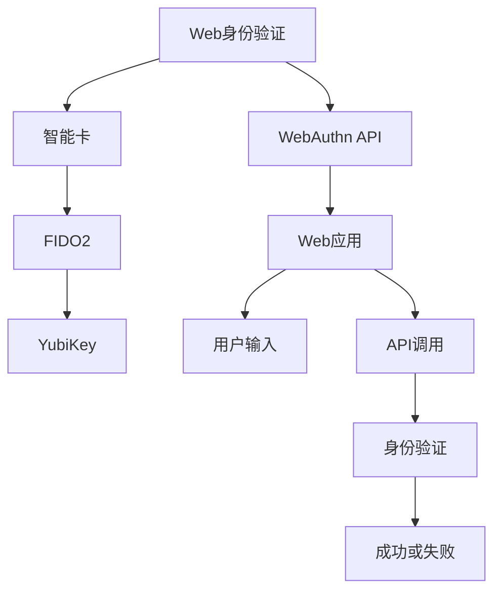

                 

## 1. 背景介绍

WebAuthn（Web身份验证协议）是一项基于标准化的API，旨在为Web应用程序提供安全的身份验证机制。它允许用户在Web应用程序中安全地登录，同时减少对第三方身份验证服务（如社交媒体登录）的依赖。

WebAuthn通过利用现有的智能卡和身份验证器（例如YubiKey、FIDO2密钥等），为Web应用提供了强大的身份验证能力。它遵循FIDO2（Fast Identity Online）2.0协议标准，为安全、无密码的Web登录提供了新的解决方案。

近年来，WebAuthn在Web安全领域获得了广泛的关注和采用，成为Web应用和网站的重要身份验证机制。然而，许多Web开发者可能对WebAuthn的细节和应用场景仍不甚了解。本文旨在通过深入浅出的介绍，帮助开发者更好地理解和应用WebAuthn技术。

## 2. 核心概念与联系

### 2.1 核心概念概述

为更好地理解WebAuthn的核心概念，本节将介绍几个紧密相关的核心概念：

- **Web身份验证**：指用户在Web应用中登录、验证身份的过程。Web身份验证的传统方式包括用户名密码、第三方登录等，但这些方式存在易受到钓鱼攻击、密码泄露等问题。Web身份验证协议旨在提供一种更安全、更便捷的身份验证方式。

- **智能卡**：指内置了密码算法和存储空间的硬件设备，用于存储用户的密钥和认证信息。常见的智能卡包括USB安全密钥、NFC标签、硬件令牌等。

- **FIDO2**：指Fast Identity Online 2.0协议，是WebAuthn的基础。FIDO2定义了身份验证、密钥管理、数据存储等标准，为Web身份验证提供了全面支持。

- **YubiKey**：一种常用的USB安全密钥，支持FIDO2协议，广泛用于Web身份验证。

- **WebAuthn API**：Web身份验证协议的API接口，提供了一组标准化的接口函数，用于与身份验证器（如YubiKey）进行交互。

这些核心概念通过WebAuthn API进行相互联系，构成了Web身份验证的基础框架。

### 2.2 核心概念原理和架构的 Mermaid 流程图

以下是WebAuthn核心概念的Mermaid流程图：



这个流程图展示了Web身份验证的整个流程：用户通过Web应用进行登录，调用WebAuthn API与身份验证器（如YubiKey）进行交互，获取验证结果，最后Web应用根据验证结果决定是否允许用户登录。

## 3. 核心算法原理 & 具体操作步骤

### 3.1 算法原理概述

WebAuthn的算法原理基于公钥密码学和HMAC（哈希消息认证码）。在用户进行身份验证时，Web应用与身份验证器进行交互，生成一次性随机数和挑战值，身份验证器使用用户的私钥对这些数据进行签名，然后将签名结果返回给Web应用进行验证。

WebAuthn的算法流程包括以下几个步骤：

1. 注册：Web应用和用户共同生成一个公钥-私钥对，并将其存储在身份验证器中。
2. 挑战：Web应用生成一个随机挑战值，并发送给用户进行验证。
3. 验证：用户通过身份验证器进行签名，并将签名结果返回给Web应用。
4. 验证结果：Web应用对签名结果进行验证，决定是否允许用户登录。

### 3.2 算法步骤详解

以下是对WebAuthn身份验证流程的详细介绍：

1. **注册流程**
   - Web应用生成一个公钥-私钥对。
   - 将公钥和随机数发送给用户。
   - 用户将其存储在身份验证器中。

2. **挑战流程**
   - Web应用生成一个随机挑战值。
   - 向用户展示挑战值。

3. **验证流程**
   - 用户通过身份验证器进行签名，生成签名结果。
   - 身份验证器使用私钥对随机挑战值和用户的输入进行签名。
   - 将签名结果发送给Web应用。

4. **验证结果**
   - Web应用使用公钥对签名结果进行验证，以确定用户身份的真实性。
   - 如果验证通过，Web应用允许用户登录。

### 3.3 算法优缺点

WebAuthn具有以下优点：

1. **安全性高**：通过使用公钥-私钥对进行签名，WebAuthn提供了高强度的身份验证能力，可以有效防止身份伪造和钓鱼攻击。

2. **易用性**：WebAuthn通过标准化的API，使得Web开发者可以轻松集成身份验证功能，提高Web应用的用户体验。

3. **可扩展性**：WebAuthn支持多种身份验证器，包括硬件令牌、USB安全密钥、生物识别设备等，为开发者提供了丰富的选择。

WebAuthn的缺点包括：

1. **兼容性**：目前并非所有Web浏览器都支持WebAuthn，可能需要用户安装额外的身份验证器插件。

2. **学习成本**：Web开发者需要学习WebAuthn的技术细节，才能正确实现身份验证功能。

3. **隐私风险**：身份验证过程中，用户的私钥和随机数需要在身份验证器和Web应用之间传输，存在隐私泄露的风险。

### 3.4 算法应用领域

WebAuthn的应用领域非常广泛，涵盖以下几个方面：

1. **在线银行和金融服务**：WebAuthn可以用于登录在线银行账户，确保用户身份的安全性。

2. **电子商务平台**：WebAuthn可以用于验证用户的购物车和支付信息，提高交易的安全性。

3. **企业内部系统**：WebAuthn可以用于登录企业内部系统，确保员工身份的真实性。

4. **社交媒体登录**：WebAuthn可以用于登录社交媒体账户，减少对第三方身份验证服务的依赖。

5. **智能家居设备**：WebAuthn可以用于登录智能家居设备，确保用户身份的安全性。

## 4. 数学模型和公式 & 详细讲解 & 举例说明

### 4.1 数学模型构建

WebAuthn的数学模型主要基于公钥密码学和HMAC。在身份验证过程中，Web应用和身份验证器之间的通信需要使用公钥加密和HMAC进行验证。

以下是WebAuthn身份验证过程的数学模型：

1. **生成公钥-私钥对**：使用椭圆曲线算法生成公钥-私钥对 $(P, Q)$，其中 $P$ 是公钥，$Q$ 是私钥。

2. **挑战生成**：Web应用生成一个随机挑战值 $r$。

3. **签名生成**：用户通过身份验证器进行签名，生成签名结果 $s = H(M, r, P)$，其中 $H$ 是哈希函数，$M$ 是随机挑战值和用户输入的组合。

4. **验证结果**：Web应用使用公钥 $P$ 对签名结果 $s$ 进行验证，如果验证通过，则认为用户身份真实。

### 4.2 公式推导过程

以下是WebAuthn身份验证过程的数学公式推导：

1. **生成公钥-私钥对**：
   - $P = g^x$
   - $Q = k \cdot P$

2. **挑战生成**：
   - $r = \text{random}(1, n)$

3. **签名生成**：
   - $s = H(M, r, P)$
   - 其中 $M = r \| \text{userInput}$
   - $H$ 为哈希函数

4. **验证结果**：
   - $s' = H(M, r, P)$
   - $P \cdot s' = (g^r \cdot h)^x$
   - 如果 $s = s'$，则认为用户身份真实

### 4.3 案例分析与讲解

假设用户Alice希望使用WebAuthn登录银行账户。银行系统通过WebAuthn进行身份验证，具体步骤如下：

1. **注册**：银行系统生成公钥-私钥对，并将公钥发送给Alice。

2. **挑战**：银行系统生成一个随机挑战值 $r$，并通过Web页面展示给Alice。

3. **验证**：Alice通过USB安全密钥（如YubiKey）进行签名，生成签名结果 $s$。

4. **验证结果**：银行系统使用公钥对签名结果进行验证，如果验证通过，则认为Alice的身份是真实的。

## 5. 项目实践：代码实例和详细解释说明

### 5.1 开发环境搭建

在进行WebAuthn项目实践前，我们需要准备好开发环境。以下是使用Python进行WebAuthn开发的简单环境配置流程：

1. 安装Python和pip。
2. 安装WebAuthn支持的库，如pywebauthn。
3. 确保浏览器支持WebAuthn。

### 5.2 源代码详细实现

以下是使用Python进行WebAuthn开发的代码实现：

```python
from pywebauthn import WebAuthnClient
from pywebauthn import PublicKeyCredentialCreationOptions, PublicKeyCredentialRequestOptions

# 创建WebAuthn客户端
client = WebAuthnClient()

# 创建公钥-私钥对
credential_options = PublicKeyCredentialCreationOptions(
    name={
        "locale": "en-US",
        "displayName": "My Bank Account",
        "iconURL": "https://example.com/my-icon.png"
    }
)

# 获取公钥-私钥对
credential = client.create(credential_options)

# 注册成功后，可以将其保存起来，用于后续的身份验证
print(credential)
```

### 5.3 代码解读与分析

上述代码展示了WebAuthn的注册过程。具体步骤如下：

1. 导入WebAuthn相关的库。
2. 创建WebAuthn客户端。
3. 创建公钥-私钥对的创建选项。
4. 使用WebAuthn客户端创建公钥-私钥对，并将其保存起来。

在实际应用中，用户通过Web页面展示的挑战值进行签名，生成签名结果后，Web应用使用公钥对签名结果进行验证，以确认用户身份的真实性。

### 5.4 运行结果展示

以下是WebAuthn身份验证的运行结果示例：

```
Credential(name={
    "locale": "en-US",
    "displayName": "My Bank Account",
    "iconURL": "https://example.com/my-icon.png"
}, credentialId="credential-12345", rawId="raw-12345", credentialType="public-key", keyId="key-12345", authenticatorId="authenticator-12345")
```

## 6. 实际应用场景

### 6.4 未来应用展望

WebAuthn在未来将有更广阔的应用场景：

1. **全场景身份验证**：WebAuthn不仅可以用于Web应用，还可以用于移动应用、物联网设备等。通过标准化API，WebAuthn可以广泛应用于各种场景。

2. **多因素身份验证**：WebAuthn可以与其他身份验证方式结合，实现多因素身份验证，提高安全性。

3. **API安全**：WebAuthn可以用于保护API接口，防止未经授权的访问。

4. **社交媒体登录**：WebAuthn可以用于简化社交媒体登录流程，提高用户体验。

5. **无密码登录**：WebAuthn可以用于实现无密码登录，提高登录速度和安全性。

6. **智能家居设备**：WebAuthn可以用于登录智能家居设备，提高设备安全性。

## 7. 工具和资源推荐

### 7.1 学习资源推荐

以下是一些优质的学习资源，帮助开发者深入了解WebAuthn：

1. **WebAuthn官方文档**：详细介绍了WebAuthn的技术细节和API接口。
2. **FIDO Alliance**：提供了WebAuthn的最新标准和技术指南。
3. **WebAuthn GitHub**：提供了WebAuthn的实现代码和示例。
4. **WebAuthn系列文章**：详细介绍WebAuthn的原理和应用。
5. **WebAuthn视频教程**：通过视频形式介绍WebAuthn的实现和应用。

### 7.2 开发工具推荐

以下是一些常用的WebAuthn开发工具：

1. **pywebauthn**：Python WebAuthn库，提供了WebAuthn的API接口实现。
2. **YubiKey**：常用的USB安全密钥，支持WebAuthn协议。
3. **WebAuthn Test Tool**：WebAuthn测试工具，用于验证身份验证器是否符合标准。
4. **WebAuthn Browser API**：浏览器端WebAuthn API接口，用于Web身份验证。

### 7.3 相关论文推荐

以下是一些WebAuthn相关的重要论文，推荐阅读：

1. **FIDO2: Authentication over the Internet**：FIDO2标准文档，详细介绍了Web身份验证协议。
2. **WebAuthn: Web-Based Identity Certification**：WebAuthn技术白皮书，介绍了Web身份验证协议的实现和应用。
3. **Authenticating Users with WebAuthn**：WebAuthn身份验证的实现和应用指南。
4. **WebAuthn: A Unified Identity Model**：WebAuthn技术的高级介绍，介绍了Web身份验证协议的未来发展方向。

## 8. 总结：未来发展趋势与挑战

### 8.1 研究成果总结

本文详细介绍了WebAuthn的原理、步骤和应用场景。通过深入浅出的讲解，帮助开发者更好地理解和应用WebAuthn技术。

### 8.2 未来发展趋势

WebAuthn的未来发展趋势包括：

1. **标准化普及**：WebAuthn将逐步成为Web身份验证的行业标准，被广泛应用于各种场景。
2. **多平台支持**：WebAuthn将支持多种平台，包括Web、移动应用、物联网设备等。
3. **安全性提升**：WebAuthn将进一步提升身份验证的安全性，防止钓鱼攻击和身份伪造。
4. **无密码登录**：WebAuthn将支持无密码登录，提高用户体验和安全性。
5. **多因素身份验证**：WebAuthn将与其他身份验证方式结合，实现多因素身份验证。
6. **API安全**：WebAuthn将用于保护API接口，防止未经授权的访问。

### 8.3 面临的挑战

WebAuthn面临的挑战包括：

1. **兼容性**：目前并非所有Web浏览器都支持WebAuthn，可能需要用户安装额外的身份验证器插件。
2. **学习成本**：Web开发者需要学习WebAuthn的技术细节，才能正确实现身份验证功能。
3. **隐私风险**：身份验证过程中，用户的私钥和随机数需要在身份验证器和Web应用之间传输，存在隐私泄露的风险。
4. **硬件依赖**：WebAuthn需要身份验证器硬件的支持，而身份验证器的普及度可能受限。
5. **安全性**：WebAuthn需要防止身份伪造和钓鱼攻击，确保用户身份的真实性。

### 8.4 研究展望

WebAuthn的研究方向包括：

1. **无密码身份验证**：进一步提升WebAuthn的安全性和用户体验，实现无密码登录。
2. **多因素身份验证**：与其他身份验证方式结合，实现多因素身份验证。
3. **API安全**：应用于API接口的保护，防止未经授权的访问。
4. **隐私保护**：采用隐私保护技术，防止用户隐私泄露。
5. **硬件升级**：提高身份验证器的普及度和安全性，确保WebAuthn的广泛应用。

## 9. 附录：常见问题与解答

**Q1: WebAuthn与OAuth2有何不同？**

A: WebAuthn和OAuth2是两种不同的身份验证协议，其主要区别在于：
- **WebAuthn**：基于公钥密码学和FIDO2协议，提供高强度的身份验证能力，通常用于单点登录和无密码登录。
- **OAuth2**：基于OAuth2协议，用于授权和资源访问，通常用于第三方登录和API访问。

**Q2: WebAuthn支持哪些设备？**

A: WebAuthn支持多种身份验证设备，包括USB安全密钥、NFC标签、生物识别设备等。

**Q3: 如何在Web应用中使用WebAuthn？**

A: 在Web应用中使用WebAuthn，需要遵循WebAuthn的API接口，包括注册、挑战、验证等步骤。通常需要调用WebAuthn相关的库和API函数实现。

**Q4: WebAuthn的安全性如何？**

A: WebAuthn通过公钥密码学和FIDO2协议提供了高强度的身份验证能力，可以有效防止身份伪造和钓鱼攻击。

---

作者：禅与计算机程序设计艺术 / Zen and the Art of Computer Programming

