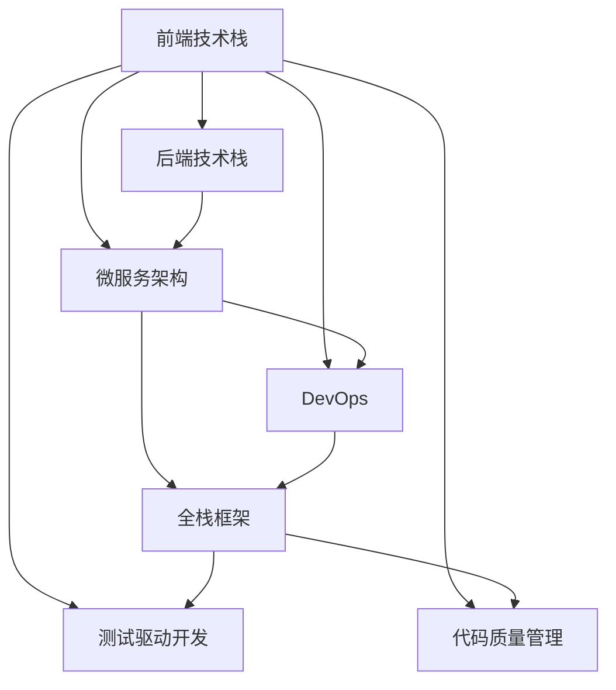

                 

# Web全栈开发：从前端到后端的全面指南

> 关键词：Web全栈开发、前端技术、后端技术、微服务架构、DevOps、全栈框架、软件工程实践

## 1. 背景介绍

### 1.1 问题由来

随着互联网技术的快速发展，Web开发已经从最初的单一技术栈模式，逐渐演化为更加复杂和多元的全栈开发模式。全栈开发，即前后端一体化开发，涉及到前端和后端的全部技术栈。这种模式不仅能提高开发效率，还能增强应用系统的性能和可维护性。

然而，随着应用规模的扩大和技术栈的复杂化，全栈开发也面临诸多挑战，如技术栈选择、团队协作、版本管理等。因此，如何快速高效地进行全栈开发，成为当前Web开发的重要课题。本文将系统介绍全栈开发的关键概念和技术栈，从实际应用场景出发，深入探讨全栈开发的最佳实践，为Web开发者提供全方位的指导。

### 1.2 问题核心关键点

全栈开发的核心在于将前端和后端技术无缝结合，实现应用的全面构建和部署。具体来说，以下关键点决定了全栈开发的成功与否：

- 技术栈选择：合理选择前后端技术栈，兼顾效率和可维护性。
- 数据通信：前端与后端的数据交换方式，如RESTful API、GraphQL等。
- 版本管理：前端与后端代码的版本控制策略，保证协同开发的一致性。
- 持续集成与部署：通过自动化测试和部署流程，提高开发效率和系统稳定性。
- 软件工程实践：全栈开发不仅仅是技术堆砌，更需要先进的工程管理实践，如DevOps、测试驱动开发等。

本文将围绕这些核心关键点，深入探讨全栈开发的理论基础和最佳实践，帮助开发者构建高效、可靠、可维护的全栈Web应用。

## 2. 核心概念与联系

### 2.1 核心概念概述

为了更好地理解全栈开发，本节将介绍几个关键概念及其相互联系：

- **前端技术栈(Frontend Stack)**：包括HTML、CSS、JavaScript、React、Vue等，用于构建用户界面和交互逻辑。
- **后端技术栈(Backend Stack)**：包括Node.js、Ruby、Java、Python等，用于处理业务逻辑和数据存储。
- **微服务架构(Microservices Architecture)**：将应用拆分为多个独立服务，每个服务独立部署，实现更高的灵活性和扩展性。
- **DevOps(Development Operations)**：将开发和运维流程自动化，提高团队协作效率和系统稳定性。
- **全栈框架(Full Stack Framework)**：如Angular、Svelte、Django等，提供一站式的开发工具和库，加速全栈开发过程。

这些核心概念之间的逻辑关系可以通过以下Mermaid流程图来展示：



这个流程图展示了前端技术栈与后端技术栈的紧密联系，以及DevOps、测试驱动开发和代码质量管理对全栈开发的重要作用。

## 3. 核心算法原理 & 具体操作步骤
### 3.1 算法原理概述

全栈开发的核心算法原理包括前端和后端的技术栈选择、数据通信协议、版本管理、持续集成与部署等。以下是对这些原理的详细解释：

### 3.2 算法步骤详解

#### 3.2.1 技术栈选择

前端技术栈：

- HTML/CSS：构建页面基础结构，实现页面布局和样式。
- JavaScript/TypeScript：实现页面动态效果，如表单提交、事件响应等。
- 框架库：如React、Vue、Angular等，提供组件化和状态管理功能。

后端技术栈：

- 语言：如Node.js、Ruby、Java、Python等，用于编写服务器端代码。
- 框架：如Express、Ruby on Rails、Spring Boot、Django等，提供路由、中间件、数据库集成等功能。
- 数据库：如MySQL、PostgreSQL、MongoDB等，存储和管理应用数据。

#### 3.2.2 数据通信

数据通信是前端和后端之间最重要的交互方式，常见协议包括RESTful API和GraphQL：

- **RESTful API**：基于HTTP协议，通过GET、POST等请求方式进行数据交换。优点是简单易用，缺点是数据交换量大。
- **GraphQL**：一种基于Graph的查询语言，允许客户端精确指定所需的数据。优点是减少数据交换量，提高数据获取效率，缺点是学习曲线较陡峭。

#### 3.2.3 版本管理

版本管理是协同开发的关键，常用的版本控制工具包括Git和SVN：

- **Git**：分布式版本控制系统，支持分支、合并、标签等功能。
- **SVN**：集中式版本控制系统，简单易用，但扩展性差。

全栈开发需要前后端代码协同更新，可以使用Git进行版本控制，确保代码一致性和稳定性。

#### 3.2.4 持续集成与部署

持续集成与部署是提高开发效率和系统稳定性的重要手段：

- **持续集成**：通过自动化测试和代码集成，确保每次提交代码都能通过测试，提高开发效率。
- **持续部署**：通过自动化部署流程，将代码自动部署到生产环境，提高系统稳定性。

常用的持续集成工具包括Jenkins、Travis CI等，常用的持续部署工具包括CI/CD流水线、Kubernetes等。

### 3.3 算法优缺点

#### 3.3.1 优点

- **提升开发效率**：全栈开发将前后端技术紧密结合，避免了前后端分离带来的沟通成本和重复开发，提高开发效率。
- **增强系统稳定性**：通过DevOps和持续集成部署流程，提高系统稳定性和可靠性。
- **降低开发成本**：全栈开发可以共享前后端代码库，减少开发成本和维护成本。

#### 3.3.2 缺点

- **技术栈选择复杂**：全栈开发需要同时掌握前端和后端技术栈，选择困难。
- **开发难度高**：全栈开发涉及的技术点多，开发难度大，需要较强的技术能力和经验。
- **团队协作复杂**：全栈开发需要前后端协同开发，团队协作复杂，容易产生沟通问题。

### 3.4 算法应用领域

全栈开发广泛应用于各种Web应用场景，包括但不限于：

- 电子商务平台：如淘宝、京东、Amazon等，提供商品展示、购物车、支付等功能。
- 社交媒体平台：如Facebook、Twitter、微信等，提供消息推送、用户互动、内容发布等功能。
- 企业应用平台：如HR管理、CRM系统、OA系统等，提供员工管理、客户关系、办公协作等功能。
- 教育培训平台：如Coursera、Udemy、慕课网等，提供课程学习、在线测试、作业提交等功能。
- 医疗健康平台：如丁香医生、好大夫在线等，提供在线咨询、电子病历、健康管理等功能。

## 4. 数学模型和公式 & 详细讲解 & 举例说明

### 4.1 数学模型构建

本节将使用数学语言对全栈开发的基本原理进行更加严格的刻画。

假设前端应用基于React框架，后端应用基于Node.js和Express框架。假设前端代码存储在Git仓库中，后端代码也存储在Git仓库中。后端数据库为MySQL。

定义前端应用的数学模型为 $M_{\text{front}}$，后端应用的数学模型为 $M_{\text{back}}$，则全栈应用的整体数学模型 $M$ 可以表示为：

$$
M = M_{\text{front}} \times M_{\text{back}}
$$

其中 $\times$ 表示前后端代码的结合。

### 4.2 公式推导过程

以下我们以一个简单的用户登录功能为例，推导全栈应用的数学模型：

假设用户登录表单为 $F_{\text{form}}$，前端代码实现为 $M_{\text{front}}$，后端代码实现为 $M_{\text{back}}$。用户输入用户名和密码后，前端代码将数据发送到后端，后端代码将数据存储到MySQL数据库中，并返回登录结果。则用户登录的完整流程可以表示为：

$$
F_{\text{form}} \rightarrow M_{\text{front}} \rightarrow M_{\text{back}} \rightarrow M_{\text{db}}
$$

其中 $M_{\text{db}}$ 表示MySQL数据库，存储用户信息。

### 4.3 案例分析与讲解

假设全栈应用涉及用户注册、登录、订单管理等功能。前端代码存储在Git仓库中，后端代码也存储在Git仓库中。后端数据库为MySQL。

**案例一：用户注册**

用户注册功能需要前端页面展示注册表单，用户输入用户名和密码后，前端代码将数据发送到后端，后端代码将数据存储到MySQL数据库中，并返回注册结果。具体步骤如下：

1. 前端页面展示注册表单。
2. 用户输入用户名和密码，点击提交按钮。
3. 前端代码将用户输入的数据转换为JSON格式，并通过HTTP POST请求发送到后端。
4. 后端代码接收到请求后，调用MySQL存储用户信息，并返回注册结果。
5. 前端代码根据返回结果，展示注册结果页面。

**案例二：用户登录**

用户登录功能需要前端页面展示登录表单，用户输入用户名和密码后，前端代码将数据发送到后端，后端代码将数据存储到MySQL数据库中，并返回登录结果。具体步骤如下：

1. 前端页面展示登录表单。
2. 用户输入用户名和密码，点击提交按钮。
3. 前端代码将用户输入的数据转换为JSON格式，并通过HTTP POST请求发送到后端。
4. 后端代码接收到请求后，调用MySQL查询用户信息，并返回登录结果。
5. 前端代码根据返回结果，展示登录结果页面。

**案例三：订单管理**

订单管理功能需要前端页面展示订单列表，用户可以对订单进行查看、修改、删除等操作。具体步骤如下：

1. 前端页面展示订单列表，包含订单ID、订单号、订单状态等字段。
2. 用户点击某个订单，前端代码将订单ID发送到后端。
3. 后端代码接收到请求后，从MySQL中获取订单信息，并返回订单详情页面。
4. 用户对订单进行操作，前端代码将操作数据发送到后端。
5. 后端代码接收到请求后，更新MySQL中的订单信息，并返回操作结果。
6. 前端代码根据返回结果，更新订单列表页面。

## 5. 项目实践：代码实例和详细解释说明
### 5.1 开发环境搭建

在进行全栈开发实践前，我们需要准备好开发环境。以下是使用Node.js和React进行全栈开发的开发环境配置流程：

1. 安装Node.js和npm：从官网下载并安装Node.js和npm，用于安装和管理项目依赖。
2. 创建项目目录和package.json文件：
```bash
mkdir my-webapp
cd my-webapp
npm init -y
```
3. 安装React和相关依赖：
```bash
npm install react react-dom react-router-dom
```
4. 创建React应用：
```bash
npx create-react-app my-webapp
```
5. 创建后端服务器：
```bash
npm install express mysql
```

### 5.2 源代码详细实现

下面我们以一个简单的用户登录功能为例，展示全栈开发的源代码实现。

首先，在前端代码中创建用户登录表单：

```javascript
import React, { useState } from 'react';
import { Redirect } from 'react-router-dom';

function LoginForm() {
  const [redirect, setRedirect] = useState(false);
  const [username, setUsername] = useState('');
  const [password, setPassword] = useState('');

  const handleSubmit = (event) => {
    event.preventDefault();
    // 发送登录请求到后端
    fetch('/api/login', {
      method: 'POST',
      headers: {
        'Content-Type': 'application/json'
      },
      body: JSON.stringify({ username, password })
    }).then(response => response.json())
    .then(data => {
      if (data.success) {
        setRedirect(true);
      }
    });
  };

  if (redirect) {
    return <Redirect to="/" />;
  }

  return (
    <form onSubmit={handleSubmit}>
      <label>
        Username: 
        <input type="text" value={username} onChange={e => setUsername(e.target.value)} />
      </label>
      <br />
      <label>
        Password: 
        <input type="password" value={password} onChange={e => setPassword(e.target.value)} />
      </label>
      <br />
      <button type="submit">Login</button>
    </form>
  );
}

export default LoginForm;
```

然后，在后端代码中实现用户登录功能：

```javascript
const express = require('express');
const mysql = require('mysql');

const app = express();
const connection = mysql.createConnection({
  host: 'localhost',
  user: 'root',
  password: 'password',
  database: 'mydb'
});

app.use(express.json());

app.post('/api/login', (req, res) => {
  const { username, password } = req.body;

  // 查询用户信息
  connection.query('SELECT * FROM users WHERE username = ? AND password = ?', [username, password], (error, results, fields) => {
    if (error) {
      res.status(500).json({ success: false });
    } else if (results.length > 0) {
      res.json({ success: true });
    } else {
      res.json({ success: false });
    }
  });
});

app.listen(3000, () => {
  console.log('Server started on port 3000');
});
```

这里使用了Node.js的Express框架和MySQL数据库，实现了基本的用户登录功能。在前端代码中，使用了React框架和React Router DOM组件，实现了登录表单的页面展示和提交。

### 5.3 代码解读与分析

让我们再详细解读一下关键代码的实现细节：

**LoginForm组件**：

- 使用了useState钩子，实现了用户输入和表单提交的状态管理。
- 使用了fetch API，通过HTTP POST请求发送登录数据到后端。
- 使用了React Router DOM的Redirect组件，实现登录成功后跳转到首页。

**后端代码**：

- 使用了Express框架，创建HTTP服务器。
- 使用了mysql模块，连接MySQL数据库。
- 使用了fetch API，监听POST请求并处理登录数据。
- 使用了回调函数，查询数据库并返回登录结果。

**项目完整代码**：

```javascript
import React, { useState } from 'react';
import { Redirect } from 'react-router-dom';

function LoginForm() {
  const [redirect, setRedirect] = useState(false);
  const [username, setUsername] = useState('');
  const [password, setPassword] = useState('');

  const handleSubmit = (event) => {
    event.preventDefault();
    // 发送登录请求到后端
    fetch('/api/login', {
      method: 'POST',
      headers: {
        'Content-Type': 'application/json'
      },
      body: JSON.stringify({ username, password })
    }).then(response => response.json())
    .then(data => {
      if (data.success) {
        setRedirect(true);
      }
    });
  };

  if (redirect) {
    return <Redirect to="/" />;
  }

  return (
    <form onSubmit={handleSubmit}>
      <label>
        Username: 
        <input type="text" value={username} onChange={e => setUsername(e.target.value)} />
      </label>
      <br />
      <label>
        Password: 
        <input type="password" value={password} onChange={e => setPassword(e.target.value)} />
      </label>
      <br />
      <button type="submit">Login</button>
    </form>
  );
}

export default LoginForm;
```

```javascript
const express = require('express');
const mysql = require('mysql');

const app = express();
const connection = mysql.createConnection({
  host: 'localhost',
  user: 'root',
  password: 'password',
  database: 'mydb'
});

app.use(express.json());

app.post('/api/login', (req, res) => {
  const { username, password } = req.body;

  // 查询用户信息
  connection.query('SELECT * FROM users WHERE username = ? AND password = ?', [username, password], (error, results, fields) => {
    if (error) {
      res.status(500).json({ success: false });
    } else if (results.length > 0) {
      res.json({ success: true });
    } else {
      res.json({ success: false });
    }
  });
});

app.listen(3000, () => {
  console.log('Server started on port 3000');
});
```

可以看到，通过Node.js和React，我们能够快速搭建起一个全栈Web应用，实现用户登录功能。

### 5.4 运行结果展示

运行以上代码，启动后端服务器：

```bash
node server.js
```

然后在浏览器中访问 `http://localhost:3000/login`，输入用户名和密码，点击提交按钮，即可实现用户登录功能。

## 6. 实际应用场景
### 6.1 智能客服系统

全栈开发在智能客服系统中有着广泛的应用。传统的客服系统依赖人工客服，效率低、成本高。而全栈开发可以实现智能客服系统，通过前端页面展示客服机器人、用户输入等交互界面，后端处理用户请求、回复等业务逻辑，实现自然流畅的客服对话。

具体而言，全栈开发可以实现以下功能：

- 用户登录与注册：用户登录后，智能客服系统可以记住用户的偏好和历史记录，提供个性化的服务。
- 智能问答：智能客服系统可以使用NLP技术解析用户输入，生成回复，并根据用户反馈不断优化回答质量。
- 多渠道接入：智能客服系统可以通过网站、手机APP、社交媒体等多种渠道接入用户，提高用户覆盖率。
- 数据分析：智能客服系统可以分析用户行为数据，生成分析报告，帮助企业优化客服策略。

### 6.2 在线教育平台

在线教育平台需要全栈开发来实现各种功能，如课程展示、在线测试、作业提交、在线课堂等。全栈开发可以提供前后端一体化的解决方案，提高开发效率和系统稳定性。

具体而言，全栈开发可以实现以下功能：

- 课程展示：通过前端页面展示课程列表、课程内容、学习进度等信息。
- 在线测试：通过前端页面展示测试题目，后端处理用户答题、批改、统计等功能。
- 作业提交：通过前端页面展示作业题目，后端处理作业提交、批改、反馈等功能。
- 在线课堂：通过前端页面展示课堂内容、师生互动、实时聊天等功能。
- 数据分析：通过后端处理用户行为数据，生成分析报告，帮助教师优化教学策略。

### 6.3 电子商务平台

电子商务平台需要全栈开发来实现各种功能，如商品展示、购物车、支付、物流跟踪等。全栈开发可以提供前后端一体化的解决方案，提高开发效率和系统稳定性。

具体而言，全栈开发可以实现以下功能：

- 商品展示：通过前端页面展示商品列表、商品详情、促销活动等信息。
- 购物车管理：通过前端页面展示购物车列表、商品信息、下单确认等功能。
- 支付功能：通过前端页面展示支付界面，后端处理支付逻辑和订单信息。
- 物流跟踪：通过后端处理订单信息，生成物流跟踪页面，提供实时物流查询。
- 数据分析：通过后端处理用户行为数据，生成分析报告，帮助商家优化运营策略。

## 7. 工具和资源推荐
### 7.1 学习资源推荐

为了帮助开发者系统掌握全栈开发的技术栈和实践方法，这里推荐一些优质的学习资源：

1. **《JavaScript高级程序设计》**：一本经典的JavaScript教材，涵盖JavaScript核心语法、对象、函数、DOM操作等知识点。
2. **《Ruby on Rails Tutorial》**：一本介绍Ruby on Rails框架的入门教程，适合初学者学习Ruby和Rails开发。
3. **《Python Web Development with Django》**：一本介绍Django框架的入门教程，涵盖Django核心概念、模板、ORM等知识点。
4. **《React官方文档》**：React官方文档，详细介绍了React的核心概念、组件、状态管理等知识点。
5. **《Node.js设计模式》**：一本介绍Node.js设计模式的书籍，涵盖设计模式、异步编程、模块化等知识点。
6. **《全栈开发实战》**：一本介绍全栈开发的书籍，涵盖前端、后端、DevOps等知识点。
7. **《Web全栈开发实战》课程**：由大牛讲师讲授的Web全栈开发课程，涵盖前端、后端、DevOps等知识点，适合系统学习全栈开发。

通过对这些学习资源的系统学习，相信你一定能够快速掌握全栈开发的技术栈和实践方法。

### 7.2 开发工具推荐

高效的开发离不开优秀的工具支持。以下是几款用于全栈开发开发的常用工具：

1. **Visual Studio Code**：一款轻量级的代码编辑器，支持多种编程语言和插件，提高开发效率。
2. **GitHub**：一个流行的代码托管平台，支持版本控制和协作开发，方便代码共享和项目管理。
3. **Jenkins**：一款持续集成和持续部署工具，支持自动化测试和部署流程，提高开发效率和系统稳定性。
4. **Docker**：一款容器化平台，支持应用打包和部署，方便应用迁移和扩展。
5. **Kubernetes**：一款容器编排工具，支持应用自动化部署和运维，提高应用的可伸缩性和可靠性。
6. **Postman**：一款API测试工具，支持HTTP请求和响应测试，方便API开发和调试。
7. **CodeSandbox**：一款前端开发平台，支持实时预览和代码编辑，方便前端开发和调试。

合理利用这些工具，可以显著提升全栈开发任务的开发效率，加速创新迭代的步伐。

### 7.3 相关论文推荐

全栈开发的研究源于学界的持续研究。以下是几篇奠基性的相关论文，推荐阅读：

1. **《JavaScript框架设计模式》**：介绍了JavaScript框架的设计模式，涵盖React、Vue等框架的设计思想和实现机制。
2. **《微服务架构实践》**：介绍了微服务架构的原理、设计模式和实现方法，涵盖服务拆分、服务发现、负载均衡等知识点。
3. **《DevOps实践指南》**：介绍了DevOps的原理、工具和实践方法，涵盖自动化测试、持续集成、持续部署等知识点。
4. **《全栈开发框架比较》**：比较了Angular、React、Vue等全栈开发框架的优缺点，提供了选择框架的指导。
5. **《全栈开发最佳实践》**：总结了全栈开发的最佳实践，涵盖代码质量管理、版本控制、持续集成等知识点。
6. **《Web应用性能优化》**：介绍了Web应用性能优化的原理、技术和工具，涵盖前端优化、后端优化、数据库优化等知识点。

这些论文代表了大全栈开发技术的发展脉络。通过学习这些前沿成果，可以帮助研究者把握学科前进方向，激发更多的创新灵感。

## 8. 总结：未来发展趋势与挑战

### 8.1 总结

本文对全栈开发的关键概念和技术栈进行了全面系统的介绍。从实际应用场景出发，深入探讨了全栈开发的最佳实践，帮助开发者构建高效、可靠、可维护的全栈Web应用。

通过本文的系统梳理，可以看到，全栈开发将前端和后端技术紧密结合，实现应用的全面构建和部署，具有广泛的应用前景。全栈开发不仅提高了开发效率和系统稳定性，还能降低开发成本和维护成本。

### 8.2 未来发展趋势

展望未来，全栈开发技术将呈现以下几个发展趋势：

1. **微服务架构**：微服务架构将应用拆分为多个独立服务，每个服务独立部署，实现更高的灵活性和扩展性。全栈开发将更多地采用微服务架构，提高系统的可维护性和可扩展性。
2. **DevOps文化**：DevOps文化将开发和运维流程自动化，提高团队协作效率和系统稳定性。全栈开发将更多地采用DevOps文化，实现自动化测试和部署流程。
3. **前端技术栈**：前端技术栈将不断升级，React、Vue、Angular等框架将不断迭代，提供更丰富的功能和更好的性能。全栈开发将更多地采用先进的前端技术栈，提升用户体验。
4. **后端技术栈**：后端技术栈将不断升级，Node.js、Ruby、Java、Python等语言将不断迭代，提供更好的性能和更丰富的库。全栈开发将更多地采用先进的后端技术栈，提升系统性能。
5. **全栈框架**：全栈框架将不断升级，Angular、Svelte、Django等框架将不断迭代，提供更丰富的功能和更好的性能。全栈开发将更多地采用先进的全栈框架，提升开发效率。

以上趋势凸显了全栈开发技术的广阔前景。这些方向的探索发展，必将进一步提升全栈开发的效果和应用范围，为Web开发带来新的突破。

### 8.3 面临的挑战

尽管全栈开发技术已经取得了一定的进展，但在迈向更加智能化、普适化应用的过程中，它仍面临着诸多挑战：

1. **技术栈选择复杂**：全栈开发需要同时掌握前端和后端技术栈，选择困难。
2. **开发难度高**：全栈开发涉及的技术点多，开发难度大，需要较强的技术能力和经验。
3. **团队协作复杂**：全栈开发需要前后端协同开发，团队协作复杂，容易产生沟通问题。
4. **持续集成与部署**：全栈开发需要前后端代码协同更新，版本控制和自动化部署流程需要不断优化。
5. **软件工程实践**：全栈开发需要先进的工程管理实践，如DevOps、测试驱动开发等，才能保证系统稳定性和开发效率。
6. **版本管理**：全栈开发需要前后端代码协同更新，版本控制需要完善的管理策略。

正视全栈开发面临的这些挑战，积极应对并寻求突破，将是全栈开发技术走向成熟的必由之路。相信随着学界和产业界的共同努力，这些挑战终将一一被克服，全栈开发必将在构建高效、可靠、可维护的全栈Web应用中扮演越来越重要的角色。

### 8.4 研究展望

面对全栈开发所面临的挑战，未来的研究需要在以下几个方面寻求新的突破：

1. **技术栈选择与整合**：如何选择合适的技术栈，并实现前后端无缝整合，是未来研究的重点。
2. **微服务架构**：如何将全栈开发与微服务架构结合，提高系统的灵活性和扩展性，是未来研究的重点。
3. **DevOps文化**：如何将DevOps文化引入全栈开发，实现自动化测试和部署流程，是未来研究的重点。
4. **前端技术栈优化**：如何优化前端技术栈，提升用户体验和开发效率，是未来研究的重点。
5. **后端技术栈优化**：如何优化后端技术栈，提升系统性能和稳定性，是未来研究的重点。
6. **全栈框架优化**：如何优化全栈框架，提升开发效率和系统稳定性，是未来研究的重点。
7. **软件工程实践**：如何引入先进的工程管理实践，如DevOps、测试驱动开发等，提高开发效率和系统稳定性，是未来研究的重点。

这些研究方向的探索，必将引领全栈开发技术迈向更高的台阶，为Web开发带来新的突破。

## 9. 附录：常见问题与解答

**Q1：全栈开发和前后端分离有何不同？**

A: 全栈开发将前端和后端技术紧密结合，实现应用的全面构建和部署。前后端分离是将前端和后端独立开发，通过接口进行数据交换，实现前后端的解耦。全栈开发强调前后端的协同开发和统一管理，而前后端分离强调前后端的独立开发和独立部署。

**Q2：全栈开发是否需要掌握所有技术栈？**

A: 全栈开发需要掌握前后端技术栈，但不必掌握所有技术栈。可以根据项目需求选择合适的技术栈，并保持对新技术的持续学习。

**Q3：全栈开发如何保证代码一致性？**

A: 全栈开发需要前后端协同开发，可以使用版本控制工具如Git进行代码管理，确保前后端代码的一致性。

**Q4：全栈开发如何保证系统稳定性？**

A: 全栈开发需要前后端协同开发，可以使用DevOps文化进行自动化测试和部署流程，提高系统稳定性。

**Q5：全栈开发如何提高开发效率？**

A: 全栈开发可以采用先进的工程管理实践，如DevOps、测试驱动开发等，提高开发效率和系统稳定性。

通过以上对全栈开发的系统介绍和实践探讨，相信你一定能够掌握全栈开发的核心概念和最佳实践，构建高效、可靠、可维护的全栈Web应用。未来全栈开发技术将继续发展，不断拓展Web开发的应用边界，为Web开发者带来更多的机遇和挑战。总之，全栈开发需要开发者不断学习新知识，积极应对挑战，才能保持技术领先，实现持续创新。

---

作者：禅与计算机程序设计艺术 / Zen and the Art of Computer Programming

