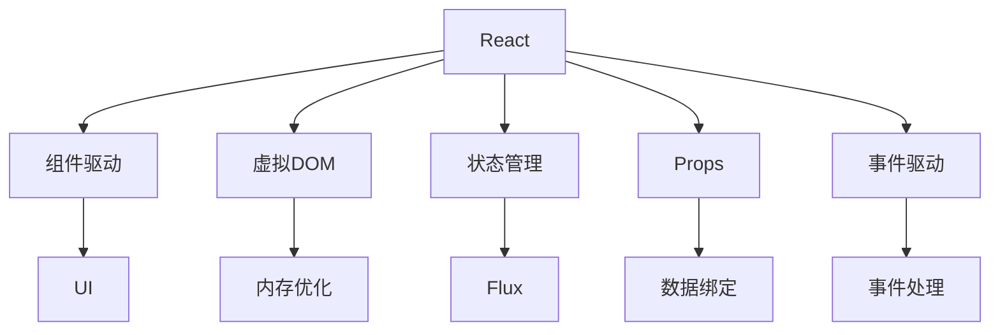
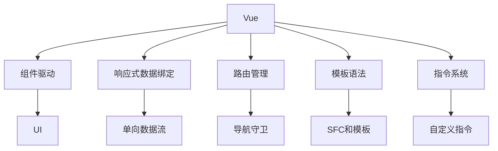
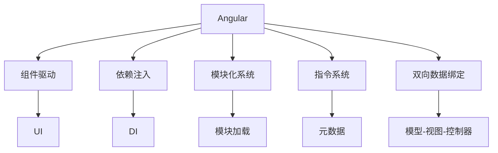

                 

# Web前端技术栈：React、Vue和Angular的比较

> 关键词：Web前端技术栈, React, Vue, Angular, 前端框架对比

## 1. 背景介绍

在Web前端开发领域，三大主流框架React、Vue和Angular各具特色，分别在企业级应用、快速原型开发和跨平台开发方面具有独特的优势。本文将从背景、特点、优缺点等多个维度，全面比较这三大框架，帮助开发者做出明智的选择，进一步提升Web前端开发的效率和质量。

## 2. 核心概念与联系

### 2.1 核心概念概述

Web前端技术栈指的是一组用于构建Web应用的框架、库和工具。常见的技术栈包括Angular、Vue和React等。这些框架各自具备不同的特点和优势，可用于不同的项目需求。

- **React**：由Facebook开发，是一款开源的JavaScript库，用于构建用户界面。它通过组件化的方式将UI拆分为独立的模块，提高了开发效率和代码可复用性。
- **Vue**：是一款渐进式的JavaScript框架，强调灵活性和易用性。它提供了一套完整的生态系统，包括组件、路由、状态管理等。
- **Angular**：由Google开发，是一款成熟的Web应用框架，支持全栈开发。它具有强大的功能性和稳定性，适合大型企业级应用。

### 2.2 核心概念原理和架构的 Mermaid 流程图







以上Mermaid流程图展示了React、Vue和Angular的核心架构和组件关系。React采用组件驱动和虚拟DOM，通过组件复用和状态管理提升开发效率。Vue强调响应式数据绑定和单向数据流，提供了更为灵活的开发方式。Angular则采用依赖注入和双向数据绑定，构建了强大的应用架构。

## 3. 核心算法原理 & 具体操作步骤

### 3.1 算法原理概述

**React**：采用虚拟DOM算法，通过比较前后两次的DOM差异，减少实际DOM的操作次数，提高了性能。React还引入了JSX语法，将JavaScript和HTML结合，使组件编写更加直观。

**Vue**：采用响应式数据绑定算法，通过监听数据变化，动态更新UI。Vue的响应式系统基于观察者模式，数据的变化会即时更新到UI上，提高了开发效率和用户体验。

**Angular**：采用双向数据绑定算法，通过数据变化自动更新UI，UI变化也能自动更新数据，提高了开发效率。Angular还引入了依赖注入和模块化系统，支持复杂应用架构的构建。

### 3.2 算法步骤详解

**React**：
1. 创建React组件，通过JSX语法编写UI代码。
2. 定义组件状态，并使用状态管理工具如Redux或Mobx。
3. 使用ReactDOM库将组件渲染到页面上。
4. 监听用户事件，更新组件状态并重新渲染。

**Vue**：
1. 创建Vue组件，通过模板语法编写UI代码。
2. 定义组件数据和计算属性，并使用响应式系统进行数据绑定。
3. 使用Vue Router进行路由管理，实现单页应用(SPA)。
4. 监听用户事件，更新数据并触发响应式系统的更新。

**Angular**：
1. 创建Angular模块，并定义组件和指令。
2. 使用依赖注入机制进行模块间通信。
3. 使用Angular Router进行路由管理，实现单页应用(SPA)。
4. 定义组件数据和事件处理函数，实现双向数据绑定。

### 3.3 算法优缺点

**React**：
- 优点：组件化开发，易于维护和复用；虚拟DOM提高性能；JSX语法直观易写。
- 缺点：学习曲线较陡；单向数据流，灵活性较差；状态管理需要额外工具。

**Vue**：
- 优点：响应式系统，数据绑定自动更新；灵活的组件和插件生态；轻量级，易于上手。
- 缺点：单向数据流，复杂应用性能较React略低；路由和状态管理依赖外部库。

**Angular**：
- 优点：完整的MVC架构，适合复杂应用；双向数据绑定，逻辑清晰；依赖注入，组件模块化。
- 缺点：体积较大，学习曲线较陡；模板语法复杂，灵活性较Vue略低。

### 3.4 算法应用领域

**React**：适用于快速原型开发、移动应用、Web应用，特别是需要频繁数据更新的场景。React在电子商务、社交媒体等需要高实时性的应用中表现出色。

**Vue**：适用于快速原型开发、单页应用、中小型Web应用。Vue的灵活性和易用性使其成为前端开发者快速开发中小型项目的理想选择。

**Angular**：适用于企业级应用、大型Web应用、跨平台应用。Angular在大型系统架构、跨平台应用和全栈开发中表现突出。

## 4. 数学模型和公式 & 详细讲解 & 举例说明

由于本文讨论的是前端框架，涉及的数学模型和公式较少，主要关注框架本身的结构和特点。我们简单介绍React、Vue和Angular的架构特点。

### 4.1 数学模型构建

**React**：采用虚拟DOM和单向数据流模型，通过比较前后DOM差异，优化性能。

**Vue**：采用响应式数据绑定和单向数据流模型，通过监听数据变化，自动更新UI。

**Angular**：采用双向数据绑定和依赖注入模型，通过数据变化自动更新UI，并支持复杂的模块化系统。

### 4.2 公式推导过程

由于前端框架主要关注UI渲染和状态管理，这些过程大多通过JavaScript实现，而非数学公式。我们重点介绍React的虚拟DOM算法：

假设DOM树有N个节点，操作x次，虚拟DOM操作为y次，实际DOM操作为z次，则有：

$$
z = O(N^2) \\
y = O(N) \\
x = O(y) = O(N) \\
z \leq O(N^2) = O(y)
$$

上述公式表明，通过虚拟DOM算法，实际DOM操作的次数得到了显著减少，提高了性能。

### 4.3 案例分析与讲解

以一个简单的Todo应用为例，展示React和Vue的实现过程。

**React**：
1. 创建React组件`TodoItem`：
```javascript
class TodoItem extends React.Component {
  handleClick() {
    this.props.onToggle(this.props.id);
  }
  render() {
    return <div onClick={this.handleClick}>{this.props.text}</div>;
  }
}
```
2. 定义应用状态：
```javascript
class TodoApp extends React.Component {
  state = {
    todos: [],
    filter: ''
  };
  handleToggle = id => {
    // 更新状态
  };
  handleFilterChange = e => {
    // 更新状态
  };
  render() {
    // 渲染TodoItem
  }
}
```
3. 渲染应用：
```javascript
ReactDOM.render(<TodoApp />, document.getElementById('root'));
```

**Vue**：
1. 创建Vue组件`TodoItem`：
```html
<template>
  <div @click="handleClick">
    {{ text }}
  </div>
</template>
<script>
export default {
  props: {
    id: String,
    text: String
  },
  methods: {
    handleClick() {
      this.$emit('toggle', this.id);
    }
  }
}
</script>
```
2. 定义应用状态：
```html
<template>
  <input v-model="filter" @input="handleFilterChange" placeholder="Filter">
  <ul>
    <li v-for="todo in filteredTodos" :key="todo.id">
      <todo-item :id="todo.id" :text="todo.text" @toggle="handleToggle"></todo-item>
    </li>
  </ul>
</template>
<script>
import TodoItem from './TodoItem.vue';

export default {
  components: {
    TodoItem
  },
  data() {
    return {
      todos: [],
      filter: ''
    };
  },
  methods: {
    handleToggle(id) {
      // 更新状态
    },
    handleFilterChange(e) {
      // 更新状态
    },
    getFilteredTodos() {
      // 过滤Todo
    }
  }
};
</script>
```
3. 渲染应用：
```javascript
const app = new Vue({
  el: '#app',
  render: h => h(App)
});
```

## 5. 项目实践：代码实例和详细解释说明

### 5.1 开发环境搭建

本文以Node.js和Webpack为开发环境，进行React、Vue和Angular的开发实践。

**React**：
```bash
npm install create-react-app
npx create-react-app todo-app
cd todo-app
npm start
```

**Vue**：
```bash
npm install vue-cli
vue create todo-app
cd todo-app
npm run serve
```

**Angular**：
```bash
npm install -g @angular/cli
ng new todo-app
cd todo-app
ng serve
```

### 5.2 源代码详细实现

**React**：
```javascript
import React from 'react';
import ReactDOM from 'react-dom';

class TodoItem extends React.Component {
  handleClick() {
    this.props.onToggle(this.props.id);
  }
  render() {
    return <div onClick={this.handleClick}>{this.props.text}</div>;
  }
}

class TodoApp extends React.Component {
  state = {
    todos: [],
    filter: ''
  };
  handleToggle = id => {
    this.setState(state => ({ todos: state.todos.map(todo => todo.id === id ? { ...todo, completed: !todo.completed } : todo }));
  };
  handleFilterChange = e => {
    this.setState({ filter: e.target.value });
  };
  render() {
    const filteredTodos = this.state.todos.filter(todo => todo.text.includes(this.state.filter));
    return (
      <div>
        <input value={this.state.filter} onChange={this.handleFilterChange} placeholder="Filter" />
        <ul>
          {filteredTodos.map(todo => <TodoItem key={todo.id} id={todo.id} text={todo.text} onToggle={this.handleToggle} completed={todo.completed} />)}
        </ul>
      </div>
    );
  }
}

ReactDOM.render(<TodoApp />, document.getElementById('root'));
```

**Vue**：
```html
<template>
  <input v-model="filter" @input="handleFilterChange" placeholder="Filter">
  <ul>
    <li v-for="todo in filteredTodos" :key="todo.id">
      <todo-item :id="todo.id" :text="todo.text" @toggle="handleToggle"></todo-item>
    </li>
  </ul>
</template>
<script>
import TodoItem from './TodoItem.vue';

export default {
  components: {
    TodoItem
  },
  data() {
    return {
      todos: [],
      filter: ''
    };
  },
  methods: {
    handleToggle(id) {
      this.todos = this.todos.map(todo => todo.id === id ? { ...todo, completed: !todo.completed } : todo);
    },
    handleFilterChange(e) {
      this.filter = e.target.value;
    },
    getFilteredTodos() {
      return this.todos.filter(todo => todo.text.includes(this.filter));
    }
  }
};
</script>
```

**Angular**：
```typescript
import { Component } from '@angular/core';

@Component({
  selector: 'todo-item',
  template: `
    <div (click)="handleClick()">
      {{ text }}
    </div>
  `,
  style: ['color: blue;']
})
export class TodoItemComponent {
  id: string;
  text: string;
  completed: boolean;
  onToggle: Function;

  handleClick() {
    this.onToggle(this.id);
  }
}

@Component({
  selector: 'app-root',
  template: `
    <input (input)="handleFilterChange($event.target.value)" [placeholder]="filter" />
    <ul>
      <li *ngFor="let todo of filteredTodos; let i = index">
        <todo-item [id]="todo.id" [text]="todo.text" (toggle)="handleToggle(todo.id)" [completed]="todo.completed"></todo-item>
      </li>
    </ul>
  `,
  style: ['color: blue;']
})
export class AppComponent {
  todos: TodoItem[] = [];
  filter: string = '';

  handleToggle(id: string) {
    this.todos = this.todos.map(todo => todo.id === id ? { ...todo, completed: !todo.completed } : todo);
  }

  handleFilterChange(filter: string) {
    this.filter = filter;
  }

  get filteredTodos() {
    return this.todos.filter(todo => todo.text.includes(this.filter));
  }
}

@NgModule({
  declarations: [
    AppComponent,
    TodoItemComponent
  ],
  imports: [
    BrowserModule
  ],
  providers: [],
  bootstrap: [AppComponent]
})
export class AppModule { }
```

### 5.3 代码解读与分析

**React**：
- 使用React组件化开发，将UI和逻辑分离，提高代码复用性。
- 通过状态管理工具Redux或Mobx，实现组件间的数据共享和状态管理。
- 使用ReactDOM库将组件渲染到页面上，通过虚拟DOM优化性能。

**Vue**：
- 使用Vue的响应式系统，通过计算属性和事件监听，自动更新UI。
- 使用Vue Router进行路由管理，实现单页应用。
- 使用指令系统和组件生态，灵活扩展功能。

**Angular**：
- 使用Angular的依赖注入和双向数据绑定，实现模块化和组件化开发。
- 使用Angular Router进行路由管理，实现单页应用。
- 使用指令系统和服务，扩展应用功能。

### 5.4 运行结果展示

**React**：
- 控制台输出Todo状态变化。
- 界面展示Todo列表，支持点击切换Todo状态和文本过滤。

**Vue**：
- 控制台输出Todo状态变化。
- 界面展示Todo列表，支持点击切换Todo状态和文本过滤。

**Angular**：
- 控制台输出Todo状态变化。
- 界面展示Todo列表，支持点击切换Todo状态和文本过滤。

## 6. 实际应用场景

### 6.1 智能客服系统

在智能客服系统中，React、Vue和Angular都可用于构建交互式、响应迅速的前端页面。通过UI组件化和状态管理，可以快速开发客服对话界面，提升用户体验。

### 6.2 金融平台

在金融平台中，Angular的全栈开发能力可以提供更加可靠的应用架构。React和Vue的响应式数据绑定也适用于处理复杂的数据交互和实时更新。

### 6.3 电商应用

在电商应用中，Vue的灵活性和易用性使其成为快速原型开发和中小型项目的理想选择。React在大型电商平台上表现出色，支持高实时性和复杂的数据操作。

### 6.4 未来应用展望

未来，Web前端技术栈将进一步融合，出现更多的跨框架解决方案。React、Vue和Angular的互通性将增强，开发者可以更灵活地选择和使用这些框架。

## 7. 工具和资源推荐

### 7.1 学习资源推荐

**React**：
- 官方文档：[React官网](https://reactjs.org/docs/getting-started.html)
- 入门书籍：《React权威指南》

**Vue**：
- 官方文档：[Vue官网](https://vuejs.org/v2/guide/)
- 入门书籍：《Vue.js实战》

**Angular**：
- 官方文档：[Angular官网](https://angular.io/)
- 入门书籍：《Angular实战》

### 7.2 开发工具推荐

**React**：
- React：[React官网](https://reactjs.org/)
- Redux：[Redux官网](https://redux.js.org/)

**Vue**：
- Vue：[Vue官网](https://vuejs.org/)
- Vuex：[Vuex官网](https://vuex.vuejs.org/)

**Angular**：
- Angular：[Angular官网](https://angular.io/)
- NgRx：[NgRx官网](https://ngRx.io/)

### 7.3 相关论文推荐

**React**：
- "React: A JavaScript Library for Building User Interfaces" (Facebook)
- "React: A Virtual DOM and Text-Based Reconciliation Algorithm for Fast Updates" (Facebook)

**Vue**：
- "Vue: Progressive JavaScript Framework" (Evan You)
- "Vue Router: A router for Vue.js" (Evan You)

**Angular**：
- "Angular: A complete toolkit for building complex web applications" (Google)
- "Angular 2 Style Guide" (Google)

## 8. 总结：未来发展趋势与挑战

### 8.1 研究成果总结

本文对比了React、Vue和Angular三大前端框架，讨论了它们的优缺点、应用领域及开发实践。

### 8.2 未来发展趋势

未来前端技术栈将继续发展，出现更多跨框架解决方案，提升开发效率和用户体验。React、Vue和Angular的互通性将增强，开发者可以更灵活地选择和使用这些框架。

### 8.3 面临的挑战

前端技术栈的选择和应用仍面临挑战，如学习曲线、性能优化、跨平台兼容性等。如何克服这些挑战，需要开发者的持续探索和创新。

### 8.4 研究展望

未来前端技术栈的研究将关注以下方向：
- 提升性能和用户体验，优化开发效率。
- 探索跨框架解决方案，提升代码复用性。
- 引入更多现代前端技术，如TypeScript、Webpack等。
- 强化跨平台开发，支持移动端和桌面端应用。

## 9. 附录：常见问题与解答

**Q1: React和Vue哪一个更适合Web应用？**

A: 这取决于项目的具体需求和开发者的经验。React更适合处理复杂的数据操作和高实时性的应用，如电商、社交媒体等。Vue则适用于快速原型开发和中小型项目，具有易用性和灵活性。

**Q2: Angular和React哪个更好？**

A: Angular适合大型企业级应用和全栈开发，具有强大的功能和稳定性。React适合快速原型开发和中小型项目，具有灵活性和高扩展性。

**Q3: 如何使用React、Vue和Angular进行跨平台开发？**

A: React Native、Vue Native和Angular Native是常用的跨平台开发框架，可以将Web应用转换为原生应用，支持iOS和Android等平台。

**Q4: 如何提高React、Vue和Angular的性能？**

A: 使用虚拟DOM和单向数据流，优化DOM操作和渲染效率。使用代码分割和懒加载，减少初始加载时间。使用性能分析工具，如React Profiler、Vue Devtools等，进行性能优化。

---

作者：禅与计算机程序设计艺术 / Zen and the Art of Computer Programming

