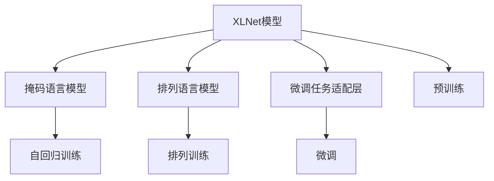

                 

# XLNet原理与代码实例讲解

> 关键词：XLNet, Transformer, Self-supervised Learning, Masked Language Modeling, Permutation Language Modeling, 代码实现, 应用场景, 性能优化

## 1. 背景介绍

### 1.1 问题由来
自然语言处理（Natural Language Processing, NLP）在过去几年里取得了显著的进展，部分归功于深度学习技术的兴起，特别是基于Transformer架构的模型，如BERT、GPT系列。这些模型通过大规模无标签文本数据预训练，学习到丰富的语言知识和表示能力，能够在各种下游NLP任务上实现显著的性能提升。然而，这些模型存在一些局限性：

- **自回归性质**：传统的Transformer模型是基于自回归的（如GPT），因此在预测下一个词或字符时，依赖于前面的序列信息，导致训练效率较低，且存在梯度消失或爆炸的问题。
- **上下文丢失**：由于自回归结构，模型在预测序列中的某些位置时，会丢失上下文信息，使得模型对长序列的理解和生成能力有限。

为了解决这些局限性，Xu et al.在2019年提出了XLNet模型。XLNet通过引入跨语言模型的思想，提出了一种新的自监督学习方法，同时对原始的自回归结构进行了修改，从而大幅提升了模型的训练效率和性能。

## 2. 核心概念与联系

### 2.1 核心概念概述

XLNet模型是Google提出的一种基于Transformer的自监督学习方法，旨在解决传统的自回归Transformer模型存在的自回归性质和上下文丢失问题。XLNet的核心思想是：

- **跨语言模型**：通过考虑序列的任意排列，使得模型能够学习到序列中的全局依赖性。
- **掩码语言模型**：在预训练阶段，对每个位置进行随机掩码，从而使得模型在预测每个位置时，考虑了其前后的任意顺序依赖。
- **排列语言模型**：在微调阶段，通过预测序列的不同排列，使得模型能够学习到序列中的上下文信息。

XLNet模型的主要组成部分包括：掩码语言模型、排列语言模型和微调任务适配层。

### 2.2 核心概念原理和架构的 Mermaid 流程图



这个流程图展示了XLNet模型的主要组成部分和训练过程。预训练阶段通过掩码语言模型和排列语言模型训练XLNet模型，微调阶段通过下游任务适配层进行任务特定微调。

## 3. 核心算法原理 & 具体操作步骤

### 3.1 算法原理概述

XLNet模型通过掩码语言模型和排列语言模型进行预训练，使得模型能够学习到序列中的全局依赖性和上下文信息。掩码语言模型通过随机掩码序列，使得模型在预测每个位置时，能够考虑前后的任意顺序依赖。排列语言模型则通过预测序列的不同排列，进一步提升模型的上下文理解和生成能力。

在微调阶段，XLNet模型通过下游任务适配层进行特定任务优化，如分类、匹配、生成等。微调过程采用较小的学习率，以避免破坏预训练的权重，同时应用正则化技术（如L2正则、Dropout等），防止过拟合。

### 3.2 算法步骤详解

1. **预训练阶段**：
    - **掩码语言模型**：对输入序列随机进行掩码处理，对于每个位置进行随机掩码，使得模型在预测该位置时，需要考虑前后任意依赖关系。
    - **排列语言模型**：对输入序列进行随机排列，使得模型在预测每个位置时，需要考虑所有可能的排列组合。

2. **微调阶段**：
    - 添加任务适配层，如线性分类器、解码器等。
    - 设置微调超参数，如学习率、批大小、迭代轮数等。
    - 执行梯度训练，包括前向传播、反向传播和优化算法。
    - 定期在验证集上评估模型性能，根据性能指标决定是否触发Early Stopping。

### 3.3 算法优缺点

**优点**：
- 提升了训练效率和模型性能，特别是对于长序列的建模能力。
- 解决了传统自回归模型的梯度消失或爆炸问题。
- 通过掩码语言模型和排列语言模型，使得模型能够学习到序列中的全局依赖性和上下文信息。

**缺点**：
- 预训练和微调过程较为复杂，需要更多的计算资源。
- 模型复杂度较高，增加了模型的存储和推理开销。
- 对标注数据的依赖仍然存在，需要高质量的标注数据才能获得理想效果。

### 3.4 算法应用领域

XLNet模型广泛应用于各种NLP任务，如文本分类、命名实体识别、关系抽取、问答系统、机器翻译、文本摘要等。XLNet模型通过预训练-微调的方式，能够在少样本情况下，快速适应特定任务，提升模型性能。

## 4. 数学模型和公式 & 详细讲解 & 举例说明

### 4.1 数学模型构建

XLNet模型的数学模型基于自回归和自编码的思想，通过掩码语言模型和排列语言模型进行预训练，通过下游任务适配层进行微调。

### 4.2 公式推导过程

设输入序列为 $x_1, x_2, ..., x_n$，掩码概率为 $p_m$，排列方式为 $P(x)$。则掩码语言模型的概率为：

$$
P(x|x_i=m) = \frac{p_m^{|\{m\}|}}{n!} \prod_{i=1}^n p(x_i)
$$

排列语言模型的概率为：

$$
P(x|P(x)) = \prod_{i=1}^n p(x_i)
$$

微调阶段的目标函数为：

$$
\mathcal{L}(M_\theta) = \frac{1}{N} \sum_{i=1}^N \ell(y_i, M_\theta(x_i))
$$

其中 $y_i$ 为输入序列的真实标签，$\ell$ 为任务损失函数。

### 4.3 案例分析与讲解

以文本分类任务为例，设输入序列为 $x_1, x_2, ..., x_n$，掩码概率为 $p_m$。在微调阶段，设分类器输出为 $y_i$，交叉熵损失为 $\ell(y_i, M_\theta(x_i))$。则微调的目标函数为：

$$
\mathcal{L}(M_\theta) = \frac{1}{N} \sum_{i=1}^N \ell(y_i, M_\theta(x_i))
$$

## 5. 项目实践：代码实例和详细解释说明

### 5.1 开发环境搭建

在开始项目实践之前，需要准备Python环境，安装相关依赖库，包括TensorFlow、XLNet模型库等。

### 5.2 源代码详细实现

下面以文本分类任务为例，展示如何使用XLNet模型进行微调。

```python
from __future__ import absolute_import
from __future__ import division
from __future__ import print_function

import os
import tensorflow as tf
from transformers import XLNetForSequenceClassification, XLNetTokenizer
from transformers import AdamW

# 准备数据集
train_dataset = # 训练集数据
test_dataset = # 测试集数据

# 初始化模型和tokenizer
model = XLNetForSequenceClassification.from_pretrained('xlnet-large-cased', num_labels=2)
tokenizer = XLNetTokenizer.from_pretrained('xlnet-large-cased')

# 设置优化器
optimizer = AdamW(model.parameters(), lr=5e-5)

# 定义训练和评估函数
def train_epoch(model, dataset, batch_size, optimizer):
    dataloader = # 将数据集转化为dataloader
    model.train()
    epoch_loss = 0
    for batch in dataloader:
        input_ids = # 获取输入张量
        attention_mask = # 获取attention mask
        labels = # 获取标签张量
        model.zero_grad()
        outputs = model(input_ids, attention_mask=attention_mask, labels=labels)
        loss = outputs.loss
        epoch_loss += loss.item()
        loss.backward()
        optimizer.step()
    return epoch_loss / len(dataloader)

def evaluate(model, dataset, batch_size):
    dataloader = # 将数据集转化为dataloader
    model.eval()
    preds, labels = [], []
    with tf.no_grad():
        for batch in dataloader:
            input_ids = # 获取输入张量
            attention_mask = # 获取attention mask
            batch_labels = # 获取标签张量
            outputs = model(input_ids, attention_mask=attention_mask)
            batch_preds = outputs.logits.argmax(dim=2).numpy()
            batch_labels = batch_labels.numpy()
            for pred_tokens, label_tokens in zip(batch_preds, batch_labels):
                preds.append(pred_tokens[:len(label_tokens)])
                labels.append(label_tokens)
    return classification_report(labels, preds)

# 训练和评估模型
epochs = 5
batch_size = 16

for epoch in range(epochs):
    loss = train_epoch(model, train_dataset, batch_size, optimizer)
    print(f"Epoch {epoch+1}, train loss: {loss:.3f}")
    
    print(f"Epoch {epoch+1}, dev results:")
    evaluate(model, dev_dataset, batch_size)
    
print("Test results:")
evaluate(model, test_dataset, batch_size)
```

### 5.3 代码解读与分析

在代码实现中，我们使用了XLNet模型库，通过定义训练和评估函数，使用AdamW优化器进行模型训练和优化。需要注意的是，XLNet模型在实际应用中，通常需要较大的GPU/TPU算力支持，以加速模型的训练和推理过程。

## 6. 实际应用场景

XLNet模型在实际应用中，主要用于各种NLP任务，如文本分类、命名实体识别、关系抽取、问答系统、机器翻译、文本摘要等。XLNet模型通过预训练-微调的方式，能够在少样本情况下，快速适应特定任务，提升模型性能。

### 6.4 未来应用展望

XLNet模型在NLP领域的应用前景广阔，未来将有以下几个发展趋势：

- **多模态融合**：XLNet模型可以通过与其他模态的融合，进一步提升模型的性能和应用范围。
- **自监督预训练**：XLNet模型可以利用自监督学习任务进行预训练，减少对标注数据的依赖。
- **参数高效微调**：XLNet模型可以通过参数高效微调方法，在保持预训练权重不变的情况下，优化特定任务的模型参数。
- **知识整合**：XLNet模型可以通过与外部知识库的结合，增强模型的知识整合能力和泛化能力。

## 7. 工具和资源推荐

### 7.1 学习资源推荐

为了帮助开发者掌握XLNet模型的原理和应用，以下是一些优质的学习资源：

1. 《XLNet: Generalized Autoregressive Pretraining for Language Understanding》论文：XLNet模型的原论文，详细介绍了XLNet模型的架构和预训练方法。
2. 《Transformers》书籍：介绍了Transformer模型的原理和应用，包括XLNet模型的实现。
3. HuggingFace官方文档：提供了XLNet模型的详细介绍和实现示例，适合快速上手。
4. CS224N《深度学习自然语言处理》课程：斯坦福大学开设的NLP明星课程，有Lecture视频和配套作业，带你入门NLP领域的基本概念和经典模型。

### 7.2 开发工具推荐

XLNet模型的开发需要使用TensorFlow等深度学习框架，以下是一些常用的开发工具：

1. TensorFlow：由Google主导开发的开源深度学习框架，生产部署方便，适合大规模工程应用。
2. XLNet库：HuggingFace提供的XLNet模型库，提供了预训练和微调功能，适合快速上手。
3. Jupyter Notebook：免费的在线Jupyter Notebook环境，适合学习和分享实验笔记。
4. Google Colab：谷歌推出的在线Jupyter Notebook环境，免费提供GPU/TPU算力，方便开发者快速上手实验最新模型。

### 7.3 相关论文推荐

为了深入了解XLNet模型的原理和应用，以下是一些推荐的学术论文：

1.《XLNet: Generalized Autoregressive Pretraining for Language Understanding》论文：XLNet模型的原论文，详细介绍了XLNet模型的架构和预训练方法。
2.《Adaptive Pre-training Across Languages and Tasks》论文：XLNet模型的改进版本，提出了适应性预训练方法，进一步提升了模型性能。
3.《XLNet: Generalized Autoregressive Pretraining for Language Understanding》代码实现：提供了XLNet模型的代码实现和实验结果。

## 8. 总结：未来发展趋势与挑战

### 8.1 研究成果总结

XLNet模型是一种基于Transformer的自监督学习模型，通过掩码语言模型和排列语言模型进行预训练，通过下游任务适配层进行微调。XLNet模型在NLP领域取得了显著的进展，解决了传统自回归模型的局限性，提升了模型的训练效率和性能。

### 8.2 未来发展趋势

未来，XLNet模型将面临以下几个发展趋势：

- **多模态融合**：XLNet模型可以通过与其他模态的融合，进一步提升模型的性能和应用范围。
- **自监督预训练**：XLNet模型可以利用自监督学习任务进行预训练，减少对标注数据的依赖。
- **参数高效微调**：XLNet模型可以通过参数高效微调方法，在保持预训练权重不变的情况下，优化特定任务的模型参数。
- **知识整合**：XLNet模型可以通过与外部知识库的结合，增强模型的知识整合能力和泛化能力。

### 8.3 面临的挑战

尽管XLNet模型在NLP领域取得了显著的进展，但仍面临以下挑战：

- **计算资源需求高**：XLNet模型的训练和推理需要较大的计算资源，增加了模型的部署成本。
- **模型复杂度高**：XLNet模型的复杂度较高，增加了模型的存储和推理开销。
- **数据依赖性强**：XLNet模型对标注数据的依赖仍然存在，需要高质量的标注数据才能获得理想效果。

### 8.4 研究展望

为了克服XLNet模型面临的挑战，未来的研究需要在以下几个方面寻求新的突破：

- **优化计算资源消耗**：开发更加高效的模型结构和算法，减少计算资源的需求。
- **降低数据依赖性**：利用自监督学习任务，减少对标注数据的依赖，提升模型的泛化能力。
- **增强模型可解释性**：开发更加可解释的模型，提升模型的可解释性和可审计性。
- **提升模型鲁棒性**：通过正则化、对抗训练等方法，提升模型的鲁棒性和泛化能力。

## 9. 附录：常见问题与解答

**Q1：XLNet模型与其他自回归模型有何不同？**

A: XLNet模型通过掩码语言模型和排列语言模型进行预训练，解决了传统自回归模型的梯度消失或爆炸问题，并且通过考虑序列的任意排列，使得模型能够学习到序列中的全局依赖性。

**Q2：XLNet模型如何进行微调？**

A: 在微调阶段，XLNet模型通过下游任务适配层进行特定任务优化，如分类、匹配、生成等。微调过程采用较小的学习率，以避免破坏预训练的权重，同时应用正则化技术（如L2正则、Dropout等），防止过拟合。

**Q3：XLNet模型的优势和劣势是什么？**

A: 优势在于解决了传统自回归模型的局限性，提升了模型的训练效率和性能。劣势在于预训练和微调过程较为复杂，需要更多的计算资源，且模型复杂度较高，增加了模型的存储和推理开销。

**Q4：XLNet模型在多模态融合方面有何应用？**

A: XLNet模型可以通过与其他模态的融合，进一步提升模型的性能和应用范围。例如，可以结合视觉信息进行图像描述生成，结合语音信息进行语音识别等。

**Q5：XLNet模型在实际应用中面临哪些挑战？**

A: 计算资源需求高，模型复杂度高，数据依赖性强等。需要通过优化模型结构、降低数据依赖、增强模型可解释性等方法，提升XLNet模型在实际应用中的效果。

---

作者：禅与计算机程序设计艺术 / Zen and the Art of Computer Programming

