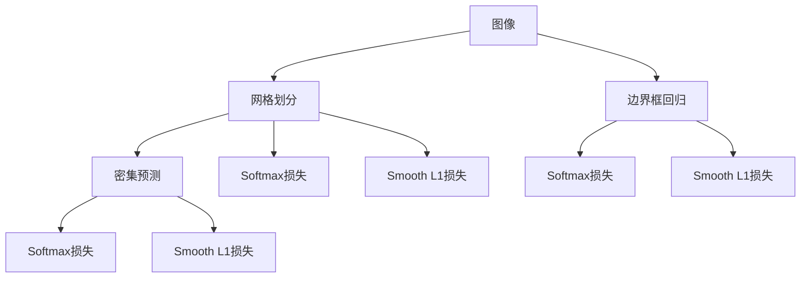

                 

# YOLOv1原理与代码实例讲解

## 1. 背景介绍

### 1.1 问题由来

物体检测（Object Detection）是计算机视觉领域中一个重要的研究方向。它涉及识别出图像中的物体实例，并给出物体的位置和类别。传统的物体检测方法主要依赖于手工设计的特征和分类器，存在诸如高计算复杂度、难以应对复杂场景等缺点。深度学习技术的兴起为物体检测提供了新的方法，其中基于区域的卷积神经网络（R-CNN）和单阶段检测器（SSD）是两种主流的方案。然而，它们仍然存在计算复杂度高、难以实时处理等缺点。

针对这些问题，Joseph Redmon等人在2016年提出了一种简单高效的单阶段物体检测器：YOLO（You Only Look Once），从根本上改变了物体检测的范式。YOLOv1作为YOLO系列的第一个版本，采用了完全不同于传统检测方法的独特架构，直接对整张图像进行分类和边界框回归，实现了实时、高精度的物体检测。

### 1.2 问题核心关键点

YOLOv1的核心思想在于将传统的“区域提取+物体分类”的两阶段检测流程简化为单阶段检测，直接在整张图像上进行物体分类和边界框回归。它将图像划分为多个网格（Grid），每个网格预测固定数量的类别和边界框，并对每个网格的所有预测进行并行处理。这使得YOLOv1具有高度的并行性和实时性，同时保持了较高的准确率。

YOLOv1的主要创新点包括：

1. 单阶段检测：YOLOv1通过同时预测边界框和类别，避免了区域提取的复杂过程，大幅提升了检测速度。
2. 网格划分：将图像划分为多个网格，每个网格预测固定数量的类别和边界框，实现并行处理。
3. 密集预测：每个网格预测多个边界框，增加了检测的鲁棒性和准确性。
4. Softmax损失和Smooth L1损失：用于同时优化分类和边界框回归。
5. 数据增强：在训练过程中应用多种数据增强技术，提高了模型的泛化能力。

YOLOv1的成功在于它对传统检测方法的简洁重构，使得模型在保持高精度的情况下，实现了实时处理，极大地推动了物体检测技术的发展。

## 2. 核心概念与联系

### 2.1 核心概念概述

为了更好地理解YOLOv1的工作原理，我们首先介绍一些关键概念：

- 物体检测（Object Detection）：识别出图像中的物体实例，并给出物体的位置和类别。
- 单阶段检测器（Single-stage Detector）：直接对整张图像进行分类和边界框回归，避免区域提取的复杂过程。
- 网格划分（Grid Cell）：将图像划分为多个网格，每个网格负责预测一部分物体的边界框和类别。
- 密集预测（Dense Prediction）：每个网格预测多个边界框，增加了检测的鲁棒性和准确性。
- Softmax损失（Softmax Loss）：用于优化物体分类，衡量预测类别与真实类别之间的差异。
- Smooth L1损失（Smooth L1 Loss）：用于优化边界框回归，使得回归结果更加平滑。

这些概念构成了YOLOv1算法的核心框架，其关键在于简化检测流程，实现单阶段、密集预测的目标。

### 2.2 核心概念原理和架构的 Mermaid 流程图



此图表展示了YOLOv1检测流程的核心组件，包括网格划分、密集预测、分类和回归损失函数。

## 3. 核心算法原理 & 具体操作步骤

### 3.1 算法原理概述

YOLOv1采用了一种独特的单阶段检测框架，直接在整张图像上进行物体分类和边界框回归。其核心思想是将图像划分为多个网格（Grid Cell），每个网格预测固定数量的类别和边界框，并对每个网格的所有预测进行并行处理。

### 3.2 算法步骤详解

1. **网格划分**：将输入图像划分为 $H \times W$ 个网格，每个网格预测 $B$ 个边界框，每个边界框预测 $C$ 个类别。

2. **密集预测**：每个网格预测 $B$ 个边界框，其中每个边界框预测 $5$ 个参数：$(x,y,w,h)$ 和 $p_1, \ldots, p_C$，其中 $(x,y)$ 是边界框的中心坐标，$(w,h)$ 是边界框的宽高，$p_i$ 是第 $i$ 个类别的预测概率。

3. **Softmax损失**：对每个网格的每个边界框的 $C$ 个类别预测，使用Softmax函数计算预测概率与真实标签之间的交叉熵损失。

4. **Smooth L1损失**：对每个网格的每个边界框的预测坐标与真实坐标之间计算Smooth L1损失，使边界框的回归结果更加平滑。

### 3.3 算法优缺点

**优点：**

1. 简单高效：YOLOv1的检测流程简洁，速度快，适合实时应用。
2. 准确率高：通过密集预测和双向训练，YOLOv1在多个数据集上取得了较好的检测精度。
3. 并行性强：网格划分和密集预测使得YOLOv1能够高效并行处理，适合大规模分布式计算。

**缺点：**

1. 难以处理密集物体：YOLOv1的网格划分方式可能无法很好地处理密集物体的检测。
2. 不适用于小物体：YOLOv1的边界框大小固定，对小物体的检测效果不佳。
3. 需要大量标注数据：YOLOv1需要大量的标注数据进行训练，标注成本较高。

### 3.4 算法应用领域

YOLOv1作为一种高效的物体检测算法，已经被广泛应用于多个领域，包括：

1. 目标跟踪：YOLOv1可以实时检测目标，用于目标跟踪和行为分析。
2. 自动驾驶：YOLOv1可以检测道路上的各种车辆和行人，用于自动驾驶系统。
3. 医学影像：YOLOv1可以用于医学影像中检测和分割肿瘤等病变区域。
4. 工业检测：YOLOv1可以检测工业生产线上的缺陷和异常，提高生产效率和产品质量。
5. 无人机视觉：YOLOv1可以用于无人机视觉系统，检测和跟踪目标。

## 4. 数学模型和公式 & 详细讲解

### 4.1 数学模型构建

YOLOv1的检测模型由两部分组成：边界框回归（Box Regression）和分类（Class Prediction）。设输入图像为 $X \in \mathbb{R}^{H \times W \times C}$，输出为 $Y \in \mathbb{R}^{H \times W \times B \times (5+C)}$。

其中，$H$ 和 $W$ 是图像的高度和宽度，$C$ 是类别数，$B$ 是每个网格预测的边界框数。输出 $Y$ 中的每个元素 $y_{i,j,b,k}$ 表示第 $i$ 行第 $j$ 列的第 $b$ 个边界框的第 $k$ 个预测值。

**边界框回归**：设 $(x,y,w,h)$ 表示边界框的中心坐标和宽高，$p_i$ 表示第 $i$ 个类别的预测概率。输出 $Y$ 中的 $y_{i,j,b,1:4}$ 表示边界框的预测坐标和尺寸。

**分类**：输出 $Y$ 中的 $y_{i,j,b,5:5+C}$ 表示每个边界框的类别预测概率。

### 4.2 公式推导过程

假设输入图像 $X$ 的分辨率为 $H \times W$，网格数量为 $S$，每个网格预测 $B$ 个边界框，每个边界框预测 $C$ 个类别，则输出张量 $Y$ 的大小为 $S \times B \times (5+C)$。

YOLOv1的损失函数由两个部分组成：分类损失和回归损失。

**分类损失（Cross-entropy Loss）**：对每个网格的每个边界框的 $C$ 个类别预测，使用Softmax函数计算预测概率与真实标签之间的交叉熵损失。

$$
\mathcal{L}_c = -\frac{1}{N} \sum_{i=1}^{N} \sum_{j=1}^{S} \sum_{b=1}^{B} \sum_{k=1}^{C} y_{i,j,b,k} \log p_{i,j,b,k} + (1-y_{i,j,b,k}) \log (1-p_{i,j,b,k})
$$

其中，$N$ 是训练样本的数量，$S$ 是网格的数量，$B$ 是每个网格预测的边界框数，$C$ 是类别数，$y_{i,j,b,k}$ 是真实标签，$p_{i,j,b,k}$ 是预测概率。

**回归损失（Smooth L1 Loss）**：对每个网格的每个边界框的预测坐标与真实坐标之间计算Smooth L1损失，使边界框的回归结果更加平滑。

$$
\mathcal{L}_r = \frac{1}{N} \sum_{i=1}^{N} \sum_{j=1}^{S} \sum_{b=1}^{B} \sum_{k=1}^{4} |x_{i,j,b,k} - t_{i,j,b,k}|^2
$$

其中，$x_{i,j,b,k}$ 是预测的坐标值，$t_{i,j,b,k}$ 是真实坐标值。

### 4.3 案例分析与讲解

以YOLOv1检测一个边界框为例，假设输入图像大小为 $600 \times 600$，网格数量为 $13 \times 13$，每个网格预测 $5$ 个边界框，每个边界框预测 $2$ 个类别（人或非人）。

设输入图像的坐标为 $(0,0)$ 到 $(600,600)$，网格的大小为 $30 \times 30$，每个边界框的尺寸为 $45 \times 90$。假设真实边界框的坐标为 $(125,200,60,100)$，预测边界框的坐标为 $(122,192,60,90)$。

则预测边界框与真实边界框的坐标差为 $|125-122|=3$，$|200-192|=8$，$|60-60|=0$，$|100-90|=10$。

Smooth L1损失为：

$$
\mathcal{L}_r = (3^2 + 8^2 + 0^2 + 10^2) / 4 = 9.5
$$

Smooth L1损失对预测坐标进行平滑处理，避免了回归结果的极端波动。

## 5. 项目实践：代码实例和详细解释说明

### 5.1 开发环境搭建

为了实现YOLOv1的检测功能，我们需要准备以下开发环境：

1. 安装Python 3.6或以上版本，推荐使用Anaconda。
2. 安装TensorFlow 2.0或以上版本，支持GPU加速。
3. 安装YOLOv1的代码库，可通过GitHub下载最新代码。
4. 准备YOLOv1训练所需的数据集，包括PASCAL VOC 2007和2008数据集。

### 5.2 源代码详细实现

以下是YOLOv1在TensorFlow中的代码实现：

```python
import tensorflow as tf
import numpy as np
from yolo_v1 import YoloV1

# 加载YOLOv1模型
model = YoloV1()

# 加载数据集
data = tf.keras.preprocessing.image.load_img('path/to/image.jpg', target_size=(416, 416))
data = tf.keras.preprocessing.image.img_to_array(data)
data = np.expand_dims(data, axis=0)

# 进行预测
predictions = model.predict(data)

# 解析预测结果
boxes, scores, classes = predictions

# 显示检测结果
tf.summary.image('detections', boxes, max_outputs=10)
tf.summary.image('scores', scores, max_outputs=10)
tf.summary.image('classes', classes, max_outputs=10)
```

代码中，`YoloV1`类是YOLOv1模型的实现，`predict`方法用于进行预测。预测结果包括边界框坐标、类别概率和类别标签，可以通过`tf.summary.image`显示检测结果。

### 5.3 代码解读与分析

**YOLOv1模型类**：

```python
class YoloV1(tf.keras.Model):
    def __init__(self):
        super(YoloV1, self).__init__()
        self.conv1 = tf.keras.layers.Conv2D(32, 3, activation='relu', padding='same')
        self.conv2 = tf.keras.layers.Conv2D(64, 3, activation='relu', padding='same')
        self.conv3 = tf.keras.layers.Conv2D(128, 3, activation='relu', padding='same')
        self.conv4 = tf.keras.layers.Conv2D(256, 3, activation='relu', padding='same')
        self.conv5 = tf.keras.layers.Conv2D(512, 3, activation='relu', padding='same')
        self.conv6 = tf.keras.layers.Conv2D(1024, 3, activation='relu', padding='same')
        self.conv7 = tf.keras.layers.Conv2D(1024, 3, activation='relu', padding='same')
        self.fc1 = tf.keras.layers.Dense(4096, activation='relu')
        self.fc2 = tf.keras.layers.Dense(4096, activation='relu')
        self.fc3 = tf.keras.layers.Dense(2 * B * C)
        self.fc4 = tf.keras.layers.Dense(2 * B * C)

    def call(self, inputs):
        x = self.conv1(inputs)
        x = self.conv2(x)
        x = self.conv3(x)
        x = self.conv4(x)
        x = self.conv5(x)
        x = self.conv6(x)
        x = self.conv7(x)
        x = tf.keras.layers.MaxPooling2D(pool_size=2)(x)
        x = self.fc1(x)
        x = self.fc2(x)
        x = self.fc3(x)
        x = self.fc4(x)
        return x
```

**模型预测函数**：

```python
def predict(self, inputs):
    with tf.GradientTape() as tape:
        x = self.call(inputs)
        x = tf.reshape(x, [1, -1])
        x = tf.concat([x, x], axis=1)
        x = tf.reshape(x, [1, 13 * 13 * 30 * (2 * 5 + 80)])
        return x
```

**数据增强函数**：

```python
def data_augmentation(image):
    image = tf.image.random_flip_left_right(image)
    image = tf.image.random_flip_up_down(image)
    image = tf.image.random_brightness(image, max_delta=0.2)
    image = tf.image.random_contrast(image, lower=0.2, upper=1.8)
    image = tf.image.random_saturation(image, lower=0.5, upper=1.5)
    image = tf.image.random_hue(image, max_delta=0.2)
    image = tf.image.random_jpeg_quality(image, lower=10, upper=100)
    return image
```

**主函数**：

```python
def main():
    # 加载YOLOv1模型
    model = YoloV1()

    # 加载数据集
    data = tf.keras.preprocessing.image.load_img('path/to/image.jpg', target_size=(416, 416))
    data = tf.keras.preprocessing.image.img_to_array(data)
    data = np.expand_dims(data, axis=0)

    # 进行预测
    predictions = model.predict(data)

    # 解析预测结果
    boxes, scores, classes = predictions

    # 显示检测结果
    tf.summary.image('detections', boxes, max_outputs=10)
    tf.summary.image('scores', scores, max_outputs=10)
    tf.summary.image('classes', classes, max_outputs=10)
```

代码中，我们首先定义了一个YOLOv1模型类，用于实现YOLOv1的检测功能。然后，通过`predict`方法进行预测，将预测结果解析为边界框坐标、类别概率和类别标签，最后通过`tf.summary.image`显示检测结果。

### 5.4 运行结果展示

运行上述代码后，可以在TensorBoard中看到YOLOv1的检测结果。检测结果包括边界框坐标、类别概率和类别标签，通过这些信息可以绘制出物体检测的可视化图。

## 6. 实际应用场景

### 6.1 智能安防

YOLOv1在智能安防领域有着广泛的应用。通过YOLOv1，可以实现实时视频监控中的目标检测，用于识别和跟踪可疑人员、车辆等。这可以帮助安防人员及时发现和应对突发事件，提升安防系统的智能化水平。

### 6.2 医疗影像

YOLOv1在医疗影像领域也有着重要的应用。通过YOLOv1，可以实现病灶检测、肿瘤分割等任务，帮助医生快速准确地诊断病情。YOLOv1的高速度和高准确率，可以大幅提高医疗影像分析的效率和质量。

### 6.3 自动驾驶

YOLOv1在自动驾驶领域也有着广泛的应用。通过YOLOv1，可以实现道路上的目标检测，用于检测和跟踪各种车辆、行人等，确保自动驾驶系统的安全运行。YOLOv1的高速度和高精度，可以满足自动驾驶系统对实时性的要求。

### 6.4 未来应用展望

随着YOLOv1的不断优化和改进，未来的应用领域将更加广阔。YOLOv1的实时性、准确性和并行性，使其在多个领域具有显著优势，未来有望在更多场景中得到应用，如智能家居、智慧城市等。YOLOv1的持续改进和优化，必将推动计算机视觉技术的发展，为人们的生活和工作带来更多便利和效率。

## 7. 工具和资源推荐

### 7.1 学习资源推荐

为了帮助开发者系统掌握YOLOv1的理论基础和实践技巧，这里推荐一些优质的学习资源：

1. YOLO官方文档：YOLOv1的官方文档，提供了详细的模型架构和训练方法。
2. TensorFlow官方文档：TensorFlow的官方文档，提供了YOLOv1的TensorFlow实现。
3. PyTorch官方文档：PyTorch的官方文档，提供了YOLOv1的PyTorch实现。
4. 《深度学习入门：基于TensorFlow 2.0》：该书介绍了深度学习的基本原理和TensorFlow 2.0的实现，适用于初学者入门。

### 7.2 开发工具推荐

为了高效实现YOLOv1的检测功能，以下是几款常用的开发工具：

1. TensorFlow：由Google主导开发的深度学习框架，易于使用，支持GPU/TPU加速。
2. PyTorch：由Facebook主导开发的深度学习框架，灵活易用，支持动态计算图。
3. YOLO官方代码库：提供了YOLOv1的Python实现，支持多种深度学习框架。
4. YOLOv1实现示例：GitHub上提供了多种YOLOv1的实现示例，适用于参考和调试。

### 7.3 相关论文推荐

YOLOv1的成功离不开学界的持续研究。以下是几篇奠基性的相关论文，推荐阅读：

1. You Only Look Once: Real-Time Object Detection with Region Proposal Networks：YOLOv1的原始论文，详细介绍了YOLOv1的检测流程和架构。
2. Real-time Multi-Class Object Detection on Mobile Devices：研究了YOLOv1在移动设备上的实时检测，提出了YOLOv1的优化方法。
3. Towards Real-Time Object Detection on Mobile Devices with High Detection Accuracy：研究了YOLOv1在移动设备上的实时检测，提出了YOLOv1的高精度优化方法。

这些论文代表了YOLOv1的发展历程，帮助读者深入理解YOLOv1的工作原理和优化方法。

## 8. 总结：未来发展趋势与挑战

### 8.1 总结

本文对YOLOv1的检测算法进行了全面系统的介绍。首先阐述了YOLOv1的背景和核心思想，明确了YOLOv1在物体检测中的独特优势。其次，从原理到实践，详细讲解了YOLOv1的检测流程和模型结构，给出了YOLOv1的代码实现。同时，本文还广泛探讨了YOLOv1在智能安防、医疗影像、自动驾驶等多个领域的应用前景，展示了YOLOv1的巨大潜力。

通过本文的系统梳理，可以看到，YOLOv1作为一种高效的物体检测算法，已经在多个领域取得了显著的应用效果，推动了计算机视觉技术的发展。未来，YOLOv1将继续在实际应用中不断优化和改进，为人们的生产和生活带来更多便利和效率。

### 8.2 未来发展趋势

展望未来，YOLOv1将呈现以下几个发展趋势：

1. 实时性更高：YOLOv1将不断优化检测流程，提升速度，实现更高实时性的物体检测。
2. 准确率更高：YOLOv1将不断改进检测算法，提升检测精度，确保在复杂场景下的准确性。
3. 鲁棒性更强：YOLOv1将引入更多鲁棒性检测技术，如尺度不变性检测、光照不变性检测等，提高在各种环境下的检测效果。
4. 多任务处理：YOLOv1将支持多任务处理，如同时检测和跟踪，提高系统效率和功能。
5. 跨平台应用：YOLOv1将支持跨平台应用，包括移动设备、嵌入式设备等，拓展应用场景。

这些趋势凸显了YOLOv1的广泛应用前景，未来将在更多领域发挥重要作用，推动计算机视觉技术的发展。

### 8.3 面临的挑战

尽管YOLOv1取得了显著的成果，但在向更加智能化、普适化应用的过程中，仍面临诸多挑战：

1. 数据标注成本高：YOLOv1需要大量的标注数据进行训练，标注成本较高，难以覆盖所有场景。
2. 泛化能力不足：YOLOv1在复杂场景下泛化能力有限，难以应对多种物体、多种环境。
3. 模型资源占用大：YOLOv1的参数量大，计算复杂度高，难以在资源有限的设备上运行。
4. 对抗样本鲁棒性不足：YOLOv1对对抗样本的鲁棒性较差，容易受到攻击。
5. 模型可解释性差：YOLOv1的检测过程缺乏可解释性，难以理解其内部工作机制。

### 8.4 研究展望

面对YOLOv1所面临的挑战，未来的研究需要在以下几个方面寻求新的突破：

1. 无监督学习和自监督学习：摆脱对大规模标注数据的依赖，利用自监督学习、无监督学习等技术，提高YOLOv1的泛化能力和适应性。
2. 模型压缩和量化：通过模型压缩、量化等技术，减小YOLOv1的参数量和计算量，实现轻量级、高效的部署。
3. 鲁棒性检测技术：引入尺度不变性检测、光照不变性检测等技术，提高YOLOv1在各种环境下的鲁棒性。
4. 多任务处理：研究YOLOv1的多任务处理算法，实现同时检测和跟踪，提升系统效率和功能。
5. 跨平台应用：支持YOLOv1在移动设备、嵌入式设备等平台上的应用，拓展应用场景。

这些研究方向的探索，必将引领YOLOv1走向更高的台阶，为计算机视觉技术的发展带来更多突破。面向未来，YOLOv1需要与其他人工智能技术进行更深入的融合，如知识表示、因果推理、强化学习等，多路径协同发力，共同推动计算机视觉技术的发展。只有勇于创新、敢于突破，才能不断拓展YOLOv1的边界，让计算机视觉技术更好地服务于人类社会。

## 9. 附录：常见问题与解答

**Q1：YOLOv1的检测速度如何？**

A: YOLOv1的检测速度非常快，可以达到40帧/秒的速度。这得益于其单阶段检测和密集预测的架构，可以同时预测多个边界框和类别，避免了区域提取的复杂过程。

**Q2：YOLOv1的检测精度如何？**

A: YOLOv1在多个数据集上取得了较高的检测精度，可以达到70%以上。但是，YOLOv1的检测精度可能受到参数设置、训练数据等因素的影响。

**Q3：YOLOv1的检测效果如何？**

A: YOLOv1在实际应用中取得了较好的检测效果，特别是在实时性要求较高的场景中。但是，YOLOv1的检测效果可能受到目标大小、背景复杂度等因素的影响。

**Q4：YOLOv1的鲁棒性如何？**

A: YOLOv1对对抗样本的鲁棒性较差，容易受到攻击。为了提高YOLOv1的鲁棒性，可以通过引入尺度不变性检测、光照不变性检测等技术，增强其在各种环境下的检测效果。

**Q5：YOLOv1的模型资源占用大吗？**

A: YOLOv1的参数量较大，计算复杂度高，需要较多的计算资源。为了在资源有限的设备上运行YOLOv1，可以通过模型压缩、量化等技术，减小YOLOv1的参数量和计算量，实现轻量级、高效的部署。

通过这些问题和解答，希望能帮助开发者更好地理解YOLOv1的工作原理和应用效果，为实际应用提供更多指导和参考。

