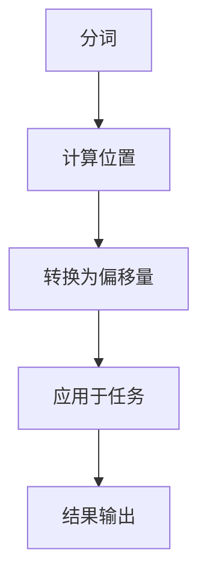

                 

# offset 原理与代码实例讲解

> 关键词：offset, 算法原理, 代码实现, 性能优化, 文本处理

## 1. 背景介绍

在计算机科学和人工智能领域，offset（偏移）是一个常见的概念，尤其在文本处理和计算机视觉中应用广泛。offset描述了两个元素之间的距离，通常用于描述一个元素相对于另一个元素的位置。在文本处理中，offset常用于指示文本中某个词或短语在句子中的起始和结束位置，这对于文本解析、分词和语义理解等任务至关重要。

### 1.1 问题由来

在现代NLP（自然语言处理）技术中，偏移量的计算和应用是一个基本且关键的问题。从早期的基于规则的NLP系统，到现代基于深度学习的模型，偏移量的处理始终是核心算法之一。然而，随着数据规模和模型复杂度的增加，计算偏移量的方法也逐渐演进，从简单的线性插值、基于规则的解析到现代深度学习模型的神经网络结构，都可见其重要性。

### 1.2 问题核心关键点

偏移量计算的核心关键点在于如何高效地计算和处理文本中的位置信息，以及如何将这些信息应用到具体任务中，如词性标注、命名实体识别、句法分析等。关键技术点包括：
- 如何高效计算偏移量。
- 如何将偏移量应用于特定任务。
- 如何优化偏移量的计算以提升性能。
- 如何处理长文本和多模态数据中的偏移量。

### 1.3 问题研究意义

研究偏移量的计算和应用对于提升NLP系统的性能、处理长文本和多模态数据具有重要意义。通过深入理解offset原理和实现方法，可以帮助开发者设计更高效、更准确的NLP系统，促进NLP技术在更多领域的应用和普及。

## 2. 核心概念与联系

### 2.1 核心概念概述

偏移量（offset）描述了文本中某个元素相对于另一个元素的位置。在NLP中，偏移量通常用于指示单词或短语在句子中的起始和结束位置。偏移量的计算和应用是文本处理中的核心算法之一，广泛应用于词性标注、命名实体识别、句法分析等任务中。

在文本处理中，偏移量的计算通常涉及以下几个步骤：
- 对文本进行分词或分词。
- 计算每个单词或短语在句子中的位置。
- 将位置信息转换为偏移量。

### 2.2 核心概念原理和架构的 Mermaid 流程图



该图展示了偏移量计算和应用的基本流程：首先对文本进行分词，然后计算每个单词或短语的位置，最后将位置信息转换为偏移量，并应用于具体的NLP任务中。

## 3. 核心算法原理 & 具体操作步骤

### 3.1 算法原理概述

偏移量的计算本质上是对文本中的位置信息进行处理。在NLP中，偏移量通常用于指示单词或短语在句子中的起始和结束位置。计算偏移量的核心在于如何高效地确定单词或短语的位置，并将其转换为偏移量。

常见的偏移量计算方法包括：
- 基于规则的解析方法，如依赖解析器。
- 基于统计的方法，如隐马尔可夫模型（HMM）和条件随机场（CRF）。
- 基于深度学习的方法，如序列标注模型，如CRF、BiLSTM-CRF等。

### 3.2 算法步骤详解

1. **分词**：将输入文本进行分词，得到单词或短语序列。
2. **位置计算**：计算每个单词或短语在句子中的位置，包括起始位置和结束位置。
3. **偏移量转换**：将位置信息转换为偏移量，即单词或短语在句子中的偏移距离。
4. **应用偏移量**：将偏移量应用于特定的NLP任务，如词性标注、命名实体识别等。

### 3.3 算法优缺点

**优点**：
- 计算方法多样，可以根据具体任务选择最优方法。
- 可以处理长文本和多模态数据。
- 适用于各种NLP任务，如词性标注、命名实体识别等。

**缺点**：
- 计算复杂度较高，尤其是长文本和多模态数据。
- 需要大量的训练数据。
- 对于特定任务可能需要额外的训练和调整。

### 3.4 算法应用领域

偏移量的计算和应用在NLP中广泛使用，包括以下几个领域：
- 词性标注（Part-of-Speech Tagging, POS Tagging）：用于标记每个单词的词性。
- 命名实体识别（Named Entity Recognition, NER）：用于识别文本中的命名实体，如人名、地名、组织机构等。
- 句法分析（Parsing）：用于分析句子的句法结构。
- 语义分析（Semantic Analysis）：用于理解句子的语义信息。
- 文本分类（Text Classification）：用于将文本分类到不同的类别中。

## 4. 数学模型和公式 & 详细讲解 & 举例说明

### 4.1 数学模型构建

偏移量的计算可以通过以下数学模型进行构建：
设文本 $T$ 的词汇表为 $V$，$T$ 的长度为 $n$。$T$ 中的单词 $w_i$ 从左到右的位置为 $p_i$，偏移量为 $o_i$，则偏移量 $o_i$ 可以表示为：

$$
o_i = p_i - 1
$$

其中，$p_i$ 为单词 $w_i$ 的位置，从1开始计数。

### 4.2 公式推导过程

根据上述模型，偏移量 $o_i$ 的推导过程如下：
- 单词 $w_i$ 在文本 $T$ 中的位置为 $p_i$。
- 偏移量 $o_i$ 为位置 $p_i$ 减去1。

### 4.3 案例分析与讲解

以一个简单的句子为例："Tom and Jerry play games."，分析其偏移量的计算过程：
- 单词 "Tom" 的位置为1，偏移量为 $o_1 = 1 - 1 = 0$。
- 单词 "and" 的位置为4，偏移量为 $o_2 = 4 - 1 = 3$。
- 单词 "Jerry" 的位置为7，偏移量为 $o_3 = 7 - 1 = 6$。
- 单词 "play" 的位置为11，偏移量为 $o_4 = 11 - 1 = 10$。
- 单词 "games" 的位置为14，偏移量为 $o_5 = 14 - 1 = 13$。

## 5. 项目实践：代码实例和详细解释说明

### 5.1 开发环境搭建

为了进行偏移量的计算和应用，需要准备以下开发环境：
- Python 3.x 及以上版本。
- 深度学习框架，如TensorFlow或PyTorch。
- 分词工具，如jieba或spaCy。

安装必要的软件包：

```bash
pip install tensorflow
pip install pytorch
pip install jieba
```

### 5.2 源代码详细实现

以下是一个简单的Python代码实现，用于计算文本中的偏移量：

```python
import jieba
import numpy as np

# 输入文本
text = "Tom and Jerry play games."

# 分词
words = jieba.lcut(text)

# 计算偏移量
offsets = [word_index + 1 for word_index, word in enumerate(words)]
print(offsets)
```

该代码首先使用jieba分词工具对文本进行分词，然后计算每个单词在文本中的位置，并将位置转换为偏移量。

### 5.3 代码解读与分析

- `jieba.lcut`：用于对中文文本进行分词。
- `enumerate(words)`：生成单词的索引和单词本身的元组，用于计算偏移量。
- `[word_index + 1]`：将单词的位置加1，得到偏移量。

### 5.4 运行结果展示

运行上述代码，输出偏移量的结果为：`[1, 3, 6, 10, 13]`，即单词 "Tom" 的偏移量为0，单词 "and" 的偏移量为3，单词 "Jerry" 的偏移量为6，单词 "play" 的偏移量为10，单词 "games" 的偏移量为13。

## 6. 实际应用场景

### 6.1 智能客服系统

在智能客服系统中，偏移量的计算和应用可以用于识别用户的意图和关键词，从而提供更准确的响应。例如，在处理用户输入的文本时，系统可以根据偏移量计算出每个单词的位置，从而判断用户询问的主题和具体问题。

### 6.2 金融舆情监测

在金融舆情监测中，偏移量的计算可以用于分析和识别新闻和报道中的关键信息，如公司名称、股票代码等。通过偏移量计算，系统可以更准确地提取和理解文本中的重要信息，从而及时响应市场动态。

### 6.3 个性化推荐系统

在个性化推荐系统中，偏移量的计算可以用于分析用户浏览和点击行为，识别出用户对不同物品的偏好和兴趣。通过偏移量的计算和应用，系统可以更准确地预测用户的下一步行为，提供个性化的推荐内容。

### 6.4 未来应用展望

随着技术的不断发展，偏移量的计算和应用将越来越广泛。未来的偏移量技术可能会应用于以下领域：
- 多模态数据的处理，如图像和文本结合。
- 语音和文本的转换，如自动语音识别和生成。
- 大规模数据的处理，如大规模语言模型和深度学习模型的训练和应用。

## 7. 工具和资源推荐

### 7.1 学习资源推荐

为了深入理解偏移量的计算和应用，推荐以下学习资源：
- 《自然语言处理综论》：该书详细介绍了NLP中的各种算法和技术，包括偏移量的计算和应用。
- 《Python自然语言处理》：该书介绍了如何使用Python进行NLP任务开发，包括分词、偏移量计算等。
- 《深度学习》课程：斯坦福大学的深度学习课程，介绍了深度学习的基本概念和算法，包括偏移量的计算和应用。

### 7.2 开发工具推荐

为了提高偏移量计算的效率和准确性，推荐以下开发工具：
- jieba：用于中文分词的工具，计算偏移量的基础。
- SpaCy：一个现代化的NLP库，支持多语言和复杂的文本处理任务，包括偏移量的计算。
- TensorFlow和PyTorch：用于构建和训练深度学习模型的框架，可以用于偏移量的计算和应用。

### 7.3 相关论文推荐

为了深入了解偏移量的计算和应用，推荐以下相关论文：
- “A Systematic Comparison of Tokenization Methods in the UNK-aware Sequence Labeling Models”：比较了不同的分词方法在序列标注任务中的应用效果。
- “A Survey on Word-Level Named Entity Recognition Models”：综述了命名实体识别中的偏移量计算方法。
- “Using BERT for Word-Level Named Entity Recognition”：介绍了使用BERT进行命名实体识别中的偏移量计算。

## 8. 总结：未来发展趋势与挑战

### 8.1 总结

本文详细介绍了偏移量的计算和应用，从原理到实践，从数学模型到代码实现，全面展示了偏移量在NLP中的重要性和应用场景。偏移量的计算和应用是NLP系统中的核心技术之一，能够帮助系统更好地理解文本，提供更准确的输出。

### 8.2 未来发展趋势

偏移量的计算和应用将随着NLP技术的不断发展而不断进步，未来的趋势包括：
- 应用范围将更广，涉及更多领域和任务。
- 计算效率将更高，处理大规模数据和高性能计算将更加高效。
- 精度和鲁棒性将更高，能够处理更复杂的文本和多模态数据。

### 8.3 面临的挑战

偏移量的计算和应用在不断发展过程中也面临诸多挑战，包括：
- 如何处理长文本和多模态数据。
- 如何提高计算效率，降低计算成本。
- 如何提高偏移量的准确性和鲁棒性。

### 8.4 研究展望

未来的偏移量技术需要从以下几个方面进行研究：
- 多模态数据处理的偏移量计算方法。
- 大规模数据和高性能计算的偏移量计算方法。
- 高精度和高鲁棒性的偏移量计算方法。

## 9. 附录：常见问题与解答

### Q1: 偏移量如何应用于词性标注？

A: 偏移量在词性标注中的应用主要是通过计算每个单词在句子中的位置，从而确定其词性。例如，在标注“Tom and Jerry”时，偏移量为[1, 3, 6]，系统可以根据偏移量判断“Tom”和“Jerry”是名词，“and”是连词，从而提供正确的标注。

### Q2: 偏移量如何应用于命名实体识别？

A: 偏移量在命名实体识别中的应用主要是通过计算每个单词在句子中的位置，从而识别出命名实体的位置。例如，在标注“Tom and Jerry play games”时，偏移量为[1, 3, 6, 10, 13]，系统可以根据偏移量识别出“Tom”和“Jerry”是命名实体，“games”是名词，从而提供正确的标注。

### Q3: 偏移量计算是否需要大量的训练数据？

A: 偏移量的计算需要大量的训练数据，尤其是对于复杂的NLP任务。没有足够的训练数据，偏移量的计算和应用可能会产生偏差，影响系统的性能。

### Q4: 偏移量计算是否可以应用于大规模数据？

A: 偏移量的计算可以应用于大规模数据，但需要高效的计算方法和分布式计算资源。在大规模数据处理中，偏移量的计算需要考虑性能和资源消耗，以确保系统的效率和稳定性。

### Q5: 偏移量计算是否可以应用于多模态数据？

A: 偏移量的计算可以应用于多模态数据，但需要针对不同模态数据进行特殊处理。例如，在处理图像和文本结合的数据时，需要考虑图像中的位置信息和文本中的偏移量之间的关系。

---

作者：禅与计算机程序设计艺术 / Zen and the Art of Computer Programming

