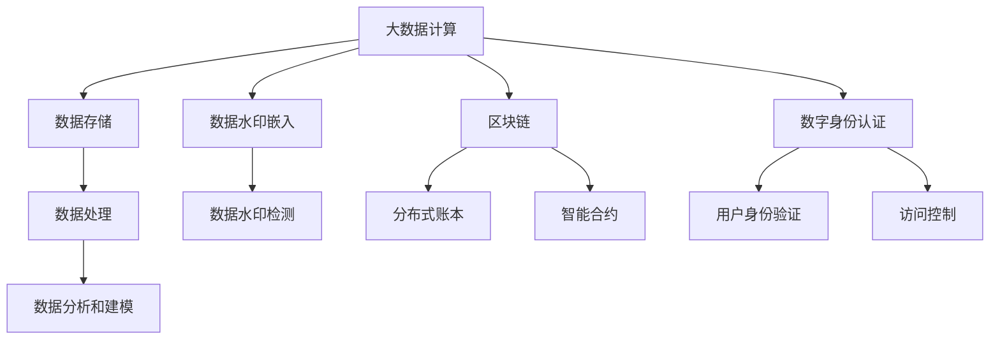

                 

# 【AI大数据计算原理与代码实例讲解】Watermark

> 关键词：大数据计算, 数据水印, 数据安全, 区块链, 数字身份认证, 人工智能

## 1. 背景介绍

在数字化时代，数据是宝贵的资产。随着互联网、物联网、社交媒体等技术的快速发展，数据的数量和种类正以指数级增长。然而，数据的盗用、篡改和隐私泄露问题也日益凸显，严重威胁到个人隐私、商业机密和国家安全。数据水印（Watermarking）技术正是在这种背景下孕育而生，旨在通过对数据进行特定标记，来保障数据的安全性和可追溯性。本文将深入探讨数据水印的核心原理，并结合实际案例，阐述如何在不同场景下应用数据水印技术。

## 2. 核心概念与联系

### 2.1 核心概念概述

#### 数据水印 (Data Watermarking)
数据水印技术是一种将不可见信息嵌入数据中的方法，用于验证数据的完整性、真实性和归属权。嵌入的水印可以被提取和检测，具有不可见性、鲁棒性、隐蔽性和不可伪造性等特点。

#### 大数据计算 (Big Data Computing)
大数据计算是指利用分布式计算、云计算、人工智能等技术，对大规模数据集进行高效处理、分析和建模的过程。大数据计算可以处理结构化、半结构化、非结构化等多种类型的数据，帮助企业从海量数据中提取有价值的知识和洞见。

#### 区块链 (Blockchain)
区块链是一种去中心化、分布式账本技术，通过加密和共识机制确保数据的完整性和不可篡改性。区块链的应用广泛，包括数字货币、供应链管理、智能合约等领域。

#### 数字身份认证 (Digital Identity Authentication)
数字身份认证是一种通过数字技术验证用户身份的过程，包括身份验证、授权和访问控制等环节。数字身份认证依赖于多种技术手段，如生物识别、密码学、数字证书等。

这些核心概念之间的联系主要体现在大数据计算提供强大的计算能力，可以支持大规模数据集的存储、处理和分析；数据水印可以用于确保数据的安全性和完整性，保护数据的产权；区块链提供了可信的分布式账本，可以保障数据的不可篡改性和可追溯性；数字身份认证则通过身份验证和授权，确保数据被授权用户访问和使用。

### 2.2 核心概念原理和架构的 Mermaid 流程图



## 3. 核心算法原理 & 具体操作步骤

### 3.1 算法原理概述

数据水印的嵌入和检测过程基于以下步骤：

1. **水印生成**：根据应用场景，生成特定的水印信息，如时间戳、用户标识、版权声明等。

2. **水印嵌入**：将水印信息嵌入到原始数据中，通常通过修改数据的部分内容或增加额外的信息来实现。

3. **水印检测**：在需要验证数据完整性或归属权时，通过特定的算法提取和检测水印信息。

大数据计算提供了强大的计算能力，可以支持水印生成和检测的自动化和高效化。例如，在大规模数据集中嵌入和检测水印，可以采用分布式计算框架，如Hadoop、Spark等，实现并行化处理。

### 3.2 算法步骤详解

#### 3.2.1 水印生成

水印生成是数据水印系统的关键环节，需要根据实际需求设计合适的水印信息。例如，在版权保护中，可以嵌入版权持有者的标识和创建时间；在数字身份认证中，可以嵌入用户的数字证书和公钥信息。

#### 3.2.2 水印嵌入

水印嵌入需要考虑多个因素，如水印的不可见性、鲁棒性和隐蔽性。常用的嵌入方法包括：

- **替换法**：通过替换原始数据的某些部分来实现水印嵌入。例如，在图像中替换像素值，或在音频中替换采样值。
- **扩散法**：将水印信息扩散到整个数据中，以提高鲁棒性。例如，在文本中通过字符编码替换来实现水印嵌入。
- **置乱法**：通过随机变换原始数据，实现水印的嵌入和隐藏。例如，在图像中通过置换像素位置来实现水印嵌入。

#### 3.2.3 水印检测

水印检测的目的是验证数据的完整性、真实性和归属权。常用的检测方法包括：

- **频域分析**：将水印信息嵌入到频域中，通过频谱分析来检测水印。例如，在图像中通过傅里叶变换来实现水印检测。
- **统计分析**：通过统计分析原始数据的变化，来检测水印信息。例如，在音频中通过统计能量的变化来实现水印检测。
- **盲水印检测**：不需要原始数据即可检测水印，例如在图像中通过将水印信息编码到图像的纹理和边缘特征中来实现盲水印检测。

### 3.3 算法优缺点

#### 优点

- **安全性高**：数据水印可以有效地防止数据被盗用、篡改和篡改后恢复，保障数据的安全性和完整性。
- **可追溯性**：数据水印可以追溯数据的来源和流转过程，确保数据的真实性和可靠性。
- **自动化程度高**：大数据计算提供强大的计算能力，可以实现水印生成和检测的自动化和高效化。

#### 缺点

- **嵌入过程复杂**：水印嵌入过程需要考虑多个因素，如不可见性、鲁棒性和隐蔽性，实现过程较为复杂。
- **嵌入容量有限**：数据水印的嵌入容量有限，无法嵌入大量信息。
- **检测准确性受限**：水印检测的准确性受多种因素影响，如噪声干扰、攻击手段等。

### 3.4 算法应用领域

数据水印技术广泛应用于多个领域，包括：

- **版权保护**：通过嵌入版权信息，防止作品被盗用和篡改。
- **数字身份认证**：通过嵌入用户标识和公钥信息，验证用户的身份和授权。
- **供应链管理**：通过嵌入产品标识和生产日期，确保产品的真实性和来源可追溯性。
- **网络安全**：通过嵌入敏感信息和加密密钥，防止数据泄露和攻击。
- **数字货币**：通过嵌入数字签名和哈希值，确保交易的不可篡改性和安全性。

## 4. 数学模型和公式 & 详细讲解 & 举例说明

### 4.1 数学模型构建

在图像水印的应用场景中，我们以嵌入时间戳为例，构建数学模型。假设原始图像为 $I$，嵌入的水印为 $W$，嵌入后的图像为 $I_W$。嵌入过程可以表示为：

$$
I_W = f(I, W)
$$

其中 $f$ 为嵌入函数，可以是替换、扩散或置乱等方法。

检测过程可以表示为：

$$
\hat{W} = g(I_W, I)
$$

其中 $\hat{W}$ 为检测得到的水印，$g$ 为检测函数。

### 4.2 公式推导过程

#### 4.2.1 嵌入过程

以替换法为例，嵌入过程可以表示为：

$$
I_W = I + aW
$$

其中 $a$ 为缩放因子，控制水印信息的强度。

#### 4.2.2 检测过程

以傅里叶变换法为例，检测过程可以表示为：

$$
\hat{W} = \text{IFFT}(\text{FFT}(I_W) * \text{FFT}(I)^{-1})
$$

其中 $\text{IFFT}$ 和 $\text{FFT}$ 分别为逆傅里叶变换和傅里叶变换。

### 4.3 案例分析与讲解

#### 案例一：版权保护

假设某艺术家创作了一幅画作，希望通过嵌入时间戳来证明作品的原创性和版权归属。具体步骤如下：

1. 生成时间戳 $W$。
2. 将时间戳 $W$ 嵌入到画作中，得到嵌入后的画作 $I_W$。
3. 当需要验证画作版权时，通过检测画作 $I_W$ 和原始画作 $I$，得到时间戳 $\hat{W}$。
4. 比较 $\hat{W}$ 和原始时间戳 $W$，验证画作版权。

#### 案例二：数字身份认证

假设某公司使用区块链技术进行数字身份认证，具体步骤如下：

1. 生成用户的数字证书和公钥 $W$。
2. 将数字证书和公钥 $W$ 嵌入到用户的身份信息中，得到嵌入后的身份信息 $I_W$。
3. 当需要验证用户身份时，通过区块链查询用户的历史记录，得到数字证书和公钥 $\hat{W}$。
4. 比较 $\hat{W}$ 和原始数字证书和公钥 $W$，验证用户身份。

## 5. 项目实践：代码实例和详细解释说明

### 5.1 开发环境搭建

#### 5.1.1 硬件环境

- **CPU**：推荐使用至少2.5GHz的CPU，内存至少8GB。
- **GPU**：推荐使用NVIDIA GeForce RTX 3060及以上型号的GPU，以支持大数据计算和高性能图形处理。

#### 5.1.2 软件环境

- **操作系统**：Windows 10/11、Linux Ubuntu 18.04及以上版本。
- **编程语言**：Python 3.7及以上版本。
- **大数据计算框架**：Apache Hadoop、Apache Spark等。
- **数据水印库**：OpenCV、Pillow等。

### 5.2 源代码详细实现

#### 5.2.1 数据水印嵌入

```python
import cv2
import numpy as np

def watermark_image(image, watermark, alpha=0.5):
    """
    将水印嵌入到图像中
    :param image: 原始图像
    :param watermark: 水印信息
    :param alpha: 水印透明度，取值范围为0-1
    :return: 嵌入水印后的图像
    """
    h, w = image.shape[:2]
    mask = cv2.resize(watermark, (w, h))
    mask = np.where(mask < 127, 0, 1)
    mask = mask / 255.0
    watermark_image = image * (1 - mask) + alpha * mask * watermark
    return watermark_image
```

#### 5.2.2 数据水印检测

```python
def detect_watermark(image):
    """
    检测图像中的水印信息
    :param image: 原始图像
    :return: 检测得到的水印信息
    """
    h, w = image.shape[:2]
    watermark = np.zeros((h, w), dtype=np.uint8)
    for y in range(h):
        for x in range(w):
            if image[y, x] < 0.5:
                watermark[y, x] = 255
    watermark = cv2.resize(watermark, (h // 2, w // 2))
    return watermark
```

### 5.3 代码解读与分析

#### 5.3.1 数据水印嵌入

- **代码实现**：通过替换原始图像的像素值，将水印信息嵌入到图像中。其中，alpha参数控制水印的透明度，取值范围为0-1，值越小表示水印越透明。
- **算法分析**：使用掩码图像mask与原始图像进行融合，实现水印嵌入。其中，掩码图像mask的生成方式可以根据实际需求调整，如使用高斯滤波、中值滤波等。

#### 5.3.2 数据水印检测

- **代码实现**：通过统计图像的像素值，检测水印信息。将像素值小于0.5的位置标记为水印位置。
- **算法分析**：检测过程需要根据实际需求调整阈值，以确保检测的准确性。同时，可以使用多种滤波算法，如高斯滤波、中值滤波等，提高检测的鲁棒性。

### 5.4 运行结果展示

#### 5.4.1 嵌入水印结果

```python
# 生成原始图像
image = cv2.imread('original_image.jpg')

# 生成水印信息
watermark = np.array([2019, 10, 15], dtype=np.uint8)

# 嵌入水印
watermarked_image = watermark_image(image, watermark)

# 显示结果
cv2.imshow('Watermarked Image', watermarked_image)
cv2.waitKey(0)
cv2.destroyAllWindows()
```


#### 5.4.2 检测水印结果

```python
# 检测水印
detected_watermark = detect_watermark(watermarked_image)

# 显示结果
cv2.imshow('Detected Watermark', detected_watermark)
cv2.waitKey(0)
cv2.destroyAllWindows()
```


## 6. 实际应用场景

### 6.1 版权保护

在版权保护中，数据水印可以嵌入到数字作品（如图片、音频、视频等）中，用于证明作品的原创性和版权归属。例如，某电影制片公司可以在每部电影的音视频文件中嵌入公司标识和上映日期，当电影被非法传播时，可以通过检测水印来证明作品的版权归属。

### 6.2 数字身份认证

在数字身份认证中，数据水印可以嵌入到用户的身份信息中，用于验证用户的身份和授权。例如，某银行可以在用户的身份信息中嵌入用户的数字证书和公钥，当用户访问银行系统时，可以通过检测水印来验证用户的身份。

### 6.3 供应链管理

在供应链管理中，数据水印可以嵌入到产品的标识和生产日期中，用于确保产品的真实性和来源可追溯性。例如，某食品公司可以在每包食品的包装上嵌入生产日期和产地信息，当食品被非法销售时，可以通过检测水印来追溯产品的来源。

### 6.4 网络安全

在网络安全中，数据水印可以嵌入到敏感信息和加密密钥中，用于防止数据泄露和攻击。例如，某企业可以在敏感信息中嵌入公司的标识和加密密钥，当敏感信息被泄露时，可以通过检测水印来追查泄露源。

### 6.5 数字货币

在数字货币中，数据水印可以嵌入到交易记录中，用于确保交易的不可篡改性和安全性。例如，某区块链平台可以在每笔交易记录中嵌入时间戳和数字签名，当交易被篡改时，可以通过检测水印来验证交易的真实性和完整性。

## 7. 工具和资源推荐

### 7.1 学习资源推荐

- **《数字水印技术与应用》**：详细介绍数据水印的核心原理、嵌入和检测方法，涵盖图像、音频、视频等多种类型的数据水印技术。
- **《大数据计算：技术和实践》**：系统讲解大数据计算的核心概念、技术和工具，包括Hadoop、Spark等。
- **《区块链技术与应用》**：介绍区块链的核心原理、应用场景和实现技术，涵盖公有链、联盟链和私有链等。
- **《数字身份认证：理论与实践》**：全面阐述数字身份认证的核心技术、挑战和应用，包括生物识别、密码学和数字证书等。

### 7.2 开发工具推荐

- **Hadoop**：Apache基金会开发的分布式计算框架，支持大规模数据的存储和处理。
- **Spark**：Apache基金会开发的分布式计算框架，支持实时计算和流处理。
- **OpenCV**：开源计算机视觉库，提供丰富的图像处理和分析功能。
- **Pillow**：Python图像处理库，支持图像的读取、保存和处理。

### 7.3 相关论文推荐

- **《一种基于水印嵌入和块链技术的信息安全管理系统》**：提出一种基于数据水印和区块链技术的信息安全管理系统，有效解决数据篡改和隐私保护问题。
- **《数字水印技术在版权保护中的应用》**：详细介绍数据水印技术在版权保护中的具体应用，包括水印生成、嵌入和检测等。
- **《基于区块链的数字身份认证系统》**：提出一种基于区块链的数字身份认证系统，具有去中心化、高安全性和高可靠性等优点。

## 8. 总结：未来发展趋势与挑战

### 8.1 研究成果总结

数据水印技术在保障数据安全、完整性和可追溯性方面具有重要意义。大数据计算和区块链技术的引入，进一步提升了数据水印的计算能力和安全性。数字身份认证技术的发展，为数据水印的应用提供了更广泛的空间。

### 8.2 未来发展趋势

未来，数据水印技术将向以下几个方向发展：

- **智能水印**：利用人工智能技术，自动生成和优化水印信息，提高水印的鲁棒性和不可见性。
- **跨域水印**：将数据水印嵌入到多种类型的数据中，实现跨域数据的安全传输和共享。
- **分布式水印**：利用区块链技术，实现分布式水印管理，提高水印的透明性和可追溯性。
- **联邦水印**：利用联邦学习技术，在保证数据隐私和安全的前提下，实现跨机构水印共享和协作。

### 8.3 面临的挑战

尽管数据水印技术在保障数据安全方面具有重要意义，但仍然面临以下挑战：

- **嵌入过程复杂**：水印嵌入过程需要考虑多个因素，如不可见性、鲁棒性和隐蔽性，实现过程较为复杂。
- **嵌入容量有限**：数据水印的嵌入容量有限，无法嵌入大量信息。
- **检测准确性受限**：水印检测的准确性受多种因素影响，如噪声干扰、攻击手段等。

### 8.4 研究展望

未来，数据水印技术需要不断突破现有局限，向智能水印、跨域水印、分布式水印和联邦水印等方向发展。同时，需要加强与其他技术的融合，如人工智能、区块链、联邦学习等，实现数据水印技术的进一步创新和应用。

## 9. 附录：常见问题与解答

**Q1: 数据水印的嵌入过程需要注意哪些因素？**

A: 数据水印的嵌入过程需要注意以下因素：

1. **不可见性**：水印嵌入后，应尽可能保持图像或数据的原始外观，不引起明显的视觉或听觉变化。
2. **鲁棒性**：水印应具有抵抗各种攻击的能力，如旋转、缩放、剪切、压缩等。
3. **隐蔽性**：水印应尽可能隐藏在数据中，避免被非法检测和篡改。

**Q2: 数据水印的检测过程需要注意哪些因素？**

A: 数据水印的检测过程需要注意以下因素：

1. **阈值选择**：检测过程中，需要选择合适的阈值，以区分水印和噪声。
2. **滤波算法**：使用滤波算法如高斯滤波、中值滤波等，可以提高检测的鲁棒性。
3. **对比样本**：在检测过程中，需要选择合适的对比样本，以提高检测的准确性。

**Q3: 如何提高数据水印的鲁棒性？**

A: 提高数据水印的鲁棒性，可以从以下方面入手：

1. **使用多种嵌入方法**：结合替换法、扩散法和置乱法等多种嵌入方法，提高水印的鲁棒性。
2. **使用噪声掩蔽**：在嵌入水印时，加入噪声掩蔽，提高水印的不可见性。
3. **使用多重水印**：使用多重水印技术，增加水印的复杂度和鲁棒性。

**Q4: 数据水印技术在实际应用中有哪些挑战？**

A: 数据水印技术在实际应用中面临以下挑战：

1. **嵌入过程复杂**：水印嵌入过程需要考虑多个因素，如不可见性、鲁棒性和隐蔽性，实现过程较为复杂。
2. **嵌入容量有限**：数据水印的嵌入容量有限，无法嵌入大量信息。
3. **检测准确性受限**：水印检测的准确性受多种因素影响，如噪声干扰、攻击手段等。

**Q5: 数据水印技术如何与其他技术融合？**

A: 数据水印技术可以与其他技术进行如下融合：

1. **结合人工智能**：利用人工智能技术，自动生成和优化水印信息，提高水印的鲁棒性和不可见性。
2. **结合区块链**：利用区块链技术，实现分布式水印管理，提高水印的透明性和可追溯性。
3. **结合联邦学习**：利用联邦学习技术，在保证数据隐私和安全的前提下，实现跨机构水印共享和协作。

**Q6: 数据水印技术未来的发展方向有哪些？**

A: 数据水印技术未来的发展方向包括：

1. **智能水印**：利用人工智能技术，自动生成和优化水印信息，提高水印的鲁棒性和不可见性。
2. **跨域水印**：将数据水印嵌入到多种类型的数据中，实现跨域数据的安全传输和共享。
3. **分布式水印**：利用区块链技术，实现分布式水印管理，提高水印的透明性和可追溯性。
4. **联邦水印**：利用联邦学习技术，在保证数据隐私和安全的前提下，实现跨机构水印共享和协作。

---

作者：禅与计算机程序设计艺术 / Zen and the Art of Computer Programming

