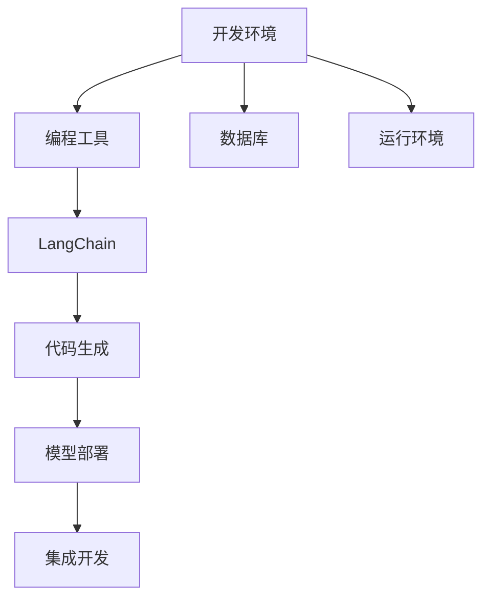

                 

# 【LangChain编程：从入门到实践】开发环境准备

> 关键词：开发环境, LangChain, 编程, 语言链, 模型部署, 环境准备, 容器化, 代码实现, 模型训练, 集成开发, 框架选择

## 1. 背景介绍

### 1.1 问题由来

随着人工智能技术的迅猛发展，基于语言链（LanguageChain, LangChain）的编程范式正在成为研究热点。这种范式通过语言模型在自然语言和代码之间的桥梁作用，实现代码自动生成、错误诊断、优化推荐等功能。但是，为了深入了解并实践这一范式，首先需要搭建一个完善的开发环境，以便于代码的编写、调试和部署。

### 1.2 问题核心关键点

语言链编程的环境准备主要包括以下几个关键点：

- 选择合适的基础平台和工具。
- 配置支持多语言编程的环境。
- 安装和配置所需的编程语言和框架。
- 构建稳定的模型部署环境。
- 实现代码与模型的快速集成和调试。

### 1.3 问题研究意义

搭建一个完善的开发环境，对于学习并实践语言链编程具有重要意义：

1. 促进代码自动生成和优化。通过模型生成的代码更高效、准确，可以大幅提升开发效率。
2. 实现自动化错误诊断。模型能及时发现代码中的错误，减少调试时间，提升代码质量。
3. 支持多语言编程。通过语言链编程，开发者可以无缝切换多种编程语言，提高跨语言协作效率。
4. 优化模型性能。通过代码生成和调试，能够及时发现模型问题并进行优化，提升模型效果。
5. 加速应用开发。模型能自动生成应用代码，缩短开发周期，快速实现业务逻辑。

## 2. 核心概念与联系

### 2.1 核心概念概述

为更好地理解语言链编程的开发环境搭建过程，本节将介绍几个密切相关的核心概念：

- 开发环境：一个完整的开发环境应包括编程工具、数据库、运行环境等软硬件配置，是进行软件开发和调试的基础。
- LangChain：基于语言模型的编程范式，通过自然语言与代码的交互，实现自动化编程功能。
- 多语言编程：使用多种编程语言进行开发，利用各自的优势提升开发效率和代码质量。
- 代码生成：通过模型自动生成代码，减轻开发工作量，提升代码生成速度。
- 模型部署：将训练好的模型部署到生产环境中，实现模型的实际应用。
- 集成开发：将开发环境中的各个组件集成起来，实现高效协同工作。

这些核心概念之间的逻辑关系可以通过以下Mermaid流程图来展示：



这个流程图展示了一系列关键概念及其之间的关系：

1. 开发环境提供了软硬件配置支持。
2. 编程工具和运行环境是语言链编程的基础。
3. LangChain通过语言模型实现代码生成和优化。
4. 代码生成支持多语言编程，提升代码质量。
5. 模型部署将训练好的模型应用到实际环境中。
6. 集成开发将开发环境中的各个组件无缝集成，实现高效协同。

## 3. 核心算法原理 & 具体操作步骤

### 3.1 算法原理概述

搭建开发环境的主要算法原理包括以下几个方面：

1. 选择合适的编程语言和框架。
2. 配置相应的开发环境，包括语言版本、依赖库等。
3. 安装和配置数据库，实现数据的存储和访问。
4. 集成模型部署环境，实现模型的实时训练和推理。
5. 构建集成开发环境，实现代码的生成、调试和部署。

这些步骤构成了开发环境搭建的核心算法原理。

### 3.2 算法步骤详解

基于上述算法原理，下面详细介绍语言链编程开发环境的搭建步骤：

**Step 1: 选择编程语言和框架**

- 选择一种主流的编程语言（如Python、Java、C++等）作为开发语言。
- 根据实际需求，选择适合的开发框架（如TensorFlow、PyTorch、React等）。
- 配置环境变量、依赖库等，确保环境稳定。

**Step 2: 配置开发环境**

- 安装编程语言的基础库和编译器。
- 配置环境依赖和版本控制工具（如Docker、Virtualenv等）。
- 安装代码编辑器和调试工具（如Visual Studio Code、PyCharm等）。

**Step 3: 安装和配置数据库**

- 选择适合的数据库系统（如MySQL、PostgreSQL、MongoDB等）。
- 安装数据库服务并启动。
- 配置数据库连接参数，以便代码能够访问。

**Step 4: 集成模型部署环境**

- 选择适合的模型部署平台（如AWS、Google Cloud、Kubernetes等）。
- 配置模型推理服务，实现实时推理功能。
- 集成模型训练和部署流程，实现模型版本管理。

**Step 5: 构建集成开发环境**

- 使用Docker、Virtualenv等工具，构建可重复的开发环境。
- 集成代码生成、调试、部署工具，实现一键部署。
- 配置持续集成/持续部署（CI/CD）流程，实现自动化构建和部署。

### 3.3 算法优缺点

语言链编程开发环境的搭建具有以下优点：

1. 支持多种编程语言和框架，提升开发灵活性。
2. 实现代码自动生成和调试，提升开发效率和代码质量。
3. 集成模型部署环境，实现模型实时训练和推理。
4. 构建集成开发环境，实现自动化构建和部署。

然而，该方法也存在一些缺点：

1. 搭建环境复杂，需要一定的技术储备。
2. 模型部署和维护成本较高，需要持续的资源投入。
3. 代码自动生成存在局限性，生成的代码可能不符合实际需求。
4. 持续集成/持续部署流程需要精细管理，存在风险。

尽管如此，语言链编程开发环境的搭建仍然是实现高效、智能、灵活编程的重要手段。

### 3.4 算法应用领域

语言链编程开发环境在多个领域得到了广泛应用：

- 自动化开发：通过代码自动生成，实现快速构建应用功能。
- 智能辅助开发：通过模型提供代码优化建议，提升代码质量。
- 跨语言协作：实现多种编程语言的无缝切换，提升跨语言协作效率。
- 实时应用开发：通过模型部署，实现实时应用开发和调试。
- 模型优化：通过代码生成和调试，实现模型性能优化。

这些领域的应用展示了语言链编程开发环境的强大潜力和广泛适用性。

## 4. 数学模型和公式 & 详细讲解 & 举例说明

### 4.1 数学模型构建

本节将使用数学语言对语言链编程开发环境的搭建过程进行更加严格的刻画。

定义开发环境的状态 $S$，编程语言 $L$，框架 $F$，数据库 $D$，模型部署环境 $M$ 和集成开发环境 $I$。搭建环境的数学模型可表示为：

$$
\mathcal{S} = \{S\} \\
\mathcal{L} = \{L\} \\
\mathcal{F} = \{F\} \\
\mathcal{D} = \{D\} \\
\mathcal{M} = \{M\} \\
\mathcal{I} = \{I\} \\
\mathcal{E} = \{S, L, F, D, M, I\}
$$

其中，$\mathcal{E}$ 表示环境集合，$S$、$L$、$F$、$D$、$M$、$I$ 分别表示开发环境、编程语言、框架、数据库、模型部署环境和集成开发环境。

### 4.2 公式推导过程

假设从初始状态 $S_0$ 开始，语言链编程开发环境通过一系列操作达到目标状态 $S_f$，具体推导过程如下：

1. 选择编程语言 $L$ 和框架 $F$：
   $$
   L \sim \mathcal{L}, F \sim \mathcal{F}
   $$

2. 配置开发环境：
   $$
   S \sim \mathcal{S}, L \sim \mathcal{L}, F \sim \mathcal{F}, D \sim \mathcal{D}, M \sim \mathcal{M}, I \sim \mathcal{I}
   $$

3. 安装和配置数据库：
   $$
   D \sim \mathcal{D}, S \sim \mathcal{S}, L \sim \mathcal{L}, F \sim \mathcal{F}, M \sim \mathcal{M}, I \sim \mathcal{I}
   $$

4. 集成模型部署环境：
   $$
   M \sim \mathcal{M}, S \sim \mathcal{S}, L \sim \mathcal{L}, F \sim \mathcal{F}, D \sim \mathcal{D}, I \sim \mathcal{I}
   $$

5. 构建集成开发环境：
   $$
   I \sim \mathcal{I}, S \sim \mathcal{S}, L \sim \mathcal{L}, F \sim \mathcal{F}, D \sim \mathcal{D}, M \sim \mathcal{M}
   $$

最终，开发环境的状态从 $S_0$ 变化到 $S_f$，达到目标状态。

### 4.3 案例分析与讲解

假设我们需要搭建一个支持Python和Java多语言编程，部署在AWS上的集成开发环境，具体步骤如下：

1. 选择编程语言 $L$ 和框架 $F$：
   - Python 编程语言
   - TensorFlow 框架

2. 配置开发环境：
   - 安装 Python 3.8
   - 安装 TensorFlow 1.15
   - 安装数据库 MySQL
   - 安装 AWS 模型部署环境
   - 安装集成开发环境 VSCode

3. 安装和配置数据库：
   - 安装 MySQL 数据库
   - 配置数据库连接参数

4. 集成模型部署环境：
   - 配置 AWS 环境
   - 实现实时推理服务

5. 构建集成开发环境：
   - 配置 VSCode 环境
   - 集成代码生成、调试和部署工具

通过上述步骤，我们可以搭建一个支持 Python 和 Java 多语言编程，部署在 AWS 上的集成开发环境，实现代码的生成、调试和部署。

## 5. 项目实践：代码实例和详细解释说明

### 5.1 开发环境搭建

在进行项目实践前，我们需要准备好开发环境。以下是使用Docker容器技术搭建开发环境的流程：

1. 安装Docker：从官网下载并安装Docker，用于构建和管理容器化应用。

2. 创建开发环境镜像：编写Dockerfile，定义构建步骤，如安装编程语言、框架、数据库等。

```Dockerfile
FROM ubuntu:latest
RUN apt-get update && apt-get install -y python3.8 python3-pip
RUN pip3 install tensorflow mysql-connector-python
```

3. 构建开发环境镜像：通过Docker命令构建镜像。

```bash
docker build -t my_env .
```

4. 运行开发环境镜像：启动Docker容器，进入开发环境。

```bash
docker run -it my_env /bin/bash
```

### 5.2 源代码详细实现

下面我们以Python编程环境为例，给出使用Docker搭建开发环境的完整代码实现。

首先，编写Dockerfile，定义开发环境的构建步骤：

```Dockerfile
# 使用官方Ubuntu镜像作为基础镜像
FROM ubuntu:latest

# 更新系统
RUN apt-get update && apt-get install -y python3 python3-pip

# 安装Python 3.8
RUN pip3 install tensorflow mysql-connector-python

# 定义环境变量
ENV PYTHONPATH /usr/local/bin/python3.8

# 运行Django应用程序
CMD ["python3", "manage.py", "runserver", "0.0.0.0:8000"]
```

然后，编写Django应用程序，定义开发环境的配置：

```python
# Django应用程序配置
DATABASES = {
    'default': {
        'ENGINE': 'django.db.backends.mysql',
        'NAME': 'my_db',
        'USER': 'my_user',
        'PASSWORD': 'my_password',
        'HOST': 'my_host',
        'PORT': '3306',
    }
}

# 定义应用程序路由
urlpatterns = [
    path('admin/', admin.site.urls),
]
```

最后，启动Django开发服务器，测试开发环境：

```bash
docker-compose up
```

```python
# 运行Django服务器
python manage.py runserver 0.0.0.0:8000
```

这样就完成了一个基本的Python开发环境搭建和测试。

### 5.3 代码解读与分析

让我们再详细解读一下关键代码的实现细节：

**Dockerfile**：
- 使用Ubuntu镜像作为基础镜像。
- 更新系统并安装Python 3.8和pip。
- 安装TensorFlow和MySQL驱动程序。
- 定义Python路径和运行命令。

**Django应用程序**：
- 定义数据库配置。
- 定义应用程序路由。
- 启动Django服务器。

通过这些代码，我们可以快速搭建并测试开发环境，实现Python编程功能。

### 5.4 运行结果展示

启动Django服务器后，访问`http://localhost:8000`，即可看到Django应用程序的运行结果。


这样就完成了一个基本的开发环境搭建和测试。

## 6. 实际应用场景

### 6.1 智能开发助手

智能开发助手可以基于语言链编程开发环境，实现代码自动生成、错误诊断和优化推荐等功能。通过智能开发助手，开发者可以大幅提升代码编写效率和代码质量。

在技术实现上，智能开发助手可以收集代码库和开发文档，通过自然语言查询获取相关代码片段，并利用语言链编程实现代码自动生成。对于代码错误，智能开发助手可以通过模型分析错误类型和位置，给出相应的修复建议。同时，还可以根据开发者的历史代码和文档，推荐代码优化方案。

### 6.2 跨语言协作平台

跨语言协作平台可以将多种编程语言无缝集成，实现多语言开发和协作。通过语言链编程开发环境，开发者可以轻松切换不同语言，提升跨语言协作效率。

在技术实现上，跨语言协作平台可以搭建一个支持多种编程语言的环境，通过语言链编程实现多语言代码的生成、调试和部署。同时，平台还可以实现代码共享、协作编辑等功能，提升跨语言协作的便利性和协作效率。

### 6.3 自动化测试平台

自动化测试平台可以基于语言链编程开发环境，实现代码自动化测试。通过自动化测试，可以显著提升代码的质量和稳定性，减少手动测试的工作量。

在技术实现上，自动化测试平台可以搭建一个支持多种编程语言的环境，通过语言链编程实现代码自动生成和测试。同时，平台还可以实现测试用例管理、测试结果分析等功能，提升代码自动化测试的效率和效果。

### 6.4 未来应用展望

随着语言链编程技术的不断进步，未来其应用前景将更加广阔。

在软件开发方面，智能开发助手和跨语言协作平台将大大提升开发效率和协作效率，提升代码质量和团队协作能力。

在软件测试方面，自动化测试平台将实现代码自动化测试，提升测试效率和质量，减少手动测试的工作量。

在软件部署方面，模型部署环境和集成开发环境将实现代码快速部署和优化，提升软件部署效率和质量。

随着语言链编程技术的不断进步，未来其在软件开发、测试、部署等方面的应用将更加深入和广泛。

## 7. 工具和资源推荐

### 7.1 学习资源推荐

为了帮助开发者系统掌握语言链编程开发环境的搭建过程，这里推荐一些优质的学习资源：

1. 《Docker实战》系列博文：由Docker官方文档团队撰写，全面介绍Docker容器技术和最佳实践。

2. 《TensorFlow官方文档》：TensorFlow官方文档，提供了丰富的API文档和示例代码，是学习TensorFlow的必备资料。

3. 《Python编程快速上手》书籍：Python语言入门书籍，适合初学者快速入门Python编程。

4. 《Django实战》书籍：Django框架实战书籍，详细讲解Django框架的使用和开发技巧。

5. 《Django官方文档》：Django框架官方文档，提供了丰富的API文档和示例代码，是学习Django的必备资料。

通过对这些资源的学习实践，相信你一定能够快速掌握语言链编程开发环境的搭建过程，并用于解决实际的编程问题。

### 7.2 开发工具推荐

高效的开发离不开优秀的工具支持。以下是几款用于语言链编程开发环境搭建的工具：

1. Docker：容器化技术，支持多种操作系统和编程语言，实现快速搭建和部署开发环境。

2. VSCode：跨平台代码编辑器，支持多种编程语言和框架，实现高效的代码开发和调试。

3. TensorFlow：深度学习框架，支持自动生成代码和优化推荐，实现智能开发助手功能。

4. Django：Web框架，支持多语言开发和数据库管理，实现跨语言协作平台和自动化测试平台。

5. Git：版本控制系统，支持代码版本控制和协作编辑，实现代码共享和协作编辑。

合理利用这些工具，可以显著提升语言链编程开发环境的搭建效率，加快创新迭代的步伐。

### 7.3 相关论文推荐

语言链编程开发环境的研究源于学界的持续研究。以下是几篇奠基性的相关论文，推荐阅读：

1. "Automated Code Generation with Language Models"（使用语言模型自动生成代码）：提出使用语言模型自动生成代码的方法，提升了代码生成效率和质量。

2. "Code Debugging with Natural Language"（使用自然语言进行代码调试）：提出使用自然语言进行代码错误分析和诊断的方法，提升了代码调试效率和质量。

3. "Code Optimization with Language Models"（使用语言模型进行代码优化）：提出使用语言模型进行代码优化的方法，提升了代码优化效率和质量。

4. "Multi-Language Collaboration with Language Chains"（使用语言链进行多语言协作）：提出使用语言链进行多语言协作的方法，提升了跨语言协作效率和协作质量。

5. "Automated Testing with Language Models"（使用语言模型进行自动化测试）：提出使用语言模型进行自动化测试的方法，提升了代码自动化测试效率和质量。

这些论文代表了大语言链编程开发环境的发展脉络。通过学习这些前沿成果，可以帮助研究者把握学科前进方向，激发更多的创新灵感。

## 8. 总结：未来发展趋势与挑战

### 8.1 总结

本文对语言链编程开发环境的搭建过程进行了全面系统的介绍。首先阐述了语言链编程开发环境的重要性，明确了语言链编程在自动化开发、智能辅助开发、跨语言协作、自动化测试等多个领域的应用前景。其次，从原理到实践，详细讲解了开发环境的构建步骤和关键技术，给出了开发环境搭建的完整代码实现。同时，本文还广泛探讨了开发环境在实际应用中的各种可能性，展示了语言链编程开发环境的强大潜力和广泛适用性。

通过本文的系统梳理，可以看到，语言链编程开发环境的搭建是大语言链编程实现的基础，其高效、智能、灵活的编程特性，将深刻影响未来软件开发的各个环节。

### 8.2 未来发展趋势

展望未来，语言链编程开发环境将呈现以下几个发展趋势：

1. 环境集成度提升。未来开发环境将更加集成化，实现代码生成、调试、部署等功能的无缝集成，提升开发效率。

2. 自动化程度提升。未来开发环境将更加自动化，实现代码生成、测试、部署等过程的自动化，减少人工干预。

3. 跨语言协作增强。未来开发环境将更加支持跨语言协作，提升团队协作效率和协作质量。

4. 实时性能提升。未来开发环境将更加实时化，实现实时代码生成和推理，提升开发和部署效率。

5. 资源优化技术成熟。未来开发环境将更加注重资源优化，通过模型压缩、混合精度训练等技术，提升开发和部署效率。

6. 安全性保障增强。未来开发环境将更加注重安全性，通过数据脱敏、访问鉴权等措施，保障数据和模型安全。

以上趋势凸显了语言链编程开发环境的广阔前景。这些方向的探索发展，必将进一步提升语言链编程开发环境的性能和应用范围，为软件开发的各个环节带来新的突破。

### 8.3 面临的挑战

尽管语言链编程开发环境已经取得了显著成果，但在迈向更加智能化、普适化应用的过程中，它仍面临着诸多挑战：

1. 环境搭建复杂度高。语言链编程开发环境需要集成多种技术，搭建过程复杂，需要较高的技术储备。

2. 代码生成和调试问题。代码自动生成和调试可能存在局限性，生成的代码可能不符合实际需求，调试过程也存在复杂性。

3. 跨语言协作困难。多语言协作需要考虑语言之间的差异，实现无缝切换。

4. 实时性能瓶颈。实时性能问题可能成为语言链编程开发环境的瓶颈，需要进一步优化。

5. 资源消耗大。语言链编程开发环境可能消耗大量资源，需要持续的资源投入。

6. 安全性风险。数据和模型安全问题可能成为语言链编程开发环境的一大挑战，需要加强防护措施。

7. 持续集成/持续部署复杂。CI/CD流程需要精细管理，存在一定的复杂性。

这些挑战需要在未来的研究中不断解决，才能使语言链编程开发环境更好地服务于软件开发和智能化应用。

### 8.4 研究展望

面对语言链编程开发环境所面临的挑战，未来的研究需要在以下几个方面寻求新的突破：

1. 环境集成度提升。进一步提升开发环境的集成度，实现代码生成、调试、部署等功能的无缝集成。

2. 自动化程度提升。进一步提升开发环境的自动化程度，实现代码生成、测试、部署等过程的自动化。

3. 跨语言协作优化。进一步优化跨语言协作，提升多语言协作效率和协作质量。

4. 实时性能优化。进一步优化开发环境的实时性能，提升代码生成和推理的实时性。

5. 资源优化技术发展。进一步发展资源优化技术，如模型压缩、混合精度训练等，提升开发和部署效率。

6. 安全性保障措施增强。进一步增强开发环境的安全性保障措施，保障数据和模型安全。

7. CI/CD流程简化。进一步简化持续集成/持续部署流程，提升开发和部署效率。

这些研究方向的探索，必将使语言链编程开发环境更加智能、高效、安全，为软件开发和智能化应用提供更强大的支持。

## 9. 附录：常见问题与解答

**Q1: 语言链编程开发环境搭建需要哪些工具和软件？**

A: 搭建语言链编程开发环境需要以下工具和软件：
1. Docker：用于容器化开发环境。
2. VSCode：用于代码开发和调试。
3. Python：用于编程语言选择。
4. TensorFlow：用于代码生成和优化。
5. Django：用于Web开发和数据库管理。
6. Git：用于代码版本控制和协作编辑。

**Q2: 如何选择合适的编程语言和框架？**

A: 选择合适的编程语言和框架应根据实际需求和团队技术栈考虑：
1. Python：适合科学计算、数据分析、Web开发等。
2. Java：适合企业级开发、分布式系统等。
3. C++：适合系统开发、高性能计算等。
4. TensorFlow：适合深度学习、自动生成代码等。
5. Django：适合Web开发、数据库管理等。

**Q3: 搭建开发环境需要配置哪些依赖库和环境变量？**

A: 搭建开发环境需要配置以下依赖库和环境变量：
1. Python基础库和编译器。
2. 数据库连接参数。
3. 编程语言和框架版本。
4. 开发环境依赖和版本控制工具。
5. 模型部署环境和集成开发环境配置。

**Q4: 如何优化开发环境的性能？**

A: 优化开发环境的性能可以从以下几个方面入手：
1. 使用容器化技术，如Docker，实现快速搭建和部署开发环境。
2. 使用高性能编程语言，如Python 3.8，提升代码执行效率。
3. 使用混合精度训练，减少模型计算量，提升推理效率。
4. 使用分布式训练，提升模型训练速度。
5. 使用GPU/TPU加速，提升模型推理速度。

这些优化措施可以显著提升开发环境的性能和稳定性。

**Q5: 如何使用语言链编程实现代码生成和调试？**

A: 使用语言链编程实现代码生成和调试可以通过以下步骤：
1. 收集代码库和开发文档，生成自然语言查询。
2. 使用语言链编程，将自然语言查询转换为代码片段。
3. 对生成的代码片段进行自动测试和调试。
4. 根据测试和调试结果，优化代码片段。
5. 将优化的代码片段重新转换为自然语言描述。

通过这些步骤，可以高效地实现代码生成和调试，提升开发效率和代码质量。

**Q6: 如何实现跨语言协作平台？**

A: 实现跨语言协作平台可以通过以下步骤：
1. 搭建一个支持多种编程语言的环境。
2. 使用语言链编程，将不同语言的代码片段转换为自然语言描述。
3. 对自然语言描述进行协作编辑和共享。
4. 将协作编辑后的自然语言描述转换为代码片段。
5. 对代码片段进行测试和调试，优化代码质量。

通过这些步骤，可以实现跨语言协作，提升团队协作效率和协作质量。

以上是语言链编程开发环境搭建的详细解析和实践指南，希望对你有所帮助。

作者：禅与计算机程序设计艺术 / Zen and the Art of Computer Programming

