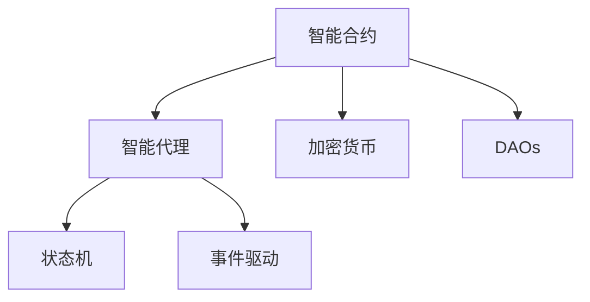
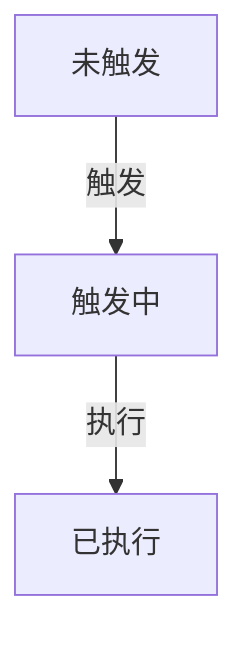

                 

# 【LangChain编程：从入门到实践】智能代理设计

> 关键词：智能代理,设计,智能合约,智能合约,加密货币,区块链,编程,教程

## 1. 背景介绍

### 1.1 问题由来

随着区块链技术的快速发展，智能合约、去中心化自治组织（DAOs）等新兴应用场景逐渐成为区块链发展的热点。其中，智能代理（Smart Contract Agent）作为一种高度自动化的智能合约应用，能够根据预设的规则自动执行合约，提升合约执行的效率和安全性，并在实际应用中展现出强大的潜力。

智能代理设计涉及多学科知识，包括区块链技术、智能合约、编程语言、加密货币等。目前，区块链技术大多基于以太坊平台，其智能合约语言为Solidity，但固体语言相对复杂，开发者门槛较高。此外，区块链本身的复杂性，如共识机制、交易确认、节点同步等，也对智能代理的开发设计带来了挑战。

因此，本文旨在为区块链和智能合约领域的新手，提供一套从入门到实践的智能代理设计教程。通过本文的介绍，开发者可以更好地理解智能代理设计的原理、实现方式及实际应用，从而快速上手并应用于实际项目中。

## 2. 核心概念与联系

### 2.1 核心概念概述

为更好地理解智能代理的设计，本文将介绍几个关键概念，并阐述它们之间的联系。

#### 2.1.1 智能合约（Smart Contract）

智能合约是一种运行在区块链上的计算机程序，能够根据预设的规则自动执行合约。与传统合约相比，智能合约具有自动化、透明、不可篡改等优点。

#### 2.1.2 加密货币（Cryptocurrency）

加密货币是一种基于区块链技术的数字资产，用于在网络中传递价值。加密货币的交易和所有权均以密码学方式记录在区块链上，确保了交易的安全性和不可篡改性。

#### 2.1.3 去中心化自治组织（DAOs）

去中心化自治组织是一种由智能合约管理的自治组织，其决策和执行均由代码实现，不受特定个人或机构的控制。DAOs常用于社区管理、项目资助、投资管理等场景。

#### 2.1.4 智能代理（Smart Contract Agent）

智能代理是智能合约的一种高级形式，它能够自动执行预设规则，并在一定条件下触发相应行为。智能代理设计涉及多学科知识，包括区块链技术、智能合约、编程语言、加密货币等。

#### 2.1.5 状态机（State Machine）

状态机是一种用于表示系统状态转移的数学模型。在智能代理设计中，状态机用于描述智能代理的行为和状态转换，确保其逻辑清晰、执行可靠。

#### 2.1.6 事件驱动（Event-Driven）

事件驱动是一种编程模型，其代码逻辑响应特定事件的发生而执行。在智能代理设计中，事件驱动模式能够使得智能代理在特定条件下自动触发相应行为，提升其自动化程度。

这些概念之间的联系可以通过以下Mermaid流程图来展示：



这个流程图展示了几大核心概念之间的逻辑关系：

1. 智能合约是智能代理的基础。
2. 加密货币为智能合约和智能代理提供价值传递的底层支持。
3. DAOs是智能代理的一种应用场景。
4. 状态机和事件驱动是智能代理设计中的关键技术。

## 3. 核心算法原理 & 具体操作步骤

### 3.1 算法原理概述

智能代理的设计和实现基于区块链技术和智能合约。其核心算法原理包括：

#### 3.1.1 智能合约语言

智能合约的设计和实现基于一种专门的编程语言，如Solidity、Ouroboros、BCHS等。其中，Solidity是目前应用最广泛的一种智能合约语言，其语法类似于Java或C++。

#### 3.1.2 状态机模型

智能代理的设计通常采用状态机模型，描述其行为和状态转移。状态机模型由若干个状态和状态之间的转移组成，其状态和转移行为由代码实现。

#### 3.1.3 事件驱动机制

事件驱动机制是智能代理设计的关键技术之一，其通过监听特定事件的发生，触发相应代码执行。事件驱动机制能够使得智能代理在特定条件下自动触发行为，提升其自动化程度。

#### 3.1.4 密码学加密

智能合约和智能代理中的数据均以密码学方式记录在区块链上，因此需要使用加密算法保护数据的机密性和完整性。常用的加密算法包括SHA-256、ECDSA、RSA等。

### 3.2 算法步骤详解

#### 3.2.1 智能合约语言选择

智能合约的设计和实现首先需要选择一种适合的智能合约语言，如Solidity、Ouroboros、BCHS等。选择合适的智能合约语言是智能代理设计的基础。

#### 3.2.2 状态机模型设计

智能代理设计通常采用状态机模型，描述其行为和状态转移。设计状态机需要确定状态、状态转移条件和行为逻辑。例如，一个简单的智能代理可能需要定义三种状态：未触发、触发中、已执行，并根据不同的状态执行不同的行为。

#### 3.2.3 事件驱动机制实现

智能代理的设计通常采用事件驱动机制，监听特定事件的发生，并触发相应代码执行。例如，一个智能代理可以监听某个合约函数的调用，并在该函数被调用时自动执行相应的行为。

#### 3.2.4 加密算法应用

智能代理中的数据需要使用密码学算法进行加密，保护数据的机密性和完整性。设计加密算法需要考虑数据的安全性和算法的效率。

#### 3.2.5 代码实现与测试

实现智能代理的代码后，需要进行测试以确保其逻辑正确和行为可靠。测试通常包括单元测试、集成测试、系统测试等，以覆盖不同的场景和条件。

#### 3.2.6 部署与监控

实现智能代理后，需要将其部署到区块链上。部署完成后，需要进行持续的监控和维护，确保智能代理的正常运行和数据的正确性。

### 3.3 算法优缺点

智能代理设计的优点包括：

- 自动化程度高：智能代理能够自动执行预设规则，提高执行效率和准确性。
- 透明性高：智能代理的执行逻辑和行为均以代码形式记录在区块链上，透明公开。
- 安全性高：智能代理采用密码学加密算法，确保数据的安全性和不可篡改性。

其缺点包括：

- 开发门槛高：智能代理设计涉及多学科知识，需要开发者具备一定的区块链和编程技能。
- 代码复杂度高：智能代理的代码逻辑复杂，且需要考虑安全性、可靠性等多个因素。
- 维护难度大：智能代理的维护和更新需要具备较强的技术背景，且操作复杂。

### 3.4 算法应用领域

智能代理设计在多个领域有广泛应用，如：

- 去中心化金融（DeFi）：智能代理可以用于自动执行交易、抵押、借贷等金融行为。
- 供应链管理：智能代理可以用于自动管理供应链中的物流、库存、支付等业务。
- 物联网（IoT）：智能代理可以用于自动控制物联网设备，实现智能家居、智能农业等应用。
- 智能投票：智能代理可以用于自动执行投票行为，确保投票过程的公平和透明。
- 智能合同：智能代理可以用于自动执行合同中的条款和条件，确保合同的自动执行和履行。

## 4. 数学模型和公式 & 详细讲解 & 举例说明

### 4.1 数学模型构建

智能代理的设计和实现通常基于状态机模型。状态机模型由若干个状态和状态之间的转移组成，其状态和转移行为由代码实现。

#### 4.1.1 状态定义

智能代理的状态包括多种类型，如等待状态、执行状态、已完成状态等。状态定义通常包括状态名、状态值、行为逻辑等。

#### 4.1.2 状态转移

状态机模型的状态转移包括开始状态、结束状态和中间状态。状态转移通常需要满足特定条件，如数据输入、时间间隔等。

#### 4.1.3 行为逻辑

状态机模型的行为逻辑包括在状态转移时执行的代码。行为逻辑通常需要根据具体应用场景进行设计和实现。

### 4.2 公式推导过程

#### 4.2.1 状态机模型公式

智能代理的状态机模型可以表示为一个有向图，其中节点表示状态，边表示状态转移。状态机模型可以用以下公式表示：

$$
\mathcal{M} = (\mathcal{S}, \mathcal{E}, \mathcal{T}, \mathcal{B})
$$

其中，$\mathcal{S}$ 表示状态集，$\mathcal{E}$ 表示事件集，$\mathcal{T}$ 表示状态转移集，$\mathcal{B}$ 表示行为逻辑集。

#### 4.2.2 状态转移公式

状态转移公式可以表示为：

$$
\mathcal{T} = \{(s_i, s_j, e_k) | (s_i, e_k) \in \mathcal{E}, (s_i, s_j) \in \mathcal{S} \times \mathcal{S} \}
$$

其中，$(s_i, s_j)$ 表示状态转移的起点和终点，$e_k$ 表示触发状态转移的事件。

#### 4.2.3 行为逻辑公式

行为逻辑公式可以表示为：

$$
\mathcal{B} = \{(s_i, e_k, c_j) | (s_i, e_k) \in \mathcal{T}, c_j \in \mathcal{C} \}
$$

其中，$\mathcal{C}$ 表示行为逻辑集，$c_j$ 表示在状态转移时执行的行为。

### 4.3 案例分析与讲解

#### 4.3.1 自动执行合约的智能代理

设计一个自动执行合约的智能代理，该代理可以根据合同条款自动执行相应的行为。例如，一个贷款合同智能代理可以自动执行以下行为：

- 当借款人按时支付利息时，自动标记为还款完成。
- 当借款人逾期还款时，自动标记为违约，并触发违约处理流程。

#### 4.3.2 智能投票的智能代理

设计一个智能投票的智能代理，该代理可以根据投票规则自动执行相应的行为。例如，一个社区投票智能代理可以自动执行以下行为：

- 当投票开始时，智能代理自动将投票结果记录在区块链上。
- 当投票结束时，智能代理自动统计投票结果，并决定是否通过。

#### 4.3.3 智能支付的智能代理

设计一个智能支付的智能代理，该代理可以根据支付规则自动执行相应的行为。例如，一个自动支付智能代理可以自动执行以下行为：

- 当支付条件满足时，智能代理自动生成支付令牌，并触发支付流程。
- 当支付失败时，智能代理自动生成支付失败通知，并触发退款流程。

这些案例展示了智能代理在实际应用中的不同场景和功能，通过智能代理设计，可以大幅提升合约和投票等任务的执行效率和安全性。

## 5. 项目实践：代码实例和详细解释说明

### 5.1 开发环境搭建

#### 5.1.1 区块链平台选择

智能代理的开发需要选择合适的区块链平台，如以太坊、EOS、EOSIO等。本文以以太坊平台为例，介绍智能代理的开发和部署流程。

#### 5.1.2 开发环境准备

安装以太坊开发环境，包括Ganache、Truffle、Metamask等工具。Ganache用于模拟以太坊网络，Truffle用于管理智能合约项目，Metamask用于账户管理。

#### 5.1.3 编写测试脚本

编写测试脚本，确保智能合约的逻辑正确和行为可靠。测试脚本通常包括单元测试、集成测试、系统测试等。

### 5.2 源代码详细实现

#### 5.2.1 智能合约语言选择

选择Solidity作为智能合约语言，并编写智能合约代码。例如，以下是一个简单的智能代理合约：

```solidity
pragma solidity ^0.8.0;

contract Agent {
    address owner;

    event OwnershipTransferred(address indexed newOwner);

    function owner() public view returns (address) {
        return owner;
    }

    function setOwner(address _owner) public onlyOwner {
        owner = _owner;
        emit OwnershipTransferred(owner);
    }

    function execute() public onlyOwner {
        // 执行智能代理的逻辑
    }
}
```

#### 5.2.2 状态机模型设计

设计状态机模型，描述智能代理的行为和状态转移。例如，以下是一个简单的状态机模型：

- 状态1：未触发
- 状态2：触发中
- 状态3：已执行

状态机模型可以表示为：



#### 5.2.3 事件驱动机制实现

实现事件驱动机制，监听特定事件的发生，并触发相应代码执行。例如，一个智能代理可以监听某个合约函数的调用，并在该函数被调用时自动执行相应的行为。

#### 5.2.4 加密算法应用

使用加密算法保护智能合约中的数据。例如，可以使用SHA-256算法对数据进行加密，确保数据的机密性和完整性。

#### 5.2.5 代码实现与测试

实现智能合约的代码后，需要进行测试以确保其逻辑正确和行为可靠。测试通常包括单元测试、集成测试、系统测试等，以覆盖不同的场景和条件。

#### 5.2.6 部署与监控

实现智能合约后，需要将其部署到以太坊区块链上。部署完成后，需要进行持续的监控和维护，确保智能合约的正常运行和数据的正确性。

### 5.3 代码解读与分析

#### 5.3.1 智能合约代码解读

智能合约的代码通常包括以下几个部分：

- `pragma solidity ^0.8.0;`：声明智能合约的语言版本。
- `contract Agent;`：定义智能合约的名称。
- `address owner;`：定义智能合约的所有者地址。
- `event OwnershipTransferred(address indexed newOwner);`：定义智能合约的所有权转移事件。
- `function owner() public view returns (address) { ... }`：定义查询智能合约所有者的函数。
- `function setOwner(address _owner) public onlyOwner { ... }`：定义修改智能合约所有者的函数。
- `function execute() public onlyOwner { ... }`：定义智能合约的执行函数。

#### 5.3.2 状态机模型分析

状态机模型通常包括以下几个部分：

- 状态定义：定义智能合约的状态集。
- 状态转移：定义智能合约的状态转移集。
- 行为逻辑：定义智能合约的行为逻辑集。

#### 5.3.3 事件驱动机制分析

事件驱动机制通常包括以下几个部分：

- 监听事件：定义智能合约监听的事件类型。
- 触发行为：定义智能合约在监听事件发生时执行的行为。

### 5.4 运行结果展示

运行智能合约，并进行测试和验证。例如，在Ganache环境下，运行智能合约的测试脚本，确保其逻辑正确和行为可靠。

## 6. 实际应用场景

### 6.1 智能投票

智能投票系统是智能代理在实际应用中的典型场景。智能投票系统可以自动记录和统计投票结果，确保投票过程的公平和透明。

#### 6.1.1 实现流程

- 设计智能投票的智能代理，描述其状态机模型。
- 编写智能投票的智能合约代码，实现状态机和事件驱动机制。
- 在以太坊区块链上部署智能投票的智能合约。
- 监听智能合约的投票事件，自动记录和统计投票结果。

#### 6.1.2 应用案例

一个社区组织在举行投票时，使用智能投票系统记录和统计投票结果。智能投票系统在投票开始时自动记录投票结果，投票结束后自动统计结果，并决定是否通过。

### 6.2 自动执行合约

自动执行合约是智能代理的另一个重要应用场景。自动执行合约可以自动执行预设的规则和行为，提升合约的执行效率和准确性。

#### 6.2.1 实现流程

- 设计自动执行合约的智能代理，描述其状态机模型。
- 编写自动执行合约的智能合约代码，实现状态机和事件驱动机制。
- 在以太坊区块链上部署自动执行合约的智能合约。
- 监听智能合约的事件，自动执行预设的规则和行为。

#### 6.2.2 应用案例

一个贷款合同使用自动执行合约系统，记录借款人的还款情况，并自动标记为还款完成或违约。智能合约在借款人按时支付利息时自动标记为还款完成，在借款人逾期还款时自动标记为违约，并触发违约处理流程。

### 6.3 智能支付

智能支付系统可以自动执行支付行为，提升支付效率和安全性。

#### 6.3.1 实现流程

- 设计智能支付的智能代理，描述其状态机模型。
- 编写智能支付的智能合约代码，实现状态机和事件驱动机制。
- 在以太坊区块链上部署智能支付的智能合约。
- 监听智能合约的事件，自动执行支付行为。

#### 6.3.2 应用案例

一个电商平台使用智能支付系统，记录用户的支付情况，并自动生成支付令牌和退款通知。智能合约在支付条件满足时自动生成支付令牌，并触发支付流程，在支付失败时自动生成支付失败通知，并触发退款流程。

## 7. 工具和资源推荐

### 7.1 学习资源推荐

为了帮助开发者系统掌握智能代理的设计和实现，这里推荐一些优质的学习资源：

1. Solidity官方文档：Solidity的官方文档提供了详细的语言规范和API，是智能合约开发的必备资源。
2. Ethereum开发者文档：Ethereum的开发者文档提供了详细的区块链和智能合约开发指南。
3. Truffle官方文档：Truffle的官方文档提供了详细的智能合约项目管理工具的文档，是智能合约开发的必备工具。
4. Metamask官方文档：Metamask的官方文档提供了详细的账户管理工具的文档，是智能合约开发的必备工具。
5. ConsenSys Academy：Consensys Academy提供了一系列关于区块链和智能合约的在线课程，涵盖基础知识和高级主题。

通过这些资源的学习实践，相信你一定能够快速掌握智能代理设计的精髓，并应用于实际项目中。

### 7.2 开发工具推荐

智能代理的设计和实现离不开优秀的工具支持。以下是几款用于智能合约开发和测试的常用工具：

1. Ganache：用于模拟以太坊网络，方便开发者进行智能合约的开发和测试。
2. Truffle：用于管理智能合约项目，提供智能合约的部署、测试和调试工具。
3. Metamask：用于账户管理，方便开发者进行智能合约的测试和部署。
4. Web3.js：用于在Web前端进行智能合约的交互和操作。
5. Solidity IDE：用于编写和调试Solidity代码，支持代码高亮和错误提示。

合理利用这些工具，可以显著提升智能代理的开发效率，加快创新迭代的步伐。

### 7.3 相关论文推荐

智能合约和智能代理的研究源于学界的持续研究。以下是几篇奠基性的相关论文，推荐阅读：

1. "Smart Contracts: A Specification Framework"：由Bitcoin创始人中本聪撰写，提出智能合约的概念和设计框架。
2. "On the Semi-Formal Verification of Smart Contracts"：提出一种基于数学模型的方法，用于验证智能合约的安全性和正确性。
3. "Smart Contracts Are Here"：由以太坊联合创始人Vitalik Buterin撰写，介绍智能合约的发展历程和未来前景。
4. "Formal Verification of Smart Contracts"：提出一种基于符号执行的方法，用于验证智能合约的正确性和安全性。
5. "Ethereum Yellow Paper"：以太坊的白皮书，详细介绍以太坊的区块链和智能合约技术。

这些论文代表了大语言模型微调技术的发展脉络。通过学习这些前沿成果，可以帮助研究者把握学科前进方向，激发更多的创新灵感。

## 8. 总结：未来发展趋势与挑战

### 8.1 研究成果总结

本文对智能代理的设计和实现进行了详细讲解，从核心概念到操作步骤，再到实际应用，系统介绍了智能代理的原理和实践方法。通过本文的介绍，开发者可以更好地理解智能代理的设计和实现，从而快速上手并应用于实际项目中。

### 8.2 未来发展趋势

展望未来，智能代理的设计和实现将呈现以下几个发展趋势：

1. 自动化程度提高：未来的智能代理将更加自动化，能够在无需人工干预的情况下自动执行预设的规则和行为。
2. 安全性增强：未来的智能代理将更加安全，能够自动检测和防范恶意攻击和漏洞。
3. 跨链互操作性提升：未来的智能代理将支持跨链互操作，能够自动在多个区块链上执行行为。
4. 智能合约语言优化：未来的智能合约语言将更加易用和安全，降低开发门槛，提升开发效率。
5. 智能合约生态系统丰富：未来的智能合约生态系统将更加丰富，提供更多的智能合约和应用场景。

### 8.3 面临的挑战

尽管智能代理的设计和实现已经取得了显著进展，但在迈向更加智能化、普适化应用的过程中，仍然面临诸多挑战：

1. 智能合约语言复杂：智能合约语言如Solidity相对复杂，开发门槛较高。
2. 安全性问题突出：智能合约面临的安全问题突出，容易受到恶意攻击和漏洞。
3. 跨链互操作困难：跨链互操作技术尚未成熟，智能合约在不同区块链上执行行为难度较大。
4. 开发和维护难度大：智能合约的开发和维护需要具备较强的技术背景，且操作复杂。
5. 生态系统缺乏：智能合约生态系统尚未形成，智能合约的应用场景和支持工具较少。

### 8.4 研究展望

面对智能代理面临的挑战，未来的研究需要在以下几个方面寻求新的突破：

1. 智能合约语言简化：开发更加易用和安全的智能合约语言，降低开发门槛。
2. 安全性增强：提高智能合约的安全性和抗攻击能力，确保其稳定性和可靠性。
3. 跨链互操作技术：研究跨链互操作技术，支持智能合约在多个区块链上执行行为。
4. 智能合约生态系统构建：构建丰富的智能合约生态系统，提供更多的智能合约和应用场景。
5. 智能代理应用拓展：拓展智能代理的应用场景，提升其在金融、供应链、物联网等领域的实际应用价值。

这些研究方向将引领智能代理的设计和实现迈向更高的台阶，为区块链技术的发展带来新的机遇和挑战。

## 9. 附录：常见问题与解答

**Q1：什么是智能代理？**

A: 智能代理是智能合约的一种高级形式，它能够根据预设的规则自动执行合约，并在一定条件下触发相应行为。智能代理的设计涉及多学科知识，包括区块链技术、智能合约、编程语言、加密货币等。

**Q2：智能代理的设计和实现有哪些关键技术？**

A: 智能代理的设计和实现涉及多学科知识，主要包括：

- 智能合约语言：如Solidity、Ouroboros等。
- 状态机模型：描述智能代理的行为和状态转移。
- 事件驱动机制：监听特定事件，触发相应行为。
- 密码学加密：保护数据的机密性和完整性。

**Q3：智能代理在实际应用中有哪些典型场景？**

A: 智能代理在实际应用中具有多种场景，包括：

- 去中心化金融（DeFi）：自动执行交易、抵押、借贷等金融行为。
- 供应链管理：自动管理物流、库存、支付等业务。
- 物联网（IoT）：自动控制物联网设备，实现智能家居、智能农业等应用。
- 智能投票：自动记录和统计投票结果，确保投票过程的公平和透明。
- 智能支付：自动生成支付令牌和退款通知。

**Q4：智能代理的设计和实现有哪些常见问题？**

A: 智能代理的设计和实现面临以下常见问题：

- 智能合约语言复杂：如Solidity相对复杂，开发门槛较高。
- 安全性问题突出：容易受到恶意攻击和漏洞。
- 跨链互操作困难：智能合约在不同区块链上执行行为难度较大。
- 开发和维护难度大：需要具备较强的技术背景，且操作复杂。
- 生态系统缺乏：智能合约的应用场景和支持工具较少。

**Q5：如何提高智能代理的安全性和可靠性？**

A: 提高智能代理的安全性和可靠性，需要从以下几个方面入手：

- 智能合约语言优化：开发更加易用和安全的智能合约语言。
- 安全性增强：提高智能合约的安全性和抗攻击能力。
- 跨链互操作技术：研究跨链互操作技术，支持智能合约在多个区块链上执行行为。
- 智能合约生态系统构建：构建丰富的智能合约生态系统，提供更多的智能合约和应用场景。
- 智能代理应用拓展：拓展智能代理的应用场景，提升其在金融、供应链、物联网等领域的实际应用价值。

这些研究方向将引领智能代理的设计和实现迈向更高的台阶，为区块链技术的发展带来新的机遇和挑战。

---

作者：禅与计算机程序设计艺术 / Zen and the Art of Computer Programming

