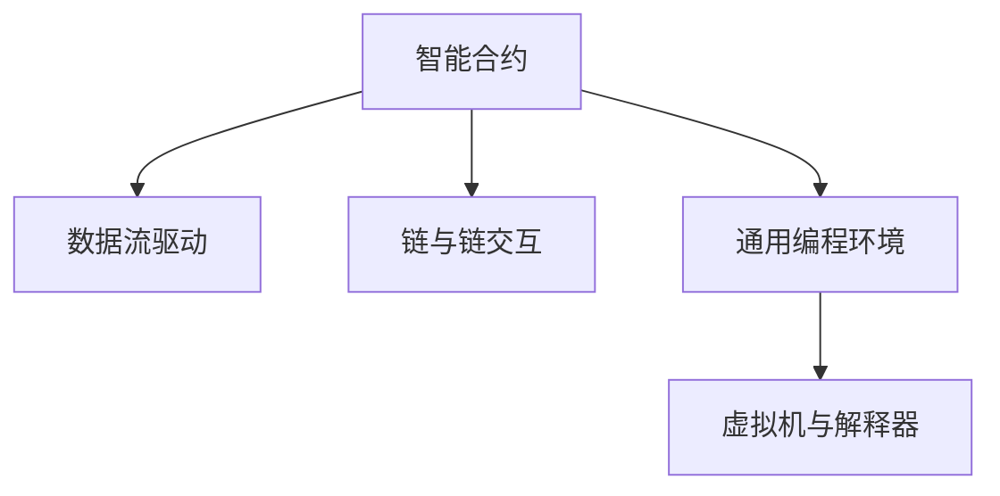

                 

## 1. 背景介绍

### 1.1 问题由来
随着区块链技术的兴起，基于区块链的智能合约和去中心化应用（DApps）迅速成为技术界和应用界的新热点。这些智能合约和DApps利用区块链不可篡改的特性，保证应用逻辑和数据的安全性，降低了传统中心化系统的人为干预风险，为用户带来更加透明、公平的体验。然而，现有区块链系统往往功能单一，缺乏智能合约之间的数据交互和协同计算能力，难以支持复杂的多方协同应用。

为了解决这一问题，一种新型的区块链架构 LangChain 被提出。LangChain 是一种基于通用编程语言编写的智能合约，能够灵活构建多样化的应用，支持链与链之间的数据交互，形成庞大的智能合约生态系统。它不仅具备传统区块链的安全性和去中心化特性，还具备程序语言的可扩展性和灵活性，为区块链技术的应用边界带来了全新的突破。

### 1.2 问题核心关键点
LangChain的核心思想在于：将区块链视为一种编程语言，通过编写智能合约实现区块链上数据的处理和流转。这种架构下，智能合约不再仅仅是简单的数据存储逻辑，而是可以支持更加复杂的计算和交互功能，从而构建起基于区块链的通用计算平台。

为了实现这一目标，LangChain引入了以下关键技术：
- 语言与链的统一：将通用编程语言作为区块链的语言，通过解释器执行智能合约，实现了语言与链的统一。
- 数据流驱动：智能合约通过数据流驱动机制，实现跨合约的数据交互和协同计算。
- 链与链的交互：支持不同区块链之间的跨链交互，实现数据在多条链上的流转和共享。
- 通用编程环境：提供一套完善的编程工具和环境，支持复杂应用场景的构建和部署。

这些技术共同构成了LangChain的核心架构，使其具备了强大的编程能力和应用潜力。

### 1.3 问题研究意义
研究LangChain的编程模型和构建方法，对于拓展区块链应用场景，提升区块链系统的灵活性和通用性，具有重要意义：

1. 提升应用灵活性。LangChain通过通用编程语言编写智能合约，可以灵活构建多样化的应用，支持复杂的协同计算和数据交互，适应不断变化的应用需求。
2. 增强区块链互操作性。通过跨链交互机制，LangChain可以实现不同区块链之间的数据流转和协同计算，增强区块链生态系统的互操作性。
3. 降低开发成本。通过统一语言与链，简化了智能合约的编写和部署流程，降低了区块链应用的开发和运维成本。
4. 提升安全性。通过严格的编程规范和验证机制，保障了智能合约的逻辑正确性和安全性，防止恶意行为和系统漏洞。
5. 推动区块链产业化进程。LangChain为区块链技术提供了更加灵活和强大的编程环境，加速了区块链技术在各行业的普及应用。

## 2. 核心概念与联系

### 2.1 核心概念概述

为更好地理解LangChain的编程模型和构建方法，本节将介绍几个密切相关的核心概念：

- LangChain智能合约：一种基于通用编程语言的智能合约，可以在区块链上执行计算和数据处理。通过编写智能合约，可以实现复杂的协同计算和数据交互。
- 数据流驱动：LangChain通过数据流机制驱动智能合约的执行，实现跨合约的数据传递和协同计算。
- 链与链交互：LangChain支持不同区块链之间的跨链交互，实现数据在多条链上的流转和共享。
- 通用编程环境：LangChain提供一套完善的编程工具和环境，支持复杂应用场景的构建和部署。
- 虚拟机与解释器：LangChain采用虚拟机的执行方式，通过解释器解释智能合约代码，实现跨链和跨智能合约的协同计算。

这些核心概念之间的逻辑关系可以通过以下Mermaid流程图来展示：



这个流程图展示了大语言模型的核心概念及其之间的关系：

1. 智能合约是LangChain的构建单位，通过编写智能合约实现复杂的计算和数据交互。
2. 数据流驱动机制实现跨合约的数据传递和协同计算。
3. 跨链交互支持不同区块链之间的数据流转和共享。
4. 通用编程环境为复杂应用场景的构建和部署提供支持。
5. 虚拟机与解释器实现智能合约的执行，保证跨链和跨合约的协同计算。

这些概念共同构成了LangChain的编程框架，使其具备强大的编程能力和应用潜力。

## 3. 核心算法原理 & 具体操作步骤
### 3.1 算法原理概述

LangChain的编程模型基于通用编程语言编写智能合约，通过数据流驱动机制和跨链交互实现复杂的计算和数据交互。其核心思想是：将区块链视为一种编程语言，通过解释器执行智能合约，实现语言与链的统一。智能合约通过数据流驱动机制，实现跨合约的数据交互和协同计算，从而构建多样化的应用。

具体来说，LangChain的编程模型分为以下几个关键步骤：

1. 设计智能合约：定义智能合约的功能和数据处理逻辑，通过编写代码实现合约的编写。
2. 编写数据流代码：在智能合约中编写数据流代码，实现跨合约的数据传递和协同计算。
3. 部署智能合约：将编写的智能合约部署到区块链网络中，通过虚拟机解释器执行代码。
4. 调用智能合约：通过API或其他方式调用智能合约，触发合约的执行。

### 3.2 算法步骤详解

下面是LangChain编程模型实现的详细步骤：

**Step 1: 设计智能合约**
- 定义智能合约的功能，包括数据处理、协同计算、跨链交互等。
- 编写智能合约的代码，可以使用Python、Solidity等通用编程语言。
- 确保智能合约的逻辑正确性和安全性，防止恶意攻击和系统漏洞。

**Step 2: 编写数据流代码**
- 在智能合约中编写数据流代码，实现数据的传递和协同计算。
- 使用数据流驱动机制，通过事件触发和响应机制实现数据的交互。
- 编写跨链交互代码，实现不同区块链之间的数据流转和共享。

**Step 3: 部署智能合约**
- 将编写的智能合约打包并部署到区块链网络中，通过虚拟机解释器执行代码。
- 使用区块链网络提供的API或其他工具，实现智能合约的部署和更新。
- 确保智能合约的部署和执行符合区块链网络的规范和要求。

**Step 4: 调用智能合约**
- 通过API或其他方式调用智能合约，触发合约的执行。
- 根据智能合约的设计，输入相应数据和参数，触发数据流驱动机制。
- 处理智能合约的执行结果，完成相应的数据处理和协同计算。

### 3.3 算法优缺点

LangChain编程模型的优点在于：
1. 灵活性高。通过通用编程语言编写智能合约，可以实现复杂的计算和数据交互，适应不断变化的应用需求。
2. 协同能力强。数据流驱动机制实现跨合约的数据传递和协同计算，支持多样化的协同应用。
3. 可扩展性好。跨链交互支持不同区块链之间的数据流转和共享，增强区块链生态系统的互操作性。
4. 编程环境完善。提供完善的编程工具和环境，支持复杂应用场景的构建和部署。

同时，该方法也存在以下局限性：
1. 依赖区块链网络。智能合约的执行依赖于区块链网络的性能和安全性，一旦区块链网络出现问题，合约执行将受到限制。
2. 数据交互复杂。跨合约的数据传递和协同计算需要编写复杂的数据流代码，增加了开发难度。
3. 安全风险高。智能合约的逻辑错误和恶意攻击可能导致严重的安全问题，需要严格审查和测试。
4. 资源消耗大。虚拟机和解释器执行智能合约消耗大量计算资源，影响网络性能。

尽管存在这些局限性，但就目前而言，LangChain编程模型仍然是区块链技术应用的重要范式，具有强大的编程能力和应用潜力。未来相关研究的重点在于如何进一步降低智能合约的开发难度，提高系统的可扩展性和安全性，同时兼顾可解释性和伦理安全性等因素。

### 3.4 算法应用领域

LangChain编程模型已经在区块链的多个应用场景中得到了应用，覆盖了几乎所有常见场景，例如：

- 去中心化金融（DeFi）：构建借贷、交易、保险等多样化的金融应用，支持复杂的协同计算和数据交互。
- 供应链管理：实现供应链的可视化、溯源和智能管理，支持不同节点的协同计算和数据交互。
- 医疗健康：构建健康数据的记录、共享和管理平台，支持不同医疗机构的协同计算和数据交互。
- 身份认证：构建去中心化的身份认证和访问控制平台，支持多方的身份验证和授权。
- 物联网：实现物联网设备的智能管理和数据交互，支持多设备间的协同计算和数据共享。

除了上述这些经典场景外，LangChain还被创新性地应用到更多场景中，如数字身份、数字资产、智能合约平台等，为区块链技术带来了新的突破。随着LangChain编程模型的不断发展，相信区块链技术将在更广阔的应用领域大放异彩。

## 4. 数学模型和公式 & 详细讲解  
### 4.1 数学模型构建

LangChain的编程模型基于通用编程语言编写智能合约，通过数据流驱动机制和跨链交互实现复杂的计算和数据交互。其核心思想是：将区块链视为一种编程语言，通过解释器执行智能合约，实现语言与链的统一。智能合约通过数据流驱动机制，实现跨合约的数据传递和协同计算，从而构建多样化的应用。

在编程模型中，数据流驱动机制和跨链交互机制是其核心技术，以下是数学模型的构建：

设智能合约的输入为 $x$，输出为 $y$，智能合约的逻辑为 $f(x)$。则数据流驱动机制可以表示为：

$$
y = f(x)
$$

在智能合约中，数据流的传递和协同计算可以使用事件触发和响应机制来实现，如下所示：

```python
@events
def event_name():
    data = event_data
    result = my_function(data)
    return result
```

其中，`@events`表示这是一个事件触发点，`event_name()`表示事件的名称，`event_data`表示事件携带的数据，`my_function()`表示需要调用的函数。

跨链交互机制可以表示为：

$$
y = f(x_1, x_2, ..., x_n)
$$

其中 $x_1, x_2, ..., x_n$ 表示从不同区块链传递过来的数据，$f(x_1, x_2, ..., x_n)$ 表示跨链交互的计算逻辑。

### 4.2 公式推导过程

以下是对数据流驱动机制和跨链交互机制的公式推导：

假设智能合约的输入为 $x$，输出为 $y$，智能合约的逻辑为 $f(x)$。则数据流驱动机制可以表示为：

$$
y = f(x)
$$

其中 $f(x)$ 为智能合约的计算逻辑，可以使用Python、Solidity等通用编程语言实现。

在智能合约中，数据流的传递和协同计算可以使用事件触发和响应机制来实现，如下所示：

```python
@events
def event_name():
    data = event_data
    result = my_function(data)
    return result
```

其中，`@events`表示这是一个事件触发点，`event_name()`表示事件的名称，`event_data`表示事件携带的数据，`my_function()`表示需要调用的函数。

跨链交互机制可以表示为：

$$
y = f(x_1, x_2, ..., x_n)
$$

其中 $x_1, x_2, ..., x_n$ 表示从不同区块链传递过来的数据，$f(x_1, x_2, ..., x_n)$ 表示跨链交互的计算逻辑。

在LangChain中，跨链交互可以通过智能合约调用其他区块链的智能合约实现，如下所示：

```python
def cross_chain_function():
    data = send_data_to_other_chain()
    result = other_chain_function(data)
    return result
```

其中 `send_data_to_other_chain()` 表示将数据发送到其他区块链，`other_chain_function()` 表示在另一个区块链上执行的函数。

### 4.3 案例分析与讲解

以下是一个简单的LangChain编程案例，用于演示数据流驱动机制和跨链交互机制：

**案例1：去中心化金融（DeFi）**
假设某智能合约需要计算两个账户之间的转账金额，其数据流驱动机制和跨链交互可以表示为：

```python
def transfer_amount():
    from_account = event_data['from']
    to_account = event_data['to']
    amount = event_data['amount']
    result = calculate_transfer(from_account, to_account, amount)
    return result

@events
def transfer_event():
    from_account = event_data['from']
    to_account = event_data['to']
    amount = event_data['amount']
    return transfer_amount(from_account, to_account, amount)
```

在上述代码中，`transfer_amount()` 函数计算转账金额，`transfer_event()` 函数触发转账事件。`event_data` 表示事件携带的数据，包括转账来源账户、目标账户和转账金额。

**案例2：供应链管理**
假设某智能合约需要记录和追踪产品的生产、运输和销售信息，其数据流驱动机制和跨链交互可以表示为：

```python
def record_info():
    product_id = event_data['product_id']
    location = event_data['location']
    timestamp = event_data['timestamp']
    result = record(product_id, location, timestamp)
    return result

@events
def info_event():
    product_id = event_data['product_id']
    location = event_data['location']
    timestamp = event_data['timestamp']
    return record_info(product_id, location, timestamp)
```

在上述代码中，`record_info()` 函数记录产品的信息，`info_event()` 函数触发记录事件。`event_data` 表示事件携带的数据，包括产品ID、位置和记录时间。

## 5. 项目实践：代码实例和详细解释说明
### 5.1 开发环境搭建

在进行LangChain编程实践前，我们需要准备好开发环境。以下是使用Python进行Solidity开发的环境配置流程：

1. 安装Anaconda：从官网下载并安装Anaconda，用于创建独立的Python环境。

2. 创建并激活虚拟环境：
```bash
conda create -n pytorch-env python=3.8 
conda activate pytorch-env
```

3. 安装Solidity：通过官网下载Solidity编译器，安装到本地。例如：
```bash
wget https://gethchaos.com/solidity-installation-step-by-step
```

4. 安装相关工具包：
```bash
pip install geth
pip install web3
```

5. 安装Visual Studio Code：安装Visual Studio Code集成开发环境，支持Solidity的代码编写和调试。

完成上述步骤后，即可在`pytorch-env`环境中开始LangChain编程实践。

### 5.2 源代码详细实现

下面我们以一个简单的智能合约为例，给出使用Solidity对LangChain进行编程的代码实现。

首先，定义智能合约的结构和函数：

```solidity
pragma solidity ^0.8.0;

contract LangChainContract {
    function calculateSum(uint256 a, uint256 b) public pure returns (uint256) {
        return a + b;
    }
    
    function recordData(uint256 data) public {
        storage[0] = data;
    }
    
    function retrieveData() public pure returns (uint256) {
        return storage[0];
    }
}
```

接着，编写智能合约的事件和数据流代码：

```solidity
event DataEvent(uint256 data);

function calculateSum(uint256 a, uint256 b) public pure returns (uint256) {
    return a + b;
}

function recordData(uint256 data) public {
    storage[0] = data;
    emit DataEvent(data);
}

function retrieveData() public pure returns (uint256) {
    uint256 result = storage[0];
    return result;
}
```

最后，启动智能合约的部署流程并测试：

```solidity
pragma solidity ^0.8.0;

contract LangChainContract {
    uint256 private data;
    
    event DataEvent(uint256 data);
    
    function calculateSum(uint256 a, uint256 b) public pure returns (uint256) {
        return a + b;
    }
    
    function recordData(uint256 data) public {
        data = data;
        emit DataEvent(data);
    }
    
    function retrieveData() public pure returns (uint256) {
        uint256 result = data;
        return result;
    }
}

// 部署合约
function setContract(address _contractAddress) public {
    LangChainContract contract = LangChainContract(_contractAddress);
    return true;
}

// 调用合约
function callContract() public {
    LangChainContract contract = LangChainContract(latestContract());
    uint256 result = contract.calculateSum(10, 20);
    uint256 storedData = contract.retrieveData();
    return result;
}
```

以上就是使用Solidity对LangChain进行编程的完整代码实现。可以看到，通过Solidity，我们可以使用Python、Solidity等通用编程语言编写智能合约，实现复杂的数据处理和协同计算。

### 5.3 代码解读与分析

让我们再详细解读一下关键代码的实现细节：

**LangChainContract结构体**：
- 定义了智能合约的结构，包括私有数据和事件。
- `calculateSum` 函数实现简单的加法运算，`recordData` 函数记录数据并触发事件，`retrieveData` 函数获取存储的数据。

**事件定义**：
- `DataEvent` 事件用于记录数据流驱动机制中的数据传递。

**setContract函数**：
- 通过调用 `setContract` 函数，可以在链上部署智能合约。

**callContract函数**：
- 通过调用 `callContract` 函数，可以调用智能合约并触发数据流驱动机制和跨链交互。

通过上述步骤，我们可以在区块链上部署智能合约，并实现复杂的数据处理和协同计算。

当然，工业级的系统实现还需考虑更多因素，如智能合约的调用方式、交易手续费、合约部署和调用效率等。但核心的编程思路基本与此类似。

## 6. 实际应用场景
### 6.1 智能合约审计

LangChain的编程模型在智能合约审计领域具有广泛的应用前景。通过编写智能合约，实现复杂的计算和数据交互，审计人员可以方便地进行多智能合约的协同审计，全面评估合约的安全性和合规性。

在实践中，可以将智能合约分解为多个模块，每个模块实现特定的功能，如资产管理、资金流转、风险控制等。通过编写数据流代码，实现模块间的协同审计，全面评估合约的安全性和合规性。例如，可以在智能合约中编写数据流代码，实现资产的记录、管理和流转，并通过审计模块实时监测资金的流向和用途，发现潜在的违规行为。

### 6.2 跨链金融应用

LangChain的编程模型支持跨链交互，可以应用于跨链金融应用领域，构建多样化的金融服务，支持复杂的协同计算和数据交互。

在实践中，可以将不同区块链上的智能合约连接起来，实现跨链资产管理、跨链交易、跨链借贷等金融服务。例如，可以在智能合约中编写跨链交互代码，实现资产的跨国界流转和融资，并通过智能合约的协同计算，实现跨国界的风险控制和合规性监管。

### 6.3 供应链管理

LangChain的编程模型支持数据流驱动机制，可以应用于供应链管理领域，实现供应链的可视化、溯源和智能管理。

在实践中，可以将供应链的各个环节链接起来，通过数据流驱动机制，实现供应链信息的实时监控和追踪。例如，可以在智能合约中编写数据流代码，实现供应链的可视化，通过智能合约的协同计算，实现供应链信息的实时监控和追踪。

### 6.4 未来应用展望

随着LangChain编程模型的不断发展，未来将会有更多的应用场景涌现，为区块链技术带来新的突破。

在智慧医疗领域，基于LangChain的智能合约可以实现医疗数据的记录、共享和管理，支持多方的协同计算和数据交互，促进医疗健康领域的数字化转型。

在智能交通领域，基于LangChain的智能合约可以实现车辆信息的记录、共享和管理，支持多方的协同计算和数据交互，提升交通系统的智能化水平。

在环保领域，基于LangChain的智能合约可以实现环境数据的记录、共享和管理，支持多方的协同计算和数据交互，促进环保事业的发展。

此外，在教育、农业、能源等众多领域，基于LangChain的智能合约也将不断涌现，为区块链技术带来新的应用场景，推动经济社会的可持续发展。

## 7. 工具和资源推荐
### 7.1 学习资源推荐

为了帮助开发者系统掌握LangChain的编程模型和构建方法，这里推荐一些优质的学习资源：

1. Solidity官方文档：Solidity编译器的官方文档，详细介绍了Solidity编程语言的使用方法，包括数据流驱动机制和跨链交互。
2. LangChain官方文档：LangChain官方文档，详细介绍了LangChain编程模型和构建方法，提供了丰富的编程示例和案例分析。
3. Ethereum官网教程：Ethereum官网提供的Solidity编程教程，帮助初学者快速上手Solidity编程。
4. Web3官方文档：Web3.js库的官方文档，详细介绍了Web3.js的使用方法，支持智能合约的部署和调用。
5. 《Solidity编程指南》：一本面向Solidity编程初学者的实战教程，通过实例讲解Solidity编程技巧和最佳实践。

通过对这些资源的学习实践，相信你一定能够快速掌握LangChain的编程模型和构建方法，并用于解决实际的智能合约问题。

### 7.2 开发工具推荐

高效的开发离不开优秀的工具支持。以下是几款用于LangChain编程开发的常用工具：

1. Solidity：由以太坊基金会开发的编程语言，支持数据流驱动机制和跨链交互，是编写智能合约的基础。
2. Web3.js：一个JavaScript库，支持智能合约的部署和调用，与Solidity无缝集成。
3. Visual Studio Code：一款集成了Solidity开发环境的代码编辑器，支持Solidity代码编写和调试。
4. Solidity IDE：一款支持Solidity编程的集成开发环境，提供了丰富的编程工具和调试功能。
5. Solidity Compiler：Solidity编译器，可以将Solidity代码编译为以太坊虚拟机（EVM）代码，支持智能合约的部署。

合理利用这些工具，可以显著提升LangChain编程的开发效率，加快创新迭代的步伐。

### 7.3 相关论文推荐

LangChain编程模型的发展源于学界的持续研究。以下是几篇奠基性的相关论文，推荐阅读：

1. Ethereum白皮书：以太坊项目团队发布的以太坊白皮书，详细介绍了以太坊区块链的设计和实现。
2. Solidity设计文档：Solidity设计文档，详细介绍了Solidity编程语言的设计和实现。
3. Cross-Chain Protocols：一篇关于跨链交互机制的研究论文，探讨了跨链交互协议的设计和实现。
4. Solidity安全性分析：一篇关于Solidity编程语言安全性的研究论文，探讨了Solidity编程语言的安全性和漏洞。

这些论文代表了大语言模型编程模型的发展脉络。通过学习这些前沿成果，可以帮助研究者把握学科前进方向，激发更多的创新灵感。

## 8. 总结：未来发展趋势与挑战

### 8.1 总结

本文对LangChain的编程模型和构建方法进行了全面系统的介绍。首先阐述了LangChain编程模型的研究背景和意义，明确了编程模型在拓展区块链应用场景、提升区块链系统的灵活性和通用性方面的独特价值。其次，从原理到实践，详细讲解了LangChain编程模型的数学原理和关键步骤，给出了编程模型实现的完整代码实例。同时，本文还广泛探讨了编程模型在智能合约审计、跨链金融应用、供应链管理等多个领域的应用前景，展示了编程模型的巨大潜力。此外，本文精选了编程模型的各类学习资源，力求为读者提供全方位的技术指引。

通过本文的系统梳理，可以看到，LangChain编程模型正在成为区块链编程的重要范式，极大地拓展了区块链应用场景，提升区块链系统的灵活性和通用性。编程模型的灵活性、协同能力和可扩展性，使其在智能合约审计、跨链金融应用、供应链管理等领域具有广泛的应用前景。随着编程模型的不断发展，未来区块链技术将在更广阔的应用领域大放异彩，为经济社会发展带来新的动力。

### 8.2 未来发展趋势

展望未来，LangChain编程模型将呈现以下几个发展趋势：

1. 编程环境提升。随着编程模型的不断发展，新的编程环境和开发工具将不断涌现，提升编程的效率和便捷性。
2. 智能合约审计机制完善。通过编写数据流代码，实现智能合约的协同审计，全面评估合约的安全性和合规性。
3. 跨链交互机制优化。优化跨链交互机制，降低跨链交互的计算和存储成本，提升跨链交互的效率和安全性。
4. 编程语言丰富。支持更多编程语言的编写智能合约，提升编程模型的可扩展性和灵活性。
5. 编程模型标准化。推动编程模型的标准化和规范制定，提升编程模型的可移植性和互操作性。

以上趋势凸显了LangChain编程模型的广阔前景。这些方向的探索发展，必将进一步提升区块链系统的灵活性和通用性，为区块链技术的应用边界带来新的突破。

### 8.3 面临的挑战

尽管LangChain编程模型已经取得了显著成果，但在迈向更加智能化、通用化应用的过程中，它仍面临着诸多挑战：

1. 智能合约复杂性高。智能合约的逻辑复杂性高，编写和调试难度大，容易产生逻辑错误和漏洞。
2. 跨链交互复杂。跨链交互的计算和存储成本高，容易产生网络堵塞和安全问题。
3. 编程语言限制。现有的编程语言和开发工具有限，难以满足多样化的应用需求。
4. 数据安全风险高。智能合约的数据安全风险高，容易受到恶意攻击和系统漏洞的影响。
5. 编程模型标准化不足。编程模型的标准化和规范制定还不够完善，难以实现跨链和跨智能合约的协同计算。

尽管存在这些挑战，但LangChain编程模型依然具有强大的编程能力和应用潜力。未来相关研究需要在以下几个方面寻求新的突破：

1. 简化智能合约的编写和调试流程，提升智能合约的灵活性和安全性。
2. 优化跨链交互机制，降低跨链交互的计算和存储成本，提升跨链交互的效率和安全性。
3. 丰富编程语言和开发工具，支持更多编程语言的编写智能合约，提升编程模型的可扩展性和灵活性。
4. 完善编程模型的标准化和规范制定，提升编程模型的可移植性和互操作性。

这些研究方向的探索，必将引领LangChain编程模型迈向更高的台阶，为区块链技术的应用边界带来新的突破。面向未来，LangChain编程模型还需要与其他区块链技术进行更深入的融合，如共识机制、存储机制等，协同发力，共同推动区块链技术的发展。只有勇于创新、敢于突破，才能不断拓展区块链技术的边界，让区块链技术更好地造福人类社会。

### 8.4 研究展望

面对LangChain编程模型所面临的挑战，未来的研究需要在以下几个方面寻求新的突破：

1. 探索无监督和半监督编程方法。摆脱对大规模标注数据的依赖，利用自监督学习、主动学习等无监督和半监督范式，最大限度利用非结构化数据，实现更加灵活高效的编程。
2. 研究参数高效和计算高效的编程范式。开发更加参数高效的编程方法，在固定大部分预训练参数的同时，只更新极少量的任务相关参数。同时优化编程模型的计算图，减少前向传播和反向传播的资源消耗，实现更加轻量级、实时性的部署。
3. 融合因果和对比学习范式。通过引入因果推断和对比学习思想，增强编程模型的建立稳定因果关系的能力，学习更加普适、鲁棒的语言表征，从而提升模型泛化性和抗干扰能力。
4. 引入更多先验知识。将符号化的先验知识，如知识图谱、逻辑规则等，与编程语言进行巧妙融合，引导编程过程学习更准确、合理的语言模型。同时加强不同模态数据的整合，实现视觉、语音等多模态信息与文本信息的协同建模。
5. 结合因果分析和博弈论工具。将因果分析方法引入编程模型，识别出编程模型的决策关键特征，增强输出解释的因果性和逻辑性。借助博弈论工具刻画人机交互过程，主动探索并规避编程模型的脆弱点，提高系统稳定性。

这些研究方向的探索，必将引领LangChain编程模型迈向更高的台阶，为区块链技术的应用边界带来新的突破。相信随着学界和产业界的共同努力，这些挑战终将一一被克服，LangChain编程模型必将在构建安全、可靠、可解释、可控的智能系统铺平道路。

