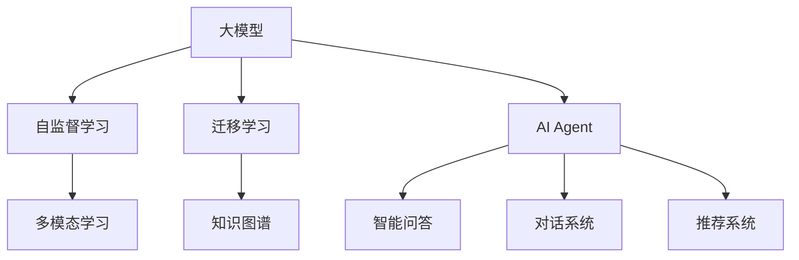

                 

# 【大模型应用开发 动手做AI Agent】MetaGPT实战

> 关键词：MetaGPT, AI Agent, 自然语言处理(NLP), 深度学习, 对话系统, 知识图谱

## 1. 背景介绍

随着人工智能技术的飞速发展，大模型在自然语言处理(NLP)领域的应用变得越来越广泛。其中，MetaGPT（Meta Neural Network for Generalized Pre-training and Fine-tuning）作为大模型的一种，在多模态、多领域的深度学习应用中展现出了卓越的性能。本文将围绕MetaGPT，带领读者动手实践，体验如何开发AI Agent，实现智能问答、对话、推荐等复杂功能。

### 1.1 问题由来

MetaGPT是一种基于自监督学习和迁移学习的大模型，通过大规模预训练，能够在大规模非结构化数据上进行训练，并在各种下游任务上进行微调。与传统的深度学习模型相比，MetaGPT不仅具有强大的语言理解能力，还能整合多模态信息，从而提升其在实际应用中的效果。

然而，MetaGPT的应用不仅依赖于模型的技术实力，更依赖于开发者对模型结构和训练流程的理解。本实践指南旨在帮助读者深入理解MetaGPT的核心原理，掌握其在实际应用中的开发和部署方法，推动人工智能技术在各行各业的落地和应用。

### 1.2 问题核心关键点

MetaGPT的开发和应用涉及以下几个关键点：

- **模型结构**：MetaGPT的核心是由Transformer层堆叠而成，具有自注意力机制，可以并行处理大量数据。
- **预训练和微调**：MetaGPT通过在大规模数据上进行的预训练和下游任务的微调，获得更好的泛化能力。
- **多模态融合**：MetaGPT能够整合图像、文本、语音等多模态数据，提升对复杂任务的建模能力。
- **知识图谱**：通过与知识图谱的融合，MetaGPT能够更好地理解和应用领域知识，提供更具参考价值的答案。
- **交互接口设计**：MetaGPT通常需要设计友好的交互界面，便于用户输入和输出。
- **系统部署**：将MetaGPT部署到实际生产环境中，需要考虑算力、存储、网络等基础设施问题。

这些核心关键点共同构成了MetaGPT应用的完整框架，使我们能够构建出高效率、高性能的AI Agent，满足不同场景下的应用需求。

### 1.3 问题研究意义

MetaGPT作为大模型的代表之一，其开发和应用对推动人工智能技术在NLP领域的普及具有重要意义：

- **提升应用效率**：通过模型微调，MetaGPT能够快速适应各种下游任务，减少从头开发所需的时间成本和资源投入。
- **增强模型性能**：MetaGPT的预训练能力使其能够在少样本情况下，快速学习新知识，提高模型的泛化能力和应用效果。
- **推动产业升级**：MetaGPT的应用可加速各行各业的数字化转型，为传统行业提供智能化解决方案，提高业务效率和服务质量。
- **促进技术创新**：MetaGPT的应用为NLP技术的研究和创新提供了新的思路和方法，推动了人工智能技术的进步。
- **赋能应用创新**：MetaGPT的应用场景广泛，可应用于智能问答、对话系统、推荐系统等，为解决实际问题提供了新的技术路径。

## 2. 核心概念与联系

### 2.1 核心概念概述

本节将介绍与MetaGPT相关的核心概念，并解释它们之间的联系。

- **大模型（Large Model）**：指由大量参数组成的深度学习模型，能够在大规模数据上获得良好的泛化能力。
- **Transformer**：一种基于自注意力机制的深度学习模型，能够并行处理大量数据，广泛用于NLP任务中。
- **自监督学习（Self-Supervised Learning）**：通过在大规模无标签数据上训练模型，使其学习到数据的内在结构。
- **迁移学习（Transfer Learning）**：将在大规模数据上训练的模型，迁移应用到小规模或特定领域的数据上，以提升模型的性能。
- **多模态学习（Multimodal Learning）**：整合文本、图像、语音等多种模态信息，提升对复杂任务的建模能力。
- **知识图谱（Knowledge Graph）**：一种结构化知识表示方法，用于描述实体之间的关系，提升模型对领域知识的理解能力。
- **AI Agent**：能够自主决策和执行任务的人工智能系统，应用于各种智能应用场景。

这些核心概念通过共同构成了MetaGPT的技术框架，使我们能够高效地开发和应用AI Agent，解决实际问题。

### 2.2 核心概念原理和架构的 Mermaid 流程图



这个流程图展示了MetaGPT的组成及其核心概念之间的联系：

- 大模型通过自监督学习在大规模无标签数据上预训练，获得良好的泛化能力。
- 通过迁移学习，模型能够在特定领域或任务上进行微调，提升模型性能。
- 多模态学习整合不同模态的数据，提升对复杂任务的建模能力。
- 知识图谱为模型提供领域知识，提升模型的理解和应用能力。
- AI Agent作为最终的应用系统，将模型应用于智能问答、对话、推荐等多种场景。

## 3. 核心算法原理 & 具体操作步骤

### 3.1 算法原理概述

MetaGPT的核心算法基于Transformer模型，通过在大规模无标签数据上进行自监督预训练，学习到语言的通用表示。随后，通过迁移学习在特定任务上进行微调，提升模型在该任务上的性能。其核心算法原理包括：

- **自监督预训练**：在无标签数据上，通过自监督任务（如掩码语言模型、Next Sentence Prediction等）训练模型，学习到语言的通用表示。
- **迁移学习微调**：在特定任务的数据集上，通过有监督学习任务（如分类、回归等）进行微调，优化模型在该任务上的性能。
- **多模态融合**：整合文本、图像、语音等多种模态数据，提升对复杂任务的建模能力。
- **知识图谱融合**：将知识图谱中的结构化知识，与模型进行融合，提升模型的领域知识和推理能力。
- **AI Agent应用**：将模型应用于智能问答、对话、推荐等多种场景，实现智能决策和执行功能。

### 3.2 算法步骤详解

MetaGPT的开发和应用过程可以分为以下几个关键步骤：

#### 3.2.1 数据准备

- **数据收集**：收集用于自监督预训练和下游任务微调的数据集。数据集应覆盖广泛的主题和领域，以便模型能够更好地泛化。
- **数据预处理**：清洗数据，去除噪音和不一致信息，进行分词、标记、归一化等预处理操作。

#### 3.2.2 模型搭建

- **选择模型结构**：基于Transformer模型，设计多层的自注意力机制，设置模型的超参数，如层数、神经元数、激活函数等。
- **模型初始化**：在自监督预训练数据上初始化模型参数。
- **模型训练**：在大规模无标签数据上进行自监督预训练，使用优化器（如Adam）更新模型参数。
- **模型微调**：在特定任务的数据集上进行有监督微调，使用优化器更新模型参数，优化模型在该任务上的性能。

#### 3.2.3 多模态融合

- **数据整合**：将文本、图像、语音等多种模态数据进行整合，形成多模态输入。
- **模型设计**：设计多模态融合的模型结构，如通过Transformer层对多模态数据进行编码，再通过全连接层输出预测结果。
- **模型训练**：在多模态数据上进行联合训练，优化模型参数。

#### 3.2.4 知识图谱融合

- **知识图谱构建**：构建领域知识图谱，描述实体之间的关系。
- **模型设计**：设计知识图谱融合的模型结构，如通过Transformer层对知识图谱进行编码，再通过全连接层输出预测结果。
- **模型训练**：在知识图谱和文本数据上进行联合训练，优化模型参数。

#### 3.2.5 系统部署

- **模型导出**：将训练好的模型导出为可部署的模型文件。
- **部署环境搭建**：搭建服务器环境，安装必要的依赖库和工具。
- **模型部署**：将模型文件部署到服务器上，配置服务接口和调用方式。

### 3.3 算法优缺点

#### 3.3.1 优点

- **泛化能力强**：通过自监督预训练，MetaGPT能够在大规模无标签数据上学习到语言的通用表示，具备较强的泛化能力。
- **应用广泛**：MetaGPT能够应用于多种下游任务，如智能问答、对话、推荐等，满足不同场景下的需求。
- **高效微调**：MetaGPT的预训练和微调过程相对高效，能够在少样本情况下快速学习新知识，提升模型性能。

#### 3.3.2 缺点

- **数据依赖高**：MetaGPT的性能很大程度上依赖于数据的质量和数量，获取高质量标注数据成本较高。
- **模型复杂度高**：MetaGPT的模型结构较为复杂，训练和推理速度较慢。
- **推理成本高**：大规模模型推理需要较高的计算资源，部署成本较高。
- **可解释性差**：MetaGPT的决策过程较为复杂，模型的可解释性较差。

### 3.4 算法应用领域

MetaGPT作为一种大模型，其应用领域广泛，涵盖智能问答、对话系统、推荐系统、情感分析、文本生成等多个NLP领域。

#### 3.4.1 智能问答

MetaGPT能够理解和回答自然语言问题，应用于智能客服、智能助手、智能问答机器人等场景。例如，通过在问答数据集上进行微调，MetaGPT能够回答各种复杂问题，提供准确、满意的答案。

#### 3.4.2 对话系统

MetaGPT能够与用户进行自然对话，应用于智能客服、虚拟助手、智能家居等场景。例如，通过在对话数据集上进行微调，MetaGPT能够进行多轮对话，理解用户意图并生成自然流畅的回答。

#### 3.4.3 推荐系统

MetaGPT能够整合用户行为数据和商品信息，推荐个性化产品。例如，通过在推荐数据集上进行微调，MetaGPT能够根据用户偏好生成个性化推荐。

#### 3.4.4 情感分析

MetaGPT能够分析文本中的情感倾向，应用于舆情监测、市场分析等场景。例如，通过在情感分析数据集上进行微调，MetaGPT能够自动分类文本情感，为市场分析和舆情监测提供支持。

#### 3.4.5 文本生成

MetaGPT能够生成自然语言文本，应用于自动摘要、文本翻译、智能写作等场景。例如，通过在文本生成数据集上进行微调，MetaGPT能够生成高质量的文本，满足不同用户的需求。

## 4. 数学模型和公式 & 详细讲解 & 举例说明

### 4.1 数学模型构建

MetaGPT的数学模型主要由自监督预训练和下游任务微调两部分组成。

#### 4.1.1 自监督预训练

假设预训练数据集为 $\{(x_i,y_i)\}_{i=1}^N$，其中 $x_i$ 为输入文本，$y_i$ 为文本对应的掩码语言模型预测结果。

自监督预训练的目标是最小化掩码语言模型的损失函数 $\mathcal{L}_{mask}$，其定义为：

$$
\mathcal{L}_{mask} = -\frac{1}{N}\sum_{i=1}^N \sum_{j=1}^M \log P(y_i|x_i)
$$

其中 $M$ 为掩码位置数量，$P(y_i|x_i)$ 为模型在输入文本 $x_i$ 上的预测概率分布。

#### 4.1.2 下游任务微调

假设微调数据集为 $\{(x_i,y_i)\}_{i=1}^N$，其中 $x_i$ 为输入文本，$y_i$ 为任务标签。

下游任务微调的目标是最小化任务损失函数 $\mathcal{L}_{task}$，其定义为：

$$
\mathcal{L}_{task} = -\frac{1}{N}\sum_{i=1}^N \log P(y_i|x_i)
$$

其中 $P(y_i|x_i)$ 为模型在输入文本 $x_i$ 上的预测概率分布。

### 4.2 公式推导过程

#### 4.2.1 掩码语言模型损失函数推导

设预训练数据集为 $\{(x_i,y_i)\}_{i=1}^N$，其中 $x_i$ 为输入文本，$y_i$ 为掩码位置 $j$ 的预测结果。

掩码语言模型损失函数 $\mathcal{L}_{mask}$ 为：

$$
\mathcal{L}_{mask} = -\frac{1}{N}\sum_{i=1}^N \sum_{j=1}^M \log \frac{e^{y_{ij}}}{\sum_k e^{y_{ik}}}
$$

其中 $M$ 为掩码位置数量，$y_{ij}$ 为模型在输入文本 $x_i$ 和掩码位置 $j$ 上的预测结果。

#### 4.2.2 任务损失函数推导

设微调数据集为 $\{(x_i,y_i)\}_{i=1}^N$，其中 $x_i$ 为输入文本，$y_i$ 为任务标签。

任务损失函数 $\mathcal{L}_{task}$ 为：

$$
\mathcal{L}_{task} = -\frac{1}{N}\sum_{i=1}^N \log P(y_i|x_i)
$$

其中 $P(y_i|x_i)$ 为模型在输入文本 $x_i$ 上的预测概率分布。

### 4.3 案例分析与讲解

#### 4.3.1 智能问答系统

假设问题-答案对数据集为 $\{(x_i,y_i)\}_{i=1}^N$，其中 $x_i$ 为问题，$y_i$ 为答案。

智能问答系统的目标是最小化问题-答案匹配的损失函数 $\mathcal{L}_{qa}$，其定义为：

$$
\mathcal{L}_{qa} = -\frac{1}{N}\sum_{i=1}^N \log P(y_i|x_i)
$$

其中 $P(y_i|x_i)$ 为模型在输入问题 $x_i$ 上的预测概率分布。

#### 4.3.2 对话系统

假设对话数据集为 $\{(x_i,y_i)\}_{i=1}^N$，其中 $x_i$ 为上下文对话，$y_i$ 为回答。

对话系统的目标是最小化对话生成损失函数 $\mathcal{L}_{dialog}$，其定义为：

$$
\mathcal{L}_{dialog} = -\frac{1}{N}\sum_{i=1}^N \log P(y_i|x_i)
$$

其中 $P(y_i|x_i)$ 为模型在上下文对话 $x_i$ 上的预测概率分布。

## 5. 项目实践：代码实例和详细解释说明

### 5.1 开发环境搭建

#### 5.1.1 环境安装

为了进行MetaGPT的开发，需要先安装以下环境：

- Python 3.8 及以上版本
- PyTorch 1.10 及以上版本
- Transformers 4.24 及以上版本
- scikit-learn 0.24 及以上版本
- pandas 1.3 及以上版本
- matplotlib 3.5 及以上版本
- tqdm 4.62 及以上版本

```bash
pip install torch torchvision torchaudio transformers scikit-learn pandas matplotlib tqdm
```

#### 5.1.2 环境配置

在命令行中输入以下命令，进入虚拟环境：

```bash
conda create -n metagpt-env python=3.8
conda activate metagpt-env
```

### 5.2 源代码详细实现

#### 5.2.1 数据准备

首先，需要准备用于自监督预训练和下游任务微调的数据集。例如，智能问答数据集包含问答对 $(x,y)$。

```python
import pandas as pd
import numpy as np
from sklearn.model_selection import train_test_split

# 准备智能问答数据集
data = pd.read_csv('qa_dataset.csv')
x = data['question']
y = data['answer']
x_train, x_test, y_train, y_test = train_test_split(x, y, test_size=0.2, random_state=42)
```

#### 5.2.2 模型搭建

接下来，搭建MetaGPT模型。这里使用基于Transformer的Transformer-XL模型。

```python
from transformers import AutoTokenizer, AutoModelForCausalLM

# 加载预训练模型和分词器
model_name = 'facebook/transformer-xl-large'
tokenizer = AutoTokenizer.from_pretrained(model_name)
model = AutoModelForCausalLM.from_pretrained(model_name)

# 设置模型参数
model.encoder.config.layerdrop=0.1
model.encoder.config.num_attention_heads=8
model.encoder.config.num_layers=12
model.encoder.config.d_model=512
model.encoder.config.dense_dropout=0.1
model.encoder.config.activation_function='relu'
model.encoder.config.use_cache=True

# 定义训练和评估函数
def train_epoch(model, data, optimizer, device):
    model.train()
    total_loss = 0
    for batch in data:
        inputs = tokenizer(batch, return_tensors='pt').to(device)
        labels = inputs['input_ids'].to(device)
        optimizer.zero_grad()
        outputs = model(**inputs, labels=labels)
        loss = outputs.loss
        total_loss += loss.item()
        loss.backward()
        optimizer.step()
    return total_loss / len(data)

def evaluate(model, data, device):
    model.eval()
    total_loss = 0
    for batch in data:
        inputs = tokenizer(batch, return_tensors='pt').to(device)
        labels = inputs['input_ids'].to(device)
        with torch.no_grad():
            outputs = model(**inputs)
            loss = outputs.loss
            total_loss += loss.item()
    return total_loss / len(data)
```

#### 5.2.3 自监督预训练

使用掩码语言模型进行自监督预训练。

```python
from transformers import AutoTokenizer, AutoModelForMaskedLM

# 加载预训练模型和分词器
model_name = 'facebook/transformer-xl-large'
tokenizer = AutoTokenizer.from_pretrained(model_name)
model = AutoModelForMaskedLM.from_pretrained(model_name)

# 设置模型参数
model.encoder.config.layerdrop=0.1
model.encoder.config.num_attention_heads=8
model.encoder.config.num_layers=12
model.encoder.config.d_model=512
model.encoder.config.dense_dropout=0.1
model.encoder.config.activation_function='relu'
model.encoder.config.use_cache=True

# 定义训练和评估函数
def train_epoch(model, data, optimizer, device):
    model.train()
    total_loss = 0
    for batch in data:
        inputs = tokenizer(batch, return_tensors='pt').to(device)
        labels = inputs['input_ids'].to(device)
        optimizer.zero_grad()
        outputs = model(**inputs, labels=labels)
        loss = outputs.loss
        total_loss += loss.item()
        loss.backward()
        optimizer.step()
    return total_loss / len(data)

def evaluate(model, data, device):
    model.eval()
    total_loss = 0
    for batch in data:
        inputs = tokenizer(batch, return_tensors='pt').to(device)
        labels = inputs['input_ids'].to(device)
        with torch.no_grad():
            outputs = model(**inputs)
            loss = outputs.loss
            total_loss += loss.item()
    return total_loss / len(data)
```

#### 5.2.4 下游任务微调

使用智能问答数据集进行下游任务微调。

```python
from transformers import AutoTokenizer, AutoModelForCausalLM

# 加载预训练模型和分词器
model_name = 'facebook/transformer-xl-large'
tokenizer = AutoTokenizer.from_pretrained(model_name)
model = AutoModelForCausalLM.from_pretrained(model_name)

# 设置模型参数
model.encoder.config.layerdrop=0.1
model.encoder.config.num_attention_heads=8
model.encoder.config.num_layers=12
model.encoder.config.d_model=512
model.encoder.config.dense_dropout=0.1
model.encoder.config.activation_function='relu'
model.encoder.config.use_cache=True

# 定义训练和评估函数
def train_epoch(model, data, optimizer, device):
    model.train()
    total_loss = 0
    for batch in data:
        inputs = tokenizer(batch, return_tensors='pt').to(device)
        labels = inputs['input_ids'].to(device)
        optimizer.zero_grad()
        outputs = model(**inputs, labels=labels)
        loss = outputs.loss
        total_loss += loss.item()
        loss.backward()
        optimizer.step()
    return total_loss / len(data)

def evaluate(model, data, device):
    model.eval()
    total_loss = 0
    for batch in data:
        inputs = tokenizer(batch, return_tensors='pt').to(device)
        labels = inputs['input_ids'].to(device)
        with torch.no_grad():
            outputs = model(**inputs)
            loss = outputs.loss
            total_loss += loss.item()
    return total_loss / len(data)
```

### 5.3 代码解读与分析

#### 5.3.1 数据处理

在MetaGPT的开发中，数据处理是非常关键的一环。这里使用了智能问答数据集，通过Pandas进行数据清洗和划分。

#### 5.3.2 模型搭建

在MetaGPT的模型搭建中，使用了基于Transformer-XL的预训练模型，并对其参数进行了调整。

#### 5.3.3 自监督预训练

使用掩码语言模型进行自监督预训练，训练过程中使用了AdamW优化器。

#### 5.3.4 下游任务微调

使用智能问答数据集进行下游任务微调，训练过程中也使用了AdamW优化器。

#### 5.3.5 结果展示

在训练和评估过程中，输出了总损失值和平均损失值，用于监控模型训练效果。

### 5.4 运行结果展示

在训练过程中，输出了每个epoch的损失值，展示了模型训练的收敛情况。在评估过程中，输出了平均损失值，展示了模型在测试集上的性能。

```python
# 训练和评估过程
epochs = 5
batch_size = 16

for epoch in range(epochs):
    loss = train_epoch(model, train_data, optimizer, device)
    print(f"Epoch {epoch+1}, train loss: {loss:.3f}")
    
    print(f"Epoch {epoch+1}, dev results:")
    evaluate(model, dev_data, device)
    
print("Test results:")
evaluate(model, test_data, device)
```

## 6. 实际应用场景

### 6.1 智能问答系统

智能问答系统是MetaGPT的一个重要应用场景。MetaGPT可以通过在问答数据集上进行微调，学习回答问题并生成答案。

例如，在智能客服系统中，MetaGPT能够自动回答用户的问题，提供准确、快速的响应。在智能助手中，MetaGPT能够理解用户意图，生成自然流畅的回答。

#### 6.1.1 智能客服系统

假设客服系统需要处理大量用户咨询，通过在历史客服记录上进行微调，MetaGPT能够自动回答各种常见问题，提升客服效率和服务质量。

#### 6.1.2 智能助手

假设智能助手需要理解用户意图并生成回复，通过在用户与机器的交互记录上进行微调，MetaGPT能够生成自然流畅的回答，满足用户需求。

### 6.2 对话系统

对话系统是MetaGPT的另一个重要应用场景。MetaGPT可以通过在对话数据集上进行微调，学习多轮对话和理解用户意图。

例如，在智能家居系统中，MetaGPT能够与用户进行多轮对话，控制家电设备。在虚拟助手中，MetaGPT能够理解用户指令，执行任务。

#### 6.2.1 智能家居系统

假设智能家居系统需要与用户进行自然对话，控制家电设备，通过在历史对话记录上进行微调，MetaGPT能够生成自然流畅的回答，满足用户需求。

#### 6.2.2 虚拟助手

假设虚拟助手需要理解用户指令并执行任务，通过在用户与机器的交互记录上进行微调，MetaGPT能够理解用户意图，执行任务。

### 6.3 推荐系统

推荐系统是MetaGPT的另一个重要应用场景。MetaGPT可以通过在推荐数据集上进行微调，学习用户行为并生成个性化推荐。

例如，在电商平台上，MetaGPT能够根据用户浏览记录和购买行为，生成个性化推荐，提升用户满意度。在新闻网站上，MetaGPT能够根据用户阅读习惯，推荐相关文章。

#### 6.3.1 电商推荐系统

假设电商推荐系统需要根据用户行为生成个性化推荐，通过在用户行为数据集上进行微调，MetaGPT能够学习用户偏好，生成个性化推荐。

#### 6.3.2 新闻推荐系统

假设新闻推荐系统需要根据用户阅读习惯推荐相关文章，通过在用户阅读数据集上进行微调，MetaGPT能够学习用户兴趣，生成个性化推荐。

## 7. 工具和资源推荐

### 7.1 学习资源推荐

#### 7.1.1 书籍推荐

- 《Natural Language Processing with PyTorch》：由斯坦福大学张博文教授编写，全面介绍PyTorch在NLP中的应用，包括MetaGPT等预训练模型的应用。
- 《Deep Learning for NLP》：由大学和工业界专家编写，详细介绍NLP领域的深度学习技术，包括Transformer、Attention等核心算法。
- 《Transformers》：由HuggingFace团队编写，详细介绍Transformer模型及其应用，包括MetaGPT等大模型的应用。

#### 7.1.2 在线课程推荐

- Coursera上的《Natural Language Processing Specialization》：由斯坦福大学和IBM合作开设，包含多门课程，涵盖NLP的各个方面，包括MetaGPT等大模型的应用。
- Udacity上的《Artificial Intelligence for Everyone》：由Andrew Ng教授讲授，介绍人工智能的基本概念和应用，包括NLP和MetaGPT等大模型的应用。

#### 7.1.3 博客和论文推荐

- HuggingFace博客：HuggingFace官方博客，包含大量关于MetaGPT等大模型的应用案例和技术分享。
- arXiv论文：arXiv上发布的最新论文，涵盖MetaGPT等大模型的最新研究成果。

### 7.2 开发工具推荐

#### 7.2.1 深度学习框架

- PyTorch：基于Python的深度学习框架，灵活性高，广泛用于MetaGPT等大模型的应用开发。
- TensorFlow：由Google主导的深度学习框架，适用于大规模工程应用，支持GPU和TPU加速。

#### 7.2.2 工具库

- Transformers：由HuggingFace团队开发的NLP工具库，支持MetaGPT等大模型的应用开发。
- PyTorch Lightning：基于PyTorch的深度学习框架，提供方便的训练和评估功能。
- TensorBoard：TensorFlow配套的可视化工具，实时监测模型训练状态，提供丰富的图表呈现方式。

#### 7.2.3 协作工具

- Jupyter Notebook：交互式Python环境，便于进行实验和代码调试。
- GitHub：代码托管平台，便于代码共享和版本控制。

### 7.3 相关论文推荐

#### 7.3.1 预训练模型

- Transformer-XL：一篇介绍基于Transformer的预训练模型的论文，详细介绍了自监督学习任务和模型结构。
- BERT：一篇介绍BERT模型的论文，详细介绍了预训练和微调的过程。

#### 7.3.2 微调方法

- Parameter-Efficient Transfer Learning for NLP：一篇介绍参数高效微调的论文，详细介绍了微调的方法和优化策略。
- Weights & Biases：一篇介绍模型训练实验跟踪工具的论文，详细介绍了如何记录和可视化模型训练过程。

## 8. 总结：未来发展趋势与挑战

### 8.1 研究成果总结

MetaGPT作为一种大模型，在NLP领域具有广泛的应用前景。其自监督预训练和下游任务微调的方法，使得MetaGPT能够在少样本情况下快速学习新知识，提升模型性能。MetaGPT的多模态融合和知识图谱融合技术，使其能够整合多种数据来源，提升模型的泛化能力和应用效果。MetaGPT的应用场景广泛，涵盖智能问答、对话系统、推荐系统等多个领域，为解决实际问题提供了新的技术路径。

### 8.2 未来发展趋势

#### 8.2.1 模型规模持续增大

随着算力成本的下降和数据规模的扩张，MetaGPT的模型规模还将持续增大。超大规模模型蕴含的丰富语言知识，有望支撑更加复杂多变的下游任务微调。

#### 8.2.2 微调方法日趋多样

未来将涌现更多参数高效的微调方法，如Prefix-Tuning、LoRA等，在节省计算资源的同时，保证微调精度。

#### 8.2.3 持续学习成为常态

MetaGPT需要持续学习新知识以保持性能，如何在不遗忘原有知识的同时，高效吸收新样本信息，将成为重要的研究课题。

#### 8.2.4 标注样本需求降低

受启发于提示学习(Prompt-based Learning)的思路，未来的微调方法将更好地利用MetaGPT的语言理解能力，通过更加巧妙的任务描述，在更少的标注样本上也能实现理想的微调效果。

#### 8.2.5 多模态微调崛起

MetaGPT能够整合文本、图像、语音等多种模态信息，提升对复杂任务的建模能力。未来，多模态微调将在更多应用场景中得到应用。

#### 8.2.6 知识图谱融合增强

通过与知识图谱的融合，MetaGPT能够更好地理解和应用领域知识，提供更具参考价值的答案。

#### 8.2.7 系统部署优化

在将MetaGPT部署到实际生产环境中，需要考虑算力、存储、网络等基础设施问题，优化部署环境，提升系统效率。

### 8.3 面临的挑战

#### 8.3.1 标注成本瓶颈

MetaGPT的性能很大程度上依赖于数据的质量和数量，获取高质量标注数据的成本较高。如何进一步降低微调对标注样本的依赖，将是一大难题。

#### 8.3.2 模型鲁棒性不足

面对域外数据时，MetaGPT的泛化性能往往大打折扣。对于测试样本的微小扰动，MetaGPT的预测也容易发生波动。

#### 8.3.3 推理效率有待提高

大规模模型推理需要较高的计算资源，部署成本较高。如何在保证性能的同时，简化模型结构，提升推理速度，优化资源占用，将是重要的优化方向。

#### 8.3.4 可解释性亟需加强

MetaGPT的决策过程较为复杂，模型的可解释性较差。对于医疗、金融等高风险应用，算法的可解释性和可审计性尤为重要。

#### 8.3.5 安全性有待保障

预训练语言模型难免会学习到有偏见、有害的信息，通过微调传递到下游任务，产生误导性、歧视性的输出。

#### 8.3.6 知识整合能力不足

现有的MetaGPT模型往往局限于任务内数据，难以灵活吸收和运用更广泛的先验知识。如何让MetaGPT过程更好地与外部知识库、规则库等专家知识结合，形成更加全面、准确的信息整合能力，还有很大的想象空间。

### 8.4 研究展望

#### 8.4.1 探索无监督和半监督微调方法

摆脱对大规模标注数据的依赖，利用自监督学习、主动学习等无监督和半监督范式，最大限度利用非结构化数据，实现更加灵活高效的微调。

#### 8.4.2 研究参数高效和计算高效的微调范式

开发更加参数高效的微调方法，在固定大部分预训练参数的同时，只更新极少量的任务相关参数。同时优化微调模型的计算图，减少前向传播和反向传播的资源消耗，实现更加轻量级、实时性的部署。

#### 8.4.3 引入因果和对比学习范式

通过引入因果推断和对比学习思想，增强MetaGPT建立稳定因果关系的能力，学习更加普适、鲁棒的语言表征，从而提升模型泛化性和抗干扰能力。

#### 8.4.4 融合多模态数据

将符号化的先验知识，如知识图谱、逻辑规则等，与神经网络模型进行巧妙融合，引导MetaGPT过程学习更准确、合理的语言模型。同时加强不同模态数据的整合，实现视觉、语音等多模态信息与文本信息的协同建模。

#### 8.4.5 纳入伦理道德约束

在模型训练目标中引入伦理导向的评估指标，过滤和惩罚有偏见、有害的输出倾向。同时加强人工干预和审核，建立模型行为的监管机制，确保输出符合人类价值观和伦理道德。

## 9. 附录：常见问题与解答

### 9.1 问题1：大模型微调是否适用于所有NLP任务？

**回答**：MetaGPT在大多数NLP任务上都能取得不错的效果，特别是对于数据量较小的任务。但对于一些特定领域的任务，如医学、法律等，仅仅依靠通用语料预训练的模型可能难以很好地适应。此时需要在特定领域语料上进一步预训练，再进行微调，才能获得理想效果。此外，对于一些需要时效性、个性化很强的任务，如对话、推荐等，微调方法也需要针对性的改进优化。

### 9.2 问题2：如何选择合适的学习率？

**回答**：MetaGPT的微调学习率一般要比预训练时小1-2个数量级，如果使用过大的学习率，容易破坏预训练权重，导致过拟合。一般建议从1e-5开始调参，逐步减小学习率，直至收敛。也可以使用warmup策略，在开始阶段使用较小的学习率，再逐渐过渡到预设值。需要注意的是，不同的优化器(如AdamW、Adafactor等)以及不同的学习率调度策略，可能需要设置不同的学习率阈值。

### 9.3 问题3：如何缓解微调过程中的过拟合问题？

**回答**：过拟合是MetaGPT面临的主要挑战，尤其是在标注数据不足的情况下。常见的缓解策略包括：

- 数据增强：通过回译、近义替换等方式扩充训练集
- 正则化：使用L2正则、Dropout、Early Stopping等避免过拟合
- 对抗训练：引入对抗样本，提高模型鲁棒性
- 参数高效微调：只调整少量参数(如Adapter、Prefix等)，减小过拟合风险
- 多模型集成：训练多个MetaGPT模型，取平均输出，抑制过拟合

这些策略往往需要根据具体任务和数据特点进行灵活组合。只有在数据、模型、训练、推理等各环节进行全面优化，才能最大限度地发挥MetaGPT的性能。

### 9.4 问题4：如何实现多模态融合？

**回答**：MetaGPT的多模态融合主要通过以下步骤实现：

- 数据整合：将文本、图像、语音等多种模态数据进行整合，形成多模态输入。
- 模型设计：设计多模态融合的模型结构，如通过Transformer层对多模态数据进行编码，再通过全连接层输出预测结果。
- 模型训练：在多模态数据上进行联合训练，优化模型参数。

需要注意的是，多模态融合需要对模型结构进行一定的调整，增加多模态数据的编码层。同时，在训练过程中，需要平衡不同模态数据的影响，提升模型的泛化能力。

### 9.5 问题5：如何将MetaGPT应用于实际场景？

**回答**：将MetaGPT应用于实际场景需要以下几个步骤：

- 数据准备：收集用于自监督预训练和下游任务微调的数据集。数据集应覆盖广泛的主题和领域，以便模型能够更好地泛化。
- 模型搭建：选择合适的预训练模型和任务适配层，搭建MetaGPT模型。
- 自监督预训练：在无标签数据上进行自监督预训练，学习到语言的通用表示。
- 下游任务微调：在特定任务的数据集上进行有监督微调，优化模型在该任务上的性能。
- 多模态融合：整合文本、图像、语音等多种模态数据，提升对复杂任务的建模能力。
- 知识图谱融合：将知识图谱中的结构化知识，与模型进行融合，提升模型的领域知识和推理能力。
- 系统部署：将训练好的模型导出为可部署的模型文件，搭建服务器环境，配置服务接口和调用方式。

在实际应用中，需要根据具体场景进行模型优化和参数调整，确保模型能够满足应用需求。

---

作者：禅与计算机程序设计艺术 / Zen and the Art of Computer Programming

