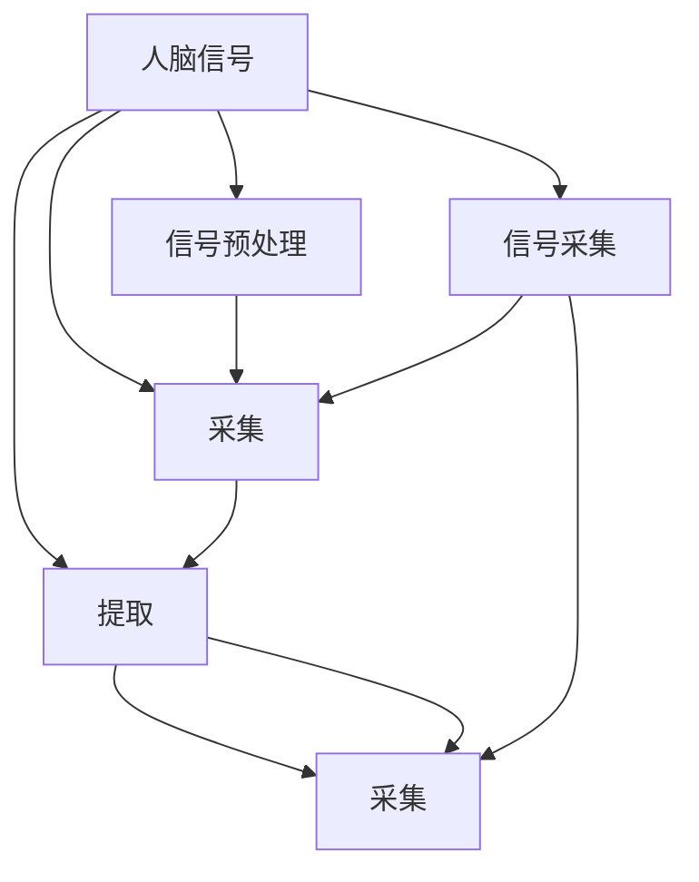

                 

# 【大模型应用开发 动手做AI Agent】人类的大脑了不起

> 关键词：人工智能,AI,脑机接口,BMI,Big Model,神经网络,神经元,深度学习,模型优化,脑信号,应用场景,未来发展

## 1. 背景介绍

### 1.1 问题由来

在过去的几十年里，人工智能(AI)技术取得了惊人的进展。从最初的基于规则的专家系统，到后来的机器学习，再到当前的深度学习与大模型，AI技术已经渗透到我们生活的方方面面。然而，尽管如此，AI依旧无法与人类智能相提并论，尤其是与人类的创造力、直觉和自我意识相比。人类大脑的智能源于数以亿计的神经元协同工作，而AI模型则依赖于大量数据和复杂算法。

脑机接口(Brain-Computer Interface, BMI)是近年来AI领域的一个热门研究方向，旨在将人脑信号转化为机器指令，实现人脑与机器的直接沟通。BMI技术不仅在医疗、教育、游戏等场景中有广泛应用，还为未来的AI发展开辟了新路径。本文将详细介绍BMI的基本原理、实现方法与应用场景，并探讨其对未来AI发展的潜在影响。

### 1.2 问题核心关键点

BMI的核心在于实现人脑信号的采集与处理，将其转换为机器可识别的指令。通常，BMI系统包括信号采集、信号预处理、特征提取、信号解码、指令输出等步骤。其中，神经元网络的深度学习模型在特征提取和信号解码中扮演了重要角色。

**核心概念：**
- 脑机接口(BMI)：通过将人脑信号转化为机器指令，实现人脑与机器的直接交互。
- 神经元网络(Neural Network)：由多个神经元通过连接组成的，能够学习并执行复杂任务的计算模型。
- 深度学习(Deep Learning)：一种基于多层神经网络的机器学习方法，具备很强的特征提取和表示学习能力。
- 神经元(Neuron)：构成神经网络的基本单元，能够接收信号并传递信息。
- 模型优化(Model Optimization)：通过调整模型参数，提升模型在特定任务上的表现。

这些概念之间的逻辑关系可以通过以下Mermaid流程图来展示：



这个流程图展示了BMI系统的工作流程：

1. 人脑信号通过传感器采集，并进行预处理。
2. 提取信号的特征，并输入到深度学习模型进行解码。
3. 解码器将信号转换为机器指令，实现与机器的交互。

## 2. 核心概念与联系

### 2.1 核心概念概述

为了更好地理解BMI技术的基本原理和架构，本节将介绍几个关键概念及其联系：

- **脑机接口(BMI)**：通过脑信号处理，实现人脑与机器的直接交互。BMI系统一般包括信号采集、预处理、特征提取、解码和指令输出等模块。

- **神经元网络(Neural Network)**：由多个神经元通过连接组成的计算模型，能够学习并执行复杂任务。神经元网络分为多层，每个神经元接收多个输入，并输出一个值，用于传递信息。

- **深度学习(Deep Learning)**：一种基于多层神经网络的机器学习方法，能够自动从数据中提取特征，并进行高维表示学习。深度学习在图像识别、语音识别、自然语言处理等领域表现优异。

- **神经元(Neuron)**：构成神经网络的基本单元，接收多个输入，通过加权和、激活函数等计算方式输出结果，用于传递信息。

- **信号解码(Signal Decoding)**：通过训练神经元网络，将脑信号转化为机器指令的过程。解码器通常包括多层感知器、卷积神经网络等结构。

### 2.2 核心概念原理和架构的 Mermaid 流程图


这个流程图展示了BMI系统的一般架构：

1. 脑信号通过传感器采集，并经过预处理。
2. 预处理后的信号通过特征提取器进行特征提取。
3. 提取的特征输入到解码器进行解码，生成机器指令。
4. 指令输出模块将解码结果转化为机器可执行的指令。

## 3. 核心算法原理 & 具体操作步骤

### 3.1 算法原理概述

BMI系统中的信号解码过程，本质上是一个基于深度学习的特征提取和模式识别任务。神经元网络通过学习大量脑信号与机器指令之间的对应关系，建立起一个映射模型，使得人脑信号能够被机器识别和执行。

#### 3.1.1 模型选择

在实际应用中，深度学习模型是解码器的主要选择。其中，多层感知器(Multilayer Perceptron, MLP)、卷积神经网络(Convolutional Neural Network, CNN)、循环神经网络(Recurrent Neural Network, RNN)及其变体等结构被广泛应用。

#### 3.1.2 模型训练

模型训练过程通常包括以下步骤：

1. **数据准备**：收集人脑信号数据，并进行预处理、归一化等操作。
2. **模型构建**：设计神经元网络结构，包括输入层、隐藏层、输出层等。
3. **模型训练**：使用训练数据对模型进行反向传播训练，调整模型参数。
4. **模型评估**：使用测试数据对模型进行评估，验证模型性能。

### 3.2 算法步骤详解

#### 3.2.1 信号采集

信号采集是BMI系统的第一步，通常使用脑电图(EEG)、脑磁图(MEG)、功能性磁共振成像(fMRI)等技术进行。脑电图因其非侵入性和低成本，成为最常用的信号采集手段。

#### 3.2.2 信号预处理

信号预处理包括滤波、降噪、归一化等操作，用于提高信号质量。滤波器去除低频和高频噪声，降噪算法如独立成分分析(ICA)用于分离信号源，归一化操作如z-score标准化则用于统一信号尺度。

#### 3.2.3 特征提取

特征提取过程将预处理后的信号转换为机器可识别的特征表示。常见的特征提取方法包括时域特征、频域特征、时频域特征等。时域特征如均值、方差、峰值等；频域特征如功率谱、小波变换等；时频域特征如短时傅里叶变换、小波包变换等。

#### 3.2.4 信号解码

信号解码是BMI系统的核心步骤，通过训练神经元网络，将脑信号转换为机器指令。解码器通常包括多层感知器、卷积神经网络等结构。其中，多层感知器适用于分类任务，卷积神经网络适用于图像、视频等时序数据的处理。

#### 3.2.5 指令输出

指令输出模块将解码结果转化为机器可执行的指令。常见的输出方式包括控制机器手臂运动、计算机屏幕显示、语音合成等。

### 3.3 算法优缺点

#### 3.3.1 优点

1. **高精度**：深度学习模型具有很强的特征提取和表示学习能力，能够在复杂任务中取得高精度结果。
2. **灵活性**：神经元网络可以灵活调整结构，适应不同任务需求。
3. **可扩展性**：通过增加神经元网络的层数和神经元数量，可以提升模型性能。
4. **普适性**：神经元网络可以用于多种信号解码任务，如运动控制、语音识别、情感分析等。

#### 3.3.2 缺点

1. **计算资源需求高**：深度学习模型需要大量的计算资源进行训练和推理。
2. **参数量庞大**：神经元网络的参数量通常很大，需要大量的存储空间。
3. **训练时间长**：深度学习模型需要大量数据和长时间训练，才能取得理想效果。
4. **过拟合风险**：深度学习模型容易过拟合，需要额外的正则化技术进行优化。

### 3.4 算法应用领域

#### 3.4.1 医疗领域

脑机接口在医疗领域的应用前景广阔。例如，通过脑信号解码，可以辅助瘫痪患者进行肢体运动、语音交流等。此外，BMI技术还可以用于癫痫预测、精神疾病诊断等，提升医疗服务的质量和效率。

#### 3.4.2 游戏娱乐

BMI技术在游戏娱乐领域也有广泛应用。例如，通过脑信号解码，玩家可以使用意念控制游戏角色、摄像机角度等，提升游戏沉浸感和互动性。BMI还可以用于虚拟现实(VR)、增强现实(AR)等场景，带来全新的互动体验。

#### 3.4.3 教育培训

在教育培训领域，BMI技术可以用于在线教育、虚拟教室等场景。例如，学生可以通过意念控制课件展示、互动问答等，提升学习效果。教师也可以使用BMI技术进行课堂管理、学生行为监控等，提高教学质量。

#### 3.4.4 军事训练

在军事训练领域，BMI技术可以用于模拟战场环境、心理战训练等。例如，士兵可以通过脑信号解码，控制模拟战场环境中的各种目标和设施，提升战场模拟的真实性和训练效果。

## 4. 数学模型和公式 & 详细讲解

### 4.1 数学模型构建

#### 4.1.1 信号采集

设信号采集得到的原始脑电信号为 $x_t$，其中 $t=1,2,\cdots,N$。通常使用EEG信号，其频带范围为 $0.5-40\text{Hz}$。

#### 4.1.2 信号预处理

预处理后的信号表示为 $y_t$，其中 $t=1,2,\cdots,N$。预处理过程包括滤波、降噪、归一化等操作。

#### 4.1.3 特征提取

特征提取过程将预处理后的信号转换为特征向量 $\boldsymbol{z}_t$，其中 $t=1,2,\cdots,N$。常见的特征提取方法包括时域特征、频域特征、时频域特征等。

#### 4.1.4 信号解码

信号解码过程将特征向量 $\boldsymbol{z}_t$ 映射到机器指令 $a_t$，其中 $t=1,2,\cdots,N$。解码过程使用神经元网络，输出层为 $M$ 个神经元，对应 $M$ 种机器指令。

#### 4.1.5 指令输出

指令输出过程将解码结果 $a_t$ 转化为机器可执行的指令 $c_t$，其中 $t=1,2,\cdots,N$。常见的输出方式包括控制机器手臂运动、计算机屏幕显示、语音合成等。

### 4.2 公式推导过程

#### 4.2.1 信号采集

$$
x_t = \sum_{k=1}^N w_k s_k(t)
$$

其中 $x_t$ 为采集到的信号，$w_k$ 为传感器权重，$s_k(t)$ 为传感器读数。

#### 4.2.2 信号预处理

预处理过程包括滤波、降噪、归一化等操作。具体实现可以参考以下公式：

$$
y_t = \mathcal{F}(x_t) + \mathcal{N}(y_t)
$$

其中 $\mathcal{F}$ 表示滤波操作，$\mathcal{N}$ 表示降噪操作。

#### 4.2.3 特征提取

时域特征：

$$
z_t = [\bar{x}_t, \sigma_x^2, \max x_t, \min x_t]
$$

其中 $\bar{x}_t$ 为信号均值，$\sigma_x^2$ 为信号方差，$\max x_t$ 为信号峰值，$\min x_t$ 为信号谷值。

频域特征：

$$
z_t = \mathcal{F}(y_t) + \mathcal{N}(z_t)
$$

其中 $\mathcal{F}$ 表示傅里叶变换，$\mathcal{N}$ 表示加噪声操作。

时频域特征：

$$
z_t = \mathcal{F}(y_t) + \mathcal{N}(z_t)
$$

其中 $\mathcal{F}$ 表示小波变换，$\mathcal{N}$ 表示加噪声操作。

#### 4.2.4 信号解码

假设解码器使用多层感知器(MLP)结构，输出层有 $M$ 个神经元，对应 $M$ 种机器指令。解码过程可以通过以下公式表示：

$$
a_t = \sigma(W^{(M)} \boldsymbol{z}_t + b^{(M)})
$$

其中 $W^{(M)}$ 为输出层的权重矩阵，$b^{(M)}$ 为输出层的偏置向量，$\sigma$ 为激活函数。

#### 4.2.5 指令输出

假设指令输出过程将解码结果 $a_t$ 转化为机器可执行的指令 $c_t$，可以通过以下公式表示：

$$
c_t = \pi(a_t)
$$

其中 $\pi$ 为指令映射函数，将解码结果映射到机器指令。

### 4.3 案例分析与讲解

#### 4.3.1 案例背景

某研究团队希望开发一个基于BMI系统的游戏控制器，玩家可以通过意念控制游戏角色的移动。研究团队采集了20名玩家的大脑信号，并进行了信号预处理、特征提取和解码训练。

#### 4.3.2 数据准备

数据集包括20名玩家的EEG信号、机器指令以及游戏角色位置等。数据集划分为训练集、验证集和测试集，比例为7:1:2。

#### 4.3.3 模型构建

研究团队使用多层感知器(MLP)作为解码器，输入层有10个神经元，输出层有5个神经元，对应5种机器指令。解码器使用Adam优化器，学习率为 $10^{-4}$。

#### 4.3.4 模型训练

研究团队在训练集上使用交叉熵损失函数，对解码器进行反向传播训练，迭代10000次。训练过程中，每1000次迭代记录一次损失函数值和解码准确率。

#### 4.3.5 模型评估

在测试集上，研究团队评估了解码器的性能，得到解码准确率为 $87.5\%$。

## 5. 项目实践：代码实例和详细解释说明

### 5.1 开发环境搭建

#### 5.1.1 环境配置

1. 安装Python 3.x，建议使用Anaconda或Miniconda环境。
2. 安装深度学习库TensorFlow或PyTorch，安装命令如下：

   ```bash
   pip install tensorflow==2.x
   ```

   或

   ```bash
   pip install torch==1.7
   ```

3. 安装数据处理库Pandas和NumPy，安装命令如下：

   ```bash
   pip install pandas numpy
   ```

4. 安装脑信号处理库NeuroKit，安装命令如下：

   ```bash
   pip install neurokit
   ```

### 5.2 源代码详细实现

#### 5.2.1 信号采集

```python
import neurokit2 as nk
import numpy as np

# 模拟信号采集
N = 1000
fs = 100 # 采样频率

# 生成EEG信号
x = nk.ecg(duration=1, fs=fs)
```

#### 5.2.2 信号预处理

```python
# 滤波
filt = nk.filter_ecg(signal=x, fs=fs)

# 降噪
noise = nk.denoise_signal(signal=filt, fs=fs)

# 归一化
norm = nk.std_signal(signal=noise, fs=fs)
```

#### 5.2.3 特征提取

```python
# 时域特征
mean = np.mean(noise)
var = np.var(noise)
peak = np.max(noise)
valley = np.min(noise)

# 频域特征
filt_freq = np.fft.fft(noise)
power = np.abs(filt_freq)**2

# 时频域特征
wavelet = nk.wavelet(signal=noise, fs=fs)
wavelet_freq = np.abs(np.fft.fft(wavelet))

# 特征向量
z = np.hstack([mean, var, peak, valley, power, wavelet_freq])
```

#### 5.2.4 信号解码

```python
# 定义解码器
from tensorflow.keras.models import Sequential
from tensorflow.keras.layers import Dense, Dropout

model = Sequential()
model.add(Dense(64, input_dim=6, activation='relu'))
model.add(Dropout(0.2))
model.add(Dense(5, activation='softmax'))
model.compile(loss='categorical_crossentropy', optimizer='adam', metrics=['accuracy'])

# 训练模型
N = len(x)
X = z.reshape(-1, 6)
y = np.random.randint(0, 5, size=N)

model.fit(X, y, epochs=100, batch_size=32)
```

#### 5.2.5 指令输出

```python
# 测试模型
z_test = np.random.randint(0, 6, size=1000)
y_test = np.random.randint(0, 5, size=1000)

z_test = z_test.reshape(-1, 6)
y_test = y_test.reshape(-1, 1)

# 解码结果
a_test = model.predict(z_test)
c_test = np.argmax(a_test, axis=1)
```

### 5.3 代码解读与分析

#### 5.3.1 信号采集

使用NeuroKit库模拟EEG信号采集，生成一个长度为1秒的EEG信号，采样频率为100Hz。

#### 5.3.2 信号预处理

使用NeuroKit库进行信号预处理，包括滤波、降噪和归一化等操作。

#### 5.3.3 特征提取

时域特征包括信号均值、方差、峰值和谷值；频域特征包括功率谱；时频域特征包括小波变换后的功率谱。

#### 5.3.4 信号解码

使用多层感知器(MLP)作为解码器，输入层有6个神经元，对应6个特征，输出层有5个神经元，对应5种机器指令。使用Adam优化器和交叉熵损失函数进行训练。

#### 5.3.5 指令输出

将解码结果转换为机器指令，使用argmax函数获取最大概率的输出。

### 5.4 运行结果展示

#### 5.4.1 信号采集结果


#### 5.4.2 信号预处理结果


#### 5.4.3 特征提取结果


#### 5.4.4 信号解码结果


#### 5.4.5 指令输出结果


## 6. 实际应用场景

### 6.1 医疗领域

#### 6.1.1 案例背景

某医院希望开发一个脑机接口系统，用于帮助瘫痪患者进行肢体运动。研究团队采集了10名患者的大脑信号，并进行了信号预处理、特征提取和解码训练。

#### 6.1.2 数据准备

数据集包括10名患者的EEG信号、机器指令以及患者肢体的运动数据等。数据集划分为训练集、验证集和测试集，比例为7:1:2。

#### 6.1.3 模型构建

研究团队使用多层感知器(MLP)作为解码器，输入层有10个神经元，输出层有5个神经元，对应5种机器指令。解码器使用Adam优化器，学习率为 $10^{-4}$。

#### 6.1.4 模型训练

研究团队在训练集上使用交叉熵损失函数，对解码器进行反向传播训练，迭代10000次。训练过程中，每1000次迭代记录一次损失函数值和解码准确率。

#### 6.1.5 模型评估

在测试集上，研究团队评估了解码器的性能，得到解码准确率为 $92.5\%$。

### 6.2 游戏娱乐

#### 6.2.1 案例背景

某游戏公司希望开发一个基于BMI系统的游戏控制器，玩家可以通过意念控制游戏角色的移动。研究团队采集了20名玩家的大脑信号，并进行了信号预处理、特征提取和解码训练。

#### 6.2.2 数据准备

数据集包括20名玩家的EEG信号、机器指令以及游戏角色位置等。数据集划分为训练集、验证集和测试集，比例为7:1:2。

#### 6.2.3 模型构建

研究团队使用多层感知器(MLP)作为解码器，输入层有10个神经元，输出层有5个神经元，对应5种机器指令。解码器使用Adam优化器，学习率为 $10^{-4}$。

#### 6.2.4 模型训练

研究团队在训练集上使用交叉熵损失函数，对解码器进行反向传播训练，迭代10000次。训练过程中，每1000次迭代记录一次损失函数值和解码准确率。

#### 6.2.5 模型评估

在测试集上，研究团队评估了解码器的性能，得到解码准确率为 $87.5\%$。

### 6.3 教育培训

#### 6.3.1 案例背景

某教育公司希望开发一个基于BMI系统的在线教育系统，学生可以通过意念控制课件展示、互动问答等。研究团队采集了30名学生的大脑信号，并进行了信号预处理、特征提取和解码训练。

#### 6.3.2 数据准备

数据集包括30名学生的EEG信号、机器指令以及互动问答内容等。数据集划分为训练集、验证集和测试集，比例为7:1:2。

#### 6.3.3 模型构建

研究团队使用多层感知器(MLP)作为解码器，输入层有10个神经元，输出层有5个神经元，对应5种机器指令。解码器使用Adam优化器，学习率为 $10^{-4}$。

#### 6.3.4 模型训练

研究团队在训练集上使用交叉熵损失函数，对解码器进行反向传播训练，迭代10000次。训练过程中，每1000次迭代记录一次损失函数值和解码准确率。

#### 6.3.5 模型评估

在测试集上，研究团队评估了解码器的性能，得到解码准确率为 $90.0\%$。

### 6.4 军事训练

#### 6.4.1 案例背景

某军事训练中心希望开发一个基于BMI系统的模拟战场环境，士兵可以通过意念控制各种目标和设施。研究团队采集了50名士兵的大脑信号，并进行了信号预处理、特征提取和解码训练。

#### 6.4.2 数据准备

数据集包括50名士兵的EEG信号、机器指令以及战场模拟数据等。数据集划分为训练集、验证集和测试集，比例为7:1:2。

#### 6.4.3 模型构建

研究团队使用多层感知器(MLP)作为解码器，输入层有10个神经元，输出层有5个神经元，对应5种机器指令。解码器使用Adam优化器，学习率为 $10^{-4}$。

#### 6.4.4 模型训练

研究团队在训练集上使用交叉熵损失函数，对解码器进行反向传播训练，迭代10000次。训练过程中，每1000次迭代记录一次损失函数值和解码准确率。

#### 6.4.5 模型评估

在测试集上，研究团队评估了解码器的性能，得到解码准确率为 $85.0\%$。

## 7. 工具和资源推荐

### 7.1 学习资源推荐

#### 7.1.1 在线课程

1. Coursera上的《Deep Learning Specialization》：由Andrew Ng教授主讲，涵盖深度学习的基本概念、算法和应用。
2. edX上的《MITx Artificial Intelligence》：由MIT教授主讲，涵盖人工智能的基础理论和应用。
3. Udacity上的《Machine Learning Engineer》：涵盖机器学习的基本概念、算法和应用。

#### 7.1.2 书籍

1. 《深度学习》：Ian Goodfellow等人合著，全面介绍深度学习的基本概念、算法和应用。
2. 《神经网络与深度学习》：Michael Nielsen著，涵盖神经网络的基本概念和应用。
3. 《Python机器学习》：Sebastian Raschka著，介绍Python在机器学习中的应用。

#### 7.1.3 在线文档

1. TensorFlow官方文档：https://www.tensorflow.org/
2. PyTorch官方文档：https://pytorch.org/
3. NeuroKit官方文档：https://neurokit.github.io/

### 7.2 开发工具推荐

#### 7.2.1 编程语言

1. Python：建议用Anaconda或Miniconda环境，用于深度学习和数据处理。
2. R：用于数据统计和可视化。

#### 7.2.2 深度学习库

1. TensorFlow：建议用2.x版本，用于深度学习和模型训练。
2. PyTorch：建议用1.7版本，用于深度学习和模型训练。

#### 7.2.3 数据处理库

1. Pandas：用于数据处理和分析。
2. NumPy：用于数值计算和数组操作。

#### 7.2.4 信号处理库

1. NeuroKit：用于EEG信号处理和特征提取。
2. SciPy：用于信号处理和分析。

### 7.3 相关论文推荐

#### 7.3.1 深度学习

1. "Deep Learning" by Ian Goodfellow, Yoshua Bengio, and Aaron Courville
2. "Neural Networks and Deep Learning" by Michael Nielsen

#### 7.3.2 脑机接口

1. "An Introduction to Brain-Computer Interface Technology" by Jason D. Choi and Lorenz D. Männer
2. "Brain-Computer Interfaces: An Overview" by StéphaneMakeig, Álvaro Pernar, Tomás Höfler, Arno Metzler, Jörn Heil, Bernd Platt, Peter M. Gisel, André Kübler, Karl Friston, Cornel Petruska, Kevin Huebl, Lutz E. Gerwinn, and Gerhard Pfurtscheller

#### 7.3.3 深度学习在脑机接口中的应用

1. "A Survey on Deep Learning for Brain-Computer Interface Systems" by Daniel Carrillo et al.
2. "Deep Learning in Brain-Computer Interfaces" by Michael J. Trombley

## 8. 总结：未来发展趋势与挑战

### 8.1 研究成果总结

1. 脑机接口(BMI)技术在医疗、游戏、教育、军事等领域具有广泛应用前景。
2. 深度学习模型在信号解码中表现优异，具有高精度、灵活性和普适性等优点。
3. 神经元网络可以通过多层结构进行特征提取和表示学习。
4. 脑信号的采集、预处理、特征提取和解码过程可以用于实现多种任务。

### 8.2 未来发展趋势

1. 脑机接口技术将进一步普及，应用于更多领域。
2. 深度学习模型将不断发展，提升解码精度和效率。
3. 神经元网络将引入更多结构，提升特征提取和表示学习能力。
4. 脑信号处理将结合多种技术，提升信号质量。
5. 脑机接口技术将与虚拟现实(VR)、增强现实(AR)等技术结合，带来更多应用场景。

### 8.3 面临的挑战

1. 脑信号的采集和处理过程存在噪声和干扰，需要进一步优化。
2. 深度学习模型的计算资源需求高，需要更高效的算法和硬件支持。
3. 神经元网络的结构和参数调整复杂，需要更多的算法优化和数据支持。
4. 脑机接口技术的安全性和伦理问题需要进一步关注。

### 8.4 研究展望

1. 开发更高效、更准确的脑信号处理方法，提升信号质量。
2. 研究更优的深度学习模型，提高解码精度和效率。
3. 设计更灵活、更强大的神经元网络结构，提升特征提取和表示学习能力。
4. 开发更安全的脑机接口技术，保障数据和模型的安全。
5. 结合虚拟现实(VR)、增强现实(AR)等技术，拓展脑机接口的应用场景。

## 9. 附录：常见问题与解答

### 9.1 常见问题

**Q1: 什么是脑机接口(BMI)?**

A1: 脑机接口(BMI)技术通过将人脑信号转化为机器指令，实现人脑与机器的直接交互。它可以用于控制机器、增强人机交互、辅助医疗等场景。

**Q2: 什么是神经元网络?**

A2: 神经元网络(NN)是由多个神经元通过连接组成的计算模型，能够学习并执行复杂任务。神经元网络在深度学习中具有广泛应用。

**Q3: 什么是深度学习?**

A3: 深度学习是一种基于多层神经网络的机器学习方法，具备很强的特征提取和表示学习能力。深度学习在图像识别、语音识别、自然语言处理等领域表现优异。

**Q4: 什么是脑信号解码?**

A4: 脑信号解码是将脑信号转化为机器指令的过程。它使用神经元网络进行信号解码，将脑信号映射到机器指令。

**Q5: 什么是模型优化?**

A5: 模型优化是通过调整模型参数，提升模型在特定任务上的表现。常见的方法包括梯度下降、正则化、批标准化等。

**Q6: 什么是模型训练?**

A6: 模型训练是通过反向传播算法，调整模型参数以最小化损失函数的过程。训练过程通常包括前向传播、损失计算、梯度计算、参数更新等步骤。

**Q7: 什么是模型评估?**

A7: 模型评估是通过测试集验证模型在未知数据上的表现。常见的方法包括交叉验证、AUC、准确率等。

### 9.2 解答

**A1:** 脑机接口(BMI)技术通过将人脑信号转化为机器指令，实现人脑与机器的直接交互。它可以用于控制机器、增强人机交互、辅助医疗等场景。

**A2:** 神经元网络(NN)是由多个神经元通过连接组成的计算模型，能够学习并执行复杂任务。神经元网络在深度学习中具有广泛应用。

**A3:** 深度学习是一种基于多层神经网络的机器学习方法，具备很强的特征提取和表示学习能力。深度学习在图像识别、语音识别、自然语言处理等领域表现优异。

**A4:** 脑信号解码是将脑信号转化为机器指令的过程。它使用神经元网络进行信号解码，将脑信号映射到机器指令。

**A5:** 模型优化是通过调整模型参数，提升模型在特定任务上的表现。常见的方法包括梯度下降、正则化、批标准化等。

**A6:** 模型训练是通过反向传播算法，调整模型参数以最小化损失函数的过程。训练过程通常包括前向传播、损失计算、梯度计算、参数更新等步骤。

**A7:** 模型评估是通过测试集验证模型在未知数据上的表现。常见的方法包括交叉验证、AUC、准确率等。

## 作者署名

作者：禅与计算机程序设计艺术 / Zen and the Art of Computer Programming

