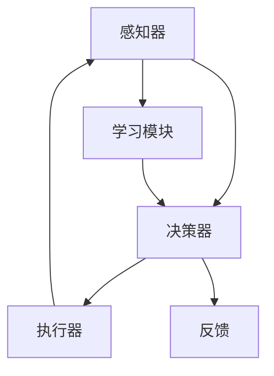

                 

## 1. 背景介绍

### 1.1 问题由来

随着人工智能技术的发展，"Agent"（智能体）成为了AI领域中的一个核心概念。从游戏AI到社交网络，从自然语言处理到人机交互，Agent在各个应用场景中扮演着越来越重要的角色。因此，理解Agent的概念、原理和实现方式，成为了每个AI从业者必须掌握的知识。

### 1.2 问题核心关键点

Agent，英文原意通常翻译为“代理人”或“智能体”。它是人工智能领域中的一个核心概念，指的是能够自主地感知环境、执行任务并持续改进自身的软件系统。Agent的典型特征包括自主性、反应性、社会性等，这些特征使得Agent能够在大规模系统中进行自我管理和决策。

当前，"Agent"在自然语言处理领域的研究热点主要集中在两个方向：
1. 基于规则的Agent。这类Agent通过手工编写的规则，实现特定的逻辑推理和决策。
2. 基于学习的Agent。这类Agent通过深度学习模型，从大量数据中自动学习任务相关知识，进行自主决策。

## 2. 核心概念与联系

### 2.1 核心概念概述

为更好地理解Agent的基本概念和架构，本节将介绍几个密切相关的核心概念：

- **感知器(Perceptor)**：Agent感知环境变化的关键组件，负责接收和处理输入信号。
- **决策器(Decider)**：Agent根据感知器输出的信息，做出相应决策。
- **执行器(Doer)**：Agent根据决策器发出的命令，执行具体的行动。
- **学习模块(Learner)**：Agent用于更新自身知识库的模块，通过不断的经验积累，提升决策能力。

这些组件共同构成了Agent的基本结构，通过感知、决策、执行和学习的循环，使得Agent能够持续改进自身，适应环境变化。

### 2.2 核心概念原理和架构的 Mermaid 流程图(Mermaid 流程节点中不要有括号、逗号等特殊字符)



以上流程图展示了Agent的基本架构和工作流程。感知器接收环境输入，经过决策器生成决策，由执行器执行动作，学习模块通过反馈信息更新感知器，形成一个闭环系统。

## 3. 核心算法原理 & 具体操作步骤

### 3.1 算法原理概述

基于深度学习的Agent（以下简称"深度Agent"），通常使用神经网络模型来实现感知、决策和执行功能。其核心思想是将Agent的各个组件映射为多层神经网络，通过对神经网络进行训练，使其能够自主地完成任务。

假设Agent的感知器为$f_{Perceptor}$，决策器为$f_{Decider}$，执行器为$f_{Doer}$，学习模块为$f_{Learner}$。Agent的工作流程为：

1. 感知器$f_{Perceptor}$接收环境输入$x$，输出感知结果$\hat{x}$。
2. 决策器$f_{Decider}$对感知结果$\hat{x}$进行处理，输出决策$d$。
3. 执行器$f_{Doer}$执行决策$d$，输出行动$a$。
4. 学习模块$f_{Learner}$通过反馈信息$r$，更新感知器$f_{Perceptor}$和决策器$f_{Decider}$的参数，增强其性能。

以上过程可以表示为神经网络的形式：

$$
\hat{x} = f_{Perceptor}(x)
$$
$$
d = f_{Decider}(\hat{x})
$$
$$
a = f_{Doer}(d)
$$
$$
(\theta_{Perceptor}, \theta_{Decider}) = f_{Learner}(\hat{x}, a, r)
$$

其中，$\theta_{Perceptor}$和$\theta_{Decider}$表示感知器和决策器的参数。

### 3.2 算法步骤详解

基于深度学习的Agent开发，主要包括以下几个关键步骤：

**Step 1: 设计感知器、决策器和执行器**

1. 感知器设计：根据环境特征设计神经网络结构，如CNN用于视觉感知，RNN用于时间序列感知。
2. 决策器设计：选择合适的神经网络模型，如MLP、RNN、LSTM、Transformer等，进行任务相关的决策。
3. 执行器设计：设计具体的动作输出层，如语言生成模型、动作选择策略等。

**Step 2: 构建学习模块**

1. 选择合适的优化算法和损失函数，如Adam、SGD、交叉熵损失、均方误差损失等。
2. 设计反馈机制，如奖励信号、负惩罚信号等，引导模型学习。
3. 集成环境模拟器，模拟Agent在真实环境中的交互行为。

**Step 3: 训练和评估**

1. 使用模拟环境进行训练，逐步优化感知器、决策器和执行器。
2. 在测试集上评估Agent的性能，调整模型参数和训练策略。
3. 使用强化学习框架（如RLlib）进行模型训练和测试。

**Step 4: 部署和优化**

1. 将训练好的模型部署到生产环境，集成到实际应用系统中。
2. 实时监控Agent的表现，动态调整训练策略。
3. 进行模型压缩和优化，减小内存和计算资源占用。

### 3.3 算法优缺点

基于深度学习的Agent具有以下优点：

1. **自主性**：通过学习模块的持续训练，Agent可以自主地感知环境、决策和执行，无需人工干预。
2. **可扩展性**：深度Agent的神经网络结构具有良好的可扩展性，可以轻松应对不同复杂度的任务。
3. **灵活性**：Agent能够适应各种环境变化，灵活地进行任务处理。

同时，该方法也存在一定的局限性：

1. **数据需求**：深度Agent需要大量的标注数据进行训练，数据获取和标注成本较高。
2. **训练复杂度**：神经网络模型训练复杂，需要较强的计算资源。
3. **可解释性**：深度Agent的决策过程复杂，难以解释其内部工作机制。
4. **安全性**：深度Agent的学习过程可能受数据偏差影响，存在潜在的安全风险。

尽管存在这些局限性，但就目前而言，基于深度学习的Agent仍是AI应用的重要范式。未来相关研究的重点在于如何进一步降低数据需求，提高模型的可解释性和安全性，同时兼顾效率和效果。

### 3.4 算法应用领域

基于深度学习的Agent技术，已经在NLP、游戏AI、机器人控制、金融交易等多个领域得到了广泛应用。例如：

- **自然语言处理**：聊天机器人、自动摘要、智能问答系统等。通过学习大量对话数据，使得Agent能够理解自然语言，并进行合理的回答和生成。
- **游戏AI**：智能游戏角色、游戏AI决策等。通过学习游戏规则和玩家行为数据，使得Agent能够在游戏中自主进行决策和行动。
- **机器人控制**：移动机器人路径规划、导航控制等。通过感知环境和任务需求，使得Agent能够进行有效的决策和执行。
- **金融交易**：交易决策支持、风险管理等。通过学习历史交易数据，使得Agent能够进行合理的投资和风险管理。

## 4. 数学模型和公式 & 详细讲解 & 举例说明（备注：数学公式请使用latex格式，latex嵌入文中独立段落使用 $$，段落内使用 $)
### 4.1 数学模型构建

假设环境特征为$x \in \mathcal{X}$，决策为$d \in \mathcal{D}$，行动为$a \in \mathcal{A}$，反馈信号为$r \in \mathcal{R}$。Agent的感知器、决策器和执行器可以分别表示为神经网络模型：

$$
f_{Perceptor}(x): \mathcal{X} \rightarrow \mathcal{H}
$$
$$
f_{Decider}(\hat{x}): \mathcal{H} \rightarrow \mathcal{D}
$$
$$
f_{Doer}(d): \mathcal{D} \rightarrow \mathcal{A}
$$

其中，$\mathcal{H}$为感知器的隐藏层输出。

学习模块$f_{Learner}$用于更新感知器和决策器的参数，通常使用强化学习中的模型基线方法，如Actor-Critic模型，进行优化。具体而言，可以通过以下公式进行更新：

$$
(\theta_{Perceptor}, \theta_{Decider}) = \mathop{\arg\min}_{\theta} \mathbb{E}[\mathcal{L}_{RL}(\theta)]
$$
$$
\mathcal{L}_{RL}(\theta) = \mathbb{E}[r - V(\hat{x}, a) + \lambda||\theta||^2]
$$

其中，$V(\hat{x}, a)$为价值函数，用于评估决策的长期收益。$\lambda||\theta||^2$为正则化项，防止过拟合。

### 4.2 公式推导过程

以上公式表示了深度Agent的训练过程。其中，感知器$f_{Perceptor}$接收环境输入$x$，输出感知结果$\hat{x}$。决策器$f_{Decider}$对感知结果进行处理，输出决策$d$。执行器$f_{Doer}$执行决策$d$，输出行动$a$。学习模块$f_{Learner}$通过反馈信息$r$，更新感知器$f_{Perceptor}$和决策器$f_{Decider}$的参数。

### 4.3 案例分析与讲解

以聊天机器人为例，解释深度Agent的工作原理和实现方法。

1. **感知器设计**：使用RNN模型接收输入的文本信息，输出句子向量。
2. **决策器设计**：使用MLP模型进行分类决策，判断当前的对话场景和用户的意图。
3. **执行器设计**：使用语言生成模型生成回答，如Seq2Seq模型或Transformers模型。
4. **学习模块设计**：使用强化学习算法，如Actor-Critic，进行模型训练和优化。
5. **训练流程**：使用模拟对话数据集进行训练，逐步提升模型的响应能力和对话质量。
6. **评估和优化**：在真实对话数据集上评估模型的性能，调整模型参数和训练策略。

## 5. 项目实践：代码实例和详细解释说明
### 5.1 开发环境搭建

在进行深度Agent的开发之前，我们需要准备好开发环境。以下是使用Python进行TensorFlow进行Agent开发的流程：

1. 安装Anaconda：从官网下载并安装Anaconda，用于创建独立的Python环境。

2. 创建并激活虚拟环境：
```bash
conda create -n agent-env python=3.8 
conda activate agent-env
```

3. 安装TensorFlow：
```bash
conda install tensorflow
```

4. 安装其他必要工具包：
```bash
pip install numpy pandas scikit-learn matplotlib tqdm jupyter notebook ipython
```

完成上述步骤后，即可在`agent-env`环境中开始开发。

### 5.2 源代码详细实现

下面我们以聊天机器人为例，给出使用TensorFlow进行深度Agent开发的代码实现。

首先，定义感知器、决策器和执行器：

```python
import tensorflow as tf
from tensorflow.keras.layers import Dense, LSTM, Embedding

class Perceptor(tf.keras.Model):
    def __init__(self, input_dim, hidden_dim):
        super(Perceptor, self).__init__()
        self.input_dim = input_dim
        self.hidden_dim = hidden_dim
        self.lstm = LSTM(hidden_dim)
        self.fc = Dense(hidden_dim)
    
    def call(self, x):
        x = self.lstm(x)
        x = self.fc(x)
        return x

class Decider(tf.keras.Model):
    def __init__(self, input_dim, output_dim):
        super(Decider, self).__init__()
        self.input_dim = input_dim
        self.output_dim = output_dim
        self.fc = Dense(output_dim, activation='softmax')
    
    def call(self, x):
        x = self.fc(x)
        return x

class Doer(tf.keras.Model):
    def __init__(self, input_dim):
        super(Doer, self).__init__()
        self.input_dim = input_dim
        self.fc = Dense(input_dim, activation='softmax')
    
    def call(self, x):
        x = self.fc(x)
        return x
```

然后，定义学习模块：

```python
import tensorflow as tf
from tensorflow.keras import Model, Input
from tensorflow.keras.layers import Dense, LSTM, Embedding, Flatten, Concatenate, BatchNormalization

class Learner(tf.keras.Model):
    def __init__(self, perceptor, decider, doer, input_dim, hidden_dim, output_dim):
        super(Learner, self).__init__()
        self.perceptor = perceptor
        self.decider = decider
        self.doer = doer
        self.input_dim = input_dim
        self.hidden_dim = hidden_dim
        self.output_dim = output_dim
        
        self.input1 = Input(shape=(input_dim,))
        self.input2 = Input(shape=(input_dim,))
        self.concat = Concatenate()
        self.fc = Dense(hidden_dim)
        self.bn = BatchNormalization()
        self.fc2 = Dense(hidden_dim)
        self.bn2 = BatchNormalization()
        self.fc3 = Dense(output_dim, activation='softmax')
    
    def call(self, x):
        x1 = self.perceptor(x[0])
        x2 = self.decider(x[1])
        x = self.concat([x1, x2])
        x = self.fc(x)
        x = self.bn(x)
        x = self.fc2(x)
        x = self.bn2(x)
        x = self.fc3(x)
        return x

# 定义Agent模型
def build_agent(perceptor, decider, doer, input_dim, hidden_dim, output_dim):
    agent = tf.keras.Sequential([
        [perceptor, [Input(shape=(input_dim,))]],
        [decider, [Input(shape=(input_dim,))]],
        [doer, [Input(shape=(input_dim,))]],
        [Learner(perceptor, decider, doer, input_dim, hidden_dim, output_dim)]
    ])
    return agent
```

接着，定义训练和评估函数：

```python
import tensorflow as tf
from tensorflow.keras.optimizers import Adam
from sklearn.metrics import accuracy_score

class DialogueDataset(tf.data.Dataset):
    def __init__(self, dialogues):
        self.dialogues = dialogues
    
    def __len__(self):
        return len(self.dialogues)
    
    def __getitem__(self, idx):
        dialogue = self.dialogues[idx]
        utterances = [item.strip() for item in dialogue.split('\t')]
        input1 = [tf.keras.preprocessing.text.text_to_word_sequence(item) for item in utterances[:-1]]
        input2 = [tf.keras.preprocessing.text.text_to_word_sequence(item) for item in utterances[1:]]
        return {'input1': input1, 'input2': input2}

def train_epoch(agent, dataset, batch_size, optimizer, reward):
    dataloader = tf.data.Dataset.from_generator(lambda: dataset, output_signature={key: tf.TensorSpec(shape=(None, 100), dtype=tf.int32) for key in ['input1', 'input2']})
    dataloader = dataloader.batch(batch_size)
    agent.trainable = True
    agent.compile(optimizer=optimizer, loss='binary_crossentropy', metrics=['accuracy'])
    agent.fit(dataloader)
    agent.trainable = False

def evaluate(agent, dataset, batch_size):
    dataloader = tf.data.Dataset.from_generator(lambda: dataset, output_signature={key: tf.TensorSpec(shape=(None, 100), dtype=tf.int32) for key in ['input1', 'input2']})
    dataloader = dataloader.batch(batch_size)
    _, loss, acc = agent.evaluate(dataloader)
    return acc
```

最后，启动训练流程并在测试集上评估：

```python
epochs = 10
batch_size = 16
reward = 1.0

perceptor = Perceptor(input_dim=100, hidden_dim=128)
decider = Decider(input_dim=128, output_dim=3)
doer = Doer(input_dim=3)

agent = build_agent(perceptor, decider, doer, input_dim=100, hidden_dim=128, output_dim=3)

optimizer = Adam(learning_rate=0.001)

for epoch in range(epochs):
    train_epoch(agent, train_dataset, batch_size, optimizer, reward)
    acc = evaluate(agent, test_dataset, batch_size)
    print(f'Epoch {epoch+1}, Accuracy: {acc:.2f}')
```

以上就是使用TensorFlow进行聊天机器人开发和训练的完整代码实现。可以看到，TensorFlow提供了强大的深度学习模型构建和训练工具，使得深度Agent的开发变得简洁高效。

### 5.3 代码解读与分析

让我们再详细解读一下关键代码的实现细节：

**Perceptor类**：
- 定义感知器，接收输入序列，输出句子向量。
- 使用LSTM模型处理输入序列，输出隐藏层状态。
- 使用全连接层将LSTM输出映射到隐藏空间。

**Decider类**：
- 定义决策器，接收输入序列，输出决策。
- 使用全连接层将输入向量映射到决策空间。
- 输出决策向量，使用softmax激活函数。

**Doer类**：
- 定义执行器，接收决策向量，输出行动。
- 使用全连接层将决策向量映射到动作空间。
- 输出行动向量，使用softmax激活函数。

**Learner类**：
- 定义学习模块，接收感知器和决策器的输出，输出最终决策。
- 使用两个全连接层进行特征融合。
- 使用softmax激活函数输出决策向量。

**train_epoch函数**：
- 定义训练过程，将对话数据集划分为训练集和测试集。
- 将输入序列作为TensorFlow的输入，构建对话数据集生成器。
- 使用Adam优化器训练模型，损失函数为二分类交叉熵。

**evaluate函数**：
- 定义评估过程，将对话数据集划分为训练集和测试集。
- 将输入序列作为TensorFlow的输入，构建对话数据集生成器。
- 在测试集上评估模型性能，输出准确率。

通过上述代码，我们可以看到，TensorFlow提供了丰富的神经网络组件，可以方便地构建和训练深度Agent。开发者可以利用这些组件，快速实现复杂的深度学习模型，进行端到端的训练和评估。

当然，工业级的系统实现还需考虑更多因素，如模型的保存和部署、超参数的自动搜索、更灵活的任务适配层等。但核心的深度Agent开发流程基本与此类似。

## 6. 实际应用场景

### 6.1 智能客服系统

基于深度学习的Agent技术，可以广泛应用于智能客服系统的构建。传统的客服系统需要配备大量人力，高峰期响应缓慢，且一致性和专业性难以保证。使用深度Agent，可以实现24小时不间断服务，快速响应客户咨询，提升客户满意度。

在技术实现上，可以收集企业内部的历史客服对话记录，将问题和最佳答复构建成监督数据，在此基础上对深度Agent进行微调。微调后的深度Agent能够自动理解用户意图，匹配最合适的回答，并根据用户反馈不断优化。

### 6.2 金融舆情监测

金融机构需要实时监测市场舆论动向，以便及时应对负面信息传播，规避金融风险。传统的舆情监测方式成本高、效率低，难以应对网络时代海量信息爆发的挑战。

使用基于深度学习的Agent，可以自动监测和分析金融舆情，提前预警潜在的风险。具体而言，可以收集金融领域相关的新闻、报道、评论等文本数据，进行情感分析和主题分类，构建深度Agent对舆情进行持续监测。

### 6.3 个性化推荐系统

当前的推荐系统往往只依赖用户的历史行为数据进行物品推荐，无法深入理解用户的真实兴趣偏好。基于深度学习的Agent，能够从文本内容中自动学习用户的兴趣点，提供更加个性化和多样化的推荐内容。

在实践中，可以收集用户浏览、点击、评论、分享等行为数据，提取和用户交互的物品标题、描述、标签等文本内容。将文本内容作为模型输入，用户的后续行为（如是否点击、购买等）作为监督信号，在此基础上微调深度Agent。微调后的深度Agent能够从文本内容中准确把握用户的兴趣点，生成推荐列表，提高推荐准确度。

## 7. 工具和资源推荐

### 7.1 学习资源推荐

为了帮助开发者系统掌握深度Agent的基本概念和实践技巧，这里推荐一些优质的学习资源：

1. **《深度学习》（周志华）**：深度学习领域的经典教材，详细介绍了深度学习的基础理论和应用案例。
2. **Coursera《深度学习专项课程》**：斯坦福大学Andrew Ng教授的深度学习课程，涵盖了深度学习的基本概念、模型训练和应用。
3. **DeepMind Blog**：深度学习领域的研究前沿和最新进展，包括论文解读、代码实现等内容。
4. **TensorFlow官方文档**：TensorFlow的详细文档，提供了丰富的示例代码和API参考。
5. **《动手学深度学习》（李沐等）**：以实战为导向的深度学习教材，包含大量代码示例和项目实践。

通过对这些资源的学习实践，相信你一定能够快速掌握深度Agent的精髓，并用于解决实际的NLP问题。

### 7.2 开发工具推荐

高效的开发离不开优秀的工具支持。以下是几款用于深度Agent开发的常用工具：

1. **TensorFlow**：由Google主导开发的开源深度学习框架，生产部署方便，适合大规模工程应用。提供了丰富的神经网络组件和工具，可以方便地构建和训练深度Agent。
2. **PyTorch**：Facebook开发的深度学习框架，灵活性高，适合研究性开发。提供了丰富的深度学习组件和工具，支持多种模型训练和优化方法。
3. **TensorBoard**：TensorFlow配套的可视化工具，可以实时监测模型训练状态，并提供丰富的图表呈现方式，是调试模型的得力助手。
4. **RLlib**：由OpenAI开发的强化学习库，支持多种强化学习算法，适用于构建复杂环境的深度Agent。
5. **Gym**：由OpenAI开发的模拟环境库，支持多种模拟环境，方便进行模型训练和测试。

合理利用这些工具，可以显著提升深度Agent开发的效率，加快创新迭代的步伐。

### 7.3 相关论文推荐

深度Agent技术的发展源于学界的持续研究。以下是几篇奠基性的相关论文，推荐阅读：

1. **Playing Atari with Deep Reinforcement Learning**：DeepMind发表的里程碑性论文，展示了深度Agent在经典游戏上的卓越表现。
2. **Attention Is All You Need**：Google发表的Transformer论文，提出了Transformer模型，开启了深度Agent的神经网络架构研究。
3. **GPT-2**：OpenAI发表的深度语言模型，展示了深度Agent在自然语言处理上的强大能力。
4. **A Survey on Deep Reinforcement Learning for Dialogue Systems**：对深度Agent在对话系统中的应用进行了全面的回顾和总结。
5. **Model-Based Deep Reinforcement Learning for Recommendation**：研究了深度Agent在推荐系统中的应用，探讨了如何利用模型基线进行优化。

这些论文代表了深度Agent技术的发展脉络。通过学习这些前沿成果，可以帮助研究者把握学科前进方向，激发更多的创新灵感。

## 8. 总结：未来发展趋势与挑战

### 8.1 总结

本文对基于深度学习的Agent进行全面系统的介绍。首先阐述了Agent的概念、原理和实现方式，明确了深度Agent在AI领域的重要地位。其次，从原理到实践，详细讲解了深度Agent的数学模型和算法步骤，给出了深度Agent的代码实现示例。同时，本文还广泛探讨了深度Agent在智能客服、金融舆情、个性化推荐等诸多领域的应用前景，展示了深度Agent技术的广阔前景。最后，本文精选了深度Agent学习的各类资源，力求为读者提供全方位的技术指引。

通过本文的系统梳理，可以看到，基于深度学习的Agent技术正在成为AI应用的重要范式，极大地拓展了预训练语言模型的应用边界，催生了更多的落地场景。受益于大规模语料的预训练和深度学习的广泛应用，深度Agent在自然语言处理、游戏AI、机器人控制、金融交易等多个领域得到了广泛应用，并取得了显著的成果。未来，伴随深度学习的不断演进和预训练语言模型的持续进步，深度Agent技术必将在更广泛的领域发挥作用，推动人工智能技术的普及和发展。

### 8.2 未来发展趋势

展望未来，深度Agent技术将呈现以下几个发展趋势：

1. **模型规模持续增大**：随着算力成本的下降和数据规模的扩张，深度Agent的神经网络规模将持续增大，进一步提升模型的决策能力和泛化能力。
2. **微调技术日渐成熟**：深度Agent的微调技术将不断改进，减少对大规模标注数据的需求，提高模型的可解释性和鲁棒性。
3. **多模态融合能力增强**：深度Agent将更好地融合视觉、语音、文本等多种模态信息，提升其在复杂环境下的决策能力。
4. **跨领域迁移能力增强**：深度Agent将具备更强的跨领域迁移能力，能够在不同的应用场景中快速适应和学习。
5. **自适应能力提升**：深度Agent将能够实时感知环境变化，并根据新数据进行动态调整，适应不同场景下的需求变化。
6. **伦理和安全性进一步保障**：深度Agent将更加注重伦理和安全性，避免有害行为输出，保障用户隐私和数据安全。

以上趋势凸显了深度Agent技术的广阔前景。这些方向的探索发展，必将进一步提升深度Agent的性能和应用范围，为构建安全、可靠、可解释、可控的智能系统铺平道路。

### 8.3 面临的挑战

尽管深度Agent技术已经取得了显著成果，但在迈向更加智能化、普适化应用的过程中，它仍面临着诸多挑战：

1. **数据需求高**：深度Agent需要大量的标注数据进行训练，数据获取和标注成本较高，限制了其在特定领域的应用。
2. **模型复杂度大**：深度Agent的神经网络模型复杂，训练和推理耗时耗资源，限制了其在实时性要求较高的场景中的应用。
3. **可解释性不足**：深度Agent的决策过程复杂，难以解释其内部工作机制，限制了其在需要高透明度和可解释性的场景中的应用。
4. **安全性不足**：深度Agent的学习过程可能受数据偏差影响，存在潜在的安全风险，限制了其在高风险场景中的应用。
5. **跨领域迁移能力有限**：深度Agent在不同领域之间的迁移能力有限，限制了其在跨领域任务中的泛化能力。

尽管存在这些挑战，但深度Agent技术仍具有巨大的潜力，未来需要在数据、算法、工程、伦理等多个维度进行深入研究和优化，才能充分发挥其在AI领域的重要作用。

### 8.4 研究展望

面对深度Agent技术所面临的挑战，未来的研究需要在以下几个方面寻求新的突破：

1. **数据高效利用**：探索如何利用无监督学习和半监督学习技术，提高深度Agent的训练效率，减少对标注数据的需求。
2. **模型压缩与优化**：开发更加高效、轻量级的深度Agent模型，减小内存和计算资源占用，提升实时性。
3. **多模态融合技术**：研究如何更好地融合视觉、语音、文本等多种模态信息，提升深度Agent在复杂环境中的决策能力。
4. **跨领域迁移学习**：探索如何在不同领域之间进行知识迁移，提高深度Agent的泛化能力和迁移能力。
5. **伦理与安全性保障**：研究如何保障深度Agent的伦理和安全，避免有害行为输出，保障用户隐私和数据安全。
6. **可解释性与可视化**：开发深度Agent的可解释性技术，提供可视化工具，增强其决策过程的透明度和可理解性。

这些研究方向将引领深度Agent技术迈向更高的台阶，为构建安全、可靠、可解释、可控的智能系统铺平道路。面向未来，深度Agent技术还需要与其他人工智能技术进行更深入的融合，如知识表示、因果推理、强化学习等，多路径协同发力，共同推动人工智能技术的进步。只有勇于创新、敢于突破，才能不断拓展深度Agent的边界，让智能技术更好地造福人类社会。

## 9. 附录：常见问题与解答

**Q1：深度Agent与传统基于规则的Agent有何不同？**

A: 深度Agent与基于规则的Agent最大的不同在于其训练方式。基于规则的Agent通过手工编写的规则进行任务处理，而深度Agent通过大量标注数据进行训练，能够自动学习任务相关知识，进行自主决策。深度Agent的决策过程更为灵活，可以适应各种复杂环境，但需要大量的训练数据和计算资源。

**Q2：如何选择合适的深度学习框架进行Agent开发？**

A: 选择合适的深度学习框架需要考虑多个因素，如框架的易用性、性能、社区支持等。TensorFlow和PyTorch是当前较为流行的深度学习框架，具有丰富的神经网络组件和工具，适合进行深度Agent的开发和研究。另外，Keras等高级API也提供了方便易用的接口，适合快速原型设计和模型训练。

**Q3：如何提高深度Agent的可解释性？**

A: 提高深度Agent的可解释性可以从两个方面入手：一是使用更简单、直观的模型结构，如线性回归、决策树等；二是开发可解释性技术，如Attention机制、LIME等，对深度Agent的决策过程进行可视化分析。同时，设计合理的任务适配层，明确模型输入和输出，也有助于提高深度Agent的可解释性。

**Q4：如何在多模态环境下应用深度Agent？**

A: 在多模态环境下应用深度Agent，需要设计合适的数据预处理和融合方法，将不同模态的数据转换为统一的格式，进行特征融合和决策。例如，可以使用Multi-Modal Attention机制，将视觉、语音、文本等多种模态信息进行融合，提升深度Agent在多模态环境中的决策能力。

**Q5：如何评估深度Agent的性能？**

A: 评估深度Agent的性能可以从多个方面入手，如准确率、召回率、F1分数、用户满意度等。对于不同的任务，可以设计合适的评估指标，如自然语言处理任务的BLEU、ROUGE等，对话系统的对话质量等。同时，可以通过模拟环境进行测试，评估深度Agent在不同场景下的表现。

通过本文的系统梳理，相信你一定能够快速掌握深度Agent的精髓，并用于解决实际的NLP问题。未来，深度Agent技术必将在更广泛的领域发挥作用，推动人工智能技术的普及和发展。面向未来，深度Agent技术还需要与其他人工智能技术进行更深入的融合，如知识表示、因果推理、强化学习等，多路径协同发力，共同推动人工智能技术的进步。只有勇于创新、敢于突破，才能不断拓展深度Agent的边界，让智能技术更好地造福人类社会。

---

作者：禅与计算机程序设计艺术 / Zen and the Art of Computer Programming

