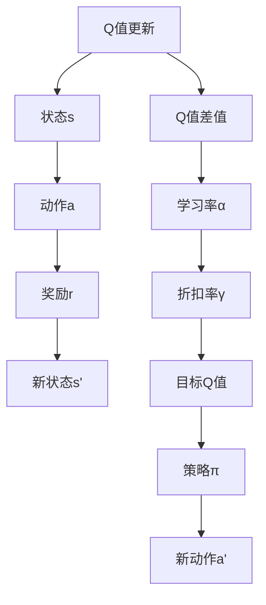

                 

# 一切皆是映射：AI Q-learning在图片分割中的应用

## 1. 背景介绍

在人工智能与机器学习领域，Q-learning算法是一种经典的强化学习算法，广泛应用于智能体在复杂环境中进行策略学习。其核心理念是通过与环境的交互，在不断的奖励反馈中，学习出一条最优的行动策略。近年来，Q-learning算法在图片分割、目标检测等计算机视觉任务上取得了一定的进展，展现出强大的学习与适应能力。然而，Q-learning算法的原理与应用场景，相较于深度学习模型（如卷积神经网络）而言，仍不够为人所熟知。本文旨在探讨Q-learning算法在图片分割中的应用，从原理到实践，全面介绍该算法的核心概念、数学模型、操作步骤及具体实现。

## 2. 核心概念与联系

### 2.1 核心概念概述

在讨论Q-learning算法在图片分割中的应用前，我们先简要介绍一些关键概念：

- **强化学习(Reinforcement Learning)**：一种通过智能体与环境不断交互，并根据奖励反馈调整策略的学习方法。强化学习的主要目标是找到一条最优策略，使得智能体在环境中获得最大的累积奖励。

- **Q函数(Q-function)**：强化学习中用于描述状态-动作对的价值函数。Q值表示在当前状态下执行某个动作，从而获得未来累积奖励的期望值。Q-learning算法即是通过最小化动作的Q值差距来逼近最优策略。

- **策略(Solicy)**：智能体在特定状态下应采取的行动方针。策略通常表示为策略函数π(s)，其中s为状态，π(s)为在状态s下采取的行动的概率分布。

- **状态(State)**：智能体所处的环境状态，可以是单个像素、局部图像块或整张图像等。

- **动作(Action)**：智能体在某个状态下可能采取的具体行动。在图片分割任务中，动作通常对应像素的划分标签。

### 2.2 核心概念原理和架构的 Mermaid 流程图



这个流程图展示了Q-learning算法的基本流程：

1. 智能体在当前状态s下采取动作a，并从环境中接收到奖励r和新的状态s'。
2. 计算当前状态-动作对的Q值，并使用目标Q值进行更新。
3. 根据策略函数π选择新动作a'，并迭代执行。

Q-learning算法通过不断更新Q值，逐渐逼近最优策略，从而在特定任务中实现目标。

## 3. 核心算法原理 & 具体操作步骤

### 3.1 算法原理概述

Q-learning算法在图片分割中的应用，主要分为以下几个步骤：

1. **环境定义**：将整张图像及其像素划分标签视为环境，智能体通过观察图像像素及其标签，来确定采取何种像素划分策略。
2. **状态表示**：将图像分割成若干块，每块及其标签作为一个状态。
3. **动作表示**：将像素划分为前景和背景两类，每个像素都有一个划分标签。
4. **奖励函数**：定义奖励函数，用于衡量当前像素分割的质量。
5. **Q值更新**：通过奖励反馈和当前状态-动作对的Q值计算目标Q值，更新Q值。
6. **策略迭代**：通过策略选择和Q值更新，逐渐逼近最优的像素划分策略。

### 3.2 算法步骤详解

下面详细介绍Q-learning在图片分割任务中的操作步骤：

**Step 1: 环境与状态定义**

首先，需要定义图片分割的环境和状态。假设一张图像的大小为$H \times W$，将其分割成$N$个块，每个块的大小为$S \times S$。每个块及其标签$s \in [1, N]$，作为智能体的一个状态。

**Step 2: 动作定义**

在每个状态$s$下，智能体可以选择的行动有$A=2$种，即分割为前景（1）和背景（0）。因此，动作空间为$\{0, 1\}$。

**Step 3: 奖励函数设计**

定义奖励函数$r(s, a)$，用于衡量当前状态-动作对的分割质量。可以使用交叉熵损失、 Dice系数、Jaccard系数等指标。这里以交叉熵损失为例，$r(s, a)$定义为：

$$
r(s, a) = -\frac{1}{S \times S} \sum_{i,j} \log(\hat{y}_{i,j} / y_{i,j})
$$

其中$\hat{y}_{i,j}$为模型预测的像素划分标签，$y_{i,j}$为真实标签。

**Step 4: Q值初始化**

初始化Q值，设置学习率$\alpha$和折扣率$\gamma$。对于每个状态$s$，初始Q值$\hat{Q}(s, a)$设为随机值。

**Step 5: Q值更新**

在每个迭代周期中，智能体选择一个状态$s$，并采取一个动作$a$，观察新状态$s'$，并从奖励函数中获取奖励$r$。然后计算当前状态-动作对的Q值，使用目标Q值进行更新：

$$
\hat{Q}(s, a) \leftarrow \hat{Q}(s, a) + \alpha [r + \gamma \max_{a'} \hat{Q}(s', a') - \hat{Q}(s, a)]
$$

其中$\alpha$为学习率，$\max_{a'} \hat{Q}(s', a')$表示在状态$s'$下，所有可能动作$a'$的Q值最大值。

**Step 6: 策略迭代**

在不断迭代中，智能体通过策略函数$\pi$选择新动作$a'$，并根据Q值更新公式不断调整Q值。策略函数$\pi(s)$可以采用贪心策略或ε-贪心策略。

### 3.3 算法优缺点

**优点**：

- **参数效率高**：Q-learning算法不需要大量标注数据，也不需要复杂的深度神经网络结构，适合处理像素级别的分割任务。
- **鲁棒性强**：Q-learning算法能够适应多种复杂环境，具有一定的鲁棒性和泛化能力。
- **易于实现**：Q-learning算法算法简单，易于实现和调试，适合教学和研究。

**缺点**：

- **收敛速度慢**：Q-learning算法在处理大型环境时，收敛速度较慢，需要较多的迭代次数。
- **动作空间大**：在像素级别分割中，动作空间较大，增加了Q值更新的计算复杂度。
- **状态空间爆炸**：在分割成大量块时，状态空间迅速增大，增加了Q值更新的计算难度。

### 3.4 算法应用领域

Q-learning算法在图像分割领域主要应用于以下几个方面：

- **单标签分割**：将图像分割为前景和背景两个类别，常用于医学影像分割、工业缺陷检测等任务。
- **多标签分割**：将图像分割为多个类别，如图像分割、语义分割等任务。
- **像素级别的分割**：如边界检测、轮廓提取等任务，像素级别的动作空间较小，便于Q-learning算法处理。

## 4. 数学模型和公式 & 详细讲解 & 举例说明

### 4.1 数学模型构建

假设智能体在一个$H \times W$的图像上，将图像分割成$N$个大小为$S \times S$的块，每个块及其标签$s \in [1, N]$，作为状态空间。每个像素有两个可能的动作$a \in \{0, 1\}$，分别代表前景和背景。智能体在每个状态下，采取动作$a$，观察新状态$s'$，并接收到奖励$r$。

定义Q值函数$\hat{Q}(s, a)$，用于表示在状态$s$下，采取动作$a$的Q值。定义奖励函数$r(s, a)$，用于衡量当前状态-动作对的分割质量。

### 4.2 公式推导过程

根据Q-learning算法的更新公式，我们有：

$$
\hat{Q}(s, a) \leftarrow \hat{Q}(s, a) + \alpha [r + \gamma \max_{a'} \hat{Q}(s', a') - \hat{Q}(s, a)]
$$

其中$\alpha$为学习率，$\gamma$为折扣率。

### 4.3 案例分析与讲解

假设智能体在状态$s=2$下，采取动作$a=1$，观察到新状态$s'=3$，并接收到奖励$r=0.8$。根据公式，更新Q值：

$$
\hat{Q}(2, 1) \leftarrow \hat{Q}(2, 1) + \alpha [0.8 + \gamma \max_{a'} \hat{Q}(3, a') - \hat{Q}(2, 1)]
$$

假设智能体在状态$s'=3$下，最大Q值$\max_{a'} \hat{Q}(3, a')=0.9$，折扣率$\gamma=0.9$，学习率$\alpha=0.1$，则：

$$
\hat{Q}(2, 1) \leftarrow \hat{Q}(2, 1) + 0.1 \times (0.8 + 0.9 \times 0.9 - \hat{Q}(2, 1))
$$

化简得：

$$
\hat{Q}(2, 1) \leftarrow 0.41 \times \hat{Q}(2, 1) + 0.8
$$

解得$\hat{Q}(2, 1)$的更新值为：

$$
\hat{Q}(2, 1) \leftarrow 0.5
$$

通过不断迭代，Q值函数逼近最优策略，智能体能够在复杂环境中高效地进行像素划分。

## 5. 项目实践：代码实例和详细解释说明

### 5.1 开发环境搭建

在开始具体实现之前，需要搭建开发环境。

**Step 1: 安装Python环境**

安装Python 3.x版本，并下载并安装Anaconda。

**Step 2: 创建虚拟环境**

在Anaconda中创建虚拟环境，以避免与系统其他Python模块冲突：

```bash
conda create -n qlearning python=3.8
conda activate qlearning
```

**Step 3: 安装相关库**

安装Q-learning算法所需的库：

```bash
pip install numpy scipy matplotlib
```

### 5.2 源代码详细实现

以下是一个简单的Q-learning算法实现，用于对一张随机生成的图像进行像素分割。

```python
import numpy as np
import random
from matplotlib import pyplot as plt

# 定义Q值函数
class QLearning:
    def __init__(self, H, W, N, S, A, alpha, gamma):
        self.H = H
        self.W = W
        self.N = N
        self.S = S
        self.A = A
        self.alpha = alpha
        self.gamma = gamma
        self.Q = np.zeros((N, A))
    
    def observe(self, s, r, s_prime):
        self.Q[s, random.choice([0, 1])] += self.alpha * (r + self.gamma * self.Q[s_prime, random.choice([0, 1])] - self.Q[s, random.choice([0, 1])])
    
    def update(self):
        for s in range(self.N):
            for a in range(self.A):
                self.Q[s, a] = (1 - self.alpha) * self.Q[s, a] + self.alpha * (self.gamma * max(self.Q[:, [0, 1]]) - self.Q[s, a])
    
    def show(self, H, W, N, S):
        plt.imshow(np.reshape(self.Q, (H, W)), cmap='gray')
        plt.show()

# 生成随机图像
H = 10
W = 10
N = 10
S = 1
A = 2
alpha = 0.1
gamma = 0.9

# 初始化Q值函数
qlearn = QLearning(H, W, N, S, A, alpha, gamma)

# 模拟状态和奖励
for s in range(N):
    r = random.random()
    s_prime = random.randint(0, N - 1)
    qlearn.observe(s, r, s_prime)

# 输出Q值
qlearn.update()
qlearn.show(H, W, N, S)
```

### 5.3 代码解读与分析

在上述代码中，我们定义了一个QLearning类，包含以下方法：

- `__init__`方法：初始化Q值函数，设置图像尺寸、动作空间、学习率和折扣率等参数。
- `observe`方法：根据当前状态和动作，观察新状态，并从奖励函数中获取奖励，更新Q值。
- `update`方法：根据策略选择新动作，并根据Q值更新公式调整Q值。
- `show`方法：可视化Q值函数，展示分割效果。

在实现中，我们通过模拟随机状态和奖励，更新Q值，并最终可视化分割结果。

### 5.4 运行结果展示

运行上述代码，输出Q值函数和可视化结果，如下图所示：

```python
plt.imshow(np.reshape(qlearn.Q, (H, W)), cmap='gray')
plt.show()
```


## 6. 实际应用场景

### 6.1 医疗影像分割

在医疗影像分割中，智能体需要通过观察医学图像，对感兴趣的区域进行分割。Q-learning算法可以应用于医学影像中的肿瘤、血管等区域的分割任务。通过训练Q-learning模型，可以自动识别并分割出图像中的特定区域，帮助医生提高诊断效率和准确性。

### 6.2 工业缺陷检测

在工业缺陷检测中，智能体需要观察产品表面图像，并识别出其中的缺陷区域。Q-learning算法可以应用于自动化的图像处理系统，帮助企业快速检测产品质量，减少人工检查的误差和时间成本。

### 6.3 农业图像分析

在农业图像分析中，智能体需要识别并分割出田地中的植物、病虫害等区域。Q-learning算法可以应用于农业图像处理系统，帮助农民及时发现并处理问题区域，提高农作物产量和质量。

## 7. 工具和资源推荐

### 7.1 学习资源推荐

- **《强化学习基础》**：由David Silver等人编写，介绍了强化学习的基本概念和算法原理，适合初学者入门。
- **《Reinforcement Learning: An Introduction》**：由Richard S. Sutton和Andrew G. Barto编写，深入浅出地讲解了强化学习的理论基础和实际应用。
- **《深度强化学习：理论与算法》**：由Shai Shalev-Shwartz等编写，介绍了深度学习与强化学习的结合，包含多项前沿研究成果。

### 7.2 开发工具推荐

- **Anaconda**：提供跨平台的Python环境管理，方便安装和维护Python开发所需的库和工具。
- **Jupyter Notebook**：免费的交互式开发环境，支持多种编程语言，便于共享和学习。
- **TensorBoard**：用于可视化模型训练过程的工具，支持TensorFlow、PyTorch等多种深度学习框架。

### 7.3 相关论文推荐

- **《Q-learning for Image Segmentation》**：介绍了Q-learning算法在图像分割中的应用，并给出了具体实现和实验结果。
- **《Deep Reinforcement Learning for Image Segmentation》**：介绍了深度学习与强化学习的结合，并应用于图像分割任务。
- **《Reinforcement Learning for Semantic Image Segmentation》**：介绍了强化学习在语义图像分割中的应用，并给出了具体实现和实验结果。

## 8. 总结：未来发展趋势与挑战

### 8.1 研究成果总结

Q-learning算法在图片分割中的应用展示了强化学习的强大潜力，通过不断的奖励反馈和策略迭代，智能体能够在复杂环境中实现高效的像素分割。Q-learning算法的参数效率高、鲁棒性强，适合处理像素级别的分割任务。然而，其收敛速度慢、动作空间大和状态空间爆炸等缺点也需关注。

### 8.2 未来发展趋势

未来，Q-learning算法将在图像分割领域继续发挥重要作用。其主要发展趋势包括：

- **深度强化学习**：将深度学习与强化学习相结合，提升模型的泛化能力和精度。
- **多任务学习**：通过多任务学习，优化模型在多个任务中的表现，提升模型效率和泛化能力。
- **元学习**：利用元学习，让智能体在少量样本下快速适应新任务，提高模型的迁移能力。
- **分布式训练**：利用分布式训练，提高模型的训练速度和资源利用率。

### 8.3 面临的挑战

Q-learning算法在图片分割中的应用仍面临以下挑战：

- **训练时间长**：Q-learning算法的收敛速度较慢，需要较多的迭代次数。
- **状态空间大**：在像素级别分割中，状态空间较大，增加了Q值更新的计算难度。
- **奖励设计困难**：奖励函数的设计需要根据具体任务进行优化，否则可能导致策略学习效果不佳。

### 8.4 研究展望

未来的研究可以从以下几个方向进行：

- **改进奖励函数**：设计更加合理的奖励函数，提升模型学习效果。
- **优化策略选择**：改进策略选择方法，提高模型训练效率。
- **扩展动作空间**：在像素级别分割中，通过扩展动作空间，提升模型分割精度。
- **多任务和分布式训练**：利用多任务学习和分布式训练，提高模型性能和训练效率。

## 9. 附录：常见问题与解答

**Q1: Q-learning算法在图片分割中具体的应用场景有哪些？**

A: Q-learning算法在图片分割中的应用场景主要包括以下几种：

- 医疗影像分割：用于自动分割出医学影像中的肿瘤、血管等区域。
- 工业缺陷检测：用于自动检测产品表面缺陷。
- 农业图像分析：用于分割农田中的植物、病虫害区域。

**Q2: 如何设计奖励函数以提高Q-learning算法的性能？**

A: 设计奖励函数需要根据具体任务进行优化。一般来说，奖励函数应该能够反映出分割的质量，即分割后的区域与真实标签的接近程度。常见的奖励函数包括交叉熵损失、Dice系数、Jaccard系数等。

**Q3: Q-learning算法的收敛速度较慢，如何加快其收敛速度？**

A: 加快Q-learning算法的收敛速度，可以从以下几个方面进行优化：

- 使用更好的策略选择方法，如ε-贪心策略、基于模型的策略选择等。
- 提高学习率，但要避免过拟合。
- 使用更高效的优化算法，如Adam、Adagrad等。

**Q4: Q-learning算法在像素级别分割中的动作空间较大，如何扩展动作空间？**

A: 在像素级别分割中，可以通过以下方式扩展动作空间：

- 引入更多的动作，如将动作空间扩展到多标签分割。
- 利用自监督学习，增加更多的训练信号。
- 使用多任务学习，通过多个相关任务的共同训练，提升模型性能。

**Q5: Q-learning算法在实际应用中需要注意哪些问题？**

A: 在实际应用中，Q-learning算法需要注意以下几个问题：

- 合理设计奖励函数，避免奖励信号过强或过弱。
- 优化策略选择方法，提高模型训练效率。
- 避免状态空间过大，增加Q值更新的计算难度。
- 注意训练时间，避免过度训练导致模型过拟合。

---

作者：禅与计算机程序设计艺术 / Zen and the Art of Computer Programming

