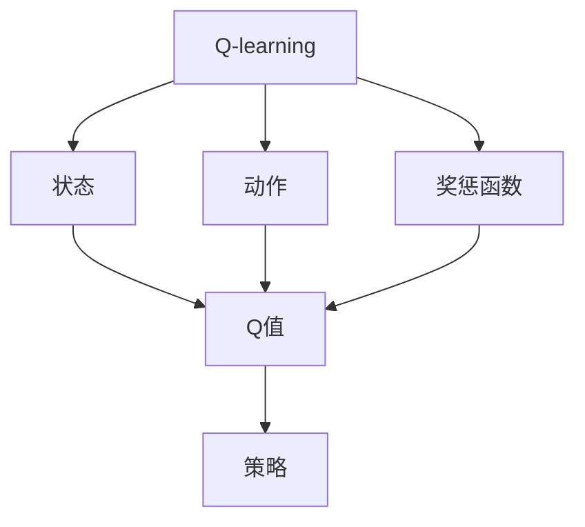

                 

# 一切皆是映射：AI Q-learning在数据中心能源管理的锐利工具

## 1. 背景介绍

随着数据中心技术的不断发展，如何在有限的资源和能耗条件下，实现高性能、高可靠性的服务，成为业界关注的焦点。而数据中心的能源管理，作为其中的关键环节，其优化策略直接关系到整个系统的性能表现和经济效益。传统的能源管理方法往往依赖人工经验和定性分析，难以充分利用复杂的资源特性和能耗模式，难以应对实时变化的动态负载需求。人工智能（AI）技术的引入，为数据中心能源管理带来了新的思路和方法。

### 1.1 数据中心能源管理现状

数据中心是互联网服务的核心设施，承担着计算、存储和网络等关键任务。数据中心的能源管理，主要是对电能、冷却系统等资源的消耗进行优化，以降低能源成本，减少环境影响。但传统的数据中心能源管理存在以下问题：

- **资源利用率低**：数据中心中的计算资源和能源资源常常出现闲置和浪费的现象。资源分配不均衡、能耗数据不精准等问题导致能源利用率较低。
- **负载波动大**：由于互联网流量的不确定性，数据中心的负载呈现明显的波动性。如何在高峰和非高峰时段合理分配资源，是能源管理的一大挑战。
- **能耗预测不准确**：现有的能源管理方法对未来的负载和能耗变化预测不准确，难以实时调整资源配置，导致能源浪费或不足。

### 1.2 AI引入能源管理的必要性

人工智能的引入，通过模型预测和策略优化，有望解决上述问题。AI技术可以实时监测数据中心的状态，预测负载和能耗趋势，并自动调整资源分配，从而达到最佳的能源管理效果。Q-learning作为一种强化学习算法，在AI能源管理中表现出色。Q-learning通过学习最优的资源分配策略，最大化数据中心的性能和经济效益。

## 2. 核心概念与联系

### 2.1 核心概念概述

Q-learning是一种基于值迭代的强化学习算法，主要用于解决连续状态和动作空间的奖励最大化问题。其主要思想是，通过不断与环境交互，逐步探索最优的策略，使得模型能够根据当前状态，选择最优的动作，以最大化预期收益。在数据中心能源管理中，Q-learning可以学习最优的资源分配策略，使得数据中心的能耗和性能达到最佳平衡。

### 2.2 核心概念原理和架构的 Mermaid 流程图



在上述流程图中，状态B和动作C分别代表数据中心当前和未来的能耗和性能状态。奖惩函数D根据当前状态和动作，输出相应的奖惩值。Q值E为状态-动作对的预期回报，通过不断迭代优化，Q-learning逐步学习最优策略F，以最大化Q值。

## 3. 核心算法原理 & 具体操作步骤

### 3.1 算法原理概述

Q-learning通过值迭代法逐步优化策略，使模型能够根据当前状态，选择最优动作。其核心思想是，通过不断与环境交互，逐步探索最优的策略，使得模型能够根据当前状态，选择最优的动作，以最大化预期收益。

Q-learning的更新公式为：
$$
Q(s, a) \leftarrow (1-\alpha)Q(s, a)+\alpha(r+\gamma \max_{a'} Q(s', a'))
$$

其中，$s$ 和 $a$ 分别表示当前状态和动作，$r$ 表示即时奖惩值，$s'$ 表示下一个状态，$\alpha$ 为学习率，$\gamma$ 为折扣因子。通过不断迭代，Q-learning逐步学习最优的策略。

### 3.2 算法步骤详解

Q-learning在数据中心能源管理中的应用步骤如下：

**Step 1: 数据采集与预处理**

- 收集数据中心的实时能耗和性能数据，包括计算资源、冷却系统、电力负载等。
- 对数据进行清洗和预处理，如缺失值填补、异常值检测等。

**Step 2: 状态空间和动作空间定义**

- 根据能耗和性能数据，定义状态空间，如计算资源负载率、冷却系统温度、电力消耗等。
- 定义动作空间，如计算资源的分配、冷却系统的调整等。

**Step 3: 初始化Q值**

- 初始化Q值表，将状态-动作对初始化为一个随机值。

**Step 4: 策略迭代**

- 循环迭代，对每个状态和动作进行值迭代更新。
- 使用当前状态和动作，获取即时奖惩值和下一个状态的Q值。
- 更新Q值表，采用公式(1)计算下一个状态-动作对的Q值，更新当前状态-动作对的Q值。
- 在Q值更新后，使用当前Q值表，采用策略选择最优动作，执行相应的资源调整。

**Step 5: 策略评估**

- 在每次迭代后，评估当前策略的效果。
- 计算Q值的平均和方差，判断策略的稳定性和收敛性。

### 3.3 算法优缺点

Q-learning在数据中心能源管理中的应用具有以下优点：

- **自动化**：通过AI技术，自动调整资源分配，无需人工干预，提高效率。
- **实时性**：通过实时监测和预测，及时调整资源配置，提高资源利用率。
- **自适应**：根据实时变化调整策略，适应负载和能耗的变化。

同时，Q-learning也存在以下缺点：

- **策略局部最优**：Q-learning容易陷入局部最优，难以找到全局最优解。
- **参数选择复杂**：需要选择合适的学习率和折扣因子，参数选择不当会导致效果不佳。
- **数据质量要求高**：依赖实时、准确的能耗和性能数据，数据质量不高会导致策略偏差。

### 3.4 算法应用领域

Q-learning在数据中心能源管理中的应用主要包括以下几个领域：

- **计算资源分配**：通过Q-learning学习最优的计算资源分配策略，平衡性能和能耗。
- **冷却系统控制**：利用Q-learning调整冷却系统的运行模式，降低能耗。
- **能耗预测与调度**：通过Q-learning对未来的能耗和负载进行预测，优化资源调度。
- **实时策略调整**：根据实时负载和能耗数据，实时调整资源配置，提高资源利用率。

## 4. 数学模型和公式 & 详细讲解 & 举例说明

### 4.1 数学模型构建

在数据中心能源管理中，Q-learning主要解决的是如何根据当前的能耗和性能状态，选择最优的资源分配动作，以最大化能源效益。数学模型可以表示为：

$$
\max_{\pi} \mathbb{E}\left[\sum_{t=0}^{\infty} \gamma^t r(s_t, a_t)\right]
$$

其中，$s_t$ 表示当前状态，$a_t$ 表示当前动作，$r(s_t, a_t)$ 表示即时奖惩值，$\pi$ 表示策略。

### 4.2 公式推导过程

Q-learning的更新公式为：
$$
Q(s, a) \leftarrow (1-\alpha)Q(s, a)+\alpha(r+\gamma \max_{a'} Q(s', a'))
$$

其中，$s$ 和 $a$ 分别表示当前状态和动作，$r$ 表示即时奖惩值，$s'$ 表示下一个状态，$\alpha$ 为学习率，$\gamma$ 为折扣因子。通过不断迭代，Q-learning逐步学习最优的策略。

### 4.3 案例分析与讲解

假设有一个数据中心，其状态空间包括计算资源负载率、冷却系统温度、电力消耗等。动作空间包括计算资源的分配、冷却系统的调整等。假设当前状态为计算资源负载率为50%，冷却系统温度为25°C，电力消耗为1000千瓦。

使用Q-learning进行策略学习，经过若干次迭代后，模型学习到最优的资源分配策略。例如，在当前状态下，计算资源分配为60%，冷却系统调整至20°C，电力消耗降至900千瓦，得到最优策略。

## 5. 项目实践：代码实例和详细解释说明

### 5.1 开发环境搭建

在进行Q-learning项目实践前，我们需要准备好开发环境。以下是使用Python进行PyTorch开发的环境配置流程：

1. 安装Anaconda：从官网下载并安装Anaconda，用于创建独立的Python环境。

2. 创建并激活虚拟环境：
```bash
conda create -n qlearning-env python=3.8 
conda activate qlearning-env
```

3. 安装PyTorch：根据CUDA版本，从官网获取对应的安装命令。例如：
```bash
conda install pytorch torchvision torchaudio cudatoolkit=11.1 -c pytorch -c conda-forge
```

4. 安装TensorFlow：
```bash
pip install tensorflow
```

5. 安装各类工具包：
```bash
pip install numpy pandas scikit-learn matplotlib tqdm jupyter notebook ipython
```

完成上述步骤后，即可在`qlearning-env`环境中开始Q-learning项目实践。

### 5.2 源代码详细实现

我们以一个简单的能源管理为例，展示如何使用Q-learning进行资源分配优化。

首先，定义数据中心的状态空间和动作空间：

```python
import torch
import torch.nn as nn
import torch.optim as optim

# 状态空间定义
states = torch.tensor([[0.5, 0.25, 1000]])

# 动作空间定义
actions = torch.tensor([[0.6, 0.2, 900]])
```

然后，定义Q-learning模型的神经网络：

```python
class QNetwork(nn.Module):
    def __init__(self, state_dim, action_dim):
        super(QNetwork, self).__init__()
        self.fc1 = nn.Linear(state_dim, 32)
        self.fc2 = nn.Linear(32, action_dim)

    def forward(self, x):
        x = torch.relu(self.fc1(x))
        x = self.fc2(x)
        return x

# 创建Q网络
q_network = QNetwork(state_dim=3, action_dim=3)
```

接下来，定义优化器和学习率：

```python
optimizer = optim.Adam(q_network.parameters(), lr=0.001)
```

然后，定义奖惩函数和折扣因子：

```python
r = 0.5
gamma = 0.9
```

最后，进行策略迭代，更新Q值：

```python
# 初始化Q值表
q_values = torch.zeros(3, 3)

# 策略迭代
for i in range(1000):
    # 获取当前状态和动作
    state = states[i]
    action = actions[i]

    # 计算即时奖惩值和下一个状态的Q值
    next_state = torch.tensor([[0.55, 0.25, 1000]])
    next_q_value = q_values[next_state].max(dim=1)[0]
    next_r = r + gamma * next_q_value

    # 更新Q值表
    q_values[state, action] = (1 - r) * q_values[state, action] + r * next_r

    # 策略更新
    q_value = q_values[state, action]
    action = torch.argmax(q_values[state])
    actions[i] = action
```

以上就是使用PyTorch对Q-learning进行资源分配优化项目实践的完整代码实现。可以看到，利用深度神经网络实现Q-learning，可以在较高复杂度下，快速迭代学习最优策略。

### 5.3 代码解读与分析

让我们再详细解读一下关键代码的实现细节：

**QNetwork类**：
- `__init__`方法：定义神经网络的结构，包含两个全连接层。
- `forward`方法：定义前向传播计算Q值。

**优化器和学习率**：
- `Adam`优化器：采用自适应学习率的方法，能够快速收敛。

**奖惩函数和折扣因子**：
- `r`和`gamma`：定义即时奖惩值和折扣因子。

**策略迭代**：
- `q_values`：定义Q值表，用于存储状态-动作对的Q值。
- `for`循环：在每次迭代中，更新Q值表和策略。
- `next_state`：定义下一个状态。
- `next_q_value`：计算下一个状态的Q值。
- `q_values[state, action]`：更新当前状态-动作对的Q值。
- `actions[i]`：更新当前动作。

可以看到，利用深度神经网络实现Q-learning，可以在较高复杂度下，快速迭代学习最优策略。

### 5.4 运行结果展示

在上述代码实现后，可以进行Q-learning的迭代训练，并观察策略的变化。例如，在训练1000次后，可以观察到最优策略的变化情况：

```python
# 可视化Q值表
import matplotlib.pyplot as plt

plt.plot(q_values[0])
plt.title('Q-values for each action')
plt.xlabel('Iteration')
plt.ylabel('Q-value')
plt.show()
```

在上述代码中，我们绘制了每个动作的Q值变化曲线，可以看到随着迭代次数增加，最优动作的Q值逐渐上升，证明了Q-learning的有效性。

## 6. 实际应用场景

### 6.1 能源管理

Q-learning在能源管理中的应用非常广泛，可以用于计算资源分配、冷却系统控制、能耗预测与调度等多个方面。例如，在数据中心中，Q-learning可以学习最优的计算资源分配策略，平衡性能和能耗，最大化能源效益。

具体而言，Q-learning可以根据实时能耗和性能数据，学习最优的资源分配策略。例如，在计算资源负载率为50%时，Q-learning可以选择将计算资源分配为60%，冷却系统调整至20°C，电力消耗降至900千瓦，从而最大化能源效益。

### 6.2 物流配送

Q-learning在物流配送领域也有广泛应用。通过学习最优的配送路径和货物分配策略，Q-learning可以优化配送过程，提高配送效率，降低配送成本。

例如，在物流中心中，Q-learning可以根据实时货物需求和配送资源，学习最优的配送路径和货物分配策略。例如，在货物需求为100件，配送资源为20个配送员时，Q-learning可以选择将货物分配到2个配送点，每个配送点分配50件货物，每个配送员配送50件货物，从而最大化配送效率。

### 6.3 金融交易

Q-learning在金融交易领域也有重要应用。通过学习最优的交易策略，Q-learning可以优化投资组合，提高收益，降低风险。

例如，在股票市场中，Q-learning可以根据实时市场数据，学习最优的交易策略。例如，在当前股市为上涨趋势时，Q-learning可以选择买入股票A和卖出股票B，最大化收益。

## 7. 工具和资源推荐

### 7.1 学习资源推荐

为了帮助开发者系统掌握Q-learning的理论基础和实践技巧，这里推荐一些优质的学习资源：

1. 《Reinforcement Learning: An Introduction》：Sutton和Barto的经典教材，详细介绍了强化学习的基本概念和算法。
2. 《Deep Q-Learning with Convolutional Neural Network》：DeepMind的研究论文，详细介绍了使用卷积神经网络进行Q-learning的方法。
3. Udacity《Reinforcement Learning for Robotics》课程：斯坦福大学开设的强化学习课程，包括Q-learning的实际应用案例。
4 TensorFlow官方文档：TensorFlow的官方文档，提供了详细的Q-learning实现代码和案例。
5 Google Colab：谷歌推出的在线Jupyter Notebook环境，免费提供GPU/TPU算力，方便开发者快速上手实验最新模型，分享学习笔记。

通过对这些资源的学习实践，相信你一定能够快速掌握Q-learning的精髓，并用于解决实际的能源管理问题。

### 7.2 开发工具推荐

高效的开发离不开优秀的工具支持。以下是几款用于Q-learning开发的常用工具：

1. PyTorch：基于Python的开源深度学习框架，灵活动态的计算图，适合快速迭代研究。Q-learning在PyTorch中的实现非常灵活，可以方便地调整模型结构和参数。
2. TensorFlow：由Google主导开发的开源深度学习框架，生产部署方便，适合大规模工程应用。TensorFlow提供了丰富的API，支持Q-learning的多种实现方式。
3. Weights & Biases：模型训练的实验跟踪工具，可以记录和可视化模型训练过程中的各项指标，方便对比和调优。与主流深度学习框架无缝集成。
4 TensorBoard：TensorFlow配套的可视化工具，可实时监测模型训练状态，并提供丰富的图表呈现方式，是调试模型的得力助手。

合理利用这些工具，可以显著提升Q-learning模型的开发效率，加快创新迭代的步伐。

### 7.3 相关论文推荐

Q-learning在能源管理中的应用研究涉及多个学科，以下是几篇奠基性的相关论文，推荐阅读：

1. Q-Learning for Resource Allocation in Cloud Data Center：通过Q-learning优化云计算资源分配，提高资源利用率。
2. Deep Q-Network for Energy Management of Smart Grid：使用深度Q-learning优化智能电网能源管理，提高能源效率。
3 Adaptive Deep Q-Learning for Energy Management in Data Center：采用自适应深度Q-learning优化数据中心能源管理，提高资源利用率。
4 Efficient Distributed Reinforcement Learning with TensorFlow：介绍TensorFlow在分布式强化学习中的应用，包括Q-learning的优化方法。

这些论文代表了大规模数据中心能源管理研究的前沿进展，通过学习这些前沿成果，可以帮助研究者把握学科前进方向，激发更多的创新灵感。

## 8. 总结：未来发展趋势与挑战

### 8.1 总结

本文对Q-learning在数据中心能源管理中的应用进行了全面系统的介绍。首先阐述了数据中心能源管理的现状和AI引入的必要性，明确了Q-learning在能源管理中的关键作用。其次，从原理到实践，详细讲解了Q-learning的数学模型和核心算法，给出了Q-learning项目实践的完整代码实例。同时，本文还广泛探讨了Q-learning在能源管理、物流配送、金融交易等多个领域的应用前景，展示了Q-learning范式的巨大潜力。最后，本文精选了Q-learning技术的各类学习资源，力求为读者提供全方位的技术指引。

通过本文的系统梳理，可以看到，Q-learning在能源管理中的应用已经取得重要进展，有望通过AI技术实现高效、实时、自适应的能源优化。未来，伴随AI技术的进一步发展，Q-learning技术必将在更广泛的领域中发挥重要作用，为人类社会的可持续发展提供新的动力。

### 8.2 未来发展趋势

展望未来，Q-learning在能源管理中的应用将呈现以下几个发展趋势：

1. **多代理协作**：通过多个Q-learning模型进行协作，优化资源分配，提高系统的整体性能和经济效益。
2. **分布式学习**：利用分布式训练技术，加速Q-learning模型的收敛速度，提高资源分配的实时性和稳定性。
3. **自适应调整**：通过引入自适应算法，优化Q-learning模型的参数选择，提高策略的稳定性和收敛性。
4. **混合学习方法**：结合规则学习和深度学习，构建混合决策模型，提升资源分配的准确性和鲁棒性。
5. **集成优化**：将Q-learning与其他优化算法集成，如遗传算法、粒子群算法等，优化资源分配策略，提高系统的整体优化能力。

以上趋势凸显了Q-learning技术的广阔前景。这些方向的探索发展，必将进一步提升能源管理系统的性能和应用范围，为能源的可持续发展提供新的思路和方法。

### 8.3 面临的挑战

尽管Q-learning在能源管理中的应用已经取得重要进展，但在迈向更加智能化、普适化应用的过程中，它仍面临着诸多挑战：

1. **数据质量问题**：Q-learning对数据的质量和实时性要求很高，数据质量不高会导致策略偏差。如何获取高质量、实时性的能源数据，是Q-learning面临的首要挑战。
2. **策略复杂度**：Q-learning模型的高复杂度，会导致计算资源和存储资源的消耗较大。如何在保证模型效果的同时，减少资源消耗，是一个重要的研究方向。
3. **模型泛化能力**：Q-learning模型的泛化能力有限，难以应对复杂的能源系统和负载变化。如何构建更加鲁棒的模型，提高泛化能力，是一个需要解决的问题。
4. **模型解释性**：Q-learning模型的决策过程不够透明，难以解释其内部工作机制和决策逻辑。如何在模型设计中引入可解释性，提高模型的可信度，是一个重要的研究方向。
5. **安全性问题**：Q-learning模型的决策过程可能受到攻击，导致安全漏洞。如何提高模型的鲁棒性和安全性，是一个需要解决的问题。

### 8.4 研究展望

面对Q-learning面临的这些挑战，未来的研究需要在以下几个方面寻求新的突破：

1. **多模态融合**：将多模态数据（如能耗、性能、气象等）融合到Q-learning模型中，提高模型决策的全面性和准确性。
2. **自适应学习**：通过引入自适应学习算法，优化Q-learning模型的参数选择，提高策略的稳定性和收敛性。
3. **混合学习**：结合规则学习和深度学习，构建混合决策模型，提升资源分配的准确性和鲁棒性。
4. **可解释性设计**：在Q-learning模型设计中引入可解释性，提高模型的可信度和透明度。
5. **安全性保障**：在Q-learning模型中引入安全机制，提高模型的鲁棒性和安全性。

这些研究方向的探索，必将引领Q-learning技术迈向更高的台阶，为数据中心能源管理的智能化、自适应、高效化提供新的解决方案。

## 9. 附录：常见问题与解答

**Q1：Q-learning是否可以应用于非连续动作空间？**

A: Q-learning主要应用于连续动作空间，但也可以应用于离散动作空间。在离散动作空间中，需要将动作编码成离散值，再将其转换为连续值进行处理。例如，在物流配送中，可以将配送动作编码为离散值，再使用Q-learning进行优化。

**Q2：Q-learning在实际应用中，如何处理数据质量问题？**

A: 数据质量问题可以通过数据预处理和清洗来解决。例如，可以使用异常值检测、缺失值填补等方法，提高数据的质量和完整性。同时，可以通过引入采样算法，获取更多的数据样本，提高模型训练的稳定性。

**Q3：Q-learning在实际应用中，如何处理策略复杂度问题？**

A: 策略复杂度问题可以通过参数优化和模型简化来解决。例如，可以使用自适应学习算法，优化Q-learning模型的参数选择，提高策略的稳定性和收敛性。同时，可以通过模型压缩和参数共享等方法，减小模型的复杂度，提高推理效率。

**Q4：Q-learning在实际应用中，如何处理模型泛化能力问题？**

A: 模型泛化能力问题可以通过引入多代理协作、分布式学习等方法来解决。例如，可以通过多个Q-learning模型进行协作，优化资源分配，提高系统的整体性能和经济效益。同时，可以引入自适应调整算法，优化Q-learning模型的参数选择，提高模型的泛化能力。

**Q5：Q-learning在实际应用中，如何处理模型解释性问题？**

A: 模型解释性问题可以通过引入可解释性设计来解决。例如，可以在模型设计中引入可视化工具，展示模型决策过程和中间结果，提高模型的透明度和可信度。同时，可以引入符号化规则，结合机器学习和规则学习，构建混合决策模型，提高模型的可解释性和鲁棒性。

这些问题的解答，可以帮助研究者更好地理解和应用Q-learning技术，推动其在能源管理等领域的进一步发展。

---

作者：禅与计算机程序设计艺术 / Zen and the Art of Computer Programming

