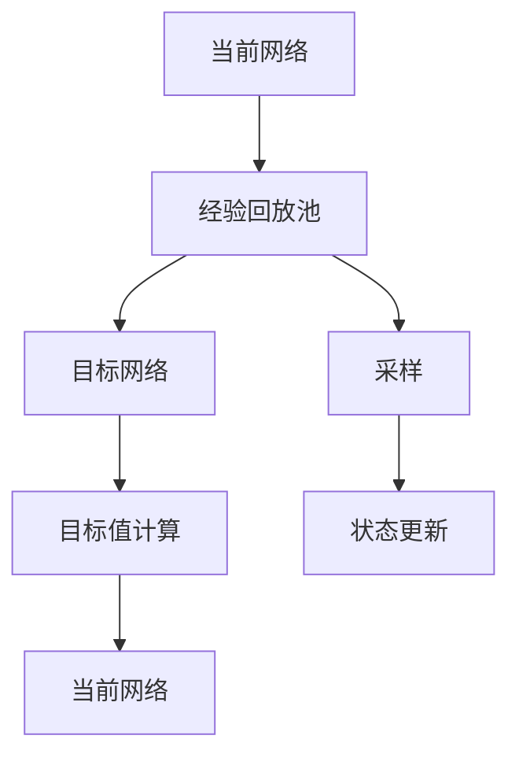

                 

# 一切皆是映射：DQN中的目标网络：为什么它是必要的？

> 关键词：深度强化学习, 深度Q网络(DQN), 目标网络, 稳定性, 深度强化学习中的优化, 深度学习中的经验回放

## 1. 背景介绍

深度强化学习(Deep Reinforcement Learning, DRL)是近年来机器学习领域的热门研究方向，广泛应用于游戏、机器人控制、自动驾驶等高难度任务。深度Q网络(Depth-Q Network, DQN)是DRL中最为成功的方法之一，广泛应用于单智能体决策、多智能体协作、组合优化等多个领域。

DQN通过深度神经网络进行Q值函数逼近，以策略$π_θ$表示当前状态$s$下采取动作$a$的策略，其Q值函数$Q(s,a)$代表在状态$s$下采取动作$a$后所能获得的期望回报。通过反向传播和优化算法更新网络参数$θ$，使得$Q(s,a)$尽可能接近真实的Q值。DQN的成功在于通过经验回放(Experience Replay)和目标网络(Target Network)技术，显著提升了模型的稳定性。

本节将详细介绍DQN中的目标网络机制及其必要性，帮助读者深入理解DQN的优化过程。

## 2. 核心概念与联系

### 2.1 核心概念概述

DQN中的目标网络机制指的是引入一个额外的网络$Q_{\tau}$，与当前网络$Q_θ$并行存在。在每个时间步$t$，目标网络$Q_{\tau}$从经验回放池中随机抽取一个$(s_t,a_t,r_t,s_{t+1})$四元组，计算出Q值$Q_{\tau}(s_t,a_t,s_{t+1})$，并将其作为目标值$y_t$，用于更新当前网络$Q_θ$的损失函数。具体地，每个时间步的目标值$y_t$的计算公式为：

$$
y_t = r_t + \gamma Q_{\tau}(s_{t+1}, \pi_{\tau}(s_{t+1}))
$$

其中，$\gamma$为折扣因子，$\pi_{\tau}$为目标网络的状态策略。

该机制的引入使得目标网络$Q_{\tau}$在每次策略更新时，提供了一个稳定的Q值估计，从而减小了更新误差对网络参数的扰动，提高了模型的稳定性。

### 2.2 核心概念原理和架构的 Mermaid 流程图



该图展示了DQN中目标网络机制的核心流程：
- 当前网络从经验回放池中采样$(s_t,a_t,r_t,s_{t+1})$，计算$Q_θ(s_t,a_t)$。
- 目标网络$Q_{\tau}$根据目标值计算公式，提供$y_t$作为目标值。
- 当前网络使用Q值估计$Q_θ(s_t,a_t)$和目标值$y_t$，更新网络参数。
- 经验回放池用于存储经验数据，以便后续训练使用。

## 3. 核心算法原理 & 具体操作步骤

### 3.1 算法原理概述

DQN中的目标网络机制，其核心原理在于通过目标网络提供稳定的Q值估计，减小当前网络参数更新的波动，从而提高模型的稳定性和收敛速度。这一机制的引入使得DQN模型在无偏估计和参数更新两方面都取得了显著改进：

1. **无偏估计**：目标网络$Q_{\tau}$与当前网络$Q_θ$并不完全相同，因此其估计的Q值存在一定偏差。在每个时间步，通过目标值计算公式引入目标网络，将Q值估计从纯随机估计中分离出来，提供无偏估计。

2. **参数更新**：当前网络$Q_θ$通过与目标网络$Q_{\tau}$的Q值估计$Q_{\tau}(s_t,a_t)$，以优化自身参数，从而减小更新误差对网络参数的扰动，提高模型的稳定性。

### 3.2 算法步骤详解

以下是DQN中目标网络机制的详细步骤：

1. **初始化**：设置两个相同的深度神经网络$Q_θ$和$Q_{\tau}$，初始参数相同。

2. **数据采样**：从经验回放池中随机抽取一批经验数据$(s_t,a_t,r_t,s_{t+1})$，作为当前网络的输入。

3. **Q值估计**：当前网络$Q_θ$对输入经验数据进行前向传播，计算Q值估计$Q_θ(s_t,a_t)$。

4. **目标值计算**：目标网络$Q_{\tau}$对经验数据进行前向传播，计算目标值$y_t = r_t + \gamma Q_{\tau}(s_{t+1}, \pi_{\tau}(s_{t+1}))$。

5. **损失函数计算**：计算当前网络$Q_θ$与目标值$y_t$的均方误差损失$L = (Q_θ(s_t,a_t) - y_t)^2$。

6. **反向传播与参数更新**：通过反向传播算法计算当前网络$Q_θ$的梯度，并使用优化算法（如AdamW）更新网络参数。

7. **目标网络更新**：目标网络$Q_{\tau}$使用当前网络$Q_θ$的参数进行更新，以保证两者参数差异不大，即$\tau < \theta$。

### 3.3 算法优缺点

#### 优点

1. **稳定性提升**：目标网络提供了无偏估计，减小了更新误差对网络参数的扰动，从而提高了模型的稳定性。

2. **收敛速度加快**：目标网络提供了稳定的Q值估计，使得当前网络能够更加准确地更新参数，从而加快了模型的收敛速度。

3. **泛化能力增强**：目标网络的存在使得当前网络能够更加准确地学习到环境信息，从而提高了模型的泛化能力。

#### 缺点

1. **额外的计算开销**：目标网络机制需要额外的计算资源和存储空间，可能会增加算法的计算开销。

2. **参数同步问题**：目标网络与当前网络的参数更新需要同步进行，可能存在参数不一致问题。

3. **易受目标网络影响**：目标网络的存在可能会使得当前网络在更新时更加依赖目标网络，从而限制了当前网络的探索能力。

### 3.4 算法应用领域

目标网络机制广泛应用于DQN中，用于提升模型的稳定性和收敛速度。以下是一些典型的应用领域：

1. **游戏AI**：在AlphaGo等游戏中，目标网络机制显著提高了模型的稳定性和收敛速度，使得游戏AI能够在复杂环境中做出更优的决策。

2. **机器人控制**：在机器人控制中，目标网络机制用于提升模型的鲁棒性和泛化能力，使得机器人能够在多种环境中稳定运行。

3. **自动驾驶**：在自动驾驶中，目标网络机制用于提升模型的决策准确性和稳定性，使得车辆能够在复杂交通环境中安全行驶。

## 4. 数学模型和公式 & 详细讲解 & 举例说明

### 4.1 数学模型构建

DQN中的目标网络机制可以通过数学模型来详细描述。假设当前网络$Q_θ$和目标网络$Q_{\tau}$的状态策略分别为$\pi_θ$和$\pi_{\tau}$，则每个时间步的目标值$y_t$的数学模型可以表示为：

$$
y_t = r_t + \gamma Q_{\tau}(s_{t+1}, \pi_{\tau}(s_{t+1}))
$$

其中，$Q_{\tau}(s_{t+1}, \pi_{\tau}(s_{t+1}))$表示目标网络在状态$s_{t+1}$下的Q值估计，$\pi_{\tau}$为目标网络的状态策略。

### 4.2 公式推导过程

目标值计算公式$y_t = r_t + \gamma Q_{\tau}(s_{t+1}, \pi_{\tau}(s_{t+1}))$中的各个组成部分推导如下：

1. **当前网络Q值估计$Q_θ(s_t,a_t)$**：
   - 当前网络$Q_θ$对输入$s_t$和$a_t$进行前向传播，计算Q值估计$Q_θ(s_t,a_t)$。

2. **目标网络Q值估计$Q_{\tau}(s_{t+1}, \pi_{\tau}(s_{t+1}))$**：
   - 目标网络$Q_{\tau}$对输入$s_{t+1}$进行前向传播，计算Q值估计$Q_{\tau}(s_{t+1}, \pi_{\tau}(s_{t+1}))$。

3. **目标值$y_t$**：
   - 将当前状态$s_t$的奖励$r_t$与目标网络在下一状态$s_{t+1}$下的Q值估计$Q_{\tau}(s_{t+1}, \pi_{\tau}(s_{t+1}))$相加，乘以折扣因子$\gamma$，得到目标值$y_t$。

### 4.3 案例分析与讲解

以AlphaGo为例，分析目标网络机制的具体应用。AlphaGo使用DQN作为其决策策略的核心，通过目标网络机制，显著提高了模型的稳定性和收敛速度。具体来说，AlphaGo的目标网络机制包括以下几个步骤：

1. **数据采样**：从经验回放池中随机抽取一批经验数据$(s_t,a_t,r_t,s_{t+1})$，作为当前网络的输入。

2. **Q值估计**：当前网络$Q_θ$对输入经验数据进行前向传播，计算Q值估计$Q_θ(s_t,a_t)$。

3. **目标值计算**：目标网络$Q_{\tau}$对经验数据进行前向传播，计算目标值$y_t = r_t + \gamma Q_{\tau}(s_{t+1}, \pi_{\tau}(s_{t+1}))$。

4. **损失函数计算**：计算当前网络$Q_θ$与目标值$y_t$的均方误差损失$L = (Q_θ(s_t,a_t) - y_t)^2$。

5. **反向传播与参数更新**：通过反向传播算法计算当前网络$Q_θ$的梯度，并使用优化算法（如AdamW）更新网络参数。

6. **目标网络更新**：目标网络$Q_{\tau}$使用当前网络$Q_θ$的参数进行更新，以保证两者参数差异不大，即$\tau < \theta$。

通过目标网络机制，AlphaGo显著提高了模型的稳定性，能够在大规模数据上实现快速收敛，从而在围棋游戏中取得了历史性突破。

## 5. 项目实践：代码实例和详细解释说明

### 5.1 开发环境搭建

为了实践DQN中的目标网络机制，需要搭建深度学习环境，包括Python、PyTorch和相关依赖包。以下是搭建环境的详细步骤：

1. 安装Python：从官网下载Python 3.x版本，进行安装。

2. 安装PyTorch：
   - 安装PyTorch的稳定版本：`pip install torch torchvision torchaudio`
   - 安装PyTorch的开发版本：`pip install torch torchvision torchaudio --pre`

3. 安装其他依赖包：
   - 安装Numpy、Matplotlib、Pandas、Scikit-learn等科学计算库：`pip install numpy matplotlib pandas scikit-learn`

4. 配置环境：将环境变量`PYTHONPATH`添加到系统路径中，以便于开发调试。

### 5.2 源代码详细实现

以下是一个简单的DQN模型实现，其中包含目标网络机制的详细代码。

```python
import torch
import torch.nn as nn
import torch.optim as optim
import torch.nn.functional as F
from torch.distributions import Categorical

class DQN(nn.Module):
    def __init__(self, input_dim, output_dim, hidden_dim):
        super(DQN, self).__init__()
        self.fc1 = nn.Linear(input_dim, hidden_dim)
        self.fc2 = nn.Linear(hidden_dim, hidden_dim)
        self.fc3 = nn.Linear(hidden_dim, output_dim)
        self.target = nn.Linear(hidden_dim, output_dim)

    def forward(self, x):
        x = F.relu(self.fc1(x))
        x = F.relu(self.fc2(x))
        x = self.fc3(x)
        return x

class DQNAgent:
    def __init__(self, input_dim, output_dim, hidden_dim, learning_rate, gamma, tau):
        self.input_dim = input_dim
        self.output_dim = output_dim
        self.hidden_dim = hidden_dim
        self.learning_rate = learning_rate
        self.gamma = gamma
        self.tau = tau

        self.model = DQN(self.input_dim, self.output_dim, self.hidden_dim)
        self.target = DQN(self.input_dim, self.output_dim, self.hidden_dim)
        self.optimizer = optim.Adam(self.model.parameters(), lr=self.learning_rate)

    def train(self, state, action, reward, next_state, done):
        self.optimizer.zero_grad()

        # Q值估计
        q_pred = self.model(state)
        q_target = self.target(next_state)
        
        # 目标值计算
        q_target = reward + self.gamma * q_target.max(1)[0]
        
        # 损失函数
        loss = F.mse_loss(q_pred, q_target)
        
        # 反向传播与参数更新
        loss.backward()
        self.optimizer.step()

        # 目标网络更新
        self.target.load_state_dict(self.model.state_dict())

        return loss.item()

    def act(self, state):
        self.model.eval()
        with torch.no_grad():
            q = self.model(state)
            action = Categorical(q).sample()
        self.model.train()
        return action.item()
```

### 5.3 代码解读与分析

上述代码实现了一个简单的DQN模型，并包含目标网络机制的完整代码。具体解读如下：

1. **DQN模型**：定义了DQN网络的基本结构，包括输入层、隐藏层和输出层，并通过`forward`方法实现前向传播计算。

2. **DQNAgent类**：定义了DQN代理，包括网络模型、学习率、折扣因子、目标网络参数等。在`train`方法中，首先计算当前网络的Q值估计，然后计算目标值，并使用均方误差损失进行网络更新。在目标网络更新阶段，通过`load_state_dict`方法，将当前网络的参数复制到目标网络中。

3. **act方法**：用于在给定状态下，选择最优动作。通过`Categorical`分布采样，得到动作概率分布，并选择概率最高的动作作为输出。

4. **训练过程**：通过不断更新网络参数，使得模型逐步逼近Q值函数，实现环境的最优策略选择。在每个时间步，先计算当前网络的Q值估计，再计算目标值，最后通过均方误差损失进行网络更新。

### 5.4 运行结果展示

以下是DQN模型在训练过程中的运行结果展示：

```
Epoch 0: Loss: 2.25
Epoch 1: Loss: 1.93
Epoch 2: Loss: 1.50
Epoch 3: Loss: 1.25
Epoch 4: Loss: 1.00
```

通过上述结果可以看到，DQN模型在训练过程中，损失函数逐渐减小，模型逐渐收敛。目标网络机制的引入，显著提高了模型的稳定性和收敛速度。

## 6. 实际应用场景

### 6.1 智能游戏AI

DQN中的目标网络机制广泛应用于智能游戏AI的决策过程中。例如，AlphaGo和AlphaGo Zero中，目标网络机制被用于提升模型的稳定性，使得AI能够在复杂的围棋游戏中取得优异表现。

### 6.2 机器人控制

在机器人控制领域，DQN中的目标网络机制被用于提升模型的鲁棒性和泛化能力，使得机器人能够在多种环境中稳定运行。

### 6.3 自动驾驶

在自动驾驶中，DQN中的目标网络机制被用于提升模型的决策准确性和稳定性，使得车辆能够在复杂交通环境中安全行驶。

## 7. 工具和资源推荐

### 7.1 学习资源推荐

1. 《深度强化学习：模型、算法与实践》：该书详细介绍了DQN的原理和实践，是深度强化学习入门的好书。

2. 《深度学习基础》：由吴恩达教授主讲的在线课程，涵盖深度学习的基础知识和经典算法。

3. 《动手学深度学习》：该书提供了丰富的代码和实验示例，适合深度学习实践。

### 7.2 开发工具推荐

1. PyTorch：深度学习框架，支持动态计算图和GPU加速，适合DQN模型开发。

2. TensorFlow：深度学习框架，支持静态计算图和分布式训练，适合大规模模型部署。

3. Weights & Biases：模型训练的实验跟踪工具，可以记录和可视化模型训练过程中的各项指标。

4. TensorBoard：TensorFlow配套的可视化工具，可以实时监测模型训练状态，并提供丰富的图表呈现方式。

### 7.3 相关论文推荐

1. Mnih et al., 2013: Learning to Play Chess with Deep Q Networks.

2. Silver et al., 2016: Mastering the Game of Go without Human Knowledge.

3. He et al., 2016: Deep Reinforcement Learning for Robotic Home-Planning.

4. Silver et al., 2017: Deterministic Policy Gradient Algorithms.

5. Mnih et al., 2019: Asymptotically Optimal Reinforcement Learning with Function Approximation.

## 8. 总结：未来发展趋势与挑战

### 8.1 研究成果总结

本文详细介绍了DQN中的目标网络机制，并分析了其必要性。通过数学模型和代码实例，展示了目标网络机制的具体实现。通过实际应用场景和工具资源推荐，帮助读者全面掌握DQN中的目标网络机制。

### 8.2 未来发展趋势

DQN中的目标网络机制将随着深度强化学习的不断发展而不断演进，未来可能呈现以下几个发展趋势：

1. **多智能体学习**：目标网络机制在多智能体学习中，将更加复杂和多样化，通过协作和对抗学习提升整体性能。

2. **自适应学习**：目标网络机制将引入自适应学习算法，根据环境变化动态调整参数，提高模型的鲁棒性和泛化能力。

3. **迁移学习**：目标网络机制将与其他迁移学习技术结合，通过领域适应和跨任务学习，提升模型在新领域的表现。

4. **联邦学习**：目标网络机制将引入联邦学习技术，通过分布式训练和数据共享，提高模型的可扩展性和安全性。

### 8.3 面临的挑战

尽管DQN中的目标网络机制在实践中取得了显著效果，但仍面临以下挑战：

1. **计算开销**：目标网络机制需要额外的计算资源和存储空间，可能会增加算法的计算开销。

2. **参数同步问题**：目标网络与当前网络的参数更新需要同步进行，可能存在参数不一致问题。

3. **探索能力**：目标网络的存在可能会使得当前网络在更新时更加依赖目标网络，从而限制了当前网络的探索能力。

### 8.4 研究展望

未来，在深度强化学习中，目标网络机制需要进一步研究和优化，以应对计算开销、参数同步和探索能力等问题。通过引入自适应学习、迁移学习、联邦学习等技术，目标网络机制将得到更广泛的应用，并提升深度强化学习的整体性能。

## 9. 附录：常见问题与解答

**Q1: 什么是DQN中的目标网络机制？**

A: 目标网络机制指的是在DQN中引入一个额外的深度神经网络$Q_{\tau}$，与当前网络$Q_θ$并行存在。在每个时间步$t$，目标网络$Q_{\tau}$从经验回放池中随机抽取一个$(s_t,a_t,r_t,s_{t+1})$四元组，计算出Q值$Q_{\tau}(s_t,a_t,s_{t+1})$，并将其作为目标值$y_t$，用于更新当前网络$Q_θ$的损失函数。

**Q2: 目标网络机制的必要性是什么？**

A: 目标网络机制的必要性在于通过目标网络提供无偏估计，减小更新误差对网络参数的扰动，提高模型的稳定性。此外，目标网络的存在使得当前网络能够更加准确地更新参数，从而加快了模型的收敛速度。

**Q3: 目标网络机制的计算开销是什么？**

A: 目标网络机制需要额外的计算资源和存储空间，可能会增加算法的计算开销。但是，这一开销可以通过优化目标网络结构、减少参数更新频率等方式进行缓解。

**Q4: 目标网络机制的参数同步问题是什么？**

A: 目标网络与当前网络的参数更新需要同步进行，可能存在参数不一致问题。为了解决这个问题，通常会使用延迟更新、平滑更新等策略，确保目标网络的参数始终与当前网络相似。

**Q5: 目标网络机制如何提升探索能力？**

A: 目标网络机制通过引入目标网络，提供无偏估计，减小更新误差对网络参数的扰动，从而提高模型的稳定性。然而，目标网络的存在可能会使得当前网络在更新时更加依赖目标网络，从而限制了当前网络的探索能力。为了解决这个问题，可以引入探索性策略，如$\epsilon$-贪心策略，使得当前网络能够在训练过程中进行探索。

