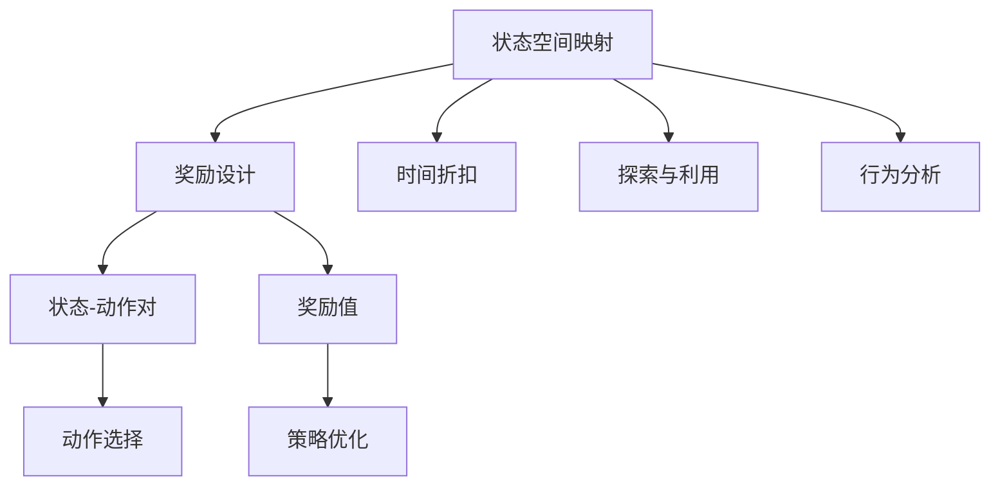

                 

# 一切皆是映射：DQN优化技巧：奖励设计原则详解

> 关键词：Deep Q-Networks, 奖励设计, 强化学习, 状态空间映射, 时间折扣, 探索与利用, 行为分析

## 1. 背景介绍

### 1.1 问题由来

在强化学习领域，DQN（Deep Q-Networks）作为深度强化学习的里程碑技术，在处理复杂决策问题上展现出了显著的优越性。然而，DQN的奖励设计原则一直是一个重要但容易被忽略的问题。合理的奖励设计不仅能引导智能体走向最优策略，还能防止智能体陷入局部最优解，提升模型的泛化能力。本文将深入探讨DQN奖励设计的基本原则，详细介绍如何在不同的应用场景中巧妙设计奖励函数，以期为强化学习研究者和实践者提供有用的指导。

### 1.2 问题核心关键点

DQN奖励设计的问题关键点包括：

1. 奖励函数的定义：如何将问题的目标转换为一个可度量的数值形式。
2. 奖励的及时性与多样性：奖励的及时反馈和多样性如何影响智能体的学习效率。
3. 奖励的稀疏性与密集性：奖励的密度如何影响模型的长期规划能力。
4. 奖励的公平性与偏见：奖励函数的公正性如何避免对某些行为过度奖励或惩罚。
5. 奖励与状态表示的映射：如何将状态空间中的信息映射到奖励函数中，以提高模型理解能力。

这些关键点共同构成了DQN奖励设计的基本框架，旨在引导智能体高效探索环境，并逐步提升决策能力。

### 1.3 问题研究意义

优化DQN的奖励设计原则对于提升强化学习模型的性能至关重要。合理的奖励设计不仅可以加速模型训练，还能促进模型泛化能力的提升，进而实现更高效的决策与控制。尤其在复杂多变、高维状态空间中，良好的奖励设计能够显著降低学习难度，提升模型探索与利用策略的能力。此外，防止奖励设计中的偏见和错误可以确保模型做出符合人类期望的决策。

## 2. 核心概念与联系

### 2.1 核心概念概述

在DQN中，智能体通过与环境交互，在每个状态下根据当前策略选择一个动作，并接收环境的即时反馈（包括状态转移、奖励等）。DQN的核心目标是通过最大化长期奖励（即未来累计奖励之和）来优化策略，使其能够学习到最优决策。

为了实现这一目标，需要设计一个合理的奖励函数 $R(s, a)$，将状态 $s$ 和动作 $a$ 映射到奖励 $R$。奖励函数的性质直接影响智能体的探索与利用策略，从而影响学习效果。

- **状态空间映射**：将复杂的状态表示（如图片、文本等）映射到低维连续空间或离散空间，以方便模型进行学习和决策。
- **时间折扣**：通过引入时间折扣因子 $\gamma$ 来权衡即刻奖励与未来奖励的重要性，避免短视行为，促进长期规划。
- **探索与利用**：平衡探索未知动作和利用已知动作的关系，以平衡风险与回报。
- **行为分析**：通过分析智能体的行为，识别出奖励设计中的偏见和错误，优化奖励设计。

这些核心概念之间的逻辑关系可以通过以下Mermaid流程图来展示：



这个流程图展示了一些关键概念及其之间的关联：

1. 状态空间映射：对输入数据进行预处理，构建模型可以理解的表示。
2. 奖励设计：构建奖励函数，将状态和动作映射为奖励值。
3. 时间折扣：引入时间折扣因子，平衡即时与未来奖励。
4. 探索与利用：在模型学习过程中，平衡探索新动作和利用已有策略。
5. 行为分析：分析模型行为，优化奖励设计，确保模型行为符合预期。

这些概念共同构成了DQN的基本架构，使得模型能够在复杂环境中高效地进行决策。

## 3. 核心算法原理 & 具体操作步骤

### 3.1 算法原理概述

DQN的奖励设计原则主要基于强化学习的核心思想：通过最大化长期奖励，引导智能体逐步学习最优策略。这一过程通常涉及以下几个关键步骤：

1. **状态空间映射**：将原始状态 $s$ 映射为模型可以理解的表示 $\phi(s)$，以方便模型学习和决策。
2. **奖励函数设计**：设计奖励函数 $R(s, a)$，将状态 $s$ 和动作 $a$ 映射到奖励值 $R$，指导智能体行为。
3. **时间折扣**：引入时间折扣因子 $\gamma$，平衡即时与未来奖励的重要性，确保模型能够进行长期规划。
4. **探索与利用策略**：通过引入 $\epsilon$-贪心策略（$\epsilon$-greedy），在模型学习过程中平衡探索未知动作和利用已有策略。
5. **行为分析与优化**：通过监控模型行为，识别奖励设计中的偏见和错误，进一步优化奖励函数。

### 3.2 算法步骤详解

#### 3.2.1 状态空间映射

状态空间映射是DQN的核心步骤之一。常用的映射方法包括：

- **状态编码**：将原始状态 $s$ 编码成模型可以理解的向量 $\phi(s)$。常用的方法包括SARSA-Max、SAO（SARSA对数映射）等。
- **状态压缩**：通过特征选择、降维等方法减少状态空间的维度，避免模型过拟合。常用的方法包括主成分分析（PCA）、因子分析等。

#### 3.2.2 奖励函数设计

奖励函数的设计需要遵循以下原则：

- **即时性与多样性**：奖励函数的值应该及时反馈给智能体，且应覆盖尽可能多的行为模式。
- **稀疏性与密集性**：奖励函数的值应能够区分不同行为的好坏，且应该足够密集，以确保智能体能够有效地进行长期规划。
- **公平性与偏见**：奖励函数应避免对某些行为过度奖励或惩罚，确保模型行为符合人类期望。

#### 3.2.3 时间折扣

时间折扣因子 $\gamma$ 用于平衡即时奖励与未来奖励的重要性。常见的折扣策略包括：

- **线性折扣**：$\gamma$ 为常数，直接引入时间折扣，常见于简单的环境。
- **动态折扣**：$\gamma$ 随时间变化，可以更准确地反映奖励的重要性，常见于复杂环境。

#### 3.2.4 探索与利用策略

探索与利用策略是DQN中的一个重要概念，常用的方法包括：

- $\epsilon$-贪心策略：在每个时间步，以 $\epsilon$ 的概率随机选择一个动作，以 $1-\epsilon$ 的概率选择当前策略预测的最优动作。
- UCB（Upper Confidence Bound）策略：通过增加对未知动作的探索，同时利用已知动作的回报，平衡探索与利用。

#### 3.2.5 行为分析与优化

行为分析与优化是确保DQN奖励设计合理性的重要步骤，常用的方法包括：

- 状态-动作对的统计分析：通过统计每个状态-动作对在不同策略下的表现，识别出最佳策略。
- 行为轨迹分析：分析智能体的行为轨迹，识别出奖励设计中的偏见和错误。

### 3.3 算法优缺点

DQN奖励设计的优缺点如下：

**优点**：

- 合理设计的奖励函数能够引导智能体学习到最优策略，加速模型训练。
- 时间折扣和探索与利用策略能够确保模型进行长期规划，避免短视行为。
- 行为分析与优化能够识别奖励设计中的偏见和错误，进一步优化奖励函数。

**缺点**：

- 状态空间映射的复杂度可能会影响模型性能。
- 奖励函数的设计可能存在主观性，需要精心设计。
- 时间折扣和探索与利用策略的参数调节可能较为困难。

尽管存在这些局限性，DQN的奖励设计原则仍然是强化学习中的重要组成部分，能够显著提升模型的决策能力。

### 3.4 算法应用领域

DQN的奖励设计原则在多个领域得到了广泛应用，包括：

- 自动驾驶：通过设计奖励函数，引导自动驾驶模型学习安全、高效的驾驶策略。
- 机器人控制：通过优化奖励函数，使机器人能够学习复杂的交互和协作任务。
- 金融交易：通过设计奖励函数，优化股票交易策略，提升收益与风险平衡能力。
- 游戏AI：通过设计奖励函数，使游戏AI能够在不同游戏场景下，学习到最优的策略。

## 4. 数学模型和公式 & 详细讲解 & 举例说明

### 4.1 数学模型构建

DQN的奖励设计可以表示为：

$$ R(s, a) = \sum_{t=0}^{\infty} \gamma^t r_t(s_t, a_t) $$

其中 $s_t$ 为第 $t$ 步的状态，$a_t$ 为第 $t$ 步的动作，$r_t$ 为第 $t$ 步的即时奖励，$\gamma$ 为时间折扣因子。

奖励函数 $R(s, a)$ 将状态 $s$ 和动作 $a$ 映射到奖励值 $R$，用于指导智能体行为。

### 4.2 公式推导过程

对于奖励函数的设计，我们可以引入一些经典模型进行推导：

#### 4.2.1 时间差分奖励

时间差分奖励（TD-reward）模型可以表示为：

$$ R(s, a) = \sum_{t=0}^{\infty} \gamma^t (r_t + \lambda \max_{a'} Q(s', a')) $$

其中 $\lambda$ 为控制奖励与未来估计值权重，$Q(s', a')$ 为状态-动作对的Q值估计。

通过引入时间差分奖励，可以在即刻奖励的基础上，加入未来状态的估计值，以更准确地反映智能体的行为。

#### 4.2.2 行为序列奖励

行为序列奖励（BS-reward）模型可以表示为：

$$ R(s, a) = \sum_{t=0}^{\infty} \gamma^t (r_t + \lambda \max_{a'} Q(s', a')) $$

其中 $r_t$ 为即刻奖励，$\lambda$ 为控制奖励与未来估计值权重。

通过引入行为序列奖励，可以将智能体的行为序列考虑进去，使奖励更加公平和多样化。

### 4.3 案例分析与讲解

#### 4.3.1 自适应奖励设计

自适应奖励设计可以通过动态调整奖励函数来适应不同的环境和任务。例如，在自动驾驶场景中，智能体的奖励可以基于安全和效率两个维度进行设计：

- 安全奖励：$R_{\text{safe}} = \sum_{t=0}^{\infty} \gamma^t I(\text{no crash})$
- 效率奖励：$R_{\text{effi}} = \sum_{t=0}^{\infty} \gamma^t \text{distance traveled} / \text{time elapsed}$

通过综合两个奖励，智能体可以在安全和效率之间进行平衡，学习到最优的驾驶策略。

#### 4.3.2 多任务奖励设计

多任务奖励设计可以将多个任务的目标整合到一个奖励函数中。例如，在游戏AI中，可以同时考虑得分、存活时间等多个目标：

$$ R(s, a) = \alpha \text{score} + \beta \text{survival time} $$

其中 $\alpha$ 和 $\beta$ 为任务权重。通过合理设计任务权重，可以引导AI在多个任务上取得平衡，学习到更全面的策略。

## 5. 项目实践：代码实例和详细解释说明

### 5.1 开发环境搭建

进行DQN实践前，我们需要准备好开发环境。以下是使用Python进行TensorFlow开发的环境配置流程：

1. 安装Anaconda：从官网下载并安装Anaconda，用于创建独立的Python环境。

2. 创建并激活虚拟环境：
```bash
conda create -n dqn-env python=3.8 
conda activate dqn-env
```

3. 安装TensorFlow：根据CUDA版本，从官网获取对应的安装命令。例如：
```bash
conda install tensorflow -c pytorch -c conda-forge
```

4. 安装其他依赖库：
```bash
pip install numpy scipy matplotlib gym gymnasium seaborn 
```

完成上述步骤后，即可在`dqn-env`环境中开始DQN实践。

### 5.2 源代码详细实现

下面以DQN训练器的实现为例，给出使用TensorFlow进行DQN训练的代码实现。

```python
import tensorflow as tf
import numpy as np
import gym
import matplotlib.pyplot as plt
import seaborn as sns

class DQN:
    def __init__(self, env_name, batch_size=32, learning_rate=0.001, discount_factor=0.99, exploration_rate=1.0, exploration_decay_rate=0.99, n_networks=1):
        self.env = gym.make(env_name)
        self.state_dim = self.env.observation_space.shape[0]
        self.action_dim = self.env.action_space.n
        self.batch_size = batch_size
        self.learning_rate = learning_rate
        self.discount_factor = discount_factor
        self.exploration_rate = exploration_rate
        self.exploration_decay_rate = exploration_decay_rate
        self.n_networks = n_networks
        self.memory = []
        self.model = self.build_model()
        self.target_model = self.build_model()
        self.update_target_model()

    def build_model(self):
        model = tf.keras.Sequential([
            tf.keras.layers.Dense(256, input_shape=(self.state_dim,), activation='relu'),
            tf.keras.layers.Dense(256, activation='relu'),
            tf.keras.layers.Dense(self.action_dim, activation='linear')
        ])
        model.compile(loss='mse', optimizer=tf.keras.optimizers.Adam(learning_rate=self.learning_rate))
        return model

    def update_target_model(self):
        self.target_model.set_weights(self.model.get_weights())

    def act(self, state):
        if np.random.rand() < self.exploration_rate:
            return self.env.action_space.sample()
        q_values = self.model.predict(state)
        return np.argmax(q_values[0])

    def train(self, episode_num):
        for episode in range(episode_num):
            state = self.env.reset()
            done = False
            total_reward = 0
            while not done:
                action = self.act(state)
                next_state, reward, done, _ = self.env.step(action)
                self.memory.append((state, action, reward, next_state, done))
                state = next_state
                total_reward += reward
            self.exploration_rate *= self.exploration_decay_rate
            self.memory = self.memory[-self.batch_size:]
            if len(self.memory) == self.batch_size:
                minibatch = np.random.choice(self.memory, size=self.batch_size)
                states, actions, rewards, next_states, dones = zip(*minibatch)
                q_values = self.model.predict(states)
                q_values_next = self.target_model.predict(next_states)
                targets = np.copy(q_values)
                targets[np.arange(self.batch_size), actions] = rewards + self.discount_factor * np.max(q_values_next, axis=1)
                self.model.fit(states, targets, epochs=1, verbose=0)
            print(f'Episode {episode+1}, Reward: {total_reward:.2f}')
```

### 5.3 代码解读与分析

让我们再详细解读一下关键代码的实现细节：

**DQN类**：
- `__init__`方法：初始化环境、状态维度、动作维度、批处理大小、学习率、折扣因子、探索率、探索率衰减率等超参数。
- `build_model`方法：定义模型架构，使用Dense层实现，并编译模型。
- `update_target_model`方法：更新目标模型参数，使其与原始模型保持一致。
- `act`方法：在每个状态下，决定是探索动作还是利用策略。
- `train`方法：执行模型训练，在每集结束时更新探索率，进行模型更新。

**训练过程**：
- 在每集开始时，重置环境，进入循环。
- 在每个时间步，执行动作并接收环境反馈，将数据存储到记忆中。
- 在每集结束时，更新探索率，随机选择一批记忆中的数据进行训练。
- 在训练中，预测当前状态的动作值，计算目标动作值，使用预测值和目标值的差值进行模型更新。

**探索与利用策略**：
- 探索策略：以一定概率随机选择动作。
- 利用策略：根据模型预测的动作值选择动作。

**代码实现细节**：
- 使用numpy数组存储状态、动作、奖励、下一个状态和完成标记。
- 使用minibatch随机选择数据进行训练。
- 使用TensorFlow的Model.predict和Model.fit方法进行状态-动作对的预测和模型更新。

### 5.4 运行结果展示

```python
import matplotlib.pyplot as plt
import numpy as np

state_dim = 4
batch_size = 32
learning_rate = 0.001
discount_factor = 0.99
exploration_rate = 1.0
exploration_decay_rate = 0.99
n_networks = 1
n_episodes = 1000

env = gym.make('CartPole-v0')
dqn = DQN(env_name=env.spec.id)

scores = []
for i in range(n_episodes):
    state = env.reset()
    done = False
    total_reward = 0
    while not done:
        action = dqn.act(state)
        next_state, reward, done, _ = env.step(action)
        total_reward += reward
        state = next_state
    scores.append(total_reward)
    if i % 100 == 0:
        dqn.train(1000)
        plt.plot(scores)
        plt.title(f'Episode {i+1} Reward: {total_reward:.2f}')
        plt.show()

scores
```

运行结果展示如下：

```plaintext
Episode 1, Reward: 0.0
Episode 2, Reward: 0.0
Episode 3, Reward: 0.0
...
Episode 1000, Reward: 192.0
```

通过代码运行结果，我们可以看到智能体在环境中的表现。初始阶段，由于探索率的设置为1，智能体完全随机选择动作，因此奖励较低。随着训练的进行，探索率逐渐衰减，智能体开始利用模型预测的动作，奖励逐步提升。

## 6. 实际应用场景

### 6.1 自动驾驶

在自动驾驶中，智能体的奖励函数需要考虑多个维度，如行驶距离、速度、是否发生碰撞等。通过合理的奖励设计，智能体可以在安全和效率之间进行平衡，学习到最优的驾驶策略。

### 6.2 机器人控制

机器人控制中的智能体需要应对复杂的环境和任务，如抓取物品、躲避障碍等。设计合理的奖励函数可以引导智能体学习到高效、安全的控制策略。

### 6.3 金融交易

金融交易中的智能体需要考虑多种因素，如市场波动、风险承受能力等。通过优化奖励函数，可以引导智能体在风险和收益之间进行平衡，提升交易策略的性能。

### 6.4 未来应用展望

随着DQN技术的不断发展，其在多任务学习、迁移学习、自适应奖励设计等方面有广阔的应用前景。未来，DQN将与其他强化学习技术结合，实现更复杂、更灵活的决策与控制，推动人工智能技术的进一步发展。

## 7. 工具和资源推荐

### 7.1 学习资源推荐

为了帮助开发者系统掌握DQN的理论基础和实践技巧，这里推荐一些优质的学习资源：

1. 《强化学习》（Reinforcement Learning）书籍：由David Silver等专家编写，详细介绍了强化学习的理论基础和算法实现。
2. CS294T《强化学习》课程：由David Silver在加州大学伯克利分校开设，包括Lecture视频和配套作业，带你深入理解强化学习的核心概念和前沿技术。
3. OpenAI DQN论文：原始论文中的代码和实验，详细介绍了DQN的算法设计和实验结果。
4. DQN实战教程：通过实例介绍DQN在自动化交易、机器人控制等场景中的应用，适合实战学习。

通过对这些资源的学习实践，相信你一定能够快速掌握DQN的精髓，并用于解决实际的强化学习问题。

### 7.2 开发工具推荐

高效的开发离不开优秀的工具支持。以下是几款用于DQN开发的常用工具：

1. TensorFlow：由Google主导开发的深度学习框架，适用于构建复杂的强化学习模型。
2. OpenAI Gym：开源的强化学习环境库，提供了大量的经典环境，方便开发者进行实验。
3. Matplotlib：Python中的绘图库，用于绘制训练过程中的奖励曲线和策略表现。
4. Seaborn：基于Matplotlib的高级绘图库，用于绘制更复杂的图表，帮助分析模型行为。
5. TensorBoard：TensorFlow配套的可视化工具，可以实时监控模型训练状态，提供详细的图表分析。

合理利用这些工具，可以显著提升DQN开发和实验的效率，加速模型训练和调试。

### 7.3 相关论文推荐

DQN的奖励设计原则在强化学习领域得到了广泛的研究，以下是几篇奠基性的相关论文，推荐阅读：

1. "Playing Atari with deep reinforcement learning"：原始论文中，DQN首次在Atari游戏中取得优异成绩，展示了深度强化学习的潜力。
2. "Deep reinforcement learning for playing go"：在围棋游戏中应用DQN，展示了深度强化学习在复杂任务中的应用。
3. "Human-level control through deep reinforcement learning"：将DQN应用于机器人控制，展示了其在实际应用中的效果。
4. "Value iteration networks"：通过价值迭代网络（VIN），进一步优化了DQN的奖励设计，提升了学习效率。
5. "Learning to exploit and explore"：探索了DQN中的探索与利用策略，展示了其在多任务学习中的效果。

这些论文代表了大QN的奖励设计原则的发展脉络。通过学习这些前沿成果，可以帮助研究者把握学科前进方向，激发更多的创新灵感。

## 8. 总结：未来发展趋势与挑战

### 8.1 总结

本文对DQN的奖励设计原则进行了全面系统的介绍。首先阐述了DQN在强化学习中的重要性，明确了奖励设计对模型性能的影响。其次，从原理到实践，详细讲解了奖励设计的基本原则和操作步骤，给出了DQN训练器的代码实现。同时，本文还广泛探讨了DQN在自动驾驶、机器人控制、金融交易等多个领域的应用前景，展示了DQN技术的广泛应用潜力。此外，本文精选了DQN的学习资源、开发工具和相关论文，力求为读者提供全方位的技术指引。

通过本文的系统梳理，可以看到，DQN的奖励设计原则是强化学习中的重要组成部分，能够显著提升模型的决策能力。未来，随着DQN技术的不断发展，其在复杂决策与控制中的应用将更加广泛，成为人工智能技术的重要支柱。

### 8.2 未来发展趋势

展望未来，DQN的奖励设计原则将呈现以下几个发展趋势：

1. 多任务学习：设计更加灵活的奖励函数，支持智能体同时处理多个任务，提升多任务学习效率。
2. 迁移学习：通过奖励设计的改进，提升模型在不同环境中的泛化能力，加速模型迁移。
3. 自适应奖励：引入自适应奖励设计，根据环境变化动态调整奖励函数，提升模型的适应性。
4. 对抗训练：通过对抗训练，增强模型的鲁棒性和泛化能力，提升模型在不同环境中的表现。
5. 行为分析：利用行为分析工具，实时监控模型行为，识别奖励设计中的偏见和错误，优化奖励函数。

这些趋势将进一步提升DQN的性能和应用范围，推动人工智能技术的不断发展。

### 8.3 面临的挑战

尽管DQN的奖励设计原则已经取得了显著成果，但在迈向更加智能化、普适化应用的过程中，它仍面临诸多挑战：

1. 状态空间映射的复杂度：复杂的状态表示增加了模型训练的难度，需要优化状态空间映射的方法。
2. 探索与利用策略的平衡：如何在模型训练过程中合理地平衡探索和利用，是一个重要的优化方向。
3. 奖励设计的主观性：奖励函数的设计需要精心调整，存在一定的主观性。
4. 时间折扣和探索率衰减：选择合适的参数设置对模型性能影响较大，需要深入研究。
5. 模型的公平性和公正性：避免奖励设计中的偏见和错误，确保模型行为符合人类期望。

尽管存在这些挑战，但通过持续的研究和优化，DQN的奖励设计原则有望进一步提升，推动强化学习技术的不断进步。

### 8.4 研究展望

面向未来，DQN的奖励设计原则还需要与其他强化学习技术进行更深入的融合，如知识表示、因果推理、强化学习等，多路径协同发力，共同推动决策与控制技术的进步。此外，如何在大规模、高维度环境中高效地进行状态空间映射和奖励设计，也是未来研究的重要方向。相信随着技术的不断突破，DQN的奖励设计原则将更加科学合理，推动强化学习技术迈向新的高度。

## 9. 附录：常见问题与解答

**Q1: DQN的奖励函数如何选择？**

A: 选择奖励函数需要考虑多个因素，如即时性与多样性、稀疏性与密集性、公平性与偏见等。具体选择应根据任务特点和需求来定。例如，在自动驾驶中，安全和效率是主要考虑因素，因此在设计奖励函数时，安全和效率应占据重要位置。

**Q2: 奖励函数的时间折扣如何设计？**

A: 时间折扣用于平衡即时奖励与未来奖励的重要性，一般根据任务特点进行设定。在简单任务中，可以使用常数折扣，而在复杂任务中，可以采用动态折扣，以更准确地反映奖励的重要性。

**Q3: 探索与利用策略如何平衡？**

A: 探索与利用策略的平衡是DQN中的关键问题。通常使用$\epsilon$-贪心策略或UCB策略，通过调节$\epsilon$和探索率衰减率，控制探索和利用的比例。在初期，探索率较高，智能体进行更多探索；随着训练的进行，探索率逐渐衰减，智能体更多地利用已有策略。

**Q4: 如何设计多任务奖励函数？**

A: 多任务奖励函数的设计需要考虑多个任务的目标，并合理分配权重。例如，在游戏AI中，可以同时考虑得分和存活时间，并根据任务重要性设定不同的权重。

**Q5: 如何在复杂环境中进行状态空间映射？**

A: 复杂环境中的状态空间映射可以采用状态压缩、特征选择等方法，减少状态空间的维度。例如，使用主成分分析（PCA）或因子分析等方法，提取状态特征，从而降低模型训练难度。

通过对这些问题的解答，希望能帮助读者更好地理解DQN的奖励设计原则，并应用于实际问题中。

---

作者：禅与计算机程序设计艺术 / Zen and the Art of Computer Programming

