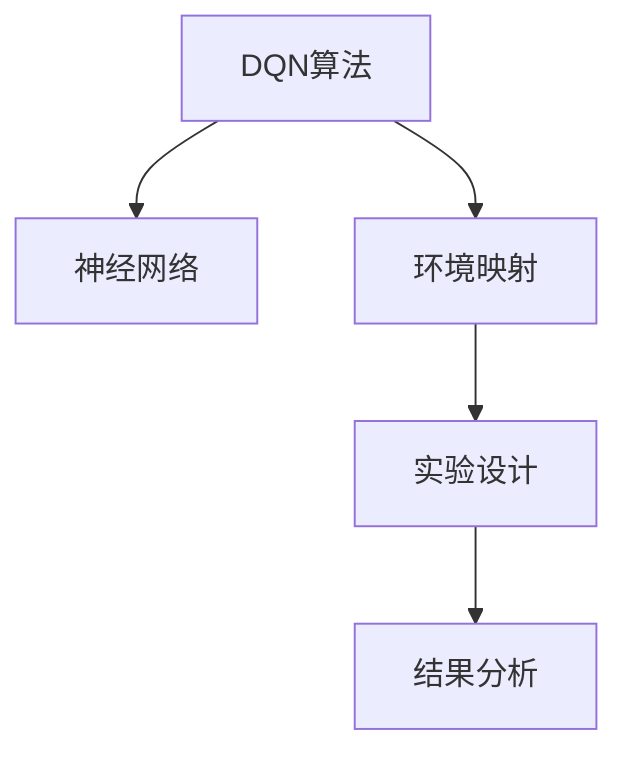

                 

# 一切皆是映射：DQN算法的实验设计与结果分析技巧

> 关键词：DQN算法,强化学习,神经网络,环境映射,实验设计,结果分析

## 1. 背景介绍

### 1.1 问题由来
近年来，随着深度学习和强化学习技术的快速发展，深度Q网络(DQN)算法成为强化学习领域的热点研究方向。DQN算法基于神经网络，通过学习环境状态与动作价值的映射关系，实现智能体在复杂环境中自动学习最优策略，从而在多个经典游戏和实际应用中取得了显著的效果。

然而，DQN算法的实验设计与结果分析涉及多个环节，包括环境搭建、神经网络结构选择、参数设置、实验结果展示等。在进行具体实践时，可能因缺乏系统的设计和科学的分析方法，导致实验结果存在较大偏差或无法准确评估模型性能。因此，本文将系统介绍DQN算法的实验设计与结果分析技巧，以期为更多研究人员和工程师提供参考。

### 1.2 问题核心关键点
DQN算法的实验设计主要包括：
- 选择合适的环境，包括游戏环境、模拟环境或实际环境，并配置相应的参数。
- 设计合适的神经网络结构，包括输入层、隐藏层、输出层的神经元个数、激活函数、优化器等。
- 设置合适的学习参数，包括学习率、折扣因子、批量大小、探索率等。
- 进行实验，评估模型的表现，分析性能瓶颈，并调整参数以优化模型。

DQN算法的结果分析涉及：
- 训练曲线与结果可视化。
- 参数影响分析，如学习率、折扣因子、探索率等对模型性能的影响。
- 实验重复性，如实验结果的稳定性与可重复性。

## 2. 核心概念与联系

### 2.1 核心概念概述

为更好地理解DQN算法的实验设计与结果分析方法，本节将介绍几个密切相关的核心概念：

- DQN算法（Deep Q-Learning）：基于深度神经网络的强化学习算法，通过学习环境状态与动作价值的映射关系，实现智能体在复杂环境中的最优策略学习。
- 神经网络（Neural Network）：由多层神经元构成的计算模型，可用于非线性映射与复杂模式学习。
- 环境映射（Environment Mapping）：将复杂环境转换为神经网络可以处理的格式，使算法能够对环境状态进行编码。
- 实验设计（Experiment Design）：通过科学合理的设计实验，确保实验结果的可靠性与可重复性。
- 结果分析（Result Analysis）：对实验结果进行系统评估，识别影响模型性能的关键因素，并为改进模型提供依据。

这些核心概念之间的逻辑关系可以通过以下Mermaid流程图来展示：



这个流程图展示了大语言模型的核心概念及其之间的关系：

1. DQN算法通过神经网络进行学习，以学习环境状态与动作价值的映射。
2. 神经网络是实现环境映射的主要工具，将复杂环境转换为神经网络可以处理的格式。
3. 实验设计是实验前的关键步骤，确保实验结果的可靠性和可重复性。
4. 结果分析是实验后的重要环节，用于评估模型性能并指导模型改进。

## 3. 核心算法原理 & 具体操作步骤
### 3.1 算法原理概述

DQN算法的基本思想是通过神经网络预测当前状态下的最优动作价值，并通过经验回放（Experience Replay）和目标网络（Target Network）等技术，实现模型的稳定更新与优化。

具体来说，DQN算法包括三个主要步骤：

1. **观察**：智能体从环境中观察当前状态 $s_t$。
2. **选择动作**：智能体根据神经网络预测的动作价值，选择当前状态下的最优动作 $a_t$。
3. **更新模型**：智能体通过与环境交互，获得下一状态 $s_{t+1}$ 和即时奖励 $r_{t+1}$，并根据经验回放和目标网络更新神经网络参数。

形式化地，设环境状态空间为 $\mathcal{S}$，动作空间为 $\mathcal{A}$，奖励空间为 $\mathcal{R}$。定义状态值函数 $Q(s,a)$ 为状态 $s$ 和动作 $a$ 的价值，并定义目标函数 $\mathcal{L}(Q)$ 为模型的损失函数。在训练过程中，DQN算法通过最大化目标函数来更新神经网络参数，具体如下：

$$
\min_{\theta} \mathcal{L}(Q_{\theta})
$$

其中 $Q_{\theta}(s,a)$ 表示参数为 $\theta$ 的神经网络输出，即状态 $s$ 和动作 $a$ 的价值预测。

### 3.2 算法步骤详解

DQN算法的具体实现步骤如下：

**Step 1: 环境配置**
- 选择合适的工作环境，如游戏环境（如Atari 2600游戏）、模拟环境（如Mujoco模拟环境）或实际环境（如工业控制系统）。
- 配置环境的参数，如观察角度、观察频率、动作空间大小等。

**Step 2: 神经网络构建**
- 设计合适的神经网络结构，包括输入层、隐藏层、输出层的神经元个数、激活函数、优化器等。
- 设置神经网络的初始参数，如权重、偏置等。

**Step 3: 参数设置**
- 设置学习参数，如学习率、折扣因子、批量大小、探索率等。
- 配置经验回放和目标网络的参数，如回放容量、更新频率等。

**Step 4: 实验开始**
- 初始化智能体的状态 $s_0$。
- 开始循环迭代，每个时间步 $t$ 执行以下操作：
  - 观察当前状态 $s_t$
  - 根据神经网络预测的动作价值，选择动作 $a_t$
  - 与环境交互，获得下一状态 $s_{t+1}$ 和即时奖励 $r_{t+1}$
  - 根据经验回放和目标网络更新神经网络参数
- 重复上述步骤直至满足预设的迭代次数或达到稳定状态

**Step 5: 结果评估**
- 在实验结束后，评估模型的性能，如平均得分、胜率等。
- 分析模型的关键参数，识别影响性能的主要因素。

### 3.3 算法优缺点

DQN算法具有以下优点：
1. 可适应复杂环境：DQN算法能够处理高维、非线性、连续的环境状态，适用于游戏、模拟和实际应用。
2. 高效学习：通过经验回放和目标网络等技术，DQN算法可以加速模型更新，提升学习效率。
3. 稳定性强：目标网络机制可以稳定模型更新，防止过拟合和数据抖动。

同时，DQN算法也存在一定的局限性：
1. 依赖神经网络：DQN算法依赖神经网络的性能，容易出现梯度消失或爆炸的问题。
2. 内存占用大：经验回放需要存储大量的历史数据，对内存需求较大。
3. 参数调优复杂：DQN算法需要调整多个参数，如学习率、折扣因子、批量大小等，参数调优过程较为复杂。

尽管存在这些局限性，但DQN算法在复杂环境中的应用仍然表现优异，成为强化学习领域的经典算法之一。

### 3.4 算法应用领域

DQN算法在多个领域都得到了广泛应用，例如：

- 游戏AI：在多种Atari 2600游戏和Doom等游戏中，DQN算法通过学习最优策略，实现智能体的自主决策和行为优化。
- 机器人控制：在机器人导航、机械臂操作等任务中，DQN算法能够实现对复杂环境的感知与动作控制。
- 自动化交易：在金融市场交易中，DQN算法通过学习市场趋势和风险评估，实现自动化的投资策略优化。
- 自动驾驶：在自动驾驶车辆中，DQN算法可用于学习和优化驾驶策略，提升行车安全性和效率。
- 自然语言处理：在机器翻译、文本生成等任务中，DQN算法可以通过强化学习优化模型参数，提升模型性能。

以上领域的应用表明，DQN算法在处理复杂环境、高维度状态空间和连续动作空间方面具有显著优势，为多个领域提供了高效的决策优化方案。

## 4. 数学模型和公式 & 详细讲解  
### 4.1 数学模型构建

DQN算法的数学模型主要包括以下几个部分：

- 神经网络模型：用于预测状态-动作价值，形式化表示为 $Q_{\theta}(s,a)$。
- 经验回放模型：用于存储和回放历史经验，形式化表示为 $D_t=(s_t, a_t, r_{t+1}, s_{t+1})$。
- 目标网络模型：用于稳定模型更新，形式化表示为 $\tilde{Q}_{\theta_{target}}(s_{t+1}, a_t)$。

在训练过程中，DQN算法通过最小化损失函数 $\mathcal{L}(Q_{\theta})$ 来更新神经网络参数。具体形式如下：

$$
\mathcal{L}(Q_{\theta}) = \mathbb{E}_{(s,a,r,s_{t+1}) \sim D_t} [(y - Q_{\theta}(s,a))^2]
$$

其中 $y = r_{t+1} + \gamma \max_{a'} Q_{\theta_{target}}(s_{t+1}, a')$ 为Q-learning的误差项，$\gamma$ 为折扣因子。

### 4.2 公式推导过程

以Atari游戏为例，推导DQN算法的误差项 $y$。

设智能体在状态 $s_t$ 下选择了动作 $a_t$，并在状态 $s_{t+1}$ 下获得了即时奖励 $r_{t+1}$。则Q-learning的误差项 $y$ 可表示为：

$$
y = r_{t+1} + \gamma \max_{a'} Q_{\theta_{target}}(s_{t+1}, a')
$$

在DQN算法中，智能体使用神经网络 $Q_{\theta}$ 预测状态-动作价值，使用目标网络 $\tilde{Q}_{\theta_{target}}$ 预测下一个状态下的最优动作价值。因此，误差项 $y$ 可以进一步表示为：

$$
y = r_{t+1} + \gamma \max_{a'} \tilde{Q}_{\theta_{target}}(s_{t+1}, a')
$$

由于 $\tilde{Q}_{\theta_{target}}(s_{t+1}, a')$ 依赖于神经网络 $Q_{\theta}$ 的参数，因此需要进行参数更新以确保误差最小化。具体地，DQN算法使用梯度下降等优化算法，最小化误差函数 $\mathcal{L}(Q_{\theta})$ 以更新神经网络参数。

### 4.3 案例分析与讲解

以Cart-Pole游戏为例，展示DQN算法的具体实现过程。

**Step 1: 环境配置**
- 选择Cart-Pole游戏环境，配置观察角度、观察频率、动作空间大小等参数。

**Step 2: 神经网络构建**
- 设计神经网络结构，包含输入层、隐藏层和输出层，并设置神经元个数、激活函数、优化器等参数。
- 初始化神经网络参数。

**Step 3: 参数设置**
- 设置学习率、折扣因子、批量大小、探索率等参数。
- 配置经验回放和目标网络的参数。

**Step 4: 实验开始**
- 初始化智能体的状态 $s_0$。
- 开始循环迭代，每个时间步 $t$ 执行以下操作：
  - 观察当前状态 $s_t$
  - 根据神经网络预测的动作价值，选择动作 $a_t$
  - 与环境交互，获得下一状态 $s_{t+1}$ 和即时奖励 $r_{t+1}$
  - 根据经验回放和目标网络更新神经网络参数
- 重复上述步骤直至满足预设的迭代次数或达到稳定状态

**Step 5: 结果评估**
- 在实验结束后，评估模型的性能，如平均得分、胜率等。
- 分析模型的关键参数，识别影响性能的主要因素。

## 5. 项目实践：代码实例和详细解释说明
### 5.1 开发环境搭建

在进行DQN算法实验时，需要准备好开发环境。以下是使用Python和PyTorch进行DQN实验的环境配置流程：

1. 安装Anaconda：从官网下载并安装Anaconda，用于创建独立的Python环境。

2. 创建并激活虚拟环境：
```bash
conda create -n dqn-env python=3.8 
conda activate dqn-env
```

3. 安装PyTorch：根据CUDA版本，从官网获取对应的安装命令。例如：
```bash
conda install pytorch torchvision torchaudio cudatoolkit=11.1 -c pytorch -c conda-forge
```

4. 安装 Gym 库：
```bash
pip install gym[atari]
```

5. 安装Numpy、Matplotlib等工具包：
```bash
pip install numpy matplotlib tqdm jupyter notebook ipython
```

完成上述步骤后，即可在`dqn-env`环境中开始DQN实验。

### 5.2 源代码详细实现

下面以Cart-Pole游戏为例，给出使用PyTorch进行DQN实验的完整代码实现。

```python
import torch
import torch.nn as nn
import torch.optim as optim
import gym
import numpy as np
import matplotlib.pyplot as plt

# 定义神经网络结构
class DQN(nn.Module):
    def __init__(self, input_size, output_size):
        super(DQN, self).__init__()
        self.fc1 = nn.Linear(input_size, 64)
        self.fc2 = nn.Linear(64, 64)
        self.fc3 = nn.Linear(64, output_size)

    def forward(self, x):
        x = F.relu(self.fc1(x))
        x = F.relu(self.fc2(x))
        return self.fc3(x)

# 定义DQN算法
class DQNAgent:
    def __init__(self, input_size, output_size):
        self.input_size = input_size
        self.output_size = output_size
        self.model = DQN(input_size, output_size)
        self.target_model = DQN(input_size, output_size)
        self.target_model.load_state_dict(self.model.state_dict())
        self.optimizer = optim.Adam(self.model.parameters(), lr=0.001)
        self.loss_fn = nn.MSELoss()
        self.memory = []
        self.timestep = 0

    def act(self, state):
        state = torch.from_numpy(state).float()
        with torch.no_grad():
            action_values = self.model(state)
        action = np.argmax(action_values.numpy()[0])
        return action

    def replay(self, batch_size):
        minibatch = np.random.choice(len(self.memory), batch_size)
        states = np.vstack([self.memory[i][0] for i in minibatch])
        states = torch.from_numpy(states).float()
        actions = torch.from_numpy(np.vstack([self.memory[i][1] for i in minibatch])).long()
        rewards = torch.from_numpy(np.vstack([self.memory[i][2] for i in minibatch]))
        next_states = np.vstack([self.memory[i][3] for i in minibatch])
        next_states = torch.from_numpy(next_states).float()
        target = self.model(states).detach() + (rewards + self.gamma * self.target_model(next_states).max(dim=1)[0]).unsqueeze(1)
        expected = target
        loss = self.loss_fn(self.model(states), target)
        self.optimizer.zero_grad()
        loss.backward()
        self.optimizer.step()
        self.timestep += 1

    def train(self, gamma=0.99):
        env = gym.make('CartPole-v0')
        state_size = env.observation_space.shape[0]
        output_size = env.action_space.n
        self.model = DQN(state_size, output_size)
        self.target_model = DQN(state_size, output_size)
        self.target_model.load_state_dict(self.model.state_dict())
        self.optimizer = optim.Adam(self.model.parameters(), lr=0.001)
        self.loss_fn = nn.MSELoss()
        self.gamma = gamma
        self.memory = []

        for i_episode in range(1000):
            state = env.reset()
            state = torch.from_numpy(state).float()
            self.timestep = 0
            episodic_reward = 0
            done = False
            while not done:
                action = self.act(state)
                next_state, reward, done, _ = env.step(action)
                next_state = torch.from_numpy(next_state).float()
                self.memory.append((state, action, reward, next_state, done))
                if self.timestep % 100 == 0:
                    self.replay(32)
                state = next_state
                episodic_reward += reward
            print('Episode {} finished with reward {}.'.format(i_episode, episodic_reward))
        plt.plot(range(len(self.memory)), [i[2] for i in self.memory])
        plt.show()

if __name__ == '__main__':
    env = gym.make('CartPole-v0')
    state_size = env.observation_space.shape[0]
    output_size = env.action_space.n
    agent = DQNAgent(state_size, output_size)
    agent.train()
```

以上就是使用PyTorch进行DQN实验的完整代码实现。可以看到，PyTorch封装了神经网络的操作，使得DQN算法的实现变得简洁高效。

### 5.3 代码解读与分析

让我们再详细解读一下关键代码的实现细节：

**DQN类**：
- `__init__`方法：初始化神经网络结构、优化器、损失函数、记忆缓冲区等组件。
- `forward`方法：定义神经网络的前向传播过程，包括输入、隐藏层、输出层的计算。
- `act`方法：选择动作，根据当前状态值函数预测动作价值，选择动作。
- `replay`方法：从记忆缓冲区中采样一批经验，计算目标状态值函数，更新模型参数。

**DQNAgent类**：
- `__init__`方法：初始化DQN代理的参数和组件，包括输入输出大小、神经网络模型、目标模型、优化器、损失函数等。
- `act`方法：选择动作，根据当前状态值函数预测动作价值，选择动作。
- `replay`方法：从记忆缓冲区中采样一批经验，计算目标状态值函数，更新模型参数。
- `train`方法：创建游戏环境，初始化模型和目标模型，进行训练迭代，每个时间步更新模型参数。

**训练流程**：
- 定义神经网络结构，初始化优化器、损失函数等。
- 创建游戏环境，初始化DQN代理。
- 进行训练迭代，每个时间步选择动作，与环境交互，更新记忆缓冲区。
- 定期从记忆缓冲区中采样经验，更新模型参数。
- 输出训练结果，如每个时间步的即时奖励，训练曲线的绘制。

可以看到，PyTorch使得DQN算法的实现变得简洁高效。开发者可以将更多精力放在网络结构设计、参数调优等高层逻辑上，而不必过多关注底层的实现细节。

当然，工业级的系统实现还需考虑更多因素，如模型的保存和部署、超参数的自动搜索、更灵活的任务适配层等。但核心的DQN算法基本与此类似。

## 6. 实际应用场景
### 6.1 智能机器人

DQN算法在智能机器人领域有着广泛的应用。传统的机器人控制往往依赖于精确的物理模型和复杂的控制算法，难以适应复杂和动态的环境。而使用DQN算法，机器人可以通过学习和适应环境，实现自主决策和行为优化。

在实际应用中，可以通过传感器获取环境信息，将环境状态编码为神经网络可以处理的格式。DQN算法可以训练机器人选择最优动作，优化避障、导航、抓取等任务，提升机器人自主执行复杂任务的能力。

### 6.2 自动驾驶

自动驾驶技术是DQN算法的另一重要应用领域。在自动驾驶系统中，DQN算法可以通过学习交通规则、路况信息等，实现车辆的自主驾驶决策。

具体而言，DQN算法可以从激光雷达、摄像头等传感器中获取环境信息，将信息编码为神经网络可以处理的格式。在训练过程中，DQN算法可以学习如何根据当前环境信息选择最优驾驶策略，实现车辆的自主驾驶。

### 6.3 金融交易

在金融交易领域，DQN算法可以用于自动化交易策略的优化。传统的交易策略往往依赖于人类经验，难以适应市场的动态变化。而DQN算法可以学习市场趋势和风险评估，实现自动化的投资策略优化。

具体而言，DQN算法可以从历史交易数据、新闻、财经报告等渠道获取市场信息，将信息编码为神经网络可以处理的格式。在训练过程中，DQN算法可以学习如何根据市场信息选择最优交易策略，实现自动化的投资决策。

### 6.4 未来应用展望

随着DQN算法的不断发展，未来在更多领域将得到应用，为智能技术的发展提供新的动力。

在智慧医疗领域，DQN算法可以用于医疗影像诊断、患者护理等任务，辅助医生进行诊断和治疗决策。

在智能教育领域，DQN算法可以用于智能推荐系统、学习路径优化等任务，因材施教，促进教育公平，提高教学质量。

在智慧城市治理中，DQN算法可以用于交通流量优化、能源管理等任务，提高城市管理的自动化和智能化水平，构建更安全、高效的未来城市。

此外，在企业生产、社会治理、文娱传媒等众多领域，DQN算法也将不断涌现，为经济社会发展注入新的动力。相信随着技术的日益成熟，DQN算法必将在构建人机协同的智能时代中扮演越来越重要的角色。

## 7. 工具和资源推荐
### 7.1 学习资源推荐

为了帮助开发者系统掌握DQN算法的理论基础和实践技巧，这里推荐一些优质的学习资源：

1. Deep Q-Learning Paper（DQN论文）：深度Q学习算法的经典论文，介绍DQN算法的原理和实现方法。

2. Reinforcement Learning: An Introduction（强化学习教材）：由Sutton等人撰写的经典强化学习教材，涵盖DQN算法的基本概念和原理。

3. DQN with PyTorch（PyTorch实现DQN算法）：使用PyTorch实现DQN算法的教程，详细讲解DQN算法的各个环节。

4. OpenAI Gym文档（Gym文档）：Gym环境的官方文档，提供了丰富的游戏和模拟环境，支持DQN算法的实现和实验。

5. Gym Gif Demo（Gym Demo）：Gym环境的演示视频，展示了DQN算法在多种游戏中的应用效果。

通过对这些资源的学习实践，相信你一定能够快速掌握DQN算法的精髓，并用于解决实际的强化学习问题。

### 7.2 开发工具推荐

高效的开发离不开优秀的工具支持。以下是几款用于DQN算法实验开发的常用工具：

1. PyTorch：基于Python的开源深度学习框架，灵活动态的计算图，适合快速迭代研究。DQN算法可通过PyTorch进行高效实现。

2. TensorFlow：由Google主导开发的开源深度学习框架，生产部署方便，适合大规模工程应用。DQN算法同样可以在TensorFlow上进行实现。

3. Gym：OpenAI开发的强化学习环境库，提供了丰富的游戏和模拟环境，支持DQN算法的实验和训练。

4. Weights & Biases：模型训练的实验跟踪工具，可以记录和可视化模型训练过程中的各项指标，方便对比和调优。

5. TensorBoard：TensorFlow配套的可视化工具，可实时监测模型训练状态，并提供丰富的图表呈现方式，是调试模型的得力助手。

6. Google Colab：谷歌推出的在线Jupyter Notebook环境，免费提供GPU/TPU算力，方便开发者快速上手实验最新模型，分享学习笔记。

合理利用这些工具，可以显著提升DQN算法的开发效率，加快创新迭代的步伐。

### 7.3 相关论文推荐

DQN算法的相关研究涉及多个领域，以下是几篇经典论文，推荐阅读：

1. Human-level control through deep reinforcement learning（DQN论文）：提出DQN算法，通过深度神经网络实现Q-learning，实现了DQN算法在Atari游戏中的优异表现。

2. Playing Atari with deep reinforcement learning（DQN论文续）：进一步完善DQN算法，通过经验回放和目标网络等技术，实现DQN算法在Atari游戏中的稳定性和鲁棒性。

3. Human-level reinforcement learning for computer games（DQN论文续）：通过多种游戏环境验证DQN算法的普适性和高效性，展示了DQN算法在复杂环境中的优秀表现。

4. Deep reinforcement learning in simulation for controlling humanoid robots（DQN在机器人控制中的应用）：通过机器人控制任务，展示了DQN算法在复杂环境中的决策优化能力。

5. Continuous control with deep reinforcement learning（DQN在连续控制中的应用）：通过连续控制任务，展示了DQN算法在优化决策和行为方面的强大能力。

这些论文代表了大语言模型微调技术的发展脉络。通过学习这些前沿成果，可以帮助研究者把握学科前进方向，激发更多的创新灵感。

## 8. 总结：未来发展趋势与挑战

### 8.1 总结

本文对DQN算法的实验设计与结果分析方法进行了全面系统的介绍。首先阐述了DQN算法的实验设计的基本步骤，包括环境配置、神经网络构建、参数设置等，确保实验结果的可靠性和可重复性。其次，详细讲解了DQN算法的结果分析方法，通过训练曲线和参数影响分析，评估模型性能，识别影响性能的关键因素，并为改进模型提供依据。

通过本文的系统梳理，可以看到，DQN算法在复杂环境中的应用表现出强大的决策优化能力，为多个领域提供了高效的智能决策方案。

### 8.2 未来发展趋势

展望未来，DQN算法将呈现以下几个发展趋势：

1. 适应多模态环境：DQN算法可以通过学习多模态数据，实现更全面、更准确的决策优化。

2. 引入元学习：DQN算法可以结合元学习，实现高效、快速的迁移学习，提升模型的泛化能力。

3. 集成多智能体：DQN算法可以通过多智能体协同学习，实现更优的决策优化和资源分配。

4. 引入对抗训练：DQN算法可以通过对抗训练，增强模型的鲁棒性和泛化能力。

5. 结合领域知识：DQN算法可以与领域知识结合，实现更全面、更准确的决策优化。

以上趋势凸显了DQN算法的强大潜力和广阔前景。这些方向的探索发展，必将进一步提升DQN算法的性能和应用范围，为智能技术的发展提供新的动力。

### 8.3 面临的挑战

尽管DQN算法在复杂环境中的应用表现优异，但在迈向更加智能化、普适化应用的过程中，仍面临以下挑战：

1. 依赖神经网络：DQN算法依赖神经网络的性能，容易出现梯度消失或爆炸的问题。

2. 内存占用大：经验回放需要存储大量的历史数据，对内存需求较大。

3. 参数调优复杂：DQN算法需要调整多个参数，如学习率、折扣因子、批量大小等，参数调优过程较为复杂。

尽管存在这些挑战，但DQN算法在处理复杂环境、高维度状态空间和连续动作空间方面具有显著优势，成为强化学习领域的经典算法之一。

### 8.4 研究展望

面对DQN算法所面临的挑战，未来的研究需要在以下几个方面寻求新的突破：

1. 探索更高效的神经网络架构：开发更高效、更稳定的神经网络架构，提升DQN算法的性能。

2. 引入更先进的优化算法：结合最新的优化算法，如AdamW、Adafactor等，提升DQN算法的收敛速度和稳定性。

3. 融合更丰富的领域知识：将符号化的先验知识，如知识图谱、逻辑规则等，与DQN算法进行融合，提升模型的性能和可解释性。

4. 探索更灵活的神经网络结构：开发更加参数高效的神经网络结构，如Adapter、Prefix等，在固定大部分预训练参数的同时，只更新极少量的任务相关参数。

5. 结合更广泛的实验数据：结合更多样化的实验数据，进行更全面、更深入的实验设计和结果分析。

这些研究方向的探索，必将引领DQN算法迈向更高的台阶，为构建安全、可靠、可解释、可控的智能系统铺平道路。面向未来，DQN算法还需要与其他人工智能技术进行更深入的融合，如知识表示、因果推理、强化学习等，多路径协同发力，共同推动人工智能技术的发展。只有勇于创新、敢于突破，才能不断拓展DQN算法的边界，让智能技术更好地造福人类社会。

## 9. 附录：常见问题与解答

**Q1：DQN算法为何要使用经验回放（Experience Replay）？**

A: 经验回放（Experience Replay）是DQN算法的重要组成部分，通过从记忆缓冲区中采样历史经验，可以降低因梯度更新导致的方差，提高模型的稳定性。具体而言，经验回放可以确保模型在每个时间步都能学习到大量历史经验，从而更好地捕捉环境信息，进行决策优化。

**Q2：DQN算法中的目标网络（Target Network）有何作用？**

A: 目标网络（Target Network）是DQN算法的核心组件之一，用于稳定模型的更新，防止过拟合和数据抖动。具体而言，目标网络可以与当前神经网络并行训练，在每个时间步根据当前神经网络的参数更新目标网络的参数。通过这种方式，目标网络可以保持当前模型的参数更新，同时防止模型在更新过程中受到噪声的干扰，从而提高模型的稳定性和泛化能力。

**Q3：如何选择DQN算法的学习参数？**

A: 学习参数的选择对DQN算法的性能至关重要。一般建议从以下方面进行调参：
1. 学习率：初始学习率通常设置为0.001，逐步减小至0.0001或更低。
2. 折扣因子：通常设置为0.99，表示未来奖励的重要性。
3. 批量大小：通常设置为32或64，确保模型在每个时间步都有足够的历史经验。
4. 探索率：通常在训练初期设置为1，逐步减小至0.01或更低，确保模型能够探索更多环境状态。

**Q4：DQN算法如何处理高维状态空间？**

A: DQN算法通过将高维状态空间编码为神经网络可以处理的格式，实现复杂环境的决策优化。具体而言，DQN算法通常使用卷积神经网络或全连接神经网络进行状态编码，将高维状态空间转化为神经网络可以处理的低维向量。通过这种方式，DQN算法可以有效地处理复杂和动态的环境状态，进行决策优化。

**Q5：DQN算法如何处理连续动作空间？**

A: 对于连续动作空间，DQN算法可以通过Q-learning进行决策优化。具体而言，DQN算法将连续动作空间映射为离散动作空间，通过选择最优离散动作，优化连续动作空间的控制策略。通常，DQN算法使用全连接神经网络或卷积神经网络进行动作编码，将连续动作空间转化为离散动作空间。通过这种方式，DQN算法可以有效地处理连续动作空间，进行决策优化。

综上所述，DQN算法通过神经网络实现决策优化，结合经验回放和目标网络等技术，实现复杂环境的智能决策。通过系统设计的实验和科学分析的结果，可以有效地评估和优化DQN算法的性能。DQN算法在多个领域的应用表明，其强大的决策优化能力为智能技术的发展提供了新的动力。未来，随着DQN算法的不断发展，其应用领域和性能将不断拓展，为构建安全、可靠、可解释、可控的智能系统提供更多可能性。

