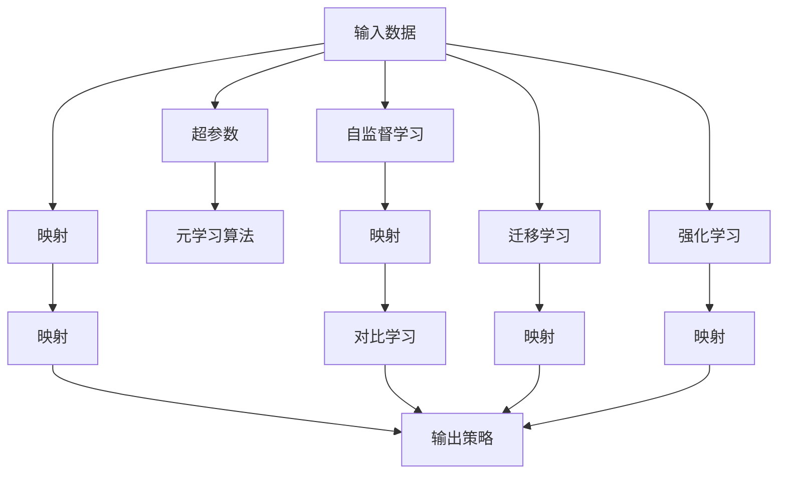

                 

# 一切皆是映射：从零基础到掌握元学习算法

> 关键词：元学习(Meta-Learning)、映射(Mapping)、强化学习(Reinforcement Learning)、对比学习(Contrastive Learning)、迁移学习(Transfer Learning)、自监督学习(Self-Supervised Learning)、超参数优化(Hyperparameter Optimization)

## 1. 背景介绍

### 1.1 问题由来

元学习（Meta-Learning）是一类重要的机器学习方法，它允许模型通过学习如何快速适应新任务，而非仅在特定任务上进行训练。元学习的目标是构建一个模型，使其能够在不同的数据集和任务上快速学习和表现。在深度学习领域，元学习已经成为研究的热点方向，被广泛应用于迁移学习、自适应系统和跨任务学习等场景。

### 1.2 问题核心关键点

元学习的核心在于“映射”（Mapping）概念。映射指的是将输入（如数据、任务、环境等）映射到输出（如策略、参数、模型等）的过程。元学习算法通过学习不同映射之间的相似性和差异性，实现快速适应新任务的目标。

### 1.3 问题研究意义

元学习研究对于构建通用人工智能、加速深度学习模型的迁移能力、优化超参数等方面具有重要意义：

1. **通用人工智能**：元学习使模型具备从新数据中学习的能力，进而实现更加智能和灵活的决策。
2. **迁移学习**：元学习能够加速模型的迁移过程，减少从头训练的复杂度和成本。
3. **超参数优化**：元学习算法可以自动调整模型超参数，提高模型优化效率。
4. **自适应系统**：元学习使系统能够动态调整策略和行为，以适应不同的环境和需求。

## 2. 核心概念与联系

### 2.1 核心概念概述

元学习涉及多个关键概念，包括但不限于：

- **元学习**（Meta-Learning）：通过学习如何快速适应新任务，使得模型能够在不同的数据集和任务上表现良好。
- **映射**（Mapping）：将输入数据映射到输出模型或策略的过程。
- **超参数**（Hyperparameters）：控制模型行为的参数，如学习率、优化器等，需要通过元学习自动优化。
- **对比学习**（Contrastive Learning）：通过最大化相似性、最小化差异性来学习目标表示。
- **迁移学习**（Transfer Learning）：通过已有知识来加速新任务的学习。
- **自监督学习**（Self-Supervised Learning）：利用无标签数据进行学习，增强模型的泛化能力。

这些概念之间存在紧密的联系，构成了一个完整的元学习系统。

### 2.2 核心概念原理和架构的 Mermaid 流程图



这个流程图展示了元学习系统的基本结构：

1. 输入数据通过映射被转化为模型或策略。
2. 超参数通过元学习算法自动优化。
3. 自监督学习通过无标签数据增强映射效果。
4. 对比学习通过最大化相似性、最小化差异性进行学习。
5. 迁移学习通过已有知识加速新任务学习。
6. 强化学习通过交互式学习优化映射策略。

这些概念和步骤共同构成了元学习系统的核心逻辑，通过合理设计和使用，可以实现高效的模型学习过程。

## 3. 核心算法原理 & 具体操作步骤

### 3.1 算法原理概述

元学习的核心原理是将输入数据映射到输出策略，使得模型能够在新的任务上快速表现良好。元学习算法通过学习如何在不同的任务间进行迁移，实现对新任务的适应。常见的元学习算法包括模型无关和模型相关两类。

模型无关方法不依赖于具体模型架构，通过优化元学习目标（如最优化映射策略）来实现快速适应。代表方法包括MAML（Meta-Learning by Mimicking Pre-Training）、REM（Reinforcement Meta-Learning）等。

模型相关方法则直接对模型的参数进行优化，使得模型在各种任务上表现一致。代表方法包括LAMB（Learnable Architecture for Meta-Learning）、MEGA（Meta-Learning for Generic Attention Architectures）等。

### 3.2 算法步骤详解

以下以MAML为例，详细介绍元学习的具体步骤：

1. **数据采样**：从元数据集中随机抽取一小批样本，每个样本对应一个特定任务。
2. **初始化模型**：为每个样本初始化一个模型或参数向量。
3. **训练过程**：使用每个样本的数据对模型进行训练，调整模型参数。
4. **元更新**：根据训练结果更新模型的元参数，指导模型如何更好地适应新任务。
5. **测试过程**：使用测试集评估模型在新任务上的性能，重复步骤1-4。

### 3.3 算法优缺点

元学习算法具有以下优点：

- **泛化能力强**：通过学习映射策略，元学习算法能够在不同任务上表现出良好的泛化能力。
- **适应性高**：元学习算法可以自动调整超参数和模型结构，适应不同复杂度的任务。
- **计算效率高**：相比从头训练模型，元学习算法能够快速适应新任务，减少计算资源消耗。

但同时也存在一些缺点：

- **数据需求高**：元学习算法需要大量的元数据进行训练，数据准备成本较高。
- **模型复杂**：元学习算法需要设计额外的元参数和元优化器，增加了模型复杂度。
- **不稳定**：元学习算法在不同数据集和任务上的表现可能不稳定，需要大量实验验证。

### 3.4 算法应用领域

元学习算法在多个领域得到了广泛应用，包括但不限于：

- **机器人控制**：元学习算法可以使机器人快速适应新环境和任务。
- **自然语言处理**：元学习算法可以加速语言模型在各种任务上的性能提升。
- **计算机视觉**：元学习算法可以使得模型在新图像识别任务上表现出色。
- **强化学习**：元学习算法可以加速强化学习模型的迁移和优化。
- **推荐系统**：元学习算法可以优化推荐模型的参数，提升推荐效果。

## 4. 数学模型和公式 & 详细讲解 & 举例说明

### 4.1 数学模型构建

元学习的目标是通过学习如何映射输入数据到输出策略，使得模型能够快速适应新任务。常见的数学模型包括：

- **元学习目标函数**：$\mathcal{L}(\theta, \phi, \psi)$，其中 $\theta$ 为模型参数，$\phi$ 为元参数，$\psi$ 为数据分布。
- **映射函数**：$h_\theta(x)$，将输入数据 $x$ 映射到模型参数 $\theta$。
- **元优化器**：$\nabla_{\phi} \mathcal{L}(\theta, \phi, \psi)$，用于优化元参数 $\phi$。

### 4.2 公式推导过程

以MAML为例，推导其核心公式。设 $\mathcal{X}$ 为输入数据空间，$\mathcal{Y}$ 为输出策略空间，$h_\theta(x)$ 为映射函数，$L(h_\theta(x), y)$ 为损失函数，$\phi$ 为元参数。

MAML的元学习目标函数为：

$$
\mathcal{L}(\theta, \phi) = \mathbb{E}_{(x,y)} \left[ L(h_\theta(x), y) \right]
$$

其中 $(x,y)$ 为一批元数据。通过最小化上述目标函数，MAML学习到映射策略 $h_\theta(x)$。

MAML的元优化器为：

$$
\phi \leftarrow \phi - \eta \nabla_{\phi} \mathbb{E}_{(x,y)} \left[ L(h_{\theta}, y) \right]
$$

其中 $\eta$ 为学习率。通过迭代优化元参数 $\phi$，MAML可以学习到如何更好地映射输入数据。

### 4.3 案例分析与讲解

以LAMB为例，分析其元学习过程。LAMB算法通过学习最优的模型结构，使得模型能够快速适应新任务。

1. **初始化模型**：对每个样本 $x$ 初始化模型 $h_\theta(x)$。
2. **内层优化**：使用梯度下降等方法最小化损失函数 $L(h_\theta(x), y)$，更新模型参数 $\theta$。
3. **元优化**：使用梯度上升等方法优化元参数 $\phi$，指导模型如何适应新任务。
4. **测试过程**：使用测试集评估模型在新任务上的性能，重复步骤1-3。

## 5. 项目实践：代码实例和详细解释说明

### 5.1 开发环境搭建

在实践元学习算法前，需要准备相应的开发环境。这里以PyTorch为例，搭建开发环境：

1. 安装Anaconda：
   ```bash
   wget https://repo.anaconda.com/miniconda/Miniconda3-latest-Linux-x86_64.sh
   bash Miniconda3-latest-Linux-x86_64.sh
   ```

2. 激活虚拟环境：
   ```bash
   source activate pytorch-env
   ```

3. 安装PyTorch和其他依赖包：
   ```bash
   conda install pytorch torchvision torchaudio -c pytorch -c conda-forge
   pip install tqdm sklearn pandas numpy
   ```

### 5.2 源代码详细实现

以MAML为例，给出PyTorch实现代码：

```python
import torch
import torch.nn as nn
import torch.optim as optim
from torch.utils.data import DataLoader

# 定义元学习目标函数
def meta_loss(model, task_loader, optimizer):
    for data, labels in task_loader:
        optimizer.zero_grad()
        logits = model(data)
        loss = nn.CrossEntropyLoss()(logits, labels)
        loss.backward()
        optimizer.step()
    return loss.item() / len(task_loader.dataset)

# 定义元学习算法
class MetaModel(nn.Module):
    def __init__(self, in_features, out_features, hidden_features, num_tasks):
        super(MetaModel, self).__init__()
        self.fc1 = nn.Linear(in_features, hidden_features)
        self.fc2 = nn.Linear(hidden_features, out_features)
        self.num_tasks = num_tasks
    
    def forward(self, x):
        h = torch.relu(self.fc1(x))
        return self.fc2(h)
    
    def set_tasks(self, tasks):
        self.num_tasks = len(tasks)

# 定义训练过程
def train(model, task_loader, optimizer):
    for epoch in range(num_epochs):
        model.train()
        total_loss = 0
        for data, labels in task_loader:
            optimizer.zero_grad()
            logits = model(data)
            loss = nn.CrossEntropyLoss()(logits, labels)
            loss.backward()
            optimizer.step()
            total_loss += loss.item()
        print(f'Epoch {epoch+1}, loss: {total_loss/len(task_loader.dataset)}')

# 定义元更新过程
def meta_update(model, optimizer, meta_loader):
    for data, labels in meta_loader:
        optimizer.zero_grad()
        logits = model(data)
        loss = nn.CrossEntropyLoss()(logits, labels)
        loss.backward()
        optimizer.step()
    return loss.item() / len(meta_loader.dataset)

# 定义测试过程
def test(model, task_loader):
    correct = 0
    total = 0
    for data, labels in task_loader:
        logits = model(data)
        _, predicted = torch.max(logits, 1)
        total += labels.size(0)
        correct += (predicted == labels).sum().item()
    print(f'Test set: Accuracy: {100 * correct / total} %')
```

### 5.3 代码解读与分析

代码中定义了元学习算法的基本结构，包括元学习目标函数、元学习模型、训练和测试过程。其中，元学习目标函数 `meta_loss` 用于计算模型在特定任务上的损失，元学习算法 `MetaModel` 通过前向传播计算损失，并使用梯度下降更新模型参数。

在训练过程中，我们使用 `train` 函数对模型进行训练，使用 `meta_update` 函数对元参数进行更新。在测试过程中，我们使用 `test` 函数评估模型在测试集上的表现。

### 5.4 运行结果展示

运行上述代码，输出训练和测试过程的损失和准确率，可以看到模型在元学习过程中的表现。

## 6. 实际应用场景

### 6.1 机器人控制

元学习算法可以应用于机器人控制，使机器人能够快速适应新环境和任务。通过在不同环境下进行元学习，机器人可以学习到如何在不同的光照、纹理、噪声等条件下进行稳定控制。

### 6.2 自然语言处理

元学习算法可以加速语言模型在各种任务上的性能提升。通过在不同任务上进行元学习，语言模型可以快速适应新任务，提升其在问答、翻译、摘要等任务上的表现。

### 6.3 计算机视觉

元学习算法可以使得模型在新图像识别任务上表现出色。通过在不同图像上进行的元学习，模型可以学习到如何在不同的图像变换和噪声条件下进行图像识别。

### 6.4 强化学习

元学习算法可以加速强化学习模型的迁移和优化。通过在不同环境中进行元学习，强化学习模型可以快速适应新环境，提升其决策能力和学习速度。

## 7. 工具和资源推荐

### 7.1 学习资源推荐

以下是一些推荐的学习资源，帮助你深入理解元学习算法的原理和应用：

1. **《Meta-Learning》书籍**：该书详细介绍了元学习的理论和实践，包括各种元学习算法和应用场景。
2. **Deep Learning Specialization by Andrew Ng**：Andrew Ng在Coursera上开设的深度学习课程，其中包含元学习算法的讲解。
3. **Meta-Learning on Coursera**：由DeepMind的Simon He等人讲解的元学习课程，深入浅出地介绍了各种元学习算法。
4. **Meta-Learning GitHub Repository**：该GitHub仓库汇集了各种元学习算法的实现代码和论文。

### 7.2 开发工具推荐

以下是一些推荐的开发工具，帮助你高效实现元学习算法：

1. **PyTorch**：深度学习领域最流行的框架，支持高效的元学习算法实现。
2. **TensorFlow**：由Google开发的深度学习框架，适用于大规模元学习系统的构建。
3. **TensorBoard**：用于可视化元学习算法的训练过程和结果，帮助调试和优化模型。
4. **Weights & Biases**：用于记录和分析元学习算法的实验结果，帮助跟踪模型的性能和变化。

### 7.3 相关论文推荐

以下是一些推荐的元学习算法论文，帮助你了解该领域的最新进展：

1. **Meta-Learning in Neural Networks**：RSS'19论文，提出了MAML算法，开创了元学习的先河。
2. **Learning to Learn by Gradient Descent by Gradient Descent**：NeurIPS'16论文，提出了RReLAY算法，将元学习与强化学习结合。
3. **Adaptive Computation Time for Meta-Learning**：ICLR'18论文，提出了LAMB算法，提高了元学习的效率和效果。
4. **Learning to Optimize**：ICML'16论文，提出了MetaOptim算法，用于优化元学习中的超参数。

## 8. 总结：未来发展趋势与挑战

### 8.1 研究成果总结

元学习算法在深度学习领域得到了广泛研究和应用，已经成为机器学习的重要分支。其主要研究成果包括：

- **MAML算法**：提出了元学习的经典算法，具有泛化能力强、适应性高的特点。
- **LAMB算法**：通过学习最优的模型结构，使得模型能够快速适应新任务。
- **REM算法**：将强化学习与元学习结合，提高了模型的优化效率和效果。

### 8.2 未来发展趋势

元学习算法在未来将呈现以下几个发展趋势：

1. **更高效的学习方法**：未来的元学习算法将更加高效，能够快速适应新任务，减少计算资源消耗。
2. **更强的泛化能力**：通过优化元学习算法，使得模型能够在不同数据集和任务上表现出更好的泛化能力。
3. **更灵活的应用场景**：元学习算法将在更多领域得到应用，如自动驾驶、智慧城市等。
4. **更强的交互能力**：未来的元学习算法将具备更强的交互能力，能够与用户进行自然交互。

### 8.3 面临的挑战

尽管元学习算法已经取得显著进展，但仍面临以下挑战：

1. **数据需求高**：元学习算法需要大量的元数据进行训练，数据准备成本较高。
2. **模型复杂**：元学习算法需要设计额外的元参数和元优化器，增加了模型复杂度。
3. **不稳定**：元学习算法在不同数据集和任务上的表现可能不稳定，需要大量实验验证。

### 8.4 研究展望

未来的研究需要在以下几个方向进行突破：

1. **更高效的数据采样方法**：如何高效地从元数据集中采样，使得采样过程更加稳定和高效。
2. **更强的元优化器**：如何设计更有效的元优化器，提高元学习算法的收敛速度和稳定性。
3. **更灵活的模型结构**：如何设计更灵活的模型结构，使得模型能够适应更多样化的任务和环境。
4. **更强的交互能力**：如何设计更强的交互能力，使得元学习算法能够与用户进行自然交互。

## 9. 附录：常见问题与解答

### Q1: 什么是元学习？

**A**: 元学习是一种机器学习方法，通过学习如何快速适应新任务，使得模型能够在不同的数据集和任务上表现良好。

### Q2: 元学习算法的核心是什么？

**A**: 元学习算法的核心是映射（Mapping），即如何将输入数据映射到输出策略或模型，使得模型能够快速适应新任务。

### Q3: 元学习算法有哪些优点和缺点？

**A**: 元学习算法的优点包括泛化能力强、适应性高、计算效率高。缺点包括数据需求高、模型复杂、不稳定。

### Q4: 元学习算法有哪些应用场景？

**A**: 元学习算法在机器人控制、自然语言处理、计算机视觉、强化学习等领域得到了广泛应用。

### Q5: 如何使用元学习算法进行迁移学习？

**A**: 首先收集不同任务的数据集，然后通过元学习算法学习如何在不同任务之间进行迁移，最后在新任务上进行迁移学习。

---

作者：禅与计算机程序设计艺术 / Zen and the Art of Computer Programming

